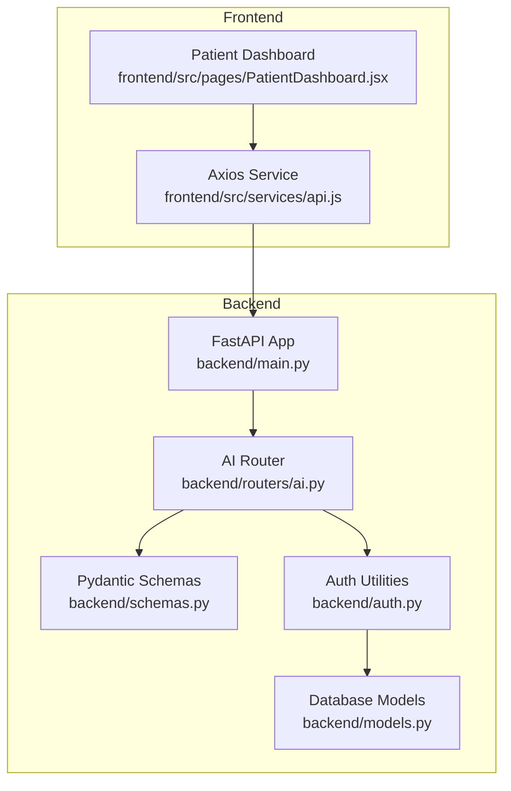
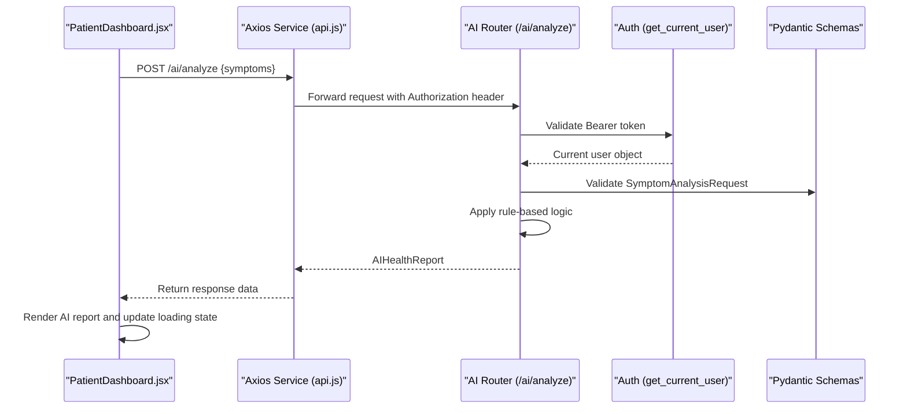
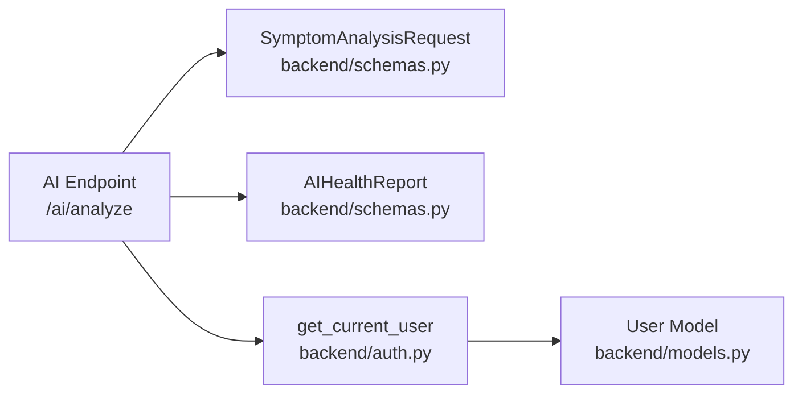

# AI API Integration

<cite>
**Referenced Files in This Document**
- [backend/main.py](file://backend/main.py)
- [backend/routers/ai.py](file://backend/routers/ai.py)
- [backend/schemas.py](file://backend/schemas.py)
- [backend/auth.py](file://backend/auth.py)
- [backend/models.py](file://backend/models.py)
- [frontend/src/services/api.js](file://frontend/src/services/api.js)
- [frontend/src/pages/PatientDashboard.jsx](file://frontend/src/pages/PatientDashboard.jsx)
</cite>

## Table of Contents
1. [Introduction](#introduction)
2. [Project Structure](#project-structure)
3. [Core Components](#core-components)
4. [Architecture Overview](#architecture-overview)
5. [Detailed Component Analysis](#detailed-component-analysis)
6. [Dependency Analysis](#dependency-analysis)
7. [Performance Considerations](#performance-considerations)
8. [Troubleshooting Guide](#troubleshooting-guide)
9. [Conclusion](#conclusion)
10. [Appendices](#appendices)

## Introduction
This document provides comprehensive documentation for the AI health assistant API integration. It covers the /ai/analyze endpoint specification, request/response schemas, authentication requirements, frontend integration patterns, error handling, and loading state management. It also outlines optional authentication, user session handling, access control considerations, and performance optimization strategies for concurrent AI analysis requests.

## Project Structure
The AI integration spans the backend FastAPI application and the frontend React client. The backend exposes the AI endpoint under the /ai namespace and defines Pydantic models for request and response schemas. The frontend integrates with the backend via an Axios service that injects authentication tokens and renders AI analysis results.

**Diagram sources**
- [backend/main.py](file://backend/main.py#L1-L61)
- [backend/routers/ai.py](file://backend/routers/ai.py#L1-L90)
- [backend/schemas.py](file://backend/schemas.py#L140-L162)
- [backend/auth.py](file://backend/auth.py#L1-L120)
- [backend/models.py](file://backend/models.py#L1-L110)
- [frontend/src/services/api.js](file://frontend/src/services/api.js#L1-L25)
- [frontend/src/pages/PatientDashboard.jsx](file://frontend/src/pages/PatientDashboard.jsx#L1-L674)

**Section sources**
- [backend/main.py](file://backend/main.py#L1-L61)
- [backend/routers/ai.py](file://backend/routers/ai.py#L1-L90)
- [backend/schemas.py](file://backend/schemas.py#L140-L162)
- [backend/auth.py](file://backend/auth.py#L1-L120)
- [backend/models.py](file://backend/models.py#L1-L110)
- [frontend/src/services/api.js](file://frontend/src/services/api.js#L1-L25)
- [frontend/src/pages/PatientDashboard.jsx](file://frontend/src/pages/PatientDashboard.jsx#L1-L674)

## Core Components
- AI Endpoint: POST /ai/analyze
- Request Schema: SymptomAnalysisRequest
- Response Schema: AIHealthReport
- Authentication: Optional for demo; currently enforced in backend
- Frontend Integration: Axios service with Bearer token injection; PatientDashboard handles UI rendering and loading states

**Section sources**
- [backend/routers/ai.py](file://backend/routers/ai.py#L10-L88)
- [backend/schemas.py](file://backend/schemas.py#L140-L162)
- [backend/auth.py](file://backend/auth.py#L39-L55)
- [frontend/src/services/api.js](file://frontend/src/services/api.js#L10-L22)
- [frontend/src/pages/PatientDashboard.jsx](file://frontend/src/pages/PatientDashboard.jsx#L102-L114)

## Architecture Overview
The AI analysis flow involves the frontend sending a request to the backend’s /ai/analyze endpoint. The backend validates the request against Pydantic models, optionally authenticates the user, applies rule-based logic to derive a health report, and returns a structured response.

**Diagram sources**
- [frontend/src/pages/PatientDashboard.jsx](file://frontend/src/pages/PatientDashboard.jsx#L102-L114)
- [frontend/src/services/api.js](file://frontend/src/services/api.js#L10-L22)
- [backend/routers/ai.py](file://backend/routers/ai.py#L10-L88)
- [backend/auth.py](file://backend/auth.py#L39-L55)
- [backend/schemas.py](file://backend/schemas.py#L140-L162)

## Detailed Component Analysis

### AI Endpoint Specification
- Method: POST
- Path: /ai/analyze
- Authentication: Optional in router definition; enforced via dependency
- Request Body: SymptomAnalysisRequest
- Response Model: AIHealthReport

Behavior:
- Converts symptoms to lowercase for detection.
- Detects common symptoms and assigns risk level based on symptom combinations.
- Generates predicted diseases with confidence scores.
- Provides suggested OTC medicines with dosages and advice.
- Returns recommendations and a disclaimer.

**Section sources**
- [backend/routers/ai.py](file://backend/routers/ai.py#L10-L88)

### Request Schema: SymptomAnalysisRequest
- symptoms: str (required)
- age: int (optional)
- gender: str (optional)

Validation rules:
- symptoms must be present.
- age must be a non-negative integer if provided.
- gender must be a string if provided.

**Section sources**
- [backend/schemas.py](file://backend/schemas.py#L140-L145)

### Response Schema: AIHealthReport
- risk_level: str (Low, Medium, High)
- detected_symptoms: List[str]
- predicted_diseases: List[DiseasePrediction]
- suggested_medicines: List[MedicineSuggestion] (default empty)
- recommendations: List[str]
- disclaimer: str (default message)

Nested models:
- DiseasePrediction: name (str), confidence (float)
- MedicineSuggestion: name (str), dosage (str), advice (List[str])

**Section sources**
- [backend/schemas.py](file://backend/schemas.py#L146-L162)

### Authentication and Access Control
- Authentication scheme: OAuth2 Bearer token.
- Token validation: Decodes JWT and retrieves user by email.
- Access control: Endpoint depends on get_current_user; current implementation enforces authentication.
- Token creation: Login endpoint generates access token with role claim.

Notes:
- The router definition marks the dependency as optional; however, the endpoint implementation enforces authentication. This should be clarified in deployment.

**Section sources**
- [backend/auth.py](file://backend/auth.py#L39-L55)
- [backend/auth.py](file://backend/auth.py#L106-L119)
- [backend/routers/ai.py](file://backend/routers/ai.py#L13-L14)

### Frontend API Integration Patterns
- Axios service:
  - Base URL points to backend.
  - Request interceptor adds Authorization: Bearer <token> if present.
- PatientDashboard:
  - State management for symptoms input, AI report, and analyzing flag.
  - Calls POST /ai/analyze with { symptoms }.
  - Handles errors and disables button during analysis.
  - Renders risk level, detected symptoms, conditions with confidence bars, suggested medicines, and recommendations.

Loading state management:
- analyzing flag toggled around API call.
- Button disabled during analysis.
- Spinner animation shown while analyzing.

Error handling:
- Catches errors from API call.
- Alerts user on failure.
- Ensures analyzing flag is reset in finally block.

**Section sources**
- [frontend/src/services/api.js](file://frontend/src/services/api.js#L1-L25)
- [frontend/src/pages/PatientDashboard.jsx](file://frontend/src/pages/PatientDashboard.jsx#L102-L114)

### Data Validation Rules
- Backend:
  - Pydantic models enforce field presence and types.
  - Optional fields are validated when provided.
- Frontend:
  - Validates non-empty symptoms before sending request.
  - Disables submit button when analyzing.

**Section sources**
- [backend/schemas.py](file://backend/schemas.py#L140-L162)
- [frontend/src/pages/PatientDashboard.jsx](file://frontend/src/pages/PatientDashboard.jsx#L102-L114)

### Example Workflows

#### API Request Construction
- Construct request body with symptoms.
- Send POST to /ai/analyze.
- Include Authorization header if token is available.

Paths:
- [frontend/src/pages/PatientDashboard.jsx](file://frontend/src/pages/PatientDashboard.jsx#L102-L114)
- [frontend/src/services/api.js](file://frontend/src/services/api.js#L10-L22)

#### Response Processing and Display Integration
- On success, store response in aiReport state.
- Render risk level header color-coded by severity.
- Display detected symptoms as tags.
- Show predicted diseases with confidence bars.
- List suggested medicines with dosages and advice.
- Present recommendations as bullet points.
- Show disclaimer at the bottom.

Paths:
- [frontend/src/pages/PatientDashboard.jsx](file://frontend/src/pages/PatientDashboard.jsx#L477-L554)

#### Loading State Management
- Set analyzing to true before API call.
- Disable button to prevent multiple submissions.
- Reset analyzing in finally block.
- Alert user on error.

Paths:
- [frontend/src/pages/PatientDashboard.jsx](file://frontend/src/pages/PatientDashboard.jsx#L102-L114)

## Dependency Analysis
The AI endpoint depends on:
- Pydantic schemas for request/response validation.
- Authentication utilities for user validation.
- FastAPI router for routing and dependency injection.

**Diagram sources**
- [backend/routers/ai.py](file://backend/routers/ai.py#L10-L88)
- [backend/schemas.py](file://backend/schemas.py#L140-L162)
- [backend/auth.py](file://backend/auth.py#L39-L55)
- [backend/models.py](file://backend/models.py#L6-L19)

**Section sources**
- [backend/routers/ai.py](file://backend/routers/ai.py#L10-L88)
- [backend/schemas.py](file://backend/schemas.py#L140-L162)
- [backend/auth.py](file://backend/auth.py#L39-L55)
- [backend/models.py](file://backend/models.py#L6-L19)

## Performance Considerations
- Current implementation is rule-based and lightweight; CPU-bound processing occurs on the server.
- Scalability considerations:
  - Rate limiting: Implement rate limits per user or IP to protect the endpoint.
  - Concurrency: Use asynchronous workers or queues for heavy AI inference in future.
  - Caching: Cache frequent symptom patterns to reduce repeated computation.
  - Load balancing: Scale horizontally behind a reverse proxy.
  - Monitoring: Track latency and error rates for /ai/analyze.
- Frontend:
  - Debounce input to avoid rapid successive requests.
  - Throttle submissions using the analyzing flag.

[No sources needed since this section provides general guidance]

## Troubleshooting Guide
Common issues and resolutions:
- Authentication failures:
  - Ensure token is stored in localStorage and attached to requests.
  - Verify token validity and expiration.
- Empty or invalid symptoms:
  - Validate that symptoms field is non-empty before sending.
- Network errors:
  - Check base URL and CORS configuration.
  - Inspect browser network tab for 401/403/5xx responses.
- UI not updating:
  - Confirm analyzing flag is toggled and state updates occur on success/error.

Paths:
- [frontend/src/services/api.js](file://frontend/src/services/api.js#L10-L22)
- [frontend/src/pages/PatientDashboard.jsx](file://frontend/src/pages/PatientDashboard.jsx#L102-L114)
- [backend/auth.py](file://backend/auth.py#L39-L55)

**Section sources**
- [frontend/src/services/api.js](file://frontend/src/services/api.js#L10-L22)
- [frontend/src/pages/PatientDashboard.jsx](file://frontend/src/pages/PatientDashboard.jsx#L102-L114)
- [backend/auth.py](file://backend/auth.py#L39-L55)

## Conclusion
The AI health assistant integration provides a clear API contract, robust request/response schemas, and a straightforward frontend integration. While the current implementation is rule-based, the architecture supports future enhancements such as rate limiting, caching, and asynchronous processing. Proper authentication and error handling ensure a reliable user experience.

[No sources needed since this section summarizes without analyzing specific files]

## Appendices

### Endpoint Reference
- Method: POST
- Path: /ai/analyze
- Authentication: Enforced via get_current_user dependency
- Request Body: SymptomAnalysisRequest
- Response: AIHealthReport

Paths:
- [backend/routers/ai.py](file://backend/routers/ai.py#L10-L88)
- [backend/schemas.py](file://backend/schemas.py#L140-L162)

### Request/Response Schemas
- SymptomAnalysisRequest
  - symptoms: str
  - age: int (optional)
  - gender: str (optional)
- AIHealthReport
  - risk_level: str
  - detected_symptoms: List[str]
  - predicted_diseases: List[DiseasePrediction]
  - suggested_medicines: List[MedicineSuggestion]
  - recommendations: List[str]
  - disclaimer: str

Paths:
- [backend/schemas.py](file://backend/schemas.py#L140-L162)

### Frontend Integration Notes
- Axios service automatically attaches Bearer token.
- PatientDashboard manages loading states and error alerts.
- UI renders risk level, symptoms, conditions, medicines, and recommendations.

Paths:
- [frontend/src/services/api.js](file://frontend/src/services/api.js#L10-L22)
- [frontend/src/pages/PatientDashboard.jsx](file://frontend/src/pages/PatientDashboard.jsx#L102-L114)