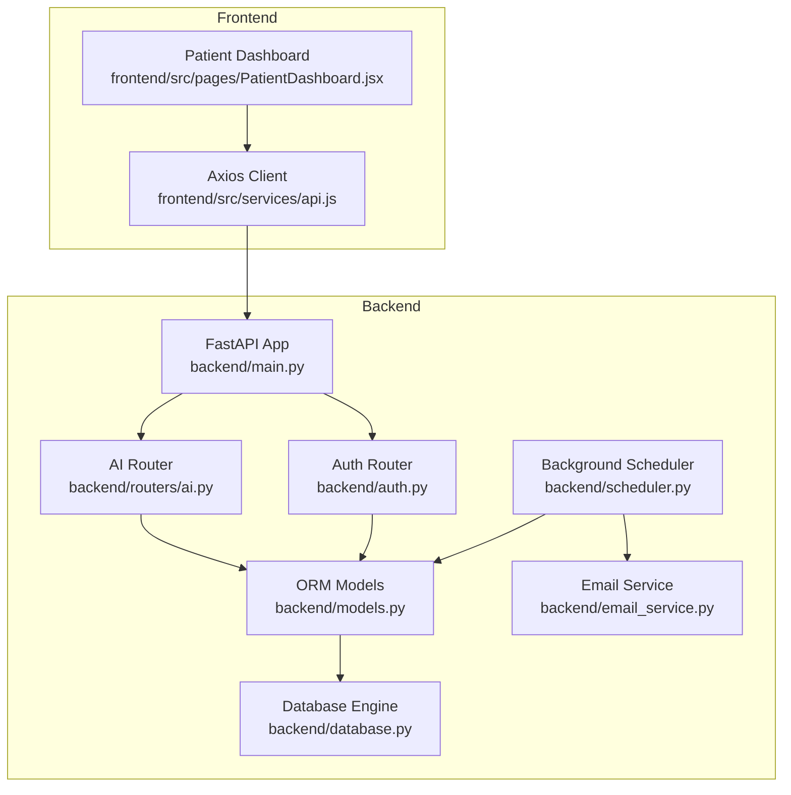
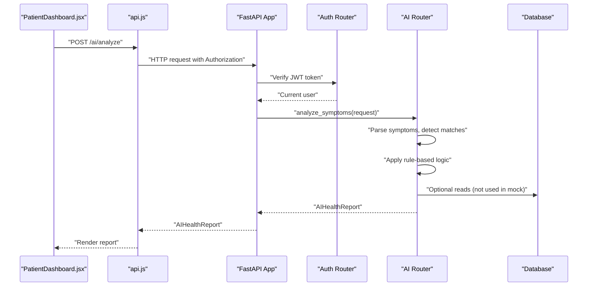
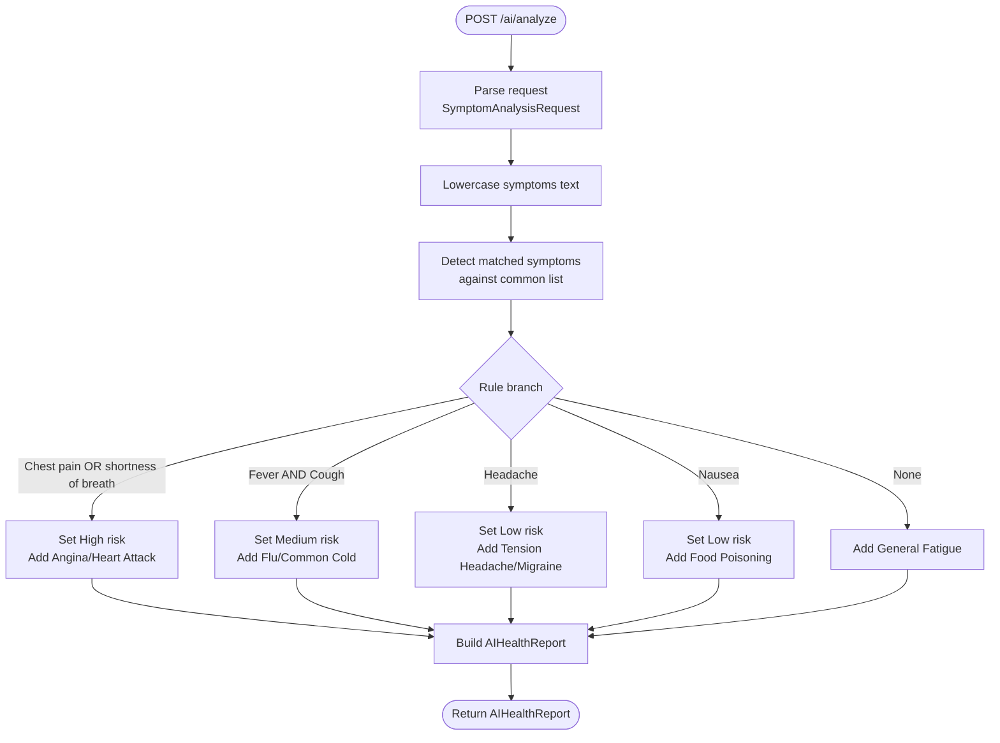
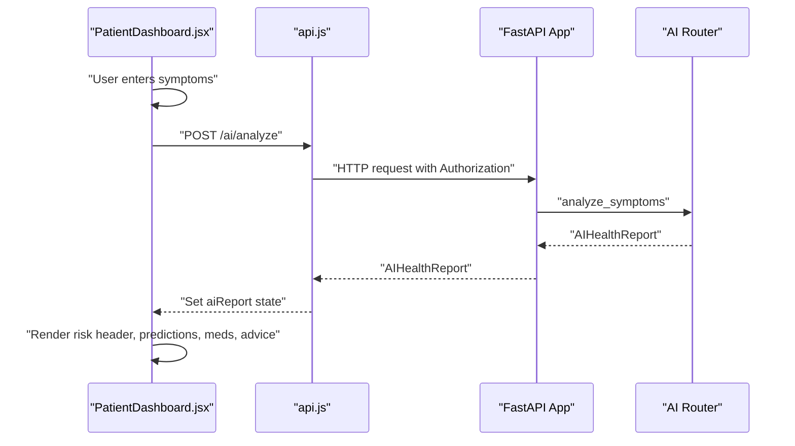
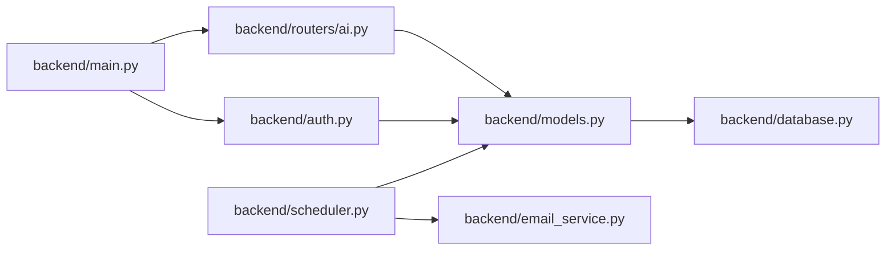
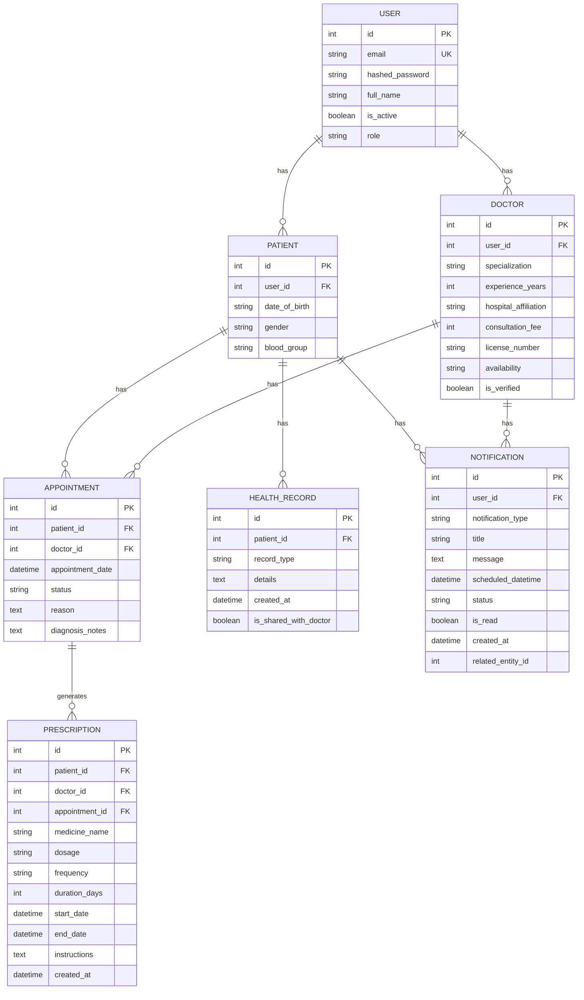

# AI Health Assistant

<cite>
**Referenced Files in This Document**
- [backend/main.py](file://backend/main.py)
- [backend/routers/ai.py](file://backend/routers/ai.py)
- [backend/schemas.py](file://backend/schemas.py)
- [backend/auth.py](file://backend/auth.py)
- [backend/database.py](file://backend/database.py)
- [backend/models.py](file://backend/models.py)
- [backend/email_service.py](file://backend/email_service.py)
- [backend/scheduler.py](file://backend/scheduler.py)
- [frontend/src/services/api.js](file://frontend/src/services/api.js)
- [frontend/src/pages/PatientDashboard.jsx](file://frontend/src/pages/PatientDashboard.jsx)
- [requirements.txt](file://requirements.txt)
</cite>

## Table of Contents
1. [Introduction](#introduction)
2. [Project Structure](#project-structure)
3. [Core Components](#core-components)
4. [Architecture Overview](#architecture-overview)
5. [Detailed Component Analysis](#detailed-component-analysis)
6. [Dependency Analysis](#dependency-analysis)
7. [Performance Considerations](#performance-considerations)
8. [Troubleshooting Guide](#troubleshooting-guide)
9. [Conclusion](#conclusion)
10. [Appendices](#appendices)

## Introduction
This document describes the SmartHealthCare AI health assistant system. It focuses on the AI analysis API endpoint that performs symptom analysis, disease prediction, and OTC medication suggestions. The system currently implements a rule-based decision engine and mock AI logic for demonstration. It also documents the frontend integration pattern, data models, authentication, and operational components such as background scheduling and email notifications.

## Project Structure
The system is organized into a Python FastAPI backend and a React/Vite frontend. The backend exposes REST endpoints, manages authentication, persists data with SQLAlchemy, and orchestrates background jobs. The frontend consumes the backend API via Axios and renders the AI health report.

**Diagram sources**
- [backend/main.py](file://backend/main.py#L13-L61)
- [backend/routers/ai.py](file://backend/routers/ai.py#L1-L90)
- [backend/auth.py](file://backend/auth.py#L1-L120)
- [backend/database.py](file://backend/database.py#L1-L22)
- [backend/models.py](file://backend/models.py#L1-L110)
- [backend/email_service.py](file://backend/email_service.py#L1-L161)
- [backend/scheduler.py](file://backend/scheduler.py#L1-L317)
- [frontend/src/services/api.js](file://frontend/src/services/api.js#L1-L25)
- [frontend/src/pages/PatientDashboard.jsx](file://frontend/src/pages/PatientDashboard.jsx#L450-L649)

**Section sources**
- [backend/main.py](file://backend/main.py#L13-L61)
- [frontend/src/services/api.js](file://frontend/src/services/api.js#L1-L25)

## Core Components
- AI Analysis Endpoint: Processes textual symptoms and returns risk level, detected symptoms, disease predictions with confidences, OTC suggestions, and recommendations.
- Authentication: JWT-based OAuth2 password flow with bearer tokens.
- Data Persistence: SQLAlchemy ORM models for users, patients, doctors, appointments, health records, notifications, and prescriptions.
- Background Jobs: APScheduler-based jobs for medicine reminders, appointment reminders, notification dispatch, and cleanup.
- Email Notifications: SMTP-based templated emails for reminders and notifications.
- Frontend Integration: Axios client injects Authorization header; dashboard captures user symptoms and displays AI report.

**Section sources**
- [backend/routers/ai.py](file://backend/routers/ai.py#L10-L88)
- [backend/auth.py](file://backend/auth.py#L106-L120)
- [backend/models.py](file://backend/models.py#L6-L110)
- [backend/scheduler.py](file://backend/scheduler.py#L259-L317)
- [backend/email_service.py](file://backend/email_service.py#L98-L161)
- [frontend/src/services/api.js](file://frontend/src/services/api.js#L10-L22)
- [frontend/src/pages/PatientDashboard.jsx](file://frontend/src/pages/PatientDashboard.jsx#L450-L649)

## Architecture Overview
The AI health assistant follows a layered architecture:
- Presentation Layer: React frontend renders the symptom input and displays the AI report.
- API Layer: FastAPI routes handle requests, enforce authentication, and delegate to business logic.
- Business Logic: Rule-based decision engine inside the AI router produces predictions and suggestions.
- Persistence Layer: SQLAlchemy models and sessions manage data.
- Background Layer: APScheduler runs periodic tasks for reminders and notifications.

**Diagram sources**
- [frontend/src/pages/PatientDashboard.jsx](file://frontend/src/pages/PatientDashboard.jsx#L450-L649)
- [frontend/src/services/api.js](file://frontend/src/services/api.js#L1-L25)
- [backend/main.py](file://backend/main.py#L34-L44)
- [backend/auth.py](file://backend/auth.py#L39-L55)
- [backend/routers/ai.py](file://backend/routers/ai.py#L10-L88)

## Detailed Component Analysis

### AI Analysis Endpoint
- Endpoint: POST /ai/analyze
- Request Model: SymptomAnalysisRequest with symptoms text and optional demographic fields.
- Response Model: AIHealthReport containing risk level, detected symptoms, top disease predictions with confidence, OTC suggestions, recommendations, and a disclaimer.
- Authentication: Requires a valid bearer token; the route depends on get_current_user.
- Processing Logic:
  - Normalize input to lowercase.
  - Detect matching symptoms against a predefined list.
  - Apply rule branches based on symptom presence to set risk level, populate predictions, suggest medicines, and append recommendations.
  - Cap predictions to top 3.
- Confidence Scoring: Confidences are embedded in DiseasePrediction objects; they reflect rule weights and are not derived from ML inference.
- Disclaimer: Always included in the response.

**Diagram sources**
- [backend/routers/ai.py](file://backend/routers/ai.py#L10-L88)
- [backend/schemas.py](file://backend/schemas.py#L140-L162)

**Section sources**
- [backend/routers/ai.py](file://backend/routers/ai.py#L10-L88)
- [backend/schemas.py](file://backend/schemas.py#L140-L162)
- [backend/auth.py](file://backend/auth.py#L39-L55)

### Symptom Analysis Algorithm
- Input Validation:
  - Symptoms text is required.
  - Optional fields age and gender are present in the request schema but unused in the current rule logic.
- Symptom Processing:
  - Convert input to lowercase for case-insensitive matching.
  - Iterate over a curated list of common symptoms and collect capitalized matches.
- Rule-Based Decision Tree:
  - High-risk triggers: chest pain or shortness of breath.
  - Medium-risk triggers: fever combined with cough.
  - Low-risk triggers: headache or nausea.
  - Default: general fatigue.
- Probability Calculations:
  - Confidences are fixed values per condition in the rule branches.
  - No statistical aggregation across multiple conditions is performed; each prediction is independent.
- Confidence Scoring:
  - Predictions are capped to top 3 before returning.

**Section sources**
- [backend/routers/ai.py](file://backend/routers/ai.py#L15-L84)
- [backend/schemas.py](file://backend/schemas.py#L140-L149)

### Disease Prediction Logic
- Predictions are returned as DiseasePrediction(name, confidence).
- The order reflects rule precedence; the endpoint slices to top 3.
- Example predictions (from current rules):
  - High risk: Angina, Heart Attack.
  - Medium risk: Flu, Common Cold.
  - Low risk: Tension Headache, Migraine, Food Poisoning.
  - Default: General Fatigue.

**Section sources**
- [backend/routers/ai.py](file://backend/routers/ai.py#L31-L79)
- [backend/schemas.py](file://backend/schemas.py#L146-L149)

### Medication Recommendation Engine
- Recommendations are structured as MedicineSuggestion(name, dosage, advice[]).
- Each rule branch adds one or more suggestions appropriate to the detected condition.
- Advice lists provide safe-use guidance.

**Section sources**
- [backend/routers/ai.py](file://backend/routers/ai.py#L36-L76)
- [backend/schemas.py](file://backend/schemas.py#L150-L154)

### AI Model Integration and Data Sources
- Current Implementation: The AI logic is rule-based and does not integrate scikit-learn models or external ML APIs.
- Dependencies: scikit-learn, numpy, pandas are present in requirements; they are not used in the current code.
- Data Sources: The endpoint does not query the database for predictions; it relies solely on hardcoded rules.

**Section sources**
- [requirements.txt](file://requirements.txt#L8-L10)
- [backend/routers/ai.py](file://backend/routers/ai.py#L10-L88)

### Ethical Considerations, Limitations, and Disclaimers
- Disclaimers: The response includes a statement indicating the output is not a medical diagnosis and advises consulting a doctor.
- Limitations:
  - Rule-based logic is not a substitute for clinical evaluation.
  - Confidences are not derived from trained models.
  - Symptom detection uses simple substring matching.
- Best Practices:
  - Always include disclaimers.
  - Encourage users to seek professional care for severe or persistent symptoms.
  - Avoid recommending self-diagnosis or treatment for serious conditions.

**Section sources**
- [backend/routers/ai.py](file://backend/routers/ai.py#L87-L88)

### Frontend Integration and Display Patterns
- Axios Client:
  - Base URL points to the backend.
  - Interceptor attaches Authorization: Bearer <token> from localStorage.
- Dashboard UI:
  - Textarea collects symptoms.
  - Button triggers analysis and shows loading state.
  - Renders risk banner, detected symptoms, predictions with progress bars, OTC suggestions, and recommendations.
  - Displays the disclaimer prominently.

**Diagram sources**
- [frontend/src/pages/PatientDashboard.jsx](file://frontend/src/pages/PatientDashboard.jsx#L450-L649)
- [frontend/src/services/api.js](file://frontend/src/services/api.js#L10-L22)
- [backend/routers/ai.py](file://backend/routers/ai.py#L10-L88)

**Section sources**
- [frontend/src/services/api.js](file://frontend/src/services/api.js#L1-L25)
- [frontend/src/pages/PatientDashboard.jsx](file://frontend/src/pages/PatientDashboard.jsx#L450-L649)

## Dependency Analysis
- Backend App Initialization:
  - Registers routers including AI and Auth.
  - Configures CORS for frontend origins.
- Database:
  - SQLite engine and session factory; metadata creation handled by init script.
- Models:
  - Users, Patients, Doctors, Appointments, HealthRecords, Notifications, Prescriptions define the domain.
- Scheduler:
  - Creates medicine and appointment reminders, sends pending notifications, and cleans up old notifications.
- Email:
  - Sends templated emails for notifications when configured.

**Diagram sources**
- [backend/main.py](file://backend/main.py#L34-L44)
- [backend/routers/ai.py](file://backend/routers/ai.py#L1-L90)
- [backend/auth.py](file://backend/auth.py#L1-L120)
- [backend/models.py](file://backend/models.py#L1-L110)
- [backend/database.py](file://backend/database.py#L1-L22)
- [backend/scheduler.py](file://backend/scheduler.py#L1-L317)
- [backend/email_service.py](file://backend/email_service.py#L1-L161)

**Section sources**
- [backend/main.py](file://backend/main.py#L19-L32)
- [backend/database.py](file://backend/database.py#L5-L22)
- [backend/models.py](file://backend/models.py#L6-L110)
- [backend/scheduler.py](file://backend/scheduler.py#L259-L317)
- [backend/email_service.py](file://backend/email_service.py#L98-L161)

## Performance Considerations
- Current Endpoint:
  - CPU-bound rule evaluation with small lookup sets; negligible latency.
  - No database queries in the AI route.
- Scalability:
  - Introduce rate limiting at the API gateway or middleware.
  - Offload heavy computations to background tasks if expanded.
  - Consider caching frequent symptom-to-condition mappings.
- Background Jobs:
  - APScheduler intervals are tuned (hourly checks, 5-minute dispatch, daily cleanup).
  - Ensure job concurrency and persistence are configured appropriately in production.

[No sources needed since this section provides general guidance]

## Troubleshooting Guide
- Authentication Failures:
  - Verify JWT token presence and validity; ensure Authorization header is attached by the Axios interceptor.
  - Confirm user exists and credentials are correct.
- AI Endpoint Issues:
  - Ensure symptoms text is provided; confirm lowercase normalization is applied.
  - Check rule branches for expected symptom combinations.
- Frontend Display:
  - Confirm base URL and token storage.
  - Inspect network tab for request/response payloads.
- Background Notifications:
  - Check scheduler logs for errors.
  - Verify email configuration variables are set if email delivery is required.

**Section sources**
- [backend/auth.py](file://backend/auth.py#L39-L55)
- [frontend/src/services/api.js](file://frontend/src/services/api.js#L10-L22)
- [backend/scheduler.py](file://backend/scheduler.py#L184-L233)
- [backend/email_service.py](file://backend/email_service.py#L98-L161)

## Conclusion
The SmartHealthCare AI health assistant demonstrates a rule-based symptom analysis pipeline integrated with a React frontend and FastAPI backend. While the current implementation is a proof-of-concept, it establishes a foundation for future enhancements such as integrating trained ML models, expanding symptom coverage, and incorporating real-time data sources. Robust authentication, clear disclaimers, and background automation improve reliability and user safety.

[No sources needed since this section summarizes without analyzing specific files]

## Appendices

### API Definitions
- POST /ai/analyze
  - Request: SymptomAnalysisRequest
    - symptoms: string (required)
    - age: integer (optional)
    - gender: string (optional)
  - Response: AIHealthReport
    - risk_level: string ("Low", "Medium", "High")
    - detected_symptoms: array of strings
    - predicted_diseases: array of DiseasePrediction
      - name: string
      - confidence: number (0–1)
    - suggested_medicines: array of MedicineSuggestion
      - name: string
      - dosage: string
      - advice: array of strings
    - recommendations: array of strings
    - disclaimer: string

**Section sources**
- [backend/schemas.py](file://backend/schemas.py#L140-L162)

### Example Inputs and Outputs
- Example Input:
  - symptoms: "I have chest pain and shortness of breath"
  - age: 55
  - gender: "male"
- Expected Behavior:
  - risk_level: "High"
  - predicted_diseases: Angina and Heart Attack with high confidences
  - recommendations: Seek immediate medical attention
  - suggested_medicines: Aspirin with specific advice
- Example Input:
  - symptoms: "I have a headache and feel nauseous"
- Expected Behavior:
  - risk_level: "Low"
  - predicted_diseases: Tension Headache and Migraine
  - suggested_medicines: Ibuprofen with food advice

**Section sources**
- [backend/routers/ai.py](file://backend/routers/ai.py#L31-L76)

### Data Models Overview

**Diagram sources**
- [backend/models.py](file://backend/models.py#L6-L110)