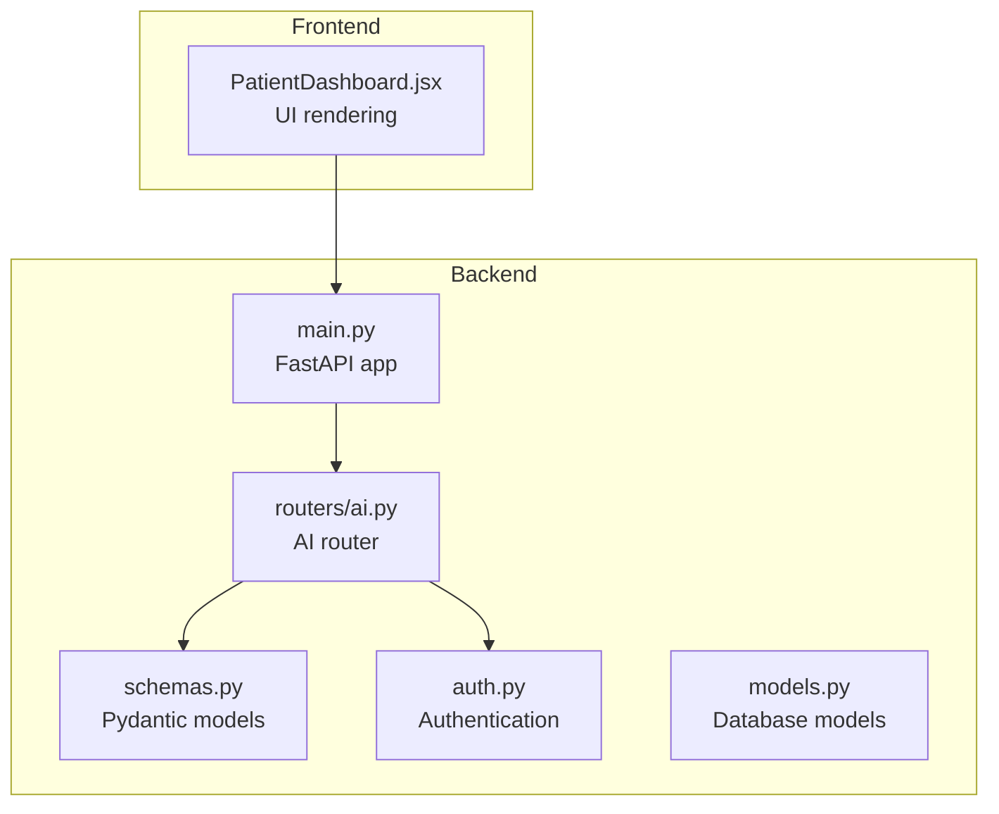
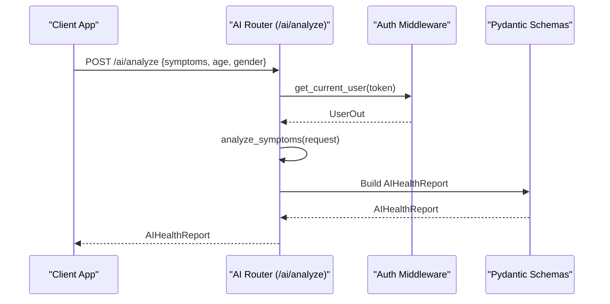
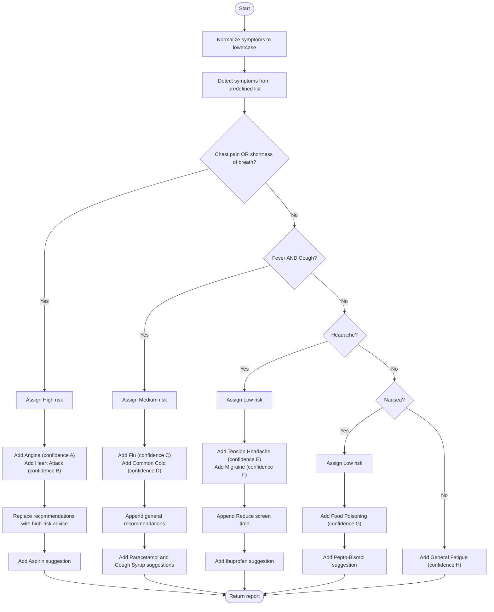
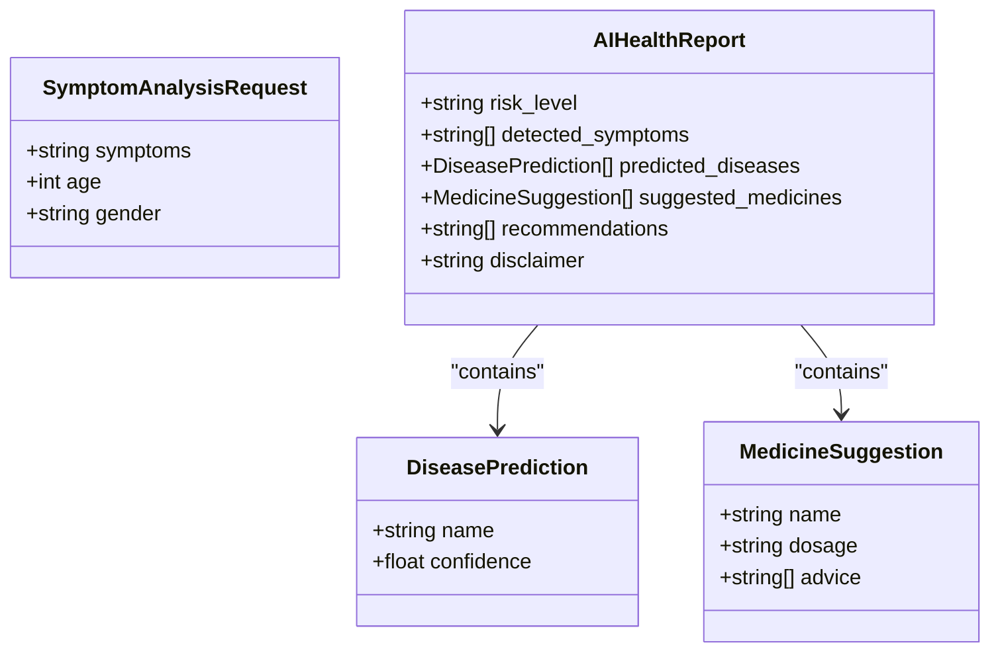
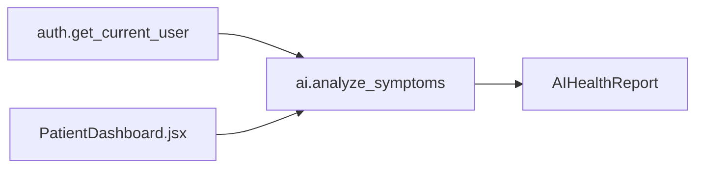

# Disease Prediction Algorithm

<cite>
**Referenced Files in This Document**
- [ai.py](file://backend/routers/ai.py)
- [schemas.py](file://backend/schemas.py)
- [main.py](file://backend/main.py)
- [auth.py](file://backend/auth.py)
- [models.py](file://backend/models.py)
- [PatientDashboard.jsx](file://frontend/src/pages/PatientDashboard.jsx)
</cite>

## Table of Contents
1. [Introduction](#introduction)
2. [Project Structure](#project-structure)
3. [Core Components](#core-components)
4. [Architecture Overview](#architecture-overview)
5. [Detailed Component Analysis](#detailed-component-analysis)
6. [Dependency Analysis](#dependency-analysis)
7. [Performance Considerations](#performance-considerations)
8. [Troubleshooting Guide](#troubleshooting-guide)
9. [Conclusion](#conclusion)

## Introduction
This document explains the disease prediction algorithm system implemented in the SmartHealthCare backend. The system is a rule-based decision engine that processes textual symptom inputs and returns a structured health report including detected symptoms, ranked disease predictions with confidence scores, suggested over-the-counter medicines, recommendations, and a risk level indicator. The algorithm is intentionally simple and illustrative, designed for demonstration and educational purposes rather than clinical deployment.

## Project Structure
The disease prediction feature is implemented as a FastAPI router with Pydantic schemas for request/response modeling. The frontend integrates with the backend to present results to the user.

**Diagram sources**
- [main.py](file://backend/main.py#L34-L44)
- [ai.py](file://backend/routers/ai.py#L1-L90)
- [schemas.py](file://backend/schemas.py#L140-L162)
- [auth.py](file://backend/auth.py#L39-L55)
- [models.py](file://backend/models.py#L1-L110)
- [PatientDashboard.jsx](file://frontend/src/pages/PatientDashboard.jsx#L456-L551)

**Section sources**
- [main.py](file://backend/main.py#L34-L44)
- [ai.py](file://backend/routers/ai.py#L1-L90)
- [schemas.py](file://backend/schemas.py#L140-L162)

## Core Components
- SymptomAnalysisRequest: Accepts a free-text symptom description and optional demographic fields.
- DiseasePrediction: Encapsulates a disease name and a confidence score.
- MedicineSuggestion: Encapsulates OTC medicine name, dosage, and advice.
- AIHealthReport: Aggregates risk level, detected symptoms, top-ranked disease predictions, suggested medicines, recommendations, and a disclaimer.

Key behaviors:
- Symptom detection scans the input text against a predefined list of common symptoms and capitalizes matches.
- Rule-based logic evaluates symptom combinations to assign risk level and populate disease predictions with confidence scores.
- Top-N selection limits predictions to the highest-confidence entries.
- Frontend displays risk level color-coded, detected symptoms as tags, and disease predictions with confidence bars.

**Section sources**
- [schemas.py](file://backend/schemas.py#L140-L162)
- [ai.py](file://backend/routers/ai.py#L10-L88)
- [PatientDashboard.jsx](file://frontend/src/pages/PatientDashboard.jsx#L480-L551)

## Architecture Overview
The system follows a straightforward pipeline: client sends a symptom description to the AI analyzer, which applies rule-based logic and returns a structured report.

**Diagram sources**
- [ai.py](file://backend/routers/ai.py#L10-L88)
- [auth.py](file://backend/auth.py#L39-L55)
- [schemas.py](file://backend/schemas.py#L140-L162)

## Detailed Component Analysis

### Symptom Detection and Matching
- Input normalization: The symptom text is lowercased to enable case-insensitive matching.
- Candidate symptoms: A curated list of common symptoms is scanned for presence in the input text.
- Detected symptoms: Each matched symptom is capitalized and included in the report.

Confidence scoring and ranking:
- Confidence values are embedded directly in the rule branches.
- Predictions are collected and truncated to the top N before being returned.

Risk level assignment:
- Risk level is derived from symptom combinations and updated accordingly.

Recommendations and medicines:
- Recommendations and suggested medicines are appended or replaced based on symptom combinations.

**Section sources**
- [ai.py](file://backend/routers/ai.py#L15-L28)
- [ai.py](file://backend/routers/ai.py#L31-L79)
- [ai.py](file://backend/routers/ai.py#L81-L88)

### Rule-Based Decision Tree
The decision tree evaluates symptom combinations in a prioritized order:

**Diagram sources**
- [ai.py](file://backend/routers/ai.py#L15-L79)

### DiseasePrediction Schema and Confidence Generation
- DiseasePrediction model carries disease name and confidence score.
- Confidence scores are assigned per rule branch and reflect relative likelihood within the rule set.
- Top-N selection: The algorithm returns up to three predictions, implicitly selecting the highest-confidence entries first.

**Diagram sources**
- [schemas.py](file://backend/schemas.py#L140-L162)

**Section sources**
- [schemas.py](file://backend/schemas.py#L140-L162)
- [ai.py](file://backend/routers/ai.py#L33-L34)
- [ai.py](file://backend/routers/ai.py#L44-L45)
- [ai.py](file://backend/routers/ai.py#L60-L61)
- [ai.py](file://backend/routers/ai.py#L71)
- [ai.py](file://backend/routers/ai.py#L79)

### Threshold-Based Decision Making and Risk Levels
- Risk levels are assigned per rule branch:
  - High risk for severe cardiac symptom indicators.
  - Medium risk for flu-like symptoms.
  - Low risk for mild conditions.
- Thresholds are implicit within the rule branches; no explicit floating-point thresholds are applied beyond confidence assignments.

Recommendations and medicines:
- High-risk scenarios override default recommendations with urgent care guidance.
- Other scenarios append general advice and suggest appropriate OTC treatments.

**Section sources**
- [ai.py](file://backend/routers/ai.py#L31-L35)
- [ai.py](file://backend/routers/ai.py#L42-L56)
- [ai.py](file://backend/routers/ai.py#L58-L67)
- [ai.py](file://backend/routers/ai.py#L69-L76)

### Frontend Presentation and User Experience
- The frontend renders risk level with color-coded banners.
- Detected symptoms are shown as interactive tags.
- Predictions are presented with percentage confidence and progress bars.
- Recommendations and suggested medicines are grouped for easy scanning.

**Section sources**
- [PatientDashboard.jsx](file://frontend/src/pages/PatientDashboard.jsx#L480-L551)
- [PatientDashboard.jsx](file://frontend/src/pages/PatientDashboard.jsx#L504-L516)

## Dependency Analysis
- Router-to-auth dependency: The AI endpoint depends on the authentication middleware to resolve the current user.
- Router-to-schemas dependency: The endpoint constructs Pydantic models for the response.
- Frontend-to-backend dependency: The dashboard triggers the AI endpoint and renders the returned report.

**Diagram sources**
- [auth.py](file://backend/auth.py#L39-L55)
- [ai.py](file://backend/routers/ai.py#L13-L13)
- [schemas.py](file://backend/schemas.py#L155-L161)
- [PatientDashboard.jsx](file://frontend/src/pages/PatientDashboard.jsx#L456-L474)

**Section sources**
- [main.py](file://backend/main.py#L34-L44)
- [auth.py](file://backend/auth.py#L39-L55)
- [ai.py](file://backend/routers/ai.py#L10-L14)
- [schemas.py](file://backend/schemas.py#L155-L161)
- [PatientDashboard.jsx](file://frontend/src/pages/PatientDashboard.jsx#L456-L474)

## Performance Considerations
- Time complexity: Symptom detection iterates over a fixed-size candidate list and performs substring checks against the input text. This is efficient for small lists and typical user inputs.
- Memory footprint: The algorithm maintains small, bounded lists for detected symptoms and predictions, minimizing memory overhead.
- Scalability: The current implementation is single-threaded and rule-driven. For production-scale deployments, consider vectorized symptom matching, caching frequent queries, and modularizing rules for easier maintenance.

[No sources needed since this section provides general guidance]

## Troubleshooting Guide
Common issues and resolutions:
- Authentication failures: Ensure a valid bearer token is provided; otherwise, the endpoint raises credential errors.
- Empty or low-signal inputs: The algorithm defaults to a general fatigue prediction when no known symptoms are detected.
- Ambiguous symptom text: Since matching is substring-based, typos or phrasing variations may reduce detection accuracy. Encourage users to describe symptoms clearly.

Operational tips:
- Verify that the AI endpoint is mounted under the application router.
- Confirm that the frontend sends a properly structured request body containing the symptom text.

**Section sources**
- [auth.py](file://backend/auth.py#L40-L55)
- [ai.py](file://backend/routers/ai.py#L10-L14)
- [ai.py](file://backend/routers/ai.py#L78-L79)
- [main.py](file://backend/main.py#L34-L44)

## Conclusion
The disease prediction algorithm is a rule-based prototype that demonstrates how textual symptom inputs can be transformed into a structured health report with confidence scores and actionable recommendations. While suitable for demonstration and prototyping, it is not intended as a substitute for professional medical diagnosis. Future enhancements could include probabilistic scoring, expanded symptom coverage, and integration with clinical guidelines.