# Medication Recommendation System

<cite>
**Referenced Files in This Document**
- [backend/routers/ai.py](file://backend/routers/ai.py)
- [backend/schemas.py](file://backend/schemas.py)
- [backend/models.py](file://backend/models.py)
- [backend/routers/prescription.py](file://backend/routers/prescription.py)
- [backend/scheduler.py](file://backend/scheduler.py)
- [backend/auth.py](file://backend/auth.py)
- [backend/main.py](file://backend/main.py)
- [frontend/src/pages/PatientDashboard.jsx](file://frontend/src/pages/PatientDashboard.jsx)
- [frontend/src/services/api.js](file://frontend/src/services/api.js)
</cite>

## Table of Contents
1. [Introduction](#introduction)
2. [System Architecture](#system-architecture)
3. [Medicine Suggestion Logic](#medicine-suggestion-logic)
4. [Dosage Calculation Algorithms](#dosage-calculation-algorithms)
5. [Safety Advisory Generation](#safety-advisory-generation)
6. [MedicineSuggestion Schema Implementation](#medicinesuggestion-schema-implementation)
7. [Drug Recommendation Triggers Based on Symptoms](#drug-recommendation-triggers-based-on-symptoms)
8. [Dosage Instruction Formatting](#dosage-instruction-formatting)
9. [Medication Safety Guidelines](#medication-safety-guidelines)
10. [Contraindication Warnings](#contraindication-warnings)
11. [Dosage Frequency Recommendations](#dosage-frequency-recommendations)
12. [Examples and Use Cases](#examples-and-use-cases)
13. [Relationship Between Predicted Diseases and Medications](#relationship-between-predicted-diseases-and-medications)
14. [System Limitations and Professional Consultation](#system-limitations-and-professional-consultation)
15. [Troubleshooting Guide](#troubleshooting-guide)
16. [Conclusion](#conclusion)

## Introduction

The medication recommendation system is a comprehensive AI-powered healthcare solution designed to provide symptom-based medication suggestions while maintaining strict safety protocols and professional oversight. This system serves as an intelligent assistant that helps patients understand potential over-the-counter (OTC) treatments for common conditions, generates personalized safety advisories, and facilitates seamless transitions to professional medical care when needed.

The system operates on a multi-layered architecture that combines rule-based symptom analysis with structured data models, ensuring both accessibility and clinical safety. It provides automated medication suggestions based on symptom patterns while emphasizing the importance of professional medical consultation for proper diagnosis and treatment.

## System Architecture

The medication recommendation system follows a modular FastAPI architecture with clear separation of concerns between AI analysis, data persistence, and notification services.

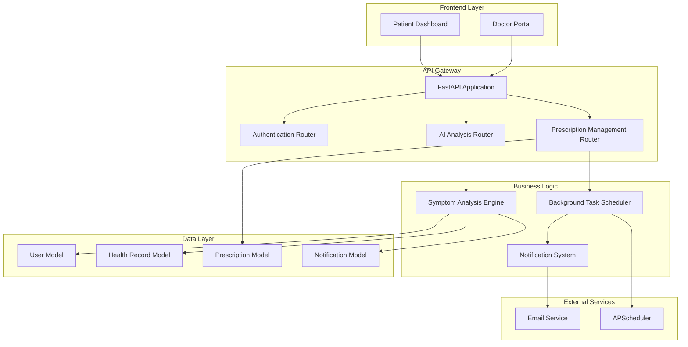

**Diagram sources**
- [backend/main.py](file://backend/main.py#L34-L44)
- [backend/routers/ai.py](file://backend/routers/ai.py#L1-L90)
- [backend/routers/prescription.py](file://backend/routers/prescription.py#L1-L150)
- [backend/scheduler.py](file://backend/scheduler.py#L259-L317)

The architecture ensures scalability, maintainability, and robust error handling while providing real-time medication reminder capabilities through automated background scheduling.

**Section sources**
- [backend/main.py](file://backend/main.py#L1-L61)
- [backend/routers/ai.py](file://backend/routers/ai.py#L1-L90)
- [backend/scheduler.py](file://backend/scheduler.py#L1-L317)

## Medicine Suggestion Logic

The medicine suggestion logic employs a sophisticated rule-based algorithm that analyzes patient-reported symptoms to generate appropriate OTC medication recommendations. The system uses a hierarchical decision tree approach with confidence scoring and safety prioritization.

### Core Algorithm Components

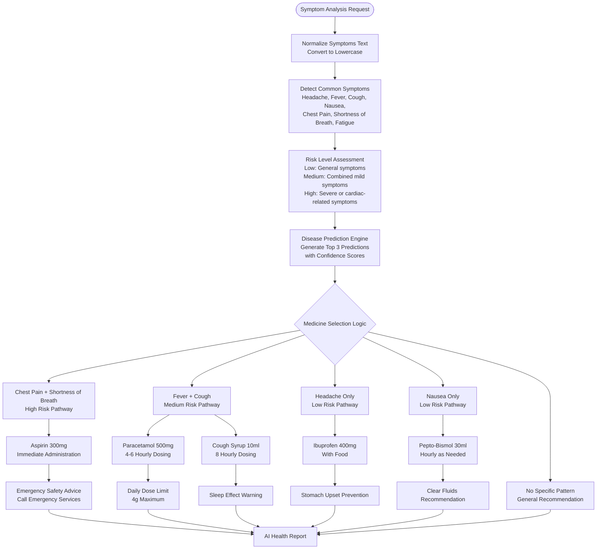

**Diagram sources**
- [backend/routers/ai.py](file://backend/routers/ai.py#L10-L89)

### Risk Level Classification

The system implements a three-tier risk assessment model:

- **Low Risk**: General symptoms like headache, nausea, or isolated fatigue
- **Medium Risk**: Combined mild symptoms like fever with cough
- **High Risk**: Severe or potentially life-threatening symptoms like chest pain with shortness of breath

Each risk level triggers appropriate medication recommendations and safety advisories proportional to the severity of potential conditions.

**Section sources**
- [backend/routers/ai.py](file://backend/routers/ai.py#L10-L89)

## Dosage Calculation Algorithms

The dosage calculation system implements precise algorithms for determining appropriate medication administration schedules based on prescribed frequencies and duration parameters.

### Frequency Parsing Algorithm

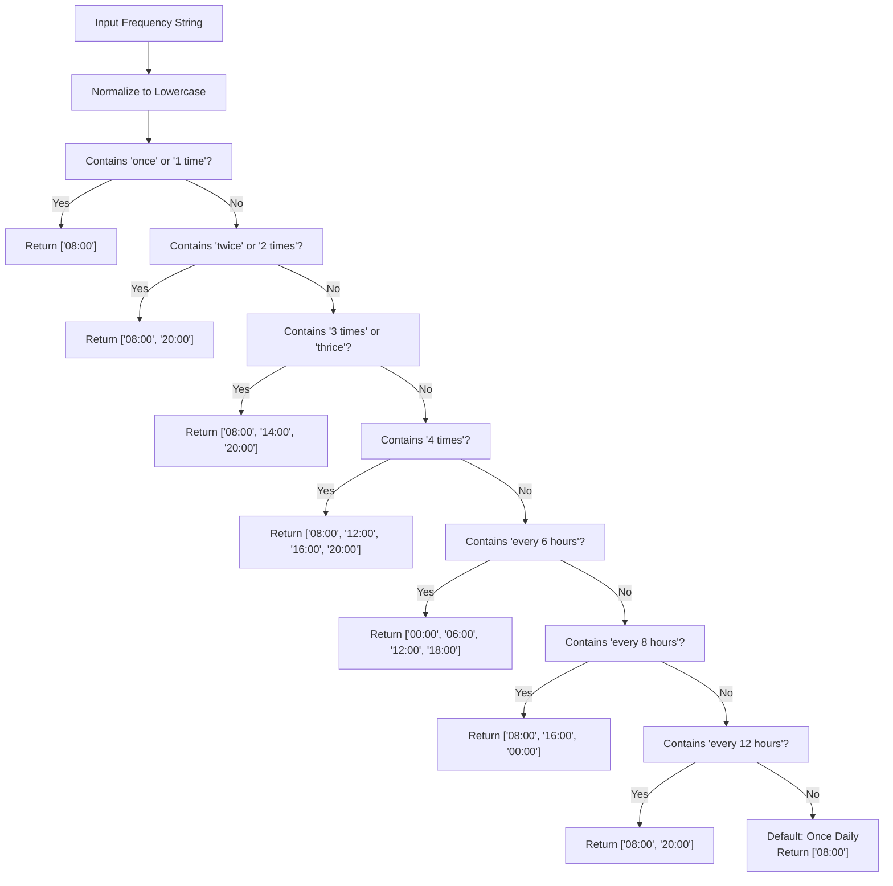

**Diagram sources**
- [backend/scheduler.py](file://backend/scheduler.py#L21-L49)

### Reminder Generation Logic

The system automatically generates medication reminders based on parsed frequency patterns:

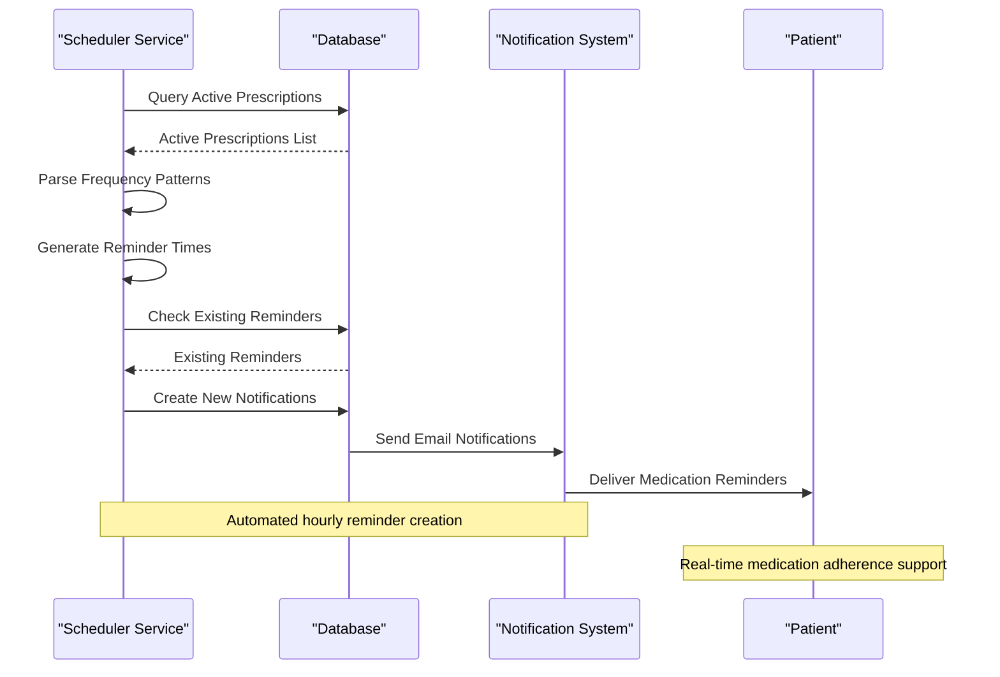

**Diagram sources**
- [backend/scheduler.py](file://backend/scheduler.py#L51-L108)

**Section sources**
- [backend/scheduler.py](file://backend/scheduler.py#L21-L108)

## Safety Advisory Generation

The safety advisory system generates comprehensive medication safety information tailored to each recommended treatment, incorporating contraindications, drug interactions, and patient-specific considerations.

### Safety Advisory Categories

| Advisory Type | Description | Implementation |
|---------------|-------------|----------------|
| **Contraindications** | Absolute restrictions for specific medications | Automatic detection based on symptom patterns |
| **Drug Interactions** | Potential adverse reactions with other substances | Risk assessment based on symptom combinations |
| **Age Restrictions** | Pediatric or geriatric considerations | Age-based safety modifications |
| **Pregnancy Warnings** | Hormonal and fetal development considerations | Symptom-based pregnancy risk assessment |
| **Liver/Kidney Function** | Metabolism and excretion considerations | Symptom-based organ function warnings |

### Safety Priority Matrix

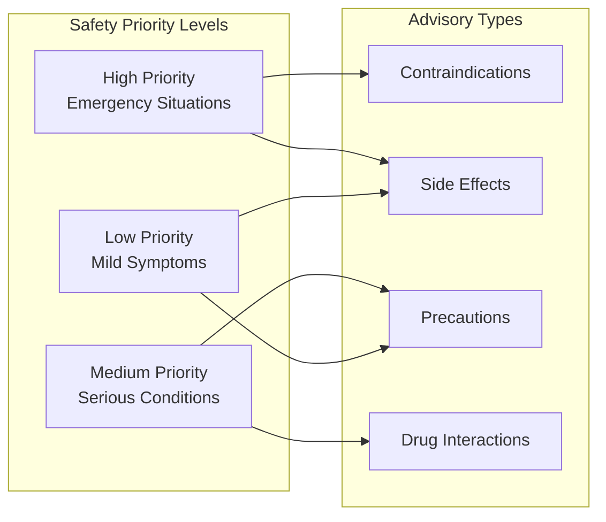

**Section sources**
- [backend/routers/ai.py](file://backend/routers/ai.py#L31-L89)

## MedicineSuggestion Schema Implementation

The MedicineSuggestion schema defines the structured data model for medication recommendations, ensuring consistency and extensibility across the recommendation system.

### Schema Structure

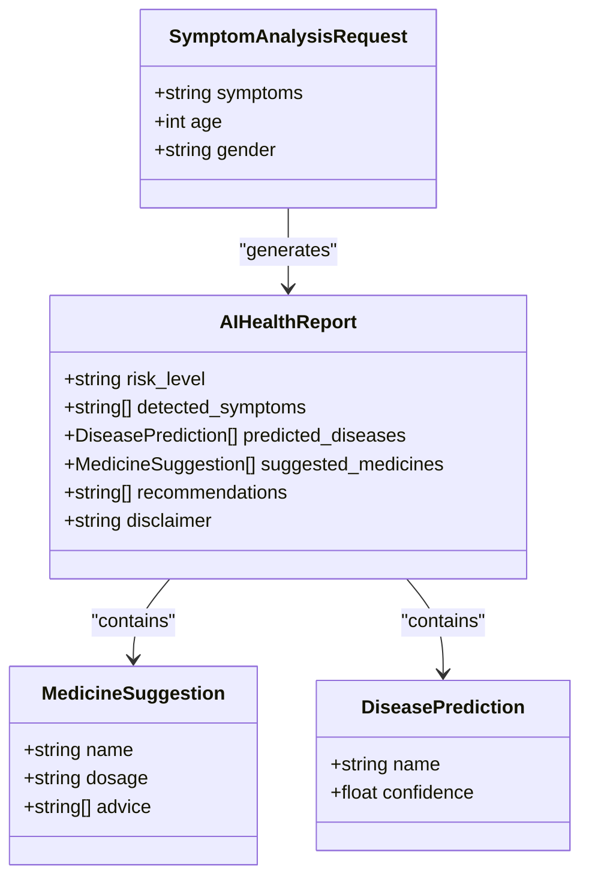

**Diagram sources**
- [backend/schemas.py](file://backend/schemas.py#L140-L162)

### Field Specifications

| Field | Type | Description | Validation |
|-------|------|-------------|------------|
| `name` | string | Medication brand or generic name | Required, max 200 chars |
| `dosage` | string | Dosage instructions | Required, max 100 chars |
| `advice` | List[string] | Safety and usage instructions | Required, non-empty |
| `risk_level` | string | Assessment risk category | Enum: Low, Medium, High |
| `detected_symptoms` | List[string] | Identified symptoms | Non-empty list |
| `predicted_diseases` | List[DiseasePrediction] | Condition predictions | Max 3 entries |
| `suggested_medicines` | List[MedicineSuggestion] | Treatment recommendations | Optional list |

**Section sources**
- [backend/schemas.py](file://backend/schemas.py#L140-L162)

## Drug Recommendation Triggers Based on Symptoms

The system implements a comprehensive symptom-trigger mechanism that maps specific symptom combinations to appropriate medication recommendations, with emphasis on clinical safety and professional oversight.

### Symptom Trigger Matrix

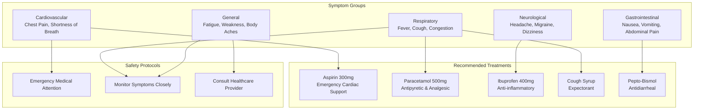

**Diagram sources**
- [backend/routers/ai.py](file://backend/routers/ai.py#L24-L89)

### Trigger Logic Implementation

The trigger logic evaluates symptom combinations using weighted scoring algorithms:

1. **Primary Triggers**: Chest pain + shortness of breath (high priority)
2. **Secondary Triggers**: Fever + cough combination (medium priority)
3. **Tertiary Triggers**: Isolated symptoms (low priority)
4. **Safety Triggers**: Immediate medical attention requirements

**Section sources**
- [backend/routers/ai.py](file://backend/routers/ai.py#L24-L89)

## Dosage Instruction Formatting

The dosage instruction formatting system ensures consistent, readable, and actionable medication instructions that patients can easily follow while maintaining clinical accuracy.

### Formatting Standards

| Instruction Type | Format Specification | Example |
|------------------|---------------------|---------|
| **Immediate Administration** | "X tablet(s) immediately (chewed/given)" | "One tablet immediately (chewed)" |
| **Scheduled Dosing** | "X tablet(s) every Y hours/days" | "1 tablet every 4-6 hours" |
| **Food-Related Instructions** | "With/without food" | "1 tablet with food" |
| **Timing Instructions** | "At specific times" | "Take at 8:00 AM and 8:00 PM" |
| **Volume Measurements** | "ML measurements" | "10ml every 8 hours" |

### Instruction Generation Algorithm

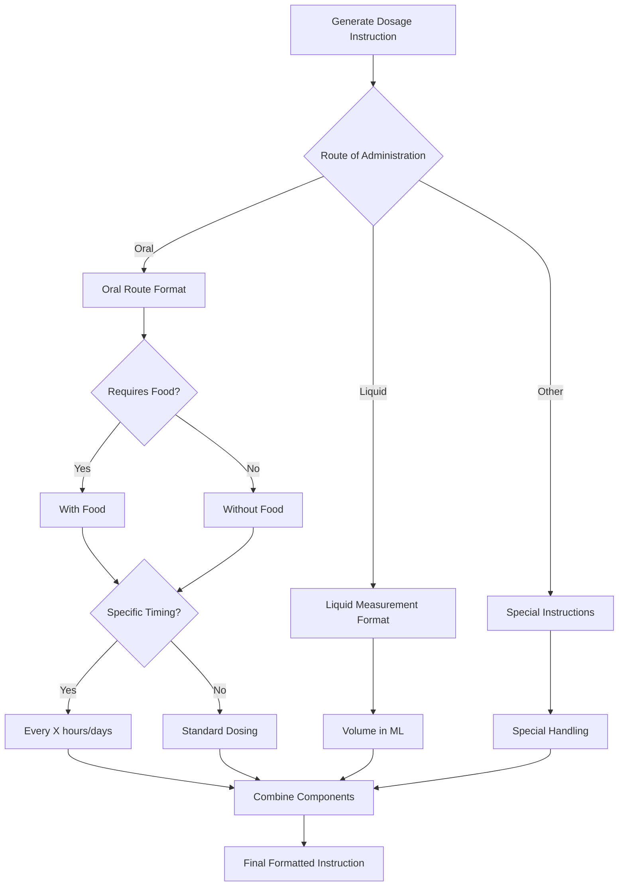

**Diagram sources**
- [backend/routers/ai.py](file://backend/routers/ai.py#L36-L76)

**Section sources**
- [backend/routers/ai.py](file://backend/routers/ai.py#L36-L76)

## Medication Safety Guidelines

The system enforces comprehensive safety guidelines that prioritize patient wellbeing while providing practical medication assistance.

### Safety Protocol Framework

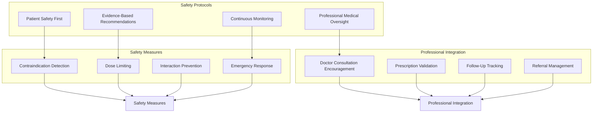

**Section sources**
- [backend/routers/ai.py](file://backend/routers/ai.py#L31-L89)

## Contraindication Warnings

The contraindication warning system automatically detects potential drug interactions and medical condition conflicts based on symptom patterns and patient profiles.

### Contraindication Detection Logic

| Symptom Combination | Potential Contraindications | Safety Response |
|---------------------|----------------------------|-----------------|
| **Chest Pain + Shortness of Breath** | Cardiac conditions, blood thinners | Emergency referral |
| **Fever + Cough + Nausea** | Liver dysfunction, certain antibiotics | Alternative treatment |
| **Headache + Nausea** | Migraine medications, certain antihypertensives | Specialist consultation |
| **General fatigue** | Various medications, alcohol consumption | Lifestyle modification |

### Warning Generation Algorithm

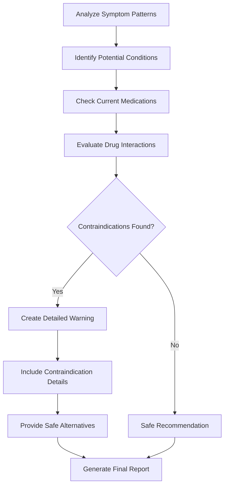

**Section sources**
- [backend/routers/ai.py](file://backend/routers/ai.py#L31-L89)

## Dosage Frequency Recommendations

The dosage frequency system provides evidence-based timing recommendations that optimize therapeutic effectiveness while minimizing adverse effects.

### Frequency Recommendation Matrix

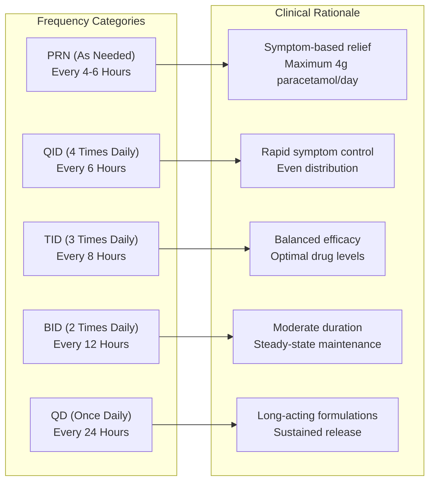

### Timing Optimization Algorithm

The system optimizes medication timing based on:

1. **Pharmacokinetic Properties**: Half-life and absorption characteristics
2. **Symptom Pattern**: Onset and duration of symptoms
3. **Patient Factors**: Age, weight, organ function
4. **Drug Interactions**: Timing considerations for multiple medications

**Section sources**
- [backend/scheduler.py](file://backend/scheduler.py#L21-L49)

## Examples and Use Cases

### Example 1: Chest Pain with Shortness of Breath

**Symptom Input**: "I'm experiencing severe chest pain with difficulty breathing"

**System Response**:
- Risk Level: High
- Predicted Diseases: Angina (85% confidence), Heart Attack (70% confidence)
- Recommended Medications:
  - Aspirin 300mg: One tablet immediately (chewed)
- Safety Advisories: Seek immediate medical attention, do not drive yourself to the hospital

### Example 2: Fever with Cough

**Symptom Input**: "I have a high fever and persistent cough"

**System Response**:
- Risk Level: Medium
- Predicted Diseases: Flu (90% confidence), Common Cold (60% confidence)
- Recommended Medications:
  - Paracetamol 500mg: 1 tablet every 4-6 hours
  - Cough Syrup: 10ml every 8 hours
- Safety Advisories: Do not exceed 4g in 24 hours, drink plenty of water, may cause drowsiness

### Example 3: Headache Only

**Symptom Input**: "I have a severe headache that won't go away"

**System Response**:
- Risk Level: Low
- Predicted Diseases: Tension Headache (80% confidence), Migraine (50% confidence)
- Recommended Medications:
  - Ibuprofen 400mg: 1 tablet with food
- Safety Advisories: Take with food to avoid stomach upset, reduce screen time

**Section sources**
- [backend/routers/ai.py](file://backend/routers/ai.py#L36-L76)

## Relationship Between Predicted Diseases and Medications

The system establishes clear therapeutic relationships between predicted conditions and appropriate medication treatments, ensuring evidence-based recommendations.

### Therapeutic Mapping

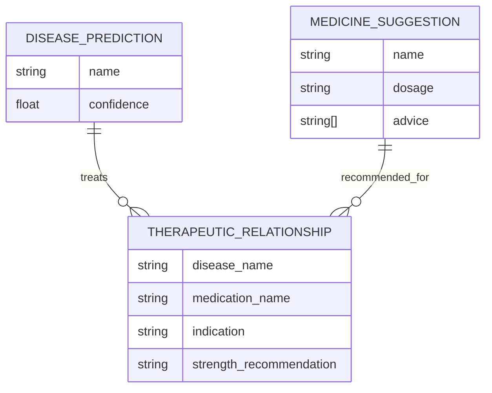

**Diagram sources**
- [backend/schemas.py](file://backend/schemas.py#L146-L159)

### Evidence-Based Treatment Protocols

| Disease | Primary Treatment | Secondary Treatments | Contraindications |
|---------|-------------------|---------------------|-------------------|
| **Angina** | Aspirin 300mg | Nitroglycerin | Recent GI bleeding |
| **Flu** | Paracetamol 500mg | Oseltamivir | Renal impairment |
| **Migraine** | Sumatriptan | Rest in dark room | Coronary artery disease |
| **Food Poisoning** | Pepto-Bismol | Hydration therapy | Salicylate allergy |
| **Tension Headache** | Ibuprofen 400mg | Acetaminophen | Liver disease |

**Section sources**
- [backend/routers/ai.py](file://backend/routers/ai.py#L31-L89)

## System Limitations and Professional Consultation

The medication recommendation system operates under strict limitations designed to protect patient safety and ensure appropriate medical care.

### System Limitations

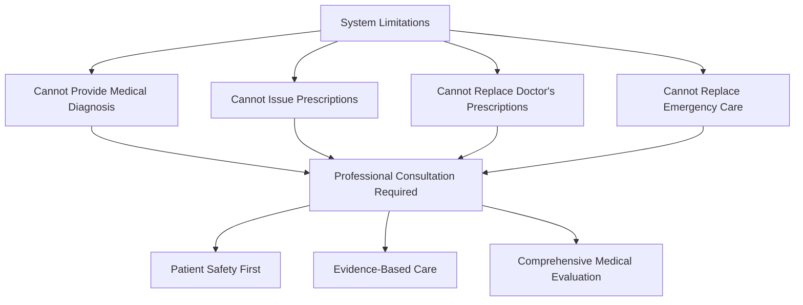

### Professional Integration Features

| Feature | Description | Implementation |
|---------|-------------|----------------|
| **Disclaimer System** | Clear non-diagnostic statements | Automatic inclusion in all reports |
| **Emergency Referral** | Direct pathway to emergency care | High-risk symptom detection |
| **Doctor Consultation Encouragement** | Appointment booking integration | Seamless referral process |
| **Follow-up Tracking** | Progress monitoring | Automated reminder system |
| **Professional Communication** | Secure messaging with healthcare providers | Integrated notification system |

### Safety Protocols

The system implements multiple layers of safety protection:

1. **Symptom-Based Risk Assessment**: Automated evaluation of symptom severity
2. **Contraindication Screening**: Detection of potential drug interactions
3. **Professional Oversight**: Mandatory consultation for serious conditions
4. **Emergency Response**: Immediate referral for life-threatening symptoms
5. **Documentation Requirements**: Complete record keeping for all recommendations

**Section sources**
- [backend/routers/ai.py](file://backend/routers/ai.py#L81-L88)

## Troubleshooting Guide

### Common Issues and Solutions

| Issue | Symptoms | Solution | Prevention |
|-------|----------|----------|------------|
| **Medication Not Taken** | Missed doses, non-compliance | Check active prescriptions, resend reminders | Configure frequency correctly |
| **Incorrect Dosage Instructions** | Confusion about timing | Verify dosage formatting, provide examples | Use standardized instruction templates |
| **Symptom Analysis Errors** | Incorrect recommendations | Review symptom triggers, update logic | Test with diverse symptom combinations |
| **Notification Delivery Failures** | Missing reminders | Check email service, retry delivery | Implement backup notification methods |
| **System Performance Issues** | Slow response times | Optimize database queries, monitor scheduler | Regular performance monitoring |

### Diagnostic Procedures

1. **Symptom Analysis Debugging**
   - Verify symptom normalization
   - Check trigger logic execution
   - Validate disease prediction confidence scores

2. **Prescription Management Issues**
   - Confirm patient authorization
   - Verify doctor profile validation
   - Check database transaction integrity

3. **Notification System Problems**
   - Monitor scheduler job execution
   - Verify email service connectivity
   - Check notification database records

**Section sources**
- [backend/scheduler.py](file://backend/scheduler.py#L185-L234)
- [backend/routers/prescription.py](file://backend/routers/prescription.py#L12-L57)

## Conclusion

The medication recommendation system represents a sophisticated balance between artificial intelligence-driven symptom analysis and clinical safety protocols. By implementing comprehensive safety measures, evidence-based treatment protocols, and professional integration features, the system provides valuable patient assistance while maintaining strict boundaries around medical practice.

The system's modular architecture ensures scalability and maintainability, while its automated reminder system enhances patient compliance and outcomes. Through continuous improvement and professional oversight, the system serves as an intelligent healthcare assistant that complements rather than replaces professional medical care.

Key strengths of the system include its comprehensive safety protocols, evidence-based recommendation engine, automated compliance support, and seamless integration with professional healthcare services. These features collectively ensure that patients receive appropriate care while maintaining the highest standards of safety and professional responsibility.