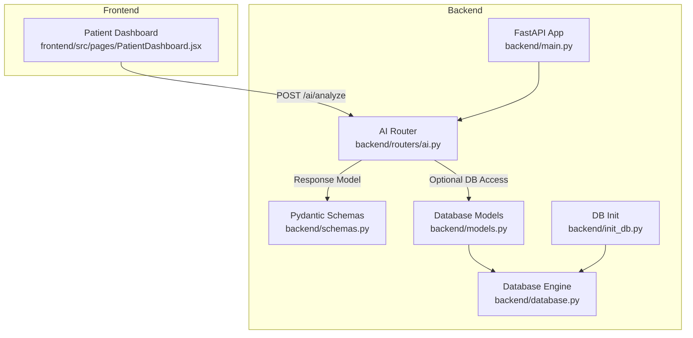
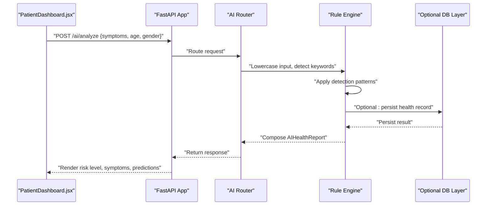
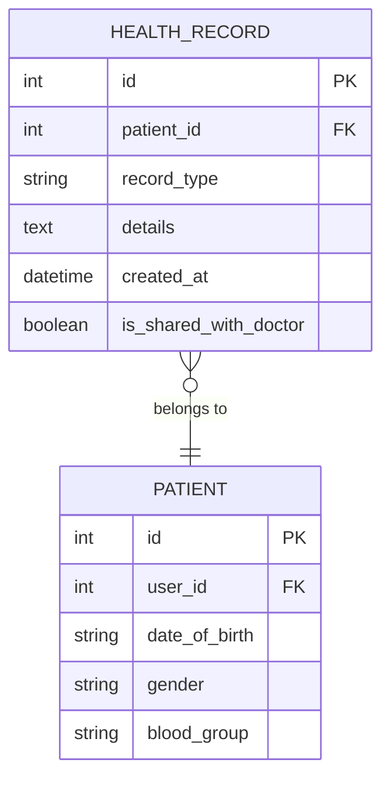
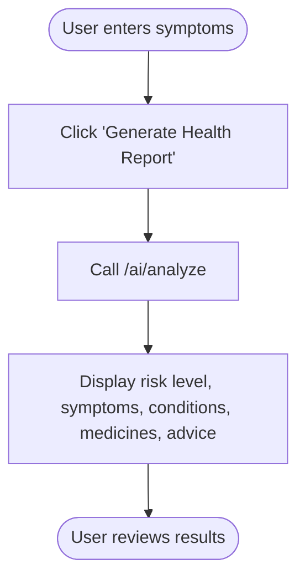
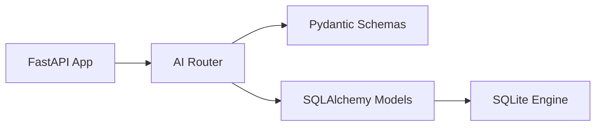

# Symptom Analysis Engine

<cite>
**Referenced Files in This Document**
- [main.py](file://backend/main.py)
- [ai.py](file://backend/routers/ai.py)
- [schemas.py](file://backend/schemas.py)
- [models.py](file://backend/models.py)
- [database.py](file://backend/database.py)
- [init_db.py](file://backend/init_db.py)
- [PatientDashboard.jsx](file://frontend/src/pages/PatientDashboard.jsx)
</cite>

## Table of Contents
1. [Introduction](#introduction)
2. [Project Structure](#project-structure)
3. [Core Components](#core-components)
4. [Architecture Overview](#architecture-overview)
5. [Detailed Component Analysis](#detailed-component-analysis)
6. [Dependency Analysis](#dependency-analysis)
7. [Performance Considerations](#performance-considerations)
8. [Troubleshooting Guide](#troubleshooting-guide)
9. [Conclusion](#conclusion)

## Introduction
This document describes the Symptom Analysis Engine, a rule-based text processing and risk assessment system integrated into the Smart Health Care backend. The engine parses patient-reported symptoms, detects matching terms against a curated list of common symptoms, applies domain-specific detection patterns, and computes a risk level with supporting recommendations and over-the-counter suggestions. The system is designed to be lightweight, scalable, and suitable for rapid prototyping and demonstration.

## Project Structure
The Symptom Analysis Engine resides in the backend FastAPI application and is exposed via a dedicated endpoint. The frontend integrates with this endpoint to collect user symptoms and render the analysis results.

**Diagram sources**
- [main.py](file://backend/main.py#L1-L61)
- [ai.py](file://backend/routers/ai.py#L1-L90)
- [schemas.py](file://backend/schemas.py#L140-L162)
- [models.py](file://backend/models.py#L63-L74)
- [database.py](file://backend/database.py#L1-L22)
- [init_db.py](file://backend/init_db.py#L1-L11)
- [PatientDashboard.jsx](file://frontend/src/pages/PatientDashboard.jsx#L450-L475)

**Section sources**
- [main.py](file://backend/main.py#L1-L61)
- [ai.py](file://backend/routers/ai.py#L1-L90)
- [schemas.py](file://backend/schemas.py#L140-L162)
- [models.py](file://backend/models.py#L63-L74)
- [database.py](file://backend/database.py#L1-L22)
- [init_db.py](file://backend/init_db.py#L1-L11)
- [PatientDashboard.jsx](file://frontend/src/pages/PatientDashboard.jsx#L450-L475)

## Core Components
- Symptom Analysis Endpoint: A FastAPI route that accepts a structured request containing free-text symptoms and optional demographic metadata, performs rule-based detection, and returns a structured report.
- Pydantic Request/Response Models: Define the shape of inputs and outputs, ensuring type safety and validation.
- Risk Calculation Logic: A deterministic scoring mechanism based on symptom presence and predefined detection patterns.
- Frontend Integration: A dashboard page that collects symptoms, invokes the endpoint, and renders results.

Key responsibilities:
- Text preprocessing: Lowercasing for case-insensitive matching.
- Keyword extraction: Exact substring matching against a curated list of common symptoms.
- Detection patterns: If specific symptom combinations are present, risk level and disease predictions change accordingly.
- Output composition: Aggregates detected symptoms, top predictions, OTC suggestions, recommendations, and a disclaimer.

**Section sources**
- [ai.py](file://backend/routers/ai.py#L10-L89)
- [schemas.py](file://backend/schemas.py#L140-L162)

## Architecture Overview
The Symptom Analysis Engine follows a straightforward pipeline: input ingestion, preprocessing, detection, risk computation, and response generation.

**Diagram sources**
- [ai.py](file://backend/routers/ai.py#L10-L89)
- [schemas.py](file://backend/schemas.py#L140-L162)
- [models.py](file://backend/models.py#L63-L74)
- [PatientDashboard.jsx](file://frontend/src/pages/PatientDashboard.jsx#L450-L554)

## Detailed Component Analysis

### Symptom Analysis Endpoint
- Path: /ai/analyze
- Method: POST
- Request model: SymptomAnalysisRequest (symptoms, age, gender)
- Response model: AIHealthReport (risk_level, detected_symptoms, predicted_diseases, suggested_medicines, recommendations, disclaimer)

Processing steps:
1. Normalize input text to lowercase for case-insensitive matching.
2. Initialize default risk level and empty collections for detected symptoms, diseases, and medicines.
3. Iterate over a curated list of common symptoms and append matches to detected_symptoms.
4. Apply detection patterns:
   - High-risk: presence of chest pain or shortness of breath
   - Medium-risk: co-occurrence of fever and cough
   - Low-risk: individual symptoms like headache or nausea
   - Default: general fatigue prediction
5. Cap predicted_diseases to top 3 entries.
6. Return AIHealthReport.

Risk level calculation methodology:
- Deterministic thresholds based on symptom presence and combinations.
- No probabilistic ML model is used; outcomes reflect predefined rules.

Symptom matching mechanism:
- Exact substring matching against a fixed vocabulary of common symptoms.
- Case-insensitive due to lowercasing.

Text preprocessing:
- Convert input to lowercase to enable robust matching regardless of capitalization.

Keyword extraction:
- Fixed list of common symptoms is scanned for substrings in the normalized input.

Detection patterns:
- Chest pain or shortness of breath → High risk, angina/heart attack candidates.
- Fever and cough → Medium risk, flu/common cold candidates.
- Headache → Low risk, tension migraine candidates.
- Nausea → Low risk, food poisoning candidate.
- Default → General fatigue.

Output composition:
- Compose detected_symptoms with initial capitalization.
- Predicted diseases include name and confidence score.
- Suggested medicines include name, dosage, and advice.
- Recommendations tailored to risk level.
- Disclaimer appended to all reports.

**Section sources**
- [ai.py](file://backend/routers/ai.py#L10-L89)
- [schemas.py](file://backend/schemas.py#L140-L162)

### Data Models and Persistence
Health records are stored with a generic record_type and details field. The Symptom Analysis Engine can optionally persist reports as health records.

**Diagram sources**
- [models.py](file://backend/models.py#L63-L74)

**Section sources**
- [models.py](file://backend/models.py#L63-L74)

### Frontend Integration
The Patient Dashboard captures symptoms from the user, disables the button during analysis, and displays:
- Risk level header with color-coded severity
- Detected symptoms as tags
- Potential conditions with confidence bars
- Suggested OTC medicines with dosage and advice
- Medical recommendations
- Disclaimer

**Diagram sources**
- [PatientDashboard.jsx](file://frontend/src/pages/PatientDashboard.jsx#L450-L554)

**Section sources**
- [PatientDashboard.jsx](file://frontend/src/pages/PatientDashboard.jsx#L450-L554)

## Dependency Analysis
The Symptom Analysis Engine depends on:
- FastAPI for routing and request/response handling
- Pydantic for schema validation and serialization
- SQLAlchemy ORM for optional persistence of health records
- SQLite engine for local development

**Diagram sources**
- [main.py](file://backend/main.py#L1-L61)
- [ai.py](file://backend/routers/ai.py#L1-L90)
- [schemas.py](file://backend/schemas.py#L140-L162)
- [models.py](file://backend/models.py#L63-L74)
- [database.py](file://backend/database.py#L1-L22)

**Section sources**
- [main.py](file://backend/main.py#L1-L61)
- [ai.py](file://backend/routers/ai.py#L1-L90)
- [schemas.py](file://backend/schemas.py#L140-L162)
- [models.py](file://backend/models.py#L63-L74)
- [database.py](file://backend/database.py#L1-L22)

## Performance Considerations
Current implementation characteristics:
- Time complexity: O(N + M) where N is the length of normalized input and M is the size of the common symptoms list. Each substring check is linear in the worst case.
- Space complexity: O(K) for detected symptoms and disease predictions, where K is bounded by the curated vocabulary and caps.
- Scalability: The endpoint is CPU-bound due to string scanning and condition checks. It can handle moderate concurrent loads typical for a demo or small deployment.

Optimization opportunities:
- Preprocessing:
  - Normalize input once and reuse normalized form.
  - Use a set of normalized keywords for O(1) average-time membership checks.
- Matching:
  - Replace substring checks with a finite automaton or trie for multi-pattern search if the keyword list grows.
  - Consider lemmatization and normalization for robustness (requires external libraries).
- Caching:
  - Cache frequent keyword lists and detection rules in memory.
- Concurrency:
  - Ensure the web server (uvicorn) is configured with appropriate workers and threads for concurrent requests.
- Persistence:
  - Batch writes for health records if persistence is enabled.
- Monitoring:
  - Add request timing metrics and error counters to identify hotspots.

[No sources needed since this section provides general guidance]

## Troubleshooting Guide
Common issues and resolutions:
- Empty or unexpected results:
  - Verify that the input text contains keywords from the common symptoms list.
  - Ensure the frontend sends the symptoms field and that the endpoint receives it.
- Incorrect risk level:
  - Confirm that symptom combinations match the detection patterns (e.g., chest pain or shortness of breath for high risk).
- Database persistence failures:
  - Check database initialization and connection settings.
  - Ensure the health_records table exists and credentials are correct.
- CORS errors:
  - Confirm that the frontend origin is included in allowed origins.

**Section sources**
- [ai.py](file://backend/routers/ai.py#L10-L89)
- [database.py](file://backend/database.py#L1-L22)
- [init_db.py](file://backend/init_db.py#L1-L11)
- [main.py](file://backend/main.py#L19-L32)

## Conclusion
The Symptom Analysis Engine provides a practical, rule-based approach to parsing patient-reported symptoms, detecting common conditions, and generating actionable insights. While deterministic and lightweight, it offers a solid foundation for demonstration and can be extended with richer NLP preprocessing, ML-based classification, and enhanced persistence as requirements evolve.