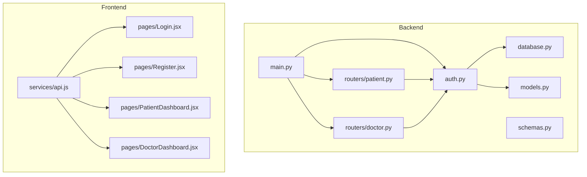
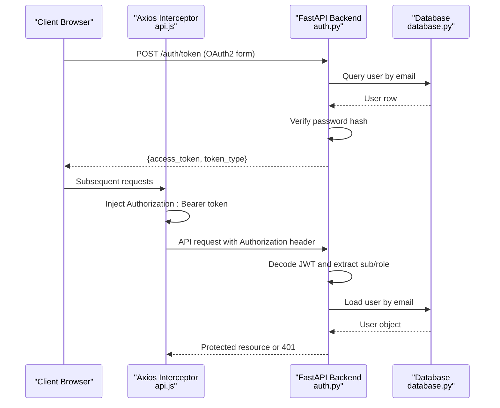
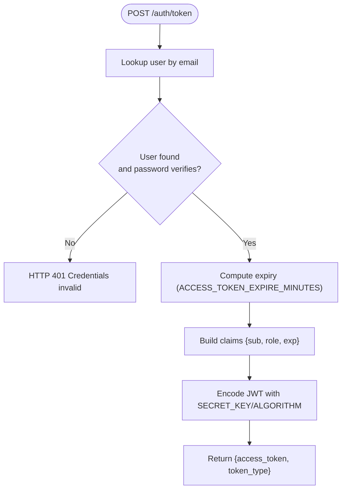
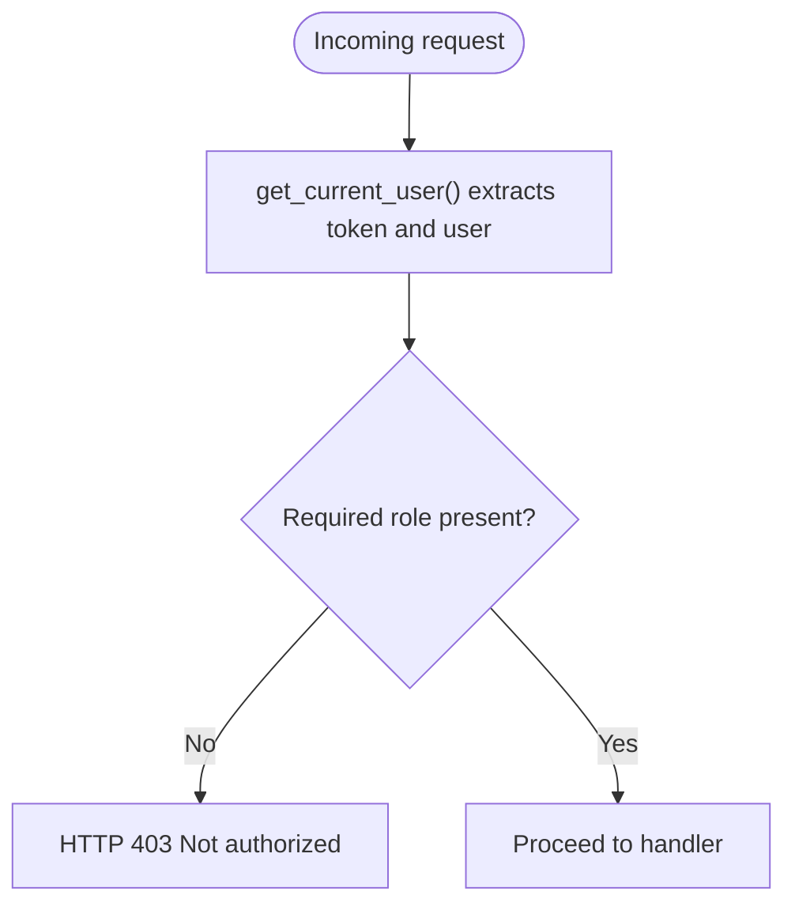
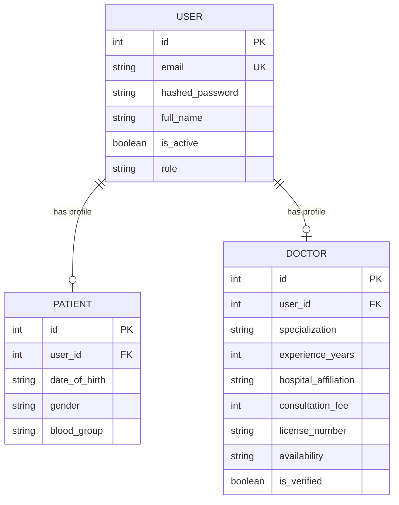
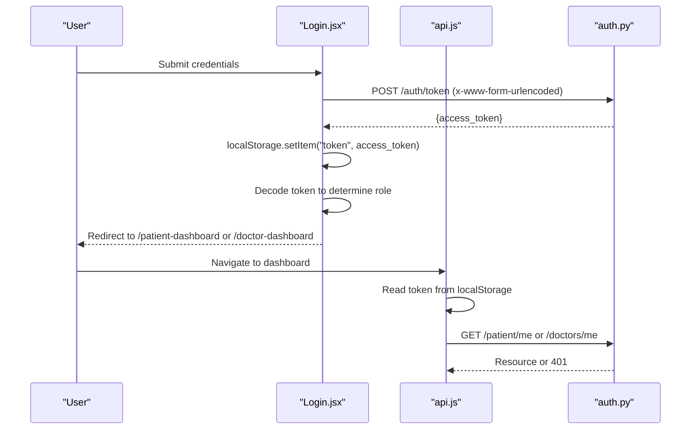
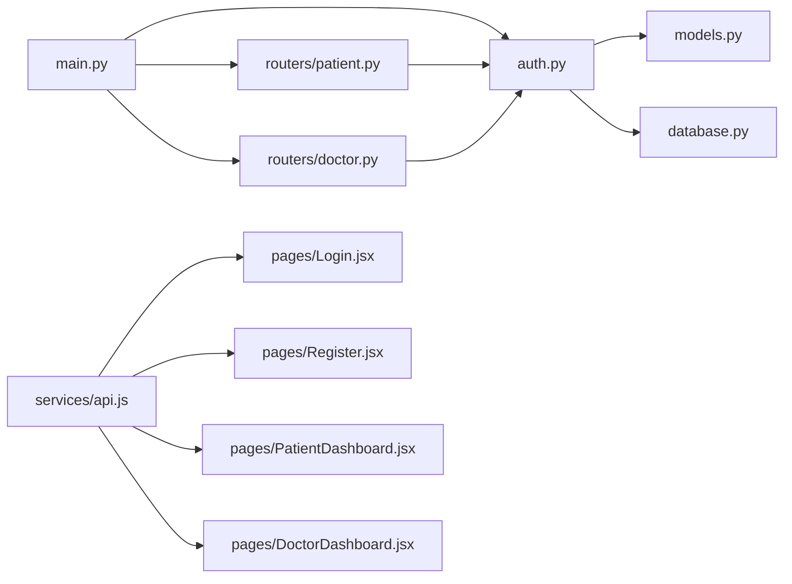

# Authentication & Authorization

<cite>
**Referenced Files in This Document**
- [backend/auth.py](file://backend/auth.py)
- [backend/main.py](file://backend/main.py)
- [backend/models.py](file://backend/models.py)
- [backend/schemas.py](file://backend/schemas.py)
- [backend/routers/patient.py](file://backend/routers/patient.py)
- [backend/routers/doctor.py](file://backend/routers/doctor.py)
- [backend/database.py](file://backend/database.py)
- [backend/init_db.py](file://backend/init_db.py)
- [frontend/src/services/api.js](file://frontend/src/services/api.js)
- [frontend/src/pages/Login.jsx](file://frontend/src/pages/Login.jsx)
- [frontend/src/pages/Register.jsx](file://frontend/src/pages/Register.jsx)
- [frontend/src/App.jsx](file://frontend/src/App.jsx)
- [frontend/src/pages/PatientDashboard.jsx](file://frontend/src/pages/PatientDashboard.jsx)
- [frontend/src/pages/DoctorDashboard.jsx](file://frontend/src/pages/DoctorDashboard.jsx)
</cite>

## Table of Contents
1. [Introduction](#introduction)
2. [Project Structure](#project-structure)
3. [Core Components](#core-components)
4. [Architecture Overview](#architecture-overview)
5. [Detailed Component Analysis](#detailed-component-analysis)
6. [Dependency Analysis](#dependency-analysis)
7. [Performance Considerations](#performance-considerations)
8. [Troubleshooting Guide](#troubleshooting-guide)
9. [Conclusion](#conclusion)
10. [Appendices](#appendices)

## Introduction
This document explains the SmartHealthCare authentication and authorization system. It covers JWT-based authentication, token generation and validation, role-based access control (patient, doctor), password hashing with passlib, token expiration handling, session management, protected routes, permission checks, role-based UI rendering, security considerations, and client-side handling of tokens and errors.

## Project Structure
The authentication system spans backend and frontend:
- Backend FastAPI app defines authentication routes, JWT utilities, and protected routers.
- SQLAlchemy models define users and roles.
- Frontend Axios service attaches Authorization headers and persists tokens in localStorage.

**Diagram sources**
- [backend/main.py](file://backend/main.py#L1-L61)
- [backend/auth.py](file://backend/auth.py#L1-L120)
- [backend/routers/patient.py](file://backend/routers/patient.py#L1-L107)
- [backend/routers/doctor.py](file://backend/routers/doctor.py#L1-L120)
- [backend/models.py](file://backend/models.py#L1-L110)
- [backend/database.py](file://backend/database.py#L1-L22)
- [backend/schemas.py](file://backend/schemas.py#L1-L236)
- [frontend/src/services/api.js](file://frontend/src/services/api.js#L1-L25)
- [frontend/src/pages/Login.jsx](file://frontend/src/pages/Login.jsx#L1-L104)
- [frontend/src/pages/Register.jsx](file://frontend/src/pages/Register.jsx#L1-L124)
- [frontend/src/pages/PatientDashboard.jsx](file://frontend/src/pages/PatientDashboard.jsx#L1-L674)
- [frontend/src/pages/DoctorDashboard.jsx](file://frontend/src/pages/DoctorDashboard.jsx#L1-L698)

**Section sources**
- [backend/main.py](file://backend/main.py#L1-L61)
- [frontend/src/services/api.js](file://frontend/src/services/api.js#L1-L25)

## Core Components
- JWT utilities and token lifecycle:
  - Token creation with expiration and signing.
  - Current user extraction from Authorization header via OAuth2PasswordBearer.
  - Password hashing and verification using passlib.
- Protected routes:
  - Patient router enforces role-based access for patient endpoints.
  - Doctor router enforces role-based access for doctor endpoints.
- Role model:
  - Users have a role field with defaults suitable for registration.
- Frontend token handling:
  - Axios interceptor injects Authorization header.
  - Login stores JWT in localStorage and navigates by role.

**Section sources**
- [backend/auth.py](file://backend/auth.py#L1-L120)
- [backend/routers/patient.py](file://backend/routers/patient.py#L1-L107)
- [backend/routers/doctor.py](file://backend/routers/doctor.py#L1-L120)
- [backend/models.py](file://backend/models.py#L6-L18)
- [frontend/src/services/api.js](file://frontend/src/services/api.js#L1-L25)
- [frontend/src/pages/Login.jsx](file://frontend/src/pages/Login.jsx#L1-L104)

## Architecture Overview
The system uses bearer tokens issued by the backend and consumed by the frontend. Authentication occurs at login; subsequent requests include the token in the Authorization header. Protected routers validate the token and enforce role-based permissions.

**Diagram sources**
- [backend/auth.py](file://backend/auth.py#L106-L119)
- [backend/auth.py](file://backend/auth.py#L39-L55)
- [backend/database.py](file://backend/database.py#L16-L21)
- [frontend/src/services/api.js](file://frontend/src/services/api.js#L10-L22)

## Detailed Component Analysis

### Backend Authentication Module (auth.py)
- Constants and dependencies:
  - Secret key, algorithm, and token expiry minutes.
  - Password context for pbkdf2 hashing.
  - OAuth2PasswordBearer scheme bound to /auth/token.
- Utilities:
  - Hashing and verification helpers.
  - Token creation with optional expiry delta.
  - Current user resolver that decodes JWT and loads user from DB.
- Endpoints:
  - POST /auth/register creates a user and a role-specific profile.
  - POST /auth/token validates credentials and issues a signed JWT containing sub and role.

**Diagram sources**
- [backend/auth.py](file://backend/auth.py#L106-L119)
- [backend/auth.py](file://backend/auth.py#L29-L37)
- [backend/auth.py](file://backend/auth.py#L39-L55)

**Section sources**
- [backend/auth.py](file://backend/auth.py#L1-L120)

### Protected Routes and Role-Based Access Control
- Patient router:
  - GET /patient/me requires role "patient".
  - GET /patient/records requires role "patient".
  - GET /patient/{patient_id}/records requires role "doctor" and filters shared records.
- Doctor router:
  - GET /doctors/me requires role "doctor".
  - PUT /doctors/me updates doctor profile and requires role "doctor".
  - GET /doctors/me/stats requires role "doctor".

**Diagram sources**
- [backend/routers/patient.py](file://backend/routers/patient.py#L11-L25)
- [backend/routers/patient.py](file://backend/routers/patient.py#L54-L62)
- [backend/routers/patient.py](file://backend/routers/patient.py#L64-L85)
- [backend/routers/doctor.py](file://backend/routers/doctor.py#L28-L42)
- [backend/routers/doctor.py](file://backend/routers/doctor.py#L44-L76)
- [backend/routers/doctor.py](file://backend/routers/doctor.py#L78-L109)

**Section sources**
- [backend/routers/patient.py](file://backend/routers/patient.py#L1-L107)
- [backend/routers/doctor.py](file://backend/routers/doctor.py#L1-L120)

### Data Model and Roles
- User model includes role with default "patient".
- Patient and Doctor profiles link to User via foreign keys.
- Registration endpoint creates role-specific profiles.

**Diagram sources**
- [backend/models.py](file://backend/models.py#L6-L47)

**Section sources**
- [backend/models.py](file://backend/models.py#L1-L110)
- [backend/auth.py](file://backend/auth.py#L60-L104)

### Frontend Authentication Handling
- Axios interceptor:
  - Reads token from localStorage and sets Authorization header for all requests.
- Login page:
  - Posts credentials to /auth/token using form encoding.
  - Stores returned access_token in localStorage.
  - Decodes token to determine role and navigates accordingly.
- Dashboards:
  - PatientDashboard and DoctorDashboard consume protected endpoints.
  - DoctorDashboard handles 401 by redirecting to login.

**Diagram sources**
- [frontend/src/pages/Login.jsx](file://frontend/src/pages/Login.jsx#L13-L47)
- [frontend/src/services/api.js](file://frontend/src/services/api.js#L10-L22)
- [backend/auth.py](file://backend/auth.py#L106-L119)
- [frontend/src/pages/PatientDashboard.jsx](file://frontend/src/pages/PatientDashboard.jsx#L42-L54)
- [frontend/src/pages/DoctorDashboard.jsx](file://frontend/src/pages/DoctorDashboard.jsx#L55-L62)

**Section sources**
- [frontend/src/services/api.js](file://frontend/src/services/api.js#L1-L25)
- [frontend/src/pages/Login.jsx](file://frontend/src/pages/Login.jsx#L1-L104)
- [frontend/src/pages/PatientDashboard.jsx](file://frontend/src/pages/PatientDashboard.jsx#L1-L674)
- [frontend/src/pages/DoctorDashboard.jsx](file://frontend/src/pages/DoctorDashboard.jsx#L1-L698)

## Dependency Analysis
- Backend:
  - main.py wires CORS and includes auth and feature routers.
  - auth.py depends on models, database, schemas, and uses OAuth2PasswordBearer and JWT utilities.
  - Protected routers depend on auth.get_current_user for authorization.
- Frontend:
  - api.js depends on axios and localStorage.
  - Pages depend on api.js and navigation.

**Diagram sources**
- [backend/main.py](file://backend/main.py#L34-L44)
- [backend/auth.py](file://backend/auth.py#L1-L21)
- [backend/routers/patient.py](file://backend/routers/patient.py#L1-L9)
- [backend/routers/doctor.py](file://backend/routers/doctor.py#L1-L9)
- [frontend/src/services/api.js](file://frontend/src/services/api.js#L1-L25)

**Section sources**
- [backend/main.py](file://backend/main.py#L1-L61)
- [backend/auth.py](file://backend/auth.py#L1-L120)
- [frontend/src/services/api.js](file://frontend/src/services/api.js#L1-L25)

## Performance Considerations
- Token lifetime: ACCESS_TOKEN_EXPIRE_MINUTES controls short-lived access tokens. Consider refresh tokens for long sessions if needed.
- Password hashing cost: pbkdf2 parameters affect CPU/memory usage during login; tune via passlib context if scaling.
- Database queries: Each protected request performs a single user lookup by email; ensure email index is effective.
- CORS: Origins are configured per developer environments; restrict origins in production.

[No sources needed since this section provides general guidance]

## Troubleshooting Guide
Common issues and resolutions:
- 401 Unauthorized on protected routes:
  - Cause: Missing or invalid Authorization header; expired token; malformed JWT.
  - Resolution: Re-authenticate to obtain a new token; verify token is stored in localStorage.
- 403 Forbidden:
  - Cause: Role mismatch for the requested endpoint.
  - Resolution: Ensure user role matches required role; check router permission guards.
- Registration fails:
  - Cause: Duplicate email; database error during commit.
  - Resolution: Use unique email; check backend logs for rollback reasons.
- Frontend not navigating after login:
  - Cause: Token decoding failure or missing role in token payload.
  - Resolution: Confirm login response includes access_token; decode token to inspect role.
- CORS errors:
  - Cause: Frontend origin not allowed by backend.
  - Resolution: Add frontend origin to allowed list in main.py.

**Section sources**
- [backend/auth.py](file://backend/auth.py#L106-L119)
- [backend/routers/patient.py](file://backend/routers/patient.py#L16-L17)
- [backend/routers/doctor.py](file://backend/routers/doctor.py#L33-L34)
- [frontend/src/pages/Login.jsx](file://frontend/src/pages/Login.jsx#L30-L40)
- [backend/main.py](file://backend/main.py#L19-L32)

## Conclusion
SmartHealthCare implements a straightforward JWT-based authentication system with role-aware protected routes. The backend handles token issuance, validation, and user loading; the frontend persists tokens and enforces role-based navigation. Security can be strengthened by adding refresh tokens, CSRF protections, secure headers, and stricter CORS policies in production.

[No sources needed since this section summarizes without analyzing specific files]

## Appendices

### Security Best Practices
- Use environment variables for SECRET_KEY and ALGORITHM.
- Enforce HTTPS and secure cookies if deploying behind TLS.
- Add CSRF protection for state-changing requests.
- Set secure, sameSite, and httpOnly flags for cookies if using cookie-based sessions.
- Implement rate limiting and lockout policies for login attempts.
- Rotate secrets periodically and invalidate tokens on privilege changes.

[No sources needed since this section provides general guidance]

### Token Storage Strategies
- Client-side:
  - Store access_token in secure HTTP-only cookies if feasible; otherwise, use localStorage with caution.
  - Avoid storing sensitive claims in local storage; rely on backend validation.
- Server-side:
  - Maintain a blacklist/set of invalidated tokens if logout or token rotation is required.

[No sources needed since this section provides general guidance]

### Protected Route Implementation Checklist
- Define get_current_user dependency to extract and validate token.
- Apply role checks at router level for endpoints requiring specific roles.
- Return appropriate HTTP status codes (401/403) on failures.
- Ensure all protected endpoints use Depends(get_current_user).

**Section sources**
- [backend/auth.py](file://backend/auth.py#L39-L55)
- [backend/routers/patient.py](file://backend/routers/patient.py#L16-L17)
- [backend/routers/doctor.py](file://backend/routers/doctor.py#L33-L34)