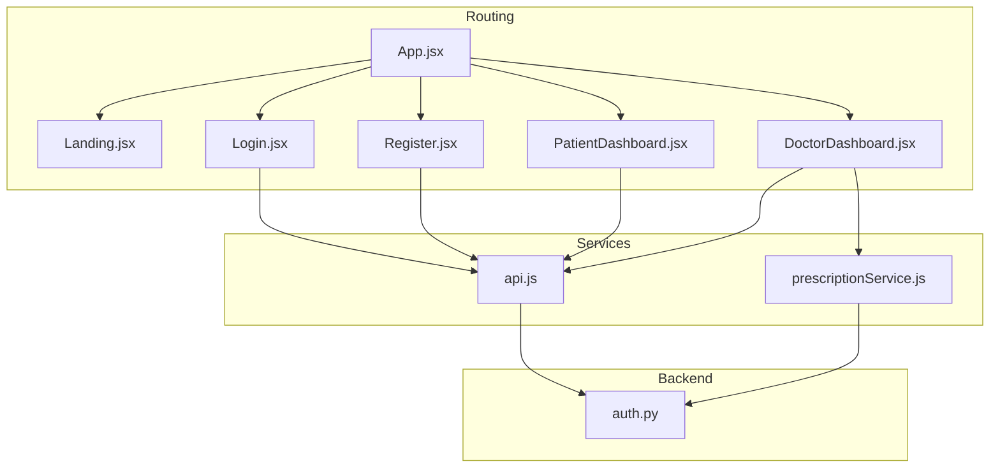
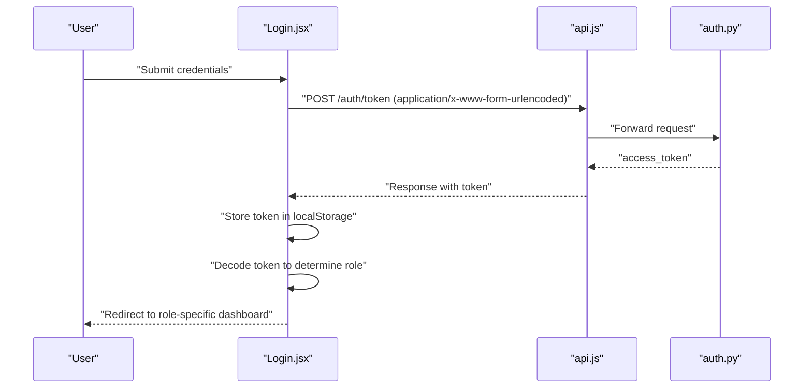
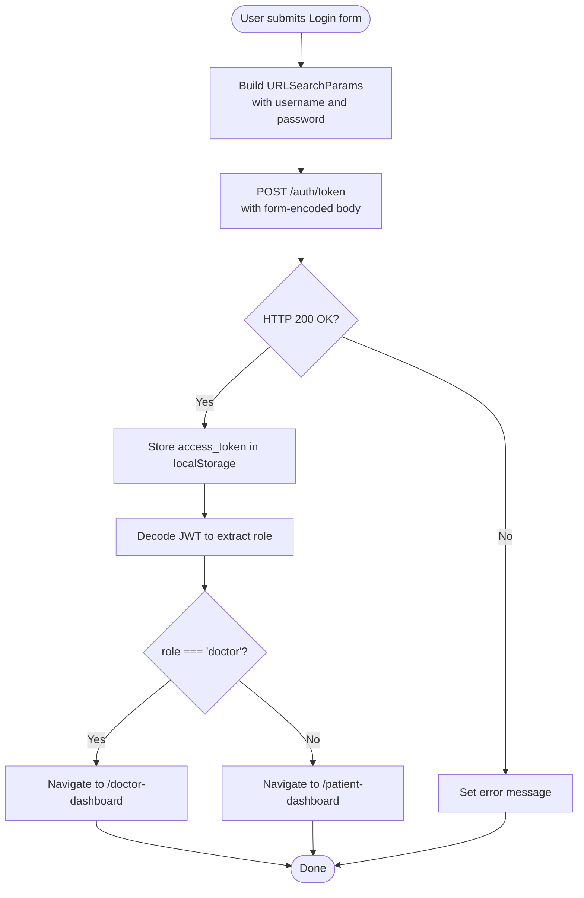
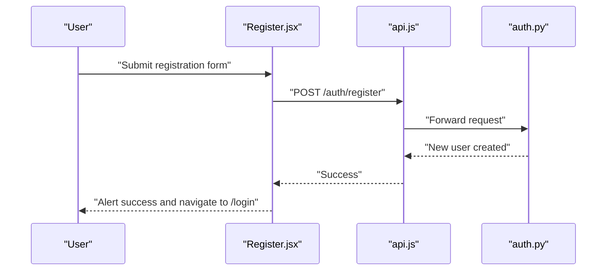
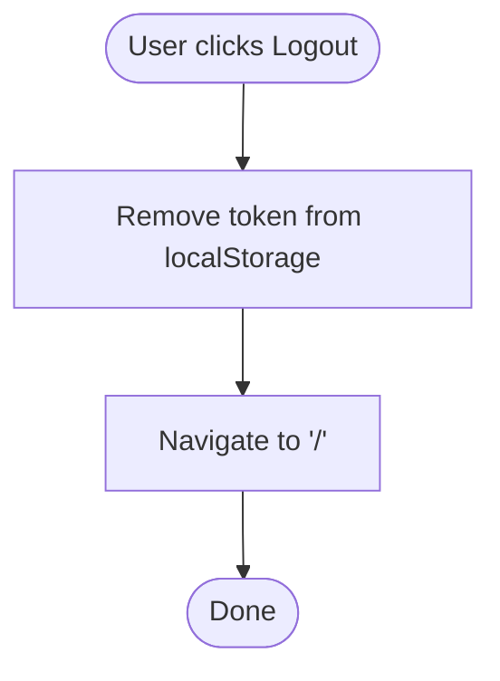
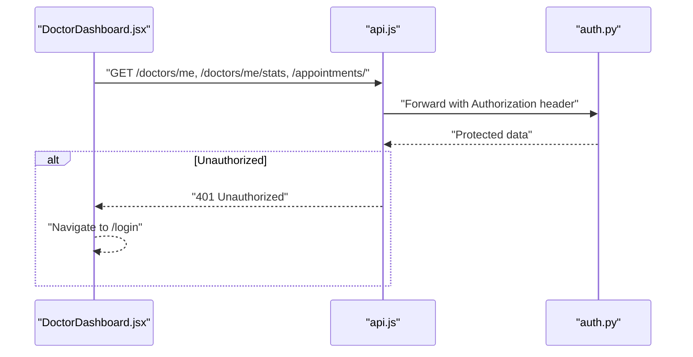
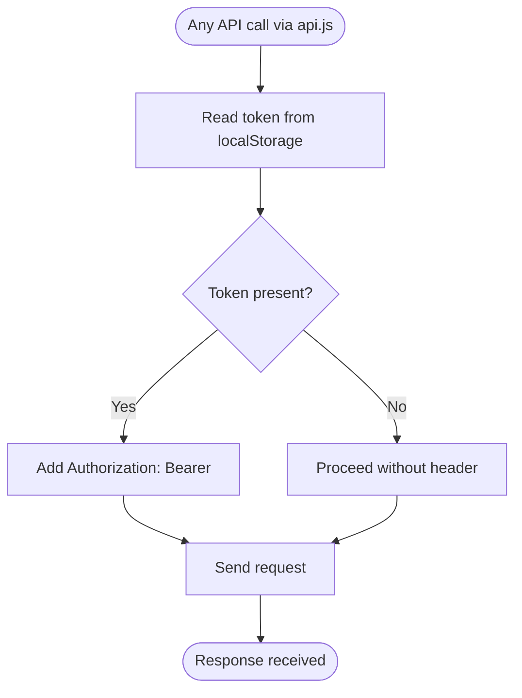
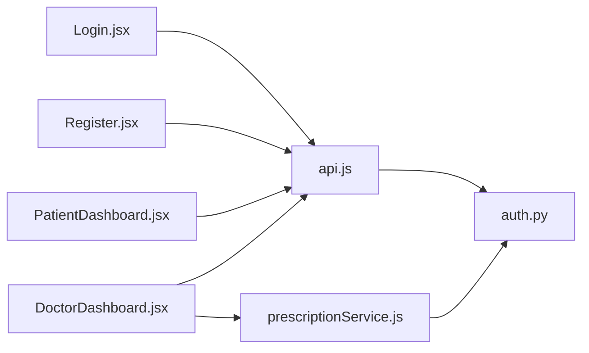

# Client-Side Authentication Handling

<cite>
**Referenced Files in This Document**
- [App.jsx](file://frontend/src/App.jsx)
- [main.jsx](file://frontend/src/main.jsx)
- [Login.jsx](file://frontend/src/pages/Login.jsx)
- [Register.jsx](file://frontend/src/pages/Register.jsx)
- [Landing.jsx](file://frontend/src/pages/Landing.jsx)
- [DoctorDashboard.jsx](file://frontend/src/pages/DoctorDashboard.jsx)
- [PatientDashboard.jsx](file://frontend/src/pages/PatientDashboard.jsx)
- [api.js](file://frontend/src/services/api.js)
- [prescriptionService.js](file://frontend/src/services/prescriptionService.js)
- [auth.py](file://backend/auth.py)
</cite>

## Table of Contents
1. [Introduction](#introduction)
2. [Project Structure](#project-structure)
3. [Core Components](#core-components)
4. [Architecture Overview](#architecture-overview)
5. [Detailed Component Analysis](#detailed-component-analysis)
6. [Dependency Analysis](#dependency-analysis)
7. [Performance Considerations](#performance-considerations)
8. [Security Considerations](#security-considerations)
9. [Troubleshooting Guide](#troubleshooting-guide)
10. [Conclusion](#conclusion)

## Introduction
This document explains the client-side authentication handling in the React frontend. It covers the login, registration, and logout flows, token storage and persistence, automatic token injection in API requests, authentication state management, protected route behavior, role-based UI rendering, and error handling patterns. It also highlights current limitations and provides recommendations for improving security and robustness.

## Project Structure
The frontend is organized around pages, services, and shared components:
- Pages: Landing, Login, Register, PatientDashboard, DoctorDashboard
- Services: API client with interceptors and additional service modules
- Routing: Centralized in App.jsx with react-router-dom

**Diagram sources**
- [App.jsx](file://frontend/src/App.jsx#L1-L28)
- [Login.jsx](file://frontend/src/pages/Login.jsx#L1-L104)
- [Register.jsx](file://frontend/src/pages/Register.jsx#L1-L124)
- [PatientDashboard.jsx](file://frontend/src/pages/PatientDashboard.jsx#L1-L674)
- [DoctorDashboard.jsx](file://frontend/src/pages/DoctorDashboard.jsx#L1-L705)
- [api.js](file://frontend/src/services/api.js#L1-L25)
- [prescriptionService.js](file://frontend/src/services/prescriptionService.js#L1-L80)
- [auth.py](file://backend/auth.py#L1-L120)

**Section sources**
- [App.jsx](file://frontend/src/App.jsx#L1-L28)
- [main.jsx](file://frontend/src/main.jsx#L1-L11)

## Core Components
- Authentication flow:
  - Login: Submits credentials to backend, stores token, decodes role, navigates to role-specific dashboard
  - Registration: Posts user data to backend
  - Logout: Removes token and navigates home
- Token management:
  - Storage: localStorage
  - Persistence: Browser session until logout
  - Injection: Axios request interceptor adds Authorization header
- Protected routes:
  - Dashboards attempt protected API calls; on 401, redirect to login
- Role-based UI:
  - Login decodes token to determine role and redirects accordingly
  - Dashboards render role-specific content

**Section sources**
- [Login.jsx](file://frontend/src/pages/Login.jsx#L1-L104)
- [Register.jsx](file://frontend/src/pages/Register.jsx#L1-L124)
- [DoctorDashboard.jsx](file://frontend/src/pages/DoctorDashboard.jsx#L65-L68)
- [api.js](file://frontend/src/services/api.js#L1-L25)

## Architecture Overview
The authentication flow integrates frontend pages, the API service, and the backend authentication endpoint.

**Diagram sources**
- [Login.jsx](file://frontend/src/pages/Login.jsx#L13-L47)
- [api.js](file://frontend/src/services/api.js#L1-L25)
- [auth.py](file://backend/auth.py#L106-L119)

## Detailed Component Analysis

### Login Flow
- Captures email/password, disables submit during loading, clears previous errors
- Posts to `/auth/token` with form-encoded body
- On success, stores token in localStorage and decodes the JWT to determine role
- Redirects to `/doctor-dashboard` or `/patient-dashboard` based on role
- On failure, sets an error message

**Diagram sources**
- [Login.jsx](file://frontend/src/pages/Login.jsx#L13-L47)

**Section sources**
- [Login.jsx](file://frontend/src/pages/Login.jsx#L1-L104)

### Registration Flow
- Collects full_name, email, password, and role
- Submits to `/auth/register`
- On success, alerts and navigates to login
- On error, displays backend-provided detail message

**Diagram sources**
- [Register.jsx](file://frontend/src/pages/Register.jsx#L17-L32)
- [api.js](file://frontend/src/services/api.js#L1-L25)
- [auth.py](file://backend/auth.py#L60-L104)

**Section sources**
- [Register.jsx](file://frontend/src/pages/Register.jsx#L1-L124)

### Logout Flow
- Removes token from localStorage
- Navigates to landing page

**Diagram sources**
- [DoctorDashboard.jsx](file://frontend/src/pages/DoctorDashboard.jsx#L65-L68)

**Section sources**
- [DoctorDashboard.jsx](file://frontend/src/pages/DoctorDashboard.jsx#L65-L68)

### Protected Route Behavior and Role-Based UI
- Dashboards call protected endpoints; on 401, redirect to login
- Login decodes token to determine role and route accordingly

**Diagram sources**
- [DoctorDashboard.jsx](file://frontend/src/pages/DoctorDashboard.jsx#L34-L63)
- [api.js](file://frontend/src/services/api.js#L1-L25)
- [auth.py](file://backend/auth.py#L39-L55)

**Section sources**
- [DoctorDashboard.jsx](file://frontend/src/pages/DoctorDashboard.jsx#L34-L63)
- [Login.jsx](file://frontend/src/pages/Login.jsx#L30-L40)

### Token Storage and Automatic Injection
- Storage: localStorage under the key "token"
- Persistence: Until logout removes it
- Injection: Axios request interceptor reads token and attaches Authorization header

**Diagram sources**
- [api.js](file://frontend/src/services/api.js#L10-L22)

**Section sources**
- [api.js](file://frontend/src/services/api.js#L1-L25)

### Additional Authenticated Service Example
- The prescription service demonstrates manual token retrieval for endpoints not covered by the global interceptor

**Section sources**
- [prescriptionService.js](file://frontend/src/services/prescriptionService.js#L1-L80)

## Dependency Analysis
- Pages depend on the API service for authentication and protected data
- The API service depends on the backend authentication endpoint
- Dashboards depend on protected backend endpoints and trigger redirects on unauthorized responses

**Diagram sources**
- [Login.jsx](file://frontend/src/pages/Login.jsx#L1-L104)
- [Register.jsx](file://frontend/src/pages/Register.jsx#L1-L124)
- [PatientDashboard.jsx](file://frontend/src/pages/PatientDashboard.jsx#L1-L674)
- [DoctorDashboard.jsx](file://frontend/src/pages/DoctorDashboard.jsx#L1-L705)
- [api.js](file://frontend/src/services/api.js#L1-L25)
- [prescriptionService.js](file://frontend/src/services/prescriptionService.js#L1-L80)
- [auth.py](file://backend/auth.py#L1-L120)

**Section sources**
- [App.jsx](file://frontend/src/App.jsx#L1-L28)

## Performance Considerations
- Token decoding on login is lightweight but unnecessary if the backend included role in the token response
- Global interceptor avoids repetitive header setting across modules
- Consider batching protected requests in dashboards to reduce network overhead

## Security Considerations
- Token storage: Using localStorage exposes tokens to XSS attacks. Prefer httpOnly cookies for CSRF protection and consider short-lived tokens with refresh mechanisms.
- Token injection: Current interceptor sends Authorization header on all requests; ensure sensitive endpoints are properly protected on the backend.
- Role determination: Decoding JWT client-side is convenient but trust the backend to enforce role-based access control.
- Error handling: Display generic messages to users; log detailed errors securely on the server.

Recommendations:
- Implement httpOnly cookies for tokens and CSRF protection
- Enforce SameSite and Secure flags on cookies
- Add token refresh mechanism (e.g., refresh endpoint) to minimize long-lived access tokens
- Sanitize and validate all inputs and avoid exposing sensitive data in UI

**Section sources**
- [Login.jsx](file://frontend/src/pages/Login.jsx#L30-L40)
- [api.js](file://frontend/src/services/api.js#L10-L22)
- [auth.py](file://backend/auth.py#L10-L13)

## Troubleshooting Guide
Common issues and recovery patterns:
- Login fails with invalid credentials:
  - Verify backend credentials and error response format
  - Ensure form-encoded content-type for token endpoint
- 401 Unauthorized on dashboard:
  - Confirm token exists in localStorage
  - Check interceptor adds Authorization header
  - Validate backend token verification logic
- Token appears stale:
  - Backend sets short-lived tokens; implement refresh strategy
- Role mismatch:
  - Ensure backend includes role in token payload
  - Avoid relying solely on client-side decoding

**Section sources**
- [Login.jsx](file://frontend/src/pages/Login.jsx#L41-L46)
- [DoctorDashboard.jsx](file://frontend/src/pages/DoctorDashboard.jsx#L55-L62)
- [api.js](file://frontend/src/services/api.js#L10-L22)
- [auth.py](file://backend/auth.py#L106-L119)

## Conclusion
The frontend implements a straightforward token-based authentication flow with localStorage, a global request interceptor for Authorization headers, and role-based routing. While functional, the current design lacks secure cookie storage, refresh mechanisms, and centralized state management. Enhancing security with httpOnly cookies, implementing token refresh, and centralizing authentication state would significantly improve robustness and safety.