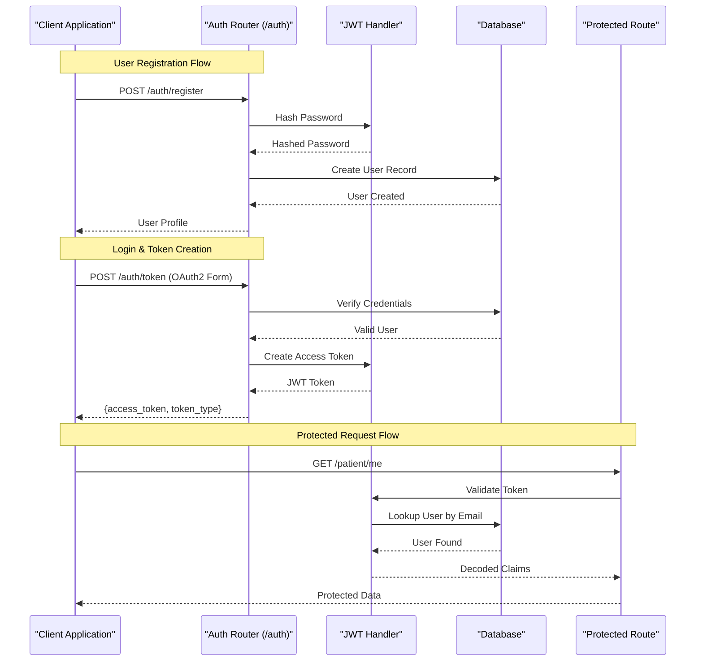
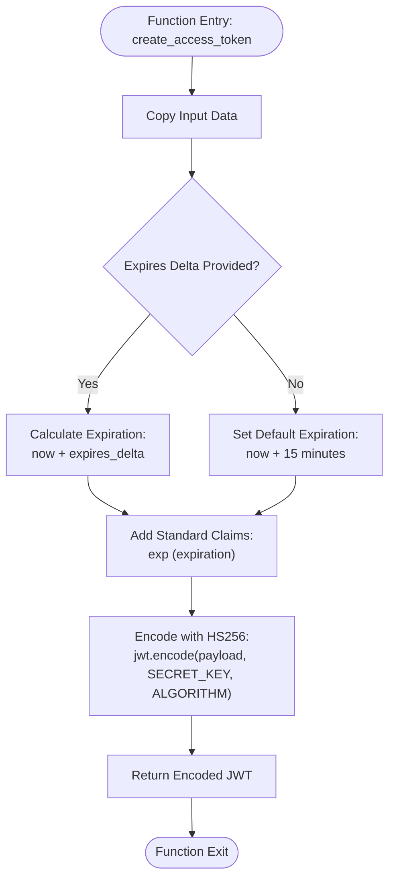
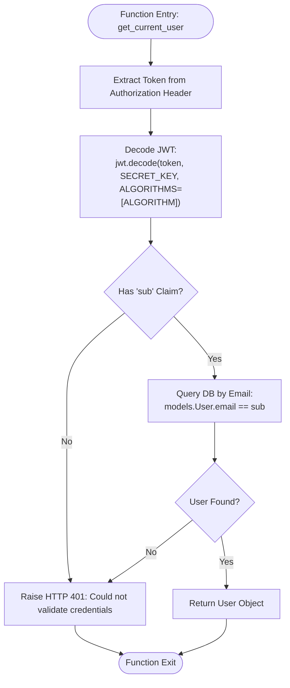
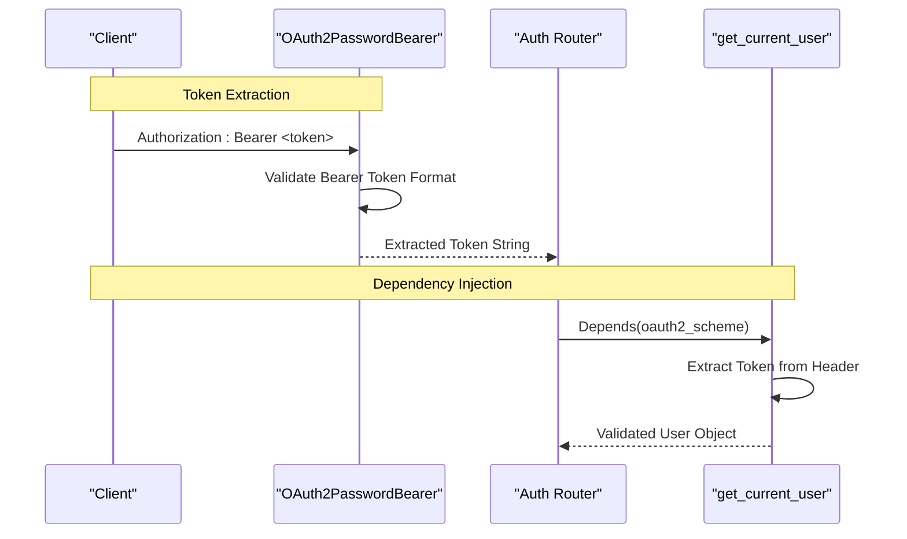
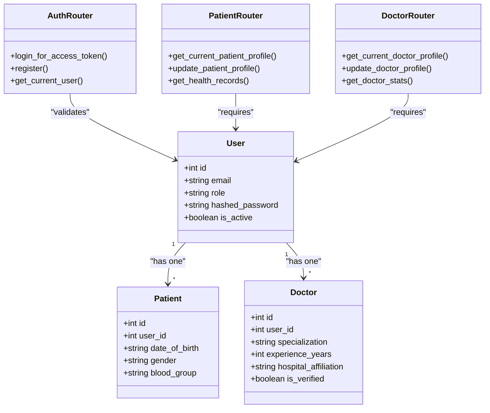
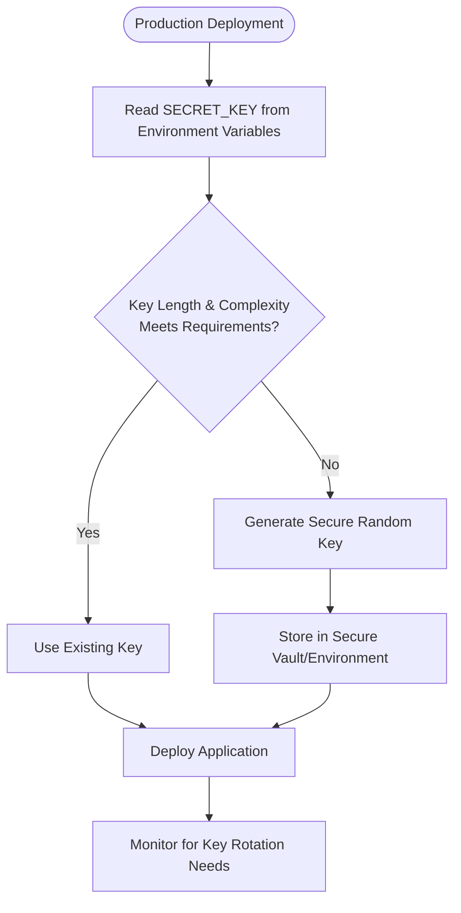
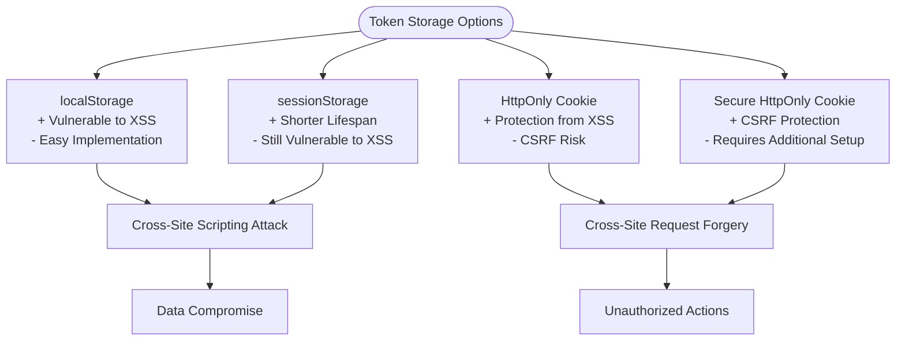
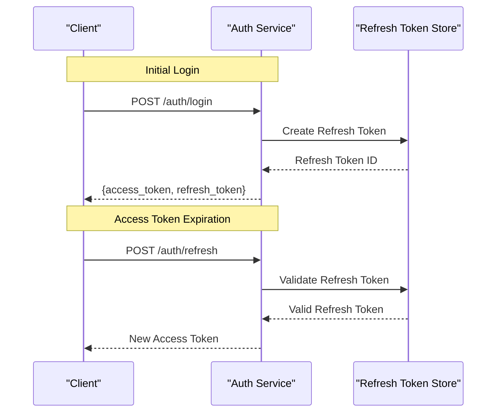

# JWT Authentication Implementation

<cite>
**Referenced Files in This Document**
- [auth.py](file://backend/auth.py)
- [main.py](file://backend/main.py)
- [schemas.py](file://backend/schemas.py)
- [models.py](file://backend/models.py)
- [database.py](file://backend/database.py)
- [requirements.txt](file://requirements.txt)
- [patient.py](file://backend/routers/patient.py)
- [doctor.py](file://backend/routers/doctor.py)
- [Login.jsx](file://frontend/src/pages/Login.jsx)
- [api.js](file://frontend/src/services/api.js)
- [.env.example](file://.env.example)
</cite>

## Table of Contents
1. [Introduction](#introduction)
2. [Project Structure](#project-structure)
3. [Core Components](#core-components)
4. [Architecture Overview](#architecture-overview)
5. [Detailed Component Analysis](#detailed-component-analysis)
6. [Dependency Analysis](#dependency-analysis)
7. [Performance Considerations](#performance-considerations)
8. [Troubleshooting Guide](#troubleshooting-guide)
9. [Security Best Practices](#security-best-practices)
10. [Token Storage Recommendations](#token-storage-recommendations)
11. [Conclusion](#conclusion)

## Introduction
This document provides comprehensive documentation for the JWT authentication implementation in SmartHealthCare. It covers the complete JWT workflow including token generation, HS256 encoding, expiration handling, and validation mechanisms. The implementation leverages FastAPI's OAuth2PasswordBearer for secure token extraction from Authorization headers and integrates with SQLAlchemy for user validation against the database.

## Project Structure
The authentication system is implemented primarily in the backend with supporting components in the frontend for token storage and transmission:

```mermaid
graph TB
subgraph "Backend"
A[auth.py<br/>JWT & OAuth2 Implementation]
B[main.py<br/>FastAPI Application]
C[schemas.py<br/>Pydantic Models]
D[models.py<br/>Database Models]
E[database.py<br/>Database Engine]
F[routers/<br/>Role-based Routes]
end
subgraph "Frontend"
G[Login.jsx<br/>Token Retrieval]
H[api.js<br/>Authorization Headers]
end
subgraph "External Dependencies"
I[FastAPI]
J[jose (python-jose)]
K[passlib]
L[SQLAlchemy]
end
A --> B
B --> F
A --> C
A --> D
A --> E
G --> H
H --> B
A --> I
A --> J
A --> K
A --> L
```

**Diagram sources**
- [auth.py](file://backend/auth.py#L1-L120)
- [main.py](file://backend/main.py#L1-L61)
- [schemas.py](file://backend/schemas.py#L1-L236)
- [models.py](file://backend/models.py#L1-L110)
- [database.py](file://backend/database.py#L1-L22)
- [requirements.txt](file://requirements.txt#L1-L14)

**Section sources**
- [auth.py](file://backend/auth.py#L1-L120)
- [main.py](file://backend/main.py#L1-L61)
- [requirements.txt](file://requirements.txt#L1-L14)

## Core Components

### JWT Configuration and Constants
The authentication module defines essential JWT parameters:
- **Algorithm**: HS256 (symmetric key encryption)
- **Secret Key**: Currently hardcoded for development ("supersecretkey")
- **Access Token Expiration**: 30 minutes configurable via ACCESS_TOKEN_EXPIRE_MINUTES
- **OAuth2 Password Bearer**: Token endpoint at "auth/token"

### Token Structure
The JWT payload contains two primary claims:
- **sub (Subject)**: User's email address
- **role**: User's role (patient, doctor, admin)

### Password Hashing
The system uses PBKDF2-SHA256 algorithm for password hashing through passlib's CryptContext.

**Section sources**
- [auth.py](file://backend/auth.py#L10-L16)
- [auth.py](file://backend/auth.py#L23-L27)
- [requirements.txt](file://requirements.txt#L5-L6)

## Architecture Overview



**Diagram sources**
- [auth.py](file://backend/auth.py#L60-L104)
- [auth.py](file://backend/auth.py#L106-L119)
- [auth.py](file://backend/auth.py#L39-L55)
- [patient.py](file://backend/routers/patient.py#L11-L25)

## Detailed Component Analysis

### JWT Token Generation Process



**Diagram sources**
- [auth.py](file://backend/auth.py#L29-L37)

The token generation process follows these steps:
1. Creates a copy of the input data dictionary
2. Calculates expiration time either from provided expires_delta or defaults to 15 minutes
3. Adds the standard JWT expiration claim (exp)
4. Encodes the payload using HS256 algorithm with the shared secret key
5. Returns the encoded JWT string

### Token Validation Mechanism



**Diagram sources**
- [auth.py](file://backend/auth.py#L39-L55)

The validation process ensures:
1. Token extraction via OAuth2PasswordBearer dependency
2. JWT decoding with signature verification using the shared secret
3. Extraction of the subject claim (user email)
4. Database lookup to verify user existence
5. Return of the authenticated user object

### OAuth2PasswordBearer Implementation

The system implements OAuth2 password flow with the following characteristics:



**Diagram sources**
- [auth.py](file://backend/auth.py#L16)
- [auth.py](file://backend/auth.py#L39-L55)

Key implementation details:
- Token URL: "auth/token"
- Header format: "Authorization: Bearer <token>"
- Automatic validation during dependency injection
- Seamless integration with FastAPI's dependency system

### Role-Based Access Control

The authentication system supports role-based access control through protected routes:



**Diagram sources**
- [models.py](file://backend/models.py#L6-L18)
- [models.py](file://backend/models.py#L20-L47)
- [auth.py](file://backend/auth.py#L39-L55)
- [patient.py](file://backend/routers/patient.py#L11-L25)
- [doctor.py](file://backend/routers/doctor.py#L28-L42)

**Section sources**
- [auth.py](file://backend/auth.py#L106-L119)
- [auth.py](file://backend/auth.py#L39-L55)
- [patient.py](file://backend/routers/patient.py#L11-L25)
- [doctor.py](file://backend/routers/doctor.py#L28-L42)

## Dependency Analysis

```mermaid
graph TB
subgraph "Authentication Module Dependencies"
A[auth.py]
B[jose (JWT library)]
C[passlib (password hashing)]
D[fastapi.security (OAuth2)]
E[sqlalchemy.orm (database)]
end
subgraph "Application Dependencies"
F[FastAPI]
G[SQLAlchemy]
H[Python-dotenv]
end
subgraph "Frontend Dependencies"
I[Axios]
J[React Router]
end
A --> B
A --> C
A --> D
A --> E
F --> A
G --> A
H --> A
I --> F
J --> I
```

**Diagram sources**
- [requirements.txt](file://requirements.txt#L1-L14)
- [auth.py](file://backend/auth.py#L1-L8)

The authentication system has minimal external dependencies:
- **jose**: Provides JWT encoding/decoding functionality
- **passlib**: Handles password hashing with PBKDF2-SHA256
- **fastapi.security**: Implements OAuth2 password flow
- **sqlalchemy.orm**: Manages database connections and queries

**Section sources**
- [requirements.txt](file://requirements.txt#L1-L14)
- [auth.py](file://backend/auth.py#L1-L8)

## Performance Considerations

### Token Expiration Strategy
- **Default Expiration**: 15 minutes for manual token creation
- **Configurable Expiration**: 30 minutes for login-generated tokens
- **Optimization Opportunity**: Consider implementing shorter-lived access tokens with refresh token rotation for enhanced security

### Database Query Optimization
- **Single User Lookup**: Each protected request performs one database query
- **Potential Improvement**: Implement Redis caching for frequently accessed user profiles

### Memory Management
- **Token Validation**: No persistent state stored server-side
- **Memory Efficiency**: Stateless JWT validation reduces memory footprint

## Troubleshooting Guide

### Common Authentication Issues

**Invalid Credentials Error (HTTP 401)**
- Verify username/password combination matches database records
- Check password hashing algorithm compatibility
- Ensure user account is active (is_active = True)

**Token Validation Failure**
- Confirm JWT was signed with the correct SECRET_KEY
- Verify token hasn't expired (exp claim)
- Check algorithm consistency (HS256)

**Authorization Header Issues**
- Ensure proper header format: "Authorization: Bearer <token>"
- Verify token isn't empty or malformed
- Check for whitespace or special characters in token

### Debugging Steps

1. **Enable Logging**: Check backend logs for authentication events
2. **Token Inspection**: Decode JWT manually to verify claims
3. **Database Verification**: Confirm user exists and is active
4. **Header Validation**: Verify Authorization header format

**Section sources**
- [auth.py](file://backend/auth.py#L40-L54)
- [Login.jsx](file://frontend/src/pages/Login.jsx#L41-L46)

## Security Best Practices

### Secret Key Management
**Critical Security Concern**: The current implementation uses a hardcoded secret key ("supersecretkey"). This must be changed immediately for production:



**Diagram sources**
- [auth.py](file://backend/auth.py#L10-L11)

### Production Security Enhancements
1. **Environment Variables**: Load SECRET_KEY from environment variables
2. **Key Rotation**: Implement periodic key rotation with backward compatibility
3. **HTTPS Only**: Enforce HTTPS for all authentication endpoints
4. **CORS Configuration**: Restrict origins to trusted domains only
5. **Rate Limiting**: Implement rate limiting for authentication endpoints
6. **Audit Logging**: Log all authentication attempts and failures

### Token Storage Security
**Frontend Storage**: Current implementation stores JWT in localStorage, which has security implications:



**Diagram sources**
- [Login.jsx](file://frontend/src/pages/Login.jsx#L28)
- [api.js](file://frontend/src/services/api.js#L13-L15)

## Token Storage Recommendations

### Frontend Storage Strategies

**Current Implementation (localStorage)**
- **Pros**: Simple implementation, works with current code
- **Cons**: Vulnerable to XSS attacks, persistent across browser sessions

**Recommended Alternatives**

1. **HttpOnly Cookies** (Most Secure)
   - Automatically sent with requests
   - Protected from JavaScript access
   - Can be made SameSite and Secure

2. **Encrypted Storage**
   - Encrypt JWT before storing
   - Use browser's crypto APIs
   - Requires additional implementation

3. **Short-lived Tokens with Refresh Flow**
   - Store refresh tokens securely
   - Keep access tokens in memory only
   - Implement automatic refresh

### Backend Token Enhancement
Consider adding refresh token support for improved security:



**Diagram sources**
- [auth.py](file://backend/auth.py#L106-L119)

## Conclusion

The SmartHealthCare JWT authentication implementation provides a solid foundation for secure user authentication with the following strengths:

**Implemented Features:**
- Complete JWT lifecycle management (creation, validation, expiration)
- OAuth2 password flow integration
- Role-based access control
- Password hashing with PBKDF2-SHA256
- Clean separation of concerns in the auth module

**Areas Requiring Attention:**
1. **Security Hardening**: Replace hardcoded secret key with environment-based configuration
2. **Enhanced Storage**: Implement HttpOnly cookies for frontend token storage
3. **Refresh Token Support**: Add refresh token mechanism for improved security
4. **Production Hardening**: Implement rate limiting, audit logging, and monitoring

The current implementation serves as an excellent starting point that can be easily enhanced to meet production security requirements while maintaining its clean architecture and clear separation of authentication concerns.