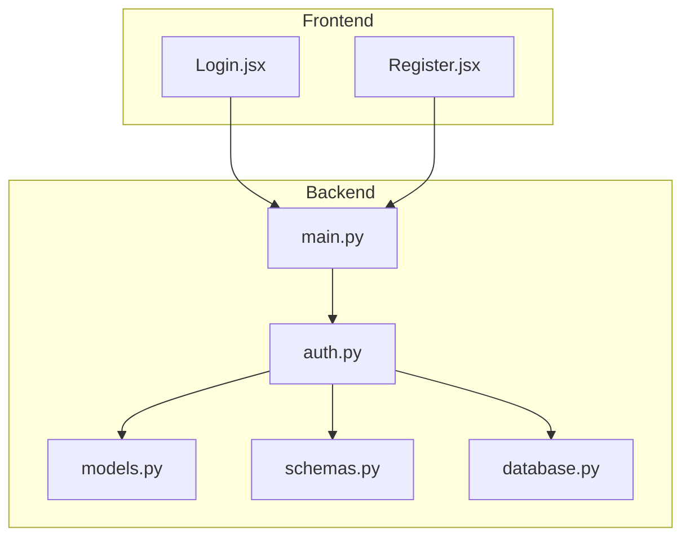
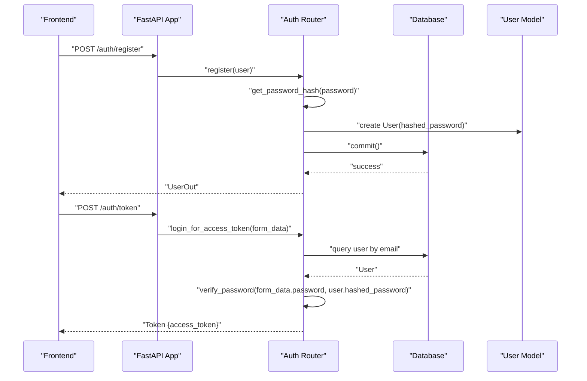
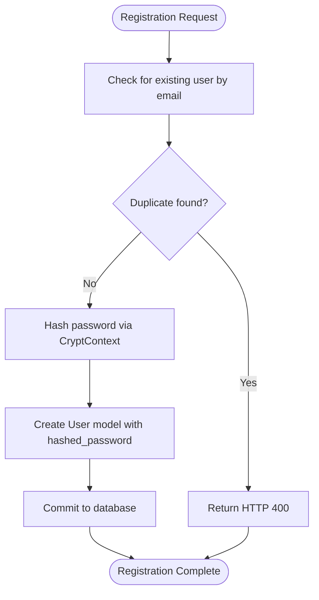
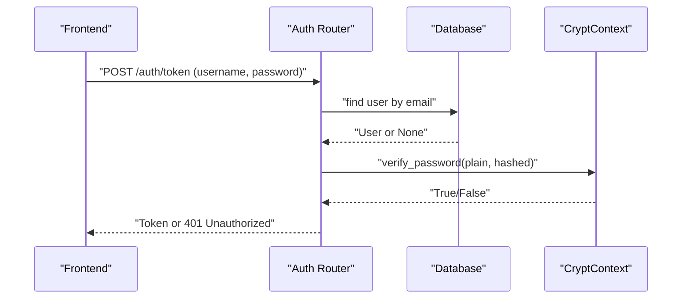
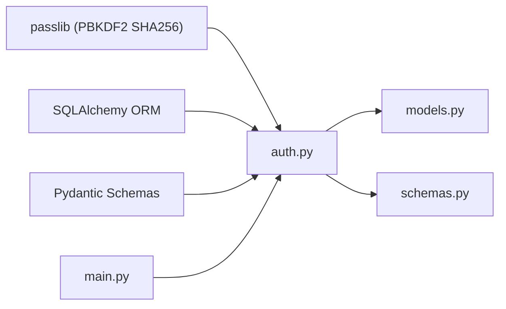

# Password Hashing & Security

<cite>
**Referenced Files in This Document**
- [backend/auth.py](file://backend/auth.py)
- [backend/models.py](file://backend/models.py)
- [backend/schemas.py](file://backend/schemas.py)
- [backend/database.py](file://backend/database.py)
- [backend/main.py](file://backend/main.py)
- [frontend/src/pages/Login.jsx](file://frontend/src/pages/Login.jsx)
- [frontend/src/pages/Register.jsx](file://frontend/src/pages/Register.jsx)
- [check_passlib.py](file://check_passlib.py)
- [requirements.txt](file://requirements.txt)
</cite>

## Table of Contents
1. [Introduction](#introduction)
2. [Project Structure](#project-structure)
3. [Core Components](#core-components)
4. [Architecture Overview](#architecture-overview)
5. [Detailed Component Analysis](#detailed-component-analysis)
6. [Dependency Analysis](#dependency-analysis)
7. [Performance Considerations](#performance-considerations)
8. [Troubleshooting Guide](#troubleshooting-guide)
9. [Conclusion](#conclusion)
10. [Appendices](#appendices)

## Introduction
This document explains the password security implementation using passlib’s CryptContext with PBKDF2 SHA256 hashing. It covers how passwords are hashed during user registration, verified during login, and how the system stores and retrieves hashed passwords. It also documents the CryptContext configuration, the hashing and verification workflow, and provides guidance for production-grade security, including password policies, reset procedures, migration strategies, and common pitfalls to avoid.

## Project Structure
The password security logic is implemented in the backend authentication module and integrated with the FastAPI application. The frontend handles user registration and login requests and communicates with the backend authentication endpoints.

**Diagram sources**
- [backend/main.py](file://backend/main.py#L34-L44)
- [backend/auth.py](file://backend/auth.py#L18-L21)
- [backend/models.py](file://backend/models.py#L6-L19)
- [backend/schemas.py](file://backend/schemas.py#L6-L20)
- [backend/database.py](file://backend/database.py#L1-L22)
- [frontend/src/pages/Login.jsx](file://frontend/src/pages/Login.jsx#L13-L25)
- [frontend/src/pages/Register.jsx](file://frontend/src/pages/Register.jsx#L17-L32)

**Section sources**
- [backend/main.py](file://backend/main.py#L34-L44)
- [backend/auth.py](file://backend/auth.py#L18-L21)
- [backend/models.py](file://backend/models.py#L6-L19)
- [backend/schemas.py](file://backend/schemas.py#L6-L20)
- [backend/database.py](file://backend/database.py#L1-L22)
- [frontend/src/pages/Login.jsx](file://frontend/src/pages/Login.jsx#L13-L25)
- [frontend/src/pages/Register.jsx](file://frontend/src/pages/Register.jsx#L17-L32)

## Core Components
- CryptContext configured for PBKDF2 SHA256 hashing with automatic deprecation handling.
- Hashing and verification helpers used during registration and login.
- SQLAlchemy model storing hashed passwords.
- Pydantic schemas defining user creation and token data.
- FastAPI router exposing registration and token endpoints.

Key implementation references:
- CryptContext initialization and helpers: [backend/auth.py](file://backend/auth.py#L15-L27)
- Registration endpoint hashing password: [backend/auth.py](file://backend/auth.py#L68-L74)
- Login endpoint verifying password: [backend/auth.py](file://backend/auth.py#L109)
- User model storing hashed password: [backend/models.py](file://backend/models.py#L10)
- User creation schema: [backend/schemas.py](file://backend/schemas.py#L11-L12)

**Section sources**
- [backend/auth.py](file://backend/auth.py#L15-L27)
- [backend/auth.py](file://backend/auth.py#L68-L74)
- [backend/auth.py](file://backend/auth.py#L109)
- [backend/models.py](file://backend/models.py#L10)
- [backend/schemas.py](file://backend/schemas.py#L11-L12)

## Architecture Overview
The system uses passlib for password hashing and JWT for authentication tokens. The flow is:
- Frontend sends registration data to the backend.
- Backend hashes the password and persists the user with the hashed password.
- Frontend logs in with username/password.
- Backend verifies the password against the stored hash and issues a JWT if valid.

**Diagram sources**
- [backend/auth.py](file://backend/auth.py#L60-L104)
- [backend/auth.py](file://backend/auth.py#L106-L119)
- [backend/models.py](file://backend/models.py#L6-L19)
- [frontend/src/pages/Login.jsx](file://frontend/src/pages/Login.jsx#L13-L25)
- [frontend/src/pages/Register.jsx](file://frontend/src/pages/Register.jsx#L17-L32)

## Detailed Component Analysis

### CryptContext and PBKDF2 SHA256 Configuration
- CryptContext is initialized with PBKDF2 SHA256 and automatic deprecation handling, ensuring compatibility with legacy hashes while encouraging modern hashing defaults.
- The configuration ensures that newly hashed passwords use PBKDF2 SHA256 parameters suitable for strong security.

Implementation references:
- [backend/auth.py](file://backend/auth.py#L15)
- [check_passlib.py](file://check_passlib.py#L3)

**Section sources**
- [backend/auth.py](file://backend/auth.py#L15)
- [check_passlib.py](file://check_passlib.py#L3)

### Hashing Workflow During Registration
- The registration endpoint receives plain-text password, hashes it, and stores the hashed value in the User model.
- The hashed password is persisted alongside user metadata (email, full name, role).

**Diagram sources**
- [backend/auth.py](file://backend/auth.py#L60-L104)
- [backend/models.py](file://backend/models.py#L6-L19)

**Section sources**
- [backend/auth.py](file://backend/auth.py#L60-L104)
- [backend/models.py](file://backend/models.py#L6-L19)

### Verification Workflow During Login
- The login endpoint retrieves the user by email and compares the submitted password against the stored hash.
- On success, it creates a JWT access token embedding user identity and role.

**Diagram sources**
- [backend/auth.py](file://backend/auth.py#L106-L119)
- [backend/auth.py](file://backend/auth.py#L23-L24)

**Section sources**
- [backend/auth.py](file://backend/auth.py#L106-L119)
- [backend/auth.py](file://backend/auth.py#L23-L24)

### Data Model for Stored Hashes
- The User model includes a hashed_password column to securely store the digest produced by CryptContext.

Implementation references:
- [backend/models.py](file://backend/models.py#L10)

**Section sources**
- [backend/models.py](file://backend/models.py#L10)

### Frontend Integration Examples
- Registration posts user data to the backend registration endpoint.
- Login posts form-encoded credentials to the token endpoint and stores the returned JWT.

Implementation references:
- [frontend/src/pages/Register.jsx](file://frontend/src/pages/Register.jsx#L17-L32)
- [frontend/src/pages/Login.jsx](file://frontend/src/pages/Login.jsx#L13-L25)

**Section sources**
- [frontend/src/pages/Register.jsx](file://frontend/src/pages/Register.jsx#L17-L32)
- [frontend/src/pages/Login.jsx](file://frontend/src/pages/Login.jsx#L13-L25)

### Password Reset Functionality
- Current implementation does not include a password reset endpoint. To add secure reset functionality:
  - Generate a time-limited, single-use token and store a hash of the reset token.
  - Send a secure link to the user’s registered email.
  - On reset, verify the token, invalidate it, and allow setting a new password using the existing hashing pipeline.

[No sources needed since this section provides general guidance]

### Hash Migration Strategies
- With CryptContext configured for PBKDF2 SHA256 and automatic deprecation handling, the system can transparently accept and re-hash legacy hashes when users log in.
- Best practice:
  - Re-hash on first successful login after migration.
  - Maintain backward compatibility until legacy hashes are rotated.

[No sources needed since this section provides general guidance]

### Security Considerations for Production
- Use environment variables for secrets and algorithm constants.
- Enforce HTTPS and secure cookies for token storage.
- Implement rate limiting and account lockout to mitigate brute-force attacks.
- Add input validation and sanitization for passwords.
- Rotate secrets periodically and audit logs for suspicious activity.

[No sources needed since this section provides general guidance]

## Dependency Analysis
The authentication module depends on passlib for hashing, SQLAlchemy for persistence, and Pydantic for request/response models. The main application wires the auth router into the FastAPI app.

**Diagram sources**
- [backend/auth.py](file://backend/auth.py#L6-L8)
- [backend/models.py](file://backend/models.py#L1-L4)
- [backend/schemas.py](file://backend/schemas.py#L1-L3)
- [backend/main.py](file://backend/main.py#L34-L44)

**Section sources**
- [backend/auth.py](file://backend/auth.py#L6-L8)
- [backend/models.py](file://backend/models.py#L1-L4)
- [backend/schemas.py](file://backend/schemas.py#L1-L3)
- [backend/main.py](file://backend/main.py#L34-L44)

## Performance Considerations
- PBKDF2 SHA256 parameters are chosen for strong security; hashing cost increases with computational work. Monitor login latency and adjust parameters as needed for your deployment.
- Use connection pooling and efficient database queries to minimize overhead.
- Offload hashing to optimized libraries and avoid synchronous blocking in hot paths.

[No sources needed since this section provides general guidance]

## Troubleshooting Guide
Common issues and resolutions:
- Incorrect username or password:
  - The login endpoint raises unauthorized when user lookup fails or password verification fails.
  - Reference: [backend/auth.py](file://backend/auth.py#L109-L114)
- Duplicate registration:
  - Attempting to register an existing email triggers a conflict error.
  - Reference: [backend/auth.py](file://backend/auth.py#L63-L66)
- Hash verification failures:
  - Ensure the stored hashed password matches the scheme used by CryptContext.
  - Validate that the password is not altered between hashing and verification.
  - Reference: [backend/auth.py](file://backend/auth.py#L23-L24)
- Testing passlib hashing:
  - Use the included script to validate hashing and verification.
  - Reference: [check_passlib.py](file://check_passlib.py#L5-L11)

**Section sources**
- [backend/auth.py](file://backend/auth.py#L109-L114)
- [backend/auth.py](file://backend/auth.py#L63-L66)
- [backend/auth.py](file://backend/auth.py#L23-L24)
- [check_passlib.py](file://check_passlib.py#L5-L11)

## Conclusion
The project implements secure password handling using passlib’s PBKDF2 SHA256 with CryptContext, ensuring robust hashing and verification. The registration and login flows integrate seamlessly with FastAPI and SQLAlchemy. For production, adopt environment-based secrets, enforce HTTPS, implement rate limiting, and plan for password reset and hash migration strategies.

[No sources needed since this section summarizes without analyzing specific files]

## Appendices

### PBKDF2 SHA256 Configuration Details
- Scheme: PBKDF2 SHA256
- Deprecation handling: Automatic
- Purpose: Strong, adaptive hashing with configurable cost parameters

Implementation references:
- [backend/auth.py](file://backend/auth.py#L15)
- [check_passlib.py](file://check_passlib.py#L3)

**Section sources**
- [backend/auth.py](file://backend/auth.py#L15)
- [check_passlib.py](file://check_passlib.py#L3)

### Example: Password Hashing During Registration
- Endpoint: POST /auth/register
- Behavior: Hash password, persist user with hashed_password

Implementation references:
- [backend/auth.py](file://backend/auth.py#L60-L104)

**Section sources**
- [backend/auth.py](file://backend/auth.py#L60-L104)

### Example: Password Verification During Login
- Endpoint: POST /auth/token
- Behavior: Verify password against stored hash and issue JWT

Implementation references:
- [backend/auth.py](file://backend/auth.py#L106-L119)

**Section sources**
- [backend/auth.py](file://backend/auth.py#L106-L119)

### External Dependencies
- passlib[bcrypt]: Provides PBKDF2 SHA256 hashing support
- python-jose[cryptography]: Handles JWT encoding/decoding

Implementation references:
- [requirements.txt](file://requirements.txt#L5-L6)

**Section sources**
- [requirements.txt](file://requirements.txt#L5-L6)