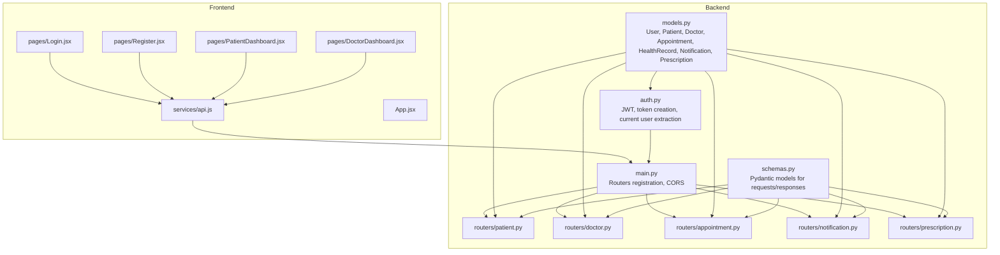
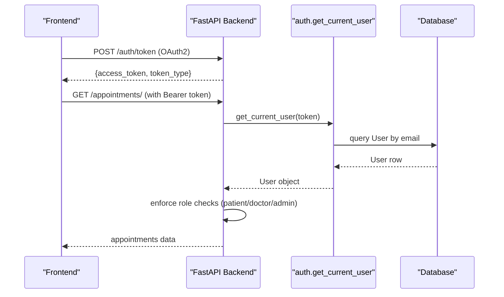
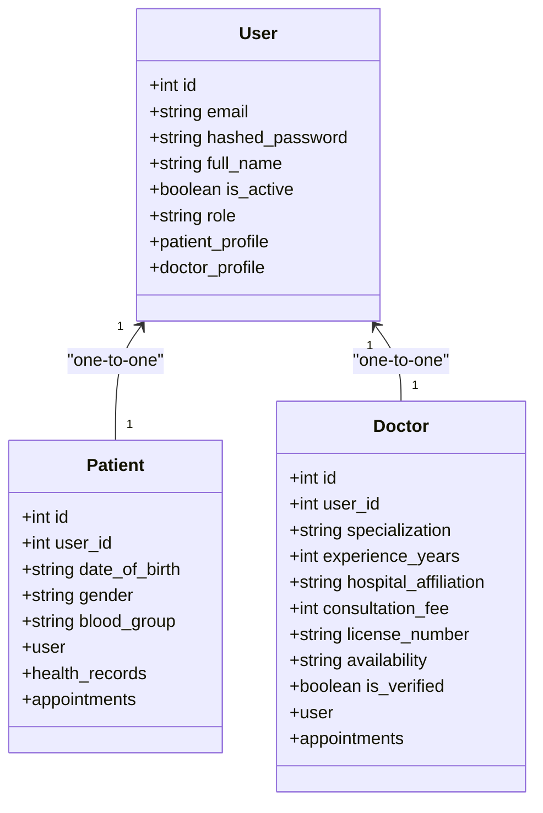
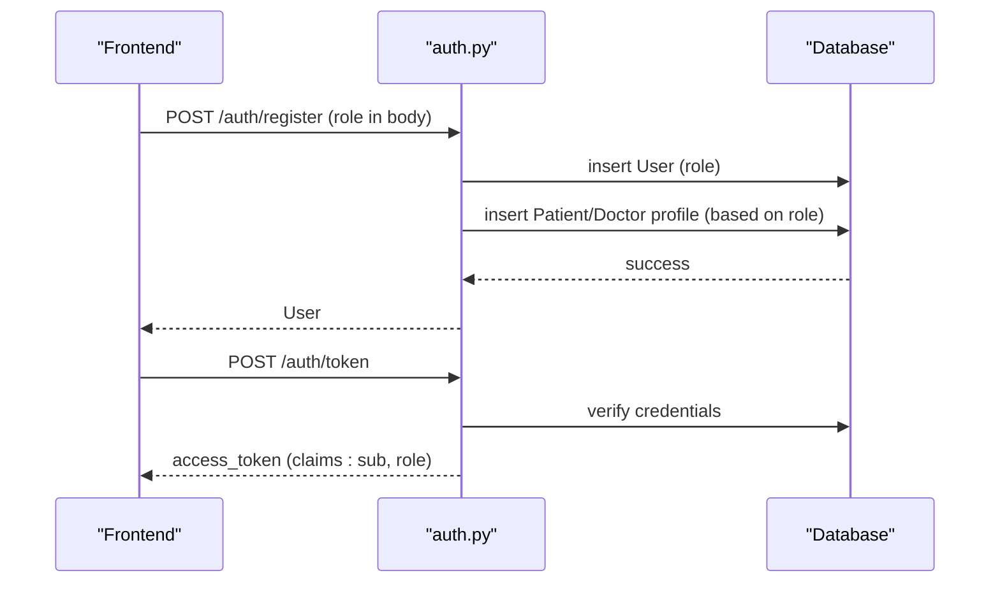
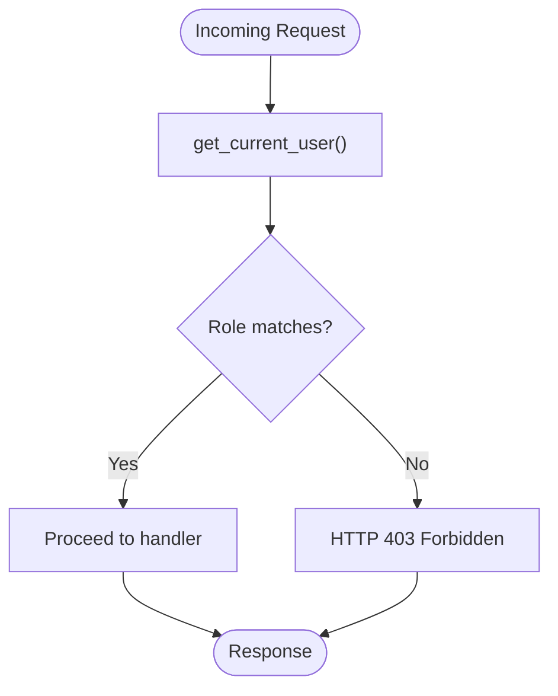
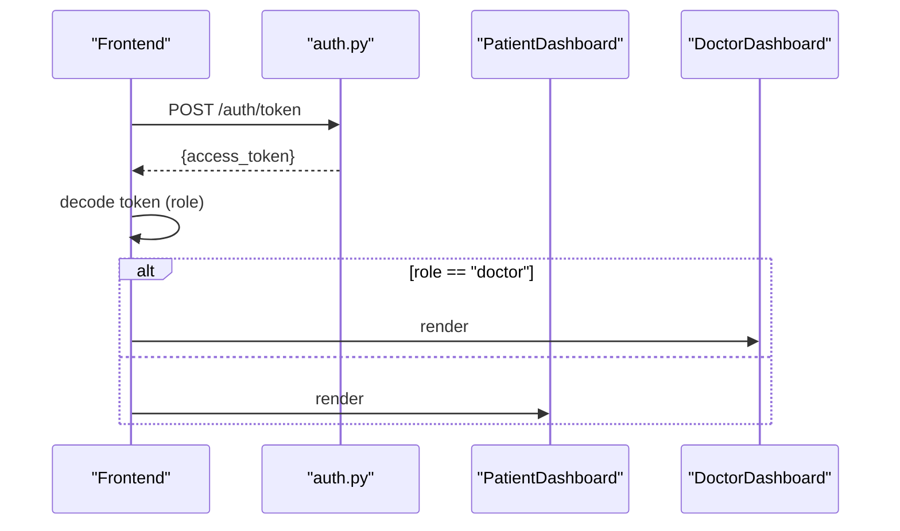
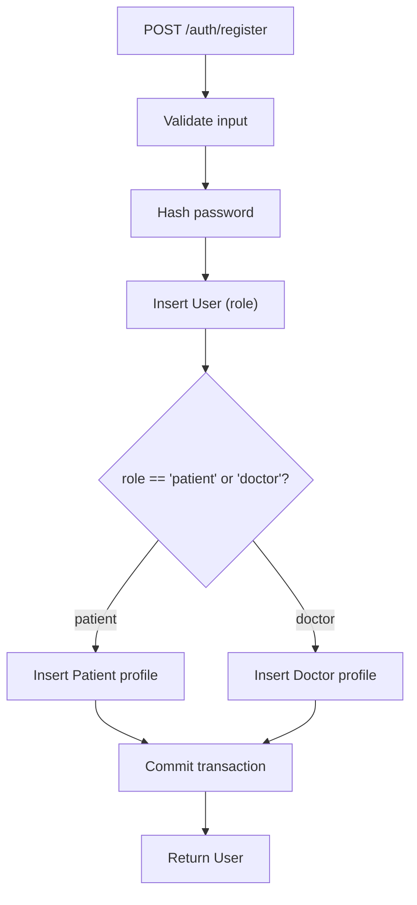
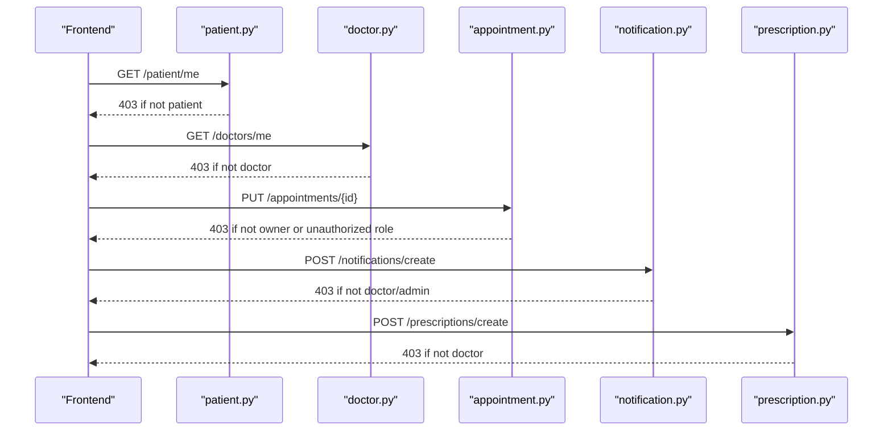
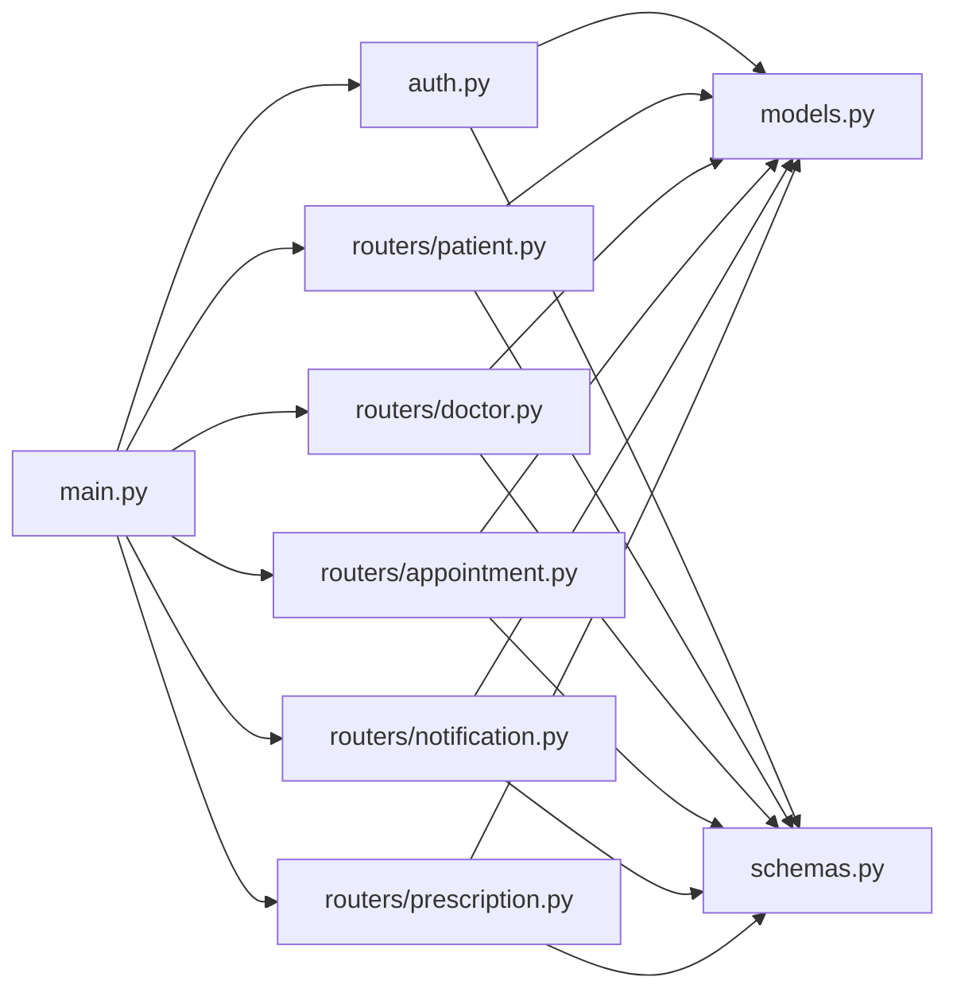

# Role-Based Access Control

<cite>
**Referenced Files in This Document**
- [backend/models.py](file://backend/models.py)
- [backend/auth.py](file://backend/auth.py)
- [backend/main.py](file://backend/main.py)
- [backend/schemas.py](file://backend/schemas.py)
- [backend/routers/patient.py](file://backend/routers/patient.py)
- [backend/routers/doctor.py](file://backend/routers/doctor.py)
- [backend/routers/appointment.py](file://backend/routers/appointment.py)
- [backend/routers/notification.py](file://backend/routers/notification.py)
- [backend/routers/prescription.py](file://backend/routers/prescription.py)
- [frontend/src/App.jsx](file://frontend/src/App.jsx)
- [frontend/src/pages/Login.jsx](file://frontend/src/pages/Login.jsx)
- [frontend/src/pages/Register.jsx](file://frontend/src/pages/Register.jsx)
- [frontend/src/pages/PatientDashboard.jsx](file://frontend/src/pages/PatientDashboard.jsx)
- [frontend/src/pages/DoctorDashboard.jsx](file://frontend/src/pages/DoctorDashboard.jsx)
- [frontend/src/services/api.js](file://frontend/src/services/api.js)
</cite>

## Table of Contents
1. [Introduction](#introduction)
2. [Project Structure](#project-structure)
3. [Core Components](#core-components)
4. [Architecture Overview](#architecture-overview)
5. [Detailed Component Analysis](#detailed-component-analysis)
6. [Dependency Analysis](#dependency-analysis)
7. [Performance Considerations](#performance-considerations)
8. [Troubleshooting Guide](#troubleshooting-guide)
9. [Conclusion](#conclusion)
10. [Appendices](#appendices)

## Introduction
This document describes the multi-role access control system supporting three user roles: patient, doctor, and administrator. It explains how roles are modeled, stored, and validated; how JWT tokens embed role information; how role-based routing and protected routes are implemented; and how role-specific API access controls are enforced. It also documents automatic profile creation per role, role-aware UI rendering, and guidance for extending the system to support additional user types.

## Project Structure
The system is split into a FastAPI backend and a React frontend:
- Backend: Authentication, models, routers, and schemas define role storage, JWT issuance, and role-based API endpoints.
- Frontend: Login and registration capture role selection, login decodes JWT to route users, and dashboards render role-specific UI.

**Diagram sources**
- [backend/main.py](file://backend/main.py#L34-L44)
- [backend/auth.py](file://backend/auth.py#L1-L120)
- [backend/models.py](file://backend/models.py#L1-L110)
- [backend/schemas.py](file://backend/schemas.py#L1-L236)
- [backend/routers/patient.py](file://backend/routers/patient.py#L1-L107)
- [backend/routers/doctor.py](file://backend/routers/doctor.py#L1-L120)
- [backend/routers/appointment.py](file://backend/routers/appointment.py#L1-L129)
- [backend/routers/notification.py](file://backend/routers/notification.py#L1-L177)
- [backend/routers/prescription.py](file://backend/routers/prescription.py#L1-L150)
- [frontend/src/App.jsx](file://frontend/src/App.jsx#L1-L28)
- [frontend/src/pages/Login.jsx](file://frontend/src/pages/Login.jsx#L1-L104)
- [frontend/src/pages/Register.jsx](file://frontend/src/pages/Register.jsx#L1-L124)
- [frontend/src/pages/PatientDashboard.jsx](file://frontend/src/pages/PatientDashboard.jsx#L1-L674)
- [frontend/src/pages/DoctorDashboard.jsx](file://frontend/src/pages/DoctorDashboard.jsx#L1-L698)
- [frontend/src/services/api.js](file://frontend/src/services/api.js#L1-L25)

**Section sources**
- [backend/main.py](file://backend/main.py#L34-L44)
- [frontend/src/App.jsx](file://frontend/src/App.jsx#L1-L28)

## Core Components
- Role storage and relationships:
  - User entity stores role as a string with a default value suitable for patients.
  - User has one-to-one relationships to Patient and Doctor profiles.
- JWT token payload:
  - Tokens carry subject and role claims to enable runtime role checks.
- Protected endpoints:
  - Each router enforces role checks via the current user dependency.
- Automatic profile creation:
  - On registration, backend creates a Patient or Doctor profile depending on role.
- Role-based UI:
  - Frontend reads role from JWT payload and navigates to appropriate dashboard.

**Section sources**
- [backend/models.py](file://backend/models.py#L6-L18)
- [backend/auth.py](file://backend/auth.py#L60-L104)
- [backend/auth.py](file://backend/auth.py#L106-L119)
- [frontend/src/pages/Login.jsx](file://frontend/src/pages/Login.jsx#L30-L40)

## Architecture Overview
The backend exposes role-aware endpoints grouped under routers. Authentication middleware resolves the current user from JWT. Frontend sends Authorization headers and routes users based on decoded role.

**Diagram sources**
- [backend/auth.py](file://backend/auth.py#L39-L55)
- [backend/routers/appointment.py](file://backend/routers/appointment.py#L39-L92)
- [frontend/src/services/api.js](file://frontend/src/services/api.js#L10-L22)

## Detailed Component Analysis

### Role Model and Relationships
The User entity stores role and links to role-specific profiles. This enables straightforward role checks and profile access.

**Diagram sources**
- [backend/models.py](file://backend/models.py#L6-L47)

**Section sources**
- [backend/models.py](file://backend/models.py#L6-L18)

### JWT Issuance and Current User Resolution
- Token creation includes role claim so endpoints can validate roles without re-querying.
- Token decoding extracts subject and role; user lookup by email completes identity resolution.

**Diagram sources**
- [backend/auth.py](file://backend/auth.py#L60-L104)
- [backend/auth.py](file://backend/auth.py#L106-L119)

**Section sources**
- [backend/auth.py](file://backend/auth.py#L29-L55)
- [backend/auth.py](file://backend/auth.py#L106-L119)

### Protected Routes and Role Checks
Endpoints enforce role checks using the current user dependency. Examples:
- Patient-only endpoints: retrieving own profile, viewing own health records, booking appointments.
- Doctor-only endpoints: retrieving own profile, updating profile, viewing stats, creating prescriptions.
- Cross-role access: doctors can view shared patient records; appointments endpoint adapts to role.

**Diagram sources**
- [backend/routers/patient.py](file://backend/routers/patient.py#L16-L25)
- [backend/routers/doctor.py](file://backend/routers/doctor.py#L33-L42)
- [backend/routers/appointment.py](file://backend/routers/appointment.py#L18-L37)
- [backend/routers/prescription.py](file://backend/routers/prescription.py#L18-L25)

**Section sources**
- [backend/routers/patient.py](file://backend/routers/patient.py#L11-L52)
- [backend/routers/doctor.py](file://backend/routers/doctor.py#L28-L76)
- [backend/routers/appointment.py](file://backend/routers/appointment.py#L12-L37)
- [backend/routers/prescription.py](file://backend/routers/prescription.py#L12-L57)

### Role-Based Routing and UI Rendering
- Registration sets role; login decodes JWT to determine redirect.
- Dashboards render role-specific content and actions.

**Diagram sources**
- [frontend/src/pages/Login.jsx](file://frontend/src/pages/Login.jsx#L30-L40)
- [frontend/src/pages/PatientDashboard.jsx](file://frontend/src/pages/PatientDashboard.jsx#L1-L674)
- [frontend/src/pages/DoctorDashboard.jsx](file://frontend/src/pages/DoctorDashboard.jsx#L1-L698)

**Section sources**
- [frontend/src/pages/Register.jsx](file://frontend/src/pages/Register.jsx#L8-L12)
- [frontend/src/pages/Login.jsx](file://frontend/src/pages/Login.jsx#L30-L40)
- [frontend/src/App.jsx](file://frontend/src/App.jsx#L17-L18)

### Automatic Profile Creation
On registration, backend creates a Patient or Doctor profile based on the submitted role. This ensures downstream endpoints can reliably access role-specific entities.

**Diagram sources**
- [backend/auth.py](file://backend/auth.py#L60-L104)

**Section sources**
- [backend/auth.py](file://backend/auth.py#L86-L102)

### Role-Specific API Access Controls
Examples of role enforcement across modules:
- Patient router: restricts profile and records endpoints to patients.
- Doctor router: restricts profile and stats endpoints to doctors.
- Appointment router: allows patients and doctors to fetch appointments; enforces ownership for updates.
- Notification router: restricts creation to doctors/admins; self-service for patients.
- Prescription router: restricts creation to doctors; access restricted to owner.

**Diagram sources**
- [backend/routers/patient.py](file://backend/routers/patient.py#L16-L17)
- [backend/routers/doctor.py](file://backend/routers/doctor.py#L33-L34)
- [backend/routers/appointment.py](file://backend/routers/appointment.py#L108-L124)
- [backend/routers/notification.py](file://backend/routers/notification.py#L155-L161)
- [backend/routers/prescription.py](file://backend/routers/prescription.py#L19-L20)

**Section sources**
- [backend/routers/patient.py](file://backend/routers/patient.py#L54-L62)
- [backend/routers/doctor.py](file://backend/routers/doctor.py#L78-L109)
- [backend/routers/appointment.py](file://backend/routers/appointment.py#L94-L128)
- [backend/routers/notification.py](file://backend/routers/notification.py#L147-L176)
- [backend/routers/prescription.py](file://backend/routers/prescription.py#L60-L77)

### Permission Checking Functions and Decorators
- Current user retrieval: a dependency that decodes JWT and loads the User object.
- Role checks: explicit checks in each endpoint using the current user’s role.
- Recommendation: centralize role checks into a decorator or helper for reuse across routers.

Example patterns:
- Extract current user from token: [backend/auth.py](file://backend/auth.py#L39-L55)
- Enforce role in endpoint: [backend/routers/patient.py](file://backend/routers/patient.py#L16-L17), [backend/routers/doctor.py](file://backend/routers/doctor.py#L33-L34)

**Section sources**
- [backend/auth.py](file://backend/auth.py#L39-L55)
- [backend/routers/patient.py](file://backend/routers/patient.py#L16-L17)
- [backend/routers/doctor.py](file://backend/routers/doctor.py#L33-L34)

### Relationship Between User Roles and Role-Specific Entities
- User role determines which profile exists and which endpoints are accessible.
- Patient and Doctor profiles link back to User via foreign keys, enabling seamless access to user metadata alongside role-specific attributes.

**Section sources**
- [backend/models.py](file://backend/models.py#L16-L18)
- [backend/models.py](file://backend/models.py#L20-L47)

### Extending the Role System
To add a new role (e.g., administrator):
- Add role value to User role field and registration schema defaults.
- Update JWT creation to include role claim.
- Add role checks in relevant routers.
- Extend frontend routing and dashboards to support the new role.
- Consider adding an admin-only router for administrative tasks.

Guidelines:
- Keep role values consistent and documented.
- Centralize role constants if reused widely.
- Add tests for new role permissions and UI flows.

[No sources needed since this section provides general guidance]

## Dependency Analysis
The backend composes routers under a single FastAPI app. Each router depends on auth.get_current_user for role enforcement and SQLAlchemy models for persistence.

**Diagram sources**
- [backend/main.py](file://backend/main.py#L34-L44)
- [backend/auth.py](file://backend/auth.py#L1-L120)
- [backend/models.py](file://backend/models.py#L1-L110)
- [backend/schemas.py](file://backend/schemas.py#L1-L236)
- [backend/routers/patient.py](file://backend/routers/patient.py#L1-L107)
- [backend/routers/doctor.py](file://backend/routers/doctor.py#L1-L120)
- [backend/routers/appointment.py](file://backend/routers/appointment.py#L1-L129)
- [backend/routers/notification.py](file://backend/routers/notification.py#L1-L177)
- [backend/routers/prescription.py](file://backend/routers/prescription.py#L1-L150)

**Section sources**
- [backend/main.py](file://backend/main.py#L34-L44)

## Performance Considerations
- Token decoding and user lookup occur per request; caching the current user in request scope reduces repeated DB hits.
- Use pagination and filtering in endpoints (already present in notifications and doctors) to avoid large payloads.
- Indexes on user email and foreign keys improve query performance.

[No sources needed since this section provides general guidance]

## Troubleshooting Guide
Common issues and resolutions:
- Unauthorized access errors:
  - Ensure the JWT bearer token is attached to requests.
  - Verify the token contains the correct role claim.
  - Confirm the endpoint enforces the expected role.
  - References: [frontend/src/services/api.js](file://frontend/src/services/api.js#L10-L22), [backend/routers/patient.py](file://backend/routers/patient.py#L16-L17)
- Profile not found:
  - Registration should create a Patient or Doctor profile; confirm the role matches the intended profile.
  - Reference: [backend/auth.py](file://backend/auth.py#L86-L102)
- Incorrect redirection after login:
  - Decode token on frontend and route accordingly.
  - Reference: [frontend/src/pages/Login.jsx](file://frontend/src/pages/Login.jsx#L30-L40)

**Section sources**
- [frontend/src/services/api.js](file://frontend/src/services/api.js#L10-L22)
- [backend/routers/patient.py](file://backend/routers/patient.py#L16-L17)
- [backend/auth.py](file://backend/auth.py#L86-L102)
- [frontend/src/pages/Login.jsx](file://frontend/src/pages/Login.jsx#L30-L40)

## Conclusion
The system implements a clean, extensible role-based access control model. Roles are stored on the User entity, embedded in JWT tokens, and enforced at the router level. Automatic profile creation ensures role-specific entities are always available. The frontend leverages decoded role information to route users to appropriate dashboards. Extending the system to additional roles requires minimal changes across authentication, routers, and UI.

## Appendices

### Role-Based UI Rendering Examples
- Login decodes token and redirects to role-specific dashboard:
  - [frontend/src/pages/Login.jsx](file://frontend/src/pages/Login.jsx#L30-L40)
- Patient dashboard renders patient-centric UI:
  - [frontend/src/pages/PatientDashboard.jsx](file://frontend/src/pages/PatientDashboard.jsx#L1-L674)
- Doctor dashboard renders doctor-centric UI:
  - [frontend/src/pages/DoctorDashboard.jsx](file://frontend/src/pages/DoctorDashboard.jsx#L1-L698)

**Section sources**
- [frontend/src/pages/Login.jsx](file://frontend/src/pages/Login.jsx#L30-L40)
- [frontend/src/pages/PatientDashboard.jsx](file://frontend/src/pages/PatientDashboard.jsx#L1-L674)
- [frontend/src/pages/DoctorDashboard.jsx](file://frontend/src/pages/DoctorDashboard.jsx#L1-L698)