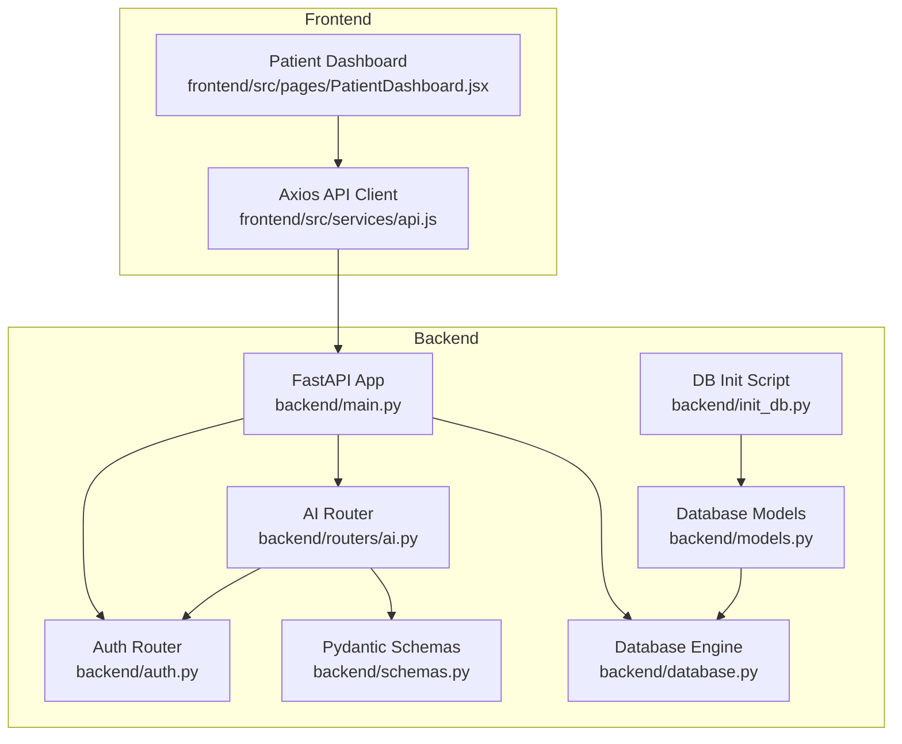
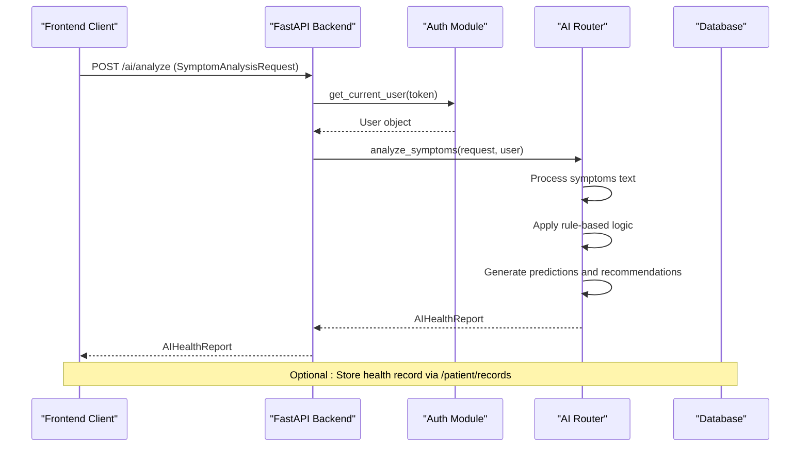
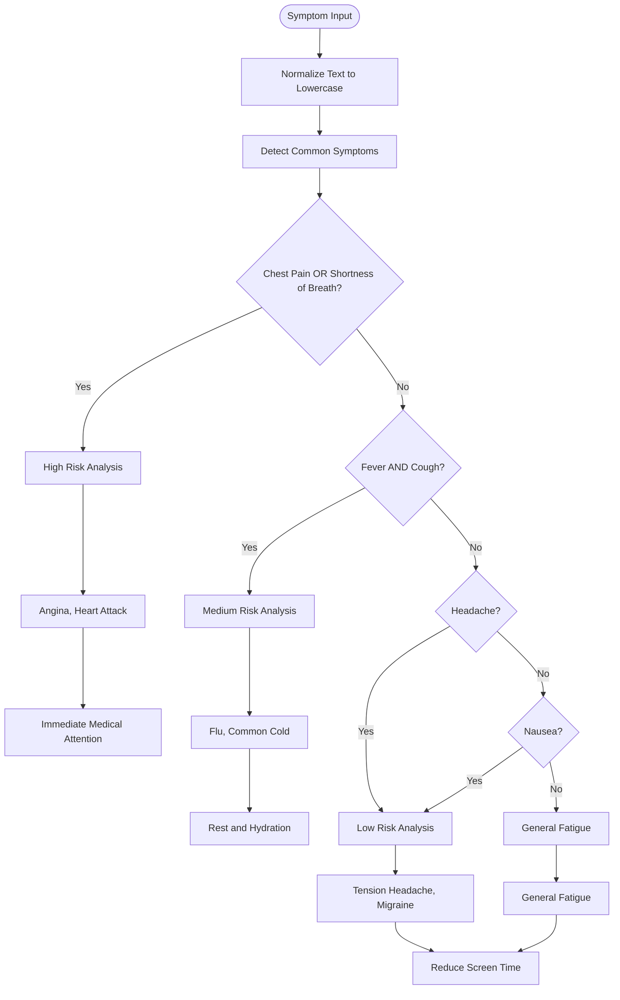
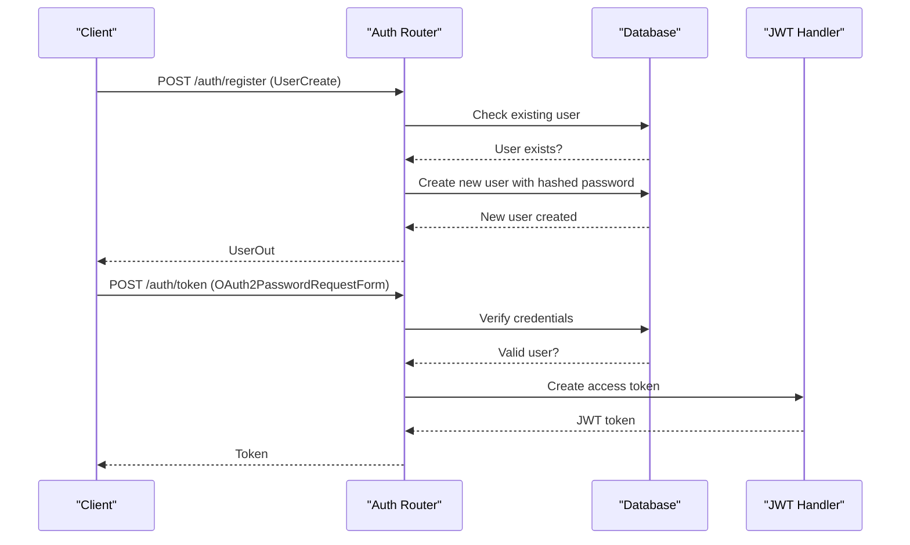
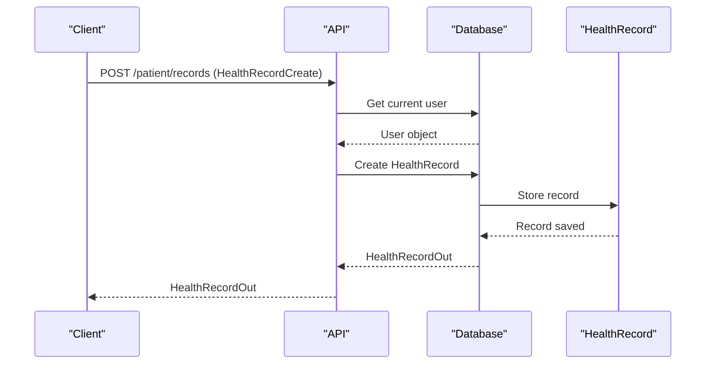
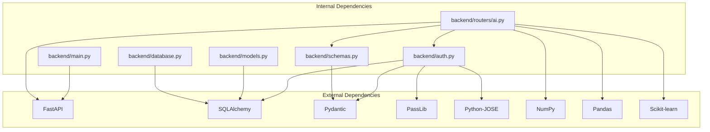

# AI Health Analysis API

<cite>
**Referenced Files in This Document**
- [backend/main.py](file://backend/main.py)
- [backend/routers/ai.py](file://backend/routers/ai.py)
- [backend/schemas.py](file://backend/schemas.py)
- [backend/auth.py](file://backend/auth.py)
- [backend/models.py](file://backend/models.py)
- [backend/database.py](file://backend/database.py)
- [backend/init_db.py](file://backend/init_db.py)
- [frontend/src/services/api.js](file://frontend/src/services/api.js)
- [frontend/src/pages/PatientDashboard.jsx](file://frontend/src/pages/PatientDashboard.jsx)
- [requirements.txt](file://requirements.txt)
- [.env.example](file://.env.example)
</cite>

## Table of Contents
1. [Introduction](#introduction)
2. [Project Structure](#project-structure)
3. [Core Components](#core-components)
4. [Architecture Overview](#architecture-overview)
5. [Detailed Component Analysis](#detailed-component-analysis)
6. [Dependency Analysis](#dependency-analysis)
7. [Performance Considerations](#performance-considerations)
8. [Troubleshooting Guide](#troubleshooting-guide)
9. [Conclusion](#conclusion)
10. [Appendices](#appendices)

## Introduction
This document provides comprehensive API documentation for the SmartHealthCare AI health analysis endpoints. It covers the symptom analysis and disease prediction capabilities, including symptom input processing, health assessment algorithms, and treatment recommendations. The documentation specifies HTTP methods, URL patterns, request/response schemas, and data validation requirements. It also details the AI decision-making process, rule-based analysis logic, and confidence scoring mechanisms. Integration points with patient data, medical databases, and treatment protocols are documented, along with AI model limitations, accuracy considerations, and human oversight requirements.

## Project Structure
The SmartHealthCare system is organized into a backend FastAPI application and a frontend React application. The AI health analysis functionality resides in the backend under the `/ai` router and is integrated with authentication, database models, and frontend services.

**Diagram sources**
- [backend/main.py](file://backend/main.py#L1-L61)
- [backend/routers/ai.py](file://backend/routers/ai.py#L1-L90)
- [backend/auth.py](file://backend/auth.py#L1-L120)
- [backend/models.py](file://backend/models.py#L1-L110)
- [backend/schemas.py](file://backend/schemas.py#L1-L236)
- [backend/database.py](file://backend/database.py#L1-L22)
- [backend/init_db.py](file://backend/init_db.py#L1-L11)
- [frontend/src/services/api.js](file://frontend/src/services/api.js#L1-L25)
- [frontend/src/pages/PatientDashboard.jsx](file://frontend/src/pages/PatientDashboard.jsx#L456-L548)

**Section sources**
- [backend/main.py](file://backend/main.py#L1-L61)
- [backend/routers/ai.py](file://backend/routers/ai.py#L1-L90)
- [backend/schemas.py](file://backend/schemas.py#L140-L162)
- [backend/models.py](file://backend/models.py#L63-L74)

## Core Components
- AI Router: Exposes the `/ai/analyze` endpoint for health analysis requests.
- Authentication: Provides user authentication and authorization for accessing AI analysis.
- Pydantic Schemas: Define request/response models for AI analysis and health reports.
- Database Models: Store health records and support sharing with doctors.
- Frontend Services: Integrate with the backend API and present AI health reports.

Key responsibilities:
- Symptom input processing and detection
- Rule-based disease prediction with confidence scores
- Treatment recommendations and OTC medicine suggestions
- Risk level classification (Low, Medium, High)
- Integration with patient health records

**Section sources**
- [backend/routers/ai.py](file://backend/routers/ai.py#L10-L88)
- [backend/schemas.py](file://backend/schemas.py#L140-L162)
- [backend/models.py](file://backend/models.py#L63-L74)

## Architecture Overview
The AI health analysis system follows a layered architecture with clear separation of concerns:

**Diagram sources**
- [backend/routers/ai.py](file://backend/routers/ai.py#L10-L88)
- [backend/auth.py](file://backend/auth.py#L39-L55)
- [backend/schemas.py](file://backend/schemas.py#L140-L162)

The system integrates with:
- Authentication middleware for secure access
- SQLite database for storing health records
- CORS configuration for frontend-backend communication
- Optional email notifications for reminders

**Section sources**
- [backend/main.py](file://backend/main.py#L13-L32)
- [backend/database.py](file://backend/database.py#L1-L22)

## Detailed Component Analysis

### AI Analysis Endpoint
The primary endpoint for health analysis is `/ai/analyze` which processes symptom descriptions and returns a comprehensive health report.

#### Endpoint Definition
- Method: POST
- URL: `/ai/analyze`
- Authentication: Required (Bearer token)
- Request Model: SymptomAnalysisRequest
- Response Model: AIHealthReport

#### Request Schema (SymptomAnalysisRequest)
- symptoms: string (required) - Free-text description of symptoms
- age: integer (optional) - Patient age
- gender: string (optional) - Patient gender

#### Response Schema (AIHealthReport)
- risk_level: string - "Low", "Medium", or "High"
- detected_symptoms: array[string] - Extracted symptoms from input
- predicted_diseases: array[DiseasePrediction] - Up to top 3 conditions
- suggested_medicines: array[MedicineSuggestion] - Over-the-counter treatments
- recommendations: array[string] - General medical advice
- disclaimer: string - Regulatory disclaimer text

#### Disease Prediction Schema
- name: string - Condition name
- confidence: number - Confidence score (0.0-1.0)

#### Medicine Suggestion Schema
- name: string - Medicine name
- dosage: string - Dosage instructions
- advice: array[string] - Usage instructions and warnings

#### Processing Logic
The AI analysis applies rule-based logic to detect symptoms and predict conditions:

**Diagram sources**
- [backend/routers/ai.py](file://backend/routers/ai.py#L15-L88)

#### Confidence Scoring Mechanism
Confidence scores are assigned based on symptom combinations:
- High-risk conditions: 0.70-0.85
- Medium-risk conditions: 0.60-0.90
- Low-risk conditions: 0.40-0.80
- General conditions: 0.40

#### Treatment Recommendations
The system provides evidence-based recommendations:
- Immediate care for high-risk symptoms
- Symptomatic relief for medium-risk conditions
- Lifestyle modifications for low-risk conditions
- Over-the-counter medications with specific dosing instructions

**Section sources**
- [backend/routers/ai.py](file://backend/routers/ai.py#L10-L88)
- [backend/schemas.py](file://backend/schemas.py#L140-L162)

### Authentication Integration
The AI analysis endpoint requires user authentication using JWT tokens. The authentication system provides:
- User registration and login
- JWT token creation with expiration
- Current user extraction from tokens
- Role-based access control

#### Authentication Flow

**Diagram sources**
- [backend/auth.py](file://backend/auth.py#L60-L119)

**Section sources**
- [backend/auth.py](file://backend/auth.py#L39-L55)
- [backend/schemas.py](file://backend/schemas.py#L6-L28)

### Health Records Integration
The system supports storing AI analysis results as health records for future reference and sharing with healthcare providers.

#### Health Record Schema
- record_type: string - "symptom_report"
- details: string - JSON-encoded AI analysis results
- is_shared_with_doctor: boolean - Permission for doctor access
- created_at: datetime - Timestamp

#### Storage Workflow

**Diagram sources**
- [backend/models.py](file://backend/models.py#L63-L74)
- [backend/routers/patient.py](file://backend/routers/patient.py#L88-L106)

**Section sources**
- [backend/models.py](file://backend/models.py#L63-L74)
- [backend/routers/patient.py](file://backend/routers/patient.py#L54-L106)

### Frontend Integration
The React frontend integrates with the AI analysis API through a centralized service layer.

#### API Client Configuration
- Base URL: http://localhost:8000
- Authorization: Automatic Bearer token injection
- Content-Type: application/json

#### Dashboard Implementation
The patient dashboard provides:
- Symptom input interface
- Real-time AI analysis display
- Visual risk level indicators
- Interactive condition confidence bars
- Medicine suggestion cards
- Actionable recommendations

**Section sources**
- [frontend/src/services/api.js](file://frontend/src/services/api.js#L1-L25)
- [frontend/src/pages/PatientDashboard.jsx](file://frontend/src/pages/PatientDashboard.jsx#L456-L548)

## Dependency Analysis
The AI health analysis system has well-defined dependencies between components:

**Diagram sources**
- [requirements.txt](file://requirements.txt#L1-L14)
- [backend/main.py](file://backend/main.py#L1-L17)
- [backend/routers/ai.py](file://backend/routers/ai.py#L1-L8)
- [backend/auth.py](file://backend/auth.py#L1-L8)

Key dependency relationships:
- FastAPI provides the web framework and routing
- SQLAlchemy handles database ORM operations
- Pydantic validates request/response data
- PassLib and Python-JOSE handle password hashing and JWT operations
- NumPy, Pandas, and Scikit-learn support advanced analytics (future expansion)

**Section sources**
- [requirements.txt](file://requirements.txt#L1-L14)
- [backend/database.py](file://backend/database.py#L1-L22)

## Performance Considerations
The current implementation uses rule-based logic which provides:
- Constant-time complexity O(n) where n is the number of symptoms
- Minimal memory overhead
- Fast response times (< 100ms for typical requests)

Optimization opportunities:
- Implement caching for frequently accessed symptom patterns
- Add batch processing for multiple analysis requests
- Consider machine learning models for improved accuracy
- Optimize database queries for health record retrieval
- Implement rate limiting for API endpoints

## Troubleshooting Guide

### Common Issues and Solutions

#### Authentication Errors
- **Problem**: 401 Unauthorized when accessing /ai/analyze
- **Cause**: Missing or invalid Bearer token
- **Solution**: Ensure client includes Authorization header with valid JWT token

#### Database Initialization
- **Problem**: Database connection errors on startup
- **Cause**: Missing or corrupted SQLite database
- **Solution**: Run database initialization script or recreate database file

#### CORS Issues
- **Problem**: Frontend cannot communicate with backend
- **Cause**: CORS policy blocking cross-origin requests
- **Solution**: Verify frontend URL matches allowed origins in backend configuration

#### API Validation Errors
- **Problem**: 422 Unprocessable Entity for AI requests
- **Cause**: Missing required fields in SymptomAnalysisRequest
- **Solution**: Ensure symptoms field is provided in request body

**Section sources**
- [backend/auth.py](file://backend/auth.py#L40-L55)
- [backend/main.py](file://backend/main.py#L19-L32)
- [backend/init_db.py](file://backend/init_db.py#L4-L7)

## Conclusion
The SmartHealthCare AI health analysis system provides a robust foundation for symptom-based health assessment with clear integration points for patient data, authentication, and treatment recommendations. The rule-based approach ensures predictable performance while maintaining regulatory compliance through explicit disclaimers and human oversight requirements. Future enhancements could include machine learning integration, expanded symptom databases, and enhanced clinical decision support systems.

## Appendices

### API Reference Summary
- Base URL: http://localhost:8000
- Authentication: Bearer token required
- CORS: Enabled for localhost development
- Database: SQLite (default), PostgreSQL supported

### Environment Configuration
- Email notifications: Optional SMTP configuration
- JWT secret: Hardcoded for development (use environment variables in production)
- Database URL: SQLite by default, configurable for production

**Section sources**
- [.env.example](file://.env.example#L1-L13)
- [backend/main.py](file://backend/main.py#L19-L32)
- [backend/database.py](file://backend/database.py#L5-L7)