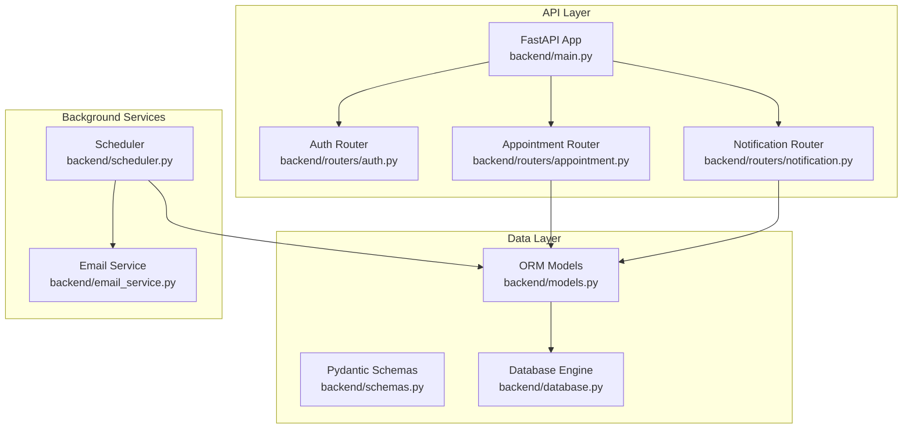
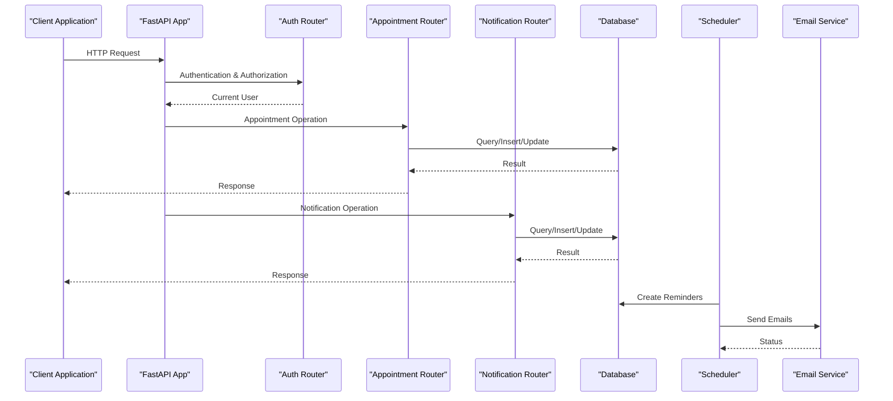
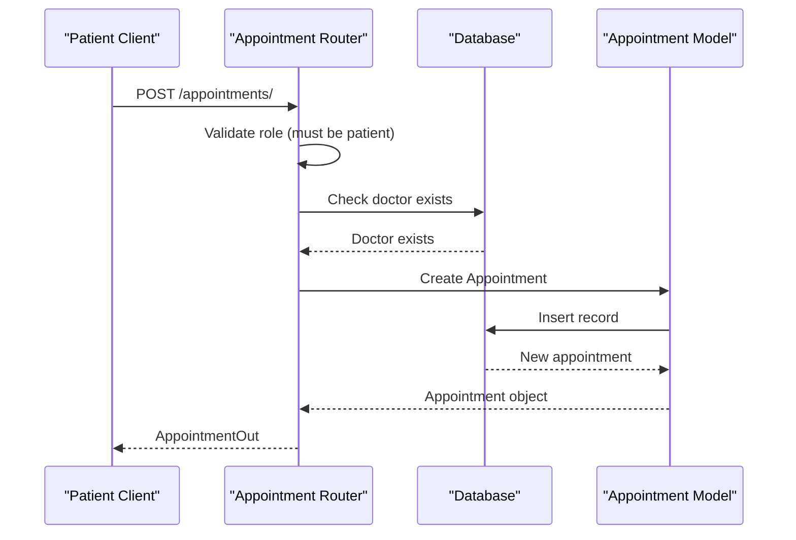
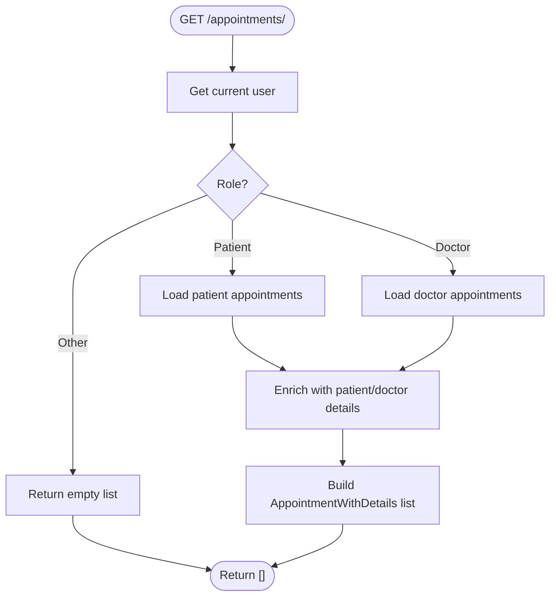
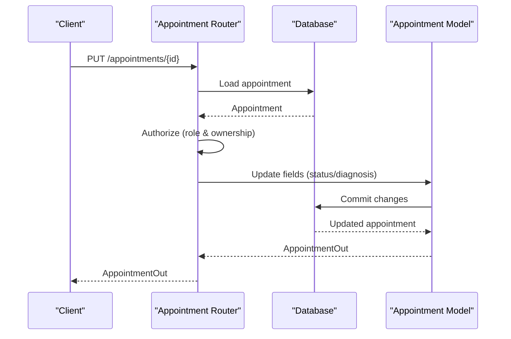
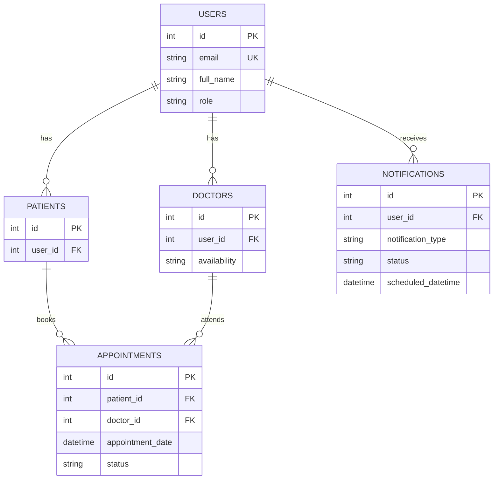
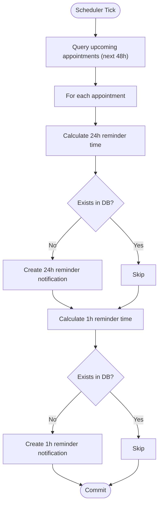
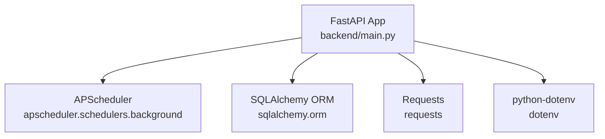

# Appointment Scheduling API

<cite>
**Referenced Files in This Document**
- [backend/main.py](file://backend/main.py)
- [backend/routers/appointment.py](file://backend/routers/appointment.py)
- [backend/routers/notification.py](file://backend/routers/notification.py)
- [backend/models.py](file://backend/models.py)
- [backend/schemas.py](file://backend/schemas.py)
- [backend/scheduler.py](file://backend/scheduler.py)
- [backend/email_service.py](file://backend/email_service.py)
- [backend/database.py](file://backend/database.py)
- [backend/auth.py](file://backend/auth.py)
- [requirements.txt](file://requirements.txt)
</cite>

## Table of Contents
1. [Introduction](#introduction)
2. [Project Structure](#project-structure)
3. [Core Components](#core-components)
4. [Architecture Overview](#architecture-overview)
5. [Detailed Component Analysis](#detailed-component-analysis)
6. [Dependency Analysis](#dependency-analysis)
7. [Performance Considerations](#performance-considerations)
8. [Troubleshooting Guide](#troubleshooting-guide)
9. [Conclusion](#conclusion)

## Introduction
This document provides comprehensive API documentation for the SmartHealthCare appointment scheduling system. The system enables patients to book appointments with doctors, manage appointment statuses, and integrates with notification and reminder systems. It includes detailed endpoint specifications, request/response schemas, validation rules, and operational workflows for appointment conflicts, availability checking, and resource allocation.

## Project Structure
The appointment scheduling system is built with FastAPI and SQLAlchemy, featuring modular routing, data models, Pydantic schemas, and background job scheduling for notifications.

**Diagram sources**
- [backend/main.py](file://backend/main.py#L1-L61)
- [backend/routers/appointment.py](file://backend/routers/appointment.py#L1-L129)
- [backend/routers/notification.py](file://backend/routers/notification.py#L1-L177)
- [backend/models.py](file://backend/models.py#L1-L110)
- [backend/scheduler.py](file://backend/scheduler.py#L1-L317)
- [backend/email_service.py](file://backend/email_service.py#L1-L161)

**Section sources**
- [backend/main.py](file://backend/main.py#L1-L61)
- [backend/routers/appointment.py](file://backend/routers/appointment.py#L1-L129)
- [backend/routers/notification.py](file://backend/routers/notification.py#L1-L177)
- [backend/models.py](file://backend/models.py#L1-L110)
- [backend/scheduler.py](file://backend/scheduler.py#L1-L317)
- [backend/email_service.py](file://backend/email_service.py#L1-L161)

## Core Components
- **Appointment Router**: Handles booking, listing, and updating appointment status with role-based authorization.
- **Notification Router**: Manages user notifications, statistics, and reminders.
- **Models**: Defines database entities for users, patients, doctors, appointments, health records, notifications, and prescriptions.
- **Schemas**: Provides request/response models for all endpoints.
- **Scheduler**: Creates appointment reminders and manages notification lifecycle.
- **Email Service**: Sends HTML email notifications for reminders.

**Section sources**
- [backend/routers/appointment.py](file://backend/routers/appointment.py#L1-L129)
- [backend/routers/notification.py](file://backend/routers/notification.py#L1-L177)
- [backend/models.py](file://backend/models.py#L1-L110)
- [backend/schemas.py](file://backend/schemas.py#L1-L236)
- [backend/scheduler.py](file://backend/scheduler.py#L1-L317)
- [backend/email_service.py](file://backend/email_service.py#L1-L161)

## Architecture Overview
The system follows a layered architecture with clear separation between API routes, business logic, data models, and background services.

**Diagram sources**
- [backend/main.py](file://backend/main.py#L1-L61)
- [backend/routers/appointment.py](file://backend/routers/appointment.py#L1-L129)
- [backend/routers/notification.py](file://backend/routers/notification.py#L1-L177)
- [backend/scheduler.py](file://backend/scheduler.py#L110-L183)
- [backend/email_service.py](file://backend/email_service.py#L141-L161)

## Detailed Component Analysis

### Appointment Endpoints

#### Booking an Appointment
- **Method**: POST
- **URL**: `/appointments/`
- **Authentication**: Required (patient role)
- **Request Body**: [AppointmentCreate](file://backend/schemas.py#L74-L75)
- **Response**: [AppointmentOut](file://backend/schemas.py#L81-L91)
- **Validation Rules**:
  - Only patients can book appointments.
  - Doctor existence is verified before booking.
  - Status defaults to "scheduled".
- **Processing Logic**:
  - Retrieve current user and ensure role is patient.
  - Verify doctor exists.
  - Create appointment with patient_id, doctor_id, appointment_date, reason, and status.
  - Commit transaction and refresh appointment.

**Diagram sources**
- [backend/routers/appointment.py](file://backend/routers/appointment.py#L12-L37)
- [backend/schemas.py](file://backend/schemas.py#L74-L91)

**Section sources**
- [backend/routers/appointment.py](file://backend/routers/appointment.py#L12-L37)
- [backend/schemas.py](file://backend/schemas.py#L74-L91)

#### Listing Appointments
- **Method**: GET
- **URL**: `/appointments/`
- **Authentication**: Required (patient or doctor role)
- **Response**: Array of [AppointmentWithDetails](file://backend/schemas.py#L119-L129)
- **Processing Logic**:
  - If user role is patient, return patient's appointments.
  - If user role is doctor, return doctor's appointments.
  - For each appointment, enrich with nested patient and doctor details.

**Diagram sources**
- [backend/routers/appointment.py](file://backend/routers/appointment.py#L39-L92)
- [backend/schemas.py](file://backend/schemas.py#L119-L129)

**Section sources**
- [backend/routers/appointment.py](file://backend/routers/appointment.py#L39-L92)
- [backend/schemas.py](file://backend/schemas.py#L119-L129)

#### Updating Appointment Status
- **Method**: PUT
- **URL**: `/appointments/{appointment_id}`
- **Authentication**: Required (patient or doctor role)
- **Path Parameter**: appointment_id (int)
- **Request Body**: [AppointmentUpdate](file://backend/schemas.py#L77-L79)
- **Response**: [AppointmentOut](file://backend/schemas.py#L81-L91)
- **Authorization Rules**:
  - Doctors can update status and diagnosis_notes for their own appointments.
  - Patients can only cancel their own appointments.
- **Processing Logic**:
  - Load appointment by ID.
  - Authorize based on role and ownership.
  - Update status and/or diagnosis_notes.
  - Commit and refresh.

**Diagram sources**
- [backend/routers/appointment.py](file://backend/routers/appointment.py#L94-L128)
- [backend/schemas.py](file://backend/schemas.py#L77-L91)

**Section sources**
- [backend/routers/appointment.py](file://backend/routers/appointment.py#L94-L128)
- [backend/schemas.py](file://backend/schemas.py#L77-L91)

### Notification Endpoints (Integration with Appointment Reminders)

#### Get User Notifications
- **Method**: GET
- **URL**: `/notifications/me`
- **Authentication**: Required
- **Query Parameters**:
  - notification_type (optional): Filter by type
  - is_read (optional): Filter by read status
  - limit (default: 50, max: 100)
  - offset (default: 0)
- **Response**: Array of [NotificationOut](file://backend/schemas.py#L196-L205)

#### Get Notification Statistics
- **Method**: GET
- **URL**: `/notifications/stats`
- **Authentication**: Required
- **Response**: [NotificationStats](file://backend/schemas.py#L207-L211)

#### Get Upcoming Reminders
- **Method**: GET
- **URL**: `/notifications/upcoming`
- **Authentication**: Required
- **Query Parameters**:
  - limit (default: 5, max: 20)
- **Response**: Array of [NotificationOut](file://backend/schemas.py#L196-L205)

#### Mark Notification as Read
- **Method**: PATCH
- **URL**: `/notifications/{notification_id}/read`
- **Authentication**: Required
- **Path Parameter**: notification_id (int)
- **Response**: [NotificationOut](file://backend/schemas.py#L196-L205)

#### Mark All Notifications as Read
- **Method**: PATCH
- **URL**: `/notifications/mark-all-read`
- **Authentication**: Required
- **Response**: `{ message: "All notifications marked as read" }`

#### Delete Notification
- **Method**: DELETE
- **URL**: `/notifications/{notification_id}`
- **Authentication**: Required
- **Path Parameter**: notification_id (int)
- **Response**: `{ message: "Notification deleted successfully" }`

#### Create Notification
- **Method**: POST
- **URL**: `/notifications/create`
- **Authentication**: Required
- **Request Body**: [NotificationCreate](file://backend/schemas.py#L188-L190)
- **Response**: [NotificationOut](file://backend/schemas.py#L196-L205)
- **Authorization Rules**:
  - Doctors and admins can create notifications for others.
  - Patients can only create notifications for themselves.

**Section sources**
- [backend/routers/notification.py](file://backend/routers/notification.py#L13-L177)
- [backend/schemas.py](file://backend/schemas.py#L181-L211)

### Data Models and Schemas

#### Appointment Model
- Fields: id, patient_id, doctor_id, appointment_date, status, reason, diagnosis_notes
- Relationships: belongs to Patient and Doctor
- Status values: scheduled, completed, cancelled

#### Notification Model
- Fields: id, user_id, notification_type, title, message, scheduled_datetime, status, is_read, created_at, related_entity_id
- Types: medicine_reminder, appointment_reminder, follow_up_reminder, health_check_reminder

**Diagram sources**
- [backend/models.py](file://backend/models.py#L6-L110)

**Section sources**
- [backend/models.py](file://backend/models.py#L49-L89)
- [backend/schemas.py](file://backend/schemas.py#L68-L130)

### Background Scheduler and Reminders

#### Appointment Reminder Workflow
- **Frequency**: Every hour
- **Scope**: Appointments within the next 48 hours with status "scheduled"
- **Reminders Created**:
  - 24 hours before appointment
  - 1 hour before appointment
- **Notification Details**:
  - Type: appointment_reminder
  - Title and message include doctor name and appointment time
  - Related entity ID links to appointment

**Diagram sources**
- [backend/scheduler.py](file://backend/scheduler.py#L110-L183)

**Section sources**
- [backend/scheduler.py](file://backend/scheduler.py#L110-L183)
- [backend/email_service.py](file://backend/email_service.py#L141-L161)

### Conflict Detection, Availability Checking, and Resource Allocation

#### Conflict Detection
- **Current Implementation**: The appointment booking endpoint does not implement explicit conflict detection. It creates an appointment without verifying time conflicts.
- **Recommended Enhancement**:
  - Query existing appointments for the same doctor/patient within a configurable time window.
  - Compare appointment_date with existing entries to prevent overlaps.
  - Return HTTP 409 Conflict with a meaningful error message if conflicts are detected.

#### Availability Checking
- **Current Implementation**: No explicit availability verification is performed during booking.
- **Recommended Enhancement**:
  - Validate that the requested appointment_date falls within the doctor's availability window stored in the Doctor model.
  - Consider doctor's working hours and break periods.

#### Resource Allocation
- **Current Implementation**: Basic assignment of patient_id and doctor_id without capacity management.
- **Recommended Enhancement**:
  - Implement capacity limits per doctor per time slot.
  - Track concurrent appointments and enforce maximum capacity.
  - Provide real-time availability updates.

**Section sources**
- [backend/routers/appointment.py](file://backend/routers/appointment.py#L12-L37)
- [backend/models.py](file://backend/models.py#L33-L47)

### Integration with Notification Systems, Calendar Synchronization, and Reminder Management

#### Notification Integration
- **Automatic Reminders**: The scheduler automatically creates appointment reminders 24 hours and 1 hour before the appointment.
- **Manual Notifications**: Authorized users (doctors/admins) can create custom notifications for specific users.
- **Email Delivery**: HTML email templates are generated and sent via SMTP configuration.

#### Calendar Synchronization
- **Current State**: No calendar synchronization is implemented in the provided code.
- **Recommended Integration**:
  - Use Google Calendar or Outlook APIs to sync appointment reminders.
  - Provide export functionality for patient calendars.
  - Support recurring appointment series where applicable.

#### Reminder Management
- **Storage**: Reminders are persisted in the Notifications table with status tracking.
- **Lifecycle**: Pending → Sent/Failure states managed by the scheduler.
- **Cleanup**: Old notifications are cleaned up after 30 days.

**Section sources**
- [backend/scheduler.py](file://backend/scheduler.py#L185-L256)
- [backend/email_service.py](file://backend/email_service.py#L98-L161)
- [backend/routers/notification.py](file://backend/routers/notification.py#L13-L177)

### Common Scheduling Scenarios and Administrative Controls

#### Patient Scheduling Patterns
- **New Patient Booking**: Patient authenticates, selects doctor, and submits appointment request.
- **Rescheduling**: Patient cancels current appointment and books a new one.
- **Cancellation**: Patient can cancel their own appointments.

#### Doctor Administrative Controls
- **Status Updates**: Doctors can update appointment status and add diagnosis notes.
- **Availability Management**: Doctors can update their availability schedules.
- **Notification Creation**: Doctors can create targeted notifications for patients.

#### Capacity Management
- **Current State**: No capacity enforcement mechanisms are implemented.
- **Recommended Controls**:
  - Maximum appointments per doctor per day/time slot.
  - Overbooking prevention with buffer zones.
  - Real-time capacity visualization for administrators.

**Section sources**
- [backend/routers/appointment.py](file://backend/routers/appointment.py#L94-L128)
- [backend/models.py](file://backend/models.py#L33-L47)

## Dependency Analysis

**Diagram sources**
- [backend/main.py](file://backend/main.py#L1-L61)
- [requirements.txt](file://requirements.txt#L1-L14)

**Section sources**
- [requirements.txt](file://requirements.txt#L1-L14)
- [backend/main.py](file://backend/main.py#L1-L61)

## Performance Considerations
- **Database Queries**: Use pagination for listing endpoints to avoid large result sets.
- **Background Jobs**: Scheduler runs hourly for reminder creation and every 5 minutes for sending notifications; adjust intervals based on load.
- **Caching**: Consider caching frequently accessed doctor availability data.
- **Indexing**: Ensure proper indexing on foreign keys and frequently queried columns (appointment_date, status, user_id).

## Troubleshooting Guide
- **Authentication Failures**: Verify JWT token validity and user role permissions.
- **Booking Conflicts**: Implement conflict detection to prevent overlapping appointments.
- **Email Delivery Issues**: Check SMTP configuration and network connectivity.
- **Scheduler Not Running**: Ensure scheduler is started on application startup and properly shut down on shutdown.

**Section sources**
- [backend/auth.py](file://backend/auth.py#L39-L55)
- [backend/scheduler.py](file://backend/scheduler.py#L259-L317)
- [backend/email_service.py](file://backend/email_service.py#L20-L22)

## Conclusion
The SmartHealthCare appointment scheduling system provides a solid foundation for patient-doctor appointment management with integrated notification and reminder capabilities. While the current implementation focuses on basic booking and status management, enhancements in conflict detection, availability checking, and capacity management would significantly improve the system's robustness and usability. The modular architecture supports future extensions for calendar synchronization and advanced administrative controls.