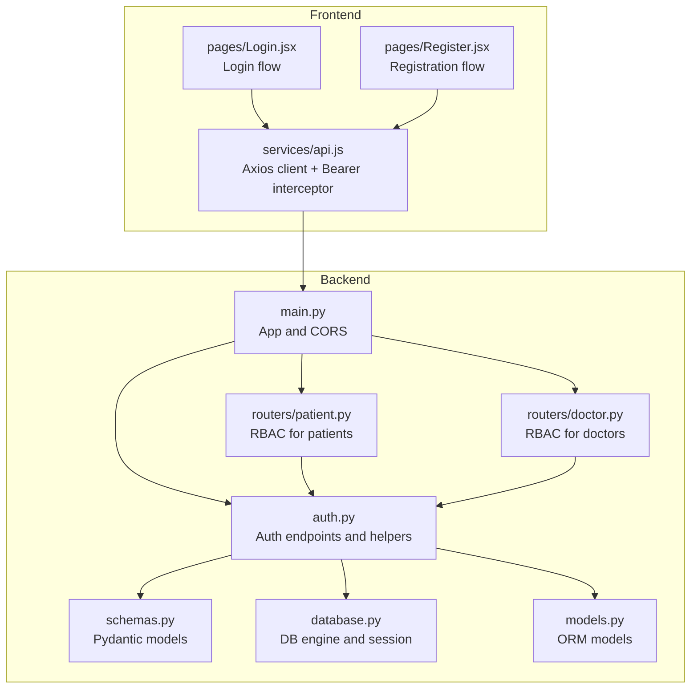
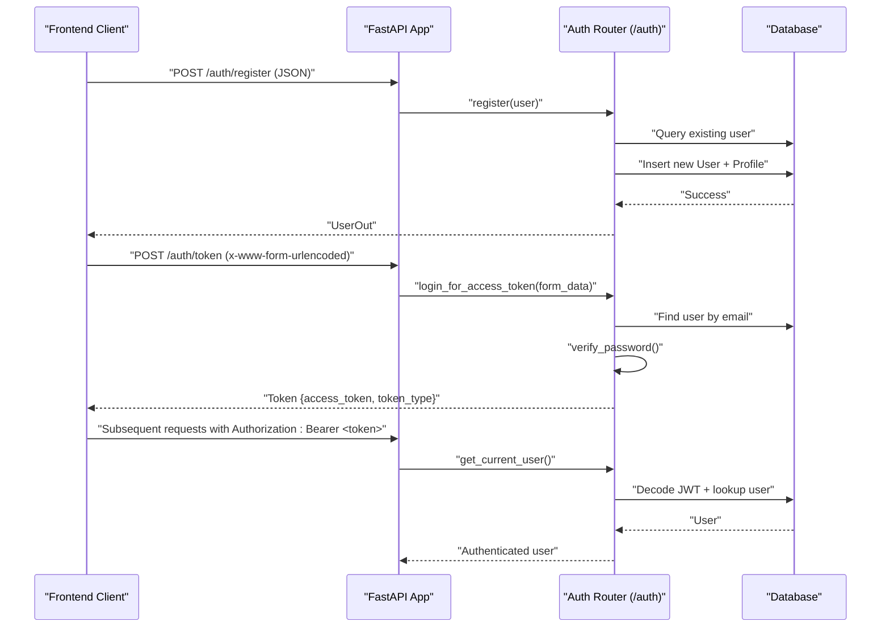
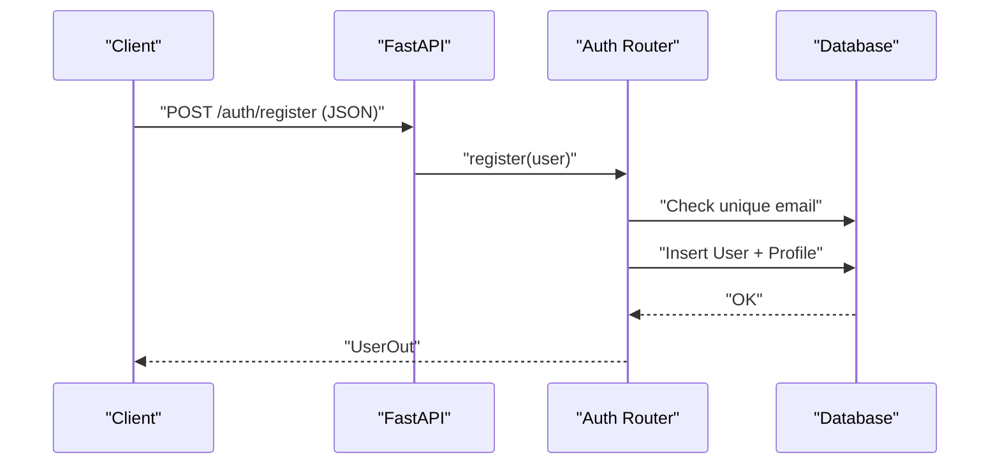
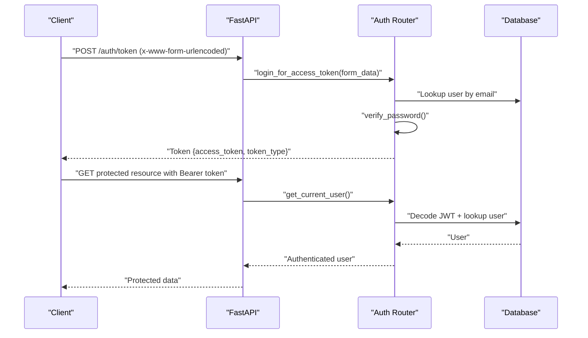
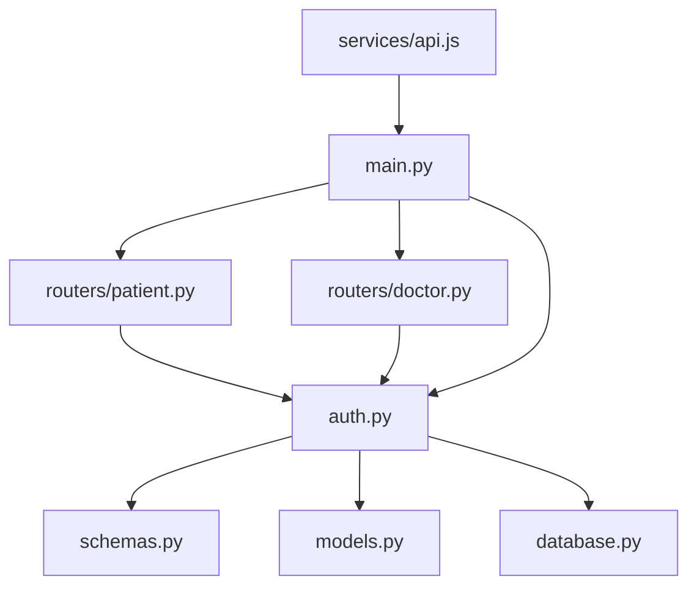

# Authentication API

<cite>
**Referenced Files in This Document**
- [backend/main.py](file://backend/main.py)
- [backend/auth.py](file://backend/auth.py)
- [backend/schemas.py](file://backend/schemas.py)
- [backend/models.py](file://backend/models.py)
- [backend/database.py](file://backend/database.py)
- [backend/routers/patient.py](file://backend/routers/patient.py)
- [backend/routers/doctor.py](file://backend/routers/doctor.py)
- [frontend/src/services/api.js](file://frontend/src/services/api.js)
- [frontend/src/pages/Login.jsx](file://frontend/src/pages/Login.jsx)
- [frontend/src/pages/Register.jsx](file://frontend/src/pages/Register.jsx)
- [test_registration.py](file://test_registration.py)
- [check_passlib.py](file://check_passlib.py)
</cite>

## Table of Contents
1. [Introduction](#introduction)
2. [Project Structure](#project-structure)
3. [Core Components](#core-components)
4. [Architecture Overview](#architecture-overview)
5. [Detailed Component Analysis](#detailed-component-analysis)
6. [Dependency Analysis](#dependency-analysis)
7. [Performance Considerations](#performance-considerations)
8. [Troubleshooting Guide](#troubleshooting-guide)
9. [Conclusion](#conclusion)

## Introduction
This document provides comprehensive API documentation for the SmartHealthCare authentication system. It covers all authentication-related endpoints, including user registration, login, and token issuance. It also documents JWT token structure, expiration handling, and outlines the current absence of logout and password reset endpoints. Practical examples of authentication flows, token usage patterns, and role-based access control are included, along with security considerations and best practices.

## Project Structure
The authentication system spans the backend FastAPI application, router modules, Pydantic schemas, SQLAlchemy models, and a simple frontend client that demonstrates token usage.

**Diagram sources**
- [backend/main.py](file://backend/main.py#L13-L44)
- [backend/auth.py](file://backend/auth.py#L18-L21)
- [backend/schemas.py](file://backend/schemas.py#L6-L28)
- [backend/database.py](file://backend/database.py#L5-L21)
- [backend/models.py](file://backend/models.py#L6-L47)
- [backend/routers/patient.py](file://backend/routers/patient.py#L1-L9)
- [backend/routers/doctor.py](file://backend/routers/doctor.py#L1-L9)
- [frontend/src/services/api.js](file://frontend/src/services/api.js#L1-L24)
- [frontend/src/pages/Login.jsx](file://frontend/src/pages/Login.jsx#L13-L47)
- [frontend/src/pages/Register.jsx](file://frontend/src/pages/Register.jsx#L17-L32)

**Section sources**
- [backend/main.py](file://backend/main.py#L13-L44)
- [backend/auth.py](file://backend/auth.py#L18-L21)
- [frontend/src/services/api.js](file://frontend/src/services/api.js#L1-L24)

## Core Components
- Authentication router: Provides endpoints under /auth for registration and token issuance.
- Token utilities: Password hashing, JWT encoding/decoding, and access token creation.
- Current user dependency: Extracts and validates the bearer token to resolve the authenticated user.
- Pydantic schemas: Define request/response shapes for authentication and tokens.
- SQLAlchemy models: Store users, roles, and related profiles.
- Frontend client: Sends Authorization: Bearer headers and persists tokens locally.

Key implementation references:
- Router definition and tags: [backend/auth.py](file://backend/auth.py#L18-L21)
- Token issuer and access token creation: [backend/auth.py](file://backend/auth.py#L29-L37), [backend/auth.py](file://backend/auth.py#L106-L119)
- Current user resolver: [backend/auth.py](file://backend/auth.py#L39-L55)
- Registration endpoint: [backend/auth.py](file://backend/auth.py#L60-L104)
- Schemas for tokens and users: [backend/schemas.py](file://backend/schemas.py#L6-L28)
- User model and role field: [backend/models.py](file://backend/models.py#L6-L18)
- Frontend Axios interceptor and login flow: [frontend/src/services/api.js](file://frontend/src/services/api.js#L10-L22), [frontend/src/pages/Login.jsx](file://frontend/src/pages/Login.jsx#L13-L47)

**Section sources**
- [backend/auth.py](file://backend/auth.py#L18-L21)
- [backend/auth.py](file://backend/auth.py#L29-L37)
- [backend/auth.py](file://backend/auth.py#L39-L55)
- [backend/auth.py](file://backend/auth.py#L60-L104)
- [backend/auth.py](file://backend/auth.py#L106-L119)
- [backend/schemas.py](file://backend/schemas.py#L6-L28)
- [backend/models.py](file://backend/models.py#L6-L18)
- [frontend/src/services/api.js](file://frontend/src/services/api.js#L10-L22)
- [frontend/src/pages/Login.jsx](file://frontend/src/pages/Login.jsx#L13-L47)

## Architecture Overview
The authentication flow integrates frontend token persistence with backend token validation and role-based access control.

**Diagram sources**
- [backend/auth.py](file://backend/auth.py#L60-L104)
- [backend/auth.py](file://backend/auth.py#L106-L119)
- [backend/auth.py](file://backend/auth.py#L39-L55)
- [backend/database.py](file://backend/database.py#L16-L21)
- [frontend/src/pages/Login.jsx](file://frontend/src/pages/Login.jsx#L19-L25)
- [frontend/src/services/api.js](file://frontend/src/services/api.js#L10-L18)

## Detailed Component Analysis

### Authentication Endpoints

#### POST /auth/register
- Purpose: Register a new user and create a corresponding profile based on role.
- Method and Path: POST /auth/register
- Request Body Schema: UserCreate
  - Fields: email, full_name, role, password
  - Validation: Unique email enforced; password hashed before storage
- Response Schema: UserOut
  - Fields: id, email, full_name, role, is_active
- Authentication: No authentication required
- Error Responses:
  - 400 Bad Request: Email already registered
- Notes:
  - On successful registration, a profile is created automatically for the given role (patient or doctor).

References:
- Endpoint: [backend/auth.py](file://backend/auth.py#L60-L104)
- Request/Response schemas: [backend/schemas.py](file://backend/schemas.py#L6-L19)
- Role-based profile creation: [backend/auth.py](file://backend/auth.py#L86-L102)

**Section sources**
- [backend/auth.py](file://backend/auth.py#L60-L104)
- [backend/schemas.py](file://backend/schemas.py#L6-L19)

#### POST /auth/token
- Purpose: Issue an access token for a valid user.
- Method and Path: POST /auth/token
- Content Type: application/x-www-form-urlencoded
- Form Fields:
  - username: email address
  - password: plain text
- Response Schema: Token
  - Fields: access_token, token_type ("bearer")
- Authentication: No authentication required
- Error Responses:
  - 401 Unauthorized: Incorrect username or password
- Token Details:
  - Algorithm: HS256
  - Expiration: 30 minutes (default)
  - Claims: sub (email), role, exp

References:
- Endpoint: [backend/auth.py](file://backend/auth.py#L106-L119)
- Token schema: [backend/schemas.py](file://backend/schemas.py#L22-L28)
- Token creation: [backend/auth.py](file://backend/auth.py#L29-L37)
- Constants: [backend/auth.py](file://backend/auth.py#L10-L13)

**Section sources**
- [backend/auth.py](file://backend/auth.py#L106-L119)
- [backend/schemas.py](file://backend/schemas.py#L22-L28)
- [backend/auth.py](file://backend/auth.py#L29-L37)
- [backend/auth.py](file://backend/auth.py#L10-L13)

### JWT Token Structure and Validation
- Token Issuance:
  - Payload includes subject (email), role, and expiration.
  - Encoded with HS256 and a shared secret.
- Token Validation:
  - Extracted via OAuth2 Bearer scheme.
  - Decoded and validated against the configured algorithm and secret.
  - Resolves the current user by email from the token payload.
- Expiration Handling:
  - Access tokens expire after a fixed period (default 30 minutes).
  - Clients must re-authenticate or implement a refresh mechanism if needed.

References:
- Token creation: [backend/auth.py](file://backend/auth.py#L29-L37)
- Token validation: [backend/auth.py](file://backend/auth.py#L39-L55)
- OAuth2 Bearer scheme: [backend/auth.py](file://backend/auth.py#L16)
- Constants: [backend/auth.py](file://backend/auth.py#L10-L13)

**Section sources**
- [backend/auth.py](file://backend/auth.py#L29-L37)
- [backend/auth.py](file://backend/auth.py#L39-L55)
- [backend/auth.py](file://backend/auth.py#L10-L13)

### Role-Based Access Control (RBAC)
- RBAC Implementation:
  - Routes in patient and doctor routers depend on get_current_user to enforce role checks.
  - Examples:
    - Patient-only routes: require role "patient"
    - Doctor-only routes: require role "doctor"
- Typical Patterns:
  - Route depends on auth.get_current_user
  - Validate current_user.role and raise 403 if unauthorized
  - Return 404 if the associated profile does not exist

References:
- Patient router RBAC: [backend/routers/patient.py](file://backend/routers/patient.py#L11-L25), [backend/routers/patient.py](file://backend/routers/patient.py#L27-L52), [backend/routers/patient.py](file://backend/routers/patient.py#L54-L62), [backend/routers/patient.py](file://backend/routers/patient.py#L64-L85), [backend/routers/patient.py](file://backend/routers/patient.py#L88-L106)
- Doctor router RBAC: [backend/routers/doctor.py](file://backend/routers/doctor.py#L28-L42), [backend/routers/doctor.py](file://backend/routers/doctor.py#L44-L76), [backend/routers/doctor.py](file://backend/routers/doctor.py#L78-L109)

**Section sources**
- [backend/routers/patient.py](file://backend/routers/patient.py#L11-L25)
- [backend/routers/patient.py](file://backend/routers/patient.py#L27-L52)
- [backend/routers/patient.py](file://backend/routers/patient.py#L54-L62)
- [backend/routers/patient.py](file://backend/routers/patient.py#L64-L85)
- [backend/routers/patient.py](file://backend/routers/patient.py#L88-L106)
- [backend/routers/doctor.py](file://backend/routers/doctor.py#L28-L42)
- [backend/routers/doctor.py](file://backend/routers/doctor.py#L44-L76)
- [backend/routers/doctor.py](file://backend/routers/doctor.py#L78-L109)

### Logout and Password Reset
- Logout:
  - Not implemented in the current backend.
  - Clients can remove stored tokens locally; server-side invalidation is not supported.
- Password Reset:
  - Not implemented in the current backend.
  - No endpoint exists for resetting passwords.

References:
- Frontend token removal: [frontend/src/services/api.js](file://frontend/src/services/api.js#L10-L22)

**Section sources**
- [frontend/src/services/api.js](file://frontend/src/services/api.js#L10-L22)

### Token Usage Pattern in Frontend
- Axios Interceptor:
  - Automatically attaches Authorization: Bearer <token> header for all outgoing requests.
- Login Flow:
  - Submits username/password as x-www-form-urlencoded to /auth/token.
  - Stores returned access_token in localStorage.
  - Redirects based on decoded role claim.

References:
- Axios interceptor: [frontend/src/services/api.js](file://frontend/src/services/api.js#L10-L22)
- Login submission and token handling: [frontend/src/pages/Login.jsx](file://frontend/src/pages/Login.jsx#L19-L47)

**Section sources**
- [frontend/src/services/api.js](file://frontend/src/services/api.js#L10-L22)
- [frontend/src/pages/Login.jsx](file://frontend/src/pages/Login.jsx#L19-L47)

### Parameter Validation Rules
- Registration:
  - email: unique, validated by schema and DB uniqueness check
  - password: hashed before storage
  - role: defaults to "patient"; supports "doctor"
- Login:
  - username: treated as email
  - password: verified against stored hash
- Token Response:
  - access_token: JWT string
  - token_type: "bearer"

References:
- Registration validation and hashing: [backend/auth.py](file://backend/auth.py#L60-L104)
- Password verification: [backend/auth.py](file://backend/auth.py#L23-L27)
- Token schema: [backend/schemas.py](file://backend/schemas.py#L22-L28)

**Section sources**
- [backend/auth.py](file://backend/auth.py#L60-L104)
- [backend/auth.py](file://backend/auth.py#L23-L27)
- [backend/schemas.py](file://backend/schemas.py#L22-L28)

### Practical Authentication Flows

#### User Registration Flow

**Diagram sources**
- [backend/auth.py](file://backend/auth.py#L60-L104)
- [backend/schemas.py](file://backend/schemas.py#L6-L19)

#### User Login and Token Usage Flow

**Diagram sources**
- [backend/auth.py](file://backend/auth.py#L106-L119)
- [backend/auth.py](file://backend/auth.py#L39-L55)
- [frontend/src/pages/Login.jsx](file://frontend/src/pages/Login.jsx#L19-L25)
- [frontend/src/services/api.js](file://frontend/src/services/api.js#L10-L18)

## Dependency Analysis
The authentication module depends on schemas, models, and database utilities. Frontend clients rely on the backend endpoints and Axios interceptors.

**Diagram sources**
- [backend/auth.py](file://backend/auth.py#L1-L8)
- [backend/schemas.py](file://backend/schemas.py#L1-L4)
- [backend/models.py](file://backend/models.py#L1-L4)
- [backend/database.py](file://backend/database.py#L1-L4)
- [backend/routers/patient.py](file://backend/routers/patient.py#L1-L4)
- [backend/routers/doctor.py](file://backend/routers/doctor.py#L1-L4)
- [backend/main.py](file://backend/main.py#L34-L44)
- [frontend/src/services/api.js](file://frontend/src/services/api.js#L1-L8)

**Section sources**
- [backend/auth.py](file://backend/auth.py#L1-L8)
- [backend/main.py](file://backend/main.py#L34-L44)

## Performance Considerations
- Token Expiration: Short-lived access tokens reduce risk but increase re-authentication frequency. Consider implementing a secure refresh mechanism if long sessions are required.
- Password Hashing: PBKDF2 SHA-256 is used; ensure salt and iteration counts are configured appropriately for production.
- Database Queries: Each protected route performs a single user lookup by email; ensure indexing on email is present.

[No sources needed since this section provides general guidance]

## Troubleshooting Guide
- 400 Bad Request on Registration:
  - Cause: Email already registered.
  - Resolution: Use a different email.
  - Reference: [backend/auth.py](file://backend/auth.py#L63-L66)
- 401 Unauthorized on Login:
  - Cause: Incorrect username or password.
  - Resolution: Verify credentials; ensure email is used as username.
  - Reference: [backend/auth.py](file://backend/auth.py#L109-L114)
- 401 Unauthorized on Protected Routes:
  - Cause: Invalid or missing Bearer token; token decoding fails.
  - Resolution: Re-authenticate to obtain a new token; ensure token is attached in Authorization header.
  - References: [backend/auth.py](file://backend/auth.py#L40-L54), [frontend/src/services/api.js](file://frontend/src/services/api.js#L10-L18)
- 403 Forbidden on Role-Specific Routes:
  - Cause: Insufficient role for the requested endpoint.
  - Resolution: Log in with an account of the correct role.
  - References: [backend/routers/patient.py](file://backend/routers/patient.py#L16), [backend/routers/doctor.py](file://backend/routers/doctor.py#L33)

**Section sources**
- [backend/auth.py](file://backend/auth.py#L63-L66)
- [backend/auth.py](file://backend/auth.py#L109-L114)
- [backend/auth.py](file://backend/auth.py#L40-L54)
- [frontend/src/services/api.js](file://frontend/src/services/api.js#L10-L18)
- [backend/routers/patient.py](file://backend/routers/patient.py#L16)
- [backend/routers/doctor.py](file://backend/routers/doctor.py#L33)

## Conclusion
The SmartHealthCare authentication system provides a solid foundation with user registration, login, and JWT-based access control. It currently lacks logout and password reset endpoints. The frontend integrates seamlessly with the backend via an Authorization header interceptor. For production, consider implementing logout and password reset, rotating secrets, and adding a refresh token mechanism to improve security and UX.