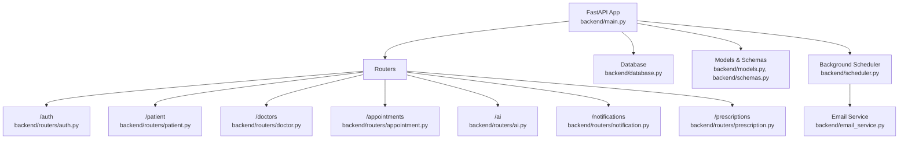
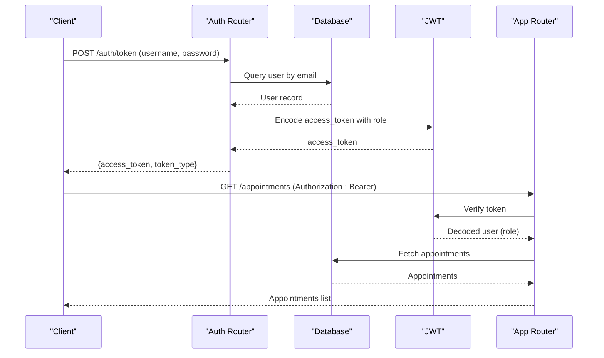
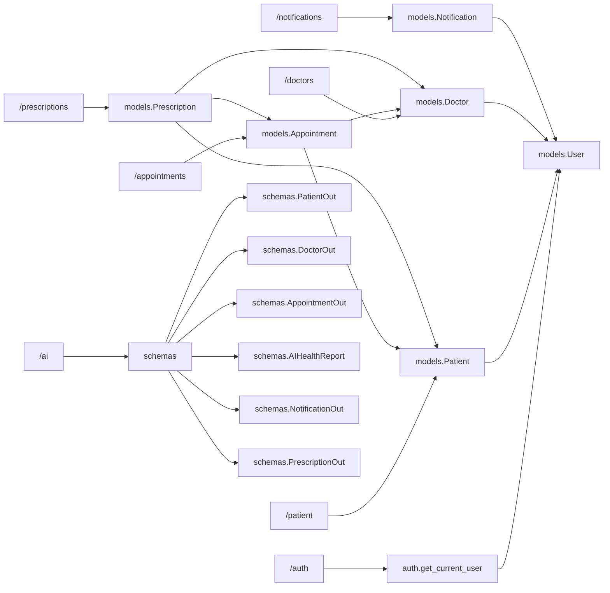

# Backend API Reference

<cite>
**Referenced Files in This Document**
- [backend/main.py](file://backend/main.py)
- [backend/auth.py](file://backend/auth.py)
- [backend/database.py](file://backend/database.py)
- [backend/models.py](file://backend/models.py)
- [backend/schemas.py](file://backend/schemas.py)
- [backend/routers/patient.py](file://backend/routers/patient.py)
- [backend/routers/doctor.py](file://backend/routers/doctor.py)
- [backend/routers/appointment.py](file://backend/routers/appointment.py)
- [backend/routers/ai.py](file://backend/routers/ai.py)
- [backend/routers/notification.py](file://backend/routers/notification.py)
- [backend/routers/prescription.py](file://backend/routers/prescription.py)
- [backend/scheduler.py](file://backend/scheduler.py)
- [backend/email_service.py](file://backend/email_service.py)
</cite>

## Table of Contents
1. [Introduction](#introduction)
2. [Project Structure](#project-structure)
3. [Core Components](#core-components)
4. [Architecture Overview](#architecture-overview)
5. [Detailed Component Analysis](#detailed-component-analysis)
6. [Dependency Analysis](#dependency-analysis)
7. [Performance Considerations](#performance-considerations)
8. [Troubleshooting Guide](#troubleshooting-guide)
9. [Conclusion](#conclusion)
10. [Appendices](#appendices)

## Introduction
This document provides a comprehensive API reference for the SmartHealthCare backend. It covers all REST endpoints grouped by functionality: authentication, patient management, doctor management, appointment scheduling, AI health analysis, notification system, and prescription management. For each endpoint, you will find HTTP methods, URL patterns, request/response schemas, authentication requirements, error responses, parameter descriptions, validation rules, and practical usage examples. Security considerations, role-based access permissions, rate limiting, pagination, and API versioning strategies are also documented.

## Project Structure
The backend is built with FastAPI and SQLAlchemy, organized into routers, models, schemas, and supporting services. The main application wires up routers and middleware, while background tasks handle notifications and reminders.

**Diagram sources**
- [backend/main.py](file://backend/main.py#L1-L61)
- [backend/routers/patient.py](file://backend/routers/patient.py#L1-L107)
- [backend/routers/doctor.py](file://backend/routers/doctor.py#L1-L120)
- [backend/routers/appointment.py](file://backend/routers/appointment.py#L1-L129)
- [backend/routers/ai.py](file://backend/routers/ai.py#L1-L90)
- [backend/routers/notification.py](file://backend/routers/notification.py#L1-L177)
- [backend/routers/prescription.py](file://backend/routers/prescription.py#L1-L145)
- [backend/database.py](file://backend/database.py#L1-L22)
- [backend/scheduler.py](file://backend/scheduler.py#L1-L317)
- [backend/email_service.py](file://backend/email_service.py#L1-L161)

**Section sources**
- [backend/main.py](file://backend/main.py#L1-L61)

## Core Components
- Authentication and Authorization
  - JWT-based bearer tokens with HS256 algorithm.
  - Role-based access control enforced via user roles: patient, doctor, admin.
  - Token endpoints: POST /auth/register, POST /auth/token.
- Data Layer
  - SQLAlchemy ORM models for Users, Patients, Doctors, Appointments, HealthRecords, Notifications, Prescriptions.
  - Pydantic schemas for request/response validation and serialization.
- Background Tasks
  - APScheduler creates and sends reminders for prescriptions and appointments.
  - Email notifications via SMTP with configurable environment variables.

**Section sources**
- [backend/auth.py](file://backend/auth.py#L1-L120)
- [backend/models.py](file://backend/models.py#L1-L110)
- [backend/schemas.py](file://backend/schemas.py#L1-L236)
- [backend/scheduler.py](file://backend/scheduler.py#L1-L317)
- [backend/email_service.py](file://backend/email_service.py#L1-L161)

## Architecture Overview
The API follows a layered architecture:
- Routers define endpoints and orchestrate business logic.
- Services (via database sessions) interact with models.
- Background jobs manage recurring tasks for reminders and notifications.
- Middleware handles CORS and logs.

**Diagram sources**
- [backend/auth.py](file://backend/auth.py#L106-L120)
- [backend/routers/appointment.py](file://backend/routers/appointment.py#L39-L92)
- [backend/database.py](file://backend/database.py#L16-L22)

## Detailed Component Analysis

### Authentication and Authorization
- Base URL: /auth
- Tags: authentication
- Security Scheme: OAuth2PasswordBearer (tokenUrl: /auth/token)
- Roles: patient, doctor, admin (default: patient)

Endpoints
- POST /auth/register
  - Request: UserCreate (email, full_name, role, password)
  - Response: UserOut (id, email, full_name, role, is_active)
  - Errors: 400 if email already registered
  - Notes: Automatically creates patient or doctor profile upon registration.

- POST /auth/token
  - Request: OAuth2PasswordRequestForm (username, password)
  - Response: Token (access_token, token_type)
  - Errors: 401 if invalid credentials
  - Notes: Access token includes role claim for authorization decisions.

Access Control
- get_current_user dependency decodes JWT and loads user from DB.
- Role checks are performed in each endpoint requiring authorization.

Security Considerations
- Algorithm: HS256 with a shared secret key.
- Token expiration: 30 minutes by default.
- Production: Use environment variables for SECRET_KEY and secure transport.

**Section sources**
- [backend/auth.py](file://backend/auth.py#L1-L120)
- [backend/schemas.py](file://backend/schemas.py#L6-L28)

### Patient Management
- Base URL: /patient
- Tags: patient

Endpoints
- GET /patient/me
  - Auth: Bearer token required; role must be patient
  - Response: PatientOut (id, user_id, date_of_birth, gender, blood_group, user)
  - Errors: 403 if not patient, 404 if profile not found

- PUT /patient/me
  - Auth: Bearer token required; role must be patient
  - Request: PatientUpdate (date_of_birth, gender, blood_group)
  - Response: PatientOut
  - Errors: 403 if not patient

- GET /patient/records
  - Auth: Bearer token required; role must be patient
  - Response: List of HealthRecordOut
  - Notes: Returns current user’s health records

- GET /patient/{patient_id}/records
  - Auth: Bearer token required; role must be doctor
  - Response: List of HealthRecordOut filtered by is_shared_with_doctor
  - Errors: 403 if not doctor, 404 if patient not found

- POST /patient/records
  - Auth: Bearer token required; role must be patient
  - Request: HealthRecordCreate (record_type, details, is_shared_with_doctor)
  - Response: HealthRecordOut
  - Errors: 403 if not patient

Validation Rules
- HealthRecord.is_shared_with_doctor defaults to false if omitted.
- Patient fields are optional updates.

**Section sources**
- [backend/routers/patient.py](file://backend/routers/patient.py#L1-L107)
- [backend/schemas.py](file://backend/schemas.py#L164-L179)

### Doctor Management
- Base URL: /doctors
- Tags: doctors

Endpoints
- GET /doctors/
  - Auth: Bearer token required
  - Query: skip (int, default 0), limit (int, default 100, max 100), specialization (optional)
  - Response: List of DoctorOut
  - Notes: Paginated and filterable by specialization

- GET /doctors/me
  - Auth: Bearer token required; role must be doctor
  - Response: DoctorOut (id, user_id, specialization, experience_years, hospital_affiliation, consultation_fee, license_number, availability, is_verified, user)
  - Errors: 403 if not doctor, 404 if profile not found

- PUT /doctors/me
  - Auth: Bearer token required; role must be doctor
  - Request: DoctorUpdate (specialization, experience_years, hospital_affiliation, consultation_fee, license_number, availability)
  - Response: DoctorOut
  - Errors: 403 if not doctor

- GET /doctors/me/stats
  - Auth: Bearer token required; role must be doctor
  - Response: DoctorStats (total_appointments, pending_appointments, completed_appointments, cancelled_appointments, today_appointments)
  - Errors: 403 if not doctor, 404 if profile not found

- GET /doctors/{doctor_id}
  - Auth: Bearer token required
  - Response: DoctorOut
  - Errors: 404 if doctor not found

Validation Rules
- limit is bounded to prevent excessive loads.
- Availability defaults to a predefined string if omitted.

**Section sources**
- [backend/routers/doctor.py](file://backend/routers/doctor.py#L1-L120)
- [backend/schemas.py](file://backend/schemas.py#L47-L139)

### Appointment Scheduling
- Base URL: /appointments
- Tags: appointments

Endpoints
- POST /appointments/
  - Auth: Bearer token required; role must be patient
  - Request: AppointmentCreate (doctor_id, appointment_date, reason)
  - Response: AppointmentOut (id, patient_id, doctor_id, appointment_date, status, reason, diagnosis_notes)
  - Errors: 403 if not patient, 404 if doctor not found

- GET /appointments/
  - Auth: Bearer token required
  - Response: List of AppointmentWithDetails (includes nested PatientInfo and DoctorInfo)
  - Errors: 403 if neither patient nor doctor

- PUT /appointments/{appointment_id}
  - Auth: Bearer token required
  - Request: AppointmentUpdate (status, diagnosis_notes)
  - Response: AppointmentOut
  - Authorization:
    - Doctor can update status and diagnosis_notes for their own appointments.
    - Patient can only set status to cancelled for their own appointments.
  - Errors: 404 if appointment not found, 403 if unauthorized

Validation Rules
- Status transitions are role-dependent.
- Diagnosis notes are optional updates for doctors.

**Section sources**
- [backend/routers/appointment.py](file://backend/routers/appointment.py#L1-L129)
- [backend/schemas.py](file://backend/schemas.py#L68-L130)

### AI Health Analysis
- Base URL: /ai
- Tags: ai

Endpoints
- POST /ai/analyze
  - Auth: Bearer token required
  - Request: SymptomAnalysisRequest (symptoms, age, gender)
  - Response: AIHealthReport (risk_level, detected_symptoms, predicted_diseases, suggested_medicines, recommendations, disclaimer)
  - Notes: Rule-based mock AI returning top predictions and suggestions.

Validation Rules
- Symptoms are processed as lowercase text.
- Risk level and predictions depend on symptom presence.

**Section sources**
- [backend/routers/ai.py](file://backend/routers/ai.py#L1-L90)
- [backend/schemas.py](file://backend/schemas.py#L140-L162)

### Notification System
- Base URL: /notifications
- Tags: notifications

Endpoints
- GET /notifications/me
  - Auth: Bearer token required
  - Query: notification_type (optional), is_read (optional), limit (default 50, max 100), offset (default 0)
  - Response: List of NotificationOut
  - Notes: Filters by user_id and orders by scheduled_datetime desc

- GET /notifications/stats
  - Auth: Bearer token required
  - Response: NotificationStats (total_unread, upcoming_reminders, total_notifications)

- GET /notifications/upcoming
  - Auth: Bearer token required
  - Query: limit (default 5, max 20)
  - Response: List of NotificationOut (future and unread)

- PATCH /notifications/{notification_id}/read
  - Auth: Bearer token required
  - Response: NotificationOut
  - Errors: 404 if notification not found

- PATCH /notifications/mark-all-read
  - Auth: Bearer token required
  - Response: {"message": "All notifications marked as read"}

- DELETE /notifications/{notification_id}
  - Auth: Bearer token required
  - Response: {"message": "Notification deleted successfully"}
  - Errors: 404 if notification not found

- POST /notifications/create
  - Auth: Bearer token required
  - Request: NotificationCreate (user_id, notification_type, title, message, scheduled_datetime, related_entity_id)
  - Response: NotificationOut
  - Authorization:
    - Doctors and admins can create notifications for others.
    - Patients can only create notifications for themselves.

Validation Rules
- Only the notification owner can mark/read/delete their notifications.
- Upcoming reminders are future-dated and unread.

**Section sources**
- [backend/routers/notification.py](file://backend/routers/notification.py#L1-L177)
- [backend/schemas.py](file://backend/schemas.py#L181-L211)

### Prescription Management
- Base URL: /prescriptions
- Tags: prescriptions

Endpoints
- POST /prescriptions/create
  - Auth: Bearer token required; role must be doctor
  - Request: PrescriptionCreate (patient_id, appointment_id, medicine_name, dosage, frequency, duration_days, start_date, instructions)
  - Response: PrescriptionOut (id, patient_id, doctor_id, appointment_id, end_date, created_at)
  - Errors: 403 if not doctor, 404 if patient not found

- GET /prescriptions/me
  - Auth: Bearer token required; role must be patient
  - Response: List of PrescriptionOut (ordered by created_at desc)
  - Errors: 403 if not patient, 404 if patient profile not found

- GET /prescriptions/patient/{patient_id}
  - Auth: Bearer token required; role must be doctor
  - Response: List of PrescriptionOut
  - Errors: 403 if not doctor, 404 if patient not found

- GET /prescriptions/{prescription_id}
  - Auth: Bearer token required
  - Response: PrescriptionOut
  - Authorization: Only owner (patient or doctor) can view
  - Errors: 403 if not authorized, 404 if not found

- GET /prescriptions/active/me
  - Auth: Bearer token required; role must be patient
  - Response: List of active prescriptions (between start_date and end_date)
  - Errors: 403 if not patient, 404 if patient profile not found

Validation Rules
- end_date computed as start_date + duration_days.
- Access control ensures only authorized users can view prescriptions.

**Section sources**
- [backend/routers/prescription.py](file://backend/routers/prescription.py#L1-L145)
- [backend/schemas.py](file://backend/schemas.py#L213-L236)

## Dependency Analysis
The routers depend on models, schemas, database sessions, and auth utilities. Background tasks rely on database sessions and email service.

**Diagram sources**
- [backend/routers/patient.py](file://backend/routers/patient.py#L1-L107)
- [backend/routers/doctor.py](file://backend/routers/doctor.py#L1-L120)
- [backend/routers/appointment.py](file://backend/routers/appointment.py#L1-L129)
- [backend/routers/ai.py](file://backend/routers/ai.py#L1-L90)
- [backend/routers/notification.py](file://backend/routers/notification.py#L1-L177)
- [backend/routers/prescription.py](file://backend/routers/prescription.py#L1-L145)
- [backend/models.py](file://backend/models.py#L1-L110)
- [backend/schemas.py](file://backend/schemas.py#L1-L236)

**Section sources**
- [backend/models.py](file://backend/models.py#L1-L110)
- [backend/schemas.py](file://backend/schemas.py#L1-L236)

## Performance Considerations
- Pagination
  - Use skip/limit for listing endpoints (e.g., /doctors/, /notifications/me).
  - Limit maximum page sizes to prevent heavy queries (e.g., limit ≤ 100).
- Filtering
  - Prefer indexed fields (e.g., user_id, scheduled_datetime) for efficient queries.
- Background Jobs
  - Reminders and notifications are scheduled at intervals to balance load.
  - Cleanup runs nightly to remove old notifications.
- Caching
  - Not implemented; consider caching frequently accessed static lists (e.g., doctor specializations).

[No sources needed since this section provides general guidance]

## Troubleshooting Guide
Common Issues and Resolutions
- 401 Unauthorized
  - Cause: Missing or invalid Authorization header.
  - Resolution: Obtain a fresh token via /auth/token and include Bearer token in headers.
- 403 Forbidden
  - Cause: Insufficient role or unauthorized access to resource.
  - Resolution: Ensure user role matches endpoint requirements (e.g., only doctors can create prescriptions).
- 404 Not Found
  - Cause: Resource does not exist (e.g., doctor, patient, appointment, notification).
  - Resolution: Verify IDs and relationships.
- 400 Bad Request
  - Cause: Validation errors or duplicate email during registration.
  - Resolution: Review request payload against schemas and ensure unique email.

Rate Limiting and Throttling
- Not implemented at the API layer.
- Recommendation: Introduce rate limiting per endpoint or per IP to protect endpoints like /auth/token and /notifications/create.

API Versioning
- Current version: 0.1.0.
- Recommendation: Add version prefix (/v1/) or Accept header strategy for future breaking changes.

**Section sources**
- [backend/auth.py](file://backend/auth.py#L106-L120)
- [backend/routers/patient.py](file://backend/routers/patient.py#L1-L107)
- [backend/routers/doctor.py](file://backend/routers/doctor.py#L1-L120)
- [backend/routers/appointment.py](file://backend/routers/appointment.py#L1-L129)
- [backend/routers/notification.py](file://backend/routers/notification.py#L1-L177)
- [backend/routers/prescription.py](file://backend/routers/prescription.py#L1-L145)

## Conclusion
This API reference outlines the SmartHealthCare backend endpoints, their schemas, authentication, and authorization rules. The system supports role-based access, background job-driven notifications, and structured data models. For production, implement environment-based secrets, rate limiting, and API versioning to ensure robustness and scalability.

[No sources needed since this section summarizes without analyzing specific files]

## Appendices

### JWT Token Usage
- Obtain token: POST /auth/token with username and password.
- Use token: Include Authorization: Bearer <access_token> in headers.
- Claims: sub (email), role (patient/doctor/admin), exp (expiration).
- Expiration: 30 minutes by default.

**Section sources**
- [backend/auth.py](file://backend/auth.py#L106-L120)

### Role-Based Access Permissions
- Patient endpoints: require role patient.
- Doctor endpoints: require role doctor.
- Admin actions: available via role admin (e.g., creating notifications for others).
- Shared access: appointments and prescriptions expose details conditionally based on ownership.

**Section sources**
- [backend/routers/patient.py](file://backend/routers/patient.py#L1-L107)
- [backend/routers/doctor.py](file://backend/routers/doctor.py#L1-L120)
- [backend/routers/appointment.py](file://backend/routers/appointment.py#L1-L129)
- [backend/routers/prescription.py](file://backend/routers/prescription.py#L1-L145)
- [backend/routers/notification.py](file://backend/routers/notification.py#L147-L177)

### Background Scheduler and Notifications
- Scheduled Jobs
  - Hourly: create medicine and appointment reminders.
  - Every 5 minutes: send pending notifications.
  - Daily at 2 AM: cleanup old notifications.
- Email Service
  - SMTP configuration via environment variables.
  - HTML email templates for notifications.

**Section sources**
- [backend/scheduler.py](file://backend/scheduler.py#L259-L317)
- [backend/email_service.py](file://backend/email_service.py#L1-L161)

### Example Requests and Responses
- Authentication
  - POST /auth/token
    - Headers: Content-Type: application/x-www-form-urlencoded
    - Body: username={email}&password={password}
    - Response: {access_token, token_type}
- Patient Profile
  - GET /patient/me
    - Headers: Authorization: Bearer {access_token}
    - Response: PatientOut
- Appointment Booking
  - POST /appointments/
    - Body: {doctor_id, appointment_date, reason}
    - Response: AppointmentOut
- AI Analysis
  - POST /ai/analyze
    - Body: {symptoms, age, gender}
    - Response: AIHealthReport
- Notifications
  - GET /notifications/me?limit=20&offset=0
    - Response: List of NotificationOut
- Prescriptions
  - POST /prescriptions/create
    - Body: {patient_id, medicine_name, dosage, frequency, duration_days, start_date, instructions}
    - Response: PrescriptionOut

[No sources needed since this section provides general usage examples]