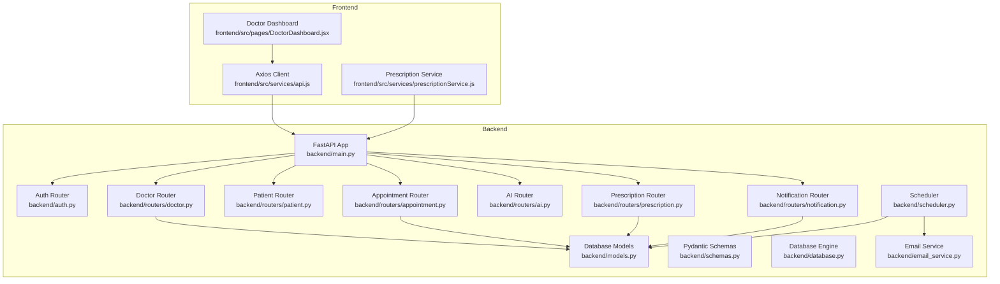
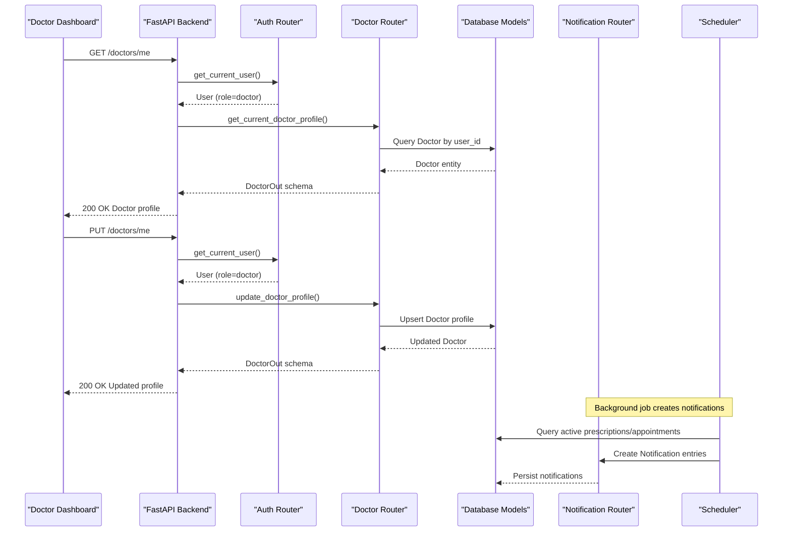
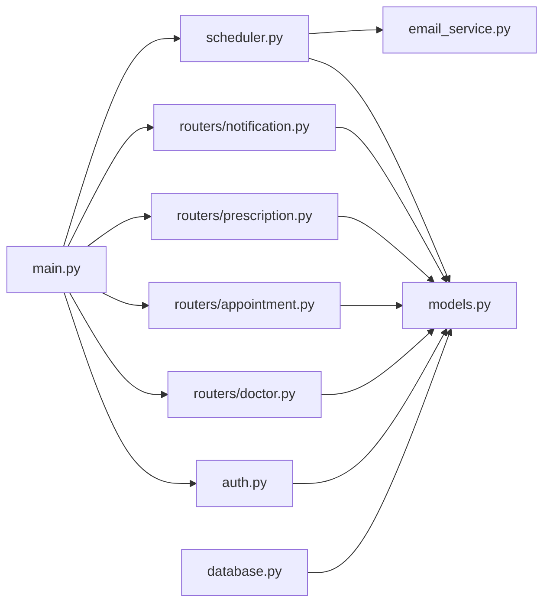

# Doctor Management API

<cite>
**Referenced Files in This Document**
- [backend/routers/doctor.py](file://backend/routers/doctor.py)
- [backend/routers/appointment.py](file://backend/routers/appointment.py)
- [backend/routers/prescription.py](file://backend/routers/prescription.py)
- [backend/routers/notification.py](file://backend/routers/notification.py)
- [backend/schemas.py](file://backend/schemas.py)
- [backend/models.py](file://backend/models.py)
- [backend/auth.py](file://backend/auth.py)
- [backend/main.py](file://backend/main.py)
- [backend/scheduler.py](file://backend/scheduler.py)
- [backend/email_service.py](file://backend/email_service.py)
- [backend/database.py](file://backend/database.py)
- [frontend/src/pages/DoctorDashboard.jsx](file://frontend/src/pages/DoctorDashboard.jsx)
- [frontend/src/services/api.js](file://frontend/src/services/api.js)
- [frontend/src/services/prescriptionService.js](file://frontend/src/services/prescriptionService.js)
</cite>

## Table of Contents
1. [Introduction](#introduction)
2. [Project Structure](#project-structure)
3. [Core Components](#core-components)
4. [Architecture Overview](#architecture-overview)
5. [Detailed Component Analysis](#detailed-component-analysis)
6. [Dependency Analysis](#dependency-analysis)
7. [Performance Considerations](#performance-considerations)
8. [Troubleshooting Guide](#troubleshooting-guide)
9. [Conclusion](#conclusion)
10. [Appendices](#appendices)

## Introduction
This document provides comprehensive API documentation for the SmartHealthCare doctor management endpoints. It covers all doctor-related operations including profile management, patient case handling, appointment scheduling, and prescription creation. For each endpoint, we specify HTTP methods, URL patterns, request/response schemas, and role-based permissions. We also detail doctor verification processes, specialization tracking, and availability management. Integration points with appointment scheduling, notification systems, and prescription management are documented, along with doctor-patient relationship management and administrative oversight requirements.

## Project Structure
The backend is organized around FastAPI routers grouped by domain: authentication, doctor, patient, appointment, AI, notification, and prescription. The frontend React application consumes these APIs through an Axios client with automatic bearer token injection.

**Diagram sources**
- [backend/main.py](file://backend/main.py#L34-L44)
- [backend/routers/doctor.py](file://backend/routers/doctor.py#L1-L120)
- [backend/routers/appointment.py](file://backend/routers/appointment.py#L1-L129)
- [backend/routers/prescription.py](file://backend/routers/prescription.py#L1-L150)
- [backend/routers/notification.py](file://backend/routers/notification.py#L1-L177)
- [backend/models.py](file://backend/models.py#L1-L110)
- [backend/schemas.py](file://backend/schemas.py#L1-L236)
- [backend/scheduler.py](file://backend/scheduler.py#L1-L317)
- [backend/email_service.py](file://backend/email_service.py#L1-L161)
- [backend/database.py](file://backend/database.py#L1-L22)
- [frontend/src/pages/DoctorDashboard.jsx](file://frontend/src/pages/DoctorDashboard.jsx#L1-L698)
- [frontend/src/services/api.js](file://frontend/src/services/api.js#L1-L25)
- [frontend/src/services/prescriptionService.js](file://frontend/src/services/prescriptionService.js#L1-L81)

**Section sources**
- [backend/main.py](file://backend/main.py#L1-L61)
- [backend/routers/doctor.py](file://backend/routers/doctor.py#L1-L120)
- [backend/routers/appointment.py](file://backend/routers/appointment.py#L1-L129)
- [backend/routers/prescription.py](file://backend/routers/prescription.py#L1-L150)
- [backend/routers/notification.py](file://backend/routers/notification.py#L1-L177)

## Core Components
- Authentication and Authorization: JWT-based authentication with role-based access control. The current user is resolved via a dependency that validates the bearer token against stored user records.
- Doctor Profiles: Doctors have specialized attributes including specialization, experience, hospital affiliation, consultation fee, license number, availability, and verification flag.
- Appointments: Managed with status tracking (scheduled, completed, cancelled) and optional diagnosis notes linking to consultations.
- Prescriptions: Linked to appointments (optional) with medicine details, dosage, frequency, duration, and instructions.
- Notifications: Automated reminders for medicine and appointments, with filtering and read/unread status tracking.
- Scheduler: Background jobs to create reminders and send notifications.

**Section sources**
- [backend/auth.py](file://backend/auth.py#L1-L120)
- [backend/models.py](file://backend/models.py#L33-L47)
- [backend/schemas.py](file://backend/schemas.py#L47-L67)
- [backend/schemas.py](file://backend/schemas.py#L68-L92)
- [backend/schemas.py](file://backend/schemas.py#L213-L236)
- [backend/schemas.py](file://backend/schemas.py#L181-L211)
- [backend/scheduler.py](file://backend/scheduler.py#L51-L183)

## Architecture Overview
The system follows a layered architecture:
- Presentation Layer: Frontend React app consuming REST endpoints.
- Application Layer: FastAPI routers handling HTTP requests/responses.
- Domain Layer: Pydantic schemas validating request/response data.
- Persistence Layer: SQLAlchemy ORM models mapped to SQLite database.
- Infrastructure Layer: Background scheduler and email service.

**Diagram sources**
- [backend/routers/doctor.py](file://backend/routers/doctor.py#L28-L76)
- [backend/auth.py](file://backend/auth.py#L39-L55)
- [backend/models.py](file://backend/models.py#L33-L47)
- [backend/routers/notification.py](file://backend/routers/notification.py#L147-L177)
- [backend/scheduler.py](file://backend/scheduler.py#L51-L183)

## Detailed Component Analysis

### Doctor Profile Management
Endpoints for retrieving and updating doctor profiles, including statistics and listing all doctors with optional specialization filtering.

- GET /doctors/
  - Description: List all doctors with optional specialization filter.
  - Role: Public endpoint (no auth required).
  - Query Parameters:
    - skip: integer (default: 0)
    - limit: integer (default: 100)
    - specialization: string (optional)
  - Response: Array of DoctorOut
  - Permissions: No authentication required.

- GET /doctors/me
  - Description: Retrieve current doctor’s profile.
  - Role: Doctor only.
  - Response: DoctorOut
  - Permissions: Requires valid JWT with role=doctor.

- PUT /doctors/me
  - Description: Update doctor profile; creates profile if missing.
  - Role: Doctor only.
  - Request Body: DoctorUpdate
  - Response: DoctorOut
  - Permissions: Requires valid JWT with role=doctor.

- GET /doctors/me/stats
  - Description: Get appointment statistics for the current doctor.
  - Role: Doctor only.
  - Response: DoctorStats
  - Permissions: Requires valid JWT with role=doctor.

- GET /doctors/{doctor_id}
  - Description: Retrieve a specific doctor by ID.
  - Role: Public endpoint (no auth required).
  - Response: DoctorOut
  - Permissions: No authentication required.

Request/Response Schemas
- DoctorBase: specialization, experience_years, hospital_affiliation, consultation_fee, license_number, availability
- DoctorUpdate: extends DoctorBase
- DoctorOut: extends DoctorBase with id, user_id, is_verified, user (optional)
- DoctorStats: total_appointments, pending_appointments, completed_appointments, cancelled_appointments, today_appointments

Authorization and Verification
- Role enforcement occurs in route handlers; non-doctors receive 403 Forbidden.
- Doctor verification is represented by is_verified flag in Doctor model/schema.

Integration Notes
- Profile updates support license_number and availability fields.
- Statistics endpoint aggregates appointment counts by status and today’s appointments.

**Section sources**
- [backend/routers/doctor.py](file://backend/routers/doctor.py#L11-L26)
- [backend/routers/doctor.py](file://backend/routers/doctor.py#L28-L42)
- [backend/routers/doctor.py](file://backend/routers/doctor.py#L44-L76)
- [backend/routers/doctor.py](file://backend/routers/doctor.py#L78-L109)
- [backend/routers/doctor.py](file://backend/routers/doctor.py#L111-L117)
- [backend/schemas.py](file://backend/schemas.py#L47-L67)
- [backend/schemas.py](file://backend/schemas.py#L132-L138)
- [backend/models.py](file://backend/models.py#L33-L47)

### Appointment Management
Endpoints for booking, listing, and updating appointments, with role-based authorization and detailed appointment views.

- POST /appointments/
  - Description: Book an appointment (patients only).
  - Role: Patient only.
  - Request Body: AppointmentCreate
  - Response: AppointmentOut
  - Permissions: Requires valid JWT with role=patient.

- GET /appointments/
  - Description: List appointments for the current user (patients see own, doctors see theirs).
  - Role: Patient or Doctor.
  - Response: Array of AppointmentWithDetails
  - Permissions: Requires valid JWT.

- PUT /appointments/{appointment_id}
  - Description: Update appointment status and/or diagnosis notes.
  - Role: Doctor or Patient.
  - Request Body: AppointmentUpdate
  - Response: AppointmentOut
  - Permissions: Authorized to the appointment owner (doctor or patient).

Authorization Details
- Doctor can update status and diagnosis_notes for their appointments.
- Patient can only cancel (status=cancelled) their own appointments.

**Section sources**
- [backend/routers/appointment.py](file://backend/routers/appointment.py#L12-L37)
- [backend/routers/appointment.py](file://backend/routers/appointment.py#L39-L92)
- [backend/routers/appointment.py](file://backend/routers/appointment.py#L94-L128)
- [backend/schemas.py](file://backend/schemas.py#L68-L92)
- [backend/schemas.py](file://backend/schemas.py#L93-L130)

### Prescription Management
Endpoints for creating, retrieving, and managing prescriptions with role-based access and active prescription filtering.

- POST /prescriptions/create
  - Description: Create a prescription (doctors only).
  - Role: Doctor only.
  - Request Body: PrescriptionCreate
  - Response: PrescriptionOut
  - Permissions: Requires valid JWT with role=doctor.

- GET /prescriptions/me
  - Description: Get prescriptions for the logged-in patient.
  - Role: Patient only.
  - Response: Array of PrescriptionOut
  - Permissions: Requires valid JWT with role=patient.

- GET /prescriptions/patient/{patient_id}
  - Description: Get prescriptions for a specific patient (doctors only).
  - Role: Doctor only.
  - Response: Array of PrescriptionOut
  - Permissions: Requires valid JWT with role=doctor.

- GET /prescriptions/{prescription_id}
  - Description: Get prescription details (authorized owner only).
  - Role: Doctor or Patient.
  - Response: PrescriptionOut
  - Permissions: Must be owner (doctor or patient).

- GET /prescriptions/active/me
  - Description: Get active prescriptions for the logged-in patient.
  - Role: Patient only.
  - Response: Array of PrescriptionOut
  - Permissions: Requires valid JWT with role=patient.

Request/Response Schemas
- PrescriptionBase: medicine_name, dosage, frequency, duration_days, start_date, instructions
- PrescriptionCreate: extends PrescriptionBase with patient_id, appointment_id (optional)
- PrescriptionOut: extends PrescriptionBase with id, patient_id, doctor_id, appointment_id, end_date, created_at

**Section sources**
- [backend/routers/prescription.py](file://backend/routers/prescription.py#L12-L57)
- [backend/routers/prescription.py](file://backend/routers/prescription.py#L60-L77)
- [backend/routers/prescription.py](file://backend/routers/prescription.py#L80-L99)
- [backend/routers/prescription.py](file://backend/routers/prescription.py#L102-L126)
- [backend/routers/prescription.py](file://backend/routers/prescription.py#L129-L149)
- [backend/schemas.py](file://backend/schemas.py#L213-L236)

### Notification Management
Endpoints for managing notifications, including filtering, marking as read, and creating notifications.

- GET /notifications/me
  - Description: Get notifications for the logged-in user with optional filters.
  - Role: Any user.
  - Query Parameters:
    - notification_type: string (optional)
    - is_read: boolean (optional)
    - limit: integer (default: 50, max: 100)
    - offset: integer (default: 0)
  - Response: Array of NotificationOut
  - Permissions: Requires valid JWT.

- GET /notifications/stats
  - Description: Get notification statistics for the logged-in user.
  - Role: Any user.
  - Response: NotificationStats
  - Permissions: Requires valid JWT.

- GET /notifications/upcoming
  - Description: Get upcoming reminders for the logged-in user.
  - Role: Any user.
  - Query Parameters:
    - limit: integer (default: 5, max: 20)
  - Response: Array of NotificationOut
  - Permissions: Requires valid JWT.

- PATCH /notifications/{notification_id}/read
  - Description: Mark a notification as read.
  - Role: Any user.
  - Response: NotificationOut
  - Permissions: Must own the notification.

- PATCH /notifications/mark-all-read
  - Description: Mark all notifications as read for the logged-in user.
  - Role: Any user.
  - Response: JSON message
  - Permissions: Requires valid JWT.

- DELETE /notifications/{notification_id}
  - Description: Delete a notification.
  - Role: Any user.
  - Response: JSON message
  - Permissions: Must own the notification.

- POST /notifications/create
  - Description: Create a notification (doctors/admins or self for patients).
  - Role: Doctor, Admin, or Patient (self-only).
  - Request Body: NotificationCreate
  - Response: NotificationOut
  - Permissions: Authorized to create for target user.

Request/Response Schemas
- NotificationBase: notification_type, title, message, scheduled_datetime
- NotificationCreate: extends NotificationBase with user_id, related_entity_id (optional)
- NotificationUpdate: is_read, status
- NotificationOut: extends NotificationBase with id, user_id, status, is_read, created_at, related_entity_id
- NotificationStats: total_unread, upcoming_reminders, total_notifications

**Section sources**
- [backend/routers/notification.py](file://backend/routers/notification.py#L13-L38)
- [backend/routers/notification.py](file://backend/routers/notification.py#L41-L67)
- [backend/routers/notification.py](file://backend/routers/notification.py#L70-L85)
- [backend/routers/notification.py](file://backend/routers/notification.py#L88-L107)
- [backend/routers/notification.py](file://backend/routers/notification.py#L110-L123)
- [backend/routers/notification.py](file://backend/routers/notification.py#L126-L144)
- [backend/routers/notification.py](file://backend/routers/notification.py#L147-L177)
- [backend/schemas.py](file://backend/schemas.py#L181-L211)

### Authentication and Authorization
- Token Endpoint: POST /auth/token returns access_token and token_type.
- Registration Endpoint: POST /auth/register creates user and role-specific profile.
- Current User Resolution: get_current_user validates JWT and loads user from database.

Role-Based Access Control
- Doctor routes enforce role=doctor.
- Patient routes enforce role=patient.
- Notification creation enforces ownership or roles=doctor/admin.

**Section sources**
- [backend/auth.py](file://backend/auth.py#L106-L120)
- [backend/auth.py](file://backend/auth.py#L60-L104)
- [backend/auth.py](file://backend/auth.py#L39-L55)

### Scheduler and Notifications
Background jobs create medicine and appointment reminders and send notifications via email.

- Medicine Reminders: Active prescriptions trigger medicine reminders based on frequency parsing.
- Appointment Reminders: Upcoming appointments (within 48 hours) generate 24-hour and 1-hour reminders.
- Notification Delivery: Pending notifications are sent via email service; status updated accordingly.
- Cleanup: Old notifications are cleaned up after 30 days.

**Section sources**
- [backend/scheduler.py](file://backend/scheduler.py#L51-L183)
- [backend/scheduler.py](file://backend/scheduler.py#L185-L256)
- [backend/scheduler.py](file://backend/scheduler.py#L259-L308)
- [backend/email_service.py](file://backend/email_service.py#L141-L161)

### Frontend Integration
The Doctor Dashboard integrates with the backend through:
- Axios client with automatic Authorization header injection.
- Calls to /doctors/me, /doctors/me/stats, /appointments/, and /prescriptions/create.
- Prescription modal posts to /prescriptions/create with bearer token.

**Section sources**
- [frontend/src/services/api.js](file://frontend/src/services/api.js#L1-L25)
- [frontend/src/pages/DoctorDashboard.jsx](file://frontend/src/pages/DoctorDashboard.jsx#L34-L63)
- [frontend/src/pages/DoctorDashboard.jsx](file://frontend/src/pages/DoctorDashboard.jsx#L102-L115)
- [frontend/src/pages/DoctorDashboard.jsx](file://frontend/src/pages/DoctorDashboard.jsx#L122-L137)
- [frontend/src/services/prescriptionService.js](file://frontend/src/services/prescriptionService.js#L11-L24)

## Dependency Analysis
The following diagram shows key dependencies among routers, models, and services.

**Diagram sources**
- [backend/main.py](file://backend/main.py#L34-L44)
- [backend/auth.py](file://backend/auth.py#L1-L120)
- [backend/routers/doctor.py](file://backend/routers/doctor.py#L1-L120)
- [backend/routers/appointment.py](file://backend/routers/appointment.py#L1-L129)
- [backend/routers/prescription.py](file://backend/routers/prescription.py#L1-L150)
- [backend/routers/notification.py](file://backend/routers/notification.py#L1-L177)
- [backend/scheduler.py](file://backend/scheduler.py#L1-L317)
- [backend/email_service.py](file://backend/email_service.py#L1-L161)
- [backend/database.py](file://backend/database.py#L1-L22)
- [backend/models.py](file://backend/models.py#L1-L110)

**Section sources**
- [backend/main.py](file://backend/main.py#L34-L44)
- [backend/models.py](file://backend/models.py#L1-L110)

## Performance Considerations
- Pagination: Use skip/limit parameters on /doctors/ and /appointments/ to avoid large result sets.
- Filtering: Utilize specialization filter on /doctors/ to narrow results.
- Batch Operations: The scheduler runs periodic jobs; ensure database connection pooling is configured appropriately for production.
- Caching: Consider caching frequently accessed doctor profiles and appointment lists at the application layer.
- Asynchronous Processing: Background jobs offload heavy tasks (notification creation and delivery) from request-response cycles.

[No sources needed since this section provides general guidance]

## Troubleshooting Guide
Common Issues and Resolutions
- Unauthorized Access (401/403):
  - Ensure a valid bearer token is included in Authorization header.
  - Verify user role matches endpoint requirements (doctor vs patient).
- Doctor Profile Not Found:
  - First-time doctors may need to update their profile via PUT /doctors/me.
- Appointment Status Updates:
  - Only the owning doctor or patient can update status; verify ownership.
- Prescription Access:
  - Only the owner (doctor or patient) can view a specific prescription.
- Notification Ownership:
  - Only the notification owner can mark as read or delete.
- Scheduler Not Running:
  - Confirm scheduler.start_scheduler() is invoked on app startup and scheduler is healthy.

**Section sources**
- [backend/auth.py](file://backend/auth.py#L39-L55)
- [backend/routers/doctor.py](file://backend/routers/doctor.py#L33-L42)
- [backend/routers/appointment.py](file://backend/routers/appointment.py#L108-L124)
- [backend/routers/prescription.py](file://backend/routers/prescription.py#L116-L124)
- [backend/routers/notification.py](file://backend/routers/notification.py#L88-L107)
- [backend/main.py](file://backend/main.py#L46-L56)
- [backend/scheduler.py](file://backend/scheduler.py#L259-L308)

## Conclusion
The SmartHealthCare doctor management API provides a robust foundation for doctor profile management, appointment handling, and prescription workflows. With role-based permissions, integrated notification scheduling, and clear request/response schemas, the system supports efficient doctor-patient interactions while maintaining security and scalability. Administrators can oversee notifications and system maintenance through the scheduler and notification endpoints.

[No sources needed since this section summarizes without analyzing specific files]

## Appendices

### API Reference Summary
- Authentication
  - POST /auth/token
  - POST /auth/register
- Doctor
  - GET /doctors/
  - GET /doctors/me
  - PUT /doctors/me
  - GET /doctors/me/stats
  - GET /doctors/{doctor_id}
- Appointment
  - POST /appointments/
  - GET /appointments/
  - PUT /appointments/{appointment_id}
- Prescription
  - POST /prescriptions/create
  - GET /prescriptions/me
  - GET /prescriptions/patient/{patient_id}
  - GET /prescriptions/{prescription_id}
  - GET /prescriptions/active/me
- Notification
  - GET /notifications/me
  - GET /notifications/stats
  - GET /notifications/upcoming
  - PATCH /notifications/{notification_id}/read
  - PATCH /notifications/mark-all-read
  - DELETE /notifications/{notification_id}
  - POST /notifications/create

**Section sources**
- [backend/routers/doctor.py](file://backend/routers/doctor.py#L11-L117)
- [backend/routers/appointment.py](file://backend/routers/appointment.py#L12-L128)
- [backend/routers/prescription.py](file://backend/routers/prescription.py#L12-L149)
- [backend/routers/notification.py](file://backend/routers/notification.py#L13-L177)
- [backend/auth.py](file://backend/auth.py#L60-L120)