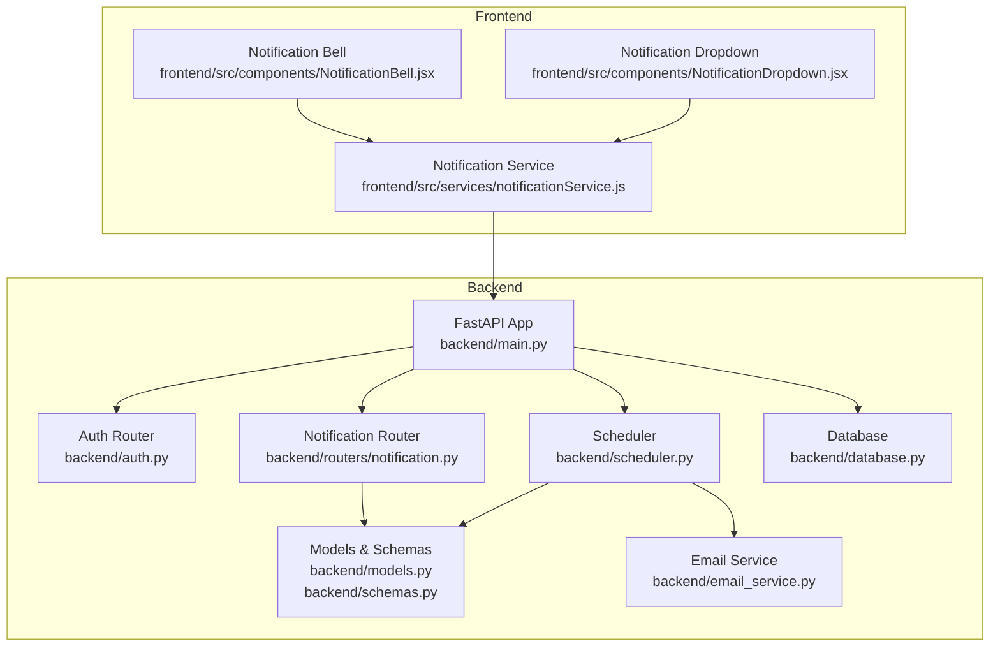
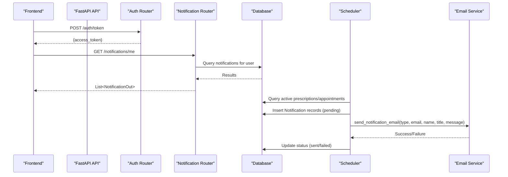
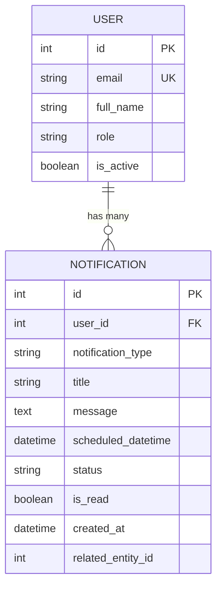
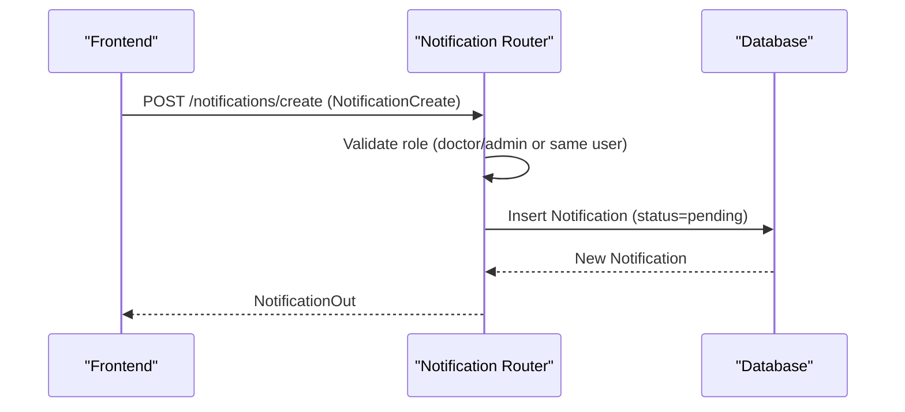
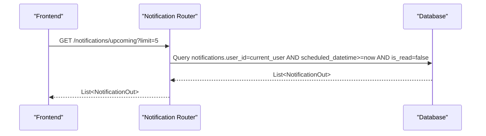
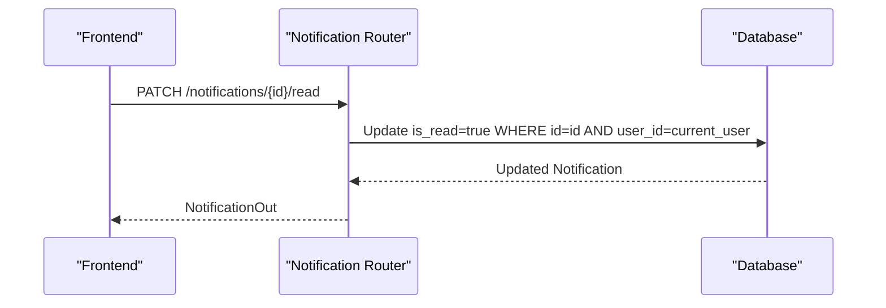
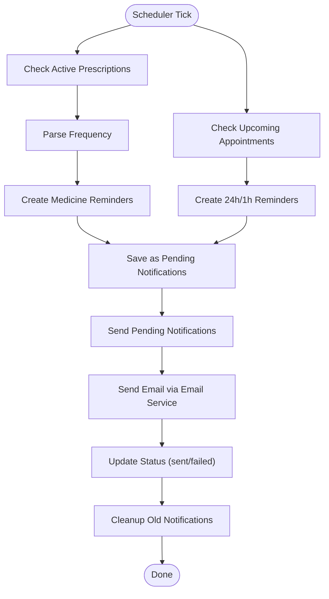
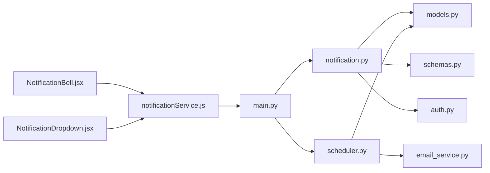

# Notification System API

<cite>
**Referenced Files in This Document**
- [backend/routers/notification.py](file://backend/routers/notification.py)
- [backend/email_service.py](file://backend/email_service.py)
- [backend/scheduler.py](file://backend/scheduler.py)
- [backend/models.py](file://backend/models.py)
- [backend/schemas.py](file://backend/schemas.py)
- [backend/auth.py](file://backend/auth.py)
- [backend/main.py](file://backend/main.py)
- [backend/database.py](file://backend/database.py)
- [frontend/src/services/notificationService.js](file://frontend/src/services/notificationService.js)
- [frontend/src/components/NotificationBell.jsx](file://frontend/src/components/NotificationBell.jsx)
- [frontend/src/components/NotificationDropdown.jsx](file://frontend/src/components/NotificationDropdown.jsx)
- [test_notifications.py](file://test_notifications.py)
</cite>

## Table of Contents
1. [Introduction](#introduction)
2. [Project Structure](#project-structure)
3. [Core Components](#core-components)
4. [Architecture Overview](#architecture-overview)
5. [Detailed Component Analysis](#detailed-component-analysis)
6. [Dependency Analysis](#dependency-analysis)
7. [Performance Considerations](#performance-considerations)
8. [Troubleshooting Guide](#troubleshooting-guide)
9. [Conclusion](#conclusion)
10. [Appendices](#appendices)

## Introduction
This document provides comprehensive API documentation for the SmartHealthCare notification system. It covers all notification-related endpoints for retrieving, managing, and tracking notifications, along with background scheduling, email delivery, and user interface integration. The system supports multiple notification types (appointment reminders, medication alerts, follow-ups, and health checks), automatic scheduling, and in-app delivery alongside email notifications.

## Project Structure
The notification system spans backend FastAPI routes, SQLAlchemy models, Pydantic schemas, APScheduler background jobs, and a React frontend integration.

**Diagram sources**
- [backend/main.py](file://backend/main.py#L34-L44)
- [backend/routers/notification.py](file://backend/routers/notification.py#L8-L11)
- [backend/scheduler.py](file://backend/scheduler.py#L9-L9)
- [backend/email_service.py](file://backend/email_service.py#L14-L18)
- [backend/database.py](file://backend/database.py#L5-L14)
- [frontend/src/services/notificationService.js](file://frontend/src/services/notificationService.js#L3-L3)
- [frontend/src/components/NotificationBell.jsx](file://frontend/src/components/NotificationBell.jsx#L6-L6)
- [frontend/src/components/NotificationDropdown.jsx](file://frontend/src/components/NotificationDropdown.jsx#L5-L5)

**Section sources**
- [backend/main.py](file://backend/main.py#L34-L44)
- [backend/routers/notification.py](file://backend/routers/notification.py#L8-L11)
- [backend/scheduler.py](file://backend/scheduler.py#L9-L9)
- [backend/email_service.py](file://backend/email_service.py#L14-L18)
- [backend/database.py](file://backend/database.py#L5-L14)
- [frontend/src/services/notificationService.js](file://frontend/src/services/notificationService.js#L3-L3)
- [frontend/src/components/NotificationBell.jsx](file://frontend/src/components/NotificationBell.jsx#L6-L6)
- [frontend/src/components/NotificationDropdown.jsx](file://frontend/src/components/NotificationDropdown.jsx#L5-L5)

## Core Components
- Notification endpoints: retrieve, filter, mark read, mark all read, delete, and create notifications.
- Background scheduler: generates reminders for prescriptions and appointments, sends pending notifications, and cleans up old notifications.
- Email service: constructs HTML templates and sends emails based on notification type.
- Frontend integration: fetches notifications, displays stats, and provides actions to manage notifications.

Key capabilities:
- Notification types: medicine_reminder, appointment_reminder, follow_up_reminder, health_check_reminder.
- Delivery mechanisms: in-app notifications and email (when configured).
- Status tracking: pending, sent, failed.
- Recipient filtering: per-user, per-type, read/unread, upcoming reminders.

**Section sources**
- [backend/routers/notification.py](file://backend/routers/notification.py#L13-L177)
- [backend/scheduler.py](file://backend/scheduler.py#L51-L317)
- [backend/email_service.py](file://backend/email_service.py#L23-L161)
- [backend/models.py](file://backend/models.py#L75-L89)
- [frontend/src/services/notificationService.js](file://frontend/src/services/notificationService.js#L11-L116)

## Architecture Overview
The notification system integrates FastAPI routes, SQLAlchemy ORM, APScheduler, and SMTP email delivery. The frontend consumes the API through Axios calls and renders notification UI components.

**Diagram sources**
- [backend/main.py](file://backend/main.py#L46-L56)
- [backend/auth.py](file://backend/auth.py#L106-L119)
- [backend/routers/notification.py](file://backend/routers/notification.py#L13-L38)
- [backend/scheduler.py](file://backend/scheduler.py#L51-L234)
- [backend/email_service.py](file://backend/email_service.py#L141-L161)
- [backend/database.py](file://backend/database.py#L16-L21)

## Detailed Component Analysis

### Notification Endpoints
All endpoints require a valid bearer token issued by the authentication service.

- Base URL: `/notifications`
- Authentication: Bearer token via Authorization header.

Endpoints:
- GET /me
  - Purpose: Retrieve notifications for the current user with optional filters.
  - Query parameters:
    - notification_type: string (optional)
    - is_read: boolean (optional)
    - limit: integer, default 50, max 100
    - offset: integer, default 0
  - Response: Array of NotificationOut
  - Access control: Requires current user ownership of notifications.

- GET /stats
  - Purpose: Get notification statistics for the current user.
  - Response: NotificationStats
  - Fields: total_unread, upcoming_reminders, total_notifications

- GET /upcoming
  - Purpose: Get upcoming reminders (future and unread) for the current user.
  - Query parameters:
    - limit: integer, default 5, max 20
  - Response: Array of NotificationOut

- PATCH /{notification_id}/read
  - Purpose: Mark a specific notification as read.
  - Path parameter: notification_id (integer)
  - Response: NotificationOut
  - Access control: Must own the notification.

- PATCH /mark-all-read
  - Purpose: Mark all unread notifications as read for the current user.
  - Response: { message: string }

- DELETE /{notification_id}
  - Purpose: Delete a notification.
  - Path parameter: notification_id (integer)
  - Response: { message: string }
  - Access control: Must own the notification.

- POST /create
  - Purpose: Create a notification (for doctors/admins or self-creation by patients).
  - Request body: NotificationCreate
  - Response: NotificationOut
  - Access control:
    - Doctors and admins can create for any user.
    - Patients can only create for themselves.

Request/Response Schemas:
- NotificationCreate: user_id, notification_type, title, message, scheduled_datetime, related_entity_id (optional)
- NotificationOut: id, user_id, notification_type, title, message, scheduled_datetime, status, is_read, created_at, related_entity_id (optional)
- NotificationStats: total_unread, upcoming_reminders, total_notifications

Delivery mechanism:
- In-app: Notifications are stored in the database with status pending/sent/failed.
- Email: Sent via email service provider when configured.

**Section sources**
- [backend/routers/notification.py](file://backend/routers/notification.py#L13-L177)
- [backend/schemas.py](file://backend/schemas.py#L188-L211)
- [backend/models.py](file://backend/models.py#L75-L89)

### Background Scheduler
The scheduler runs periodic tasks to generate reminders and send notifications.

- Jobs:
  - Every hour: check_and_create_medicine_reminders
  - Every hour: check_and_create_appointment_reminders
  - Every 5 minutes: send_pending_notifications
  - Daily at 2 AM: cleanup_old_notifications

- Medicine reminders:
  - Parses prescription frequency and creates reminders for active prescriptions.
  - Example frequencies: once daily, twice daily, 3 times daily, every 6/8/12 hours.
  - Creates notifications with type medicine_reminder.

- Appointment reminders:
  - Creates 24-hour and 1-hour reminders for upcoming appointments within 48 hours.
  - Creates notifications with type appointment_reminder.

- Sending pending notifications:
  - Retrieves pending notifications due now.
  - Sends email via email_service.send_notification_email.
  - Updates status to sent or failed accordingly.

- Cleanup:
  - Deletes read notifications older than 30 days.

**Section sources**
- [backend/scheduler.py](file://backend/scheduler.py#L51-L317)
- [backend/email_service.py](file://backend/email_service.py#L141-L161)

### Email Service Provider Integration
- Configuration:
  - EMAIL_HOST, EMAIL_PORT, EMAIL_USERNAME, EMAIL_PASSWORD, EMAIL_FROM loaded from environment.
  - EMAIL_ENABLED flag determines if email sending is active.

- Templates:
  - create_email_template builds an HTML email with gradient header, styled content, and footer.
  - send_notification_email maps notification types to subjects and delegates to send_email.

- Delivery:
  - send_email uses SMTP with TLS to send HTML emails.
  - Returns success/failure; logs errors.

**Section sources**
- [backend/email_service.py](file://backend/email_service.py#L14-L161)

### Frontend Integration
- Notification Service:
  - fetchNotifications(filters): GET /notifications/me with query params.
  - getNotificationStats(): GET /notifications/stats.
  - getUpcomingReminders(limit): GET /notifications/upcoming.
  - markAsRead(id): PATCH /notifications/{id}/read.
  - markAllAsRead(): PATCH /notifications/mark-all-read.
  - deleteNotification(id): DELETE /notifications/{id}.
  - createNotification(data): POST /notifications/create.

- UI Components:
  - NotificationBell: polls stats every 30 seconds and shows unread count.
  - NotificationDropdown: lists notifications, marks as read, deletes, and formats timestamps.

**Section sources**
- [frontend/src/services/notificationService.js](file://frontend/src/services/notificationService.js#L11-L116)
- [frontend/src/components/NotificationBell.jsx](file://frontend/src/components/NotificationBell.jsx#L11-L30)
- [frontend/src/components/NotificationDropdown.jsx](file://frontend/src/components/NotificationDropdown.jsx#L24-L86)

### Data Model and Relationships

**Diagram sources**
- [backend/models.py](file://backend/models.py#L6-L19)
- [backend/models.py](file://backend/models.py#L75-L89)

**Section sources**
- [backend/models.py](file://backend/models.py#L6-L19)
- [backend/models.py](file://backend/models.py#L75-L89)

### API Workflows

#### Create a Manual Notification (Doctor/Admin)

**Diagram sources**
- [backend/routers/notification.py](file://backend/routers/notification.py#L147-L177)
- [backend/schemas.py](file://backend/schemas.py#L188-L191)

#### Receive an Upcoming Reminder

**Diagram sources**
- [backend/routers/notification.py](file://backend/routers/notification.py#L70-L85)

#### Mark Notification as Read

**Diagram sources**
- [backend/routers/notification.py](file://backend/routers/notification.py#L88-L107)

#### Automatic Reminder Generation

**Diagram sources**
- [backend/scheduler.py](file://backend/scheduler.py#L51-L234)
- [backend/email_service.py](file://backend/email_service.py#L141-L161)

## Dependency Analysis
- Router dependencies:
  - notification router depends on models, database, schemas, and auth for current user.
- Scheduler dependencies:
  - Uses database sessions, models, and email_service.
- Email service dependencies:
  - Uses environment variables and SMTP libraries.
- Frontend dependencies:
  - Uses Axios for HTTP calls and local storage for tokens.

**Diagram sources**
- [backend/routers/notification.py](file://backend/routers/notification.py#L6-L6)
- [backend/scheduler.py](file://backend/scheduler.py#L4-L4)
- [backend/email_service.py](file://backend/email_service.py#L1-L9)
- [backend/main.py](file://backend/main.py#L34-L44)
- [frontend/src/services/notificationService.js](file://frontend/src/services/notificationService.js#L1-L3)

**Section sources**
- [backend/routers/notification.py](file://backend/routers/notification.py#L6-L6)
- [backend/scheduler.py](file://backend/scheduler.py#L4-L4)
- [backend/email_service.py](file://backend/email_service.py#L1-L9)
- [backend/main.py](file://backend/main.py#L34-L44)
- [frontend/src/services/notificationService.js](file://frontend/src/services/notificationService.js#L1-L3)

## Performance Considerations
- Database indexing:
  - Notification.user_id, notification.notification_type, notification.scheduled_datetime, notification.status are indexed to optimize queries.
- Background job cadence:
  - Reminders checked hourly, pending notifications sent every 5 minutes, cleanup daily.
- Pagination and limits:
  - GET /notifications/me supports limit and offset to prevent large payloads.
- Email batching:
  - Consider queuing emails for high-volume scenarios to avoid blocking scheduler threads.

[No sources needed since this section provides general guidance]

## Troubleshooting Guide
Common issues and resolutions:
- Email not configured:
  - Symptoms: Emails fail silently; scheduler logs warnings.
  - Resolution: Set EMAIL_USERNAME, EMAIL_PASSWORD, EMAIL_FROM, EMAIL_HOST, EMAIL_PORT in environment.
- Unauthorized access:
  - Symptoms: 403 when creating notifications for others.
  - Resolution: Only doctors/admins can create notifications for other users.
- Notification not found:
  - Symptoms: 404 when marking as read or deleting.
  - Resolution: Ensure notification belongs to the current user.
- Scheduler not running:
  - Symptoms: No automatic reminders.
  - Resolution: Verify app startup/shutdown events trigger scheduler start/stop.

**Section sources**
- [backend/email_service.py](file://backend/email_service.py#L20-L21)
- [backend/routers/notification.py](file://backend/routers/notification.py#L154-L161)
- [backend/routers/notification.py](file://backend/routers/notification.py#L95-L101)
- [backend/main.py](file://backend/main.py#L46-L56)

## Conclusion
The SmartHealthCare notification system provides robust in-app and email-delivered notifications with flexible scheduling and user controls. It supports multiple notification types, background automation, and a responsive frontend. Proper configuration of email credentials and adherence to access controls ensures reliable delivery and compliance.

[No sources needed since this section summarizes without analyzing specific files]

## Appendices

### Endpoint Reference Summary
- GET /notifications/me
  - Filters: notification_type, is_read, limit, offset
  - Response: Array of NotificationOut

- GET /notifications/stats
  - Response: NotificationStats

- GET /notifications/upcoming
  - Query: limit
  - Response: Array of NotificationOut

- PATCH /notifications/{notification_id}/read
  - Response: NotificationOut

- PATCH /notifications/mark-all-read
  - Response: { message: string }

- DELETE /notifications/{notification_id}
  - Response: { message: string }

- POST /notifications/create
  - Request: NotificationCreate
  - Response: NotificationOut

**Section sources**
- [backend/routers/notification.py](file://backend/routers/notification.py#L13-L177)
- [backend/schemas.py](file://backend/schemas.py#L188-L211)

### Notification Types
- medicine_reminder
- appointment_reminder
- follow_up_reminder
- health_check_reminder

These types drive both in-app display and email subject mapping.

**Section sources**
- [backend/models.py](file://backend/models.py#L80-L80)
- [backend/scheduler.py](file://backend/scheduler.py#L89-L96)
- [backend/scheduler.py](file://backend/scheduler.py#L140-L148)
- [backend/email_service.py](file://backend/email_service.py#L145-L150)

### Testing Utilities
- test_notifications.py demonstrates:
  - Creating prescriptions (doctor action)
  - Creating manual notifications (any user)
  - Retrieving notifications and stats
  - Fetching upcoming reminders

**Section sources**
- [test_notifications.py](file://test_notifications.py#L14-L101)