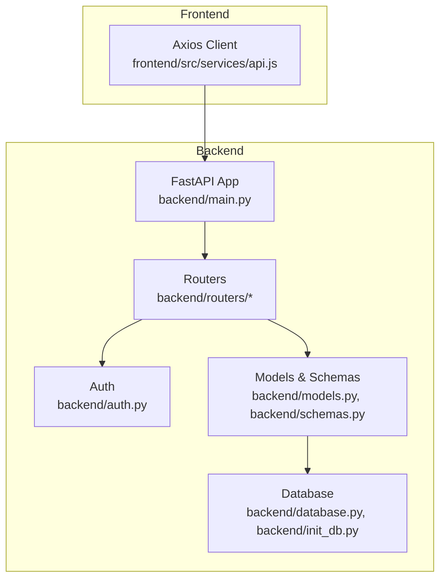
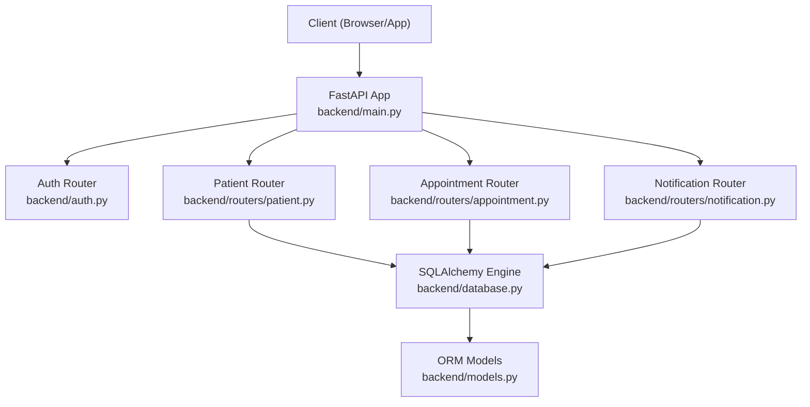
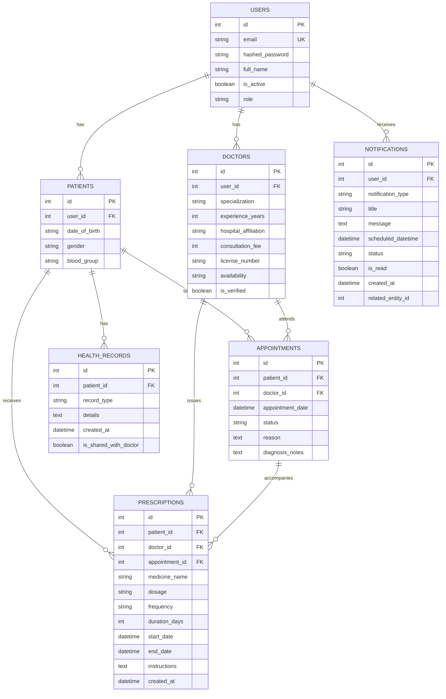
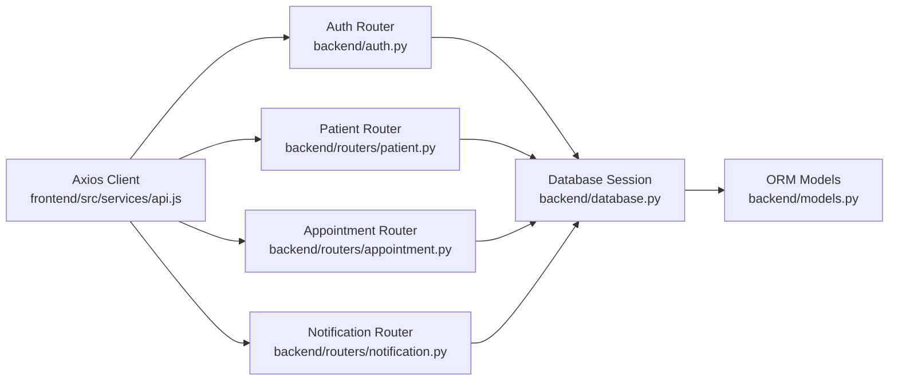

# Patient Management API

<cite>
**Referenced Files in This Document**
- [main.py](file://backend/main.py)
- [auth.py](file://backend/auth.py)
- [patient.py](file://backend/routers/patient.py)
- [schemas.py](file://backend/schemas.py)
- [models.py](file://backend/models.py)
- [database.py](file://backend/database.py)
- [init_db.py](file://backend/init_db.py)
- [appointment.py](file://backend/routers/appointment.py)
- [notification.py](file://backend/routers/notification.py)
- [api.js](file://frontend/src/services/api.js)
- [test_registration.py](file://test_registration.py)
</cite>

## Table of Contents
1. [Introduction](#introduction)
2. [Project Structure](#project-structure)
3. [Core Components](#core-components)
4. [Architecture Overview](#architecture-overview)
5. [Detailed Component Analysis](#detailed-component-analysis)
6. [Dependency Analysis](#dependency-analysis)
7. [Performance Considerations](#performance-considerations)
8. [Troubleshooting Guide](#troubleshooting-guide)
9. [Conclusion](#conclusion)
10. [Appendices](#appendices)

## Introduction
This document provides comprehensive API documentation for the SmartHealthCare patient management endpoints. It covers all patient-related operations including profile management, health record updates, appointment booking, and medical history access. For each endpoint, you will find HTTP methods, URL patterns, request/response schemas, required permissions, validation rules, privacy controls, and data protection measures. Integration patterns with other systems, data sharing permissions, and audit logging requirements are also detailed, along with common patient management scenarios and error handling strategies.

## Project Structure
The backend is built with FastAPI and SQLAlchemy, exposing REST endpoints under a unified application. Authentication is handled via OAuth2 with JWT tokens. The routers module organizes endpoints by domain (e.g., patient, doctor, appointment, notification). Data models define the persistence layer, while Pydantic schemas define request/response contracts.

**Diagram sources**
- [main.py](file://backend/main.py#L1-L61)
- [auth.py](file://backend/auth.py#L1-L120)
- [patient.py](file://backend/routers/patient.py#L1-L107)
- [schemas.py](file://backend/schemas.py#L1-L236)
- [models.py](file://backend/models.py#L1-L110)
- [database.py](file://backend/database.py#L1-L22)
- [init_db.py](file://backend/init_db.py#L1-L11)
- [api.js](file://frontend/src/services/api.js#L1-L25)

**Section sources**
- [main.py](file://backend/main.py#L1-L61)
- [database.py](file://backend/database.py#L1-L22)
- [init_db.py](file://backend/init_db.py#L1-L11)

## Core Components
- Authentication and Authorization
  - OAuth2 password flow with JWT bearer tokens.
  - Role-based access control enforced via middleware and route guards.
  - Password hashing and verification using passlib.
- Data Models
  - Users, Patients, Doctors, Appointments, Health Records, Notifications, Prescriptions.
- Pydantic Schemas
  - Strongly typed request/response models for all endpoints.
- Routers
  - Patient, Doctor, Appointment, Notification, AI, and Prescription routers.

Key responsibilities:
- Patient router: profile retrieval/update, health records CRUD, and doctor-accessible records filtering.
- Appointment router: booking, viewing, and status updates.
- Auth router: registration, token issuance, and current user resolution.

**Section sources**
- [auth.py](file://backend/auth.py#L1-L120)
- [schemas.py](file://backend/schemas.py#L1-L236)
- [models.py](file://backend/models.py#L1-L110)
- [patient.py](file://backend/routers/patient.py#L1-L107)
- [appointment.py](file://backend/routers/appointment.py#L1-L129)

## Architecture Overview
The system follows a layered architecture:
- Presentation Layer: FastAPI routes and routers.
- Application Layer: Route handlers and business logic.
- Persistence Layer: SQLAlchemy ORM models and database engine.
- Security Layer: JWT-based authentication and role checks.

**Diagram sources**
- [main.py](file://backend/main.py#L1-L61)
- [auth.py](file://backend/auth.py#L1-L120)
- [patient.py](file://backend/routers/patient.py#L1-L107)
- [appointment.py](file://backend/routers/appointment.py#L1-L129)
- [notification.py](file://backend/routers/notification.py#L1-L177)
- [database.py](file://backend/database.py#L1-L22)
- [models.py](file://backend/models.py#L1-L110)

## Detailed Component Analysis

### Authentication and Authorization
- Registration
  - Method: POST
  - URL: /auth/register
  - Request: UserCreate (email, password, full_name, role)
  - Response: UserOut (id, email, full_name, role, is_active)
  - Behavior: Hashes password, creates user, and initializes role-specific profile (patient or doctor).
- Token Issuance
  - Method: POST
  - URL: /auth/token
  - Request: OAuth2PasswordRequestForm (username, password)
  - Response: Token (access_token, token_type)
  - Behavior: Validates credentials and issues JWT with role claim.
- Current User Resolution
  - Protected by OAuth2 bearer scheme; resolves user by JWT subject and role.

Permissions:
- Patient endpoints require role "patient".
- Doctor endpoints require role "doctor".
- Some administrative actions are restricted to "admin".

Validation:
- Email uniqueness enforced during registration.
- Password hashing and verification performed by passlib.
- JWT decoding and expiration checks.

Privacy Controls:
- JWT bearer tokens included in Authorization header by frontend client.
- Role checks prevent unauthorized access to protected resources.

Audit Logging:
- Registration and profile creation include structured logs with warnings and errors.

**Section sources**
- [auth.py](file://backend/auth.py#L60-L120)
- [api.js](file://frontend/src/services/api.js#L10-L22)

### Patient Profile Management
Endpoints:
- GET /patient/me
  - Description: Retrieve current patient’s profile.
  - Permissions: patient
  - Response: PatientOut (id, user_id, date_of_birth, gender, blood_group, user)
  - Behavior: Returns patient profile linked to current user; populates user info for response.
- PUT /patient/me
  - Description: Update patient profile.
  - Permissions: patient
  - Request: PatientUpdate (date_of_birth, gender, blood_group)
  - Response: PatientOut
  - Behavior: Updates only provided fields; ensures patient profile exists (creates if missing).

Validation:
- Role enforcement via get_current_user.
- Safe fallback to create patient profile if absent.

Privacy Controls:
- Endpoint is protected by JWT and role checks.

Audit Logging:
- Registration and profile creation include structured logs.

**Section sources**
- [patient.py](file://backend/routers/patient.py#L11-L52)
- [schemas.py](file://backend/schemas.py#L29-L46)

### Health Records Management
Endpoints:
- GET /patient/records
  - Description: Retrieve current patient’s health records.
  - Permissions: patient
  - Response: List of HealthRecordOut (id, record_type, details, created_at, is_shared_with_doctor)
  - Behavior: Returns all health records for the current patient’s profile.
- GET /patient/{patient_id}/records
  - Description: Retrieve health records accessible to a doctor.
  - Permissions: doctor
  - Response: List of HealthRecordOut
  - Behavior: Filters records where is_shared_with_doctor is true.
- POST /patient/records
  - Description: Create a new health record for the current patient.
  - Permissions: patient
  - Request: HealthRecordCreate (record_type, details, is_shared_with_doctor)
  - Response: HealthRecordOut
  - Behavior: Associates record with current patient profile.

Data Protection Measures:
- Doctor access is restricted to records marked as shared.
- Patient controls visibility via is_shared_with_doctor flag.

Validation:
- Role checks for both patient and doctor endpoints.
- Patient existence verified implicitly via current_user.patient_profile.

Privacy Controls:
- is_shared_with_doctor acts as a consent mechanism for doctor access.

**Section sources**
- [patient.py](file://backend/routers/patient.py#L54-L106)
- [schemas.py](file://backend/schemas.py#L164-L179)
- [models.py](file://backend/models.py#L63-L74)

### Appointment Booking and Management
Endpoints:
- POST /appointments/
  - Description: Book an appointment for the current patient.
  - Permissions: patient
  - Request: AppointmentCreate (doctor_id, appointment_date, reason)
  - Response: AppointmentOut (id, patient_id, doctor_id, appointment_date, status, reason, diagnosis_notes)
  - Behavior: Validates doctor existence and creates appointment with status "scheduled".
- GET /appointments/
  - Description: Retrieve appointments for the current user (patient or doctor).
  - Permissions: patient or doctor
  - Response: List of AppointmentWithDetails (includes nested PatientInfo and DoctorInfo)
  - Behavior: Aggregates detailed appointment views with patient/doctor info.
- PUT /appointments/{appointment_id}
  - Description: Update appointment status or diagnosis notes.
  - Permissions: doctor or patient
  - Request: AppointmentUpdate (status, diagnosis_notes)
  - Behavior: Doctors can update status and diagnosis; patients can only cancel.

Validation:
- Doctor existence checked before booking.
- Role-based authorization for updates.

Privacy Controls:
- Access limited to associated patient/doctor.

**Section sources**
- [appointment.py](file://backend/routers/appointment.py#L12-L129)
- [schemas.py](file://backend/schemas.py#L68-L130)
- [models.py](file://backend/models.py#L49-L62)

### Notifications
While not strictly patient-centric, notifications support patient workflows:
- GET /notifications/me (filtered by type and read status)
- GET /notifications/stats
- GET /notifications/upcoming
- PATCH /notifications/{notification_id}/read
- PATCH /notifications/mark-all-read
- DELETE /notifications/{notification_id}
- POST /notifications/create (role-based authorization)

These endpoints enable reminders for appointments, prescriptions, and follow-ups.

**Section sources**
- [notification.py](file://backend/routers/notification.py#L13-L177)
- [schemas.py](file://backend/schemas.py#L181-L211)

### Data Models and Relationships

**Diagram sources**
- [models.py](file://backend/models.py#L6-L110)

## Dependency Analysis
- Router-to-Router Dependencies
  - Patient router depends on auth.get_current_user and database.get_db.
  - Appointment router depends on auth.get_current_user and database.get_db.
  - Notification router depends on auth.get_current_user and database.get_db.
- Model-to-Schema Coupling
  - Pydantic schemas mirror model structures for serialization/deserialization.
- Frontend Integration
  - Axios client injects Authorization: Bearer token from localStorage.

**Diagram sources**
- [auth.py](file://backend/auth.py#L39-L55)
- [patient.py](file://backend/routers/patient.py#L12-L52)
- [appointment.py](file://backend/routers/appointment.py#L14-L37)
- [notification.py](file://backend/routers/notification.py#L13-L38)
- [database.py](file://backend/database.py#L16-L21)
- [models.py](file://backend/models.py#L1-L110)
- [api.js](file://frontend/src/services/api.js#L10-L22)

**Section sources**
- [auth.py](file://backend/auth.py#L39-L55)
- [patient.py](file://backend/routers/patient.py#L12-L52)
- [appointment.py](file://backend/routers/appointment.py#L14-L37)
- [notification.py](file://backend/routers/notification.py#L13-L38)
- [database.py](file://backend/database.py#L16-L21)
- [api.js](file://frontend/src/services/api.js#L10-L22)

## Performance Considerations
- Database Sessions: Each route handler receives a scoped Session via dependency injection; ensure minimal round-trips per request.
- Pagination: Use limit/offset patterns where applicable (e.g., notifications) to avoid large payloads.
- Filtering: Prefer database-side filtering (as seen in notifications) to reduce memory overhead.
- JWT Validation: Keep token verification lightweight; avoid unnecessary decoding in hot paths.
- Background Tasks: Scheduler is started on app startup; ensure long-running tasks are properly managed.

[No sources needed since this section provides general guidance]

## Troubleshooting Guide
Common Issues and Resolutions:
- Authentication Failures
  - Symptom: 401 Unauthorized on protected endpoints.
  - Cause: Missing/expired/invalid JWT token.
  - Fix: Obtain a new token via /auth/token and ensure Authorization: Bearer header is set.
- Authorization Errors
  - Symptom: 403 Forbidden when accessing /patient/* or /appointments/*.
  - Cause: User role mismatch (e.g., non-patient attempting patient endpoint).
  - Fix: Verify user role and re-authenticate if necessary.
- Resource Not Found
  - Symptom: 404 Not Found for /patient/{id}/records or /appointments/{id}.
  - Cause: Non-existent resource or incorrect ID.
  - Fix: Confirm resource exists and ID is correct.
- Registration Conflicts
  - Symptom: 400 Bad Request indicating email already registered.
  - Cause: Duplicate email address.
  - Fix: Use a unique email or reset password flow.
- Logging and Diagnostics
  - Backend logs are written to app.log; inspect for warnings and errors during registration/profile creation.

**Section sources**
- [auth.py](file://backend/auth.py#L60-L120)
- [patient.py](file://backend/routers/patient.py#L16-L21)
- [appointment.py](file://backend/routers/appointment.py#L18-L37)
- [notification.py](file://backend/routers/notification.py#L13-L38)

## Conclusion
The SmartHealthCare Patient Management API provides secure, role-based access to patient profiles, health records, and appointments. Strong typing via Pydantic schemas, JWT-based authentication, and explicit role checks ensure robust and predictable behavior. Privacy is maintained through selective doctor access to shared records, and comprehensive logging supports operational diagnostics. The modular router architecture and SQLAlchemy ORM facilitate maintainability and extensibility.

[No sources needed since this section summarizes without analyzing specific files]

## Appendices

### API Reference Summary

- Authentication
  - POST /auth/register
    - Request: UserCreate
    - Response: UserOut
  - POST /auth/token
    - Request: OAuth2PasswordRequestForm
    - Response: Token

- Patient
  - GET /patient/me
    - Response: PatientOut
  - PUT /patient/me
    - Request: PatientUpdate
    - Response: PatientOut
  - GET /patient/records
    - Response: List of HealthRecordOut
  - GET /patient/{patient_id}/records
    - Response: List of HealthRecordOut (shared only)
  - POST /patient/records
    - Request: HealthRecordCreate
    - Response: HealthRecordOut

- Appointments
  - POST /appointments/
    - Request: AppointmentCreate
    - Response: AppointmentOut
  - GET /appointments/
    - Response: List of AppointmentWithDetails
  - PUT /appointments/{appointment_id}
    - Request: AppointmentUpdate
    - Response: AppointmentOut

- Notifications
  - GET /notifications/me
  - GET /notifications/stats
  - GET /notifications/upcoming
  - PATCH /notifications/{notification_id}/read
  - PATCH /notifications/mark-all-read
  - DELETE /notifications/{notification_id}
  - POST /notifications/create

**Section sources**
- [auth.py](file://backend/auth.py#L60-L120)
- [patient.py](file://backend/routers/patient.py#L11-L106)
- [appointment.py](file://backend/routers/appointment.py#L12-L129)
- [notification.py](file://backend/routers/notification.py#L13-L177)

### Example Workflows

- Patient Registration Workflow
  1. Client sends POST /auth/register with email, password, full_name, role.
  2. Backend hashes password, creates User, and initializes Patient profile.
  3. On success, returns UserOut; on duplicate email, returns 400.

- Profile Update Workflow
  1. Client calls PUT /patient/me with PatientUpdate payload.
  2. Backend validates role and updates provided fields.
  3. Returns updated PatientOut.

- Medical Record Query Workflow
  1. Patient calls GET /patient/records to retrieve all their records.
  2. Doctor calls GET /patient/{patient_id}/records to retrieve shared records only.

- Appointment Booking Workflow
  1. Patient calls POST /appointments/ with AppointmentCreate.
  2. Backend verifies doctor existence and creates appointment with status "scheduled".

**Section sources**
- [test_registration.py](file://test_registration.py#L4-L20)
- [auth.py](file://backend/auth.py#L60-L104)
- [patient.py](file://backend/routers/patient.py#L27-L52)
- [patient.py](file://backend/routers/patient.py#L54-L62)
- [patient.py](file://backend/routers/patient.py#L64-L85)
- [patient.py](file://backend/routers/patient.py#L88-L106)
- [appointment.py](file://backend/routers/appointment.py#L12-L37)

### Data Sharing Permissions and Privacy Controls
- Health records visibility is controlled by is_shared_with_doctor flag.
- Doctor access to records is filtered to those marked as shared.
- Patient controls visibility by setting is_shared_with_doctor during record creation.

**Section sources**
- [patient.py](file://backend/routers/patient.py#L78-L85)
- [schemas.py](file://backend/schemas.py#L164-L179)
- [models.py](file://backend/models.py#L63-L74)

### Audit Logging Requirements
- Registration and profile creation include structured logs with warnings and errors.
- Application startup/shutdown events are logged for lifecycle monitoring.

**Section sources**
- [auth.py](file://backend/auth.py#L60-L104)
- [main.py](file://backend/main.py#L46-L56)