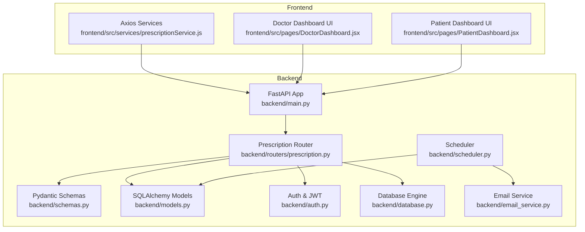
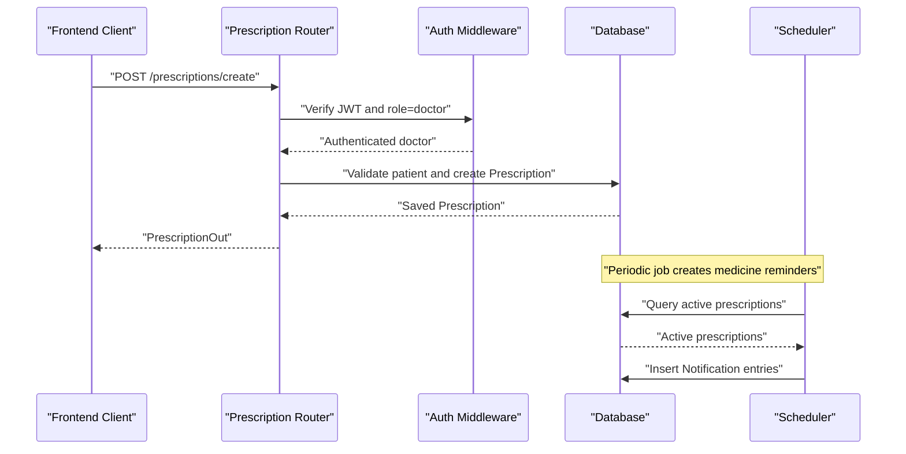
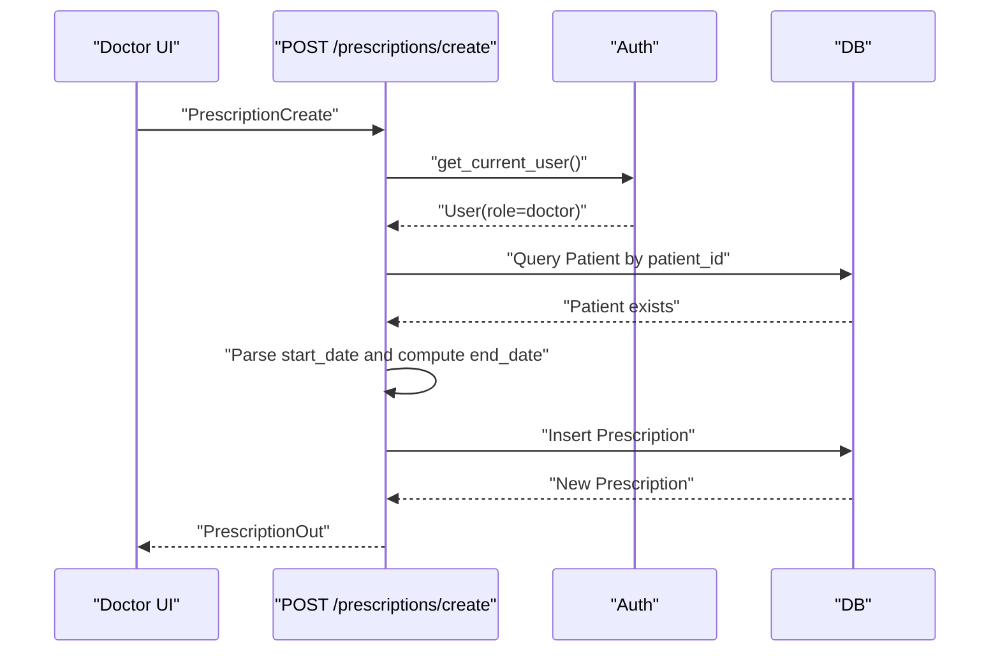
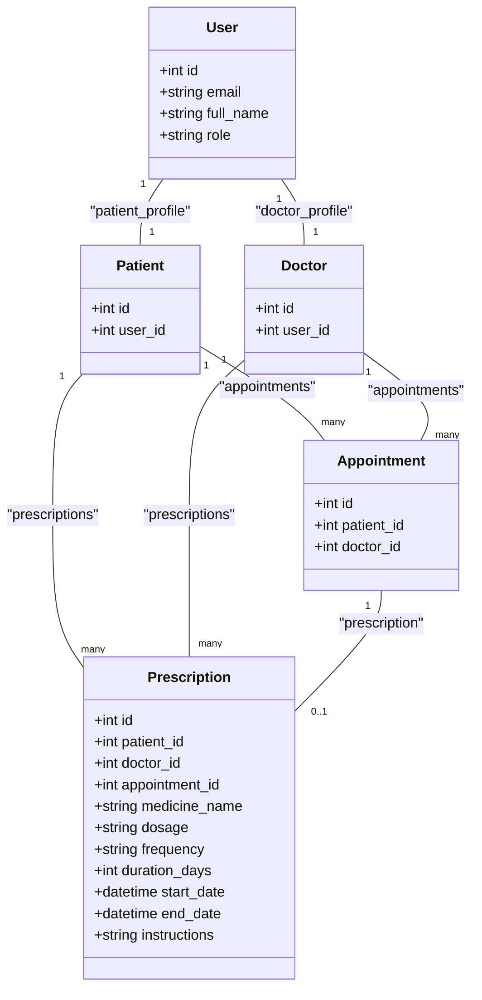
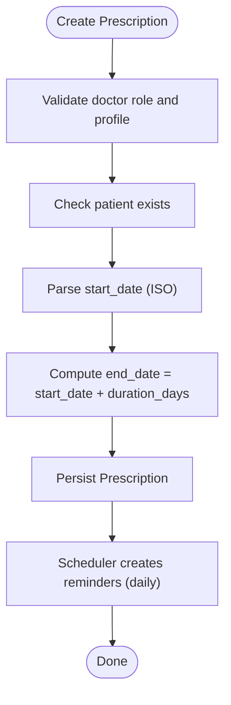
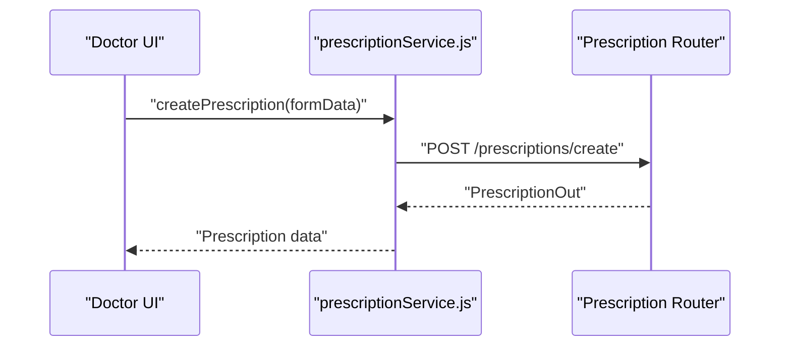
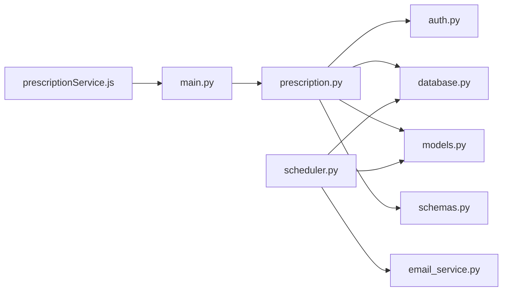

# Prescription Management API

<cite>
**Referenced Files in This Document**
- [backend/main.py](file://backend/main.py)
- [backend/routers/prescription.py](file://backend/routers/prescription.py)
- [backend/schemas.py](file://backend/schemas.py)
- [backend/models.py](file://backend/models.py)
- [backend/auth.py](file://backend/auth.py)
- [backend/database.py](file://backend/database.py)
- [backend/scheduler.py](file://backend/scheduler.py)
- [backend/email_service.py](file://backend/email_service.py)
- [frontend/src/services/prescriptionService.js](file://frontend/src/services/prescriptionService.js)
- [frontend/src/pages/DoctorDashboard.jsx](file://frontend/src/pages/DoctorDashboard.jsx)
- [frontend/src/pages/PatientDashboard.jsx](file://frontend/src/pages/PatientDashboard.jsx)
</cite>

## Table of Contents
1. [Introduction](#introduction)
2. [Project Structure](#project-structure)
3. [Core Components](#core-components)
4. [Architecture Overview](#architecture-overview)
5. [Detailed Component Analysis](#detailed-component-analysis)
6. [Dependency Analysis](#dependency-analysis)
7. [Performance Considerations](#performance-considerations)
8. [Troubleshooting Guide](#troubleshooting-guide)
9. [Conclusion](#conclusion)
10. [Appendices](#appendices)

## Introduction
This document provides comprehensive API documentation for the SmartHealthCare prescription management system. It covers all prescription-related endpoints, including digital prescription creation, medication tracking, dosage instructions, and prescription history retrieval. It also details workflow management, integration with the notification scheduler, and safety checks. Where applicable, it outlines integration points for pharmacy systems, insurance verification, and patient education resources, along with security and audit trail considerations.

## Project Structure
The prescription module is implemented as a FastAPI router with Pydantic schemas and SQLAlchemy models. The frontend integrates with the backend via Axios service functions. Background scheduling supports medicine reminders and notifications.

**Diagram sources**
- [backend/main.py](file://backend/main.py#L1-L61)
- [backend/routers/prescription.py](file://backend/routers/prescription.py#L1-L150)
- [backend/schemas.py](file://backend/schemas.py#L213-L236)
- [backend/models.py](file://backend/models.py#L91-L110)
- [backend/auth.py](file://backend/auth.py#L1-L120)
- [backend/database.py](file://backend/database.py#L1-L22)
- [backend/scheduler.py](file://backend/scheduler.py#L1-L317)
- [backend/email_service.py](file://backend/email_service.py#L1-L161)
- [frontend/src/services/prescriptionService.js](file://frontend/src/services/prescriptionService.js#L1-L81)
- [frontend/src/pages/DoctorDashboard.jsx](file://frontend/src/pages/DoctorDashboard.jsx#L590-L705)
- [frontend/src/pages/PatientDashboard.jsx](file://frontend/src/pages/PatientDashboard.jsx#L1-L200)

**Section sources**
- [backend/main.py](file://backend/main.py#L1-L61)
- [backend/routers/prescription.py](file://backend/routers/prescription.py#L1-L150)
- [frontend/src/services/prescriptionService.js](file://frontend/src/services/prescriptionService.js#L1-L81)

## Core Components
- Prescription Router: Defines endpoints for creating, retrieving, and filtering prescriptions.
- Pydantic Schemas: Define request/response shapes for prescriptions.
- SQLAlchemy Models: Persist prescriptions and relationships to patients, doctors, and appointments.
- Authentication: JWT-based access control for role-specific endpoints.
- Scheduler: Generates medicine reminders based on prescription frequency and timing.
- Email Service: Sends notification emails for reminders and follow-ups.
- Frontend Services: Axios wrappers for client-side API calls.

**Section sources**
- [backend/routers/prescription.py](file://backend/routers/prescription.py#L1-L150)
- [backend/schemas.py](file://backend/schemas.py#L213-L236)
- [backend/models.py](file://backend/models.py#L91-L110)
- [backend/auth.py](file://backend/auth.py#L1-L120)
- [backend/scheduler.py](file://backend/scheduler.py#L51-L108)
- [backend/email_service.py](file://backend/email_service.py#L141-L161)
- [frontend/src/services/prescriptionService.js](file://frontend/src/services/prescriptionService.js#L1-L81)

## Architecture Overview
The API follows a layered architecture:
- Presentation Layer: FastAPI routes under /prescriptions.
- Domain Layer: Business logic for authorization, validation, and calculation of end dates.
- Persistence Layer: SQLAlchemy ORM models and database engine.
- Background Layer: APScheduler jobs for reminders and notifications.
- Client Layer: Frontend dashboards and service functions.

**Diagram sources**
- [backend/routers/prescription.py](file://backend/routers/prescription.py#L12-L57)
- [backend/auth.py](file://backend/auth.py#L39-L55)
- [backend/scheduler.py](file://backend/scheduler.py#L51-L108)
- [backend/models.py](file://backend/models.py#L91-L110)

## Detailed Component Analysis

### Endpoint Catalog

#### Create Prescription
- Method: POST
- URL: /prescriptions/create
- Description: Doctors create a new prescription for a verified patient. The system calculates the end date from start date and duration.
- Authentication: Bearer JWT; role must be doctor.
- Request Schema: PrescriptionCreate
- Response Schema: PrescriptionOut
- Validation:
  - Requires patient existence.
  - Validates doctor profile presence.
  - Parses ISO start_date string to datetime.
  - Calculates end_date = start_date + duration_days.

**Diagram sources**
- [backend/routers/prescription.py](file://backend/routers/prescription.py#L12-L57)
- [backend/auth.py](file://backend/auth.py#L39-L55)
- [backend/schemas.py](file://backend/schemas.py#L222-L225)
- [backend/schemas.py](file://backend/schemas.py#L226-L233)

**Section sources**
- [backend/routers/prescription.py](file://backend/routers/prescription.py#L12-L57)
- [backend/schemas.py](file://backend/schemas.py#L222-L233)

#### Get My Prescriptions (Patient)
- Method: GET
- URL: /prescriptions/me
- Description: Retrieves all prescriptions for the logged-in patient, ordered by creation time descending.
- Authentication: Bearer JWT; role must be patient.
- Response Schema: List[PrescriptionOut]

**Section sources**
- [backend/routers/prescription.py](file://backend/routers/prescription.py#L60-L77)
- [backend/schemas.py](file://backend/schemas.py#L226-L233)

#### Get Patient Prescriptions (Doctor)
- Method: GET
- URL: /prescriptions/patient/{patient_id}
- Description: Retrieves all prescriptions for a given patient; accessible only by doctors.
- Authentication: Bearer JWT; role must be doctor.
- Response Schema: List[PrescriptionOut]

**Section sources**
- [backend/routers/prescription.py](file://backend/routers/prescription.py#L80-L99)
- [backend/schemas.py](file://backend/schemas.py#L226-L233)

#### Get Prescription Details
- Method: GET
- URL: /prescriptions/{prescription_id}
- Description: Returns a single prescription if the requester is the associated patient or doctor.
- Authentication: Bearer JWT; role must be patient or doctor.
- Response Schema: PrescriptionOut
- Authorization: Checks ownership by comparing patient_id or doctor_id.

**Section sources**
- [backend/routers/prescription.py](file://backend/routers/prescription.py#L102-L126)
- [backend/schemas.py](file://backend/schemas.py#L226-L233)

#### Get Active Prescriptions (Patient)
- Method: GET
- URL: /prescriptions/active/me
- Description: Returns active prescriptions for the logged-in patient (start_date ≤ now ≤ end_date).
- Authentication: Bearer JWT; role must be patient.
- Response Schema: List[PrescriptionOut]

**Section sources**
- [backend/routers/prescription.py](file://backend/routers/prescription.py#L129-L149)
- [backend/schemas.py](file://backend/schemas.py#L226-L233)

### Data Models and Schemas

**Diagram sources**
- [backend/models.py](file://backend/models.py#L6-L110)

**Section sources**
- [backend/models.py](file://backend/models.py#L91-L110)
- [backend/schemas.py](file://backend/schemas.py#L213-L236)

### Prescription Workflow Management
- Creation: Doctor selects patient, enters medicine, dosage, frequency, duration, and optional instructions; start date is parsed and end date computed.
- Retrieval: Patients see all history; doctors see a patient’s history; details require ownership verification.
- Active Status: Active prescriptions are filtered by current UTC time.
- Reminders: Scheduler parses frequency and creates daily medicine reminders for active prescriptions.

**Diagram sources**
- [backend/routers/prescription.py](file://backend/routers/prescription.py#L12-L57)
- [backend/scheduler.py](file://backend/scheduler.py#L51-L108)

**Section sources**
- [backend/routers/prescription.py](file://backend/routers/prescription.py#L12-L57)
- [backend/scheduler.py](file://backend/scheduler.py#L21-L48)

### Frontend Integration
- Doctor Dashboard: Provides a modal to compose prescriptions with fields for medicine name, dosage, duration, frequency, and instructions.
- Patient Dashboard: Displays upcoming reminders and provides navigation to health records.
- Service Functions: Encapsulate API calls with Bearer tokens.

**Diagram sources**
- [frontend/src/pages/DoctorDashboard.jsx](file://frontend/src/pages/DoctorDashboard.jsx#L590-L705)
- [frontend/src/services/prescriptionService.js](file://frontend/src/services/prescriptionService.js#L11-L24)
- [backend/routers/prescription.py](file://backend/routers/prescription.py#L12-L57)

**Section sources**
- [frontend/src/pages/DoctorDashboard.jsx](file://frontend/src/pages/DoctorDashboard.jsx#L590-L705)
- [frontend/src/services/prescriptionService.js](file://frontend/src/services/prescriptionService.js#L1-L81)

### Safety Checks and Authorization
- Role-based Access Control:
  - Create: Only doctors.
  - View Details: Only the associated patient or doctor.
  - Get My/Active: Only patients.
  - Get Patient Prescriptions: Only doctors.
- Ownership Verification: Ensures the requesting user matches the associated patient or doctor for sensitive reads.
- Input Parsing: ISO-formatted start_date is normalized to datetime.

**Section sources**
- [backend/routers/prescription.py](file://backend/routers/prescription.py#L18-L20)
- [backend/routers/prescription.py](file://backend/routers/prescription.py#L66-L67)
- [backend/routers/prescription.py](file://backend/routers/prescription.py#L87-L88)
- [backend/routers/prescription.py](file://backend/routers/prescription.py#L116-L124)

### Integration Points
- Pharmacy Systems:
  - Use the returned PrescriptionOut to populate pharmacy workflows (e.g., dispensing, refills).
  - Frequency parsing can guide automated refill triggers.
- Insurance Verification:
  - Incorporate insurance payload in PrescriptionCreate and map to claims processing.
- Patient Education:
  - Link instructions and reminders to educational resources via related_entity_id.

[No sources needed since this section provides general guidance]

### Controlled Substances and Audit Trails
- Controlled Substance Regulations:
  - Extend PrescriptionCreate with controlled substance indicators and DEA-compliant metadata.
  - Add audit fields (e.g., created_by, last_modified_by, timestamps).
- Audit Trail Requirements:
  - Track all create/update/delete actions with user context and timestamps.
  - Enforce immutable fields for original creation.

[No sources needed since this section provides general guidance]

## Dependency Analysis

**Diagram sources**
- [backend/routers/prescription.py](file://backend/routers/prescription.py#L1-L10)
- [backend/auth.py](file://backend/auth.py#L1-L21)
- [backend/database.py](file://backend/database.py#L1-L22)
- [backend/models.py](file://backend/models.py#L1-L10)
- [backend/schemas.py](file://backend/schemas.py#L1-L10)
- [backend/scheduler.py](file://backend/scheduler.py#L1-L9)
- [backend/email_service.py](file://backend/email_service.py#L1-L18)
- [frontend/src/services/prescriptionService.js](file://frontend/src/services/prescriptionService.js#L1-L9)
- [backend/main.py](file://backend/main.py#L34-L44)

**Section sources**
- [backend/routers/prescription.py](file://backend/routers/prescription.py#L1-L10)
- [backend/main.py](file://backend/main.py#L34-L44)

## Performance Considerations
- Database Indexes:
  - Add indexes on Prescription.patient_id, Prescription.doctor_id, Prescription.start_date, and Prescription.end_date for efficient filtering.
- Pagination:
  - For large prescription histories, implement pagination in list endpoints.
- Background Jobs:
  - Scheduler runs hourly for reminders; tune intervals based on load.
- Caching:
  - Cache frequently accessed doctor/patient profiles to reduce DB queries.

[No sources needed since this section provides general guidance]

## Troubleshooting Guide
- Authentication Failures:
  - Ensure Bearer token is present and valid; verify role claims.
- Authorization Errors:
  - Only the associated patient or doctor can view details; confirm ownership.
- Patient Not Found:
  - Verify patient_id exists before creating prescriptions.
- Date Parsing Issues:
  - Ensure start_date is ISO-formatted; the backend normalizes it to datetime.

**Section sources**
- [backend/routers/prescription.py](file://backend/routers/prescription.py#L18-L20)
- [backend/routers/prescription.py](file://backend/routers/prescription.py#L27-L30)
- [backend/routers/prescription.py](file://backend/routers/prescription.py#L32-L35)
- [backend/auth.py](file://backend/auth.py#L40-L55)

## Conclusion
The Prescription Management API provides a secure, role-aware foundation for digital prescriptions with integrated reminder generation and notification delivery. Extending it with controlled substance controls, comprehensive audit trails, and robust integrations will further strengthen compliance and usability.

## Appendices

### API Definitions

- Create Prescription
  - Method: POST
  - URL: /prescriptions/create
  - Auth: doctor
  - Request: PrescriptionCreate
  - Response: PrescriptionOut

- Get My Prescriptions
  - Method: GET
  - URL: /prescriptions/me
  - Auth: patient
  - Response: List[PrescriptionOut]

- Get Patient Prescriptions
  - Method: GET
  - URL: /prescriptions/patient/{patient_id}
  - Auth: doctor
  - Response: List[PrescriptionOut]

- Get Prescription Details
  - Method: GET
  - URL: /prescriptions/{prescription_id}
  - Auth: patient or doctor
  - Response: PrescriptionOut

- Get Active Prescriptions
  - Method: GET
  - URL: /prescriptions/active/me
  - Auth: patient
  - Response: List[PrescriptionOut]

**Section sources**
- [backend/routers/prescription.py](file://backend/routers/prescription.py#L12-L149)
- [backend/schemas.py](file://backend/schemas.py#L222-L233)

### Example Workflows

- Doctor-Patient Communication
  - Doctor composes a prescription via the Doctor Dashboard modal.
  - Patient receives medicine reminders through the notification system.

- Medication Adherence Tracking
  - Scheduler generates daily reminders based on frequency.
  - Patient views active prescriptions and upcoming reminders in the Patient Dashboard.

**Section sources**
- [frontend/src/pages/DoctorDashboard.jsx](file://frontend/src/pages/DoctorDashboard.jsx#L590-L705)
- [frontend/src/pages/PatientDashboard.jsx](file://frontend/src/pages/PatientDashboard.jsx#L1-L200)
- [backend/scheduler.py](file://backend/scheduler.py#L51-L108)