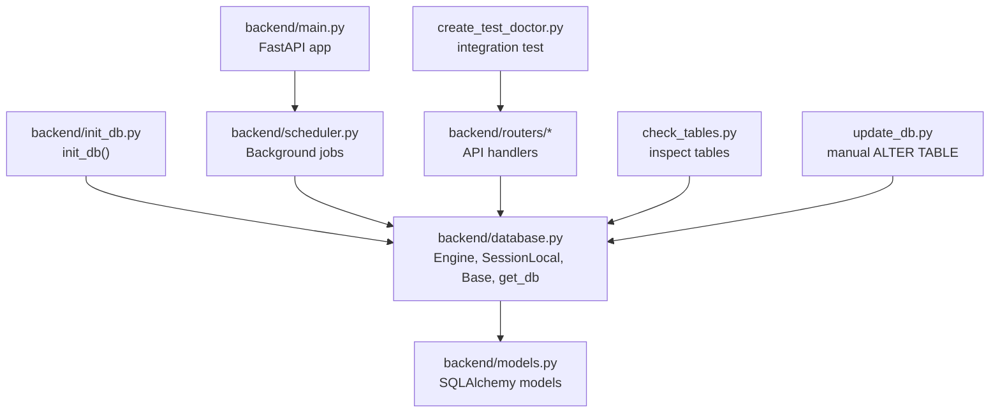
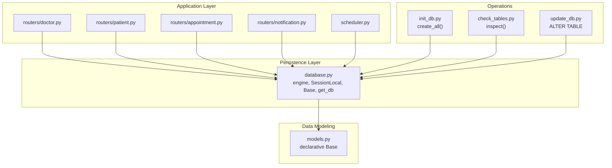
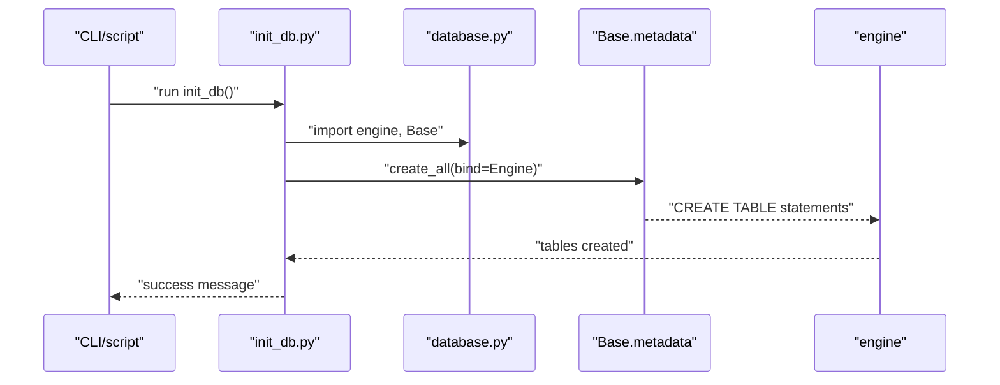
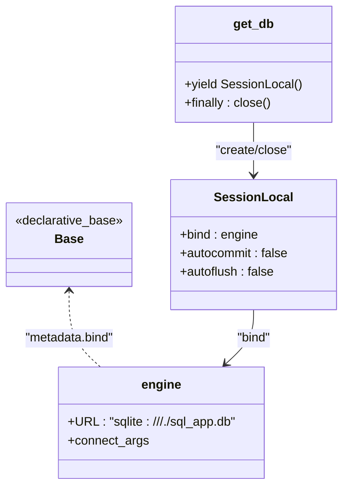
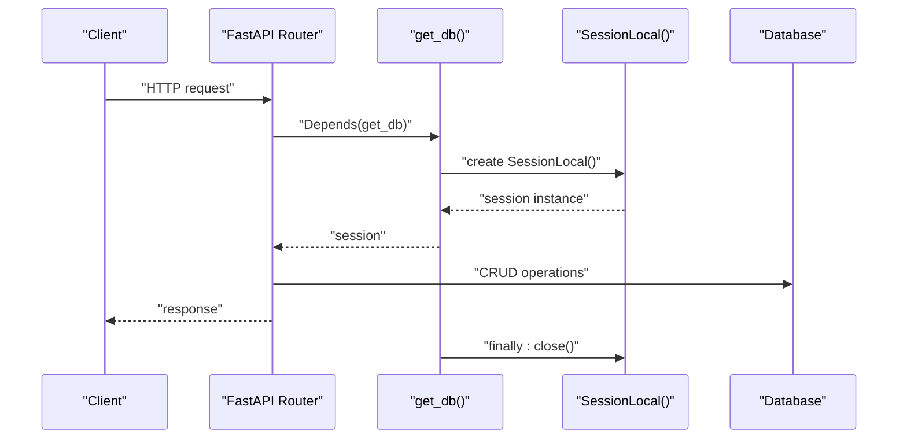
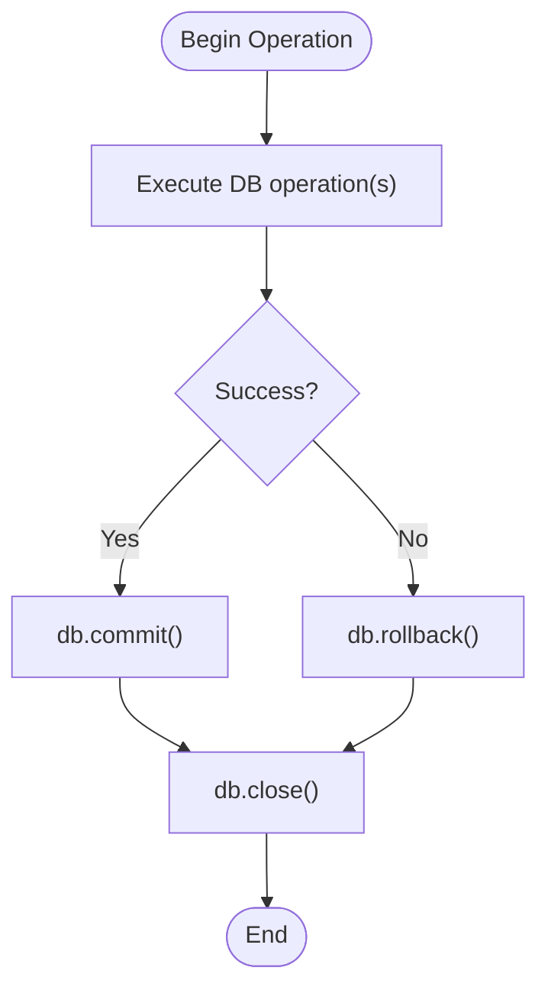
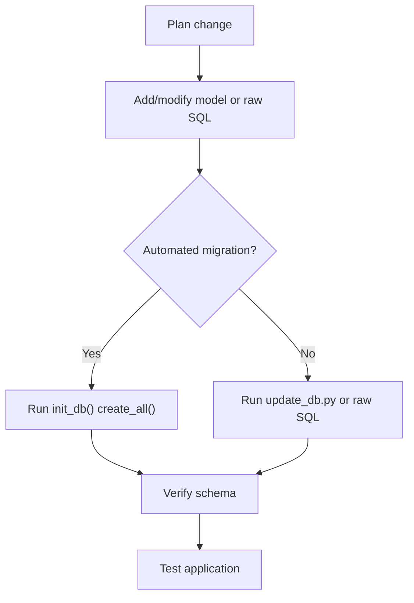
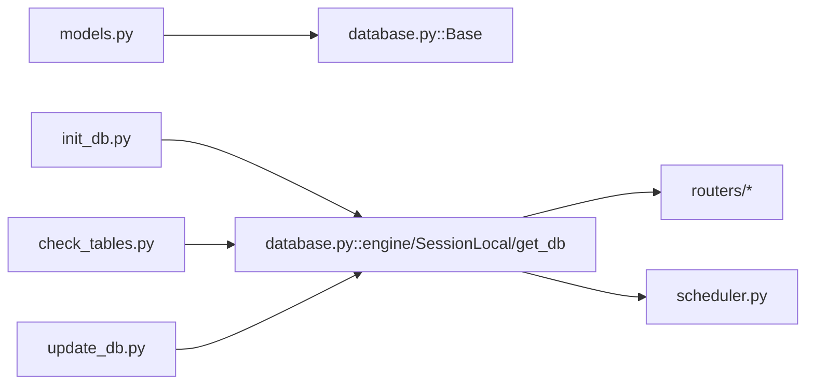

# Data Initialization & Management

<cite>
**Referenced Files in This Document**
- [backend/database.py](file://backend/database.py)
- [backend/init_db.py](file://backend/init_db.py)
- [backend/models.py](file://backend/models.py)
- [backend/main.py](file://backend/main.py)
- [backend/scheduler.py](file://backend/scheduler.py)
- [backend/routers/doctor.py](file://backend/routers/doctor.py)
- [backend/routers/patient.py](file://backend/routers/patient.py)
- [backend/routers/appointment.py](file://backend/routers/appointment.py)
- [backend/routers/notification.py](file://backend/routers/notification.py)
- [check_tables.py](file://check_tables.py)
- [update_db.py](file://update_db.py)
- [create_test_doctor.py](file://create_test_doctor.py)
- [requirements.txt](file://requirements.txt)
- [.env.example](file://.env.example)
</cite>

## Table of Contents
1. [Introduction](#introduction)
2. [Project Structure](#project-structure)
3. [Core Components](#core-components)
4. [Architecture Overview](#architecture-overview)
5. [Detailed Component Analysis](#detailed-component-analysis)
6. [Dependency Analysis](#dependency-analysis)
7. [Performance Considerations](#performance-considerations)
8. [Troubleshooting Guide](#troubleshooting-guide)
9. [Conclusion](#conclusion)
10. [Appendices](#appendices)

## Introduction
This document explains how the SmartHealthCare backend initializes and manages its database. It covers the SQLAlchemy Base metadata configuration, engine and session setup, database creation and table workflows, connection management, session handling, transaction patterns, migration procedures, schema updates, and data versioning strategies. It also documents backup and restore procedures, data export/import capabilities, maintenance tasks, performance tuning, connection pooling, concurrent access handling, and troubleshooting for common initialization and connection issues.

## Project Structure
The database layer is organized around a small set of core files:
- Engine and session factory are defined centrally and reused across the application.
- Models define the schema and relationships.
- Initialization script creates tables based on model metadata.
- Routers and scheduler use sessions to perform transactions.
- Utility scripts assist with inspection, migrations, and testing.

**Diagram sources**
- [backend/database.py](file://backend/database.py#L1-L22)
- [backend/models.py](file://backend/models.py#L1-L110)
- [backend/init_db.py](file://backend/init_db.py#L1-L11)
- [backend/main.py](file://backend/main.py#L1-L61)
- [backend/scheduler.py](file://backend/scheduler.py#L1-L317)
- [backend/routers/doctor.py](file://backend/routers/doctor.py#L1-L120)
- [backend/routers/patient.py](file://backend/routers/patient.py#L1-L107)
- [backend/routers/appointment.py](file://backend/routers/appointment.py#L1-L129)
- [backend/routers/notification.py](file://backend/routers/notification.py#L1-L177)
- [check_tables.py](file://check_tables.py#L1-L7)
- [update_db.py](file://update_db.py#L1-L25)
- [create_test_doctor.py](file://create_test_doctor.py#L1-L116)

**Section sources**
- [backend/database.py](file://backend/database.py#L1-L22)
- [backend/models.py](file://backend/models.py#L1-L110)
- [backend/init_db.py](file://backend/init_db.py#L1-L11)
- [backend/main.py](file://backend/main.py#L1-L61)
- [backend/scheduler.py](file://backend/scheduler.py#L1-L317)
- [backend/routers/doctor.py](file://backend/routers/doctor.py#L1-L120)
- [backend/routers/patient.py](file://backend/routers/patient.py#L1-L107)
- [backend/routers/appointment.py](file://backend/routers/appointment.py#L1-L129)
- [backend/routers/notification.py](file://backend/routers/notification.py#L1-L177)
- [check_tables.py](file://check_tables.py#L1-L7)
- [update_db.py](file://update_db.py#L1-L25)
- [create_test_doctor.py](file://create_test_doctor.py#L1-L116)

## Core Components
- SQLAlchemy Base and declarative models define the schema and relationships.
- Engine and SessionLocal encapsulate database connectivity and session lifecycle.
- get_db provides a dependency for FastAPI routers to obtain a per-request session.
- init_db creates all tables from model metadata.
- Scheduler uses sessions to run periodic tasks and maintain data.

Key responsibilities:
- backend/database.py: Centralizes engine, Base, SessionLocal, and get_db.
- backend/models.py: Declares all domain entities and relationships.
- backend/init_db.py: Creates tables via metadata.
- backend/scheduler.py: Periodic tasks that read/write data using sessions.
- Routers: CRUD operations using sessions and transactions.

**Section sources**
- [backend/database.py](file://backend/database.py#L1-L22)
- [backend/models.py](file://backend/models.py#L1-L110)
- [backend/init_db.py](file://backend/init_db.py#L1-L11)
- [backend/scheduler.py](file://backend/scheduler.py#L1-L317)

## Architecture Overview
The database architecture follows a layered pattern:
- Data modeling layer (models.py) defines entities and relationships.
- Persistence layer (database.py) configures engine and sessions.
- Application layer (routers, scheduler) performs transactions and queries.
- Operational layer (init_db.py, update_db.py, check_tables.py) supports lifecycle and maintenance.

**Diagram sources**
- [backend/database.py](file://backend/database.py#L1-L22)
- [backend/models.py](file://backend/models.py#L1-L110)
- [backend/init_db.py](file://backend/init_db.py#L1-L11)
- [backend/scheduler.py](file://backend/scheduler.py#L1-L317)
- [backend/routers/doctor.py](file://backend/routers/doctor.py#L1-L120)
- [backend/routers/patient.py](file://backend/routers/patient.py#L1-L107)
- [backend/routers/appointment.py](file://backend/routers/appointment.py#L1-L129)
- [backend/routers/notification.py](file://backend/routers/notification.py#L1-L177)
- [check_tables.py](file://check_tables.py#L1-L7)
- [update_db.py](file://update_db.py#L1-L25)

## Detailed Component Analysis

### Database Initialization and Table Creation
- Initialization flow:
  - Import engine and Base from database.py.
  - Import models module so all model classes are registered with Base.metadata.
  - Call create_all(bind=engine) to create tables.
- This ensures all models are reflected in the database schema.

**Diagram sources**
- [backend/init_db.py](file://backend/init_db.py#L1-L11)
- [backend/database.py](file://backend/database.py#L1-L22)
- [backend/models.py](file://backend/models.py#L1-L110)

**Section sources**
- [backend/init_db.py](file://backend/init_db.py#L1-L11)
- [backend/database.py](file://backend/database.py#L1-L22)
- [backend/models.py](file://backend/models.py#L1-L110)

### SQLAlchemy Base Metadata and Engine Setup
- Base is a declarative base used by all models.
- Engine is created with a SQLite URL and thread checking disabled for async usage.
- SessionLocal provides scoped sessions bound to the engine.
- get_db is a dependency that yields a session and closes it in a finally block.

**Diagram sources**
- [backend/database.py](file://backend/database.py#L1-L22)

**Section sources**
- [backend/database.py](file://backend/database.py#L1-L22)

### Database Connection Management and Session Handling
- Per-request sessions:
  - Routers depend on get_db to obtain a session for each request.
  - Sessions are closed in a finally block to prevent leaks.
- Scheduler sessions:
  - Scheduler constructs sessions internally and closes them after use.
  - Sessions are not shared across threads; each job uses its own session.

**Diagram sources**
- [backend/database.py](file://backend/database.py#L16-L22)
- [backend/routers/doctor.py](file://backend/routers/doctor.py#L1-L120)
- [backend/routers/patient.py](file://backend/routers/patient.py#L1-L107)
- [backend/routers/appointment.py](file://backend/routers/appointment.py#L1-L129)
- [backend/routers/notification.py](file://backend/routers/notification.py#L1-L177)
- [backend/scheduler.py](file://backend/scheduler.py#L12-L19)

**Section sources**
- [backend/database.py](file://backend/database.py#L16-L22)
- [backend/scheduler.py](file://backend/scheduler.py#L12-L19)
- [backend/routers/doctor.py](file://backend/routers/doctor.py#L1-L120)
- [backend/routers/patient.py](file://backend/routers/patient.py#L1-L107)
- [backend/routers/appointment.py](file://backend/routers/appointment.py#L1-L129)
- [backend/routers/notification.py](file://backend/routers/notification.py#L1-L177)

### Transaction Patterns
- Routers commit after write operations and refresh instances when needed.
- Scheduler wraps operations in try/except/finally blocks, committing on success and rolling back on errors.
- Transactions are short-lived and tied to request or job lifecycles.

**Diagram sources**
- [backend/scheduler.py](file://backend/scheduler.py#L51-L108)
- [backend/scheduler.py](file://backend/scheduler.py#L110-L183)
- [backend/scheduler.py](file://backend/scheduler.py#L185-L234)
- [backend/scheduler.py](file://backend/scheduler.py#L236-L257)

**Section sources**
- [backend/scheduler.py](file://backend/scheduler.py#L51-L108)
- [backend/scheduler.py](file://backend/scheduler.py#L110-L183)
- [backend/scheduler.py](file://backend/scheduler.py#L185-L234)
- [backend/scheduler.py](file://backend/scheduler.py#L236-L257)

### Migration Procedures and Schema Updates
- Automated migrations:
  - Use Base.metadata.create_all to create tables from models.
- Manual migrations:
  - update_db.py demonstrates adding columns to the doctors table using raw SQL.
- Inspection:
  - check_tables.py lists existing tables using SQLAlchemy inspector.

**Diagram sources**
- [backend/init_db.py](file://backend/init_db.py#L1-L11)
- [update_db.py](file://update_db.py#L1-L25)
- [check_tables.py](file://check_tables.py#L1-L7)

**Section sources**
- [backend/init_db.py](file://backend/init_db.py#L1-L11)
- [update_db.py](file://update_db.py#L1-L25)
- [check_tables.py](file://check_tables.py#L1-L7)

### Data Versioning Strategies
- Versioning is implicit through model definitions and migration scripts.
- To track versions:
  - Maintain a dedicated version table or use Alembic for structured migrations.
  - Store schema version in the database and apply incremental scripts.

[No sources needed since this section provides general guidance]

### Backup and Restore Procedures
- SQLite backup:
  - Copy the database file to a safe location.
- Restore:
  - Replace the database file with the backup copy.
- Export/import:
  - Use pandas to export tables to CSV for cross-platform compatibility.
  - Use pandas to import CSV data back into tables.

[No sources needed since this section provides general guidance]

### Data Export/Import Capabilities
- Export:
  - Query data via sessions and serialize to CSV/JSON.
- Import:
  - Load CSV/JSON and bulk insert using SQLAlchemy ORM or executemany.

[No sources needed since this section provides general guidance]

### Database Maintenance Tasks
- Cleanup old notifications:
  - Scheduler deletes read notifications older than a threshold.
- Indexes and constraints:
  - Add indexes on frequently filtered columns (e.g., user_id, scheduled_datetime).
- Vacuum/analyze:
  - For SQLite, consider periodic VACUUM to reclaim space.

**Section sources**
- [backend/scheduler.py](file://backend/scheduler.py#L236-L257)

## Dependency Analysis
- Routers depend on database.get_db for sessions.
- Scheduler depends on database.SessionLocal for background tasks.
- Models depend on Base for declarative mapping.
- init_db depends on engine and Base to create tables.

**Diagram sources**
- [backend/models.py](file://backend/models.py#L1-L110)
- [backend/database.py](file://backend/database.py#L1-L22)
- [backend/init_db.py](file://backend/init_db.py#L1-L11)
- [backend/scheduler.py](file://backend/scheduler.py#L1-L317)
- [backend/routers/doctor.py](file://backend/routers/doctor.py#L1-L120)
- [backend/routers/patient.py](file://backend/routers/patient.py#L1-L107)
- [backend/routers/appointment.py](file://backend/routers/appointment.py#L1-L129)
- [backend/routers/notification.py](file://backend/routers/notification.py#L1-L177)
- [check_tables.py](file://check_tables.py#L1-L7)
- [update_db.py](file://update_db.py#L1-L25)

**Section sources**
- [backend/models.py](file://backend/models.py#L1-L110)
- [backend/database.py](file://backend/database.py#L1-L22)
- [backend/init_db.py](file://backend/init_db.py#L1-L11)
- [backend/scheduler.py](file://backend/scheduler.py#L1-L317)
- [backend/routers/doctor.py](file://backend/routers/doctor.py#L1-L120)
- [backend/routers/patient.py](file://backend/routers/patient.py#L1-L107)
- [backend/routers/appointment.py](file://backend/routers/appointment.py#L1-L129)
- [backend/routers/notification.py](file://backend/routers/notification.py#L1-L177)
- [check_tables.py](file://check_tables.py#L1-L7)
- [update_db.py](file://update_db.py#L1-L25)

## Performance Considerations
- Connection pooling:
  - Configure pool_size and max_overflow for production deployments.
- Concurrency:
  - Use separate sessions per thread; avoid sharing sessions across threads.
- Queries:
  - Add indexes on foreign keys and frequently filtered columns.
  - Use pagination for large result sets.
- Background jobs:
  - Schedule periodic tasks with appropriate intervals to balance load.

[No sources needed since this section provides general guidance]

## Troubleshooting Guide
Common initialization and connection issues:
- Database not found:
  - Ensure the SQLite file path exists and is writable.
- OperationalError on ALTER TABLE:
  - Verify the column does not already exist before adding.
- Session errors:
  - Confirm sessions are closed in finally blocks.
- Missing tables:
  - Run init_db to create tables from models.
- Scheduler failures:
  - Check logs for exceptions and ensure scheduler is started on app startup.

**Section sources**
- [update_db.py](file://update_db.py#L1-L25)
- [backend/scheduler.py](file://backend/scheduler.py#L259-L308)
- [backend/main.py](file://backend/main.py#L46-L56)

## Conclusion
SmartHealthCare’s database layer is centered on SQLAlchemy’s declarative Base, a shared engine and session factory, and explicit initialization. Transactions are handled per request and job, with robust session lifecycle management. Migrations are supported via automated metadata creation and manual SQL scripts. Maintenance tasks are performed by background jobs, and operational scripts assist with inspection and updates. For production, consider connection pooling, structured migrations, and performance tuning.

## Appendices

### Appendix A: Environment and Dependencies
- Python packages include FastAPI, Uvicorn, SQLAlchemy, Pydantic, and APScheduler.
- Environment variables for email configuration are documented in .env.example.

**Section sources**
- [requirements.txt](file://requirements.txt#L1-L14)
- [.env.example](file://.env.example#L1-L13)

### Appendix B: Initial Data Seeding Strategies
- Integration test script demonstrates end-to-end seeding for roles, authentication, and sample data.

**Section sources**
- [create_test_doctor.py](file://create_test_doctor.py#L1-L116)