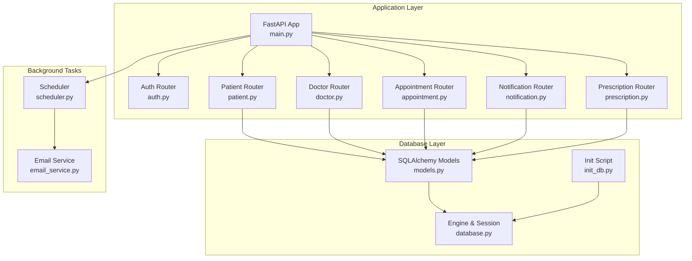
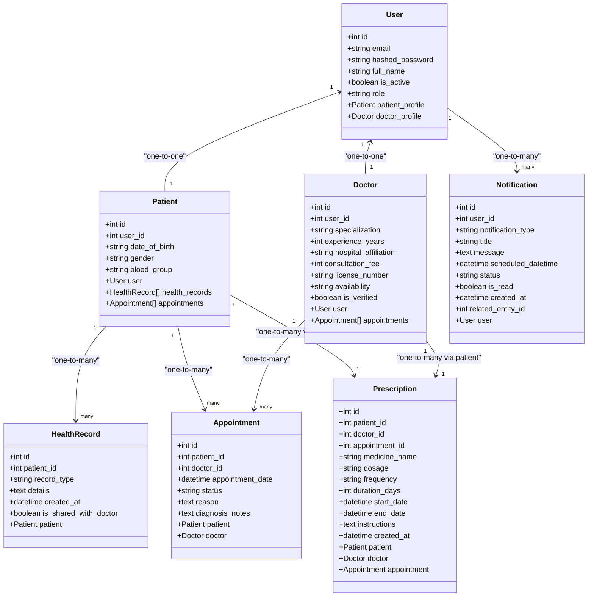
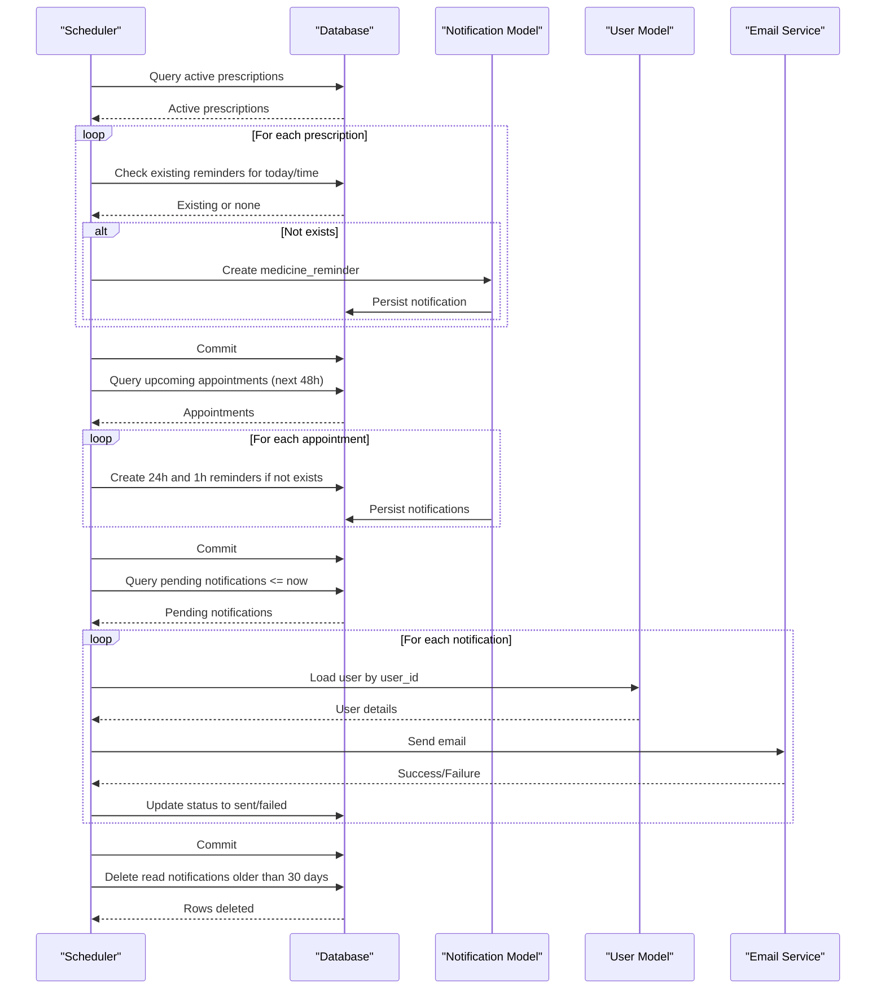
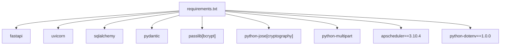

# Database Design

<cite>
**Referenced Files in This Document**
- [models.py](file://backend/models.py)
- [database.py](file://backend/database.py)
- [init_db.py](file://backend/init_db.py)
- [schemas.py](file://backend/schemas.py)
- [auth.py](file://backend/auth.py)
- [main.py](file://backend/main.py)
- [patient.py](file://backend/routers/patient.py)
- [doctor.py](file://backend/routers/doctor.py)
- [appointment.py](file://backend/routers/appointment.py)
- [notification.py](file://backend/routers/notification.py)
- [prescription.py](file://backend/routers/prescription.py)
- [scheduler.py](file://backend/scheduler.py)
- [email_service.py](file://backend/email_service.py)
- [requirements.txt](file://requirements.txt)
</cite>

## Table of Contents
1. [Introduction](#introduction)
2. [Project Structure](#project-structure)
3. [Core Components](#core-components)
4. [Architecture Overview](#architecture-overview)
5. [Detailed Component Analysis](#detailed-component-analysis)
6. [Dependency Analysis](#dependency-analysis)
7. [Performance Considerations](#performance-considerations)
8. [Troubleshooting Guide](#troubleshooting-guide)
9. [Conclusion](#conclusion)
10. [Appendices](#appendices)

## Introduction
This document provides comprehensive database design documentation for the SmartHealthCare system. It details the entity relationships among User, Patient, Doctor, Appointment, HealthRecord, Notification, and Prescription models. It covers field definitions, data types, primary and foreign keys, indexes, constraints, and the one-to-one and one-to-many relationships. It also documents SQLAlchemy ORM configurations, relationship mappings, typical query patterns, data validation rules, business constraints, referential integrity, initialization procedures, migration strategies, data lifecycle management, performance considerations, indexing strategies, and query optimization techniques.

## Project Structure
The database layer is implemented using SQLAlchemy declarative models and FastAPI routers. The application initializes the database tables at startup and exposes REST endpoints for CRUD operations and business workflows.

**Diagram sources**
- [main.py](file://backend/main.py#L34-L44)
- [auth.py](file://backend/auth.py#L39-L55)
- [patient.py](file://backend/routers/patient.py#L1-L107)
- [doctor.py](file://backend/routers/doctor.py#L1-L120)
- [appointment.py](file://backend/routers/appointment.py#L1-L129)
- [notification.py](file://backend/routers/notification.py#L1-L177)
- [prescription.py](file://backend/routers/prescription.py#L1-L145)
- [models.py](file://backend/models.py#L1-L110)
- [database.py](file://backend/database.py#L1-L22)
- [init_db.py](file://backend/init_db.py#L1-L11)
- [scheduler.py](file://backend/scheduler.py#L1-L317)
- [email_service.py](file://backend/email_service.py#L1-L161)

**Section sources**
- [main.py](file://backend/main.py#L34-L44)
- [database.py](file://backend/database.py#L1-L22)
- [init_db.py](file://backend/init_db.py#L1-L11)

## Core Components
This section documents each model, its fields, data types, constraints, indexes, and relationships.

- User
  - Fields: id (Integer, PK, indexed), email (String, unique, indexed), hashed_password (String), full_name (String), is_active (Boolean, default True), role (String, default "patient")
  - Relationships: one-to-one with Patient via patient_profile; one-to-one with Doctor via doctor_profile
  - Indexes: id, email
  - Constraints: email unique

- Patient
  - Fields: id (Integer, PK, indexed), user_id (Integer, FK to users.id), date_of_birth (String, nullable), gender (String, nullable), blood_group (String, nullable)
  - Relationships: belongs to User via user; one-to-many with HealthRecord via health_records; one-to-many with Appointment via appointments
  - Indexes: id, user_id
  - Constraints: FK to users.id

- Doctor
  - Fields: id (Integer, PK, indexed), user_id (Integer, FK to users.id), specialization (String, default "General"), experience_years (Integer, default 0), hospital_affiliation (String, nullable), consultation_fee (Integer, default 0), license_number (String, nullable), availability (String, default "Mon-Fri 9am-5pm"), is_verified (Boolean, default False)
  - Relationships: belongs to User via user; one-to-many with Appointment via appointments
  - Indexes: id, user_id
  - Constraints: FK to users.id

- Appointment
  - Fields: id (Integer, PK, indexed), patient_id (Integer, FK to patients.id), doctor_id (Integer, FK to doctors.id), appointment_date (DateTime), status (String, default "scheduled"), reason (Text, nullable), diagnosis_notes (Text, nullable)
  - Relationships: belongs to Patient via patient; belongs to Doctor via doctor
  - Indexes: id, patient_id, doctor_id
  - Constraints: FKs to patients.id and doctors.id

- HealthRecord
  - Fields: id (Integer, PK, indexed), patient_id (Integer, FK to patients.id), record_type (String), details (Text), created_at (DateTime, default UTC), is_shared_with_doctor (Boolean, default False)
  - Relationships: belongs to Patient via patient
  - Indexes: id, patient_id
  - Constraints: FK to patients.id

- Notification
  - Fields: id (Integer, PK, indexed), user_id (Integer, FK to users.id, indexed), notification_type (String, indexed), title (String(200)), message (Text), scheduled_datetime (DateTime, indexed), status (String(20), default "pending", indexed), is_read (Boolean, default False), created_at (DateTime, default UTC), related_entity_id (Integer, nullable)
  - Relationships: belongs to User via user
  - Indexes: id, user_id, notification_type, scheduled_datetime, status
  - Constraints: FK to users.id

- Prescription
  - Fields: id (Integer, PK, indexed), patient_id (Integer, FK to patients.id), doctor_id (Integer, FK to doctors.id), appointment_id (Integer, FK to appointments.id, nullable), medicine_name (String(200)), dosage (String(100)), frequency (String(100)), duration_days (Integer), start_date (DateTime), end_date (DateTime), instructions (Text, nullable), created_at (DateTime, default UTC)
  - Relationships: belongs to Patient via patient; belongs to Doctor via doctor; belongs to Appointment via appointment
  - Indexes: id, patient_id, doctor_id, appointment_id
  - Constraints: FKs to patients.id, doctors.id, appointments.id (nullable)

**Section sources**
- [models.py](file://backend/models.py#L6-L110)

## Architecture Overview
The database architecture follows a normalized relational design with explicit foreign keys and indexes. The application uses SQLite by default with a configurable engine and declarative base. Initialization creates all tables. Routers orchestrate business logic and enforce authorization and validation rules.

**Diagram sources**
- [models.py](file://backend/models.py#L6-L110)

## Detailed Component Analysis

### Entity Relationships and Constraints
- One-to-one
  - User to Patient: linked by user_id in Patient
  - User to Doctor: linked by user_id in Doctor
- One-to-many
  - Patient to HealthRecord: patient_id in HealthRecord
  - Patient to Appointment: patient_id in Appointment
  - Doctor to Appointment: doctor_id in Appointment
  - User to Notification: user_id in Notification
  - Patient to Prescription: patient_id in Prescription
  - Doctor to Prescription: doctor_id in Prescription
  - Appointment to Prescription: appointment_id in Prescription (nullable)

Referential integrity is enforced via foreign keys. Unique constraints apply to email in User. Indexes are defined on primary keys and frequently queried columns (e.g., user_id, notification_type, scheduled_datetime).

**Section sources**
- [models.py](file://backend/models.py#L6-L110)

### Data Validation and Business Rules
- Authentication and Registration
  - Password hashing and token generation occur during registration and login flows.
  - Registration creates either a Patient or Doctor profile depending on role.
- Authorization in Routers
  - Patient endpoints require role "patient".
  - Doctor endpoints require role "doctor".
  - Some operations restrict updates to the owning entity (e.g., appointment status updates by associated doctor or patient cancellation).
- Data Validation via Pydantic Schemas
  - Strongly typed request/response models enforce field presence and types for all endpoints.

**Section sources**
- [auth.py](file://backend/auth.py#L60-L104)
- [patient.py](file://backend/routers/patient.py#L11-L52)
- [doctor.py](file://backend/routers/doctor.py#L28-L76)
- [appointment.py](file://backend/routers/appointment.py#L94-L128)
- [schemas.py](file://backend/schemas.py#L6-L236)

### Query Patterns and ORM Usage
- Relationship Access
  - Access related entities via relationship attributes (e.g., current_user.patient_profile, doctor.appointments).
- Explicit Joins and Filters
  - Routers commonly filter by foreign keys and composite conditions (e.g., Notification stats queries).
- Aggregation and Counting
  - Stats endpoints compute counts using database aggregation.

Typical patterns:
- Load current profile: current_user.patient_profile or current_user.doctor_profile
- Filter by foreign key: db.query(Model).filter(Model.foreign_id == value)
- Combine filters: db.query(Notification).filter(and_(...))
- Count: db.query(Model).filter(...).count()

**Section sources**
- [patient.py](file://backend/routers/patient.py#L19-L25)
- [doctor.py](file://backend/routers/doctor.py#L88-L109)
- [notification.py](file://backend/routers/notification.py#L47-L67)
- [prescription.py](file://backend/routers/prescription.py#L137-L143)

### Sample Data Examples
Below are representative rows for each table. These illustrate typical values and constraints.

- Users
  - id: 1
  - email: "john.doe@example.com"
  - hashed_password: "$argon2$..."
  - full_name: "John Doe"
  - is_active: true
  - role: "patient"

- Patients
  - id: 1
  - user_id: 1
  - date_of_birth: "1985-01-01"
  - gender: "Male"
  - blood_group: "O+"

- Doctors
  - id: 1
  - user_id: 2
  - specialization: "Cardiology"
  - experience_years: 10
  - hospital_affiliation: "City General Hospital"
  - consultation_fee: 200
  - license_number: "MD12345"
  - availability: "Mon-Fri 9am-5pm"
  - is_verified: true

- Appointments
  - id: 1
  - patient_id: 1
  - doctor_id: 1
  - appointment_date: "2025-04-15T10:00:00Z"
  - status: "scheduled"
  - reason: "Routine checkup"

- HealthRecords
  - id: 1
  - patient_id: 1
  - record_type: "symptom_report"
  - details: "{...}"
  - created_at: "2025-04-01T09:00:00Z"
  - is_shared_with_doctor: true

- Notifications
  - id: 1
  - user_id: 1
  - notification_type: "appointment_reminder"
  - title: "📅 Appointment Tomorrow"
  - message: "You have an appointment with Dr. Jane Smith tomorrow at 10:00 AM"
  - scheduled_datetime: "2025-04-14T10:00:00Z"
  - status: "pending"
  - is_read: false
  - related_entity_id: 1

- Prescriptions
  - id: 1
  - patient_id: 1
  - doctor_id: 1
  - appointment_id: 1
  - medicine_name: "Lisinopril"
  - dosage: "10mg"
  - frequency: "once daily"
  - duration_days: 30
  - start_date: "2025-04-01T00:00:00Z"
  - end_date: "2025-04-30T00:00:00Z"
  - instructions: "Take with food"

**Section sources**
- [models.py](file://backend/models.py#L6-L110)
- [schemas.py](file://backend/schemas.py#L6-L236)

### Background Scheduler and Data Lifecycle
- Medicine Reminders
  - Scans active prescriptions and schedules daily reminders based on frequency parsing.
- Appointment Reminders
  - Creates 24-hour and 1-hour reminders for upcoming appointments within 48 hours.
- Notification Delivery
  - Sends pending notifications whose scheduled time has passed; marks as sent or failed.
- Cleanup
  - Deletes read notifications older than 30 days.

**Diagram sources**
- [scheduler.py](file://backend/scheduler.py#L51-L108)
- [scheduler.py](file://backend/scheduler.py#L110-L182)
- [scheduler.py](file://backend/scheduler.py#L185-L233)
- [scheduler.py](file://backend/scheduler.py#L236-L256)
- [email_service.py](file://backend/email_service.py#L141-L160)

**Section sources**
- [scheduler.py](file://backend/scheduler.py#L21-L48)
- [scheduler.py](file://backend/scheduler.py#L51-L108)
- [scheduler.py](file://backend/scheduler.py#L110-L182)
- [scheduler.py](file://backend/scheduler.py#L185-L233)
- [scheduler.py](file://backend/scheduler.py#L236-L256)
- [email_service.py](file://backend/email_service.py#L141-L160)

## Dependency Analysis
The application depends on FastAPI, SQLAlchemy, Pydantic, and APScheduler. The database engine supports SQLite by default and can be switched to PostgreSQL.

**Diagram sources**
- [requirements.txt](file://requirements.txt#L1-L14)

**Section sources**
- [requirements.txt](file://requirements.txt#L1-L14)

## Performance Considerations
- Indexes
  - Primary keys are indexed by default.
  - Additional indexes exist on frequently filtered columns: user_id, notification_type, scheduled_datetime, status in Notification; patient_id, doctor_id, appointment_id in Prescription; patient_id, doctor_id in Appointment.
- Query Patterns
  - Prefer filtering by indexed foreign keys and composite indexes.
  - Use pagination (skip/limit) for large lists.
  - Aggregate counts via database count operations rather than loading all rows.
- Background Jobs
  - Scheduler runs periodic jobs at controlled intervals to avoid contention.
- Caching
  - Consider caching frequently accessed lookup data (e.g., doctor specializations) at the application level.
- Connection Management
  - Sessions are short-lived per request; ensure proper commit/rollback and avoid long transactions.

[No sources needed since this section provides general guidance]

## Troubleshooting Guide
- Database Initialization
  - Ensure tables are created before running the app. The init script creates all tables based on Base metadata.
- Migration Strategies
  - Current setup uses declarative Base and create_all. For production, adopt Alembic-based migrations to manage schema changes safely.
- Common Issues
  - Integrity errors: verify foreign keys and unique constraints (e.g., email uniqueness).
  - Authorization errors: confirm role-based routing and ownership checks.
  - Scheduler failures: inspect logs for exceptions and ensure environment variables for email are set.

**Section sources**
- [init_db.py](file://backend/init_db.py#L4-L7)
- [scheduler.py](file://backend/scheduler.py#L260-L308)

## Conclusion
The SmartHealthCare database design leverages SQLAlchemy ORM to model a clear, normalized schema with explicit relationships and constraints. The application enforces authorization and validation at the router level and uses a background scheduler to automate reminders and lifecycle management. For production, adopt Alembic migrations, tune indexes, and monitor scheduler logs to maintain reliability and performance.

[No sources needed since this section summarizes without analyzing specific files]

## Appendices

### Database Initialization Procedures
- Initialize tables
  - Run the initialization script to create all tables defined in models.
- Engine Configuration
  - Default SQLite engine is configured; switch to PostgreSQL by updating the URL in the engine configuration.

**Section sources**
- [init_db.py](file://backend/init_db.py#L4-L7)
- [database.py](file://backend/database.py#L5-L11)

### Data Lifecycle Management
- Notification Lifecycle
  - Creation: background jobs create notifications for reminders.
  - Delivery: pending notifications are sent and status updated.
  - Cleanup: read notifications older than 30 days are removed.

**Section sources**
- [scheduler.py](file://backend/scheduler.py#L185-L233)
- [scheduler.py](file://backend/scheduler.py#L236-L256)