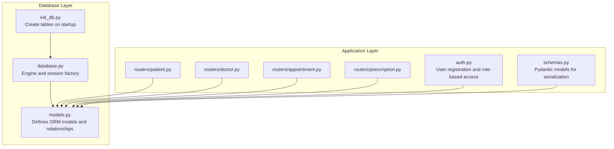
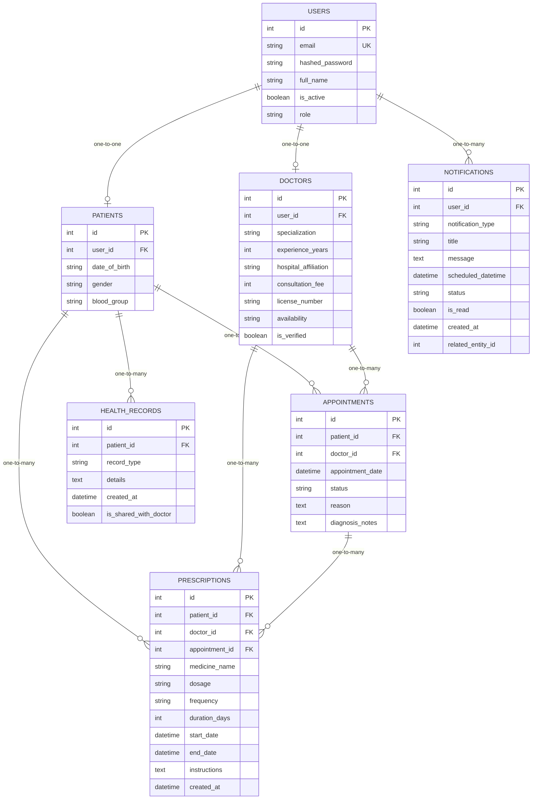
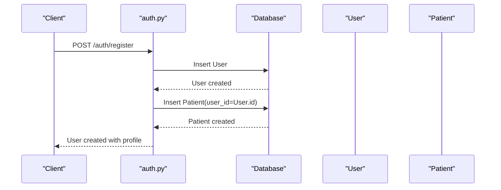
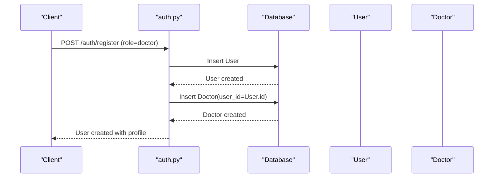
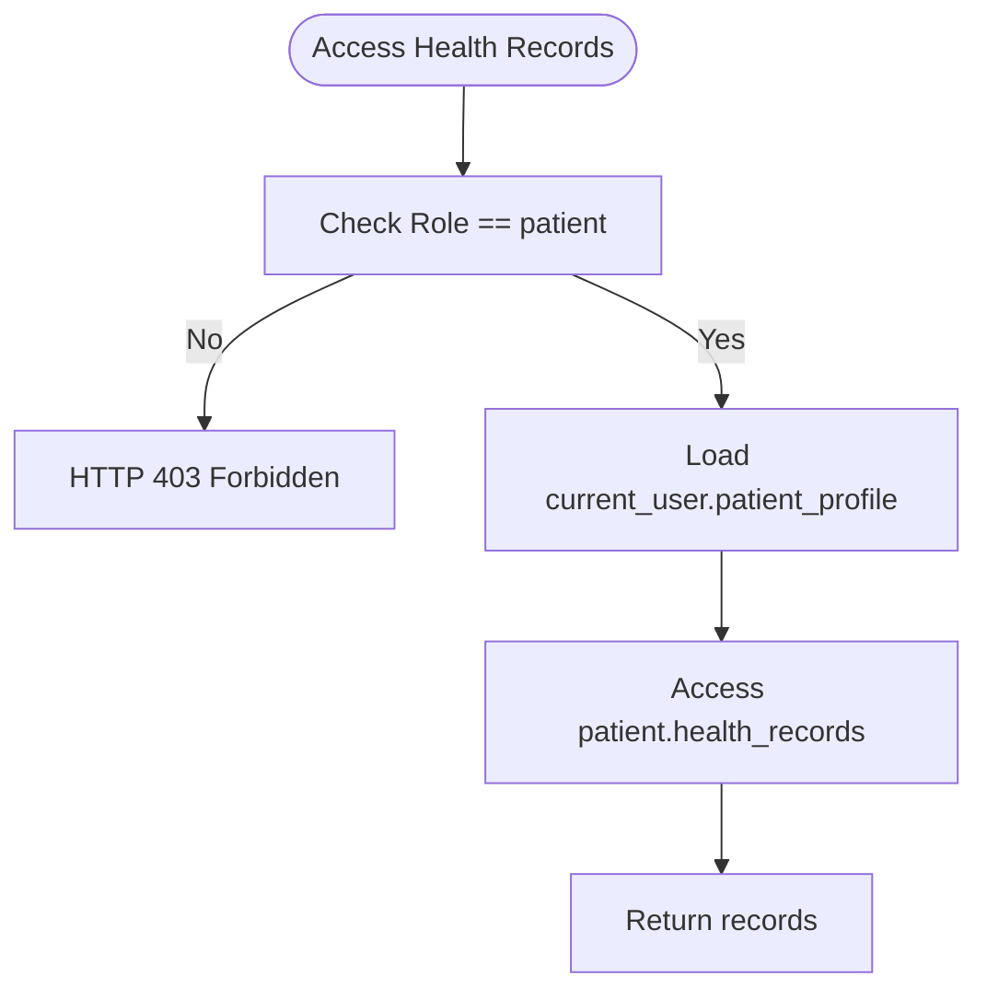
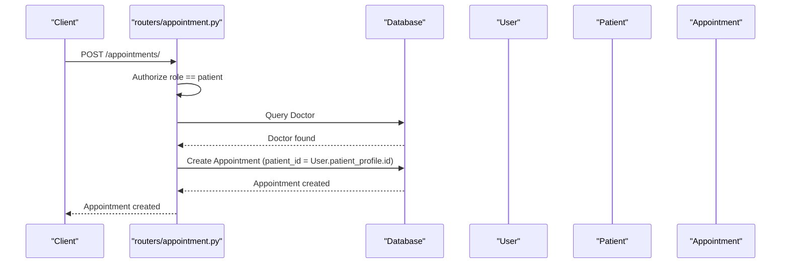
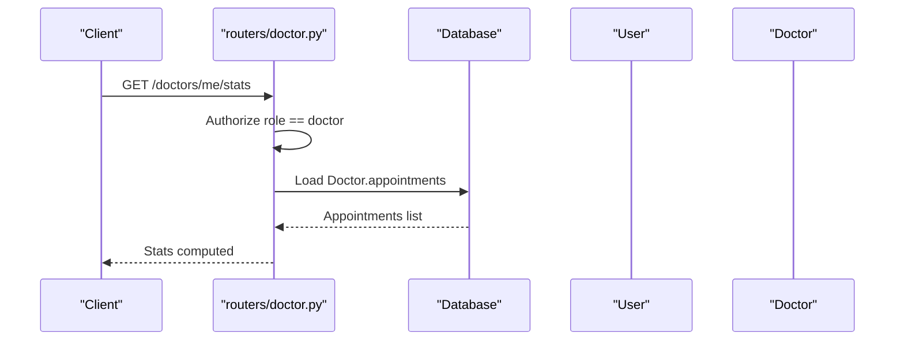
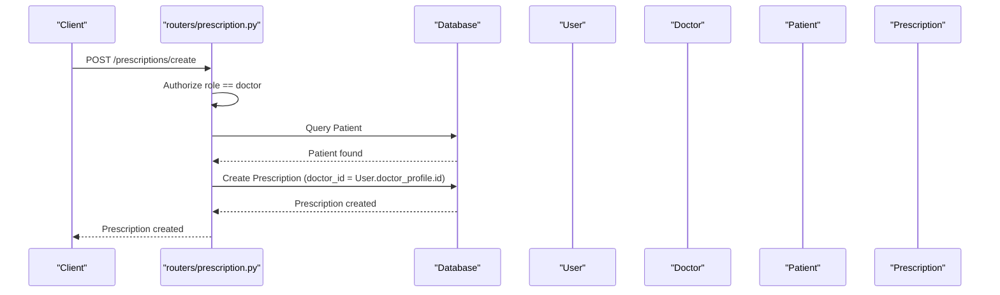
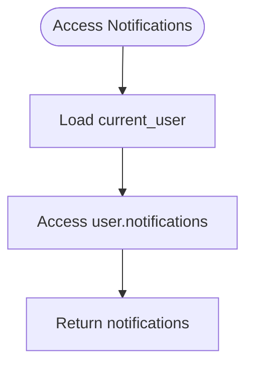
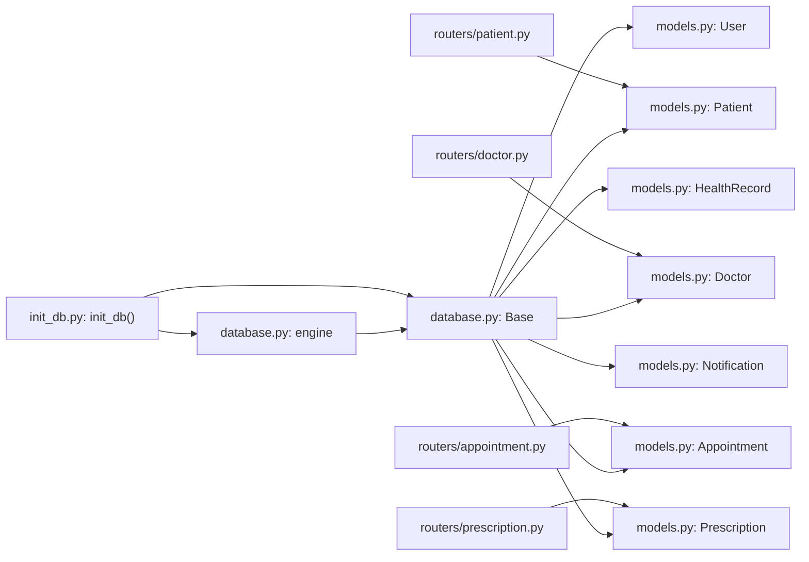

# Entity Relationships

<cite>
**Referenced Files in This Document**
- [models.py](file://backend/models.py)
- [database.py](file://backend/database.py)
- [init_db.py](file://backend/init_db.py)
- [schemas.py](file://backend/schemas.py)
- [auth.py](file://backend/auth.py)
- [patient.py](file://backend/routers/patient.py)
- [doctor.py](file://backend/routers/doctor.py)
- [appointment.py](file://backend/routers/appointment.py)
- [prescription.py](file://backend/routers/prescription.py)
- [check_tables.py](file://check_tables.py)
</cite>

## Table of Contents
1. [Introduction](#introduction)
2. [Project Structure](#project-structure)
3. [Core Components](#core-components)
4. [Architecture Overview](#architecture-overview)
5. [Detailed Component Analysis](#detailed-component-analysis)
6. [Dependency Analysis](#dependency-analysis)
7. [Performance Considerations](#performance-considerations)
8. [Troubleshooting Guide](#troubleshooting-guide)
9. [Conclusion](#conclusion)
10. [Appendices](#appendices)

## Introduction
This document explains the entity relationships in the SmartHealthCare database model. It focuses on:
- One-to-one relationships between User and Patient/Doctor profiles
- One-to-many relationships between patients/doctors and their related entities
- Foreign key constraints and cascade behaviors
- Relationship mappings using SQLAlchemy back_populates
- Efficient querying patterns enabled by these relationships
- Relationship integrity, orphaned record handling, and cascading delete behaviors
- Examples of complex queries leveraging these relationships

## Project Structure
The database models are defined in a single module and used across routers and services. The database engine and session factory are configured centrally, and tables are created at startup.

**Diagram sources**
- [models.py](file://backend/models.py#L1-L110)
- [database.py](file://backend/database.py#L1-L22)
- [init_db.py](file://backend/init_db.py#L1-L11)
- [patient.py](file://backend/routers/patient.py#L1-L107)
- [doctor.py](file://backend/routers/doctor.py#L1-L120)
- [appointment.py](file://backend/routers/appointment.py#L1-L129)
- [prescription.py](file://backend/routers/prescription.py#L1-L145)
- [auth.py](file://backend/auth.py#L1-L120)
- [schemas.py](file://backend/schemas.py#L1-L236)

**Section sources**
- [models.py](file://backend/models.py#L1-L110)
- [database.py](file://backend/database.py#L1-L22)
- [init_db.py](file://backend/init_db.py#L1-L11)

## Core Components
- User: Central identity with role and two optional one-to-one profiles.
- Patient: One-to-one with User; one-to-many with HealthRecord and Appointment.
- Doctor: One-to-one with User; one-to-many with Appointment.
- Appointment: Many-to-one with Patient and Doctor.
- HealthRecord: One-to-many with Patient.
- Notification: One-to-many with User.
- Prescription: Many-to-one with Patient, Doctor, and optional Appointment.

Key relationship mappings:
- User.patient_profile and Patient.user define a one-to-one association.
- User.doctor_profile and Doctor.user define a one-to-one association.
- Patient.health_records and HealthRecord.patient define a one-to-many association.
- Patient.appointments and Appointment.patient define a one-to-many association.
- Doctor.appointments and Appointment.doctor define a one-to-many association.
- Notification.user defines a one-to-many association.
- Prescription.patient, Prescription.doctor, and Prescription.appointment define many-to-one associations.

**Section sources**
- [models.py](file://backend/models.py#L6-L110)

## Architecture Overview
The following ER diagram shows table connections and cardinalities:

**Diagram sources**
- [models.py](file://backend/models.py#L6-L110)

## Detailed Component Analysis

### User-Patient Profile Relationship
- Cardinality: One-to-one between User and Patient.
- Mapping: User.patient_profile and Patient.user use back_populates to mirror the relationship.
- Behavior: On user creation, a Patient profile is created automatically for patients during registration.
- Integrity: The Patient.user_id foreign key references users.id without explicit ON DELETE behavior; default behavior applies.

**Diagram sources**
- [auth.py](file://backend/auth.py#L60-L104)
- [models.py](file://backend/models.py#L6-L31)

**Section sources**
- [auth.py](file://backend/auth.py#L86-L104)
- [models.py](file://backend/models.py#L6-L31)

### User-Doctor Profile Relationship
- Cardinality: One-to-one between User and Doctor.
- Mapping: User.doctor_profile and Doctor.user use back_populates to mirror the relationship.
- Behavior: On user creation, a Doctor profile is created automatically for doctors during registration.
- Integrity: The Doctor.user_id foreign key references users.id without explicit ON DELETE behavior; default behavior applies.

**Diagram sources**
- [auth.py](file://backend/auth.py#L86-L104)
- [models.py](file://backend/models.py#L33-L47)

**Section sources**
- [auth.py](file://backend/auth.py#L86-L104)
- [models.py](file://backend/models.py#L33-L47)

### Patient-HealthRecord Relationship
- Cardinality: One-to-many between Patient and HealthRecord.
- Mapping: Patient.health_records and HealthRecord.patient use back_populates.
- Integrity: HealthRecord.patient_id references patients.id without explicit ON DELETE behavior; default behavior applies.

**Diagram sources**
- [patient.py](file://backend/routers/patient.py#L54-L62)
- [models.py](file://backend/models.py#L20-L31)

**Section sources**
- [patient.py](file://backend/routers/patient.py#L54-L62)
- [models.py](file://backend/models.py#L20-L31)

### Patient-Appointment Relationship
- Cardinality: One-to-many between Patient and Appointment.
- Mapping: Patient.appointments and Appointment.patient use back_populates.
- Integrity: Appointment.patient_id references patients.id without explicit ON DELETE behavior; default behavior applies.

**Diagram sources**
- [appointment.py](file://backend/routers/appointment.py#L12-L37)
- [models.py](file://backend/models.py#L49-L61)

**Section sources**
- [appointment.py](file://backend/routers/appointment.py#L12-L37)
- [models.py](file://backend/models.py#L49-L61)

### Doctor-Appointment Relationship
- Cardinality: One-to-many between Doctor and Appointment.
- Mapping: Doctor.appointments and Appointment.doctor use back_populates.
- Integrity: Appointment.doctor_id references doctors.id without explicit ON DELETE behavior; default behavior applies.

**Diagram sources**
- [doctor.py](file://backend/routers/doctor.py#L78-L109)
- [models.py](file://backend/models.py#L33-L47)

**Section sources**
- [doctor.py](file://backend/routers/doctor.py#L78-L109)
- [models.py](file://backend/models.py#L33-L47)

### Prescription Relationships
- Cardinality:
  - One-to-many between Patient and Prescription (via patient_id).
  - One-to-many between Doctor and Prescription (via doctor_id).
  - One-to-many between Appointment and Prescription (via appointment_id).
- Mapping: Prescription.patient, Prescription.doctor, and Prescription.appointment use relationships without explicit back_populates.
- Integrity: Foreign keys reference patients.id, doctors.id, and appointments.id without explicit ON DELETE behavior; default behavior applies.

**Diagram sources**
- [prescription.py](file://backend/routers/prescription.py#L12-L52)
- [models.py](file://backend/models.py#L91-L109)

**Section sources**
- [prescription.py](file://backend/routers/prescription.py#L12-L52)
- [models.py](file://backend/models.py#L91-L109)

### Notification Relationship
- Cardinality: One-to-many between User and Notification.
- Mapping: Notification.user relationship is defined without back_populates.
- Integrity: Notification.user_id references users.id without explicit ON DELETE behavior; default behavior applies.

**Diagram sources**
- [models.py](file://backend/models.py#L75-L89)
- [schemas.py](file://backend/schemas.py#L181-L205)

**Section sources**
- [models.py](file://backend/models.py#L75-L89)
- [schemas.py](file://backend/schemas.py#L181-L205)

## Dependency Analysis
- Model dependencies: All models inherit from a shared declarative base and are bound to the engine via sessionmaker.
- Router dependencies: Routers depend on models and schemas for CRUD operations and serialization.
- Initialization: Tables are created at startup by invoking metadata.create_all.

**Diagram sources**
- [database.py](file://backend/database.py#L1-L22)
- [init_db.py](file://backend/init_db.py#L1-L11)
- [models.py](file://backend/models.py#L1-L110)
- [patient.py](file://backend/routers/patient.py#L1-L107)
- [doctor.py](file://backend/routers/doctor.py#L1-L120)
- [appointment.py](file://backend/routers/appointment.py#L1-L129)
- [prescription.py](file://backend/routers/prescription.py#L1-L145)

**Section sources**
- [database.py](file://backend/database.py#L1-L22)
- [init_db.py](file://backend/init_db.py#L1-L11)
- [models.py](file://backend/models.py#L1-L110)

## Performance Considerations
- Relationship loading: Using back_populates enables lazy loading of related objects. For bulk operations, consider eager loading with joinedload to reduce N+1 queries.
- Indexes: Several foreign keys and indexed columns exist (e.g., Notification.user_id, Notification.scheduled_datetime). Ensure appropriate indexing on frequently filtered columns.
- Pagination: Routers support skip/limit patterns for scalable listing operations.
- Serialization: Pydantic schemas convert ORM objects efficiently for API responses.

[No sources needed since this section provides general guidance]

## Troubleshooting Guide
- Orphaned records:
  - Patient and Doctor profiles are created upon user registration. If a User is deleted, related Patient/Doctor rows remain unless cascading deletes are configured.
  - Current foreign keys do not specify ON DELETE CASCADE; default behavior applies.
- Cascading deletes:
  - No explicit cascade configurations are present in the models. If cascading deletes are desired (e.g., deleting a Patient also deletes related HealthRecord/Appointment), add cascade options to ForeignKey definitions.
- Relationship integrity:
  - Ensure foreign key constraints are enforced by the underlying database. SQLite does not enforce foreign keys by default; enable foreign key checks in SQLite or switch to PostgreSQL for stricter enforcement.
- Registration flow:
  - Registration creates both User and profile rows atomically. If either fails, rollback occurs and errors are raised.

**Section sources**
- [auth.py](file://backend/auth.py#L86-L104)
- [models.py](file://backend/models.py#L6-L110)

## Conclusion
The SmartHealthCare database model establishes clear, bidirectional relationships:
- One-to-one between User and Patient/Doctor profiles
- One-to-many between patients/doctors and their related entities
These relationships enable efficient querying patterns and maintain data integrity. While the current model lacks explicit cascade behaviors, it provides a solid foundation for future enhancements such as cascading deletes and eager loading strategies.

[No sources needed since this section summarizes without analyzing specific files]

## Appendices

### Appendix A: Table Names Verification
The check script lists existing tables in the database.

**Section sources**
- [check_tables.py](file://check_tables.py#L1-L7)

### Appendix B: Example Queries Leveraging Relationships
- Retrieve a patient’s health records via the relationship:
  - Path: [patient.py](file://backend/routers/patient.py#L54-L62)
- Compute doctor statistics using the relationship:
  - Path: [doctor.py](file://backend/routers/doctor.py#L78-L109)
- Book an appointment using the relationship:
  - Path: [appointment.py](file://backend/routers/appointment.py#L12-L37)
- Create a prescription using relationships:
  - Path: [prescription.py](file://backend/routers/prescription.py#L12-L52)

[No sources needed since this section aggregates previously cited paths]