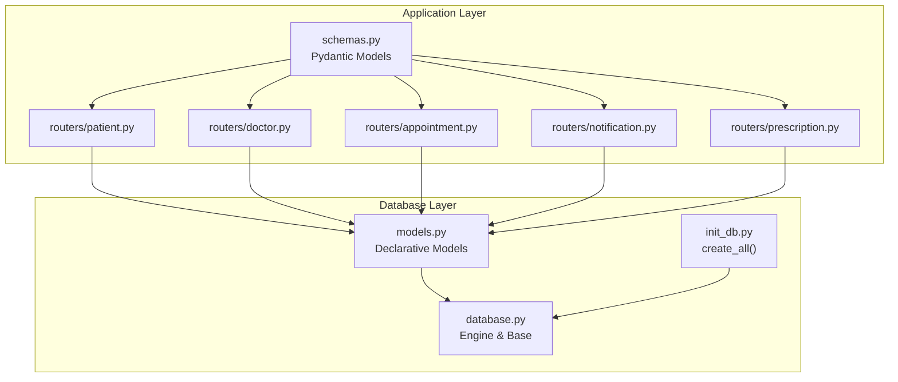
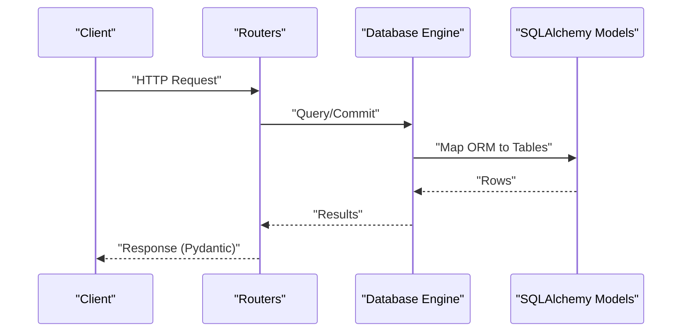
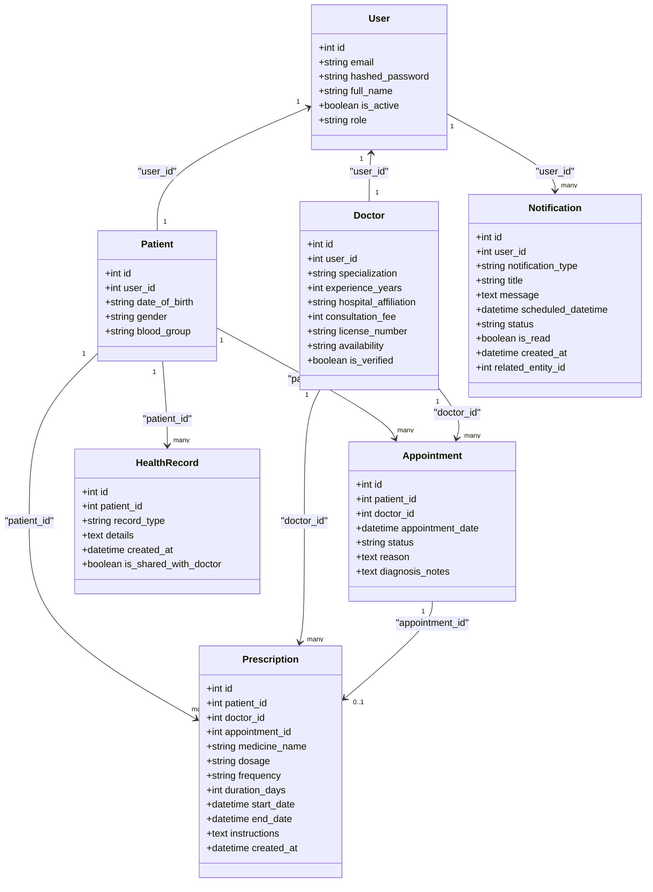

# Schema Reference

<cite>
**Referenced Files in This Document**
- [models.py](file://backend/models.py)
- [database.py](file://backend/database.py)
- [init_db.py](file://backend/init_db.py)
- [schemas.py](file://backend/schemas.py)
- [patient.py](file://backend/routers/patient.py)
- [doctor.py](file://backend/routers/doctor.py)
- [appointment.py](file://backend/routers/appointment.py)
- [notification.py](file://backend/routers/notification.py)
- [prescription.py](file://backend/routers/prescription.py)
- [check_tables.py](file://check_tables.py)
- [requirements.txt](file://requirements.txt)
</cite>

## Table of Contents
1. [Introduction](#introduction)
2. [Project Structure](#project-structure)
3. [Core Components](#core-components)
4. [Architecture Overview](#architecture-overview)
5. [Detailed Component Analysis](#detailed-component-analysis)
6. [Dependency Analysis](#dependency-analysis)
7. [Performance Considerations](#performance-considerations)
8. [Troubleshooting Guide](#troubleshooting-guide)
9. [Conclusion](#conclusion)
10. [Appendices](#appendices)

## Introduction
This document provides a comprehensive schema reference for the SmartHealthCare database. It describes each table’s structure, columns, data types, constraints, primary and foreign keys, indexes, relationships, and referential integrity. It also includes guidance on SQL creation statements, sample insert patterns, Python SQLAlchemy model mappings, and performance considerations derived from the application’s usage.

## Project Structure
The database schema is defined via SQLAlchemy declarative models and is initialized using a SQLite engine by default. The routers demonstrate typical queries and relationships used by the application.

**Diagram sources**
- [models.py](file://backend/models.py#L1-L110)
- [database.py](file://backend/database.py#L1-L22)
- [init_db.py](file://backend/init_db.py#L1-L11)
- [schemas.py](file://backend/schemas.py#L1-L236)
- [patient.py](file://backend/routers/patient.py#L1-L107)
- [doctor.py](file://backend/routers/doctor.py#L1-L120)
- [appointment.py](file://backend/routers/appointment.py#L1-L129)
- [notification.py](file://backend/routers/notification.py#L1-L177)
- [prescription.py](file://backend/routers/prescription.py#L1-L145)

**Section sources**
- [models.py](file://backend/models.py#L1-L110)
- [database.py](file://backend/database.py#L1-L22)
- [init_db.py](file://backend/init_db.py#L1-L11)
- [schemas.py](file://backend/schemas.py#L1-L236)
- [requirements.txt](file://requirements.txt#L1-L14)

## Core Components
- Database engine and declarative base are configured in the database module.
- Models define tables and relationships; indexes are declared per-column where applicable.
- Routers show how models are queried and used in practice.

Key runtime behaviors:
- SQLite is used by default; PostgreSQL URL is available as commented configuration.
- Initialization creates all tables defined in the models.

**Section sources**
- [database.py](file://backend/database.py#L1-L22)
- [init_db.py](file://backend/init_db.py#L1-L11)
- [models.py](file://backend/models.py#L1-L110)

## Architecture Overview
The application uses SQLAlchemy ORM models mapped to SQLite tables. Routers orchestrate CRUD operations and enforce role-based access, while Pydantic schemas define request/response shapes.

**Diagram sources**
- [database.py](file://backend/database.py#L1-L22)
- [models.py](file://backend/models.py#L1-L110)
- [schemas.py](file://backend/schemas.py#L1-L236)
- [patient.py](file://backend/routers/patient.py#L1-L107)
- [doctor.py](file://backend/routers/doctor.py#L1-L120)
- [appointment.py](file://backend/routers/appointment.py#L1-L129)
- [notification.py](file://backend/routers/notification.py#L1-L177)
- [prescription.py](file://backend/routers/prescription.py#L1-L145)

## Detailed Component Analysis

### User Table
- Name: users
- Purpose: Stores authentication and identity for all roles (patient, doctor, admin).
- Columns:
  - id: integer, primary key, indexed
  - email: string, unique, indexed
  - hashed_password: string
  - full_name: string
  - is_active: boolean, default true
  - role: string, default "patient"
- Constraints:
  - Unique constraint on email
  - Default values applied for is_active, role
- Indexes:
  - id (primary key index)
  - email (unique index)
- Relationships:
  - One-to-one with Patient via user_id
  - One-to-one with Doctor via user_id
- Validation and defaults:
  - Role constrained to predefined values; defaults applied at insert
- Referential integrity:
  - Patient.user_id and Doctor.user_id reference users.id

Recommended indexes:
- email (already unique index)
- role (if filtering by role is frequent)

Sample INSERT pattern:
- Insert a patient user with default role and hashed password.

Mapping to SQLAlchemy:
- Column types map to Python types as per SQLAlchemy type semantics.

**Section sources**
- [models.py](file://backend/models.py#L6-L18)
- [schemas.py](file://backend/schemas.py#L6-L20)
- [patient.py](file://backend/routers/patient.py#L11-L25)
- [doctor.py](file://backend/routers/doctor.py#L28-L42)

### Patient Table
- Name: patients
- Purpose: Stores patient-specific demographic and profile data linked to User.
- Columns:
  - id: integer, primary key, indexed
  - user_id: integer, foreign key to users.id
  - date_of_birth: string, nullable
  - gender: string, nullable
  - blood_group: string, nullable
- Constraints:
  - Foreign key to users.id
- Indexes:
  - id (primary key index)
  - user_id (foreign key index)
- Relationships:
  - Many-to-one to User
  - One-to-many to HealthRecord
  - One-to-many to Appointment
- Validation and defaults:
  - No explicit defaults; nullable fields allow missing data
- Referential integrity:
  - user_id references users.id

Recommended indexes:
- user_id (already present)
- Consider composite index if querying by user_id + date_of_birth/gender/blood_group frequently

Sample INSERT pattern:
- Insert a patient with user_id set to an existing user.

Mapping to SQLAlchemy:
- Column types map to Python types as per SQLAlchemy type semantics.

**Section sources**
- [models.py](file://backend/models.py#L20-L31)
- [schemas.py](file://backend/schemas.py#L30-L46)
- [patient.py](file://backend/routers/patient.py#L88-L106)

### Doctor Table
- Name: doctors
- Purpose: Stores doctor profile and professional attributes linked to User.
- Columns:
  - id: integer, primary key, indexed
  - user_id: integer, foreign key to users.id
  - specialization: string, default "General"
  - experience_years: integer, default 0
  - hospital_affiliation: string, nullable
  - consultation_fee: integer, default 0
  - license_number: string, nullable
  - availability: string, default "Mon-Fri 9am-5pm"
  - is_verified: boolean, default false
- Constraints:
  - Foreign key to users.id
  - Defaults applied for several fields
- Indexes:
  - id (primary key index)
  - user_id (foreign key index)
- Relationships:
  - Many-to-one to User
  - One-to-many to Appointment
- Validation and defaults:
  - Defaults applied at insert; availability has a default string
- Referential integrity:
  - user_id references users.id

Recommended indexes:
- user_id (already present)
- Consider indexing specialization if filtered commonly

Sample INSERT pattern:
- Insert a doctor with user_id and defaults applied.

Mapping to SQLAlchemy:
- Column types map to Python types as per SQLAlchemy type semantics.

**Section sources**
- [models.py](file://backend/models.py#L33-L47)
- [schemas.py](file://backend/schemas.py#L48-L66)
- [doctor.py](file://backend/routers/doctor.py#L44-L76)

### Appointment Table
- Name: appointments
- Purpose: Schedules visits between patients and doctors.
- Columns:
  - id: integer, primary key, indexed
  - patient_id: integer, foreign key to patients.id
  - doctor_id: integer, foreign key to doctors.id
  - appointment_date: datetime
  - status: string, default "scheduled"
  - reason: text, nullable
  - diagnosis_notes: text, nullable
- Constraints:
  - Foreign keys to patients.id and doctors.id
  - Default status value
- Indexes:
  - id (primary key index)
  - patient_id (foreign key index)
  - doctor_id (foreign key index)
- Relationships:
  - Many-to-one to Patient
  - Many-to-one to Doctor
- Validation and defaults:
  - Default status applied at insert
- Referential integrity:
  - patient_id references patients.id
  - doctor_id references doctors.id

Recommended indexes:
- patient_id and doctor_id (already present)
- Consider compound index on (status, appointment_date) for scheduling queries

Sample INSERT pattern:
- Insert an appointment linking a patient and doctor with a date and default status.

Mapping to SQLAlchemy:
- Column types map to Python types as per SQLAlchemy type semantics.

**Section sources**
- [models.py](file://backend/models.py#L49-L61)
- [schemas.py](file://backend/schemas.py#L68-L92)
- [appointment.py](file://backend/routers/appointment.py#L12-L37)

### HealthRecord Table
- Name: health_records
- Purpose: Stores patient health-related records (symptom reports, lab results, prescriptions).
- Columns:
  - id: integer, primary key, indexed
  - patient_id: integer, foreign key to patients.id
  - record_type: string
  - details: text
  - created_at: datetime, default utcnow
  - is_shared_with_doctor: boolean, default false
- Constraints:
  - Foreign key to patients.id
  - Default created_at and is_shared_with_doctor
- Indexes:
  - id (primary key index)
  - patient_id (foreign key index)
- Relationships:
  - Many-to-one to Patient
- Validation and defaults:
  - Default values applied at insert
- Referential integrity:
  - patient_id references patients.id

Recommended indexes:
- patient_id (already present)
- Consider index on record_type for filtering by type

Sample INSERT pattern:
- Insert a health record for a patient with type, details, and default sharing flag.

Mapping to SQLAlchemy:
- Column types map to Python types as per SQLAlchemy type semantics.

**Section sources**
- [models.py](file://backend/models.py#L63-L73)
- [schemas.py](file://backend/schemas.py#L164-L178)
- [patient.py](file://backend/routers/patient.py#L88-L106)

### Notification Table
- Name: notifications
- Purpose: Stores user-facing notifications and reminders.
- Columns:
  - id: integer, primary key, indexed
  - user_id: integer, foreign key to users.id, indexed
  - notification_type: string, indexed
  - title: string (max 200)
  - message: text
  - scheduled_datetime: datetime, indexed
  - status: string (max 20), default "pending", indexed
  - is_read: boolean, default false
  - created_at: datetime, default utcnow
  - related_entity_id: integer, nullable
- Constraints:
  - Foreign key to users.id
  - Default status and is_read
  - Length constraint on title
- Indexes:
  - id (primary key index)
  - user_id (foreign key index)
  - notification_type (indexed)
  - scheduled_datetime (indexed)
  - status (indexed)
- Relationships:
  - Many-to-one to User
- Validation and defaults:
  - Default values applied at insert
- Referential integrity:
  - user_id references users.id

Recommended indexes:
- user_id (already present)
- notification_type (already present)
- scheduled_datetime (already present)
- status (already present)

Sample INSERT pattern:
- Insert a notification for a user with type, title, message, and scheduled time.

Mapping to SQLAlchemy:
- Column types map to Python types as per SQLAlchemy type semantics.

**Section sources**
- [models.py](file://backend/models.py#L75-L89)
- [schemas.py](file://backend/schemas.py#L181-L205)
- [notification.py](file://backend/routers/notification.py#L147-L176)

### Prescription Table
- Name: prescriptions
- Purpose: Stores prescribed medications and treatment details.
- Columns:
  - id: integer, primary key, indexed
  - patient_id: integer, foreign key to patients.id
  - doctor_id: integer, foreign key to doctors.id
  - appointment_id: integer, foreign key to appointments.id, nullable
  - medicine_name: string (max 200)
  - dosage: string (max 100)
  - frequency: string (max 100)
  - duration_days: integer
  - start_date: datetime
  - end_date: datetime
  - instructions: text, nullable
  - created_at: datetime, default utcnow
- Constraints:
  - Foreign keys to patients.id, doctors.id, and appointments.id (nullable)
  - Length constraints on medicine_name, dosage, frequency
  - Default created_at
- Indexes:
  - id (primary key index)
  - patient_id (foreign key index)
  - doctor_id (foreign key index)
  - appointment_id (foreign key index)
- Relationships:
  - Many-to-one to Patient
  - Many-to-one to Doctor
  - Many-to-one to Appointment
- Validation and defaults:
  - Default created_at applied at insert
- Referential integrity:
  - patient_id references patients.id
  - doctor_id references doctors.id
  - appointment_id references appointments.id

Recommended indexes:
- patient_id (already present)
- doctor_id (already present)
- appointment_id (already present)
- Consider compound index on (patient_id, created_at) for recent prescriptions

Sample INSERT pattern:
- Insert a prescription linking a patient and doctor, calculating end_date from start_date and duration_days.

Mapping to SQLAlchemy:
- Column types map to Python types as per SQLAlchemy type semantics.

**Section sources**
- [models.py](file://backend/models.py#L91-L109)
- [schemas.py](file://backend/schemas.py#L213-L235)
- [prescription.py](file://backend/routers/prescription.py#L12-L52)

## Dependency Analysis
The following diagram shows the relationships among models and how routers depend on them.

**Diagram sources**
- [models.py](file://backend/models.py#L6-L109)

**Section sources**
- [models.py](file://backend/models.py#L6-L109)
- [schemas.py](file://backend/schemas.py#L1-L236)
- [patient.py](file://backend/routers/patient.py#L1-L107)
- [doctor.py](file://backend/routers/doctor.py#L1-L120)
- [appointment.py](file://backend/routers/appointment.py#L1-L129)
- [notification.py](file://backend/routers/notification.py#L1-L177)
- [prescription.py](file://backend/routers/prescription.py#L1-L145)

## Performance Considerations
- Indexes already present:
  - Primary key indexes on all tables
  - Foreign key indexes on patient_id, doctor_id, user_id, appointment_id
  - Additional indexes on notification_type, scheduled_datetime, status, and email
- Recommended additional indexes:
  - Appointments: composite index on (status, appointment_date) to optimize scheduling and status filtering
  - Notifications: consider index on (user_id, scheduled_datetime, is_read) for paginated retrieval
  - Prescriptions: composite index on (patient_id, created_at) to fetch recent prescriptions efficiently
  - Patients: composite index on (user_id, date_of_birth/gender/blood_group) if frequently filtered
- Query optimization strategies:
  - Use filtered queries with appropriate WHERE clauses aligned to existing indexes
  - Prefer exact matches on indexed columns (e.g., user_id, email)
  - Avoid SELECT *; choose only needed columns
  - Use LIMIT/OFFSET for pagination (as seen in routers)
- Storage and engine:
  - SQLite is used by default; consider PostgreSQL for production workloads

[No sources needed since this section provides general guidance]

## Troubleshooting Guide
- Table existence verification:
  - Use the provided script to list tables and confirm schema initialization.
- Initialization:
  - Ensure create_all() is invoked during startup or via the initialization script.
- Role-based access:
  - Routers enforce role checks; unauthorized requests return HTTP exceptions.
- Foreign key violations:
  - Ensure referenced IDs exist before inserts (e.g., user_id, patient_id, doctor_id).
- Datetime handling:
  - created_at defaults to UTC; schedule-based queries rely on scheduled_datetime comparisons.

**Section sources**
- [check_tables.py](file://check_tables.py#L1-L7)
- [init_db.py](file://backend/init_db.py#L1-L11)
- [patient.py](file://backend/routers/patient.py#L16-L21)
- [doctor.py](file://backend/routers/doctor.py#L33-L38)
- [appointment.py](file://backend/routers/appointment.py#L21-L24)
- [notification.py](file://backend/routers/notification.py#L155-L161)
- [prescription.py](file://backend/routers/prescription.py#L28-L30)

## Conclusion
The SmartHealthCare schema centers on five core tables (users, patients, doctors, appointments, health_records, notifications, prescriptions) with clear foreign key relationships and default constraints. The routers demonstrate practical usage patterns and access controls. Proper indexing and query strategies will support efficient operation under expected load.

[No sources needed since this section summarizes without analyzing specific files]

## Appendices

### SQL CREATE TABLE Statements
Note: These statements reflect the SQLAlchemy model definitions and indexes. Adjust data types to match your target database dialect as needed.

- Users
  - Columns: id (integer, primary key), email (string, unique), hashed_password (string), full_name (string), is_active (boolean, default true), role (string, default "patient")
  - Indexes: id (PK), email (unique)
  - Referential integrity: none (no FKs)

- Patients
  - Columns: id (integer, primary key), user_id (integer, foreign key to users.id), date_of_birth (string, nullable), gender (string, nullable), blood_group (string, nullable)
  - Indexes: id (PK), user_id (FK)
  - Referential integrity: user_id -> users.id

- Doctors
  - Columns: id (integer, primary key), user_id (integer, foreign key to users.id), specialization (string, default "General"), experience_years (integer, default 0), hospital_affiliation (string, nullable), consultation_fee (integer, default 0), license_number (string, nullable), availability (string, default "Mon-Fri 9am-5pm"), is_verified (boolean, default false)
  - Indexes: id (PK), user_id (FK)
  - Referential integrity: user_id -> users.id

- Appointments
  - Columns: id (integer, primary key), patient_id (integer, foreign key to patients.id), doctor_id (integer, foreign key to doctors.id), appointment_date (datetime), status (string, default "scheduled"), reason (text, nullable), diagnosis_notes (text, nullable)
  - Indexes: id (PK), patient_id (FK), doctor_id (FK)
  - Referential integrity: patient_id -> patients.id, doctor_id -> doctors.id

- HealthRecords
  - Columns: id (integer, primary key), patient_id (integer, foreign key to patients.id), record_type (string), details (text), created_at (datetime, default utcnow), is_shared_with_doctor (boolean, default false)
  - Indexes: id (PK), patient_id (FK)
  - Referential integrity: patient_id -> patients.id

- Notifications
  - Columns: id (integer, primary key), user_id (integer, foreign key to users.id), notification_type (string), title (string, max 200), message (text), scheduled_datetime (datetime), status (string, max 20, default "pending"), is_read (boolean, default false), created_at (datetime, default utcnow), related_entity_id (integer, nullable)
  - Indexes: id (PK), user_id (FK), notification_type (indexed), scheduled_datetime (indexed), status (indexed)
  - Referential integrity: user_id -> users.id

- Prescriptions
  - Columns: id (integer, primary key), patient_id (integer, foreign key to patients.id), doctor_id (integer, foreign key to doctors.id), appointment_id (integer, foreign key to appointments.id, nullable), medicine_name (string, max 200), dosage (string, max 100), frequency (string, max 100), duration_days (integer), start_date (datetime), end_date (datetime), instructions (text, nullable), created_at (datetime, default utcnow)
  - Indexes: id (PK), patient_id (FK), doctor_id (FK), appointment_id (FK)
  - Referential integrity: patient_id -> patients.id, doctor_id -> doctors.id, appointment_id -> appointments.id

### Sample INSERT Examples
- Users
  - Insert a patient user with default role and hashed password.

- Patients
  - Insert a patient with user_id set to an existing user.

- Doctors
  - Insert a doctor with user_id and defaults applied.

- Appointments
  - Insert an appointment linking a patient and doctor with a date and default status.

- HealthRecords
  - Insert a health record for a patient with type, details, and default sharing flag.

- Notifications
  - Insert a notification for a user with type, title, message, and scheduled time.

- Prescriptions
  - Insert a prescription linking a patient and doctor, calculating end_date from start_date and duration_days.

[No sources needed since this section provides general guidance]

### Data Type Mappings Between Python SQLAlchemy and Database Columns
- Integer maps to integer
- String maps to string/varchar; length constraints enforced by model definitions
- Text maps to text/blob-like
- Boolean maps to boolean/integer depending on backend
- DateTime maps to datetime/timestamp
- Unique and default constraints are applied at the ORM level and reflected in the database schema

**Section sources**
- [models.py](file://backend/models.py#L1-L110)
- [requirements.txt](file://requirements.txt#L1-L14)