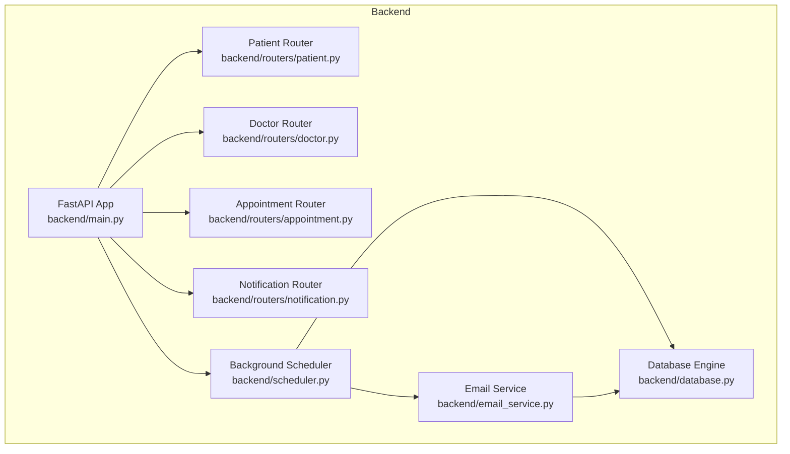
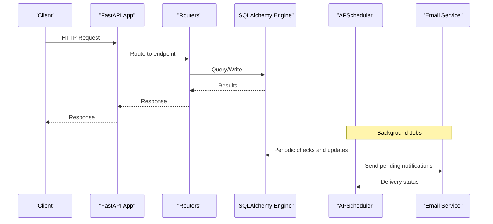
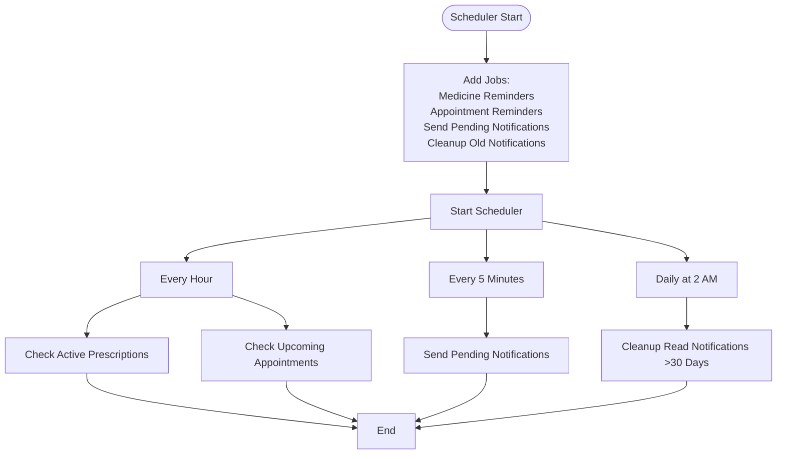
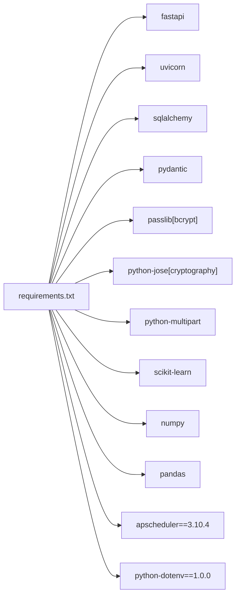

# Deployment & Operations

<cite>
**Referenced Files in This Document**
- [backend/main.py](file://backend/main.py)
- [backend/database.py](file://backend/database.py)
- [backend/scheduler.py](file://backend/scheduler.py)
- [backend/email_service.py](file://backend/email_service.py)
- [.env.example](file://.env.example)
- [requirements.txt](file://requirements.txt)
- [backend/init_db.py](file://backend/init_db.py)
- [backend/routers/patient.py](file://backend/routers/patient.py)
- [backend/routers/doctor.py](file://backend/routers/doctor.py)
- [backend/routers/appointment.py](file://backend/routers/appointment.py)
- [backend/routers/notification.py](file://backend/routers/notification.py)
</cite>

## Table of Contents
1. [Introduction](#introduction)
2. [Project Structure](#project-structure)
3. [Core Components](#core-components)
4. [Architecture Overview](#architecture-overview)
5. [Detailed Component Analysis](#detailed-component-analysis)
6. [Dependency Analysis](#dependency-analysis)
7. [Performance Considerations](#performance-considerations)
8. [Troubleshooting Guide](#troubleshooting-guide)
9. [Conclusion](#conclusion)
10. [Appendices](#appendices)

## Introduction
This document provides comprehensive deployment and operations guidance for SmartHealthCare. It covers production configuration, environment variable management, database initialization and migration, logging and monitoring, deployment strategies across development, staging, and production, containerization options, security hardening, backup and disaster recovery, maintenance and updates, scaling and load balancing, operational runbooks, incident response, compliance and audit considerations, and performance metrics collection.

## Project Structure
SmartHealthCare consists of:
- Backend API built with FastAPI and SQLAlchemy, exposing REST endpoints for patients, doctors, appointments, AI, notifications, and prescriptions.
- A background job scheduler powered by APScheduler to manage reminders and notifications.
- An email service for sending HTML email notifications via SMTP.
- A SQLite database by default, with a commented production-ready PostgreSQL URL pattern.
- Frontend built with Vite and React (outside the scope of this document’s operational guidance).

**Diagram sources**
- [backend/main.py](file://backend/main.py#L1-L61)
- [backend/database.py](file://backend/database.py#L1-L22)
- [backend/scheduler.py](file://backend/scheduler.py#L1-L317)
- [backend/email_service.py](file://backend/email_service.py#L1-L161)
- [backend/routers/patient.py](file://backend/routers/patient.py#L1-L107)
- [backend/routers/doctor.py](file://backend/routers/doctor.py#L1-L120)
- [backend/routers/appointment.py](file://backend/routers/appointment.py#L1-L129)
- [backend/routers/notification.py](file://backend/routers/notification.py#L1-L177)

**Section sources**
- [backend/main.py](file://backend/main.py#L1-L61)
- [backend/database.py](file://backend/database.py#L1-L22)
- [backend/scheduler.py](file://backend/scheduler.py#L1-L317)
- [backend/email_service.py](file://backend/email_service.py#L1-L161)
- [backend/routers/patient.py](file://backend/routers/patient.py#L1-L107)
- [backend/routers/doctor.py](file://backend/routers/doctor.py#L1-L120)
- [backend/routers/appointment.py](file://backend/routers/appointment.py#L1-L129)
- [backend/routers/notification.py](file://backend/routers/notification.py#L1-L177)

## Core Components
- Application entrypoint and middleware: CORS configuration, logging, router registration, and lifecycle hooks for scheduler startup/shutdown.
- Database layer: SQLAlchemy engine and session factory; default SQLite with a production-ready PostgreSQL URL pattern.
- Background scheduler: APScheduler jobs for medicine reminders, appointment reminders, sending pending notifications, and cleanup of old notifications.
- Email service: SMTP-based HTML email notifications with environment-driven configuration.
- Routers: Patient, doctor, appointment, notification, AI, and prescription endpoints.

Key operational responsibilities:
- Production readiness requires switching to PostgreSQL, configuring environment variables, enabling HTTPS/TLS, and setting up process supervision and health checks.
- Scheduler jobs must be monitored and retried appropriately; email delivery should be monitored and retried independently.

**Section sources**
- [backend/main.py](file://backend/main.py#L1-L61)
- [backend/database.py](file://backend/database.py#L1-L22)
- [backend/scheduler.py](file://backend/scheduler.py#L1-L317)
- [backend/email_service.py](file://backend/email_service.py#L1-L161)
- [backend/routers/patient.py](file://backend/routers/patient.py#L1-L107)
- [backend/routers/doctor.py](file://backend/routers/doctor.py#L1-L120)
- [backend/routers/appointment.py](file://backend/routers/appointment.py#L1-L129)
- [backend/routers/notification.py](file://backend/routers/notification.py#L1-L177)

## Architecture Overview
The backend runs as a single-process FastAPI application with an embedded APScheduler. The scheduler interacts with the database and email service to create and dispatch notifications. CORS is configured for local development frontends.

**Diagram sources**
- [backend/main.py](file://backend/main.py#L1-L61)
- [backend/scheduler.py](file://backend/scheduler.py#L259-L317)
- [backend/email_service.py](file://backend/email_service.py#L98-L161)
- [backend/database.py](file://backend/database.py#L1-L22)

## Detailed Component Analysis

### Database Layer
- Default SQLite connection string is defined; production should use PostgreSQL with environment-driven credentials.
- Initialization script creates tables based on declarative models.
- Session management uses SQLAlchemy scoped sessions.

Operational implications:
- Use a managed PostgreSQL service in production with read replicas for scale.
- Configure connection pooling and timeouts.
- Back up the database regularly and test restore procedures.

**Section sources**
- [backend/database.py](file://backend/database.py#L1-L22)
- [backend/init_db.py](file://backend/init_db.py#L1-L11)

### Background Scheduler
- Jobs:
  - Medicine reminders: hourly scanning for active prescriptions and creation of reminders.
  - Appointment reminders: hourly scanning for upcoming appointments and creation of 24h and 1h reminders.
  - Send pending notifications: every 5 minutes to deliver due notifications.
  - Cleanup old notifications: daily at 2 AM to remove read notifications older than 30 days.
- Startup triggers initial runs for immediate coverage.

Operational implications:
- Monitor scheduler logs for errors and job durations.
- Ensure timezone consistency and clock synchronization.
- Consider distributed scheduling or external job queues for high availability.

**Diagram sources**
- [backend/scheduler.py](file://backend/scheduler.py#L259-L317)

**Section sources**
- [backend/scheduler.py](file://backend/scheduler.py#L1-L317)

### Email Service
- SMTP configuration loaded from environment variables.
- HTML email templates with branding and links.
- Graceful degradation when email is not configured.

Operational implications:
- Use a dedicated SMTP provider with TLS and strong credentials.
- Monitor delivery failures and implement retry/backoff.
- Consider asynchronous email delivery for throughput.

**Section sources**
- [backend/email_service.py](file://backend/email_service.py#L1-L161)
- [.env.example](file://.env.example#L1-L13)

### API Routers
- Patient: profile retrieval/update, health records access, and record creation.
- Doctor: listing, profile retrieval/update, stats, and individual lookup.
- Appointment: booking, listing with enriched details, and status updates.
- Notification: listing, stats, upcoming reminders, marking read, bulk mark, deletion, and creation.

Operational implications:
- Enforce rate limiting and input validation at the gateway/proxy.
- Use pagination and filtering for large datasets.
- Implement audit logging for sensitive operations.

**Section sources**
- [backend/routers/patient.py](file://backend/routers/patient.py#L1-L107)
- [backend/routers/doctor.py](file://backend/routers/doctor.py#L1-L120)
- [backend/routers/appointment.py](file://backend/routers/appointment.py#L1-L129)
- [backend/routers/notification.py](file://backend/routers/notification.py#L1-L177)

## Dependency Analysis
Runtime dependencies include FastAPI, Uvicorn, SQLAlchemy, Pydantic, bcrypt hashing, cryptography, multipart parsing, scikit-learn, numpy, pandas, APScheduler, and python-dotenv.

**Diagram sources**
- [requirements.txt](file://requirements.txt#L1-L14)

**Section sources**
- [requirements.txt](file://requirements.txt#L1-L14)

## Performance Considerations
- Database:
  - Use connection pooling and tune pool size per workload.
  - Add indexes on frequently filtered columns (e.g., user_id, scheduled_datetime, is_read).
  - Consider partitioning large tables by date/time.
- Scheduler:
  - Monitor job durations and adjust intervals.
  - Use async I/O for email delivery to avoid blocking.
- API:
  - Enable gzip/brotli compression at the proxy.
  - Implement caching for read-heavy endpoints.
  - Use pagination and efficient queries.
- Observability:
  - Collect metrics for response latency, error rates, and queue depths.
  - Use structured logging with correlation IDs.

[No sources needed since this section provides general guidance]

## Troubleshooting Guide
Common operational issues and resolutions:
- Database connectivity:
  - Verify connection string and credentials; ensure the database is reachable and accepting connections.
  - Confirm migrations are applied and tables exist.
- Scheduler not running:
  - Check application logs for scheduler startup errors.
  - Validate timezone and system clock synchronization.
- Email delivery failures:
  - Review SMTP host/port/credentials; enable TLS.
  - Inspect delivery logs and retry mechanisms.
- CORS errors:
  - Ensure frontend origins are included in the allowed list during development.
- Permission/access denied:
  - Verify user roles and authorization logic in routers.

**Section sources**
- [backend/database.py](file://backend/database.py#L1-L22)
- [backend/scheduler.py](file://backend/scheduler.py#L259-L317)
- [backend/email_service.py](file://backend/email_service.py#L98-L161)
- [backend/main.py](file://backend/main.py#L19-L32)

## Conclusion
SmartHealthCare is designed as a cohesive FastAPI application with integrated background jobs and email notifications. For production, prioritize secure database configuration, robust logging and monitoring, resilient email delivery, and scalable infrastructure. Adopt CI/CD practices, maintainership procedures, and incident response playbooks to ensure reliability and compliance.

[No sources needed since this section summarizes without analyzing specific files]

## Appendices

### A. Production Configuration Requirements
- Database:
  - Replace SQLite with PostgreSQL; configure connection pooling and SSL.
  - Use read replicas for read-heavy workloads.
- Environment variables:
  - Define database URL, secret keys, and email credentials.
  - Use secrets management in production.
- Logging:
  - Centralized structured logs with levels and timestamps.
  - Separate log files for API and scheduler.
- Security:
  - Enforce HTTPS/TLS termination at the edge.
  - Use strong secrets and rotate periodically.
  - Apply least privilege and network segmentation.

**Section sources**
- [backend/database.py](file://backend/database.py#L5-L7)
- [.env.example](file://.env.example#L1-L13)
- [backend/main.py](file://backend/main.py#L6-L11)

### B. Environment Variable Management
- Required variables:
  - Database URL for PostgreSQL.
  - Email host, port, username, password, sender address.
- Recommended:
  - Application secret key, JWT signing keys, and feature flags.
- Storage:
  - Use encrypted secrets storage and CI/CD secret injection.

**Section sources**
- [.env.example](file://.env.example#L1-L13)
- [backend/email_service.py](file://backend/email_service.py#L14-L18)

### C. Database Migration Procedures
- Local development:
  - Initialize tables using the provided initializer script.
- Production:
  - Use a database migration tool (e.g., Alembic) to manage schema changes.
  - Perform zero-downtime migrations with read replicas and blue/green deployments.

**Section sources**
- [backend/init_db.py](file://backend/init_db.py#L1-L11)

### D. Logging Configuration
- Application logs:
  - Configure file logging with rotation and retention policies.
- Scheduler logs:
  - Capture job execution details and errors.
- Email logs:
  - Track delivery attempts and outcomes.

**Section sources**
- [backend/main.py](file://backend/main.py#L6-L11)
- [backend/scheduler.py](file://backend/scheduler.py#L7-L8)

### E. Monitoring Setup and Metrics Collection
- Metrics:
  - Response time, error rate, throughput, queue depth, job durations.
- Tracing:
  - Correlation IDs across requests and background jobs.
- Alerts:
  - Threshold-based alerts for latency, error rates, and job failures.

[No sources needed since this section provides general guidance]

### F. Deployment Strategies
- Development:
  - Local SQLite, ephemeral data, minimal logging.
- Staging:
  - PostgreSQL, secrets management, observability enabled.
- Production:
  - Managed PostgreSQL, autoscaling, load balancer, health checks, blue/green deployments.

[No sources needed since this section provides general guidance]

### G. Containerization Options
- Build:
  - Multi-stage Docker image with Python base and application layers.
- Runtime:
  - Use process supervisors (e.g., systemd) or container orchestration.
- Networking:
  - Expose only necessary ports; terminate TLS at the edge.

[No sources needed since this section provides general guidance]

### H. Security Hardening
- Secrets:
  - Store secrets externally; avoid committing to repositories.
- Transport:
  - Enforce TLS for all traffic; disable insecure protocols.
- Access:
  - Role-based access control; audit sensitive actions.
- Dependencies:
  - Pin versions and monitor for vulnerabilities.

**Section sources**
- [backend/email_service.py](file://backend/email_service.py#L14-L18)

### I. Backup and Disaster Recovery
- Backups:
  - Automated snapshots of PostgreSQL; retain multiple recovery points.
- DR:
  - Replication lag monitoring; failover testing; cross-region backups.

[No sources needed since this section provides general guidance]

### J. Maintenance Procedures and Updates
- Patching:
  - Test updates in staging; roll out gradually.
- Rollbacks:
  - Keep previous images/tags; automate rollback procedures.
- Health checks:
  - Liveness/readiness probes; circuit breakers.

[No sources needed since this section provides general guidance]

### K. Scaling and Load Balancing
- Horizontal scaling:
  - Stateless API; shared database; sticky sessions only if required.
- Load balancing:
  - Round-robin or health-aware routing; graceful drain.
- Queueing:
  - Offload long-running tasks to background workers.

[No sources needed since this section provides general guidance]

### L. Operational Runbooks
- Incident response:
  - Escalation matrix, communication channels, postmortems.
- Common scenarios:
  - Database outage, email provider issues, scheduler backlog, high latency.

[No sources needed since this section provides general guidance]

### M. Compliance and Audit Trail Management
- Data protection:
  - Encryption at rest/in transit; data retention policies.
- Auditing:
  - Log access and administrative actions; retention and immutability.

[No sources needed since this section provides general guidance]