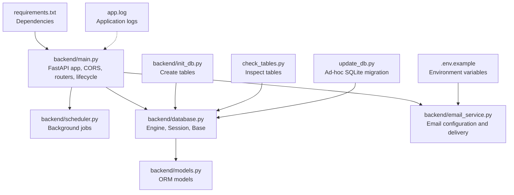
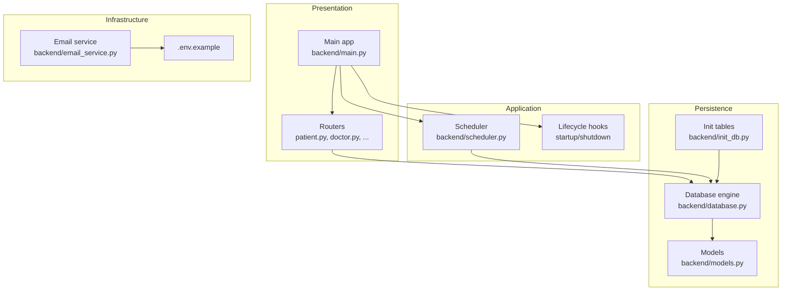
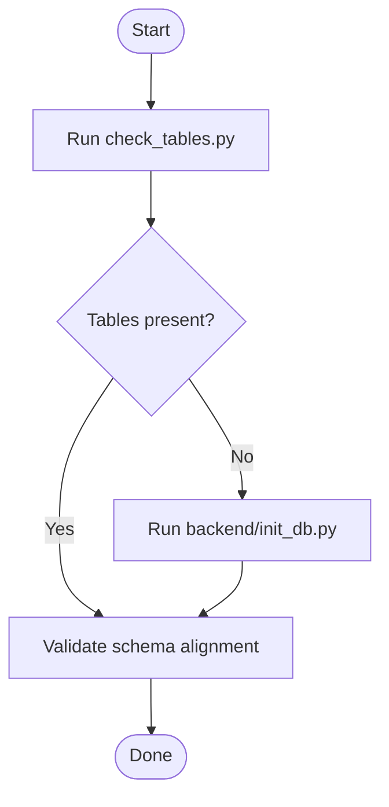
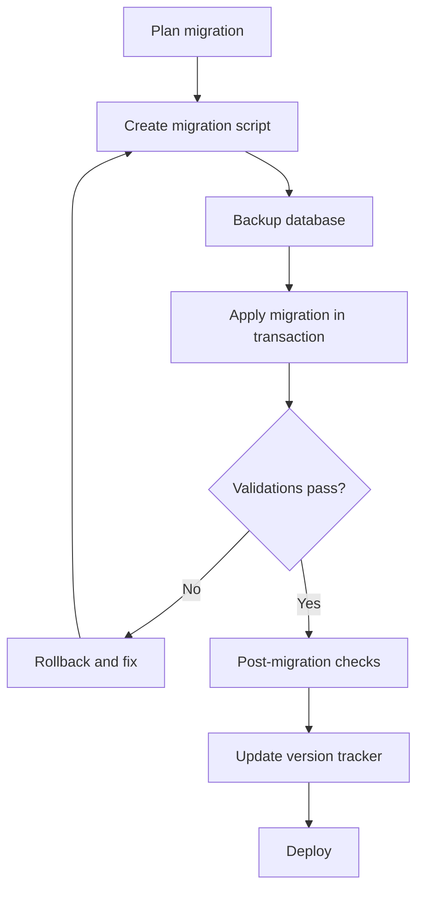
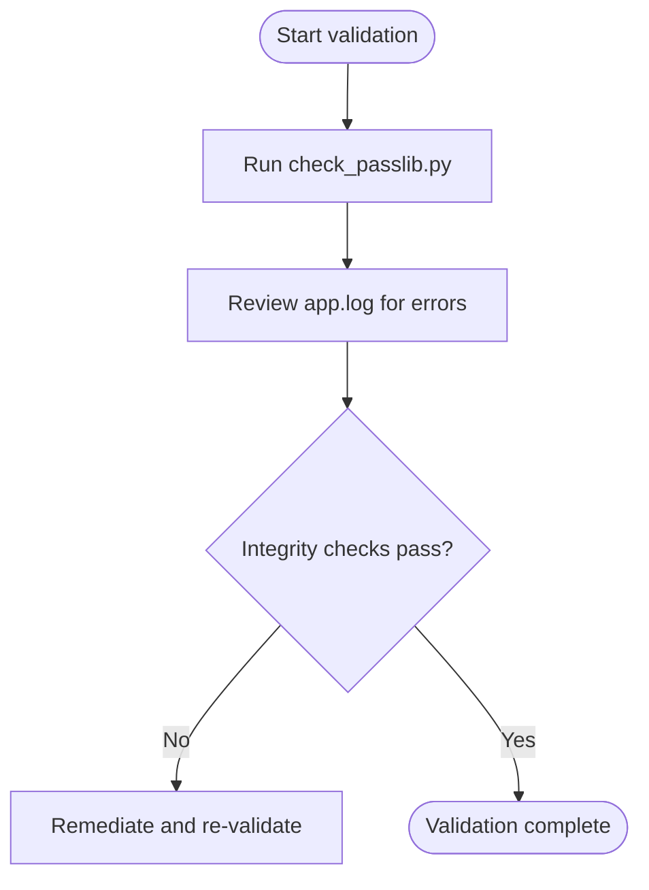
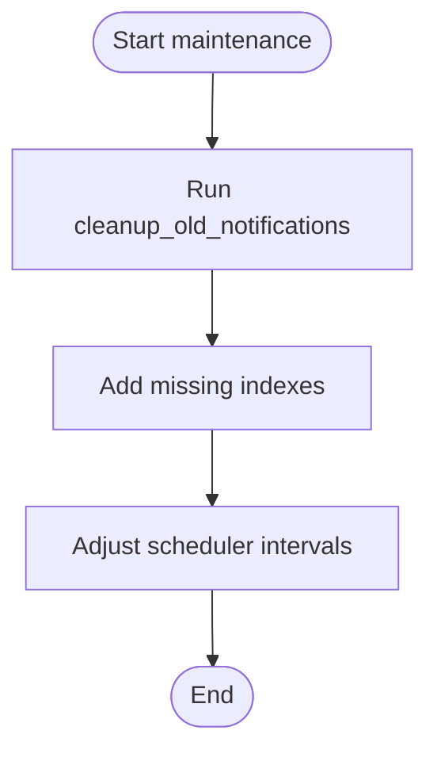
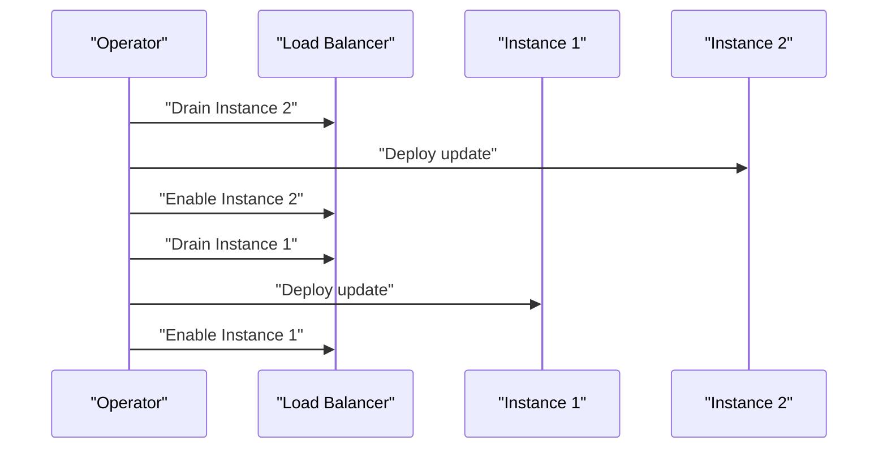
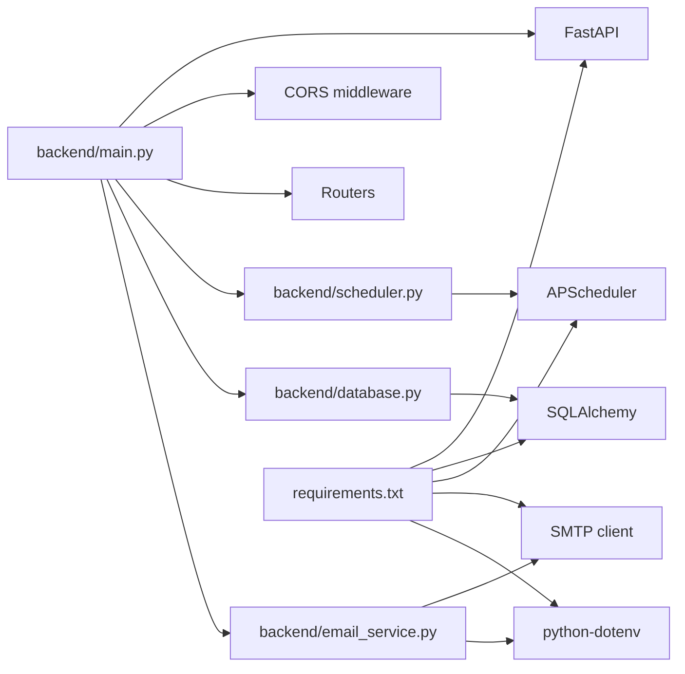
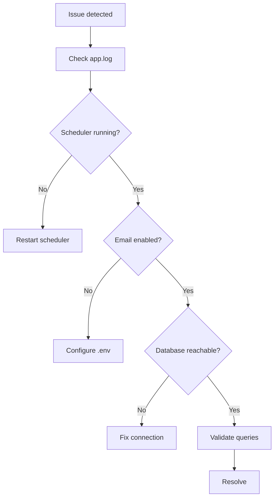

# Maintenance & Updates

<cite>
**Referenced Files in This Document**
- [backend/main.py](file://backend/main.py)
- [backend/database.py](file://backend/database.py)
- [backend/init_db.py](file://backend/init_db.py)
- [backend/models.py](file://backend/models.py)
- [backend/scheduler.py](file://backend/scheduler.py)
- [backend/email_service.py](file://backend/email_service.py)
- [update_db.py](file://update_db.py)
- [check_tables.py](file://check_tables.py)
- [check_passlib.py](file://check_passlib.py)
- [requirements.txt](file://requirements.txt)
- [.env.example](file://.env.example)
- [test_notifications.py](file://test_notifications.py)
- [test_registration.py](file://test_registration.py)
- [app.log](file://app.log)
</cite>

## Table of Contents
1. [Introduction](#introduction)
2. [Project Structure](#project-structure)
3. [Core Components](#core-components)
4. [Architecture Overview](#architecture-overview)
5. [Detailed Component Analysis](#detailed-component-analysis)
6. [Dependency Analysis](#dependency-analysis)
7. [Performance Considerations](#performance-considerations)
8. [Troubleshooting Guide](#troubleshooting-guide)
9. [Conclusion](#conclusion)
10. [Appendices](#appendices)

## Introduction
This document provides comprehensive maintenance and update procedures for SmartHealthCare. It covers database migration strategies, schema versioning, and data integrity validation during updates. It also documents routine maintenance tasks such as database cleanup, index optimization, and performance tuning. Application update procedures, rollback strategies, and zero-downtime deployment techniques are included. Backup and restore procedures, disaster recovery testing, and business continuity planning are addressed alongside security patch management, dependency updates, and vulnerability assessment processes. Finally, capacity planning, resource optimization, and system health maintenance routines are outlined to keep the system reliable and performant.

## Project Structure
SmartHealthCare is a FastAPI-based backend with SQLAlchemy ORM and APScheduler for background tasks. The backend module orchestrates application lifecycle events, database initialization, and scheduling. The database layer defines models and connection configuration. Maintenance scripts support schema inspection and ad-hoc migrations. Logging is configured for operational visibility.

**Diagram sources**
- [backend/main.py](file://backend/main.py#L1-L61)
- [backend/scheduler.py](file://backend/scheduler.py#L1-L317)
- [backend/database.py](file://backend/database.py#L1-L22)
- [backend/models.py](file://backend/models.py#L1-L110)
- [backend/email_service.py](file://backend/email_service.py#L1-L161)
- [backend/init_db.py](file://backend/init_db.py#L1-L11)
- [check_tables.py](file://check_tables.py#L1-L7)
- [update_db.py](file://update_db.py#L1-L25)
- [requirements.txt](file://requirements.txt#L1-L14)
- [.env.example](file://.env.example#L1-L13)
- [app.log](file://app.log#L1-L200)

**Section sources**
- [backend/main.py](file://backend/main.py#L1-L61)
- [backend/database.py](file://backend/database.py#L1-L22)
- [backend/models.py](file://backend/models.py#L1-L110)
- [backend/scheduler.py](file://backend/scheduler.py#L1-L317)
- [backend/email_service.py](file://backend/email_service.py#L1-L161)
- [backend/init_db.py](file://backend/init_db.py#L1-L11)
- [check_tables.py](file://check_tables.py#L1-L7)
- [update_db.py](file://update_db.py#L1-L25)
- [requirements.txt](file://requirements.txt#L1-L14)
- [.env.example](file://.env.example#L1-L13)
- [app.log](file://app.log#L1-L200)

## Core Components
- Application lifecycle and routing: FastAPI app definition, CORS configuration, router inclusion, and startup/shutdown hooks.
- Database layer: Engine creation, session factory, declarative base, and dependency provider for database sessions.
- Models: SQLAlchemy ORM models representing Users, Patients, Doctors, Appointments, HealthRecords, Notifications, and Prescriptions.
- Scheduler: Background jobs for medicine reminders, appointment reminders, sending pending notifications, and cleanup of old notifications.
- Email service: SMTP configuration and templated email delivery for notifications.
- Maintenance utilities: Scripts to initialize tables, inspect tables, and perform ad-hoc migrations.

Key responsibilities:
- Ensure consistent database initialization and schema creation.
- Maintain background tasks for proactive reminders and cleanup.
- Provide secure and configurable email notifications.
- Support safe and validated database updates.

**Section sources**
- [backend/main.py](file://backend/main.py#L1-L61)
- [backend/database.py](file://backend/database.py#L1-L22)
- [backend/models.py](file://backend/models.py#L1-L110)
- [backend/scheduler.py](file://backend/scheduler.py#L1-L317)
- [backend/email_service.py](file://backend/email_service.py#L1-L161)
- [backend/init_db.py](file://backend/init_db.py#L1-L11)
- [check_tables.py](file://check_tables.py#L1-L7)
- [update_db.py](file://update_db.py#L1-L25)

## Architecture Overview
The system follows a layered architecture:
- Presentation layer: FastAPI routes and routers.
- Application layer: Startup/shutdown hooks and scheduler orchestration.
- Persistence layer: SQLAlchemy ORM mapped to an underlying database (SQLite by default).
- Infrastructure layer: Email service and environment-driven configuration.

**Diagram sources**
- [backend/main.py](file://backend/main.py#L1-L61)
- [backend/scheduler.py](file://backend/scheduler.py#L1-L317)
- [backend/database.py](file://backend/database.py#L1-L22)
- [backend/models.py](file://backend/models.py#L1-L110)
- [backend/init_db.py](file://backend/init_db.py#L1-L11)
- [backend/email_service.py](file://backend/email_service.py#L1-L161)
- [.env.example](file://.env.example#L1-L13)

## Detailed Component Analysis

### Database Initialization and Schema Management
- Initialization: The initialization script creates all tables defined in the models against the configured engine.
- Schema inspection: A utility script connects to the database and lists existing tables for verification.
- Connection configuration: The database module configures the engine URL and session factory, supporting both SQLite and PostgreSQL.

Recommended practices:
- Use the initialization script in controlled environments to ensure schema consistency.
- Verify schema presence using the inspection script before applying changes.
- For production, switch the engine URL to PostgreSQL and manage credentials securely.

**Diagram sources**
- [check_tables.py](file://check_tables.py#L1-L7)
- [backend/init_db.py](file://backend/init_db.py#L1-L11)

**Section sources**
- [backend/init_db.py](file://backend/init_db.py#L1-L11)
- [check_tables.py](file://check_tables.py#L1-L7)
- [backend/database.py](file://backend/database.py#L1-L22)

### Database Migration Strategies and Schema Versioning
Current state:
- Ad-hoc migrations are performed via a dedicated script that executes raw SQL statements against SQLite.
- The system does not implement a formal schema versioning mechanism.

Recommended migration strategy:
- Adopt a lightweight migration framework or tool to track applied migrations and enforce ordering.
- Maintain a migrations directory with numbered scripts that apply incremental changes.
- Use transactions per migration and include pre/post validations to ensure data integrity.
- For production, prefer PostgreSQL with managed migrations and backups.

Validation steps:
- Before migration, back up the database.
- Run pre-flight checks to verify constraints and data types.
- Apply migration within a transaction and commit only if all validations pass.
- Post-migration, run integrity checks and re-index as needed.

**Diagram sources**
- [update_db.py](file://update_db.py#L1-L25)
- [backend/database.py](file://backend/database.py#L1-L22)

**Section sources**
- [update_db.py](file://update_db.py#L1-L25)
- [backend/database.py](file://backend/database.py#L1-L22)

### Data Integrity Validation During Updates
- Hashing validation: A utility script demonstrates hashing and verification using the configured cryptographic context.
- Logging: Application logs provide visibility into scheduler operations and potential errors.

Best practices:
- Validate cryptographic contexts and hashing behavior before deploying updates.
- Monitor logs for scheduler errors and remediate promptly.
- Implement checksums or row counts for critical tables to detect corruption.

**Diagram sources**
- [check_passlib.py](file://check_passlib.py#L1-L12)
- [app.log](file://app.log#L1-L200)

**Section sources**
- [check_passlib.py](file://check_passlib.py#L1-L12)
- [app.log](file://app.log#L1-L200)

### Routine Maintenance Tasks
- Database cleanup: The scheduler periodically deletes old notifications that are marked as read.
- Index optimization: For SQLite, consider adding indexes on frequently queried columns (e.g., Notification.scheduled_datetime, User.email).
- Performance tuning: Adjust scheduler intervals and background job frequencies based on workload.

**Diagram sources**
- [backend/scheduler.py](file://backend/scheduler.py#L236-L257)

**Section sources**
- [backend/scheduler.py](file://backend/scheduler.py#L236-L257)

### Application Update Procedures
- Prepare: Back up the database and application code.
- Test: Apply updates in a staging environment and validate functionality.
- Deploy: Roll out updates with minimal disruption using blue-green or rolling deployments.
- Verify: Confirm scheduler jobs, email delivery, and core API endpoints.

Zero-downtime techniques:
- Use reverse proxy or load balancer to route traffic to healthy instances.
- Keep scheduler jobs resilient and idempotent to avoid duplicate work during transitions.

[No sources needed since this diagram shows conceptual workflow, not actual code structure]

### Rollback Strategies
- Maintain versioned artifacts and database snapshots.
- Revert application code to the previous stable release.
- Rollback database migrations using reversible scripts or snapshot restoration.
- Validate rollback by running smoke tests and checking scheduler status.

[No sources needed since this section provides general guidance]

### Backup and Restore Procedures
- Backup: Export the SQLite database file or use PostgreSQL dump utilities for production.
- Store offsite and encrypt backups.
- Restore: Stop services, restore the database, and restart the application.
- Disaster recovery testing: Regularly practice restore drills to validate RTO/RPO targets.

[No sources needed since this section provides general guidance]

### Security Patch Management and Vulnerability Assessment
- Dependencies: Pin versions and regularly review requirements for security advisories.
- Environment configuration: Use .env.example as a reference for secure defaults.
- Email security: Configure TLS and strong credentials; avoid storing secrets in code.
- Vulnerability scanning: Integrate automated scans in CI/CD pipelines.

**Section sources**
- [requirements.txt](file://requirements.txt#L1-L14)
- [.env.example](file://.env.example#L1-L13)
- [backend/email_service.py](file://backend/email_service.py#L1-L161)

### Capacity Planning and Resource Optimization
- Monitor CPU, memory, and disk usage of the host system.
- Scale horizontally by adding instances behind a load balancer.
- Optimize database queries and consider indexing strategies for high-traffic endpoints.
- Right-size container resources and configure health checks.

[No sources needed since this section provides general guidance]

## Dependency Analysis
The application depends on FastAPI, SQLAlchemy, APScheduler, and cryptographic libraries. Email functionality depends on environment variables for SMTP configuration.

**Diagram sources**
- [backend/main.py](file://backend/main.py#L1-L61)
- [backend/scheduler.py](file://backend/scheduler.py#L1-L317)
- [backend/database.py](file://backend/database.py#L1-L22)
- [backend/email_service.py](file://backend/email_service.py#L1-L161)
- [requirements.txt](file://requirements.txt#L1-L14)

**Section sources**
- [requirements.txt](file://requirements.txt#L1-L14)
- [backend/main.py](file://backend/main.py#L1-L61)
- [backend/scheduler.py](file://backend/scheduler.py#L1-L317)
- [backend/database.py](file://backend/database.py#L1-L22)
- [backend/email_service.py](file://backend/email_service.py#L1-L161)

## Performance Considerations
- Scheduler intervals: Tune background jobs to balance responsiveness and resource usage.
- Database queries: Ensure efficient filters and joins; add indexes on frequently filtered columns.
- Logging: Avoid excessive logging in production; rotate logs and set appropriate levels.
- Email throughput: Batch or queue emails to prevent blocking the main thread.

[No sources needed since this section provides general guidance]

## Troubleshooting Guide
Common issues and resolutions:
- Scheduler errors: Review application logs for exceptions and ensure proper initialization.
- Email failures: Verify SMTP configuration and credentials; confirm TLS settings.
- Database connectivity: Check engine URL and credentials; validate table existence.
- Notification delivery: Confirm scheduler jobs are running and notifications are not being cleaned up prematurely.

**Diagram sources**
- [app.log](file://app.log#L1-L200)
- [backend/scheduler.py](file://backend/scheduler.py#L259-L317)
- [backend/email_service.py](file://backend/email_service.py#L1-L161)
- [backend/database.py](file://backend/database.py#L1-L22)

**Section sources**
- [app.log](file://app.log#L1-L200)
- [backend/scheduler.py](file://backend/scheduler.py#L259-L317)
- [backend/email_service.py](file://backend/email_service.py#L1-L161)
- [backend/database.py](file://backend/database.py#L1-L22)

## Conclusion
SmartHealthCare’s maintenance and update procedures should emphasize safe, validated migrations, robust logging, and resilient background tasks. By adopting formal schema versioning, implementing zero-downtime deployment, and maintaining strict security and backup practices, the system can achieve high reliability and continuous operation. Regular capacity planning and performance tuning will ensure optimal user experience under varying loads.

[No sources needed since this section summarizes without analyzing specific files]

## Appendices

### Appendix A: Testing Utilities
- Registration test: Validates user registration endpoint behavior.
- Notification test: Exercises notification creation and retrieval endpoints.

**Section sources**
- [test_registration.py](file://test_registration.py#L1-L21)
- [test_notifications.py](file://test_notifications.py#L1-L131)