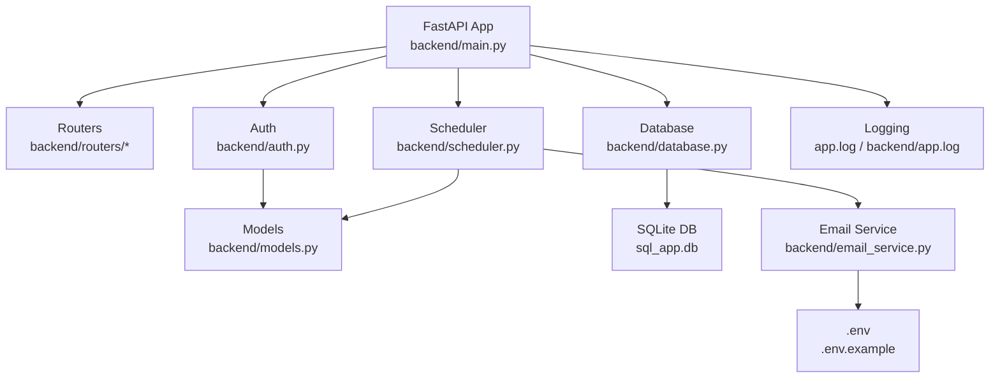
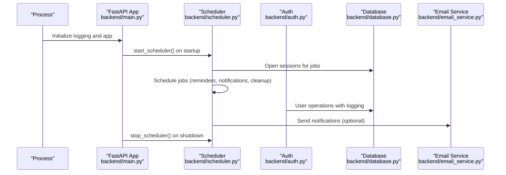
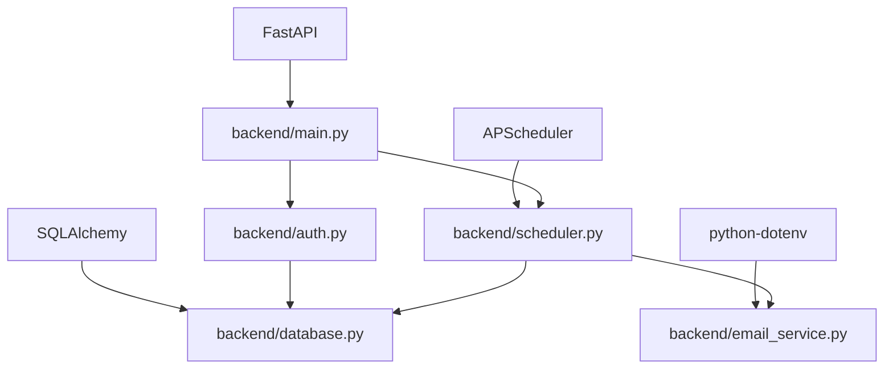

# Monitoring & Logging

<cite>
**Referenced Files in This Document**
- [backend/main.py](file://backend/main.py)
- [backend/app.log](file://backend/app.log)
- [app.log](file://app.log)
- [backend/auth.py](file://backend/auth.py)
- [backend/scheduler.py](file://backend/scheduler.py)
- [backend/email_service.py](file://backend/email_service.py)
- [.env.example](file://.env.example)
- [backend/database.py](file://backend/database.py)
- [backend/routers/patient.py](file://backend/routers/patient.py)
- [backend/routers/doctor.py](file://backend/routers/doctor.py)
- [backend/models.py](file://backend/models.py)
- [requirements.txt](file://requirements.txt)
</cite>

## Table of Contents
1. [Introduction](#introduction)
2. [Project Structure](#project-structure)
3. [Core Components](#core-components)
4. [Architecture Overview](#architecture-overview)
5. [Detailed Component Analysis](#detailed-component-analysis)
6. [Dependency Analysis](#dependency-analysis)
7. [Performance Considerations](#performance-considerations)
8. [Troubleshooting Guide](#troubleshooting-guide)
9. [Conclusion](#conclusion)
10. [Appendices](#appendices)

## Introduction
This document provides comprehensive monitoring and logging guidance for the SmartHealthCare backend. It covers application logging configuration, log rotation strategies, centralized logging setup, system metrics collection, alerting configuration, dashboard setup, log analysis techniques, troubleshooting workflows, and compliance logging requirements. The guidance is grounded in the repository’s current logging and scheduling mechanisms and outlines practical steps to enhance observability and reliability.

## Project Structure
SmartHealthCare is a FastAPI-based backend with modular routers, SQLAlchemy ORM models, and a background scheduler. Logging is configured at the application level and leveraged across authentication, scheduler, and email services. Environment variables control optional email notifications.

**Diagram sources**
- [backend/main.py](file://backend/main.py#L1-L61)
- [backend/scheduler.py](file://backend/scheduler.py#L1-L317)
- [backend/auth.py](file://backend/auth.py#L1-L120)
- [backend/database.py](file://backend/database.py#L1-L22)
- [backend/models.py](file://backend/models.py#L1-L110)
- [backend/email_service.py](file://backend/email_service.py#L1-L161)
- [.env.example](file://.env.example#L1-L13)

**Section sources**
- [backend/main.py](file://backend/main.py#L1-L61)
- [requirements.txt](file://requirements.txt#L1-L14)

## Core Components
- Application logging: BasicFileHandler configured via Python logging at process start, writing to a file path resolved at runtime.
- Authentication module: Uses structured logging for registration, profile creation, and error handling.
- Scheduler: Background APScheduler jobs for reminders and notifications, with robust logging for lifecycle and errors.
- Email service: Optional SMTP-based notifications with logging for success/failure and configuration checks.
- Database: SQLAlchemy engine and session management for all persistence operations.

Key implementation references:
- Logging configuration and logger usage in main app, auth, scheduler, and email service.
- Scheduler job definitions and lifecycle logging.
- Database engine and session factory.

**Section sources**
- [backend/main.py](file://backend/main.py#L4-L11)
- [backend/auth.py](file://backend/auth.py#L57-L104)
- [backend/scheduler.py](file://backend/scheduler.py#L5-L317)
- [backend/email_service.py](file://backend/email_service.py#L1-L161)
- [backend/database.py](file://backend/database.py#L1-L22)

## Architecture Overview
The backend initializes logging early, registers routers, and starts a background scheduler. Authentication and scheduler operations emit logs. Optional email notifications are sent asynchronously.

**Diagram sources**
- [backend/main.py](file://backend/main.py#L46-L56)
- [backend/scheduler.py](file://backend/scheduler.py#L259-L317)
- [backend/auth.py](file://backend/auth.py#L60-L104)
- [backend/email_service.py](file://backend/email_service.py#L98-L161)
- [backend/database.py](file://backend/database.py#L16-L22)

## Detailed Component Analysis

### Application Logging Configuration
- Location: Logging is configured at process start with a file handler and a specific format.
- Scope: The configured logger is used across modules for operational events and errors.
- Log destination: A file path is used; ensure permissions and rotation are managed externally.

Recommendations:
- Centralize log configuration in a dedicated module for reuse across services.
- Add structured logging (JSON) for easier parsing and ingestion by centralized systems.
- Integrate with platform logging facilities (e.g., systemd journal) for containerized deployments.

**Section sources**
- [backend/main.py](file://backend/main.py#L4-L11)

### Authentication Logging
- Registration flow logs user existence checks, hashing, DB writes, and profile creation.
- Errors are logged with exceptions and rolled back safely.
- Token generation and validation paths are protected with structured warnings and exceptions.

Best practices:
- Include correlation IDs in log messages for end-to-end tracing.
- Mask sensitive fields in logs (e.g., passwords, tokens).
- Enforce minimum log levels per environment.

**Section sources**
- [backend/auth.py](file://backend/auth.py#L60-L104)

### Scheduler and Background Jobs
- Jobs:
  - Reminders for prescriptions and appointments.
  - Periodic sending of pending notifications.
  - Daily cleanup of old notifications.
- Lifecycle logging: Start/stop, initial runs, and periodic execution.
- Error handling: Exceptions are caught, logged, and rolled back per job.

Operational insights:
- Monitor job durations and missed schedules.
- Track counts of created reminders and sent notifications.
- Alert on repeated failures in any job.

**Section sources**
- [backend/scheduler.py](file://backend/scheduler.py#L51-L108)
- [backend/scheduler.py](file://backend/scheduler.py#L110-L183)
- [backend/scheduler.py](file://backend/scheduler.py#L185-L234)
- [backend/scheduler.py](file://backend/scheduler.py#L236-L257)
- [backend/scheduler.py](file://backend/scheduler.py#L259-L317)

### Email Notifications Logging
- Conditional email sending based on environment configuration.
- Logs success and failure of SMTP operations.
- Graceful degradation when email is disabled.

Observability hooks:
- Track delivery success rates and retry attempts.
- Alert on SMTP connection failures or credential issues.

**Section sources**
- [backend/email_service.py](file://backend/email_service.py#L98-L161)
- [.env.example](file://.env.example#L1-L13)

### Database Operations Logging
- Engine and session management are centralized.
- All write/read operations should be instrumented with logs around commit/rollback boundaries.
- Schema evolution and migration errors should be surfaced with detailed logs.

**Section sources**
- [backend/database.py](file://backend/database.py#L1-L22)
- [backend/models.py](file://backend/models.py#L1-L110)

### API Routers Logging
- Patient and doctor routers enforce role-based access and return structured responses.
- Logging should accompany CRUD operations for auditability and troubleshooting.

Recommendations:
- Add request/response logging middleware for all routes.
- Include request IDs and user context in logs.

**Section sources**
- [backend/routers/patient.py](file://backend/routers/patient.py#L1-L107)
- [backend/routers/doctor.py](file://backend/routers/doctor.py#L1-L120)

## Dependency Analysis
The backend depends on FastAPI, SQLAlchemy, APScheduler, and environment-driven configuration. Logging spans multiple modules and is foundational for observability.

**Diagram sources**
- [requirements.txt](file://requirements.txt#L1-L14)
- [backend/main.py](file://backend/main.py#L1-L61)
- [backend/scheduler.py](file://backend/scheduler.py#L1-L317)
- [backend/email_service.py](file://backend/email_service.py#L1-L161)
- [backend/database.py](file://backend/database.py#L1-L22)

**Section sources**
- [requirements.txt](file://requirements.txt#L1-L14)

## Performance Considerations
- Logging overhead: Ensure asynchronous handlers or buffered writes for high-throughput environments.
- Database performance: Indexes on frequently queried fields (e.g., user_id, scheduled_datetime) improve scheduler and notification performance.
- Scheduler cadence: Tune intervals based on workload; monitor job execution times and adjust accordingly.
- Email throughput: Batch or queue emails to avoid blocking scheduler threads.

[No sources needed since this section provides general guidance]

## Troubleshooting Guide
Common scenarios and actions:
- Application startup/shutdown anomalies:
  - Verify scheduler start/stop logs and ensure graceful shutdown.
- Authentication failures:
  - Check registration logs for duplicate users, hashing, and DB errors.
- Notification delivery issues:
  - Confirm email configuration and SMTP logs; enable/disable email gracefully.
- Database errors:
  - Review ORM operation logs and rollback messages; inspect schema mismatches.

Diagnostic steps:
- Tail logs from the configured file location.
- Correlate timestamps across modules for end-to-end flows.
- Use structured logs to filter by severity, module, and event type.

**Section sources**
- [backend/main.py](file://backend/main.py#L46-L56)
- [backend/auth.py](file://backend/auth.py#L60-L104)
- [backend/scheduler.py](file://backend/scheduler.py#L259-L317)
- [backend/email_service.py](file://backend/email_service.py#L98-L161)

## Conclusion
SmartHealthCare currently implements basic file-based logging and a robust background scheduler. To mature the monitoring and logging posture:
- Adopt structured logging and centralize configuration.
- Implement log rotation and retention policies.
- Integrate with a centralized logging platform and set up dashboards.
- Define alerting rules for critical thresholds and availability.
- Establish audit trails for compliance and maintain detailed change logs.

[No sources needed since this section summarizes without analyzing specific files]

## Appendices

### Log Rotation Strategies
- Use OS-native tools (e.g., logrotate on Linux) to rotate and compress logs.
- Configure retention windows aligned with compliance requirements.
- Ensure atomic rotation to prevent data loss during rotation.

[No sources needed since this section provides general guidance]

### Centralized Logging Setup
- Ship logs to a collector (e.g., Fluent Bit/Fluentd) forwarding to Elasticsearch/OpenSearch or Loki.
- Tag logs with service, environment, and deployment version.
- Store raw logs for at least 90–180 days depending on compliance.

[No sources needed since this section provides general guidance]

### Metrics Collection
- Application metrics: Request latency, error rates, and throughput per endpoint.
- Infrastructure metrics: CPU, memory, disk I/O, and network utilization.
- Database metrics: Query latency, slow queries, connection pool saturation.
- Scheduler metrics: Job execution time, missed schedules, and failure rates.

[No sources needed since this section provides general guidance]

### Alerting Configuration
- Thresholds: Error rate > 1% over 5 minutes; P95 latency > 500ms; DB connections > 90%.
- Availability: 99.9% uptime SLA; scheduled job failures.
- Channels: PagerDuty, Slack, email; include runbooks and escalation paths.

[No sources needed since this section provides general guidance]

### Dashboard Setup
- Dashboards: Request volume, error rates, latency distributions, scheduler job status, database performance.
- Custom metrics: Build charts from logs and metrics; define derived series (e.g., error ratios).
- Baselines: Establish historical baselines for capacity planning and anomaly detection.

[No sources needed since this section provides general guidance]

### Compliance Logging and Audit Trails
- Maintain immutable logs for authentication, user profile changes, and administrative actions.
- Retain audit logs per regulatory requirements (e.g., HIPAA).
- Include timestamps, user IDs, action types, and outcomes.

[No sources needed since this section provides general guidance]