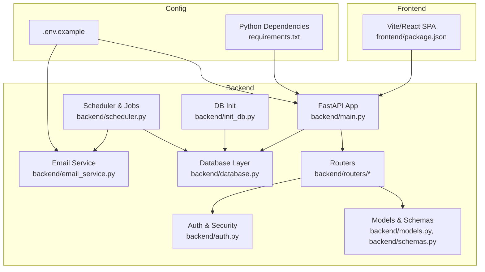
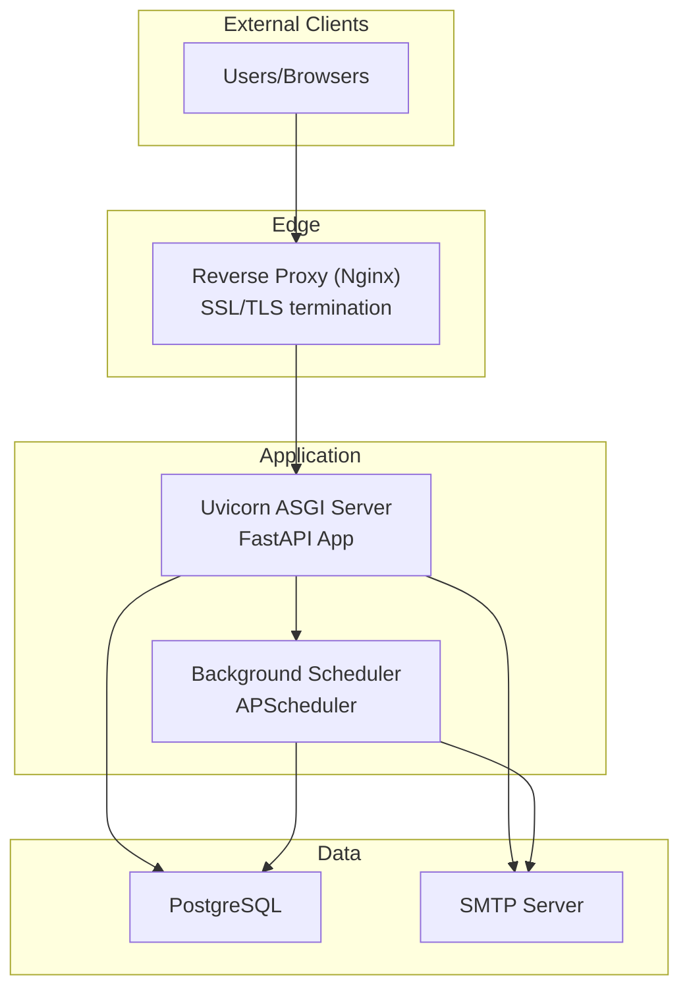
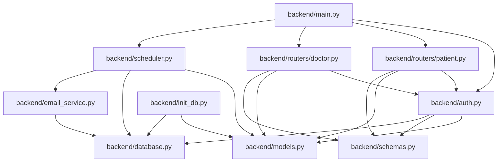

# Production Deployment

<cite>
**Referenced Files in This Document**
- [.env.example](file://.env.example)
- [requirements.txt](file://requirements.txt)
- [backend/main.py](file://backend/main.py)
- [backend/database.py](file://backend/database.py)
- [backend/auth.py](file://backend/auth.py)
- [backend/models.py](file://backend/models.py)
- [backend/schemas.py](file://backend/schemas.py)
- [backend/routers/patient.py](file://backend/routers/patient.py)
- [backend/routers/doctor.py](file://backend/routers/doctor.py)
- [backend/scheduler.py](file://backend/scheduler.py)
- [backend/email_service.py](file://backend/email_service.py)
- [backend/init_db.py](file://backend/init_db.py)
- [frontend/package.json](file://frontend/package.json)
</cite>

## Table of Contents
1. [Introduction](#introduction)
2. [Project Structure](#project-structure)
3. [Core Components](#core-components)
4. [Architecture Overview](#architecture-overview)
5. [Detailed Component Analysis](#detailed-component-analysis)
6. [Dependency Analysis](#dependency-analysis)
7. [Performance Considerations](#performance-considerations)
8. [Troubleshooting Guide](#troubleshooting-guide)
9. [Conclusion](#conclusion)
10. [Appendices](#appendices)

## Introduction
This document provides comprehensive production deployment guidance for SmartHealthCare. It covers environment variable configuration, database setup, security hardening, containerization strategies, reverse proxy and SSL configuration, load balancing, CI/CD automation, monitoring and health checks, auto-scaling, and deployment validation procedures. The goal is to enable reliable, secure, and scalable deployments suitable for production environments.

## Project Structure
SmartHealthCare consists of:
- Backend: FastAPI application with SQLAlchemy ORM, Pydantic models, APScheduler-based background jobs, and optional email notifications.
- Frontend: Vite/React single-page application.
- Shared configuration via environment variables and Python dependencies.

**Diagram sources**
- [backend/main.py](file://backend/main.py#L1-L61)
- [backend/database.py](file://backend/database.py#L1-L22)
- [backend/models.py](file://backend/models.py#L1-L110)
- [backend/schemas.py](file://backend/schemas.py#L1-L236)
- [backend/auth.py](file://backend/auth.py#L1-L120)
- [backend/scheduler.py](file://backend/scheduler.py#L1-L317)
- [backend/email_service.py](file://backend/email_service.py#L1-L161)
- [backend/init_db.py](file://backend/init_db.py#L1-L11)
- [.env.example](file://.env.example#L1-L13)
- [requirements.txt](file://requirements.txt#L1-L14)
- [frontend/package.json](file://frontend/package.json#L1-L35)

**Section sources**
- [backend/main.py](file://backend/main.py#L1-L61)
- [backend/database.py](file://backend/database.py#L1-L22)
- [backend/models.py](file://backend/models.py#L1-L110)
- [backend/schemas.py](file://backend/schemas.py#L1-L236)
- [backend/auth.py](file://backend/auth.py#L1-L120)
- [backend/scheduler.py](file://backend/scheduler.py#L1-L317)
- [backend/email_service.py](file://backend/email_service.py#L1-L161)
- [backend/init_db.py](file://backend/init_db.py#L1-L11)
- [.env.example](file://.env.example#L1-L13)
- [requirements.txt](file://requirements.txt#L1-L14)
- [frontend/package.json](file://frontend/package.json#L1-L35)

## Core Components
- Application entrypoint and middleware configuration.
- Database connectivity and initialization.
- Authentication and authorization with JWT tokens.
- Background job scheduling for reminders and notifications.
- Optional email delivery via SMTP.
- Frontend build and runtime integration.

Key production considerations:
- Environment variables for secrets and configuration.
- Database URL switch from SQLite to PostgreSQL for production.
- Hardened JWT secret management and token expiration.
- Email configuration for notifications.

**Section sources**
- [backend/main.py](file://backend/main.py#L1-L61)
- [backend/database.py](file://backend/database.py#L1-L22)
- [backend/auth.py](file://backend/auth.py#L1-L120)
- [backend/scheduler.py](file://backend/scheduler.py#L1-L317)
- [backend/email_service.py](file://backend/email_service.py#L1-L161)
- [frontend/package.json](file://frontend/package.json#L1-L35)

## Architecture Overview
The production architecture integrates the FastAPI backend with a PostgreSQL database, optional SMTP email delivery, and a reverse proxy (Nginx) in front of the application server. The frontend is served either by the reverse proxy or via a CDN/static hosting.

**Diagram sources**
- [backend/main.py](file://backend/main.py#L1-L61)
- [backend/database.py](file://backend/database.py#L1-L22)
- [backend/scheduler.py](file://backend/scheduler.py#L1-L317)
- [backend/email_service.py](file://backend/email_service.py#L1-L161)

## Detailed Component Analysis

### Environment Variables and Secrets Management
- Configure email SMTP settings via environment variables for optional email notifications.
- Replace the development SQLite database URL with a production PostgreSQL connection string.
- Use environment variables for JWT secret and algorithm configuration.

Recommended environment variables:
- Database URL for PostgreSQL.
- Email host, port, username, password, sender address.
- Application secret key and algorithm for JWT.

**Section sources**
- [.env.example](file://.env.example#L1-L13)
- [backend/database.py](file://backend/database.py#L5-L7)
- [backend/auth.py](file://backend/auth.py#L10-L13)
- [backend/email_service.py](file://backend/email_service.py#L13-L22)

### Database Setup and Initialization
- The application initializes database tables at startup using SQLAlchemy metadata.
- For production, switch the database URL to PostgreSQL and ensure proper credentials and network access.
- Use migrations for schema changes in production (recommended).

Operational steps:
- Provision a PostgreSQL instance and configure credentials.
- Set the database URL via environment variable.
- Initialize tables using the provided initializer script or equivalent.

**Section sources**
- [backend/database.py](file://backend/database.py#L5-L14)
- [backend/init_db.py](file://backend/init_db.py#L1-L11)

### Security Hardening
- Replace the development JWT secret with a strong, randomly generated secret stored in environment variables.
- Enforce HTTPS and secure cookies in production.
- Restrict CORS origins to trusted domains.
- Validate and sanitize all inputs using Pydantic models.
- Use HTTPS for SMTP connections and enforce TLS.

**Section sources**
- [backend/auth.py](file://backend/auth.py#L10-L13)
- [backend/main.py](file://backend/main.py#L19-L32)
- [backend/schemas.py](file://backend/schemas.py#L1-L236)
- [backend/email_service.py](file://backend/email_service.py#L128-L131)

### Containerization Strategies
- Use a multi-stage Docker build to minimize the final image size and attack surface.
- Stage 1: Build frontend assets.
- Stage 2: Install Python dependencies and copy application code.
- Stage 3: Runtime stage with minimal base image and non-root user.
- Optimize by installing only production dependencies and pruning dev packages.

Container configuration checklist:
- Define environment variables for database URL, JWT secret, and email settings.
- Expose the application port and health check endpoint.
- Mount persistent volumes for logs and backups if needed.
- Use health checks to ensure readiness and liveness.

[No sources needed since this section provides general guidance]

### Reverse Proxy and SSL Termination
- Place Nginx in front of the application server for SSL termination, static asset serving, and load balancing.
- Configure SSL certificates (e.g., Let’s Encrypt) and enforce TLS.
- Set up gzip compression and appropriate timeouts.
- Forward requests to the Uvicorn server and handle WebSocket upgrades if applicable.

[No sources needed since this section provides general guidance]

### Load Balancer Setup
- Use a load balancer (e.g., NGINX, HAProxy, or cloud LB) to distribute traffic across multiple application instances.
- Enable sticky sessions if required by the application.
- Configure health checks to route traffic only to healthy instances.

[No sources needed since this section provides general guidance]

### CI/CD Automation and Rollback Procedures
- Automate building Docker images, pushing to a registry, and deploying to staging/production.
- Use blue/green or rolling deployments to minimize downtime.
- Implement automated rollback to the previous version on failure.
- Validate deployments with smoke tests and health checks before switching traffic.

[No sources needed since this section provides general guidance]

### Monitoring, Health Checks, and Auto-Scaling
- Expose a health check endpoint at the application root for readiness and liveness probes.
- Integrate metrics collection (e.g., Prometheus) and logging (e.g., structured logs to stdout).
- Configure auto-scaling based on CPU/memory or custom metrics.
- Monitor database connections and scheduler job execution.

**Section sources**
- [backend/main.py](file://backend/main.py#L58-L61)

### Deployment Validation and Post-Deployment Verification
- Smoke tests: Verify root endpoint, authentication flow, and basic CRUD operations.
- Database connectivity: Confirm table creation and data persistence.
- Email delivery: Test notification emails if enabled.
- Scheduler jobs: Validate reminder generation and notification sending.
- End-to-end tests: Simulate user journeys from login to dashboard actions.

[No sources needed since this section provides general guidance]

## Dependency Analysis
The backend module dependencies and relationships are as follows:

**Diagram sources**
- [backend/main.py](file://backend/main.py#L1-L61)
- [backend/auth.py](file://backend/auth.py#L1-L120)
- [backend/models.py](file://backend/models.py#L1-L110)
- [backend/schemas.py](file://backend/schemas.py#L1-L236)
- [backend/routers/patient.py](file://backend/routers/patient.py#L1-L107)
- [backend/routers/doctor.py](file://backend/routers/doctor.py#L1-L120)
- [backend/database.py](file://backend/database.py#L1-L22)
- [backend/scheduler.py](file://backend/scheduler.py#L1-L317)
- [backend/email_service.py](file://backend/email_service.py#L1-L161)
- [backend/init_db.py](file://backend/init_db.py#L1-L11)

**Section sources**
- [backend/main.py](file://backend/main.py#L1-L61)
- [backend/auth.py](file://backend/auth.py#L1-L120)
- [backend/models.py](file://backend/models.py#L1-L110)
- [backend/schemas.py](file://backend/schemas.py#L1-L236)
- [backend/routers/patient.py](file://backend/routers/patient.py#L1-L107)
- [backend/routers/doctor.py](file://backend/routers/doctor.py#L1-L120)
- [backend/database.py](file://backend/database.py#L1-L22)
- [backend/scheduler.py](file://backend/scheduler.py#L1-L317)
- [backend/email_service.py](file://backend/email_service.py#L1-L161)
- [backend/init_db.py](file://backend/init_db.py#L1-L11)

## Performance Considerations
- Use PostgreSQL in production for concurrency and reliability.
- Tune database connection pooling and scheduler intervals.
- Enable gzip/HTTP/2 in the reverse proxy for improved latency.
- Use a CDN for frontend assets and cache static resources.
- Scale horizontally with multiple application instances behind a load balancer.

[No sources needed since this section provides general guidance]

## Troubleshooting Guide
Common production issues and resolutions:
- Database connectivity errors: Verify the database URL and credentials; ensure network access and firewall rules.
- Authentication failures: Confirm JWT secret and algorithm match environment variables; check token expiration.
- Email delivery failures: Validate SMTP settings and TLS configuration; confirm sender domain and permissions.
- Scheduler job failures: Review logs for exceptions and ensure database/session handling is correct.
- CORS errors: Align allowed origins with the deployed frontend domain.

**Section sources**
- [backend/database.py](file://backend/database.py#L5-L14)
- [backend/auth.py](file://backend/auth.py#L10-L13)
- [backend/email_service.py](file://backend/email_service.py#L128-L138)
- [backend/scheduler.py](file://backend/scheduler.py#L103-L107)
- [backend/main.py](file://backend/main.py#L19-L32)

## Conclusion
By following this guide, you can deploy SmartHealthCare securely and reliably in production. Focus on environment-driven configuration, hardened authentication, robust database connectivity, and observability. Use containerization and reverse proxies to achieve scalability and high availability, and automate deployments with CI/CD for consistent rollouts and quick rollbacks.

[No sources needed since this section summarizes without analyzing specific files]

## Appendices

### Environment Variable Reference
- Database URL: PostgreSQL connection string.
- Email settings: Host, port, username, password, sender address.
- JWT: Secret key and algorithm.

**Section sources**
- [.env.example](file://.env.example#L1-L13)
- [backend/database.py](file://backend/database.py#L5-L7)
- [backend/auth.py](file://backend/auth.py#L10-L13)
- [backend/email_service.py](file://backend/email_service.py#L13-L22)

### Database Initialization
- Initialize tables using the provided initializer script or equivalent.

**Section sources**
- [backend/init_db.py](file://backend/init_db.py#L1-L11)

### Frontend Build and Deployment
- Build the frontend using the provided scripts and serve via the reverse proxy or CDN.

**Section sources**
- [frontend/package.json](file://frontend/package.json#L6-L11)