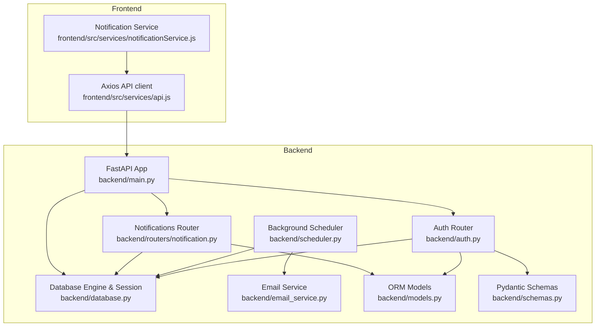
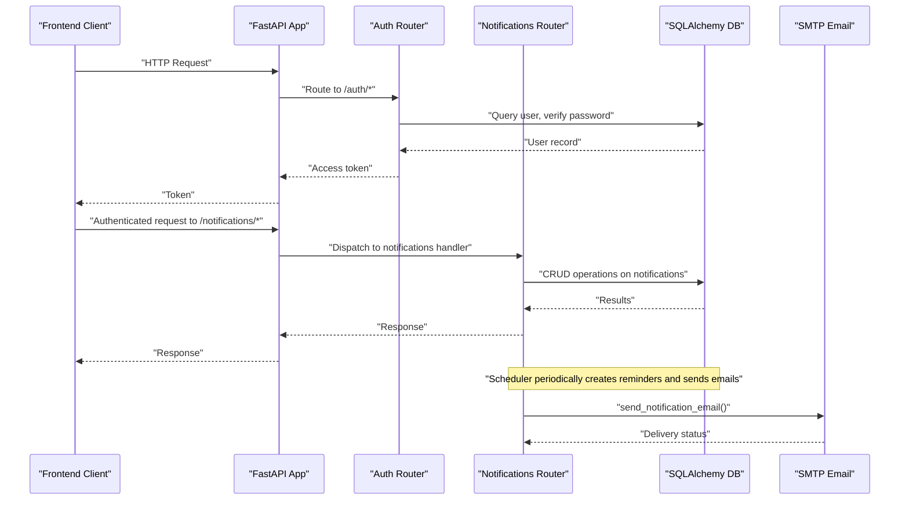
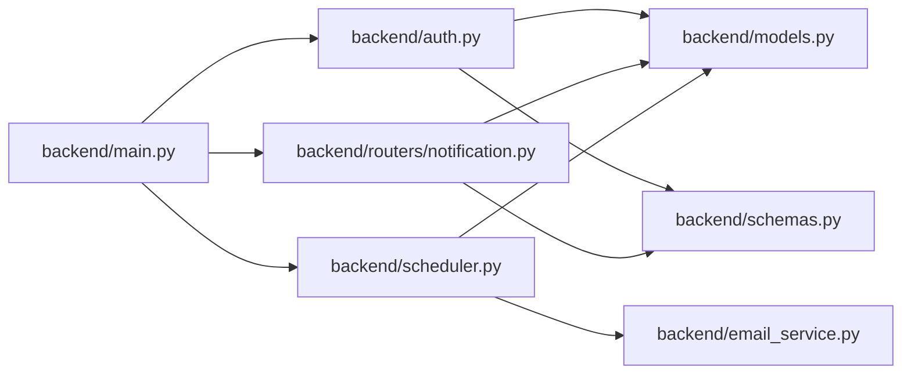

# Troubleshooting & Operations

<cite>
**Referenced Files in This Document**
- [backend/main.py](file://backend/main.py)
- [backend/auth.py](file://backend/auth.py)
- [backend/database.py](file://backend/database.py)
- [backend/routers/notification.py](file://backend/routers/notification.py)
- [backend/email_service.py](file://backend/email_service.py)
- [backend/scheduler.py](file://backend/scheduler.py)
- [backend/models.py](file://backend/models.py)
- [backend/schemas.py](file://backend/schemas.py)
- [frontend/src/services/api.js](file://frontend/src/services/api.js)
- [frontend/src/services/notificationService.js](file://frontend/src/services/notificationService.js)
- [.env.example](file://.env.example)
- [requirements.txt](file://requirements.txt)
- [test_notifications.py](file://test_notifications.py)
- [debug_doctor_api.py](file://debug_doctor_api.py)
</cite>

## Table of Contents
1. [Introduction](#introduction)
2. [Project Structure](#project-structure)
3. [Core Components](#core-components)
4. [Architecture Overview](#architecture-overview)
5. [Detailed Component Analysis](#detailed-component-analysis)
6. [Dependency Analysis](#dependency-analysis)
7. [Performance Considerations](#performance-considerations)
8. [Troubleshooting Guide](#troubleshooting-guide)
9. [Incident Response Procedures](#incident-response-procedures)
10. [Conclusion](#conclusion)
11. [Appendices](#appendices)

## Introduction
This document provides comprehensive troubleshooting and operational support guidance for SmartHealthCare. It covers common operational issues such as authentication failures, database connectivity problems, and notification delivery failures. It also documents diagnostic procedures for performance bottlenecks, memory leaks, and API timeout issues, along with step-by-step workflows for user-reported problems, system alerts, and unexpected downtime. Incident response procedures, escalation paths, and communication protocols are included, alongside debugging techniques, log analysis methodologies, and system state inspection procedures. Security incident response, data breach procedures, and compliance violation handling are addressed to ensure robust operations.

## Project Structure
SmartHealthCare is a FastAPI-based backend with a SQLite database and a React frontend. The backend exposes REST endpoints for authentication, patients, doctors, appointments, AI diagnostics, notifications, and prescriptions. A background scheduler handles recurring tasks such as generating reminders and sending notifications. The frontend communicates with the backend via Axios interceptors that attach Bearer tokens.

**Diagram sources**
- [backend/main.py](file://backend/main.py#L1-L61)
- [backend/auth.py](file://backend/auth.py#L1-L120)
- [backend/database.py](file://backend/database.py#L1-L22)
- [backend/routers/notification.py](file://backend/routers/notification.py#L1-L177)
- [backend/email_service.py](file://backend/email_service.py#L1-L161)
- [backend/scheduler.py](file://backend/scheduler.py#L1-L317)
- [backend/models.py](file://backend/models.py#L1-L110)
- [backend/schemas.py](file://backend/schemas.py#L1-L236)
- [frontend/src/services/api.js](file://frontend/src/services/api.js#L1-L25)
- [frontend/src/services/notificationService.js](file://frontend/src/services/notificationService.js#L1-L117)

**Section sources**
- [backend/main.py](file://backend/main.py#L1-L61)
- [backend/database.py](file://backend/database.py#L1-L22)
- [frontend/src/services/api.js](file://frontend/src/services/api.js#L1-L25)
- [frontend/src/services/notificationService.js](file://frontend/src/services/notificationService.js#L1-L117)

## Core Components
- Authentication and Authorization: Implements OAuth2 password flow with JWT tokens, password hashing, and role-based access control for notifications creation.
- Database Layer: Uses SQLAlchemy with a local SQLite database and a scoped session factory.
- Notifications: Provides endpoints to list, filter, mark as read, and delete notifications; includes statistics and upcoming reminders.
- Email Delivery: Optional SMTP-based email notifications templated for reminders; email configuration is controlled via environment variables.
- Background Scheduler: Periodic jobs to create reminders from prescriptions and appointments, send pending notifications, and clean up old notifications.
- Frontend Services: Axios-based API client and notification service that attach Bearer tokens and call backend endpoints.

**Section sources**
- [backend/auth.py](file://backend/auth.py#L1-L120)
- [backend/database.py](file://backend/database.py#L1-L22)
- [backend/routers/notification.py](file://backend/routers/notification.py#L1-L177)
- [backend/email_service.py](file://backend/email_service.py#L1-L161)
- [backend/scheduler.py](file://backend/scheduler.py#L1-L317)
- [frontend/src/services/api.js](file://frontend/src/services/api.js#L1-L25)
- [frontend/src/services/notificationService.js](file://frontend/src/services/notificationService.js#L1-L117)

## Architecture Overview
The system follows a layered architecture:
- Presentation Layer: React frontend with Axios interceptors for token injection.
- Application Layer: FastAPI routes for auth, notifications, and other resources.
- Business Logic Layer: Authentication helpers, scheduler tasks, and router handlers.
- Data Access Layer: SQLAlchemy ORM models and sessions.
- External Integrations: Optional SMTP for email notifications.

**Diagram sources**
- [backend/main.py](file://backend/main.py#L1-L61)
- [backend/auth.py](file://backend/auth.py#L1-L120)
- [backend/routers/notification.py](file://backend/routers/notification.py#L1-L177)
- [backend/email_service.py](file://backend/email_service.py#L1-L161)
- [backend/scheduler.py](file://backend/scheduler.py#L1-L317)
- [frontend/src/services/api.js](file://frontend/src/services/api.js#L1-L25)

## Detailed Component Analysis

### Authentication and Authorization
Key behaviors:
- Password hashing and verification using pbkdf2_sha256.
- JWT token generation with HS256 and expiration.
- OAuth2 password flow endpoint for token acquisition.
- Role-based authorization for notification creation.

Common issues:
- Incorrect credentials lead to 401 Unauthorized.
- Missing or invalid Bearer token causes route-level 401.
- Duplicate registration attempts trigger conflict errors.

Operational tips:
- Verify SECRET_KEY consistency across deployments.
- Ensure client-side storage of tokens is secure and cleared on logout.
- Monitor logs for repeated credential failures indicating brute-force attempts.

**Section sources**
- [backend/auth.py](file://backend/auth.py#L1-L120)
- [frontend/src/services/api.js](file://frontend/src/services/api.js#L1-L25)

### Database Connectivity
Key behaviors:
- SQLite engine configured with thread-local sessions.
- Session lifecycle managed via dependency generator.
- Production-grade PostgreSQL URL commented for easy migration.

Common issues:
- Database lock contention under concurrent writes.
- Session leaks if not closed properly.
- Migration or schema mismatch errors.

Operational tips:
- Use connection pooling and limit concurrent sessions in production.
- Monitor disk space and file locks for SQLite.
- Validate migrations and schema alignment during upgrades.

**Section sources**
- [backend/database.py](file://backend/database.py#L1-L22)
- [backend/models.py](file://backend/models.py#L1-L110)

### Notifications and Scheduler
Key behaviors:
- CRUD endpoints for notifications with filtering and pagination.
- Statistics endpoint for unread and upcoming reminders.
- Background jobs to create reminders from prescriptions/appointments and send pending notifications.
- Optional cleanup of old notifications.

Common issues:
- Notifications not appearing due to scheduler not running or misconfiguration.
- Email delivery failures when SMTP is not configured.
- Permission errors when non-authorized users attempt to create notifications.

Operational tips:
- Confirm scheduler startup/shutdown events and job schedules.
- Validate email environment variables and network access.
- Audit notification statuses and scheduled times.

**Section sources**
- [backend/routers/notification.py](file://backend/routers/notification.py#L1-L177)
- [backend/scheduler.py](file://backend/scheduler.py#L1-L317)
- [backend/email_service.py](file://backend/email_service.py#L1-L161)
- [backend/models.py](file://backend/models.py#L75-L90)

### Email Service
Key behaviors:
- SMTP configuration via environment variables.
- HTML email templates for different notification types.
- Graceful degradation when email is disabled.

Common issues:
- Misconfigured credentials or ports.
- Network timeouts or TLS handshake failures.
- Disabled email causing only in-app notifications.

Operational tips:
- Use app-specific passwords for Gmail.
- Test SMTP connectivity independently.
- Monitor email delivery logs.

**Section sources**
- [backend/email_service.py](file://backend/email_service.py#L1-L161)
- [.env.example](file://.env.example#L1-L13)

### Frontend API and Notification Service
Key behaviors:
- Axios client with base URL pointing to backend.
- Request interceptor attaches Authorization header from localStorage.
- Notification service wraps CRUD operations for notifications.

Common issues:
- Missing or expired tokens leading to 401 responses.
- CORS mismatches between frontend and backend origins.
- Network errors or timeouts.

Operational tips:
- Clear stale tokens on logout and handle token refresh.
- Align CORS origins with frontend ports.
- Implement retry and exponential backoff for transient failures.

**Section sources**
- [frontend/src/services/api.js](file://frontend/src/services/api.js#L1-L25)
- [frontend/src/services/notificationService.js](file://frontend/src/services/notificationService.js#L1-L117)

## Dependency Analysis
The backend module dependencies are straightforward and cohesive:
- main.py orchestrates routers and scheduler lifecycle.
- auth.py depends on database, models, schemas, and JWT utilities.
- notification router depends on auth and database for user context and persistence.
- scheduler depends on database and email service for recurring tasks.
- models define relational structures used by routers and scheduler.

**Diagram sources**
- [backend/main.py](file://backend/main.py#L1-L61)
- [backend/auth.py](file://backend/auth.py#L1-L120)
- [backend/routers/notification.py](file://backend/routers/notification.py#L1-L177)
- [backend/scheduler.py](file://backend/scheduler.py#L1-L317)
- [backend/models.py](file://backend/models.py#L1-L110)
- [backend/schemas.py](file://backend/schemas.py#L1-L236)
- [backend/email_service.py](file://backend/email_service.py#L1-L161)

**Section sources**
- [backend/main.py](file://backend/main.py#L1-L61)
- [backend/auth.py](file://backend/auth.py#L1-L120)
- [backend/routers/notification.py](file://backend/routers/notification.py#L1-L177)
- [backend/scheduler.py](file://backend/scheduler.py#L1-L317)
- [backend/models.py](file://backend/models.py#L1-L110)
- [backend/schemas.py](file://backend/schemas.py#L1-L236)
- [backend/email_service.py](file://backend/email_service.py#L1-L161)

## Performance Considerations
- Scheduler frequency tuning: Adjust intervals for reminder creation and notification sending based on workload.
- Database indexing: Ensure indexed columns (e.g., user_id, scheduled_datetime, status) are leveraged for queries.
- Connection limits: Configure appropriate pool sizes and timeouts for production databases.
- Logging overhead: Avoid excessive DEBUG logs in production; switch to INFO/WARN/ERROR.
- Frontend retries: Implement retry/backoff for transient network errors.

[No sources needed since this section provides general guidance]

## Troubleshooting Guide

### Step-by-Step Workflows

#### Workflow 1: User Cannot Log In
1. Verify credentials and account existence.
2. Check JWT secret and algorithm configuration.
3. Inspect authentication logs for repeated failures.
4. Confirm client-side token storage and interceptor header injection.
5. Validate CORS settings for frontend origins.

**Section sources**
- [backend/auth.py](file://backend/auth.py#L106-L120)
- [frontend/src/services/api.js](file://frontend/src/services/api.js#L10-L22)

#### Workflow 2: Notifications Not Appearing
1. Confirm scheduler is running and jobs are scheduled.
2. Check notification creation permissions and roles.
3. Review notification endpoints for errors and filters.
4. Validate database entries for pending notifications.
5. If email is enabled, verify SMTP configuration and network access.

**Section sources**
- [backend/scheduler.py](file://backend/scheduler.py#L259-L317)
- [backend/routers/notification.py](file://backend/routers/notification.py#L147-L177)
- [backend/email_service.py](file://backend/email_service.py#L1-L161)

#### Workflow 3: Email Delivery Failures
1. Confirm EMAIL_ENABLED flag and environment variables.
2. Test SMTP host/port/credentials separately.
3. Check for TLS handshake and firewall restrictions.
4. Review error logs for specific failure reasons.
5. Consider enabling in-app notifications as fallback.

**Section sources**
- [backend/email_service.py](file://backend/email_service.py#L1-L161)
- [.env.example](file://.env.example#L1-L13)

#### Workflow 4: API Timeout Issues
1. Measure response times for endpoints.
2. Identify slow queries and missing indexes.
3. Scale scheduler intervals or offload heavy tasks.
4. Implement client-side retry with backoff.
5. Monitor resource utilization (CPU, memory, disk).

**Section sources**
- [backend/main.py](file://backend/main.py#L58-L61)
- [backend/scheduler.py](file://backend/scheduler.py#L259-L317)

#### Workflow 5: Unexpected Downtime
1. Check application logs for startup/shutdown events.
2. Verify scheduler startup and graceful shutdown.
3. Inspect database connectivity and file locks.
4. Restart services and confirm health endpoints.
5. Roll back recent changes if downtime correlates with deployments.

**Section sources**
- [backend/main.py](file://backend/main.py#L46-L56)
- [backend/scheduler.py](file://backend/scheduler.py#L310-L317)
- [backend/database.py](file://backend/database.py#L1-L22)

### Diagnostic Procedures

#### Authentication Failures
- Validate password hashing and JWT decoding.
- Check for duplicate user registration conflicts.
- Monitor repeated 401 errors indicating invalid tokens.

**Section sources**
- [backend/auth.py](file://backend/auth.py#L60-L104)

#### Database Connectivity Problems
- Confirm engine URL and connection arguments.
- Verify session lifecycle and proper closure.
- Check for SQLite file locks or permission issues.

**Section sources**
- [backend/database.py](file://backend/database.py#L5-L22)

#### Notification Delivery Failures
- Inspect scheduler logs for reminder creation and email sending.
- Validate user email presence and notification status transitions.
- Review email service error handling and environment configuration.

**Section sources**
- [backend/scheduler.py](file://backend/scheduler.py#L185-L234)
- [backend/email_service.py](file://backend/email_service.py#L98-L161)

#### Performance Bottlenecks
- Profile endpoint latency and database query times.
- Tune scheduler intervals and job frequencies.
- Optimize frontend polling and caching strategies.

**Section sources**
- [backend/scheduler.py](file://backend/scheduler.py#L259-L317)
- [frontend/src/services/notificationService.js](file://frontend/src/services/notificationService.js#L1-L117)

#### Memory Leaks
- Monitor long-running scheduler threads and sessions.
- Ensure sessions are closed after use in scheduler tasks.
- Use profiling tools to detect growing memory usage.

**Section sources**
- [backend/scheduler.py](file://backend/scheduler.py#L12-L18)
- [backend/scheduler.py](file://backend/scheduler.py#L306-L317)

### Debugging Techniques and Log Analysis
- Enable structured logging and review timestamps for correlation.
- Filter logs by severity and component (auth, scheduler, notifications).
- Use test scripts to simulate scenarios and capture logs.
- Inspect request/response payloads and status codes.

**Section sources**
- [backend/main.py](file://backend/main.py#L6-L11)
- [backend/auth.py](file://backend/auth.py#L57-L58)
- [backend/scheduler.py](file://backend/scheduler.py#L7-L8)
- [test_notifications.py](file://test_notifications.py#L1-L131)

### System State Inspection
- Verify scheduler job lists and next run times.
- Check database row counts for users, notifications, and prescriptions.
- Confirm frontend token presence and validity.

**Section sources**
- [backend/scheduler.py](file://backend/scheduler.py#L259-L317)
- [backend/models.py](file://backend/models.py#L6-L110)
- [frontend/src/services/api.js](file://frontend/src/services/api.js#L11-L22)

## Incident Response Procedures

### Escalation Paths
- Tier 1: Frontline support resolves common authentication and connectivity issues.
- Tier 2: Backend developers investigate scheduler, database, and notification pipeline.
- Tier 3: Platform team reviews infrastructure, networking, and external integrations.

[No sources needed since this section provides general guidance]

### Communication Protocols
- Notify stakeholders of outages with estimated resolution times.
- Provide status updates during remediation.
- Document root cause and mitigation steps post-resolution.

[No sources needed since this section provides general guidance]

### Security Incident Response
- Isolate affected accounts and invalidate tokens.
- Audit authentication logs for suspicious activity.
- Review JWT secret exposure and rotate keys if compromised.
- Comply with data breach reporting timelines and stakeholder communication.

**Section sources**
- [backend/auth.py](file://backend/auth.py#L10-L13)

### Data Breach Procedures
- Identify scope and impact of compromised data.
- Secure affected systems and enforce access controls.
- Coordinate with legal and compliance teams.
- Implement additional monitoring and safeguards.

[No sources needed since this section provides general guidance]

### Compliance Violation Handling
- Document violations and corrective actions taken.
- Train staff on compliance requirements.
- Strengthen access controls and audit logging.

[No sources needed since this section provides general guidance]

## Conclusion
This guide consolidates operational and troubleshooting practices for SmartHealthCare. By following the documented workflows, diagnostic procedures, and incident response protocols, teams can maintain system reliability, address common issues efficiently, and respond effectively to security and compliance incidents.

[No sources needed since this section summarizes without analyzing specific files]

## Appendices

### Appendix A: Environment Variables
- EMAIL_HOST, EMAIL_PORT, EMAIL_USERNAME, EMAIL_PASSWORD, EMAIL_FROM
- Production database URL for PostgreSQL

**Section sources**
- [.env.example](file://.env.example#L1-L13)
- [backend/database.py](file://backend/database.py#L6-L7)

### Appendix B: Dependencies Overview
- FastAPI, Uvicorn, SQLAlchemy, Pydantic, passlib, python-jose, APScheduler, python-dotenv

**Section sources**
- [requirements.txt](file://requirements.txt#L1-L14)

### Appendix C: Test Utilities
- Notification test script and doctor API debug script for validating endpoints and tokens

**Section sources**
- [test_notifications.py](file://test_notifications.py#L1-L131)
- [debug_doctor_api.py](file://debug_doctor_api.py#L1-L36)