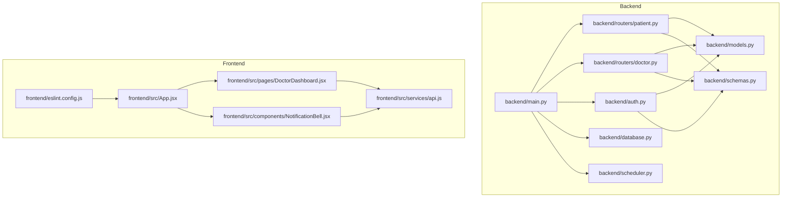
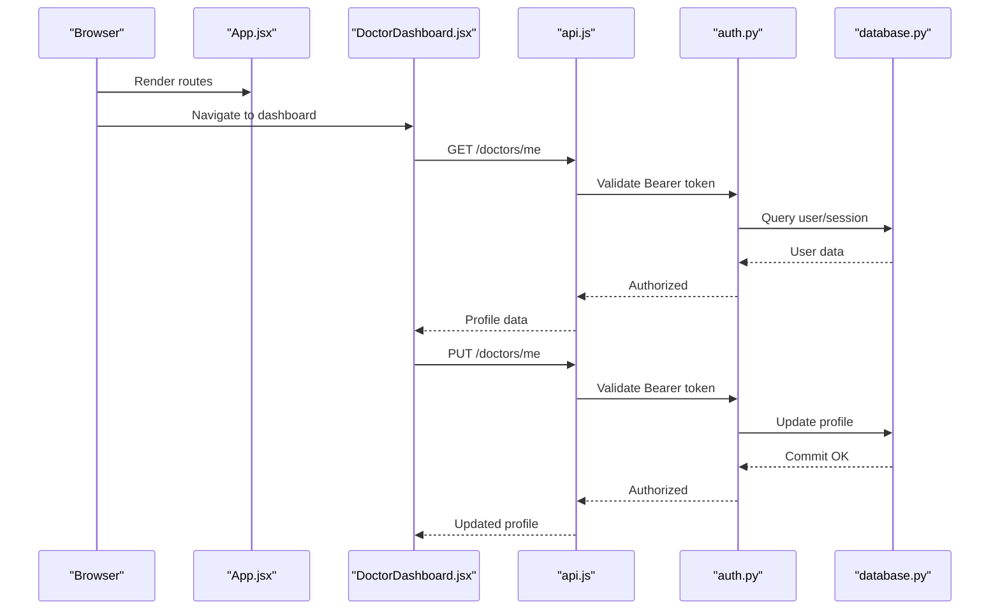
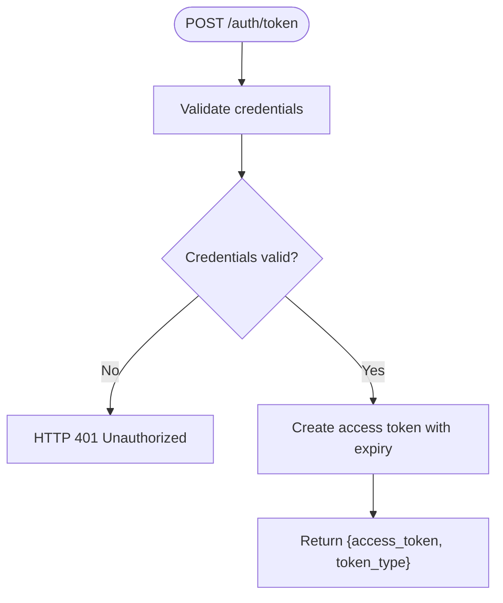
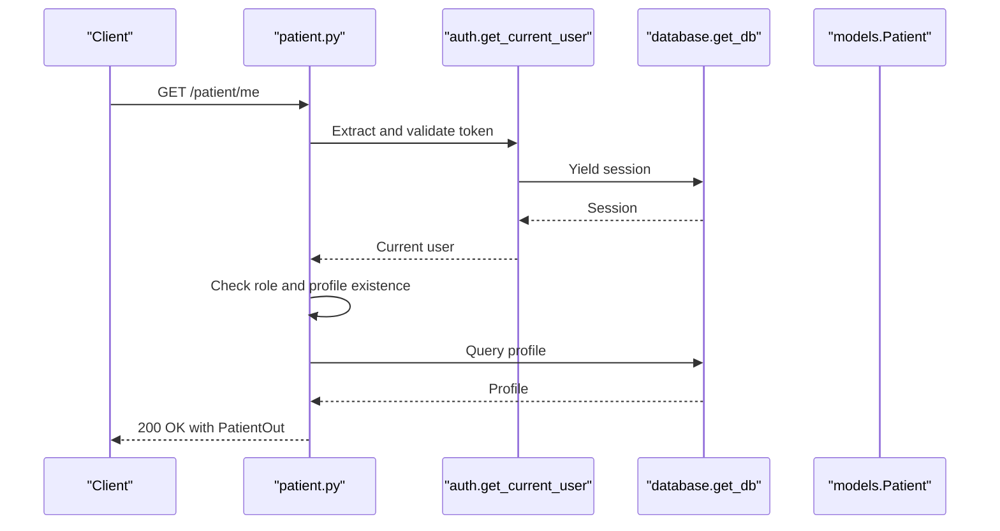
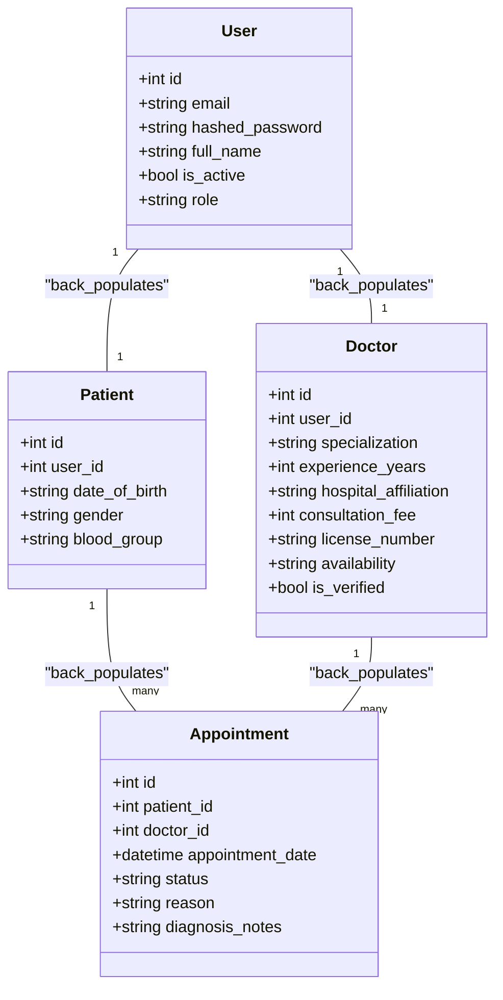
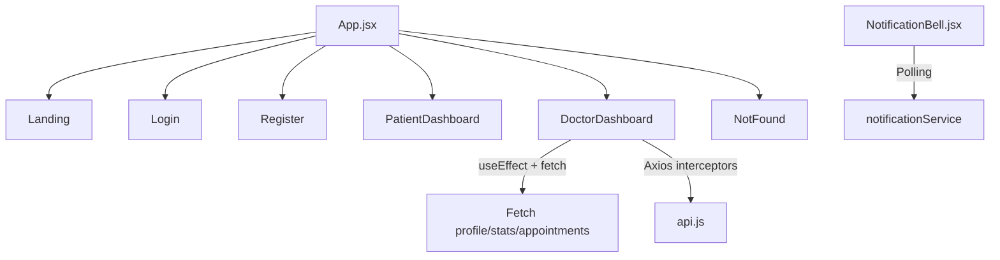
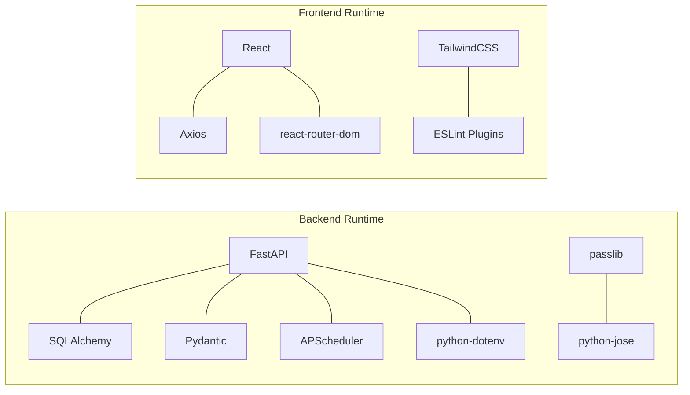

# Coding Standards

<cite>
**Referenced Files in This Document**
- [backend/main.py](file://backend/main.py)
- [backend/models.py](file://backend/models.py)
- [backend/schemas.py](file://backend/schemas.py)
- [backend/auth.py](file://backend/auth.py)
- [backend/routers/patient.py](file://backend/routers/patient.py)
- [backend/routers/doctor.py](file://backend/routers/doctor.py)
- [backend/database.py](file://backend/database.py)
- [backend/scheduler.py](file://backend/scheduler.py)
- [frontend/src/App.jsx](file://frontend/src/App.jsx)
- [frontend/src/pages/DoctorDashboard.jsx](file://frontend/src/pages/DoctorDashboard.jsx)
- [frontend/src/components/NotificationBell.jsx](file://frontend/src/components/NotificationBell.jsx)
- [frontend/src/services/api.js](file://frontend/src/services/api.js)
- [frontend/eslint.config.js](file://frontend/eslint.config.js)
- [frontend/package.json](file://frontend/package.json)
- [requirements.txt](file://requirements.txt)
</cite>

## Table of Contents
1. [Introduction](#introduction)
2. [Project Structure](#project-structure)
3. [Core Components](#core-components)
4. [Architecture Overview](#architecture-overview)
5. [Detailed Component Analysis](#detailed-component-analysis)
6. [Dependency Analysis](#dependency-analysis)
7. [Performance Considerations](#performance-considerations)
8. [Troubleshooting Guide](#troubleshooting-guide)
9. [Conclusion](#conclusion)
10. [Appendices](#appendices)

## Introduction
This document defines the coding standards for the SmartHealthCare development team. It consolidates Python PEP 8 style guidelines and JavaScript/React ESLint rules observed in the codebase, along with formatting, naming, readability, error handling, logging, and debugging conventions. It also provides examples of properly formatted code via file references and diagrams.

## Project Structure
SmartHealthCare follows a clear separation between a Python FastAPI backend and a React/Vite frontend. Backend modules include routing, models, schemas, authentication, and database utilities. Frontend modules include pages, components, services, and linting configuration.

**Diagram sources**
- [backend/main.py](file://backend/main.py#L1-L61)
- [backend/routers/patient.py](file://backend/routers/patient.py#L1-L107)
- [backend/routers/doctor.py](file://backend/routers/doctor.py#L1-L120)
- [backend/auth.py](file://backend/auth.py#L1-L120)
- [backend/database.py](file://backend/database.py#L1-L22)
- [backend/models.py](file://backend/models.py#L1-L110)
- [backend/schemas.py](file://backend/schemas.py#L1-L236)
- [backend/scheduler.py](file://backend/scheduler.py)
- [frontend/src/App.jsx](file://frontend/src/App.jsx#L1-L28)
- [frontend/src/pages/DoctorDashboard.jsx](file://frontend/src/pages/DoctorDashboard.jsx#L1-L698)
- [frontend/src/components/NotificationBell.jsx](file://frontend/src/components/NotificationBell.jsx#L1-L64)
- [frontend/src/services/api.js](file://frontend/src/services/api.js#L1-L25)
- [frontend/eslint.config.js](file://frontend/eslint.config.js#L1-L39)

**Section sources**
- [backend/main.py](file://backend/main.py#L1-L61)
- [frontend/src/App.jsx](file://frontend/src/App.jsx#L1-L28)

## Core Components
- Backend entrypoint initializes FastAPI, logging, CORS, and includes routers.
- Authentication module implements password hashing, JWT creation, token validation, and protected routes.
- SQLAlchemy models define the domain entities and relationships.
- Pydantic schemas define request/response models and validation.
- Router modules expose REST endpoints with proper status codes and error handling.
- Database module configures engine, sessions, and dependency injection.
- Scheduler module manages background tasks.
- Frontend App composes routes and page components.
- DoctorDashboard orchestrates state, effects, and service interactions.
- NotificationBell demonstrates polling and local state management.
- API service centralizes base URL and auth token injection.

**Section sources**
- [backend/main.py](file://backend/main.py#L1-L61)
- [backend/auth.py](file://backend/auth.py#L1-L120)
- [backend/models.py](file://backend/models.py#L1-L110)
- [backend/schemas.py](file://backend/schemas.py#L1-L236)
- [backend/routers/patient.py](file://backend/routers/patient.py#L1-L107)
- [backend/routers/doctor.py](file://backend/routers/doctor.py#L1-L120)
- [backend/database.py](file://backend/database.py#L1-L22)
- [frontend/src/App.jsx](file://frontend/src/App.jsx#L1-L28)
- [frontend/src/pages/DoctorDashboard.jsx](file://frontend/src/pages/DoctorDashboard.jsx#L1-L698)
- [frontend/src/components/NotificationBell.jsx](file://frontend/src/components/NotificationBell.jsx#L1-L64)
- [frontend/src/services/api.js](file://frontend/src/services/api.js#L1-L25)

## Architecture Overview
The system uses FastAPI for backend APIs, SQLAlchemy for ORM, Pydantic for data modeling, and React for the frontend. Authentication relies on JWT tokens stored in localStorage and injected via Axios interceptors. The frontend communicates with the backend through typed services.

**Diagram sources**
- [frontend/src/App.jsx](file://frontend/src/App.jsx#L1-L28)
- [frontend/src/pages/DoctorDashboard.jsx](file://frontend/src/pages/DoctorDashboard.jsx#L1-L698)
- [frontend/src/services/api.js](file://frontend/src/services/api.js#L1-L25)
- [backend/auth.py](file://backend/auth.py#L1-L120)
- [backend/database.py](file://backend/database.py#L1-L22)

## Detailed Component Analysis

### Backend: Authentication and Token Management
- Password hashing uses pbkdf2_sha256 via passlib.
- JWT encoding/decoding uses python-jose.
- Token endpoint validates credentials and issues bearer tokens.
- Protected endpoints depend on oauth2_scheme to extract and validate tokens.
- Logging is used for registration, profile creation, and errors.

**Diagram sources**
- [backend/auth.py](file://backend/auth.py#L106-L120)

**Section sources**
- [backend/auth.py](file://backend/auth.py#L1-L120)
- [requirements.txt](file://requirements.txt#L1-L14)

### Backend: Patient and Doctor Routers
- Enforce role-based access checks.
- Use Pydantic schemas for request/response validation.
- Return appropriate HTTP status codes (403/404/400) on failures.
- Centralize database session management via dependency.

**Diagram sources**
- [backend/routers/patient.py](file://backend/routers/patient.py#L11-L25)
- [backend/auth.py](file://backend/auth.py#L39-L55)
- [backend/database.py](file://backend/database.py#L16-L22)
- [backend/models.py](file://backend/models.py#L20-L31)

**Section sources**
- [backend/routers/patient.py](file://backend/routers/patient.py#L1-L107)
- [backend/routers/doctor.py](file://backend/routers/doctor.py#L1-L120)
- [backend/schemas.py](file://backend/schemas.py#L1-L236)
- [backend/models.py](file://backend/models.py#L1-L110)

### Backend: Data Models and Schemas
- SQLAlchemy models define tables and relationships.
- Pydantic models define serialization/deserialization and validation.
- Config(from_attributes=True) enables ORM-to-JSON conversion.

**Diagram sources**
- [backend/models.py](file://backend/models.py#L6-L110)

**Section sources**
- [backend/models.py](file://backend/models.py#L1-L110)
- [backend/schemas.py](file://backend/schemas.py#L1-L236)

### Frontend: App Routing and Pages
- App.jsx composes routes for landing, login, register, dashboards, and not-found.
- DoctorDashboard.jsx manages state, effects, and service interactions.
- NotificationBell.jsx demonstrates polling and local state toggling.

**Diagram sources**
- [frontend/src/App.jsx](file://frontend/src/App.jsx#L1-L28)
- [frontend/src/pages/DoctorDashboard.jsx](file://frontend/src/pages/DoctorDashboard.jsx#L1-L698)
- [frontend/src/components/NotificationBell.jsx](file://frontend/src/components/NotificationBell.jsx#L1-L64)
- [frontend/src/services/api.js](file://frontend/src/services/api.js#L1-L25)

**Section sources**
- [frontend/src/App.jsx](file://frontend/src/App.jsx#L1-L28)
- [frontend/src/pages/DoctorDashboard.jsx](file://frontend/src/pages/DoctorDashboard.jsx#L1-L698)
- [frontend/src/components/NotificationBell.jsx](file://frontend/src/components/NotificationBell.jsx#L1-L64)
- [frontend/src/services/api.js](file://frontend/src/services/api.js#L1-L25)

## Dependency Analysis
- Backend depends on FastAPI, SQLAlchemy, Pydantic, passlib, python-jose, APScheduler, and python-dotenv.
- Frontend depends on React, React Router, Axios, TailwindCSS, and ESLint plugins.

**Diagram sources**
- [requirements.txt](file://requirements.txt#L1-L14)
- [frontend/package.json](file://frontend/package.json#L1-L35)

**Section sources**
- [requirements.txt](file://requirements.txt#L1-L14)
- [frontend/package.json](file://frontend/package.json#L1-L35)

## Performance Considerations
- Use database pagination (skip/limit) in routers to avoid large payloads.
- Batch requests where possible (e.g., Promise.all in frontend).
- Debounce or throttle polling intervals for notifications.
- Prefer lazy loading for heavy components.
- Minimize re-renders by structuring state updates carefully.

## Troubleshooting Guide
- Authentication failures: Verify token presence and validity; check tokenUrl and headers.
- Database errors: Ensure sessions are yielded and closed; rollback on exceptions.
- CORS errors: Confirm allowed origins and credentials configuration.
- Frontend network errors: Inspect Axios interceptors and baseURL.

**Section sources**
- [backend/auth.py](file://backend/auth.py#L106-L120)
- [backend/database.py](file://backend/database.py#L16-L22)
- [backend/main.py](file://backend/main.py#L19-L32)
- [frontend/src/services/api.js](file://frontend/src/services/api.js#L1-L25)

## Conclusion
These standards unify backend and frontend practices across the SmartHealthCare project. Adhering to them ensures consistent style, robust error handling, maintainable code, and predictable behavior across modules.

## Appendices

### Python PEP 8 Style Guidelines
- Imports
  - Standard library first, third-party second, local/future imports third.
  - Separate logical groups with blank lines.
  - Example reference: [backend/main.py](file://backend/main.py#L1-L11)
- Variable Naming
  - Use snake_case for variables and functions.
  - Use PascalCase for class names.
  - Example reference: [backend/models.py](file://backend/models.py#L6-L110)
- Function Definitions
  - Keep functions focused; use descriptive names.
  - Use type hints where applicable.
  - Example reference: [backend/auth.py](file://backend/auth.py#L23-L37)
- Class Structures
  - Define Pydantic models with Config(from_attributes=True).
  - Example reference: [backend/schemas.py](file://backend/schemas.py#L18-L20)
- Formatting and Readability
  - Indentation: 4 spaces per level.
  - Line length: Limit to 79–100 characters.
  - Blank lines: One blank line around top-level functions/classes.
  - Example reference: [backend/main.py](file://backend/main.py#L1-L61)
- Comments and Docstrings
  - Module-level docstrings for packages/modules.
  - Inline comments sparingly; prefer self-documenting code.
  - Example reference: [backend/main.py](file://backend/main.py#L46-L56)
- Logging
  - Use structured logging with level, name, and message format.
  - Example reference: [backend/main.py](file://backend/main.py#L6-L11), [backend/auth.py](file://backend/auth.py#L57-L104)
- Error Handling
  - Raise HTTPException with appropriate status codes.
  - Rollback database transactions on failure.
  - Example reference: [backend/auth.py](file://backend/auth.py#L81-L84), [backend/routers/patient.py](file://backend/routers/patient.py#L16-L21)

### JavaScript/React ESLint Rules Observed
- Configuration
  - Recommended base rules plus React, JSX runtime, and React Hooks recommended rules.
  - React version setting and refresh plugin configured.
  - Example reference: [frontend/eslint.config.js](file://frontend/eslint.config.js#L7-L38)
- Component Structure
  - Functional components with hooks.
  - Example reference: [frontend/src/pages/DoctorDashboard.jsx](file://frontend/src/pages/DoctorDashboard.jsx#L10-L419)
- Prop Validation and Types
  - Use TypeScript types where applicable (as configured).
  - Example reference: [frontend/package.json](file://frontend/package.json#L19-L32)
- State Management Patterns
  - useState and useEffect for local state and side effects.
  - Example reference: [frontend/src/pages/DoctorDashboard.jsx](file://frontend/src/pages/DoctorDashboard.jsx#L11-L32)
- Hook Usage
  - Place hooks at the top of functional components.
  - Example reference: [frontend/src/pages/DoctorDashboard.jsx](file://frontend/src/pages/DoctorDashboard.jsx#L1-L10)
- Formatting and Readability
  - Consistent indentation and spacing.
  - Example reference: [frontend/src/App.jsx](file://frontend/src/App.jsx#L9-L25)
- Comments and Documentation
  - Minimal inline comments; rely on clear function/component names.
  - Example reference: [frontend/src/components/NotificationBell.jsx](file://frontend/src/components/NotificationBell.jsx#L11-L21)

### Naming Conventions
- Files
  - Python: snake_case for modules and routers.
  - React: PascalCase for components (e.g., DoctorDashboard.jsx).
  - Example reference: [backend/routers/patient.py](file://backend/routers/patient.py#L1-L10), [frontend/src/pages/DoctorDashboard.jsx](file://frontend/src/pages/DoctorDashboard.jsx#L1-L10)
- Functions and Variables
  - snake_case for functions and variables.
  - Example reference: [backend/auth.py](file://backend/auth.py#L23-L37)
- Classes and Schemas
  - PascalCase for classes and Pydantic models.
  - Example reference: [backend/models.py](file://backend/models.py#L6-L110), [backend/schemas.py](file://backend/schemas.py#L6-L20)
- Constants
  - Use UPPER_CASE for constants.
  - Example reference: [backend/auth.py](file://backend/auth.py#L10-L13)

### Code Formatting Standards
- Python
  - Maximum line length: 79–100 characters.
  - Indentation: 4 spaces.
  - Blank lines: One blank line around top-level definitions.
  - Example reference: [backend/main.py](file://backend/main.py#L1-L61)
- JavaScript/React
  - Use configured ESLint rules for consistent formatting.
  - Example reference: [frontend/eslint.config.js](file://frontend/eslint.config.js#L26-L36)

### Comment Conventions
- Use inline comments sparingly; prefer clear naming and structure.
- Add module-level docstrings for major modules.
- Example reference: [backend/main.py](file://backend/main.py#L13-L17)

### Documentation Requirements
- Public APIs should include brief descriptions and parameter details.
- Example reference: [backend/main.py](file://backend/main.py#L58-L60)

### Examples of Properly Formatted Code
- Backend route with logging and error handling
  - Reference: [backend/auth.py](file://backend/auth.py#L60-L104)
- Pydantic model with ORM support
  - Reference: [backend/schemas.py](file://backend/schemas.py#L18-L20)
- React component with hooks and effects
  - Reference: [frontend/src/pages/DoctorDashboard.jsx](file://frontend/src/pages/DoctorDashboard.jsx#L30-L63)
- Axios service with interceptors
  - Reference: [frontend/src/services/api.js](file://frontend/src/services/api.js#L10-L22)