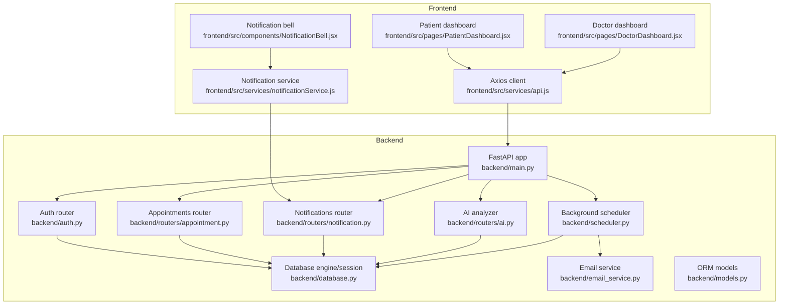
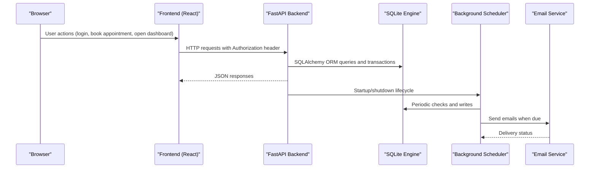
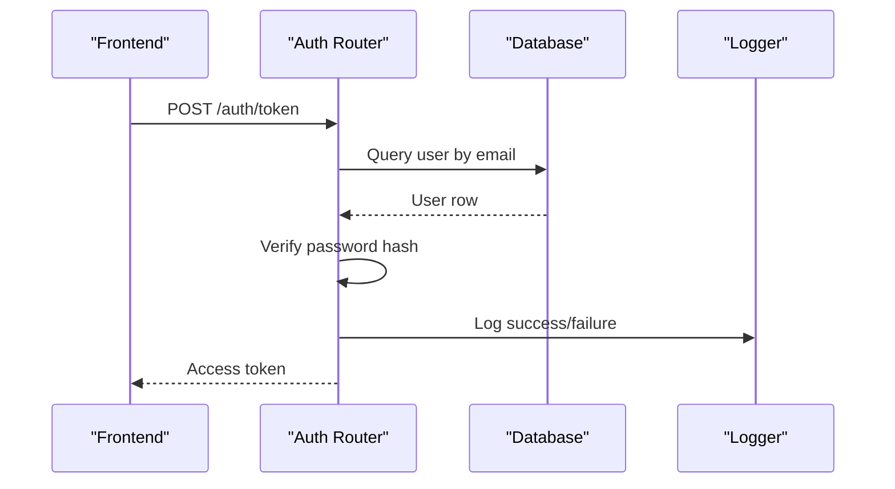
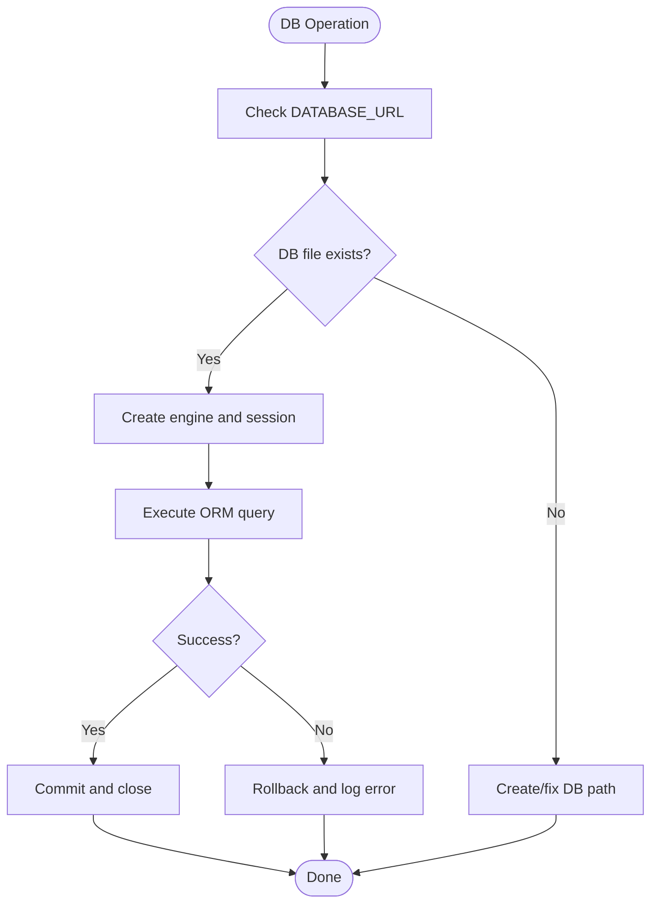
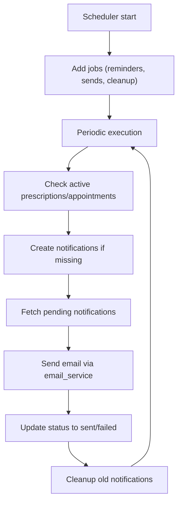
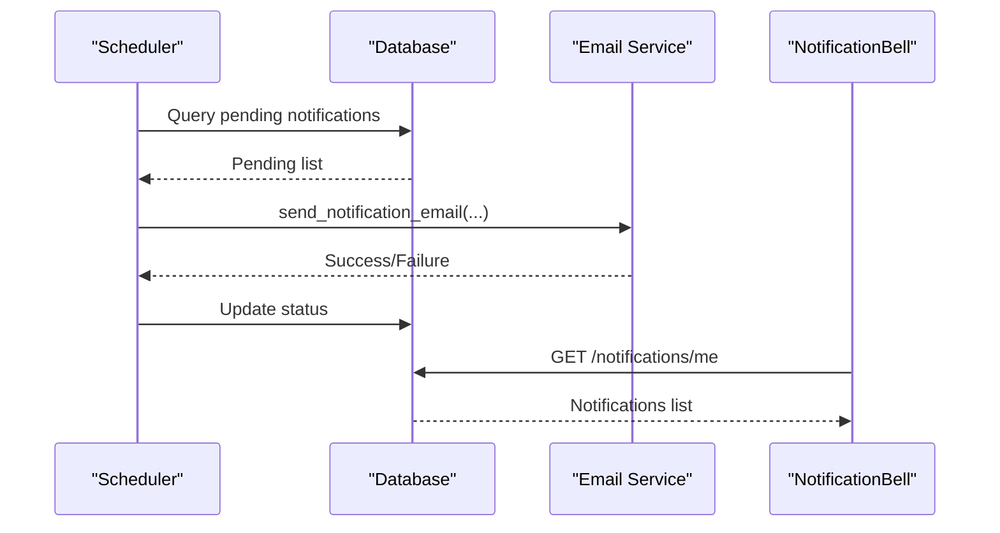
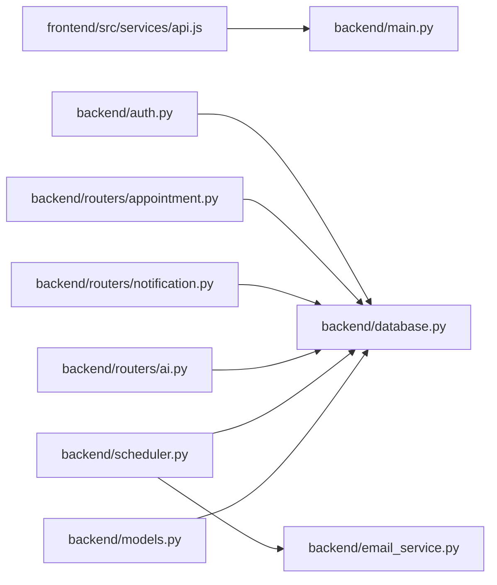

# Debugging Techniques

<cite>
**Referenced Files in This Document**
- [backend/main.py](file://backend/main.py)
- [backend/auth.py](file://backend/auth.py)
- [backend/database.py](file://backend/database.py)
- [backend/scheduler.py](file://backend/scheduler.py)
- [backend/email_service.py](file://backend/email_service.py)
- [backend/routers/appointment.py](file://backend/routers/appointment.py)
- [backend/routers/notification.py](file://backend/routers/notification.py)
- [backend/routers/ai.py](file://backend/routers/ai.py)
- [backend/models.py](file://backend/models.py)
- [frontend/src/services/api.js](file://frontend/src/services/api.js)
- [frontend/src/services/notificationService.js](file://frontend/src/services/notificationService.js)
- [frontend/src/components/NotificationBell.jsx](file://frontend/src/components/NotificationBell.jsx)
- [frontend/src/pages/PatientDashboard.jsx](file://frontend/src/pages/PatientDashboard.jsx)
- [frontend/src/pages/DoctorDashboard.jsx](file://frontend/src/pages/DoctorDashboard.jsx)
- [.env.example](file://.env.example)
- [app.log](file://app.log)
- [server.log](file://server.log)
</cite>

## Table of Contents
1. [Introduction](#introduction)
2. [Project Structure](#project-structure)
3. [Core Components](#core-components)
4. [Architecture Overview](#architecture-overview)
5. [Detailed Component Analysis](#detailed-component-analysis)
6. [Dependency Analysis](#dependency-analysis)
7. [Performance Considerations](#performance-considerations)
8. [Troubleshooting Guide](#troubleshooting-guide)
9. [Conclusion](#conclusion)
10. [Appendices](#appendices)

## Introduction
This document provides a comprehensive debugging guide for the SmartHealthCare development team. It covers frontend debugging with browser developer tools and React DevTools, backend debugging with FastAPI logging and database inspection, API debugging via Postman and curl, and strategies for authentication, database connectivity, and background task failures. It also includes log analysis techniques, error pattern recognition, performance bottleneck identification, and step-by-step workflows for common issues such as appointment scheduling failures, notification delivery problems, and AI analysis errors. Remote debugging and production investigation procedures are addressed alongside development environment troubleshooting.

## Project Structure
SmartHealthCare is a full-stack application with:
- Backend: FastAPI application exposing REST APIs, authentication, database ORM, background scheduler, and email service.
- Frontend: React SPA using Axios for API communication, routing, and UI components.

**Diagram sources**
- [backend/main.py](file://backend/main.py#L1-L61)
- [backend/auth.py](file://backend/auth.py#L1-L120)
- [backend/database.py](file://backend/database.py#L1-L22)
- [backend/routers/appointment.py](file://backend/routers/appointment.py#L1-L129)
- [backend/routers/notification.py](file://backend/routers/notification.py#L1-L177)
- [backend/routers/ai.py](file://backend/routers/ai.py#L1-L90)
- [backend/scheduler.py](file://backend/scheduler.py#L1-L317)
- [backend/email_service.py](file://backend/email_service.py#L1-L161)
- [backend/models.py](file://backend/models.py#L1-L110)
- [frontend/src/services/api.js](file://frontend/src/services/api.js#L1-L25)
- [frontend/src/services/notificationService.js](file://frontend/src/services/notificationService.js#L1-L117)
- [frontend/src/components/NotificationBell.jsx](file://frontend/src/components/NotificationBell.jsx#L1-L64)
- [frontend/src/pages/PatientDashboard.jsx](file://frontend/src/pages/PatientDashboard.jsx#L1-L674)
- [frontend/src/pages/DoctorDashboard.jsx](file://frontend/src/pages/DoctorDashboard.jsx#L1-L698)

**Section sources**
- [backend/main.py](file://backend/main.py#L1-L61)
- [frontend/src/services/api.js](file://frontend/src/services/api.js#L1-L25)

## Core Components
- FastAPI application with CORS middleware and logging configuration.
- Authentication module implementing password hashing, JWT creation, and protected routes.
- SQLAlchemy ORM models and session management for SQLite.
- Routers for appointments, notifications, and AI analysis.
- Background scheduler for generating reminders and sending notifications.
- Email service for notification delivery with environment-based configuration.
- Frontend Axios client with automatic bearer token injection and notification service helpers.

Key debugging hooks:
- Logging to files for backend events and errors.
- Request interceptors for frontend API calls.
- Notification polling and stats refresh mechanisms.

**Section sources**
- [backend/main.py](file://backend/main.py#L1-L61)
- [backend/auth.py](file://backend/auth.py#L1-L120)
- [backend/database.py](file://backend/database.py#L1-L22)
- [backend/scheduler.py](file://backend/scheduler.py#L1-L317)
- [backend/email_service.py](file://backend/email_service.py#L1-L161)
- [frontend/src/services/api.js](file://frontend/src/services/api.js#L1-L25)
- [frontend/src/services/notificationService.js](file://frontend/src/services/notificationService.js#L1-L117)

## Architecture Overview
The system integrates frontend and backend through REST APIs. Authentication tokens are stored in local storage and injected automatically. Notifications are generated by the scheduler and delivered via email or in-app UI.

**Diagram sources**
- [backend/main.py](file://backend/main.py#L1-L61)
- [backend/scheduler.py](file://backend/scheduler.py#L259-L317)
- [backend/email_service.py](file://backend/email_service.py#L98-L161)
- [frontend/src/services/api.js](file://frontend/src/services/api.js#L1-L25)

## Detailed Component Analysis

### Frontend Debugging with Browser Developer Tools and React DevTools
- Enable React DevTools in the browser and use the Components panel to inspect component props/state for PatientDashboard and DoctorDashboard.
- Use Network tab to observe API requests/responses:
  - Verify Authorization header presence for authenticated routes.
  - Inspect request payloads for booking appointments and AI analysis.
  - Monitor response status codes and error messages.
- Console logging:
  - PatientDashboard logs appointment fetches and booking attempts.
  - NotificationBell polls stats and triggers dropdown updates.
- Local storage inspection:
  - Confirm token presence under Application > Storage > Local Storage for http://localhost:5173.

Recommended steps:
- Open DevTools, go to Network tab, filter by XHR/Fetch, reproduce the issue, and capture failing requests.
- Switch to the Console tab and reproduce the issue to capture thrown errors.
- Use the Elements tab to verify UI state changes after API calls.

**Section sources**
- [frontend/src/services/api.js](file://frontend/src/services/api.js#L1-L25)
- [frontend/src/pages/PatientDashboard.jsx](file://frontend/src/pages/PatientDashboard.jsx#L56-L114)
- [frontend/src/components/NotificationBell.jsx](file://frontend/src/components/NotificationBell.jsx#L11-L30)
- [frontend/src/services/notificationService.js](file://frontend/src/services/notificationService.js#L1-L117)

### Backend Debugging with FastAPI Logging and Database Inspection
- Logging:
  - Backend logs are written to a file with DEBUG level and structured format.
  - Inspect app.log for startup/shutdown events, scheduler runs, and error traces.
- Database:
  - SQLite engine configured for development; check sql_app.db existence and integrity.
  - Use a SQLite viewer or CLI to inspect tables and relationships defined in models.
- Authentication:
  - Registration and login endpoints log warnings/errors and roll back on exceptions.
- Routers:
  - Appointments and notifications endpoints include explicit checks and error responses.
- Scheduler:
  - Logs reminder generation and notification sending; handles failures gracefully.

Recommended steps:
- Tail the app.log during reproduction of issues to correlate timestamps with frontend actions.
- Use Python shell to query models and relationships for verification.
- Temporarily increase logging level to capture more details during investigations.

**Section sources**
- [backend/main.py](file://backend/main.py#L4-L11)
- [backend/database.py](file://backend/database.py#L1-L22)
- [backend/auth.py](file://backend/auth.py#L60-L120)
- [backend/routers/appointment.py](file://backend/routers/appointment.py#L12-L129)
- [backend/routers/notification.py](file://backend/routers/notification.py#L13-L177)
- [backend/scheduler.py](file://backend/scheduler.py#L51-L317)

### API Debugging Workflows with Postman and curl
- Authentication:
  - POST to auth endpoints to obtain tokens; include Authorization header for subsequent requests.
- Appointments:
  - GET /appointments/ to list appointments.
  - POST /appointments/ to book with proper payload and date formatting.
- Notifications:
  - GET /notifications/me with filters (type, read status, limit, offset).
  - GET /notifications/stats and /notifications/upcoming.
  - PATCH /notifications/{id}/read and DELETE /notifications/{id}.
- AI:
  - POST /ai/analyze with symptoms text.

Example curl commands:
- Login: curl -X POST http://localhost:8000/auth/token -H "Content-Type: application/x-www-form-urlencoded" -d "username=<email>&password=<password>"
- Book appointment: curl -X POST http://localhost:8000/appointments/ -H "Authorization: Bearer <token>" -H "Content-Type: application/json" -d '{"doctor_id":1,"appointment_date":"2025-04-01T10:00:00Z","reason":"Checkup"}'
- Fetch notifications: curl -X GET "http://localhost:8000/notifications/me?limit=50&is_read=false" -H "Authorization: Bearer <token>"

Automated testing:
- Use Postman collections to define environments and pre-request scripts injecting tokens.
- Add tests to assert status codes and response shapes.

**Section sources**
- [backend/auth.py](file://backend/auth.py#L106-L120)
- [backend/routers/appointment.py](file://backend/routers/appointment.py#L12-L37)
- [backend/routers/notification.py](file://backend/routers/notification.py#L13-L177)
- [backend/routers/ai.py](file://backend/routers/ai.py#L10-L88)
- [frontend/src/services/api.js](file://frontend/src/services/api.js#L1-L25)

### Authentication Issues Debugging
Common symptoms:
- 401 Unauthorized on protected routes.
- JWT decoding errors or invalid credentials.

Debug checklist:
- Verify token presence in localStorage and Authorization header injection.
- Confirm SECRET_KEY and ALGORITHM consistency.
- Check user existence and hashed passwords in DB.
- Review get_current_user flow and exception handling.

**Diagram sources**
- [backend/auth.py](file://backend/auth.py#L106-L120)
- [backend/auth.py](file://backend/auth.py#L60-L104)
- [backend/main.py](file://backend/main.py#L4-L11)

**Section sources**
- [backend/auth.py](file://backend/auth.py#L10-L120)
- [backend/database.py](file://backend/database.py#L1-L22)

### Database Connection Problems Debugging
Symptoms:
- Operational errors on queries.
- SQLite file not found or locked.

Debug checklist:
- Confirm SQLALCHEMY_DATABASE_URL points to a valid path.
- Ensure sql_app.db exists and is writable.
- Verify get_db yields sessions and closes them properly.
- Check for concurrent access and transaction rollbacks.

**Diagram sources**
- [backend/database.py](file://backend/database.py#L5-L22)

**Section sources**
- [backend/database.py](file://backend/database.py#L1-L22)
- [backend/models.py](file://backend/models.py#L1-L110)

### Background Task Failures Debugging
Symptoms:
- Missed notifications or reminders.
- Scheduler startup/shutdown errors.

Debug checklist:
- Inspect app.log for scheduler start/stop and job logs.
- Verify email configuration and credentials.
- Check job intervals and cron schedules.
- Validate notification status transitions (pending → sent/failed).

**Diagram sources**
- [backend/scheduler.py](file://backend/scheduler.py#L259-L317)
- [backend/email_service.py](file://backend/email_service.py#L98-L161)

**Section sources**
- [backend/scheduler.py](file://backend/scheduler.py#L1-L317)
- [backend/email_service.py](file://backend/email_service.py#L1-L161)

### Notification Delivery Problems Debugging
Symptoms:
- No in-app notifications despite pending entries.
- Emails not received.

Debug checklist:
- Verify notification creation in scheduler jobs.
- Check notification filtering and pagination limits.
- Inspect email configuration and credentials.
- Confirm user exists and has a valid email address.

**Diagram sources**
- [backend/scheduler.py](file://backend/scheduler.py#L185-L233)
- [backend/email_service.py](file://backend/email_service.py#L141-L161)
- [backend/routers/notification.py](file://backend/routers/notification.py#L13-L85)
- [frontend/src/components/NotificationBell.jsx](file://frontend/src/components/NotificationBell.jsx#L11-L30)

**Section sources**
- [backend/scheduler.py](file://backend/scheduler.py#L185-L233)
- [backend/email_service.py](file://backend/email_service.py#L1-L161)
- [backend/routers/notification.py](file://backend/routers/notification.py#L1-L177)
- [frontend/src/services/notificationService.js](file://frontend/src/services/notificationService.js#L1-L117)

### AI Analysis Errors Debugging
Symptoms:
- Empty or unexpected AI report.
- 500 errors on /ai/analyze.

Debug checklist:
- Validate request payload shape and symptoms text.
- Confirm authentication is enforced for the endpoint.
- Review mock logic and thresholds for risk level and suggestions.

**Section sources**
- [backend/routers/ai.py](file://backend/routers/ai.py#L10-L88)

### Step-by-Step Debugging Guides

#### Appointment Scheduling Failures
1. Reproduce in PatientDashboard: open booking modal, submit form.
2. Observe Network tab for POST /appointments/.
3. Check backend logs around the request.
4. Verify doctor exists and user role is patient.
5. Confirm date serialization and timezone handling.

**Section sources**
- [frontend/src/pages/PatientDashboard.jsx](file://frontend/src/pages/PatientDashboard.jsx#L85-L100)
- [backend/routers/appointment.py](file://backend/routers/appointment.py#L12-L37)
- [backend/auth.py](file://backend/auth.py#L39-L55)

#### Notification Delivery Problems
1. Trigger scheduler run or wait for periodic execution.
2. Inspect app.log for send_pending_notifications logs.
3. Verify email credentials and host/port.
4. Check notification status transitions and user existence.

**Section sources**
- [backend/scheduler.py](file://backend/scheduler.py#L185-L233)
- [backend/email_service.py](file://backend/email_service.py#L98-L161)
- [backend/routers/notification.py](file://backend/routers/notification.py#L13-L85)

#### AI Analysis Errors
1. Submit symptoms via PatientDashboard AI panel.
2. Capture request payload and response in Network tab.
3. Review backend logs for analyze_symptoms.
4. Validate request model and mock logic.

**Section sources**
- [frontend/src/pages/PatientDashboard.jsx](file://frontend/src/pages/PatientDashboard.jsx#L102-L114)
- [backend/routers/ai.py](file://backend/routers/ai.py#L10-L88)

### Remote Debugging and Production Investigation
- Enable structured logging in production and ship logs to centralized systems.
- Use environment variables for database URLs and email credentials (.env.example).
- Monitor scheduler logs for job failures and adjust intervals.
- For production DB, switch to PostgreSQL and verify connection pooling.

**Section sources**
- [.env.example](file://.env.example)
- [backend/main.py](file://backend/main.py#L4-L11)
- [backend/database.py](file://backend/database.py#L6-L7)

### Development Environment Troubleshooting
- Ensure backend and frontend ports match CORS origins and base URLs.
- Confirm Axios baseURL matches backend host/port.
- Verify local storage token availability and expiration.

**Section sources**
- [backend/main.py](file://backend/main.py#L19-L32)
- [frontend/src/services/api.js](file://frontend/src/services/api.js#L3-L8)

## Dependency Analysis
The backend modules depend on FastAPI, SQLAlchemy, APScheduler, and email libraries. Frontend depends on Axios and React ecosystem. Coupling is primarily through HTTP APIs and shared database models.

**Diagram sources**
- [frontend/src/services/api.js](file://frontend/src/services/api.js#L1-L25)
- [backend/main.py](file://backend/main.py#L1-L61)
- [backend/auth.py](file://backend/auth.py#L1-L120)
- [backend/database.py](file://backend/database.py#L1-L22)
- [backend/routers/appointment.py](file://backend/routers/appointment.py#L1-L129)
- [backend/routers/notification.py](file://backend/routers/notification.py#L1-L177)
- [backend/routers/ai.py](file://backend/routers/ai.py#L1-L90)
- [backend/scheduler.py](file://backend/scheduler.py#L1-L317)
- [backend/email_service.py](file://backend/email_service.py#L1-L161)
- [backend/models.py](file://backend/models.py#L1-L110)

**Section sources**
- [backend/main.py](file://backend/main.py#L1-L61)
- [frontend/src/services/api.js](file://frontend/src/services/api.js#L1-L25)

## Performance Considerations
- Minimize synchronous blocking in API handlers; offload heavy work to background tasks.
- Use pagination and filters for notification endpoints to reduce payload sizes.
- Optimize scheduler intervals to balance responsiveness and resource usage.
- Monitor database query counts and add indexes for frequently filtered fields.

## Troubleshooting Guide
- Authentication:
  - 401 errors: verify token presence and expiration; check JWT decode logs.
  - Registration conflicts: review duplicate email handling and rollback logs.
- Database:
  - Operational errors: confirm DB path and permissions; inspect ORM exceptions.
  - Transaction failures: check commit/rollback logs and constraints.
- Notifications:
  - Missing emails: validate EMAIL_ENABLED and credentials; review send errors.
  - UI not updating: ensure polling intervals and stats refresh.
- Scheduler:
  - Job failures: inspect scheduler logs and job-specific error blocks.
- Frontend:
  - Missing Authorization header: verify interceptor logic and token storage.
  - Network errors: capture request/response bodies and status codes.

**Section sources**
- [backend/auth.py](file://backend/auth.py#L60-L120)
- [backend/database.py](file://backend/database.py#L1-L22)
- [backend/scheduler.py](file://backend/scheduler.py#L185-L233)
- [backend/email_service.py](file://backend/email_service.py#L98-L161)
- [frontend/src/services/api.js](file://frontend/src/services/api.js#L10-L22)

## Conclusion
This guide consolidates practical debugging techniques across frontend, backend, and infrastructure layers. By leveraging structured logging, API inspection, and scheduler monitoring, teams can quickly isolate and resolve issues. Adopting the recommended workflows and troubleshooting steps will improve incident response and system reliability.

## Appendices

### Log Analysis Techniques
- Filter app.log by timestamps correlating with user actions.
- Look for INFO lines indicating scheduler activity and ERROR lines for failures.
- Use grep-like filters for specific endpoints or job names.

### Error Pattern Recognition
- Authentication failures: repeated 401 responses and credential validation logs.
- Database errors: OperationalError and IntegrityError traces.
- Scheduler failures: unhandled exceptions in job functions.

### Example Log Locations
- Backend application logs: app.log
- Additional server logs: server.log

**Section sources**
- [app.log](file://app.log)
- [server.log](file://server.log)