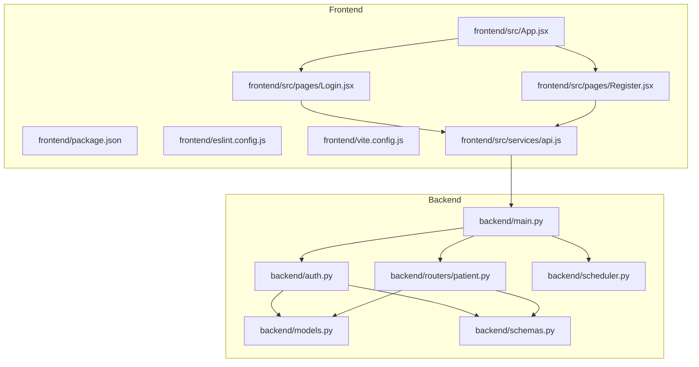
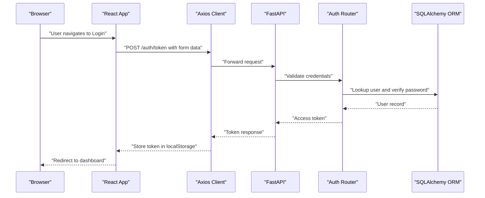
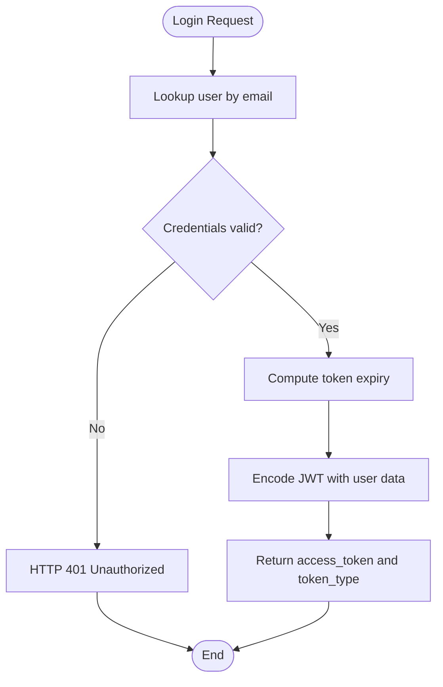
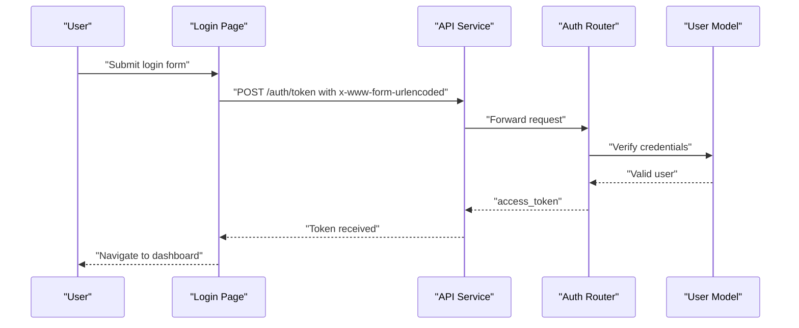
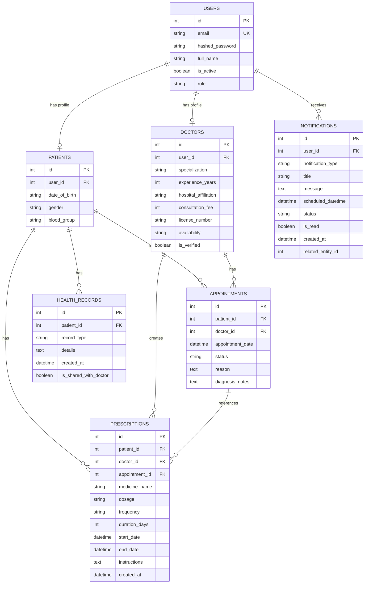
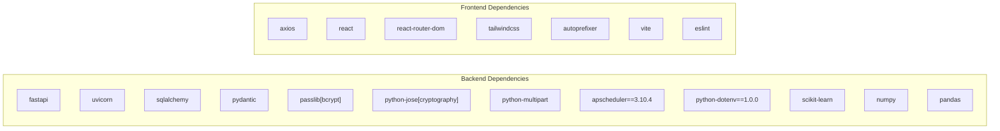

# Development Guidelines

<cite>
**Referenced Files in This Document**
- [requirements.txt](file://requirements.txt)
- [backend/main.py](file://backend/main.py)
- [backend/__init__.py](file://backend/__init__.py)
- [backend/models.py](file://backend/models.py)
- [backend/schemas.py](file://backend/schemas.py)
- [backend/auth.py](file://backend/auth.py)
- [backend/routers/patient.py](file://backend/routers/patient.py)
- [frontend/package.json](file://frontend/package.json)
- [frontend/eslint.config.js](file://frontend/eslint.config.js)
- [frontend/vite.config.js](file://frontend/vite.config.js)
- [frontend/src/App.jsx](file://frontend/src/App.jsx)
- [frontend/src/services/api.js](file://frontend/src/services/api.js)
- [frontend/src/pages/Login.jsx](file://frontend/src/pages/Login.jsx)
- [frontend/src/pages/Register.jsx](file://frontend/src/pages/Register.jsx)
- [test_notifications.py](file://test_notifications.py)
- [.env.example](file://.env.example)
</cite>

## Table of Contents
1. [Introduction](#introduction)
2. [Project Structure](#project-structure)
3. [Core Components](#core-components)
4. [Architecture Overview](#architecture-overview)
5. [Detailed Component Analysis](#detailed-component-analysis)
6. [Dependency Analysis](#dependency-analysis)
7. [Performance Considerations](#performance-considerations)
8. [Troubleshooting Guide](#troubleshooting-guide)
9. [Conclusion](#conclusion)
10. [Appendices](#appendices)

## Introduction
This document provides comprehensive development guidelines for contributors working on the SmartHealthCare project. It covers code style standards for Python and JavaScript, testing procedures, debugging techniques, performance optimization strategies, code review processes, contribution guidelines, development environment setup, IDE configuration recommendations, error handling patterns, logging best practices, monitoring approaches, and workflows for adding new features and maintaining code quality.

## Project Structure
The project follows a clear separation between a Python FastAPI backend and a React/Vite frontend. Backend modules include routing, authentication, database models, Pydantic schemas, and scheduling. Frontend modules include page components, service utilities for API communication, and ESLint configuration for linting.

**Diagram sources**
- [backend/main.py](file://backend/main.py#L1-L61)
- [backend/auth.py](file://backend/auth.py#L1-L120)
- [backend/routers/patient.py](file://backend/routers/patient.py#L1-L107)
- [backend/models.py](file://backend/models.py#L1-L110)
- [backend/schemas.py](file://backend/schemas.py#L1-L236)
- [frontend/src/App.jsx](file://frontend/src/App.jsx#L1-L28)
- [frontend/src/services/api.js](file://frontend/src/services/api.js#L1-L25)
- [frontend/src/pages/Login.jsx](file://frontend/src/pages/Login.jsx#L1-L104)
- [frontend/src/pages/Register.jsx](file://frontend/src/pages/Register.jsx#L1-L124)
- [frontend/package.json](file://frontend/package.json#L1-L35)
- [frontend/eslint.config.js](file://frontend/eslint.config.js#L1-L39)
- [frontend/vite.config.js](file://frontend/vite.config.js#L1-L8)

**Section sources**
- [backend/main.py](file://backend/main.py#L1-L61)
- [frontend/src/App.jsx](file://frontend/src/App.jsx#L1-L28)

## Core Components
- Backend entrypoint initializes logging, configures CORS, registers routers, and starts/stops the scheduler on app events.
- Authentication module handles password hashing, JWT creation, token validation, and user registration/logins.
- Patient router exposes endpoints for retrieving and updating the current patient profile, viewing health records, and creating health records.
- Frontend App routes define navigation between landing, login, register, patient dashboard, doctor dashboard, and not-found pages.
- API service centralizes base URL and Authorization header injection for all HTTP requests.
- ESLint configuration enforces React and JSX best practices for the frontend.

Key implementation references:
- Logging and CORS initialization: [backend/main.py](file://backend/main.py#L1-L32)
- Startup/shutdown hooks: [backend/main.py](file://backend/main.py#L46-L56)
- Authentication router and token handling: [backend/auth.py](file://backend/auth.py#L1-L120)
- Patient profile and records endpoints: [backend/routers/patient.py](file://backend/routers/patient.py#L1-L107)
- Frontend routing: [frontend/src/App.jsx](file://frontend/src/App.jsx#L1-L28)
- API client with interceptors: [frontend/src/services/api.js](file://frontend/src/services/api.js#L1-L25)
- ESLint configuration: [frontend/eslint.config.js](file://frontend/eslint.config.js#L1-L39)

**Section sources**
- [backend/main.py](file://backend/main.py#L1-L61)
- [backend/auth.py](file://backend/auth.py#L1-L120)
- [backend/routers/patient.py](file://backend/routers/patient.py#L1-L107)
- [frontend/src/App.jsx](file://frontend/src/App.jsx#L1-L28)
- [frontend/src/services/api.js](file://frontend/src/services/api.js#L1-L25)
- [frontend/eslint.config.js](file://frontend/eslint.config.js#L1-L39)

## Architecture Overview
The system uses a client-server architecture:
- Frontend (React) communicates with the backend (FastAPI) via Axios.
- Backend exposes REST endpoints organized under routers and uses SQLAlchemy ORM with Pydantic models for validation.
- Authentication relies on JWT tokens issued by the backend and stored in the browser’s local storage.

**Diagram sources**
- [frontend/src/pages/Login.jsx](file://frontend/src/pages/Login.jsx#L13-L47)
- [frontend/src/services/api.js](file://frontend/src/services/api.js#L10-L22)
- [backend/auth.py](file://backend/auth.py#L106-L120)
- [backend/auth.py](file://backend/auth.py#L57-L104)

## Detailed Component Analysis

### Backend Authentication Flow
- Password hashing and verification use passlib bcrypt context.
- JWT encoding/decoding uses python-jose with HS256 algorithm.
- Token endpoint validates credentials and issues access tokens with expiration.
- Registration endpoint creates users, hashes passwords, and initializes role-specific profiles.

**Diagram sources**
- [backend/auth.py](file://backend/auth.py#L106-L120)
- [backend/auth.py](file://backend/auth.py#L23-L37)

**Section sources**
- [backend/auth.py](file://backend/auth.py#L1-L120)

### Frontend Login and Registration Pages
- Login page collects email/password, posts to token endpoint, decodes token to infer role, and navigates accordingly.
- Registration page submits user data to backend and redirects to login on success.

**Diagram sources**
- [frontend/src/pages/Login.jsx](file://frontend/src/pages/Login.jsx#L13-L47)
- [frontend/src/services/api.js](file://frontend/src/services/api.js#L10-L22)
- [backend/auth.py](file://backend/auth.py#L106-L120)

**Section sources**
- [frontend/src/pages/Login.jsx](file://frontend/src/pages/Login.jsx#L1-L104)
- [frontend/src/pages/Register.jsx](file://frontend/src/pages/Register.jsx#L1-L124)
- [frontend/src/services/api.js](file://frontend/src/services/api.js#L1-L25)

### Database Models and Schemas
- Models define relational entities (users, patients, doctors, appointments, health records, notifications, prescriptions).
- Schemas define Pydantic models for request/response validation and serialization.

**Diagram sources**
- [backend/models.py](file://backend/models.py#L1-L110)
- [backend/schemas.py](file://backend/schemas.py#L1-L236)

**Section sources**
- [backend/models.py](file://backend/models.py#L1-L110)
- [backend/schemas.py](file://backend/schemas.py#L1-L236)

## Dependency Analysis
- Backend dependencies include FastAPI, Uvicorn, SQLAlchemy, Pydantic, passlib bcrypt, python-jose, APScheduler, python-dotenv, scikit-learn, numpy, pandas.
- Frontend dependencies include React, React DOM, react-router-dom, axios, TailwindCSS, PostCSS, Vite, and ESLint ecosystem.

**Diagram sources**
- [requirements.txt](file://requirements.txt#L1-L13)
- [frontend/package.json](file://frontend/package.json#L12-L33)

**Section sources**
- [requirements.txt](file://requirements.txt#L1-L13)
- [frontend/package.json](file://frontend/package.json#L1-L35)

## Performance Considerations
- Use pagination for endpoints returning large lists (e.g., upcoming reminders).
- Minimize ORM queries by selecting only required fields and using joined eager loading where appropriate.
- Cache frequently accessed data in memory or Redis for read-heavy operations.
- Optimize database indexes on foreign keys and frequently filtered columns (e.g., user_id, status, scheduled_datetime).
- Compress responses and enable gzip where supported.
- Monitor slow endpoints with middleware and logs; consider rate limiting for token endpoints.
- Keep frontend bundles optimized; avoid unnecessary re-renders by memoizing props and using React.memo/useMemo/useCallback.

[No sources needed since this section provides general guidance]

## Troubleshooting Guide
Common development issues and resolutions:
- CORS errors: Ensure frontend origins are included in backend CORS configuration.
- Token not applied: Verify Authorization interceptor injects Bearer token and localStorage contains a valid token.
- Database connection failures: Confirm database URL and credentials; initialize tables using provided scripts.
- ESLint errors: Run the lint script and fix reported issues; ensure editor integrates ESLint.
- Scheduler not starting: Check startup/shutdown event handlers and environment variables.

**Section sources**
- [backend/main.py](file://backend/main.py#L19-L32)
- [frontend/src/services/api.js](file://frontend/src/services/api.js#L10-L22)
- [frontend/eslint.config.js](file://frontend/eslint.config.js#L1-L39)

## Conclusion
These guidelines establish a consistent development process across the SmartHealthCare project. By adhering to the outlined code styles, testing procedures, debugging techniques, performance strategies, and contribution practices, contributors can maintain high-quality, reliable, and scalable code.

[No sources needed since this section summarizes without analyzing specific files]

## Appendices

### Code Style Standards

- Python (PEP 8)
  - Naming: Use snake_case for variables and functions; PascalCase for classes; UPPER_CASE for constants.
  - Imports: Standard library, third-party, local imports separated by blank lines.
  - Whitespace: No trailing whitespace; consistent indentation; single blank line around top-level functions and classes.
  - Docstrings: Use triple-double-quote docstrings for modules, classes, and functions.
  - Line length: Limit to 79 characters; allow up to 100 for readability where justified.
  - Type hints: Prefer explicit types for function signatures and return values.
  - Logging: Use structured logging with timestamps, logger name, level, and message format.

- JavaScript (ESLint)
  - Linting: Enforce recommended rules from @eslint/js, react, react-hooks, and react-refresh.
  - React: Use functional components with hooks; avoid class components.
  - Imports: Group external modules, internal modules, and sibling imports.
  - JSX: Keep JSX readable; avoid deeply nested structures.
  - Globals: Configure globals appropriately for browser environments.

**Section sources**
- [backend/main.py](file://backend/main.py#L6-L11)
- [frontend/eslint.config.js](file://frontend/eslint.config.js#L26-L36)
- [frontend/package.json](file://frontend/package.json#L19-L33)

### Testing Procedures
- Unit tests: Write isolated tests for individual functions and small units of logic.
- Integration tests: Test interactions between components (e.g., API endpoints and database).
- Test execution workflows:
  - Backend: Use pytest or unittest; run with coverage reporting.
  - Frontend: Use Vitest or Jest; run linting and tests via npm scripts.
- Example test script: A notification test script demonstrates how to exercise endpoints for creating prescriptions and notifications, fetching notifications, and retrieving stats.

**Section sources**
- [test_notifications.py](file://test_notifications.py#L1-L131)

### Debugging Techniques
- Backend:
  - Use logging statements at INFO/DEBUG/WARNING/ERROR levels.
  - Inspect request/response payloads and headers.
  - Validate JWT decoding and database transactions.
- Frontend:
  - Use React DevTools and browser network tab.
  - Verify Authorization header presence and token validity.
  - Check routing and state updates.

**Section sources**
- [backend/main.py](file://backend/main.py#L6-L11)
- [frontend/src/services/api.js](file://frontend/src/services/api.js#L10-L22)
- [frontend/src/pages/Login.jsx](file://frontend/src/pages/Login.jsx#L13-L47)

### Performance Optimization Strategies
- Backend:
  - Use database indexes on frequently queried columns.
  - Batch operations where possible.
  - Implement caching for repeated reads.
- Frontend:
  - Lazy load routes and components.
  - Debounce or throttle frequent actions.
  - Minimize re-renders with proper state management.

[No sources needed since this section provides general guidance]

### Code Review Processes
- Pull requests should include:
  - Clear descriptions of changes and rationale.
  - Passing tests and lint checks.
  - Updated documentation if applicable.
- Reviewers should verify correctness, performance, security, and adherence to style guides.

[No sources needed since this section provides general guidance]

### Contribution Guidelines
- Fork and branch from develop; keep branches focused and short-lived.
- Commit messages: Use imperative mood; reference issues.
- Rebase onto upstream regularly to reduce merge conflicts.
- Update requirements and package lockfiles when adding dependencies.

[No sources needed since this section provides general guidance]

### Development Environment Setup
- Backend:
  - Install dependencies from requirements.txt.
  - Set environment variables using .env.example as a template.
  - Run the server with Uvicorn using the application entrypoint.
- Frontend:
  - Install dependencies from package.json.
  - Start development server with Vite; lint with ESLint.
  - Configure Tailwind and PostCSS as needed.

**Section sources**
- [requirements.txt](file://requirements.txt#L1-L13)
- [.env.example](file://.env.example#L1-L13)
- [frontend/package.json](file://frontend/package.json#L6-L11)
- [frontend/vite.config.js](file://frontend/vite.config.js#L1-L8)

### IDE Configuration Recommendations
- Python:
  - Use Pylance/Pyright for type checking.
  - Enable black/isort for formatting and import sorting.
  - Configure linting with flake8 or ruff.
- JavaScript:
  - Use ESLint with React plugin and recommended configurations.
  - Enable Prettier for formatting.
  - Configure TypeScript support if using TSX.

[No sources needed since this section provides general guidance]

### Error Handling Patterns
- Centralized exception handling in FastAPI routers.
- Return meaningful HTTP status codes and error messages.
- Log exceptions with context and stack traces.

**Section sources**
- [backend/auth.py](file://backend/auth.py#L106-L120)
- [backend/auth.py](file://backend/auth.py#L60-L104)

### Logging Best Practices
- Use structured logging with consistent format.
- Include correlation IDs for request tracing.
- Separate log files per service if scaling horizontally.

**Section sources**
- [backend/main.py](file://backend/main.py#L6-L11)

### Monitoring Approaches
- Metrics: Track request latency, error rates, and throughput.
- Logs: Aggregate with ELK or similar stacks.
- Alerts: Notify on sustained errors or degraded performance.

[No sources needed since this section provides general guidance]

### Adding New Features and Extending Functionality
- Backend:
  - Define Pydantic schemas for new resources.
  - Create SQLAlchemy models and relationships.
  - Add routers and endpoints; apply authentication/authorization guards.
  - Write tests for new endpoints and business logic.
- Frontend:
  - Create new pages/components and integrate with routing.
  - Add or update services for API communication.
  - Ensure responsive design and accessibility.

**Section sources**
- [backend/schemas.py](file://backend/schemas.py#L1-L236)
- [backend/models.py](file://backend/models.py#L1-L110)
- [backend/routers/patient.py](file://backend/routers/patient.py#L1-L107)
- [frontend/src/App.jsx](file://frontend/src/App.jsx#L1-L28)
- [frontend/src/services/api.js](file://frontend/src/services/api.js#L1-L25)

### Examples of Common Development Workflows
- Feature branch to pull request with passing tests and lint checks.
- End-to-end login workflow: frontend posts credentials → backend validates → returns token → frontend stores token and navigates.
- Notification testing: use the provided script to create prescriptions and notifications, then fetch stats and upcoming reminders.

**Section sources**
- [frontend/src/pages/Login.jsx](file://frontend/src/pages/Login.jsx#L13-L47)
- [test_notifications.py](file://test_notifications.py#L14-L101)