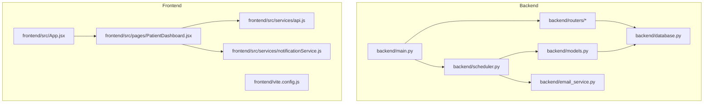
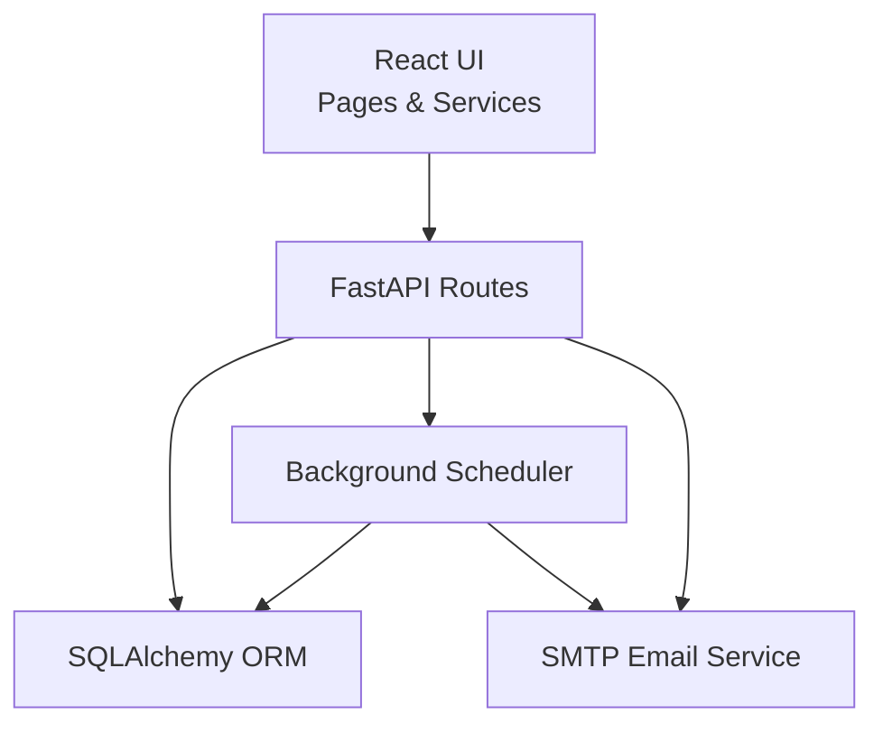
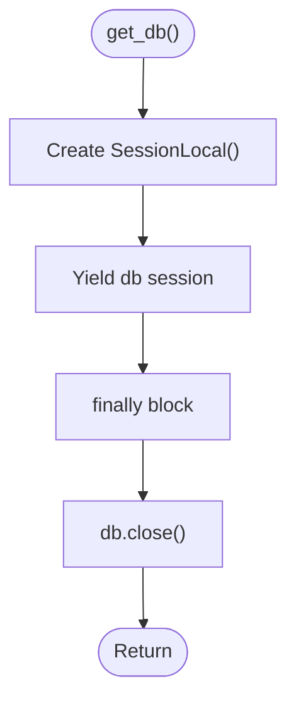
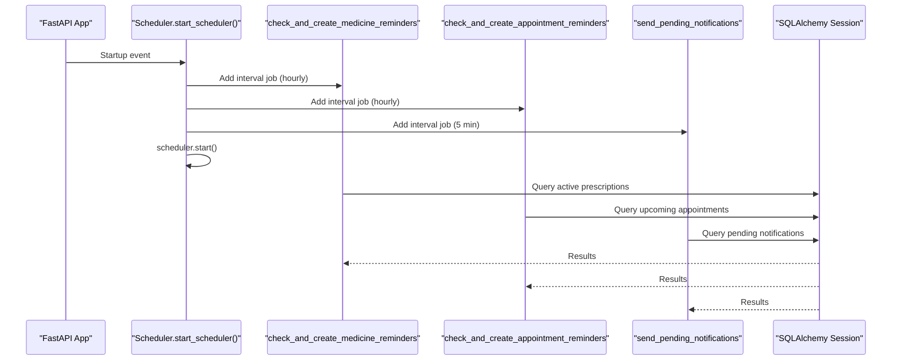
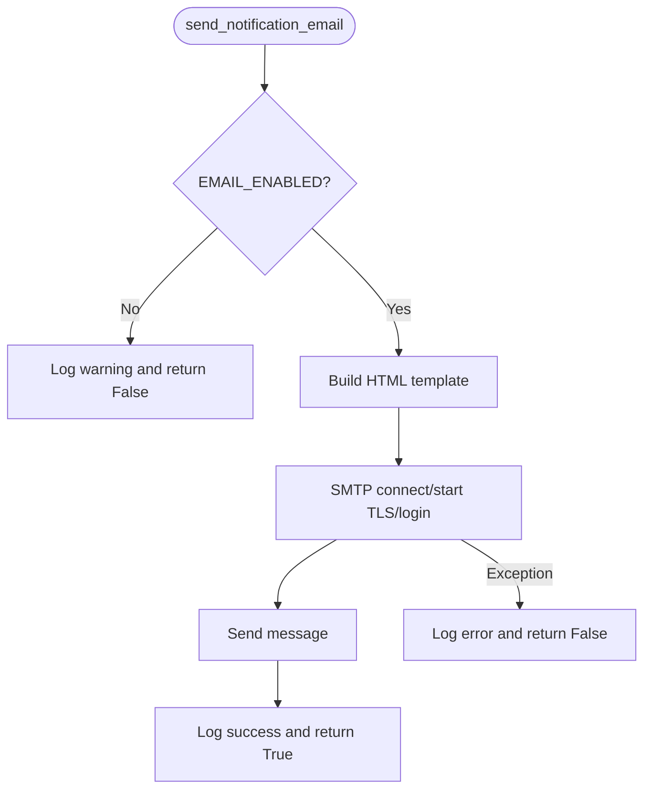
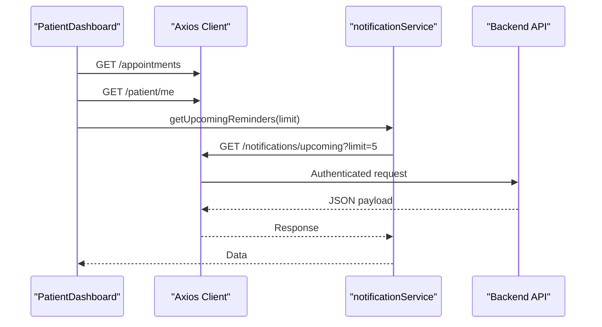
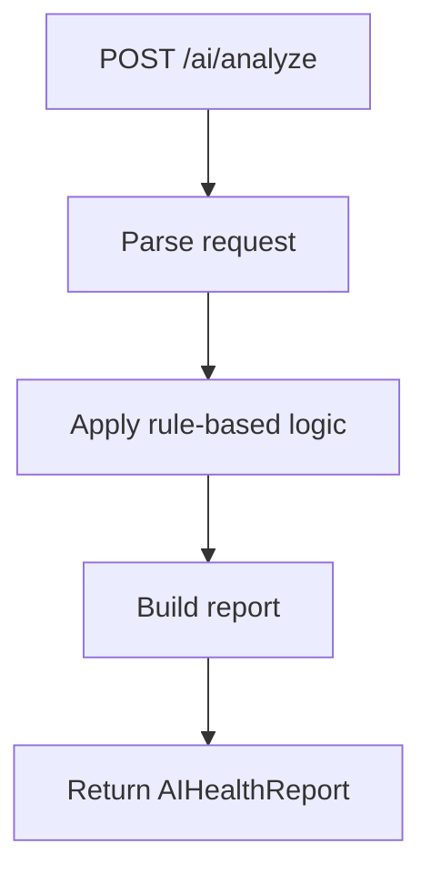

# Performance Optimization

<cite>
**Referenced Files in This Document**
- [backend/main.py](file://backend/main.py)
- [backend/database.py](file://backend/database.py)
- [backend/scheduler.py](file://backend/scheduler.py)
- [backend/email_service.py](file://backend/email_service.py)
- [backend/routers/patient.py](file://backend/routers/patient.py)
- [backend/routers/ai.py](file://backend/routers/ai.py)
- [backend/models.py](file://backend/models.py)
- [frontend/src/App.jsx](file://frontend/src/App.jsx)
- [frontend/src/services/api.js](file://frontend/src/services/api.js)
- [frontend/src/services/notificationService.js](file://frontend/src/services/notificationService.js)
- [frontend/src/pages/PatientDashboard.jsx](file://frontend/src/pages/PatientDashboard.jsx)
- [frontend/vite.config.js](file://frontend/vite.config.js)
- [frontend/package.json](file://frontend/package.json)
- [requirements.txt](file://requirements.txt)
- [.env.example](file://.env.example)
</cite>

## Table of Contents
1. [Introduction](#introduction)
2. [Project Structure](#project-structure)
3. [Core Components](#core-components)
4. [Architecture Overview](#architecture-overview)
5. [Detailed Component Analysis](#detailed-component-analysis)
6. [Dependency Analysis](#dependency-analysis)
7. [Performance Considerations](#performance-considerations)
8. [Troubleshooting Guide](#troubleshooting-guide)
9. [Conclusion](#conclusion)
10. [Appendices](#appendices)

## Introduction
This document provides performance optimization guidelines for the SmartHealthCare application. It covers backend strategies (database query optimization, connection pooling, caching, and background task scheduling), frontend improvements (lazy loading, bundle optimization, state management efficiency, and API call optimization), memory management practices, monitoring and profiling techniques, and scalability considerations. Concrete examples and measurement techniques are included to help teams quantify and track improvements.

## Project Structure
SmartHealthCare is a full-stack application with:
- Backend: FastAPI application exposing REST endpoints, SQLAlchemy ORM, APScheduler for background jobs, and email notifications.
- Frontend: React application using Vite, Axios for API communication, and modular service modules for API and notifications.



**Diagram sources**
- [backend/main.py](file://backend/main.py#L1-L61)
- [backend/database.py](file://backend/database.py#L1-L22)
- [backend/scheduler.py](file://backend/scheduler.py#L1-L317)
- [backend/email_service.py](file://backend/email_service.py#L1-L161)
- [backend/models.py](file://backend/models.py#L1-L110)
- [frontend/src/App.jsx](file://frontend/src/App.jsx#L1-L28)
- [frontend/src/services/api.js](file://frontend/src/services/api.js#L1-L25)
- [frontend/src/services/notificationService.js](file://frontend/src/services/notificationService.js#L1-L117)
- [frontend/src/pages/PatientDashboard.jsx](file://frontend/src/pages/PatientDashboard.jsx#L1-L674)
- [frontend/vite.config.js](file://frontend/vite.config.js#L1-L8)

**Section sources**
- [backend/main.py](file://backend/main.py#L1-L61)
- [frontend/src/App.jsx](file://frontend/src/App.jsx#L1-L28)

## Core Components
- Backend FastAPI app initializes CORS, includes routers, and starts/stops the background scheduler on events.
- Database module defines SQLite engine/session factory and a scoped generator for sessions.
- Scheduler module runs periodic tasks for reminders and notifications, with explicit commit/rollback and per-task session lifecycle.
- Email service encapsulates SMTP configuration and templated HTML emails.
- Frontend API client injects auth tokens and centralizes base URL configuration.
- Notification service wraps REST endpoints for fetching and managing notifications.
- AI router performs lightweight symptom analysis using rule-based logic.

Key performance-relevant observations:
- Database uses a single-threaded SQLite engine with a local session factory; production-grade deployments should consider connection pooling and a robust RDBMS.
- Scheduler tasks run at fixed intervals; ensure queries are indexed and avoid N+1 patterns.
- Frontend makes multiple synchronous API calls on dashboard mount; consider batching and caching.

**Section sources**
- [backend/main.py](file://backend/main.py#L13-L61)
- [backend/database.py](file://backend/database.py#L5-L22)
- [backend/scheduler.py](file://backend/scheduler.py#L259-L317)
- [backend/email_service.py](file://backend/email_service.py#L13-L22)
- [frontend/src/services/api.js](file://frontend/src/services/api.js#L3-L25)
- [frontend/src/services/notificationService.js](file://frontend/src/services/notificationService.js#L11-L57)
- [backend/routers/ai.py](file://backend/routers/ai.py#L10-L90)

## Architecture Overview
The system follows a typical layered architecture:
- Presentation layer: React frontend with page components and service modules.
- Application layer: FastAPI routes and background scheduler.
- Data layer: SQLAlchemy models and engine/session factory.



**Diagram sources**
- [backend/main.py](file://backend/main.py#L34-L44)
- [backend/scheduler.py](file://backend/scheduler.py#L259-L317)
- [backend/email_service.py](file://backend/email_service.py#L98-L161)
- [backend/models.py](file://backend/models.py#L1-L110)

## Detailed Component Analysis

### Backend Database Layer
- Engine and session factory are configured with SQLite; thread-safe access is enabled via connection arguments.
- The session generator yields a scoped session and closes it in a finally block.
- Recommendations:
  - Use a production database (PostgreSQL/MySQL) and configure connection pooling.
  - Add database query timeouts and retry policies.
  - Ensure proper indexing on frequently filtered columns (e.g., Notification.scheduled_datetime, User.email).



**Diagram sources**
- [backend/database.py](file://backend/database.py#L16-L22)

**Section sources**
- [backend/database.py](file://backend/database.py#L5-L22)

### Background Scheduler and Notifications
- Scheduler runs three primary jobs:
  - Medicine reminders creation every hour.
  - Appointment reminders creation every hour.
  - Pending notifications dispatch every 5 minutes.
  - Old notifications cleanup daily at 2 AM.
- Each job manages its own database session lifecycle and logs errors with rollback semantics.
- Recommendations:
  - Add database indexes on Notification.scheduled_datetime, Notification.status, and Notification.user_id.
  - Consider partitioning or archiving old notifications to keep the table size manageable.
  - Introduce concurrency limits and job deduplication to prevent overlapping executions.



**Diagram sources**
- [backend/main.py](file://backend/main.py#L46-L56)
- [backend/scheduler.py](file://backend/scheduler.py#L259-L317)

**Section sources**
- [backend/scheduler.py](file://backend/scheduler.py#L51-L257)

### Email Service
- SMTP configuration is loaded from environment variables with a guard to disable email if credentials are missing.
- HTML email templates are generated dynamically and sent via SMTP.
- Recommendations:
  - Use asynchronous email sending or a dedicated queue to avoid blocking scheduler threads.
  - Implement exponential backoff and dead-letter handling for transient failures.
  - Consider using a transactional email provider SDK for reliability.



**Diagram sources**
- [backend/email_service.py](file://backend/email_service.py#L109-L161)

**Section sources**
- [backend/email_service.py](file://backend/email_service.py#L13-L22)
- [.env.example](file://.env.example#L1-L13)

### Frontend API and Notification Service
- Axios client sets base URL and attaches Authorization header from localStorage.
- Notification service exposes typed methods for fetching, marking read, and deleting notifications.
- Recommendations:
  - Implement request/response interceptors for global error handling and retry logic.
  - Add caching for repeated reads (e.g., user profile, upcoming reminders) with cache invalidation on write.
  - Debounce or throttle frequent polling to reduce network overhead.



**Diagram sources**
- [frontend/src/pages/PatientDashboard.jsx](file://frontend/src/pages/PatientDashboard.jsx#L35-L83)
- [frontend/src/services/notificationService.js](file://frontend/src/services/notificationService.js#L45-L57)
- [frontend/src/services/api.js](file://frontend/src/services/api.js#L10-L22)

**Section sources**
- [frontend/src/services/api.js](file://frontend/src/services/api.js#L3-L25)
- [frontend/src/services/notificationService.js](file://frontend/src/services/notificationService.js#L11-L117)
- [frontend/src/pages/PatientDashboard.jsx](file://frontend/src/pages/PatientDashboard.jsx#L35-L83)

### AI Analysis Endpoint
- Lightweight rule-based symptom analysis endpoint returns structured suggestions.
- Recommendations:
  - Move to a hosted inference service or containerized model for heavy workloads.
  - Cache frequent requests and normalize inputs to reduce computation.
  - Add rate limiting and circuit breaker logic.



**Diagram sources**
- [backend/routers/ai.py](file://backend/routers/ai.py#L10-L90)

**Section sources**
- [backend/routers/ai.py](file://backend/routers/ai.py#L10-L90)

## Dependency Analysis
- Backend depends on FastAPI, SQLAlchemy, APScheduler, and python-dotenv.
- Frontend depends on React, React Router, Axios, and Vite.

```mermaid
graph LR
FE["frontend/package.json"] --> AX["axios"]
FE --> RR["react-router-dom"]
FE --> RV["react", "react-dom"]
BE["requirements.txt"] --> FA["fastapi"]
BE --> UV["uvicorn"]
BE --> SA["sqlalchemy"]
BE --> AP["apscheduler"]
BE --> DJ["python-dotenv"]
```

**Diagram sources**
- [frontend/package.json](file://frontend/package.json#L12-L34)
- [requirements.txt](file://requirements.txt#L1-L14)

**Section sources**
- [frontend/package.json](file://frontend/package.json#L12-L34)
- [requirements.txt](file://requirements.txt#L1-L14)

## Performance Considerations

### Backend Optimization Strategies
- Database query optimization
  - Add database indexes on Notification.scheduled_datetime, Notification.status, Notification.user_id, and User.email.
  - Replace N+1 queries in scheduler tasks by using joined eager loading or bulk operations.
  - Use pagination for notification lists and limit result sets.
- Connection pooling
  - Switch from SQLite to PostgreSQL/MySQL and configure pool_size and max_overflow.
  - Set connection timeouts and health checks.
- Caching mechanisms
  - Cache frequently accessed data (e.g., user profiles, upcoming reminders) with short TTLs.
  - Use Redis/Memcached for distributed caching in clustered environments.
- Background task scheduling efficiency
  - Ensure jobs are idempotent and include deduplication keys.
  - Batch writes and minimize round-trips inside loops.
  - Monitor job durations and adjust intervals based on workload.
- Memory management and resource cleanup
  - Always commit/rollback and close sessions in schedulers.
  - Avoid retaining large objects in long-lived scheduler contexts.
- Monitoring and profiling
  - Instrument endpoints with metrics (response time, throughput, error rates).
  - Use database query analyzers to identify slow queries.
  - Profile Python code with cProfile or Py-Spy.

### Frontend Optimization Strategies
- Component lazy loading
  - Lazy-load route components using React.lazy and Suspense to reduce initial bundle size.
- Bundle optimization
  - Enable production builds and tree-shaking; remove unused dependencies.
  - Analyze bundle composition with Vite’s built-in analyzer plugin.
- State management efficiency
  - Normalize state and avoid deep re-renders by memoizing derived data.
  - Limit global state scope; use local component state where appropriate.
- API call optimization
  - Implement request/response interceptors for retries and error handling.
  - Cache responses with ETag/Last-Modified or in-memory caches keyed by URL and params.
  - Debounce rapid user actions (e.g., search) to reduce network churn.

### AI Analysis Processing
- Offload heavy inference to external services or containers.
- Use batch processing for multiple requests and cache predictions.
- Apply rate limiting and circuit breakers to protect downstream systems.

### Notification System Efficiency
- Index Notification fields and paginate queries.
- Use asynchronous email delivery and retry queues.
- Implement notification read receipts and background cleanup.

### Real-Time Data Updates
- Integrate WebSockets or Server-Sent Events for live updates.
- Use efficient pub/sub patterns and message batching.

### Scalability and Load Balancing
- Horizontal scaling: deploy multiple backend instances behind a load balancer.
- Stateless design: store sessions/cookies appropriately; persist user preferences.
- CDN for static assets; optimize image delivery.

### Performance Testing Methodologies
- Load testing: simulate concurrent users and measure response percentiles.
- A/B testing: compare performance after changes.
- Observability: collect latency, error rates, and saturation metrics.

## Troubleshooting Guide
- Scheduler not starting or stopping
  - Verify startup/shutdown event hooks and scheduler logs.
  - Ensure environment variables for email are configured if needed.
- Slow database queries
  - Review query plans and add missing indexes.
  - Reduce result sizes and enable pagination.
- Frontend API failures
  - Check Authorization header injection and token validity.
  - Inspect network tab for failed requests and error payloads.
- Email delivery issues
  - Confirm SMTP credentials and network connectivity.
  - Implement retry/backoff and dead-letter handling.

**Section sources**
- [backend/main.py](file://backend/main.py#L46-L56)
- [backend/scheduler.py](file://backend/scheduler.py#L259-L317)
- [backend/email_service.py](file://backend/email_service.py#L109-L161)
- [frontend/src/services/api.js](file://frontend/src/services/api.js#L10-L22)

## Conclusion
By focusing on database indexing, connection pooling, caching, and efficient background scheduling, the backend can achieve significant performance gains. On the frontend, lazy loading, bundle optimization, and state management improvements will enhance responsiveness. Implementing monitoring, profiling, and robust error handling ensures sustainable performance as the application scales. Adopting the recommendations above will improve user experience and operational efficiency.

## Appendices

### Concrete Examples and Measurement Techniques
- Example: Add database indexes for Notification.scheduled_datetime and Notification.status to speed up reminder queries.
- Measurement: Track 95th percentile response time for /notifications/upcoming and /ai/analyze endpoints.
- Example: Introduce Redis cache for user profile and upcoming reminders with TTL of 5–10 minutes.
- Measurement: Compare cache hit ratio and latency before/after enabling caching.
- Example: Switch to PostgreSQL with pool_size=20 and max_overflow=30 for production.
- Measurement: Monitor connection pool utilization and query execution times.
- Example: Enable Vite analyzer to identify large dependencies and remove unused ones.
- Measurement: Measure bundle size and first contentful paint (FCP) improvements.