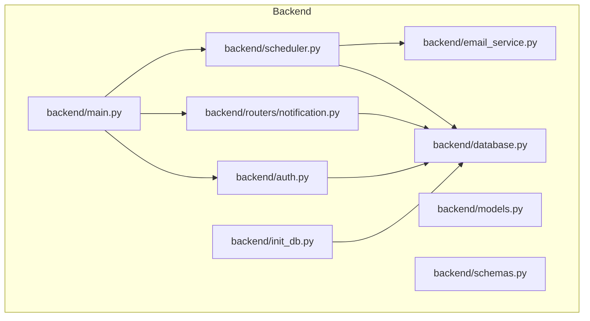
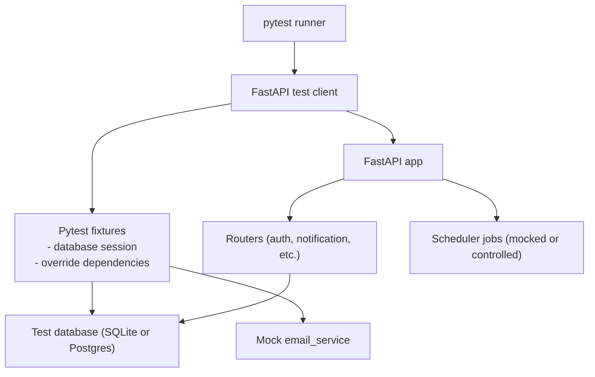
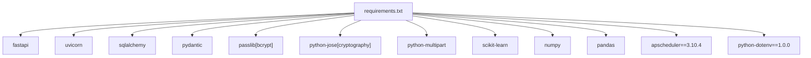

# Testing Procedures

<cite>
**Referenced Files in This Document**
- [requirements.txt](file://requirements.txt)
- [backend/main.py](file://backend/main.py)
- [backend/database.py](file://backend/database.py)
- [backend/init_db.py](file://backend/init_db.py)
- [backend/auth.py](file://backend/auth.py)
- [backend/schemas.py](file://backend/schemas.py)
- [backend/models.py](file://backend/models.py)
- [backend/routers/notification.py](file://backend/routers/notification.py)
- [backend/email_service.py](file://backend/email_service.py)
- [backend/scheduler.py](file://backend/scheduler.py)
- [.env.example](file://.env.example)
- [test_notifications.py](file://test_notifications.py)
- [test_registration.py](file://test_registration.py)
- [create_test_doctor.py](file://create_test_doctor.py)
</cite>

## Table of Contents
1. [Introduction](#introduction)
2. [Project Structure](#project-structure)
3. [Core Components](#core-components)
4. [Architecture Overview](#architecture-overview)
5. [Detailed Component Analysis](#detailed-component-analysis)
6. [Dependency Analysis](#dependency-analysis)
7. [Performance Considerations](#performance-considerations)
8. [Troubleshooting Guide](#troubleshooting-guide)
9. [Conclusion](#conclusion)
10. [Appendices](#appendices)

## Introduction
This document defines comprehensive testing procedures for the SmartHealthCare application. It covers unit testing strategies for individual components, integration testing for API endpoints, and end-to-end testing for complete workflows. It also explains test execution using the pytest framework, test data management, and mock service configurations. Specialized testing patterns for authentication flows, database operations, and background task scheduling are included. Examples of test registration script usage, notification testing procedures, and database validation tests are provided. Finally, it documents test environment setup, test database configuration, continuous integration testing workflows, test coverage requirements, performance testing approaches, and security testing procedures.

## Project Structure
The SmartHealthCare backend is a FastAPI application with modular routers, SQLAlchemy ORM models, and a background scheduler. The test scripts provided demonstrate manual integration-style testing against live endpoints. For formal unit and integration testing, pytest is recommended with proper fixtures and mocked dependencies.

**Diagram sources**
- [backend/main.py](file://backend/main.py#L34-L44)
- [backend/auth.py](file://backend/auth.py#L1-L120)
- [backend/routers/notification.py](file://backend/routers/notification.py#L1-L177)
- [backend/scheduler.py](file://backend/scheduler.py#L1-L317)
- [backend/database.py](file://backend/database.py#L1-L22)
- [backend/models.py](file://backend/models.py#L1-L110)
- [backend/schemas.py](file://backend/schemas.py#L1-L236)
- [backend/email_service.py](file://backend/email_service.py#L1-L161)
- [backend/init_db.py](file://backend/init_db.py#L1-L11)

**Section sources**
- [backend/main.py](file://backend/main.py#L1-L61)
- [backend/database.py](file://backend/database.py#L1-L22)
- [backend/init_db.py](file://backend/init_db.py#L1-L11)

## Core Components
- Application entrypoint and lifecycle hooks: Startup/shutdown events trigger the background scheduler.
- Authentication module: Registration, token generation, and current user retrieval with JWT.
- Database layer: SQLite by default; session factory and declarative base for models.
- Notification router: CRUD and stats endpoints for notifications with filtering and pagination.
- Scheduler: Periodic jobs for medicine/appointment reminders, sending pending notifications, and cleanup.
- Email service: Optional SMTP-based email notifications with environment-driven configuration.
- Test scripts: Manual scripts for notification and registration testing.

Key testing focus areas:
- Unit tests for authentication helpers and scheduler utilities.
- Integration tests for routers using FastAPI test client and mocked database sessions.
- End-to-end tests validating complete workflows (registration → login → notifications → scheduled reminders).

**Section sources**
- [backend/main.py](file://backend/main.py#L46-L56)
- [backend/auth.py](file://backend/auth.py#L106-L120)
- [backend/database.py](file://backend/database.py#L16-L22)
- [backend/routers/notification.py](file://backend/routers/notification.py#L13-L177)
- [backend/scheduler.py](file://backend/scheduler.py#L259-L317)
- [backend/email_service.py](file://backend/email_service.py#L13-L22)

## Architecture Overview
The testing architecture leverages pytest with FastAPI’s test client and SQLAlchemy session fixtures. Mocks replace external services (e.g., email) during unit tests. Integration tests run against a temporary database or an isolated test database. End-to-end tests simulate real user flows using the provided scripts and validate scheduler-triggered actions.

[No sources needed since this diagram shows conceptual workflow, not actual code structure]

## Detailed Component Analysis

### Authentication Testing Strategies
- Unit tests for password hashing, JWT creation, and credential validation.
- Integration tests for registration and token endpoints using the test client.
- Security tests for unauthorized access attempts and role-based access controls.

Recommended pytest patterns:
- Override FastAPI dependencies to inject test database sessions.
- Use a test secret key and short-lived tokens for deterministic tests.
- Validate HTTP status codes, response schemas, and error messages.

**Section sources**
- [backend/auth.py](file://backend/auth.py#L23-L55)
- [backend/auth.py](file://backend/auth.py#L106-L120)
- [backend/schemas.py](file://backend/schemas.py#L21-L28)

### Notification Router Testing
- Unit tests for filtering, pagination, and permission checks.
- Integration tests for CRUD operations and statistics endpoints.
- End-to-end tests using the notification test script to validate workflows.

Key test scenarios:
- Fetch notifications with filters (type, read status) and pagination limits.
- Verify statistics computation (unread, upcoming reminders).
- Validate creation permissions (doctors/admins vs. self-creation by patients).
- Test marking as read, bulk mark-as-read, deletion, and upcoming reminders.

**Section sources**
- [backend/routers/notification.py](file://backend/routers/notification.py#L13-L177)
- [backend/schemas.py](file://backend/schemas.py#L181-L211)
- [test_notifications.py](file://test_notifications.py#L14-L101)

### Database Operations Testing
- Use pytest fixtures to create and tear down test tables.
- Test model relationships and query correctness.
- Validate transaction rollbacks and commit behavior.

Recommended patterns:
- Initialize the database using the initialization script in a test environment.
- Use separate test database URLs for isolation.
- Assert ORM query results and foreign key constraints.

**Section sources**
- [backend/database.py](file://backend/database.py#L5-L22)
- [backend/init_db.py](file://backend/init_db.py#L4-L7)
- [backend/models.py](file://backend/models.py#L75-L89)

### Background Task Scheduling Testing
- Unit tests for scheduler job functions (reminder creation, notification sending, cleanup).
- Controlled time-based tests using freezegun or similar libraries.
- Integration tests verifying scheduler startup/shutdown and job scheduling.

Testing approaches:
- Mock the database session factory to avoid actual writes.
- Mock the email service to assert calls without sending emails.
- Verify job intervals and cron schedules.

**Section sources**
- [backend/scheduler.py](file://backend/scheduler.py#L259-L317)
- [backend/email_service.py](file://backend/email_service.py#L141-L161)

### Email Service Testing
- Unit tests for email template creation and SMTP sending.
- Mock SMTP to validate call signatures and error handling.
- Environment-driven configuration tests using .env variables.

**Section sources**
- [backend/email_service.py](file://backend/email_service.py#L13-L22)
- [backend/email_service.py](file://backend/email_service.py#L98-L139)

### Test Scripts Usage
- Registration test script: Validates user registration endpoint.
- Notification test script: Exercises notification creation, retrieval, and statistics.
- Test doctor script: Automates multi-step setup for doctor/patient roles and appointments.

Execution guidance:
- Start the backend server before running scripts.
- Update tokens and IDs in scripts after authenticating via the frontend or login endpoints.
- Use the test doctor script to bootstrap realistic test data.

**Section sources**
- [test_registration.py](file://test_registration.py#L1-L21)
- [test_notifications.py](file://test_notifications.py#L104-L131)
- [create_test_doctor.py](file://create_test_doctor.py#L1-L116)

## Dependency Analysis
The application’s testing dependencies align with the runtime requirements. Additional development dependencies (pytest, httpx, pytest-cov, freezegun) are recommended for robust testing.

**Diagram sources**
- [requirements.txt](file://requirements.txt#L1-L14)

**Section sources**
- [requirements.txt](file://requirements.txt#L1-L14)

## Performance Considerations
- Load testing: Use Locust or k6 to simulate concurrent users interacting with routers and scheduler.
- Endpoint profiling: Measure response times for notification queries and statistics endpoints.
- Scheduler performance: Validate job intervals and concurrency; monitor database write rates.
- Database tuning: Use connection pooling and indexes for notification queries.

[No sources needed since this section provides general guidance]

## Troubleshooting Guide
Common issues and resolutions:
- Authentication failures: Verify JWT secret key and token expiration settings.
- Database errors: Ensure the test database is initialized and migrations are applied.
- Scheduler not triggering: Confirm scheduler startup hooks and job intervals.
- Email failures: Check environment variables and SMTP configuration; disable email in tests if needed.

**Section sources**
- [backend/main.py](file://backend/main.py#L46-L56)
- [backend/scheduler.py](file://backend/scheduler.py#L259-L317)
- [backend/email_service.py](file://backend/email_service.py#L13-L22)

## Conclusion
The SmartHealthCare application benefits from a layered testing strategy: unit tests for core logic, integration tests for API endpoints, and end-to-end tests for complete workflows. By leveraging pytest, FastAPI test client, and mocks, teams can achieve reliable, maintainable, and repeatable test suites. Proper environment configuration, database isolation, and scheduler control enable accurate and efficient testing across all components.

[No sources needed since this section summarizes without analyzing specific files]

## Appendices

### Test Execution Using pytest
- Install development dependencies: pytest, httpx, pytest-cov, freezegun, pytest-asyncio.
- Configure pytest.ini or pyproject.toml to set asyncio mode and markers.
- Run tests: pytest -v --cov=backend --cov-report=term-missing.

[No sources needed since this section provides general guidance]

### Test Data Management
- Use factories or Pydantic models to construct test data.
- Seed the database with minimal realistic data using the test doctor script.
- Clean up test data after each test using transactions or database reset.

**Section sources**
- [create_test_doctor.py](file://create_test_doctor.py#L1-L116)

### Mock Service Configurations
- Mock email_service in unit tests to avoid SMTP calls.
- Patch scheduler functions to prevent background job execution during tests.
- Use monkeypatch to override environment variables for email configuration.

**Section sources**
- [backend/email_service.py](file://backend/email_service.py#L13-L22)
- [backend/scheduler.py](file://backend/scheduler.py#L259-L317)

### Database Validation Tests
- Validate schema creation and table relationships.
- Assert notification counts and statistics after operations.
- Check foreign keys and cascading behavior.

**Section sources**
- [backend/init_db.py](file://backend/init_db.py#L4-L7)
- [backend/models.py](file://backend/models.py#L75-L89)

### Continuous Integration Testing Workflows
- CI pipeline stages: install dependencies, lint, unit tests, integration tests, coverage report.
- Use matrix builds for Python versions and database backends.
- Store coverage reports and attach artifacts for review.

[No sources needed since this section provides general guidance]

### Test Coverage Requirements
- Target: 80%+ line coverage for routers and core logic.
- Stricter thresholds for authentication and scheduler modules.
- Exclude auto-generated schemas and CLI scripts from coverage calculations.

[No sources needed since this section provides general guidance]

### Security Testing Procedures
- Validate JWT signing and verification logic.
- Test unauthorized access and role-based restrictions.
- Audit endpoints for SQL injection and XSS risks.

**Section sources**
- [backend/auth.py](file://backend/auth.py#L29-L55)
- [backend/routers/notification.py](file://backend/routers/notification.py#L154-L161)

### Environment Setup and Configuration
- Copy .env.example to .env and configure email settings if needed.
- Use separate test database URLs for CI and local runs.
- Configure CORS origins for frontend integration tests.

**Section sources**
- [.env.example](file://.env.example#L1-L13)
- [backend/main.py](file://backend/main.py#L20-L32)
- [backend/database.py](file://backend/database.py#L5-L7)