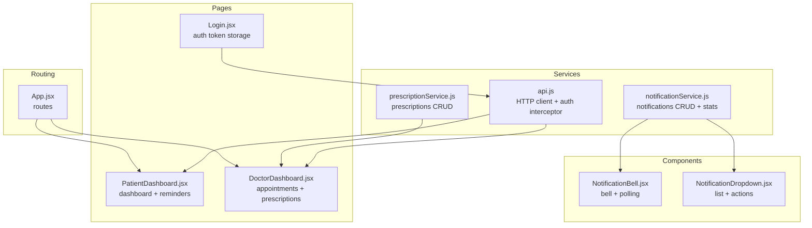
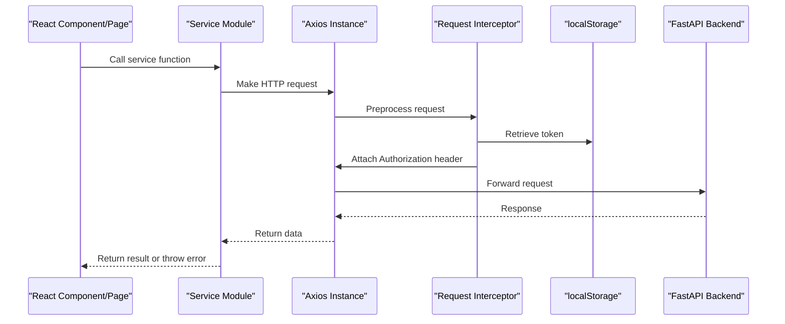
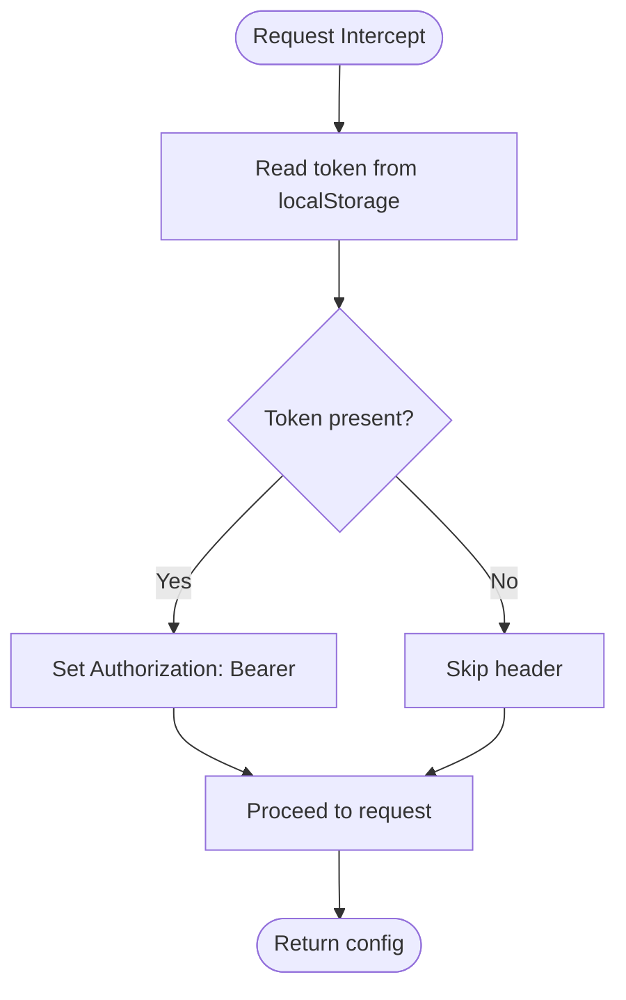
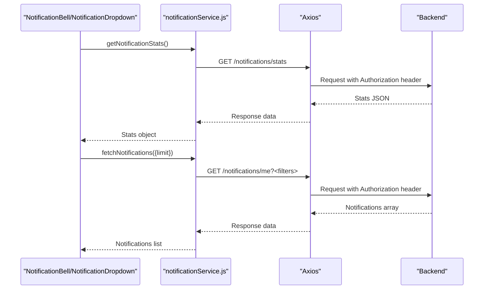
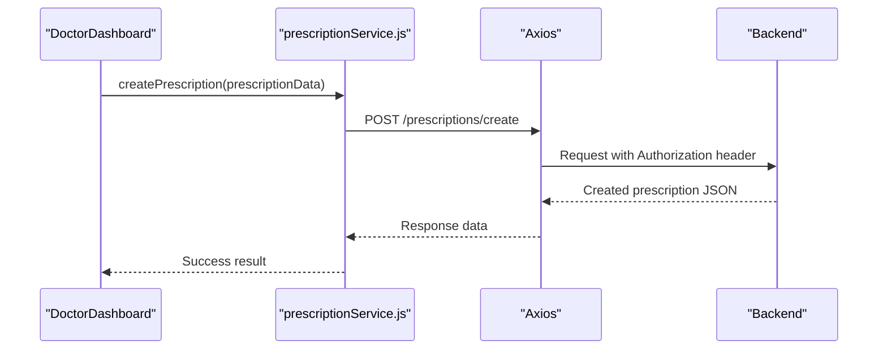
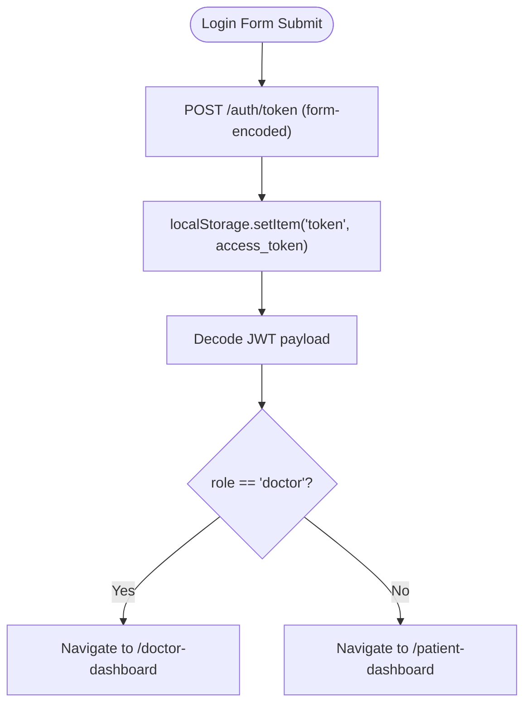
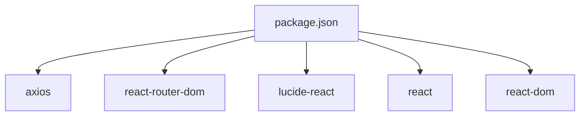

# API Service Layer

<cite>
**Referenced Files in This Document**
- [api.js](file://frontend/src/services/api.js)
- [notificationService.js](file://frontend/src/services/notificationService.js)
- [prescriptionService.js](file://frontend/src/services/prescriptionService.js)
- [NotificationBell.jsx](file://frontend/src/components/NotificationBell.jsx)
- [NotificationDropdown.jsx](file://frontend/src/components/NotificationDropdown.jsx)
- [PatientDashboard.jsx](file://frontend/src/pages/PatientDashboard.jsx)
- [DoctorDashboard.jsx](file://frontend/src/pages/DoctorDashboard.jsx)
- [Login.jsx](file://frontend/src/pages/Login.jsx)
- [App.jsx](file://frontend/src/App.jsx)
- [package.json](file://frontend/package.json)
</cite>

## Table of Contents
1. [Introduction](#introduction)
2. [Project Structure](#project-structure)
3. [Core Components](#core-components)
4. [Architecture Overview](#architecture-overview)
5. [Detailed Component Analysis](#detailed-component-analysis)
6. [Dependency Analysis](#dependency-analysis)
7. [Performance Considerations](#performance-considerations)
8. [Troubleshooting Guide](#troubleshooting-guide)
9. [Conclusion](#conclusion)

## Introduction
This document provides comprehensive documentation for the SmartHealthCare frontend API service layer. It covers the HTTP client configuration, authentication header injection, request/response interceptors, and error handling strategies implemented in the API service. It also details the notification service module for retrieving notifications, managing subscriptions, and handling real-time updates. Additionally, it explains the prescription service implementation for fetching prescription data, tracking medications, and managing prescriptions. The guide includes service initialization, configuration options, integration patterns with React components, usage examples, error handling approaches, performance optimization techniques, authentication token management, request caching strategies, and extensibility patterns.

## Project Structure
The frontend API service layer resides under the frontend/src/services directory and integrates with React components and pages. The key files are:
- HTTP client and authentication interceptor: api.js
- Notification service: notificationService.js
- Prescription service: prescriptionService.js
- UI components consuming these services: NotificationBell.jsx, NotificationDropdown.jsx
- Pages integrating services: PatientDashboard.jsx, DoctorDashboard.jsx
- Authentication flow: Login.jsx
- Application routing: App.jsx
- Dependencies: package.json

**Diagram sources**
- [api.js](file://frontend/src/services/api.js#L1-L25)
- [notificationService.js](file://frontend/src/services/notificationService.js#L1-L117)
- [prescriptionService.js](file://frontend/src/services/prescriptionService.js#L1-L81)
- [NotificationBell.jsx](file://frontend/src/components/NotificationBell.jsx#L1-L64)
- [NotificationDropdown.jsx](file://frontend/src/components/NotificationDropdown.jsx#L1-L182)
- [PatientDashboard.jsx](file://frontend/src/pages/PatientDashboard.jsx#L1-L674)
- [DoctorDashboard.jsx](file://frontend/src/pages/DoctorDashboard.jsx#L1-L705)
- [Login.jsx](file://frontend/src/pages/Login.jsx#L1-L104)
- [App.jsx](file://frontend/src/App.jsx#L1-L28)

**Section sources**
- [api.js](file://frontend/src/services/api.js#L1-L25)
- [notificationService.js](file://frontend/src/services/notificationService.js#L1-L117)
- [prescriptionService.js](file://frontend/src/services/prescriptionService.js#L1-L81)
- [NotificationBell.jsx](file://frontend/src/components/NotificationBell.jsx#L1-L64)
- [NotificationDropdown.jsx](file://frontend/src/components/NotificationDropdown.jsx#L1-L182)
- [PatientDashboard.jsx](file://frontend/src/pages/PatientDashboard.jsx#L1-L674)
- [DoctorDashboard.jsx](file://frontend/src/pages/DoctorDashboard.jsx#L1-L705)
- [Login.jsx](file://frontend/src/pages/Login.jsx#L1-L104)
- [App.jsx](file://frontend/src/App.jsx#L1-L28)
- [package.json](file://frontend/package.json#L1-L35)

## Core Components
This section documents the core API service layer components and their responsibilities.

- HTTP Client and Authentication Interceptor (api.js)
  - Creates an Axios instance with base URL and JSON content-type headers.
  - Adds a request interceptor to automatically attach an Authorization header using the token stored in localStorage.
  - Exports the configured Axios instance for use across the application.

- Notification Service (notificationService.js)
  - Provides functions to fetch notifications with filtering, get notification statistics, fetch upcoming reminders, mark notifications as read, mark all as read, delete notifications, and create notifications (admin/doctor).
  - Uses a helper to retrieve the Authorization header from localStorage.
  - Implements try/catch blocks around each operation and logs errors to the console.

- Prescription Service (prescriptionService.js)
  - Offers functions to create prescriptions (doctor), fetch a user’s own prescriptions, get active prescriptions, fetch a patient’s prescriptions (doctor), and get prescription details.
  - Uses the same Authorization header helper as the notification service.
  - Implements error handling with try/catch and console logging.

Integration points:
- PatientDashboard.jsx uses the api.js instance for general requests and notificationService.js for reminders.
- DoctorDashboard.jsx uses api.js for doctor-specific endpoints and prescriptionService.js for creating prescriptions.
- Login.jsx stores the JWT access token in localStorage and navigates based on role extracted from the token payload.

**Section sources**
- [api.js](file://frontend/src/services/api.js#L1-L25)
- [notificationService.js](file://frontend/src/services/notificationService.js#L1-L117)
- [prescriptionService.js](file://frontend/src/services/prescriptionService.js#L1-L81)
- [PatientDashboard.jsx](file://frontend/src/pages/PatientDashboard.jsx#L1-L674)
- [DoctorDashboard.jsx](file://frontend/src/pages/DoctorDashboard.jsx#L1-L705)
- [Login.jsx](file://frontend/src/pages/Login.jsx#L1-L104)

## Architecture Overview
The API service layer follows a modular design:
- Centralized HTTP client with automatic authentication.
- Feature-specific service modules encapsulating CRUD operations.
- React components and pages consume these services for data fetching and mutations.
- Authentication token is persisted in localStorage and injected via an Axios interceptor.

**Diagram sources**
- [api.js](file://frontend/src/services/api.js#L10-L22)
- [notificationService.js](file://frontend/src/services/notificationService.js#L1-L117)
- [prescriptionService.js](file://frontend/src/services/prescriptionService.js#L1-L81)
- [Login.jsx](file://frontend/src/pages/Login.jsx#L23-L28)

## Detailed Component Analysis

### HTTP Client and Authentication Interceptor (api.js)
- Purpose: Provide a centralized Axios instance with automatic bearer token injection.
- Configuration:
  - Base URL points to the backend server.
  - Default JSON content type header.
- Interceptor:
  - On each request, reads the token from localStorage and sets the Authorization header if present.
  - On interceptor error, rejects the promise to propagate upstream.
- Export:
  - Exports the configured Axios instance for global use.

**Diagram sources**
- [api.js](file://frontend/src/services/api.js#L10-L22)

**Section sources**
- [api.js](file://frontend/src/services/api.js#L1-L25)

### Notification Service (notificationService.js)
- Responsibilities:
  - Fetch notifications with optional filters (type, read status, limit, offset).
  - Retrieve notification statistics.
  - Fetch upcoming reminders with a configurable limit.
  - Mark individual notifications or all notifications as read.
  - Delete a notification.
  - Create a notification (doctor/admin).
- Implementation patterns:
  - Helper function to compute Authorization header from localStorage.
  - Each function wraps the HTTP call in a try/catch block and logs errors.
  - Uses axios.get/patch/delete/post with the computed headers.
- Real-time updates:
  - NotificationBell.jsx polls notification statistics every 30 seconds.
  - NotificationDropdown.jsx loads recent notifications on mount and supports click-to-delete and mark-as-read actions.

**Diagram sources**
- [notificationService.js](file://frontend/src/services/notificationService.js#L11-L43)
- [NotificationBell.jsx](file://frontend/src/components/NotificationBell.jsx#L11-L30)
- [NotificationDropdown.jsx](file://frontend/src/components/NotificationDropdown.jsx#L24-L34)

**Section sources**
- [notificationService.js](file://frontend/src/services/notificationService.js#L1-L117)
- [NotificationBell.jsx](file://frontend/src/components/NotificationBell.jsx#L1-L64)
- [NotificationDropdown.jsx](file://frontend/src/components/NotificationDropdown.jsx#L1-L182)

### Prescription Service (prescriptionService.js)
- Responsibilities:
  - Create a new prescription (doctor).
  - Fetch a user’s own prescriptions.
  - Fetch active prescriptions.
  - Fetch a patient’s prescriptions (doctor).
  - Fetch detailed prescription information.
- Implementation patterns:
  - Uses the same Authorization header helper as the notification service.
  - Each function wraps the HTTP call in a try/catch block and logs errors.
  - Uses axios.post/get with the computed headers.

**Diagram sources**
- [prescriptionService.js](file://frontend/src/services/prescriptionService.js#L11-L24)
- [DoctorDashboard.jsx](file://frontend/src/pages/DoctorDashboard.jsx#L122-L144)

**Section sources**
- [prescriptionService.js](file://frontend/src/services/prescriptionService.js#L1-L81)
- [DoctorDashboard.jsx](file://frontend/src/pages/DoctorDashboard.jsx#L1-L705)

### Authentication Token Management and Integration
- Login flow:
  - Submits credentials to the backend token endpoint with form-encoded content type.
  - Stores the returned access token in localStorage.
  - Decodes the token to determine user role and navigates accordingly.
- Token usage:
  - api.js interceptor automatically attaches the Authorization header for all requests.
  - notificationService.js and prescriptionService.js also manually attach the Authorization header for their requests.
- Role-based navigation:
  - Based on the decoded token payload role, the application routes to either the patient or doctor dashboard.

**Diagram sources**
- [Login.jsx](file://frontend/src/pages/Login.jsx#L13-L47)
- [api.js](file://frontend/src/services/api.js#L10-L22)

**Section sources**
- [Login.jsx](file://frontend/src/pages/Login.jsx#L1-L104)
- [api.js](file://frontend/src/services/api.js#L1-L25)

### Service Initialization and Configuration Options
- HTTP client initialization:
  - Base URL configured to the backend host.
  - Default JSON content type header.
- Interceptor configuration:
  - Reads token from localStorage and injects Authorization header.
  - Propagates interceptor errors via rejected promises.
- Service modules:
  - notificationService.js and prescriptionService.js define API_URL constants and reuse the Authorization header helper.
  - Both modules wrap all HTTP calls in try/catch blocks and log errors.

**Section sources**
- [api.js](file://frontend/src/services/api.js#L1-L25)
- [notificationService.js](file://frontend/src/services/notificationService.js#L1-L117)
- [prescriptionService.js](file://frontend/src/services/prescriptionService.js#L1-L81)

### Integration Patterns with React Components
- PatientDashboard.jsx:
  - Uses api.js for general requests (profile, appointments, doctors).
  - Uses notificationService.js for upcoming reminders.
- DoctorDashboard.jsx:
  - Uses api.js for doctor-specific endpoints and profile updates.
  - Uses prescriptionService.js to create prescriptions.
- NotificationBell.jsx and NotificationDropdown.jsx:
  - Poll notification stats periodically.
  - Load and manage notifications, support mark-as-read and delete actions.

**Section sources**
- [PatientDashboard.jsx](file://frontend/src/pages/PatientDashboard.jsx#L1-L674)
- [DoctorDashboard.jsx](file://frontend/src/pages/DoctorDashboard.jsx#L1-L705)
- [NotificationBell.jsx](file://frontend/src/components/NotificationBell.jsx#L1-L64)
- [NotificationDropdown.jsx](file://frontend/src/components/NotificationDropdown.jsx#L1-L182)

### Usage Examples and Error Handling Approaches
- Example usage patterns:
  - PatientDashboard.jsx demonstrates fetching profile, appointments, and upcoming reminders.
  - DoctorDashboard.jsx demonstrates creating prescriptions and updating appointment statuses.
  - Notification components demonstrate polling and local UI updates upon successful operations.
- Error handling:
  - Services log errors to the console and rethrow them for upstream handling.
  - Components display user-friendly alerts and handle loading states.

**Section sources**
- [PatientDashboard.jsx](file://frontend/src/pages/PatientDashboard.jsx#L35-L83)
- [DoctorDashboard.jsx](file://frontend/src/pages/DoctorDashboard.jsx#L122-L144)
- [NotificationBell.jsx](file://frontend/src/components/NotificationBell.jsx#L11-L30)
- [NotificationDropdown.jsx](file://frontend/src/components/NotificationDropdown.jsx#L24-L56)

### Performance Optimization Techniques
- Polling strategy:
  - NotificationBell.jsx polls notification statistics every 30 seconds to keep the unread count fresh.
- Local state updates:
  - NotificationDropdown.jsx optimistically updates the UI after mark-as-read and delete operations to reduce perceived latency.
- Batched data fetching:
  - DoctorDashboard.jsx uses Promise.all to fetch multiple doctor-related datasets concurrently.

**Section sources**
- [NotificationBell.jsx](file://frontend/src/components/NotificationBell.jsx#L23-L30)
- [NotificationDropdown.jsx](file://frontend/src/components/NotificationDropdown.jsx#L36-L56)
- [DoctorDashboard.jsx](file://frontend/src/pages/DoctorDashboard.jsx#L34-L45)

### Request Caching Strategies
- Current implementation:
  - No explicit request caching is implemented in the services.
  - Components rely on polling and immediate re-fetches after mutations.
- Recommended strategies (conceptual):
  - Implement a lightweight in-memory cache keyed by URL and query parameters.
  - Add cache invalidation on mutation operations (e.g., create/update/delete).
  - Introduce cache TTL and selective cache bypass for sensitive data.

[No sources needed since this section provides general guidance]

### Service Extensibility Patterns
- Modular service design:
  - Each service module encapsulates a domain (notifications, prescriptions).
  - Common patterns like Authorization header helper promote reuse.
- Interceptor-based authentication:
  - Centralized token injection reduces duplication across services.
- Future enhancements:
  - Add retry logic and exponential backoff for transient failures.
  - Introduce a unified error handler for consistent error surfaces.
  - Add request/response transformers for standardized data shaping.

[No sources needed since this section provides general guidance]

## Dependency Analysis
The frontend depends on several libraries for HTTP communication, routing, icons, and UI framework.

**Diagram sources**
- [package.json](file://frontend/package.json#L12-L18)

**Section sources**
- [package.json](file://frontend/package.json#L1-L35)

## Performance Considerations
- Network efficiency:
  - Use the centralized Axios instance to minimize overhead and ensure consistent headers.
  - Prefer batched requests where possible (as seen in DoctorDashboard.jsx).
- UI responsiveness:
  - Implement optimistic updates for quick feedback (as seen in NotificationDropdown.jsx).
  - Use controlled loading states to prevent redundant requests.
- Token lifecycle:
  - Ensure tokens are refreshed or rotated according to backend policies.
  - Clear tokens on logout to prevent stale requests.

[No sources needed since this section provides general guidance]

## Troubleshooting Guide
Common issues and resolutions:
- Authentication failures:
  - Verify that the token is present in localStorage after login.
  - Check that the interceptor is attaching the Authorization header.
- Network errors:
  - Inspect the browser network tab for failed requests and response bodies.
  - Ensure the backend is reachable at the configured base URL.
- Service-specific errors:
  - Review console logs for thrown errors from services.
  - Confirm that filters and parameters are correctly formatted for notification queries.

**Section sources**
- [api.js](file://frontend/src/services/api.js#L10-L22)
- [notificationService.js](file://frontend/src/services/notificationService.js#L11-L117)
- [prescriptionService.js](file://frontend/src/services/prescriptionService.js#L11-L81)
- [Login.jsx](file://frontend/src/pages/Login.jsx#L13-L47)

## Conclusion
The SmartHealthCare frontend API service layer provides a clean, modular foundation for interacting with the backend. The centralized HTTP client with automatic authentication simplifies request handling, while domain-specific service modules encapsulate CRUD operations for notifications and prescriptions. Components integrate seamlessly with these services, leveraging polling and optimistic updates for responsive user experiences. With minor enhancements—such as request caching, unified error handling, and retry logic—the service layer can achieve higher reliability and performance.