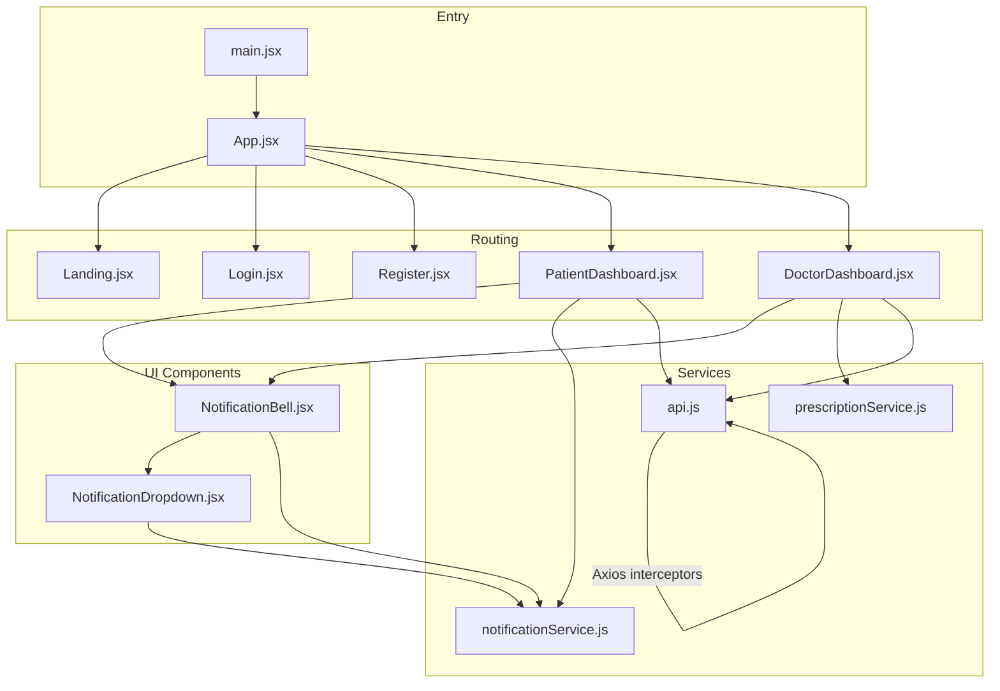
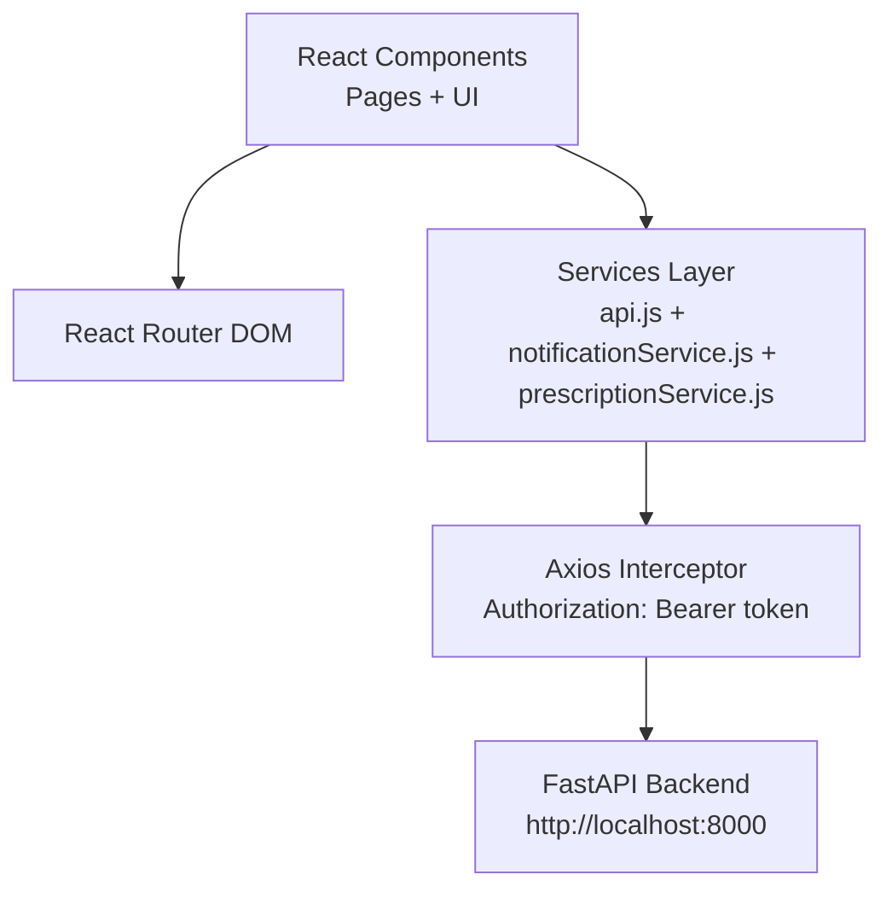
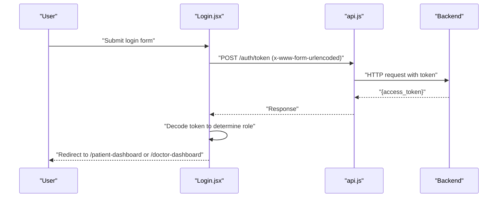
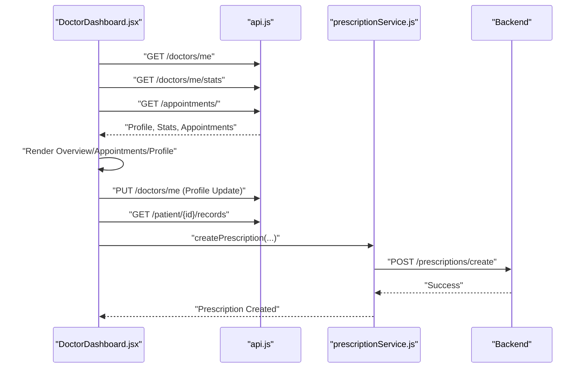
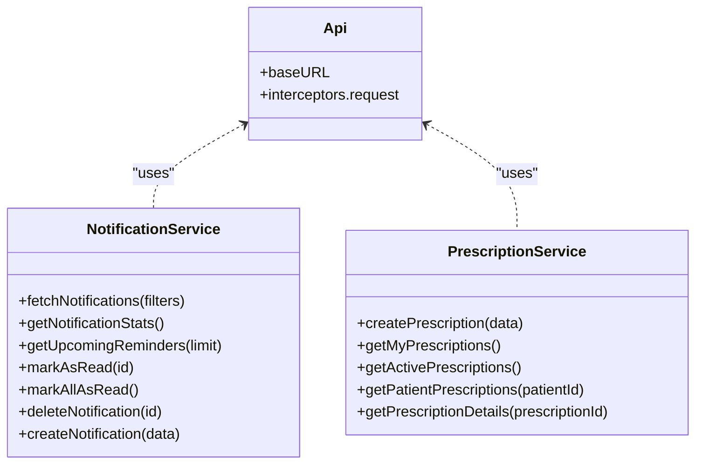
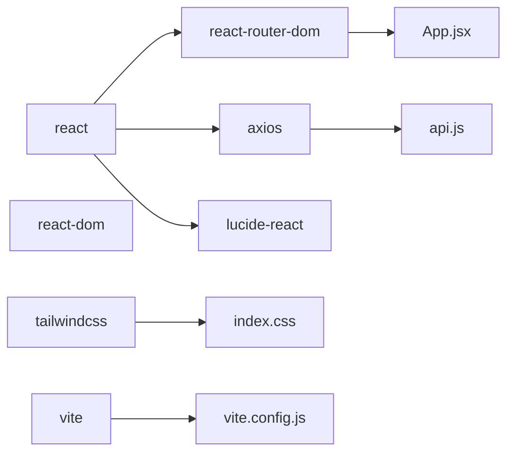

# Frontend Application

<cite>
**Referenced Files in This Document**
- [main.jsx](file://frontend/src/main.jsx)
- [App.jsx](file://frontend/src/App.jsx)
- [Landing.jsx](file://frontend/src/pages/Landing.jsx)
- [Login.jsx](file://frontend/src/pages/Login.jsx)
- [Register.jsx](file://frontend/src/pages/Register.jsx)
- [PatientDashboard.jsx](file://frontend/src/pages/PatientDashboard.jsx)
- [DoctorDashboard.jsx](file://frontend/src/pages/DoctorDashboard.jsx)
- [NotificationBell.jsx](file://frontend/src/components/NotificationBell.jsx)
- [NotificationDropdown.jsx](file://frontend/src/components/NotificationDropdown.jsx)
- [api.js](file://frontend/src/services/api.js)
- [notificationService.js](file://frontend/src/services/notificationService.js)
- [prescriptionService.js](file://frontend/src/services/prescriptionService.js)
- [package.json](file://frontend/package.json)
- [tailwind.config.js](file://frontend/tailwind.config.js)
- [index.css](file://frontend/src/index.css)
- [vite.config.js](file://frontend/vite.config.js)
</cite>

## Table of Contents
1. [Introduction](#introduction)
2. [Project Structure](#project-structure)
3. [Core Components](#core-components)
4. [Architecture Overview](#architecture-overview)
5. [Detailed Component Analysis](#detailed-component-analysis)
6. [Dependency Analysis](#dependency-analysis)
7. [Performance Considerations](#performance-considerations)
8. [Troubleshooting Guide](#troubleshooting-guide)
9. [Conclusion](#conclusion)
10. [Appendices](#appendices)

## Introduction
This document describes the SmartHealthCare React frontend application. It explains the routing configuration, component hierarchy, state management patterns, page components (Landing, Login, Register, PatientDashboard, DoctorDashboard), reusable UI components (NotificationBell and NotificationDropdown), the API service layer (api.js, notificationService.js, prescriptionService.js), styling approach using Tailwind CSS, user interaction flows, form handling, error state management, responsive design considerations, accessibility compliance, cross-browser compatibility, and component usage integration patterns.

## Project Structure
The frontend is a Vite + React application with:
- Entry point rendering the root App component
- Routing configured via React Router DOM
- Pages organized under src/pages
- Reusable UI components under src/components
- Services under src/services
- Tailwind CSS configured for styling



**Diagram sources**
- [main.jsx](file://frontend/src/main.jsx#L1-L11)
- [App.jsx](file://frontend/src/App.jsx#L1-L28)
- [Landing.jsx](file://frontend/src/pages/Landing.jsx#L1-L104)
- [Login.jsx](file://frontend/src/pages/Login.jsx#L1-L104)
- [Register.jsx](file://frontend/src/pages/Register.jsx#L1-L124)
- [PatientDashboard.jsx](file://frontend/src/pages/PatientDashboard.jsx#L1-L674)
- [DoctorDashboard.jsx](file://frontend/src/pages/DoctorDashboard.jsx#L1-L698)
- [NotificationBell.jsx](file://frontend/src/components/NotificationBell.jsx#L1-L64)
- [NotificationDropdown.jsx](file://frontend/src/components/NotificationDropdown.jsx#L1-L182)
- [api.js](file://frontend/src/services/api.js#L1-L25)
- [notificationService.js](file://frontend/src/services/notificationService.js#L1-L117)
- [prescriptionService.js](file://frontend/src/services/prescriptionService.js#L1-L81)

**Section sources**
- [main.jsx](file://frontend/src/main.jsx#L1-L11)
- [App.jsx](file://frontend/src/App.jsx#L1-L28)
- [package.json](file://frontend/package.json#L1-L35)
- [tailwind.config.js](file://frontend/tailwind.config.js#L1-L20)
- [index.css](file://frontend/src/index.css#L1-L10)
- [vite.config.js](file://frontend/vite.config.js#L1-L8)

## Core Components
- App routing defines the application routes and wraps the app in a router.
- Pages implement domain-specific dashboards and forms.
- NotificationBell integrates with notificationService to display unread counts and open NotificationDropdown.
- Services encapsulate HTTP requests and token handling.

Key patterns:
- Centralized Axios client with request interceptor for Authorization header.
- Token stored in localStorage and used across services.
- Form handling with controlled inputs and local state.
- Error handling via try/catch blocks and user-visible alerts.

**Section sources**
- [App.jsx](file://frontend/src/App.jsx#L1-L28)
- [api.js](file://frontend/src/services/api.js#L1-L25)
- [notificationService.js](file://frontend/src/services/notificationService.js#L1-L117)
- [prescriptionService.js](file://frontend/src/services/prescriptionService.js#L1-L81)

## Architecture Overview
The frontend follows a layered architecture:
- Presentation Layer: React components (pages and reusable UI)
- Service Layer: Axios-based HTTP clients with shared auth logic
- State Management: React hooks (useState, useEffect) per component
- Routing: React Router DOM for navigation



**Diagram sources**
- [App.jsx](file://frontend/src/App.jsx#L1-L28)
- [api.js](file://frontend/src/services/api.js#L1-L25)
- [notificationService.js](file://frontend/src/services/notificationService.js#L1-L117)
- [prescriptionService.js](file://frontend/src/services/prescriptionService.js#L1-L81)

## Detailed Component Analysis

### Routing Configuration
- Routes include Landing, Login, Register, PatientDashboard, DoctorDashboard, and a fallback Not Found.
- The layout applies a minimum height and global text colors.

**Section sources**
- [App.jsx](file://frontend/src/App.jsx#L1-L28)

### Landing Page
- Provides navigation to Login and Register.
- Hero section with gradient overlay and pattern backgrounds.
- Feature cards with icons and hover animations.

**Section sources**
- [Landing.jsx](file://frontend/src/pages/Landing.jsx#L1-L104)

### Login Page
- Controlled form with email and password.
- Submits credentials to backend token endpoint with x-www-form-urlencoded content type.
- Reads JWT token from response and decodes role to redirect to appropriate dashboard.
- Displays error messages and disables button during loading.



**Diagram sources**
- [Login.jsx](file://frontend/src/pages/Login.jsx#L13-L47)
- [api.js](file://frontend/src/services/api.js#L1-L25)

**Section sources**
- [Login.jsx](file://frontend/src/pages/Login.jsx#L1-L104)

### Register Page
- Multi-step form with full_name, email, password, and role selection.
- Submits registration data to backend and navigates to Login on success.
- Displays error messages returned from the backend.

**Section sources**
- [Register.jsx](file://frontend/src/pages/Register.jsx#L1-L124)

### Patient Dashboard
- Stateful dashboard with tabs: Overview, Symptoms (AI), Appointments, Health Records.
- Integrates NotificationBell and NotificationDropdown.
- Fetches profile, appointments, doctors, and upcoming reminders.
- Supports booking appointments via modal form and AI symptom analysis.

```mermaid
flowchart TD
Start(["Mount PatientDashboard"]) --> FetchProfile["Fetch /patient/me"]
FetchProfile --> FetchAppts["Fetch /appointments/"]
FetchAppts --> FetchDocs["Fetch /doctors/"]
FetchDocs --> FetchReminders["Call getUpcomingReminders(limit=5)"]
FetchReminders --> Render["Render Overview/Symptoms/Appointments/Records"]
Render --> |User clicks "Book Appointment"| OpenModal["Open Booking Modal"]
OpenModal --> Submit["POST /appointments/"]
Submit --> Refresh["Refresh Appointments List"]
Render --> |User selects "Check Symptoms"| Analyze["POST /ai/analyze"]
Analyze --> ShowReport["Show AI Report"]
```

**Diagram sources**
- [PatientDashboard.jsx](file://frontend/src/pages/PatientDashboard.jsx#L35-L114)
- [notificationService.js](file://frontend/src/services/notificationService.js#L46-L57)

**Section sources**
- [PatientDashboard.jsx](file://frontend/src/pages/PatientDashboard.jsx#L1-L674)

### Doctor Dashboard
- Loads profile, stats, and appointments concurrently.
- Provides tabs: Overview, Appointments, Profile.
- Allows updating profile, viewing patient records, and creating prescriptions.
- Includes a Prescription modal with controlled form fields.



**Diagram sources**
- [DoctorDashboard.jsx](file://frontend/src/pages/DoctorDashboard.jsx#L30-L137)
- [prescriptionService.js](file://frontend/src/services/prescriptionService.js#L12-L24)

**Section sources**
- [DoctorDashboard.jsx](file://frontend/src/pages/DoctorDashboard.jsx#L1-L698)

### NotificationBell and NotificationDropdown
- NotificationBell fetches unread counts and toggles NotificationDropdown.
- NotificationDropdown loads recent notifications, supports mark-as-read and delete actions, and auto-refreshes stats when closed.
- Both components poll for updates and close on outside click.

```mermaid
sequenceDiagram
participant U as "User"
participant NB as "NotificationBell.jsx"
participant ND as "NotificationDropdown.jsx"
participant NS as "notificationService.js"
participant B as "Backend"
U->>NB : "Click Bell"
NB->>ND : "Show Dropdown"
NB->>NS : "GET /notifications/stats"
NS->>B : "HTTP request"
B-->>NS : "Stats"
NS-->>NB : "Stats"
ND->>NS : "GET /notifications/me?limit=10"
NS->>B : "HTTP request"
B-->>NS : "Notifications"
NS-->>ND : "Notifications"
U->>ND : "Click Mark As Read/Delete"
ND->>NS : "PATCH/DELETE notification"
NS->>B : "HTTP request"
B-->>NS : "OK"
ND->>ND : "Update UI and call onUpdate()"
ND->>NB : "Close and refresh stats"
```



**Diagram sources**
- [NotificationBell.jsx](file://frontend/src/components/NotificationBell.jsx#L11-L40)
- [NotificationDropdown.jsx](file://frontend/src/components/NotificationDropdown.jsx#L10-L56)
- [notificationService.js](file://frontend/src/services/notificationService.js#L12-L101)

**Section sources**
- [NotificationBell.jsx](file://frontend/src/components/NotificationBell.jsx#L1-L64)
- [NotificationDropdown.jsx](file://frontend/src/components/NotificationDropdown.jsx#L1-L182)

### API Service Layer
- Centralized Axios instance with base URL pointing to the backend.
- Request interceptor automatically attaches Authorization: Bearer token from localStorage.
- notificationService.js and prescriptionService.js wrap HTTP calls with typed functions and token injection.



**Diagram sources**
- [api.js](file://frontend/src/services/api.js#L1-L25)
- [notificationService.js](file://frontend/src/services/notificationService.js#L1-L117)
- [prescriptionService.js](file://frontend/src/services/prescriptionService.js#L1-L81)

**Section sources**
- [api.js](file://frontend/src/services/api.js#L1-L25)
- [notificationService.js](file://frontend/src/services/notificationService.js#L1-L117)
- [prescriptionService.js](file://frontend/src/services/prescriptionService.js#L1-L81)

## Dependency Analysis
- React and React DOM: Core framework
- React Router DOM: Client-side routing
- Axios: HTTP client with centralized configuration
- lucide-react: Icons
- Tailwind CSS: Utility-first styling
- Vite: Build tool and dev server



**Diagram sources**
- [package.json](file://frontend/package.json#L12-L34)
- [api.js](file://frontend/src/services/api.js#L1-L25)
- [App.jsx](file://frontend/src/App.jsx#L1-L28)
- [index.css](file://frontend/src/index.css#L1-L10)
- [vite.config.js](file://frontend/vite.config.js#L1-L8)

**Section sources**
- [package.json](file://frontend/package.json#L1-L35)

## Performance Considerations
- Prefer concurrent data fetching where possible (e.g., Promise.all in DoctorDashboard).
- Debounce or throttle frequent polling (currently 30s for notifications) to reduce network overhead.
- Lazy-load heavy components or split bundles with React.lazy if needed.
- Keep UI updates minimal by using shallow comparisons and avoiding unnecessary re-renders.

## Troubleshooting Guide
Common issues and resolutions:
- Authentication failures on DoctorDashboard: The component checks for 401 and redirects to Login. Ensure token exists and is valid.
- Notification stats not updating: Verify localStorage token and that the backend endpoint returns stats.
- Prescription creation errors: Confirm the doctor has permission and required fields are present.
- Styling not applied: Ensure Tailwind directives are present and Tailwind is configured to scan the correct paths.

**Section sources**
- [DoctorDashboard.jsx](file://frontend/src/pages/DoctorDashboard.jsx#L55-L62)
- [NotificationBell.jsx](file://frontend/src/components/NotificationBell.jsx#L11-L21)
- [api.js](file://frontend/src/services/api.js#L11-L22)

## Conclusion
The SmartHealthCare frontend is a well-structured React application using modern tooling and a clean separation of concerns. Routing, state management, and service layers are clearly defined. The UI leverages Tailwind for consistent styling and responsive layouts. With minor enhancements around error handling, performance, and accessibility, the application can provide a robust and scalable user experience.

## Appendices

### Styling Approach and Composition Patterns
- Tailwind CSS is configured globally with custom color palette extended for primary, secondary, accent, dark, and light.
- Base styles apply global font and background/foreground colors.
- Component composition favors small, focused components (e.g., StatCard, TabButton, AppointmentCard) passed as props to pages.

**Section sources**
- [tailwind.config.js](file://frontend/tailwind.config.js#L1-L20)
- [index.css](file://frontend/src/index.css#L1-L10)
- [DoctorDashboard.jsx](file://frontend/src/pages/DoctorDashboard.jsx#L421-L448)
- [PatientDashboard.jsx](file://frontend/src/pages/PatientDashboard.jsx#L638-L673)

### Accessibility and Responsive Design
- Use semantic HTML and proper labeling for forms.
- Ensure sufficient color contrast and keyboard navigability.
- Test across major browsers and screen sizes.
- Provide ARIA attributes where dynamic content is updated (e.g., unread counts).

### Cross-Browser Compatibility
- Use Tailwind’s default utilities and avoid experimental CSS features.
- Validate behavior in Chrome, Firefox, Safari, and Edge.
- Polyfill or transpile as needed via Vite/Babel toolchain.