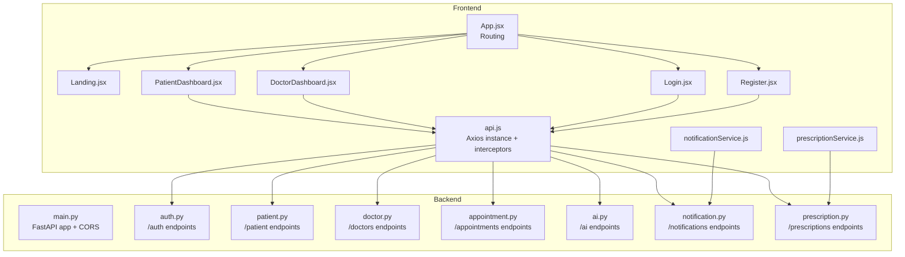
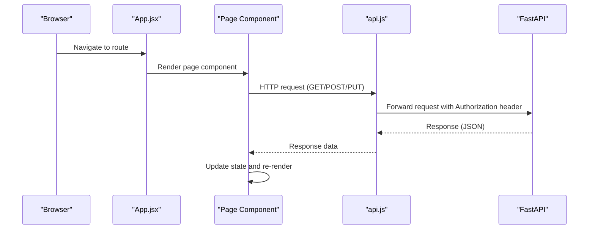
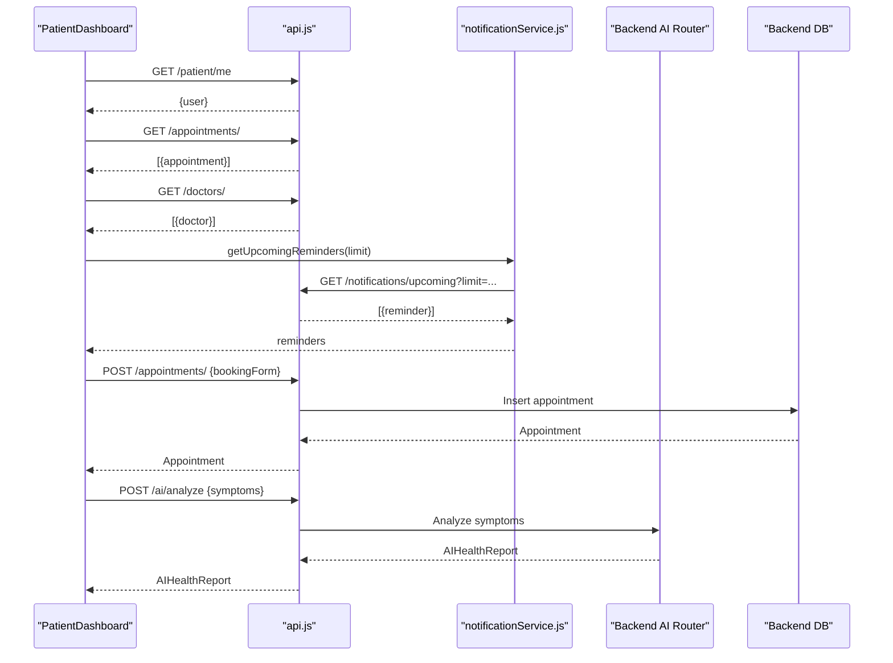
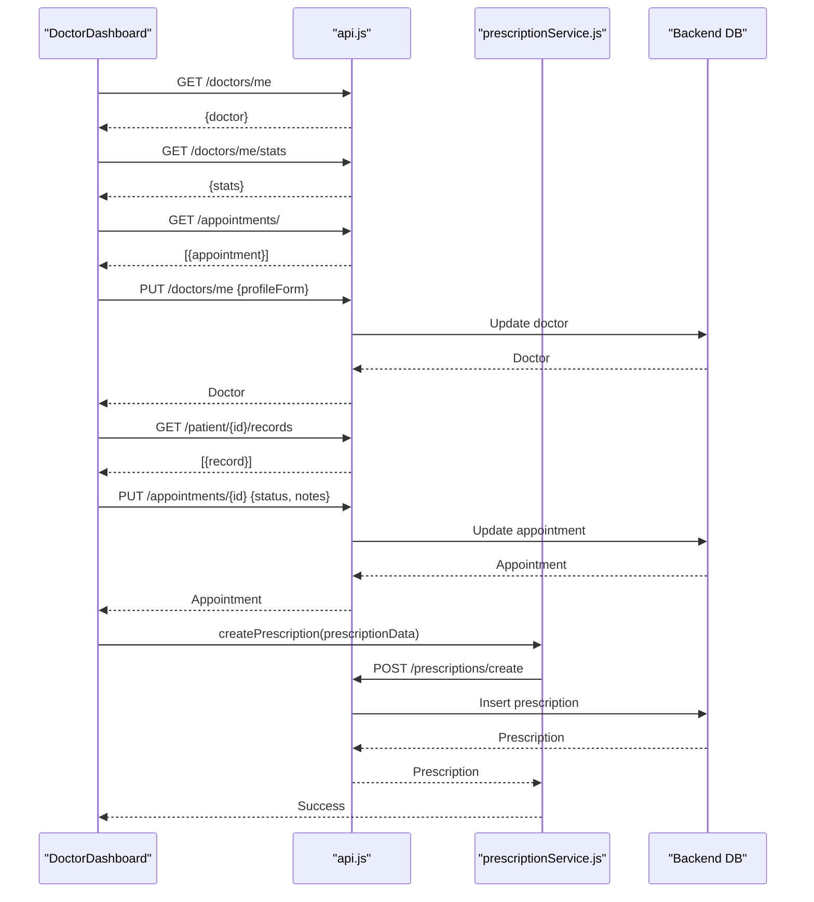
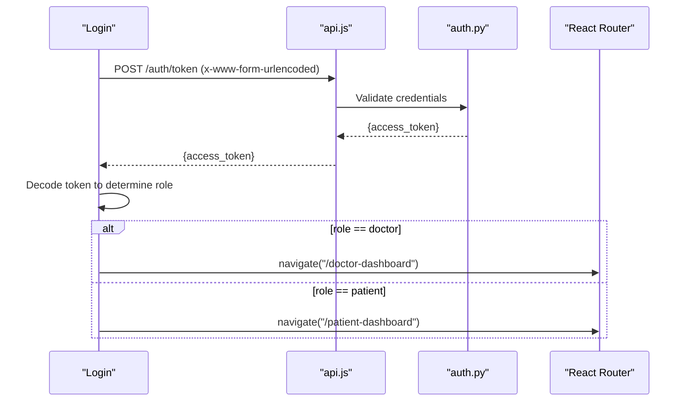
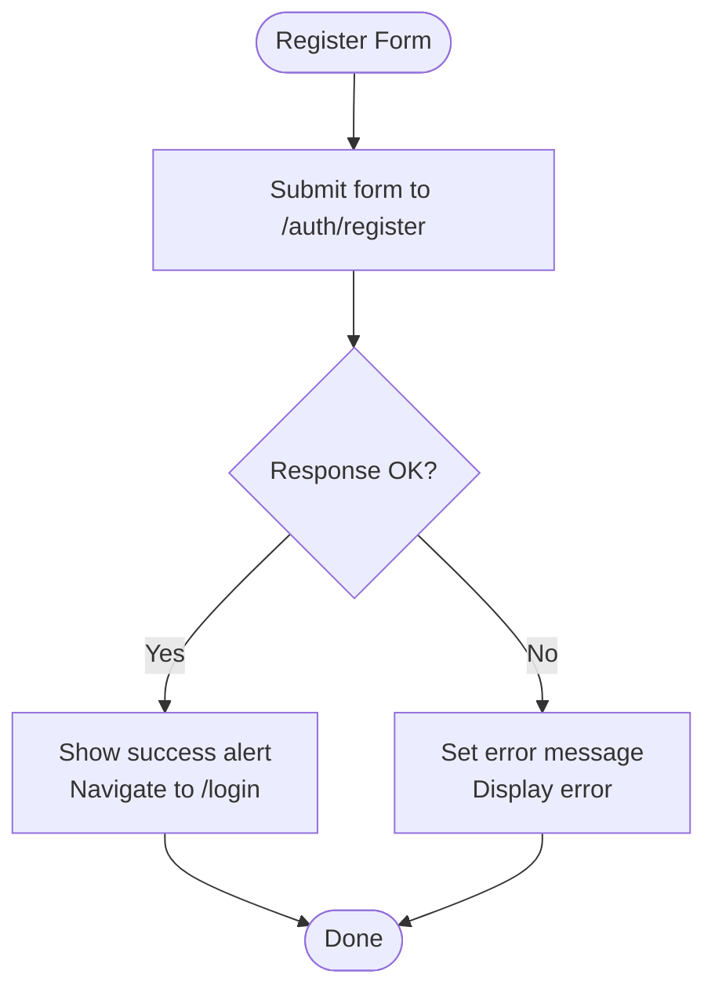
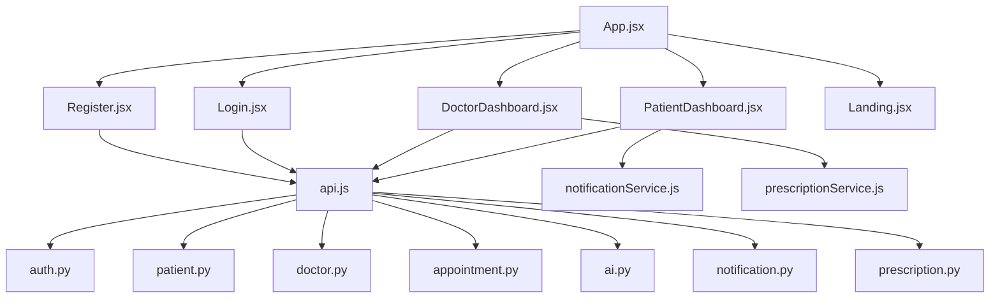

# Page Components

<cite>
**Referenced Files in This Document**
- [PatientDashboard.jsx](file://frontend/src/pages/PatientDashboard.jsx)
- [DoctorDashboard.jsx](file://frontend/src/pages/DoctorDashboard.jsx)
- [Login.jsx](file://frontend/src/pages/Login.jsx)
- [Register.jsx](file://frontend/src/pages/Register.jsx)
- [Landing.jsx](file://frontend/src/pages/Landing.jsx)
- [App.jsx](file://frontend/src/App.jsx)
- [api.js](file://frontend/src/services/api.js)
- [notificationService.js](file://frontend/src/services/notificationService.js)
- [prescriptionService.js](file://frontend/src/services/prescriptionService.js)
- [main.py](file://backend/main.py)
- [auth.py](file://backend/auth.py)
- [schemas.py](file://backend/schemas.py)
- [models.py](file://backend/models.py)
- [ai.py](file://backend/routers/ai.py)
- [appointment.py](file://backend/routers/appointment.py)
- [notification.py](file://backend/routers/notification.py)
- [patient.py](file://backend/routers/patient.py)
- [doctor.py](file://backend/routers/doctor.py)
- [prescription.py](file://backend/routers/prescription.py)
</cite>

## Table of Contents
1. [Introduction](#introduction)
2. [Project Structure](#project-structure)
3. [Core Components](#core-components)
4. [Architecture Overview](#architecture-overview)
5. [Detailed Component Analysis](#detailed-component-analysis)
6. [Dependency Analysis](#dependency-analysis)
7. [Performance Considerations](#performance-considerations)
8. [Troubleshooting Guide](#troubleshooting-guide)
9. [Conclusion](#conclusion)
10. [Appendices](#appendices)

## Introduction
This document provides comprehensive documentation for all SmartHealthCare page components. It covers:
- PatientDashboard: appointment management, health insights display, and patient-specific features
- DoctorDashboard: patient case management, appointment handling, and prescription creation interfaces
- Login and Register: form validation, authentication flows, and error handling
- Landing: user onboarding and marketing presentation
It explains component props, state management, user interaction patterns, and integration with the API layer. It also includes examples of usage, customization options, and responsive design considerations for each page.

## Project Structure
The frontend is a React application integrated with a FastAPI backend. Routing is handled client-side via React Router. Services encapsulate HTTP requests and authentication token injection. Backend exposes REST endpoints grouped by domain (auth, patient, doctor, appointment, AI, notifications, prescriptions).

**Diagram sources**
- [App.jsx](file://frontend/src/App.jsx#L9-L25)
- [api.js](file://frontend/src/services/api.js#L1-L25)
- [main.py](file://backend/main.py#L13-L61)
- [auth.py](file://backend/auth.py#L18-L120)
- [patient.py](file://backend/routers/patient.py#L6-L107)
- [doctor.py](file://backend/routers/doctor.py#L6-L120)
- [appointment.py](file://backend/routers/appointment.py#L7-L40)
- [ai.py](file://backend/routers/ai.py#L5-L90)
- [notification.py](file://backend/routers/notification.py#L8-L177)
- [prescription.py](file://backend/routers/prescription.py#L7-L137)

**Section sources**
- [App.jsx](file://frontend/src/App.jsx#L9-L25)
- [api.js](file://frontend/src/services/api.js#L1-L25)
- [main.py](file://backend/main.py#L13-L61)

## Core Components
This section outlines the responsibilities and key behaviors of each page component.

- PatientDashboard
  - Role: Patient portal for overview, appointments, health insights, and quick actions
  - Key features: sidebar navigation, tabs (overview, appointments, symptoms, records), booking modal, AI symptom analysis, upcoming reminders
  - State: activeTab, user, appointments, doctors, searchQuery, loading, upcomingReminders, symptoms, aiReport, analyzing, showBookingModal, bookingForm
  - Interactions: fetch profile, appointments, doctors, reminders; book appointment; analyze symptoms; open/close modals; tab switching
  - API integrations: GET /patient/me, GET /appointments/, GET /doctors/, GET /notifications/upcoming, POST /appointments/, POST /ai/analyze

- DoctorDashboard
  - Role: Doctor portal for overview, appointments, profile management, and prescriptions
  - Key features: statistics cards, tabs (overview, appointments, profile), appointment cards with actions, profile edit/update, prescription modal
  - State: activeTab, profile, stats, appointments, loading, editMode, showPrescriptionModal, selectedAppointment, profileForm
  - Interactions: fetch doctor data (profile, stats, appointments); update profile; view patient records; update appointment status; prescribe
  - API integrations: GET /doctors/me, GET /doctors/me/stats, GET /appointments/, PUT /doctors/me, GET /patient/{id}/records, POST /prescriptions/create

- Login
  - Role: Authentication entry point
  - Key features: email/password form, validation, error display, redirect based on role
  - State: email, password, loading, error
  - Interactions: submit form, persist token, route to appropriate dashboard
  - API integration: POST /auth/token

- Register
  - Role: Onboarding new users
  - Key features: full name, email, password, role selection (patient/doctor), submission feedback
  - State: formData (full_name, email, password, role), loading, error
  - Interactions: submit registration, navigate to login
  - API integration: POST /auth/register

- Landing
  - Role: Marketing and onboarding hub
  - Key features: hero section, feature cards, navigation links
  - State: none (static)
  - Interactions: link to login/register
  - API: none

**Section sources**
- [PatientDashboard.jsx](file://frontend/src/pages/PatientDashboard.jsx#L11-L636)
- [DoctorDashboard.jsx](file://frontend/src/pages/DoctorDashboard.jsx#L10-L419)
- [Login.jsx](file://frontend/src/pages/Login.jsx#L6-L104)
- [Register.jsx](file://frontend/src/pages/Register.jsx#L6-L124)
- [Landing.jsx](file://frontend/src/pages/Landing.jsx#L4-L104)

## Architecture Overview
The frontend communicates with the backend through Axios with automatic bearer token injection. The backend enforces role-based access control and exposes domain-specific endpoints. Notifications and prescriptions are accessed via dedicated services.

**Diagram sources**
- [App.jsx](file://frontend/src/App.jsx#L9-L25)
- [api.js](file://frontend/src/services/api.js#L10-L22)
- [main.py](file://backend/main.py#L34-L44)

## Detailed Component Analysis

### PatientDashboard Component
- Purpose: Central hub for patients to manage appointments, review health insights, and access quick actions.
- Props: None (uses internal state and hooks)
- State and Effects:
  - activeTab: controls visible tab content
  - user: current patient identity
  - appointments, doctors, searchQuery, loading, upcomingReminders
  - aiReport, symptoms, analyzing
  - showBookingModal, bookingForm
  - Side effects: fetch profile, appointments, doctors, reminders on mount
- Key Interactions:
  - Tab switching updates activeTab
  - Booking modal toggles showBookingModal and submits POST /appointments/
  - AI analysis triggers POST /ai/analyze and displays results
  - Upcoming reminders fetched via notificationService.getUpcomingReminders
- API Integrations:
  - GET /patient/me → set user
  - GET /appointments/ → set appointments
  - GET /doctors/ → set doctors
  - GET /notifications/upcoming → set upcomingReminders
  - POST /appointments/ → create appointment
  - POST /ai/analyze → generate report
- UI Patterns:
  - Responsive grid layout for stats and cards
  - Modal dialogs for booking and AI report display
  - Conditional rendering based on activeTab and data presence
- Customization Options:
  - Theme colors and spacing via Tailwind classes
  - Card components (DashboardCard, SidebarItem) accept props for icons, titles, and styles
- Responsive Design:
  - Uses grid and flex utilities; adjusts column counts and spacing for mobile/tablet/desktop

**Diagram sources**
- [PatientDashboard.jsx](file://frontend/src/pages/PatientDashboard.jsx#L35-L114)
- [notificationService.js](file://frontend/src/services/notificationService.js#L46-L57)
- [ai.py](file://backend/routers/ai.py#L10-L89)
- [appointment.py](file://backend/routers/appointment.py#L12-L37)

**Section sources**
- [PatientDashboard.jsx](file://frontend/src/pages/PatientDashboard.jsx#L11-L636)
- [notificationService.js](file://frontend/src/services/notificationService.js#L46-L57)
- [ai.py](file://backend/routers/ai.py#L10-L89)
- [appointment.py](file://backend/routers/appointment.py#L12-L37)

### DoctorDashboard Component
- Purpose: Manage doctor’s schedule, update profile, view patient records, and create prescriptions.
- Props: None (uses internal state and hooks)
- State and Effects:
  - activeTab: controls overview, appointments, profile
  - profile, stats, appointments, loading
  - editMode, showPrescriptionModal, selectedAppointment
  - profileForm: controlled form for profile updates
  - Side effect: fetch doctor data on mount
- Key Interactions:
  - Fetches profile, stats, and appointments concurrently
  - Updates profile via PUT /doctors/me
  - Views patient records via GET /patient/{id}/records
  - Updates appointment status via PUT /appointments/{id}
  - Opens prescription modal and creates via POST /prescriptions/create
  - Filters appointments by today/upcoming/past
- API Integrations:
  - GET /doctors/me → set profile
  - GET /doctors/me/stats → set stats
  - GET /appointments/ → set appointments
  - PUT /doctors/me → update profile
  - GET /patient/{id}/records → fetch records
  - PUT /appointments/{id} → update status and notes
  - POST /prescriptions/create → create prescription
- UI Patterns:
  - Stat cards, tabbed interface, appointment cards with action buttons
  - Controlled modal forms for booking and prescriptions
  - Status badges and color-coded indicators
- Customization Options:
  - StatCard, TabButton, ProfileField, AppointmentCard accept props for icons, labels, and styles
- Responsive Design:
  - Grid layouts adapt to screen sizes; buttons stack on smaller screens

**Diagram sources**
- [DoctorDashboard.jsx](file://frontend/src/pages/DoctorDashboard.jsx#L30-L137)
- [prescriptionService.js](file://frontend/src/services/prescriptionService.js#L12-L24)
- [prescription.py](file://backend/routers/prescription.py#L12-L52)

**Section sources**
- [DoctorDashboard.jsx](file://frontend/src/pages/DoctorDashboard.jsx#L10-L419)
- [prescriptionService.js](file://frontend/src/services/prescriptionService.js#L12-L24)
- [prescription.py](file://backend/routers/prescription.py#L12-L52)

### Login Component
- Purpose: Authenticate users and redirect to role-specific dashboards.
- Props: None
- State:
  - email, password, loading, error
- Interactions:
  - Submits form with x-www-form-urlencoded payload to POST /auth/token
  - Stores access_token in localStorage
  - Decodes token to determine role and navigates accordingly
  - Displays error on invalid credentials
- Validation:
  - HTML5 required attributes on inputs
  - Disabled button during loading
- API Integration:
  - POST /auth/token → receive access_token
- Security:
  - Token stored in localStorage; interceptor adds Authorization header for subsequent requests

**Diagram sources**
- [Login.jsx](file://frontend/src/pages/Login.jsx#L13-L47)
- [auth.py](file://backend/auth.py#L106-L119)

**Section sources**
- [Login.jsx](file://frontend/src/pages/Login.jsx#L6-L104)
- [auth.py](file://backend/auth.py#L106-L119)

### Register Component
- Purpose: Onboard new users with role selection.
- Props: None
- State:
  - formData: full_name, email, password, role
  - loading, error
- Interactions:
  - Submits POST /auth/register with JSON body
  - Shows error messages from backend
  - Navigates to login after success
- Validation:
  - HTML5 required attributes
  - Role toggle buttons
- API Integration:
  - POST /auth/register → create user and profile

**Diagram sources**
- [Register.jsx](file://frontend/src/pages/Register.jsx#L17-L32)
- [auth.py](file://backend/auth.py#L60-L104)

**Section sources**
- [Register.jsx](file://frontend/src/pages/Register.jsx#L6-L124)
- [auth.py](file://backend/auth.py#L60-L104)

### Landing Component
- Purpose: Marketing and onboarding entry point with navigation to login/register.
- Props: None
- State: None (static)
- Interactions:
  - Links to /login and /register
  - Hero and feature sections with hover animations
- Design:
  - Background images and gradient overlays
  - Feature cards with icons and transitions

**Section sources**
- [Landing.jsx](file://frontend/src/pages/Landing.jsx#L4-L104)

## Dependency Analysis
This section maps component dependencies and external integrations.

**Diagram sources**
- [PatientDashboard.jsx](file://frontend/src/pages/PatientDashboard.jsx#L1-L10)
- [DoctorDashboard.jsx](file://frontend/src/pages/DoctorDashboard.jsx#L1-L9)
- [Login.jsx](file://frontend/src/pages/Login.jsx#L1-L4)
- [Register.jsx](file://frontend/src/pages/Register.jsx#L1-L4)
- [Landing.jsx](file://frontend/src/pages/Landing.jsx#L1-L3)
- [App.jsx](file://frontend/src/App.jsx#L1-L28)
- [api.js](file://frontend/src/services/api.js#L1-L25)
- [notificationService.js](file://frontend/src/services/notificationService.js#L1-L117)
- [prescriptionService.js](file://frontend/src/services/prescriptionService.js#L1-L81)
- [auth.py](file://backend/auth.py#L18-L120)
- [patient.py](file://backend/routers/patient.py#L6-L107)
- [doctor.py](file://backend/routers/doctor.py#L6-L120)
- [appointment.py](file://backend/routers/appointment.py#L7-L40)
- [ai.py](file://backend/routers/ai.py#L5-L90)
- [notification.py](file://backend/routers/notification.py#L8-L177)
- [prescription.py](file://backend/routers/prescription.py#L7-L137)

**Section sources**
- [App.jsx](file://frontend/src/App.jsx#L1-L28)
- [api.js](file://frontend/src/services/api.js#L1-L25)
- [auth.py](file://backend/auth.py#L18-L120)

## Performance Considerations
- Minimize re-renders: Use memoized selectors or split components to avoid unnecessary updates.
- Lazy loading: Defer heavy computations until data is available.
- Efficient filtering/search: Apply filters on the client side only after data loads; consider debouncing search queries.
- API batching: Combine concurrent requests where possible (already done for doctor dashboard).
- Token caching: Persist token securely and reuse; avoid frequent token refreshes.
- Image optimization: Compress hero and pattern backgrounds; lazy-load where applicable.
- Pagination: Implement pagination for lists (e.g., appointments, notifications) to reduce DOM size.

## Troubleshooting Guide
- Authentication failures:
  - Verify token presence and validity; check interceptor injection
  - Ensure backend CORS allows frontend origins
  - Confirm login endpoint returns access_token and role
- Authorization errors:
  - Confirm user roles and protected endpoints
  - Check backend role checks in routers
- Network errors:
  - Inspect request headers and payloads
  - Validate base URL and endpoint correctness
- UI state issues:
  - Ensure state updates occur after successful API responses
  - Reset forms and modals on success or error
- Notifications and reminders:
  - Confirm notificationService methods are called with proper headers
  - Verify reminder limits and read/unread filters

**Section sources**
- [api.js](file://frontend/src/services/api.js#L10-L22)
- [auth.py](file://backend/auth.py#L106-L119)
- [notificationService.js](file://frontend/src/services/notificationService.js#L46-L57)
- [main.py](file://backend/main.py#L19-L32)

## Conclusion
The SmartHealthCare page components provide a cohesive, role-aware interface for patients and doctors. They integrate seamlessly with the backend through typed APIs and robust authentication. The components emphasize usability with responsive layouts, clear feedback, and intuitive workflows. Extending functionality involves adding new routes, services, and backend endpoints while maintaining consistent state management and error handling.

## Appendices

### API Endpoint Reference (Selected)
- Authentication
  - POST /auth/register
  - POST /auth/token
- Patient
  - GET /patient/me
  - GET /patient/{patient_id}/records
  - GET /patient/records
  - POST /patient/records
- Doctor
  - GET /doctors/me
  - PUT /doctors/me
  - GET /doctors/me/stats
  - GET /doctors/
- Appointment
  - POST /appointments/
  - GET /appointments/
  - PUT /appointments/{id}
- AI
  - POST /ai/analyze
- Notifications
  - GET /notifications/me
  - GET /notifications/stats
  - GET /notifications/upcoming
  - PATCH /notifications/{notification_id}/read
  - PATCH /notifications/mark-all-read
  - DELETE /notifications/{notification_id}
  - POST /notifications/create
- Prescriptions
  - POST /prescriptions/create
  - GET /prescriptions/me
  - GET /prescriptions/active/me
  - GET /prescriptions/patient/{patient_id}
  - GET /prescriptions/{prescription_id}

**Section sources**
- [auth.py](file://backend/auth.py#L60-L119)
- [patient.py](file://backend/routers/patient.py#L11-L107)
- [doctor.py](file://backend/routers/doctor.py#L28-L119)
- [appointment.py](file://backend/routers/appointment.py#L12-L40)
- [ai.py](file://backend/routers/ai.py#L10-L89)
- [notification.py](file://backend/routers/notification.py#L13-L177)
- [prescription.py](file://backend/routers/prescription.py#L55-L137)