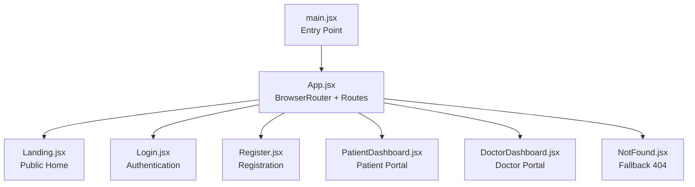
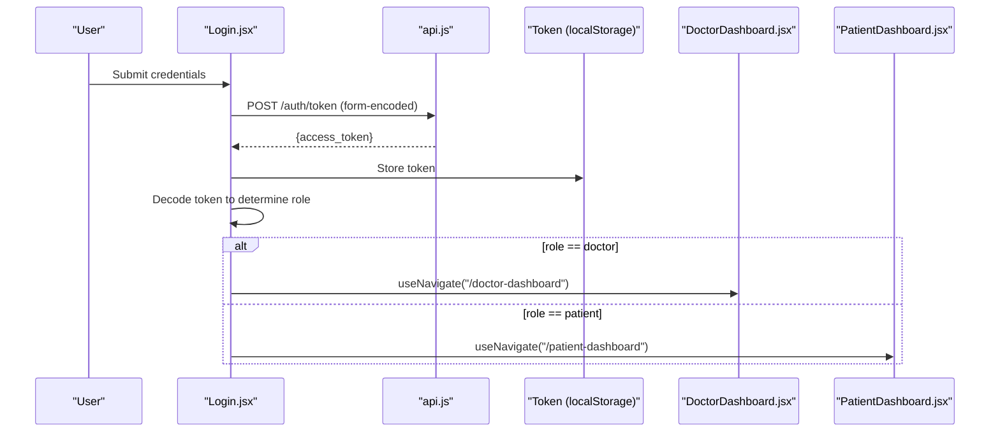
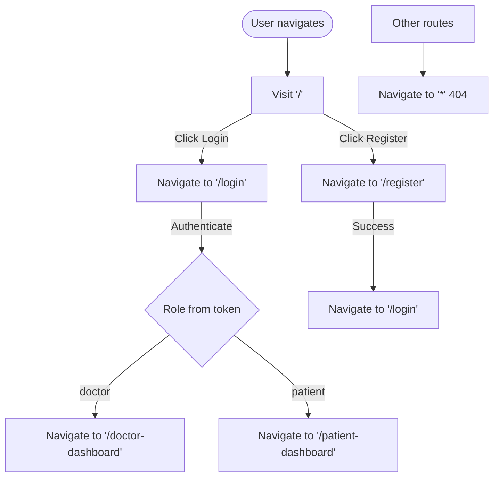
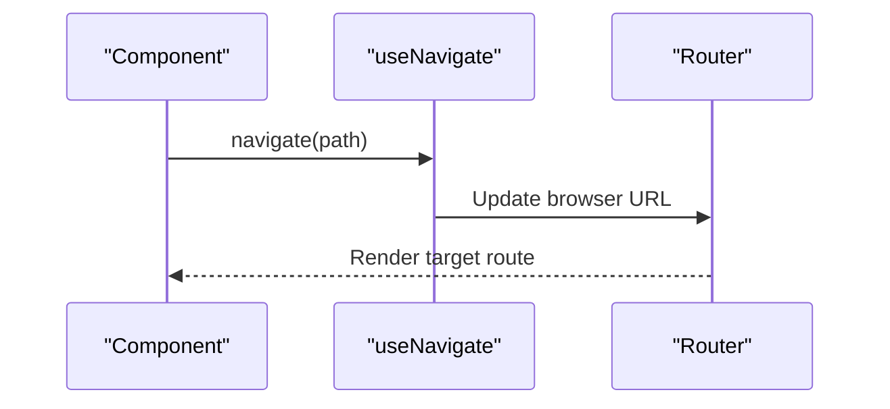
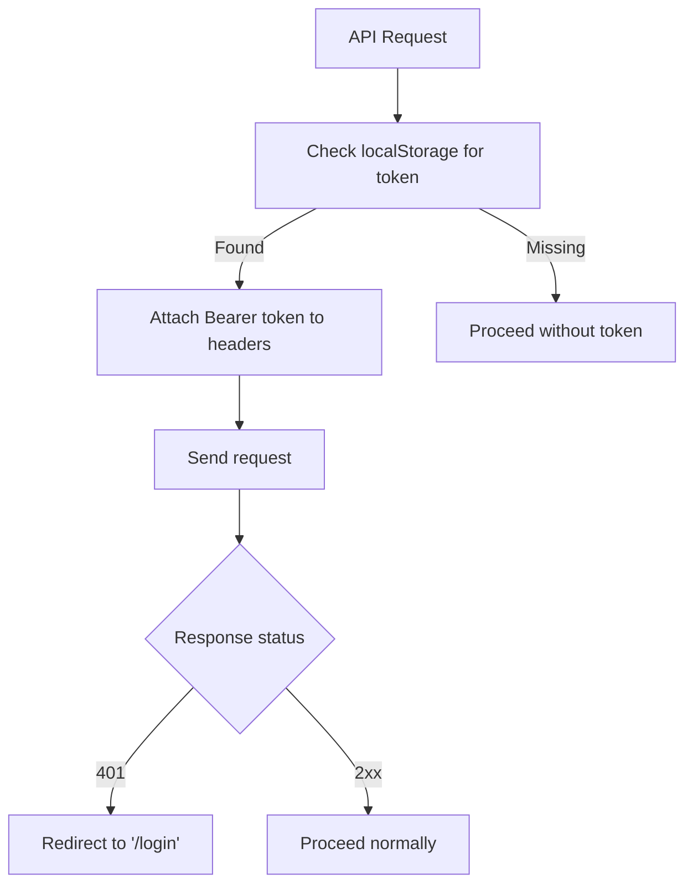
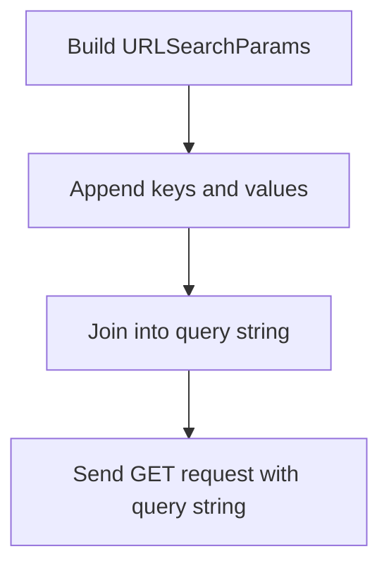
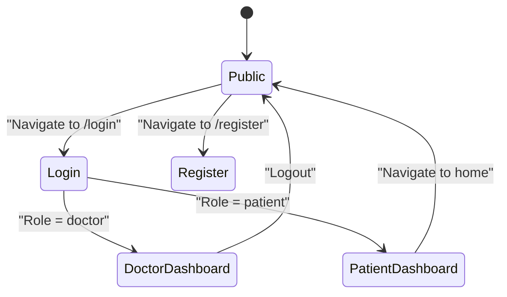
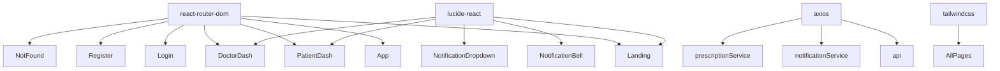

# Routing and Navigation

<cite>
**Referenced Files in This Document**
- [main.jsx](file://frontend/src/main.jsx)
- [App.jsx](file://frontend/src/App.jsx)
- [Landing.jsx](file://frontend/src/pages/Landing.jsx)
- [Login.jsx](file://frontend/src/pages/Login.jsx)
- [Register.jsx](file://frontend/src/pages/Register.jsx)
- [PatientDashboard.jsx](file://frontend/src/pages/PatientDashboard.jsx)
- [DoctorDashboard.jsx](file://frontend/src/pages/DoctorDashboard.jsx)
- [NotFound.jsx](file://frontend/src/pages/NotFound.jsx)
- [api.js](file://frontend/src/services/api.js)
- [notificationService.js](file://frontend/src/services/notificationService.js)
- [prescriptionService.js](file://frontend/src/services/prescriptionService.js)
- [NotificationBell.jsx](file://frontend/src/components/NotificationBell.jsx)
- [NotificationDropdown.jsx](file://frontend/src/components/NotificationDropdown.jsx)
- [package.json](file://frontend/package.json)
</cite>

## Table of Contents
1. [Introduction](#introduction)
2. [Project Structure](#project-structure)
3. [Core Components](#core-components)
4. [Architecture Overview](#architecture-overview)
5. [Detailed Component Analysis](#detailed-component-analysis)
6. [Dependency Analysis](#dependency-analysis)
7. [Performance Considerations](#performance-considerations)
8. [Troubleshooting Guide](#troubleshooting-guide)
9. [Conclusion](#conclusion)

## Introduction
This document explains the SmartHealthCare React routing and navigation system. It covers the React Router configuration, route definitions, navigation patterns, programmatic navigation, route protection, dynamic routing, URL parameter handling, query string management, and route-based conditional rendering. It also provides guidance on extending the routing system for new features while maintaining clean navigation patterns.

## Project Structure
The routing system is implemented in the frontend application using React Router v6. The main entry point renders the App component, which defines all routes and the fallback 404 page. Pages are organized under the pages directory, and navigation is performed via Link and useNavigate hooks.

**Diagram sources**
- [main.jsx](file://frontend/src/main.jsx#L1-L11)
- [App.jsx](file://frontend/src/App.jsx#L1-L28)

**Section sources**
- [main.jsx](file://frontend/src/main.jsx#L1-L11)
- [App.jsx](file://frontend/src/App.jsx#L1-L28)

## Core Components
- BrowserRouter setup: The App component wraps the application with BrowserRouter and defines all routes.
- Route definitions: Routes for "/", "/login", "/register", "/patient-dashboard", "/doctor-dashboard", and a fallback "*".
- Programmatic navigation: useNavigate is used in Login.jsx to redirect users after authentication, and in DoctorDashboard.jsx for logout and error handling.
- Route protection: Authentication tokens are attached to API requests via axios interceptors, enabling protected endpoints. DoctorDashboard.jsx demonstrates redirect to login on 401 responses.
- Dynamic routing: No dynamic segments are currently defined; navigation is static across defined routes.
- URL parameter handling: Not used in the current implementation.
- Query string management: Used in Login.jsx to send credentials as form-encoded data and in notificationService.js for filtering and pagination.
- Conditional rendering: Pages render conditionally based on user role derived from JWT payload and API responses.

**Section sources**
- [App.jsx](file://frontend/src/App.jsx#L1-L28)
- [Login.jsx](file://frontend/src/pages/Login.jsx#L1-L104)
- [DoctorDashboard.jsx](file://frontend/src/pages/DoctorDashboard.jsx#L1-L698)
- [api.js](file://frontend/src/services/api.js#L1-L25)
- [notificationService.js](file://frontend/src/services/notificationService.js#L1-L117)

## Architecture Overview
The routing architecture centers around a single Router instance that mounts all pages. Navigation is declarative via Link and imperative via useNavigate. Authentication is handled by storing a token in localStorage and attaching it to API requests via an axios interceptor. Role-based redirection occurs after login by decoding the JWT token.

**Diagram sources**
- [Login.jsx](file://frontend/src/pages/Login.jsx#L13-L47)
- [api.js](file://frontend/src/services/api.js#L10-L22)
- [DoctorDashboard.jsx](file://frontend/src/pages/DoctorDashboard.jsx#L10-L698)
- [PatientDashboard.jsx](file://frontend/src/pages/PatientDashboard.jsx#L1-L674)

## Detailed Component Analysis

### Route Definitions and Navigation Patterns
- "/" renders Landing.jsx with navigation links to "/login" and "/register".
- "/login" renders Login.jsx with programmatic navigation to role-specific dashboards.
- "/register" renders Register.jsx with programmatic navigation to "/login" upon success.
- "/patient-dashboard" renders PatientDashboard.jsx with role-specific UI and data fetching.
- "/doctor-dashboard" renders DoctorDashboard.jsx with role-specific UI and data fetching.
- "*" renders NotFound.jsx as the fallback 404 page.

**Diagram sources**
- [App.jsx](file://frontend/src/App.jsx#L13-L21)
- [Landing.jsx](file://frontend/src/pages/Landing.jsx#L13-L16)
- [Login.jsx](file://frontend/src/pages/Login.jsx#L35-L39)
- [Register.jsx](file://frontend/src/pages/Register.jsx#L24-L26)
- [NotFound.jsx](file://frontend/src/pages/NotFound.jsx#L1-L14)

**Section sources**
- [App.jsx](file://frontend/src/App.jsx#L13-L21)
- [Landing.jsx](file://frontend/src/pages/Landing.jsx#L13-L16)
- [Login.jsx](file://frontend/src/pages/Login.jsx#L35-L39)
- [Register.jsx](file://frontend/src/pages/Register.jsx#L24-L26)
- [NotFound.jsx](file://frontend/src/pages/NotFound.jsx#L1-L14)

### Programmatic Navigation
- useNavigate in Login.jsx redirects to "/doctor-dashboard" or "/patient-dashboard" based on decoded token role.
- useNavigate in DoctorDashboard.jsx logs out by removing the token and navigating to "/".
- useNavigate in DoctorDashboard.jsx redirects to "/login" when encountering a 401 response.

**Diagram sources**
- [Login.jsx](file://frontend/src/pages/Login.jsx#L35-L39)
- [DoctorDashboard.jsx](file://frontend/src/pages/DoctorDashboard.jsx#L65-L68)
- [DoctorDashboard.jsx](file://frontend/src/pages/DoctorDashboard.jsx#L57-L59)

**Section sources**
- [Login.jsx](file://frontend/src/pages/Login.jsx#L35-L39)
- [DoctorDashboard.jsx](file://frontend/src/pages/DoctorDashboard.jsx#L65-L68)
- [DoctorDashboard.jsx](file://frontend/src/pages/DoctorDashboard.jsx#L57-L59)

### Route Protection Mechanisms
- Token injection: api.js attaches an Authorization header to all outgoing requests using the token stored in localStorage.
- Role-based access: Login.jsx decodes the JWT to determine role and redirects accordingly.
- Unauthorized handling: DoctorDashboard.jsx checks for 401 responses and redirects to "/login".

**Diagram sources**
- [api.js](file://frontend/src/services/api.js#L10-L22)
- [Login.jsx](file://frontend/src/pages/Login.jsx#L33-L39)
- [DoctorDashboard.jsx](file://frontend/src/pages/DoctorDashboard.jsx#L55-L62)

**Section sources**
- [api.js](file://frontend/src/services/api.js#L10-L22)
- [Login.jsx](file://frontend/src/pages/Login.jsx#L33-L39)
- [DoctorDashboard.jsx](file://frontend/src/pages/DoctorDashboard.jsx#L55-L62)

### Dynamic Routing
- Current implementation does not define dynamic route parameters (e.g., /user/:id).
- Navigation is static across defined routes.

**Section sources**
- [App.jsx](file://frontend/src/App.jsx#L13-L21)

### URL Parameter Handling and Query String Management
- Login.jsx constructs a URLSearchParams object to send credentials as application/x-www-form-urlencoded.
- notificationService.js builds query strings for filtering and pagination (e.g., notification_type, is_read, limit, offset).

**Diagram sources**
- [Login.jsx](file://frontend/src/pages/Login.jsx#L19-L25)
- [notificationService.js](file://frontend/src/services/notificationService.js#L12-L29)

**Section sources**
- [Login.jsx](file://frontend/src/pages/Login.jsx#L19-L25)
- [notificationService.js](file://frontend/src/services/notificationService.js#L12-L29)

### Route-Based Conditional Rendering
- Landing.jsx conditionally renders navigation links for login and registration.
- PatientDashboard.jsx conditionally renders tabs and modals based on activeTab and state flags.
- DoctorDashboard.jsx conditionally renders tabs and profile edit mode based on activeTab and editMode.
- NotFound.jsx conditionally renders a link back to home.

**Section sources**
- [Landing.jsx](file://frontend/src/pages/Landing.jsx#L13-L16)
- [PatientDashboard.jsx](file://frontend/src/pages/PatientDashboard.jsx#L208-L566)
- [DoctorDashboard.jsx](file://frontend/src/pages/DoctorDashboard.jsx#L234-L401)
- [NotFound.jsx](file://frontend/src/pages/NotFound.jsx#L1-L14)

### Navigation Flow Between Roles and Dashboard Access
- Unauthenticated users land on Landing.jsx and navigate to Login.jsx or Register.jsx.
- After successful login, Login.jsx decodes the JWT and redirects to the appropriate dashboard.
- DoctorDashboard.jsx provides logout and profile management.
- PatientDashboard.jsx provides overview, appointments, health insights, and records.

**Diagram sources**
- [App.jsx](file://frontend/src/App.jsx#L13-L21)
- [Login.jsx](file://frontend/src/pages/Login.jsx#L33-L39)
- [DoctorDashboard.jsx](file://frontend/src/pages/DoctorDashboard.jsx#L65-L68)
- [PatientDashboard.jsx](file://frontend/src/pages/PatientDashboard.jsx#L1-L674)

**Section sources**
- [App.jsx](file://frontend/src/App.jsx#L13-L21)
- [Login.jsx](file://frontend/src/pages/Login.jsx#L33-L39)
- [DoctorDashboard.jsx](file://frontend/src/pages/DoctorDashboard.jsx#L65-L68)
- [PatientDashboard.jsx](file://frontend/src/pages/PatientDashboard.jsx#L1-L674)

## Dependency Analysis
- React Router is used for declarative routing and imperative navigation.
- Axios is used for API communication with an interceptor for token injection.
- Lucide icons are used for UI elements within pages and components.
- Tailwind CSS is used for styling across components.

**Diagram sources**
- [package.json](file://frontend/package.json#L12-L18)
- [api.js](file://frontend/src/services/api.js#L1-L25)
- [notificationService.js](file://frontend/src/services/notificationService.js#L1-L117)
- [prescriptionService.js](file://frontend/src/services/prescriptionService.js#L1-L81)
- [Landing.jsx](file://frontend/src/pages/Landing.jsx#L1-L104)
- [PatientDashboard.jsx](file://frontend/src/pages/PatientDashboard.jsx#L1-L674)
- [DoctorDashboard.jsx](file://frontend/src/pages/DoctorDashboard.jsx#L1-L698)
- [NotificationBell.jsx](file://frontend/src/components/NotificationBell.jsx#L1-L64)
- [NotificationDropdown.jsx](file://frontend/src/components/NotificationDropdown.jsx#L1-L182)

**Section sources**
- [package.json](file://frontend/package.json#L12-L18)
- [api.js](file://frontend/src/services/api.js#L1-L25)
- [notificationService.js](file://frontend/src/services/notificationService.js#L1-L117)
- [prescriptionService.js](file://frontend/src/services/prescriptionService.js#L1-L81)

## Performance Considerations
- Minimize re-renders by keeping route components focused and using local state efficiently.
- Use lazy loading for heavy components if needed, though current pages are relatively compact.
- Debounce or throttle frequent API calls (e.g., polling for notifications) to reduce network overhead.
- Avoid unnecessary navigation triggers during form submissions to prevent redundant route updates.

## Troubleshooting Guide
- 404 Not Found: Occurs when visiting undefined routes; NotFound.jsx displays a friendly message and a link back to home.
- Authentication failures: Ensure the token is present in localStorage and correctly attached to requests via the axios interceptor.
- Role redirection issues: Verify that the JWT payload contains the expected role field and that Login.jsx decodes it correctly.
- API errors: Check network tab for request/response details and confirm endpoint URLs match backend expectations.

**Section sources**
- [NotFound.jsx](file://frontend/src/pages/NotFound.jsx#L1-L14)
- [api.js](file://frontend/src/services/api.js#L10-L22)
- [Login.jsx](file://frontend/src/pages/Login.jsx#L33-L39)

## Conclusion
The SmartHealthCare routing system is straightforward and role-driven. It uses React Router for declarative navigation, axios interceptors for authentication, and programmatic navigation for role-based redirection. The current implementation focuses on static routes and does not use dynamic parameters or query strings extensively. Extending the system involves adding new routes, integrating role-aware guards, and leveraging existing services for API communication.