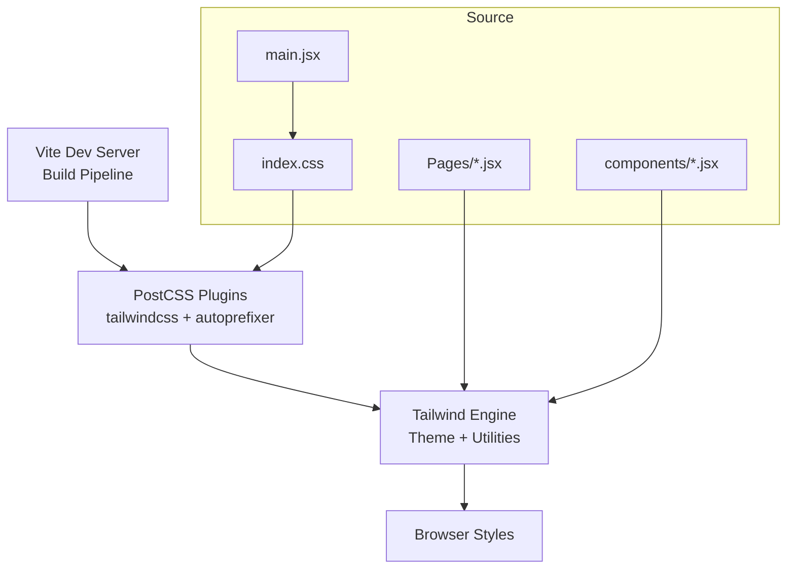
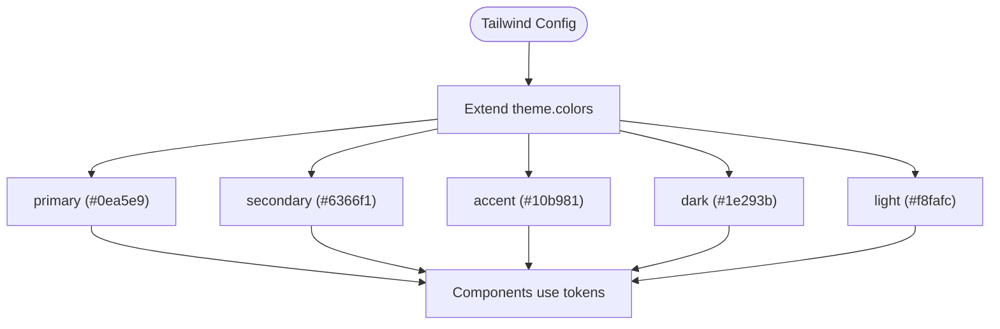
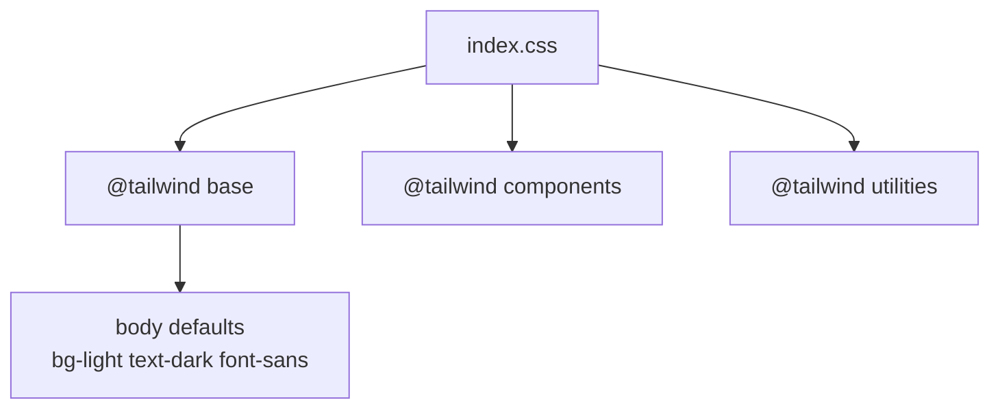
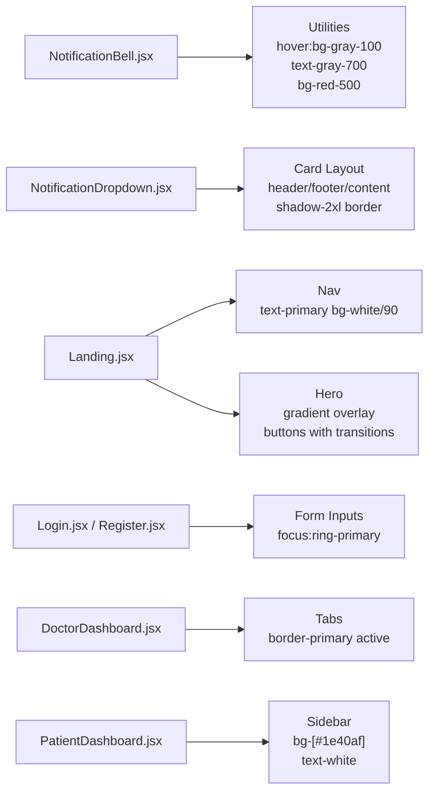
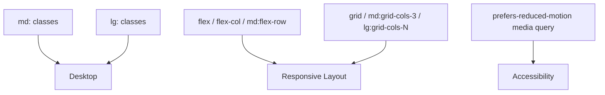
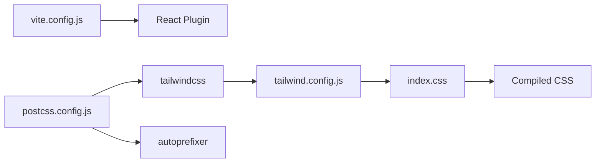

# Styling and Theming

<cite>
**Referenced Files in This Document**
- [tailwind.config.js](file://frontend/tailwind.config.js)
- [postcss.config.js](file://frontend/postcss.config.js)
- [vite.config.js](file://frontend/vite.config.js)
- [package.json](file://frontend/package.json)
- [index.css](file://frontend/src/index.css)
- [App.css](file://frontend/src/App.css)
- [main.jsx](file://frontend/src/main.jsx)
- [NotificationBell.jsx](file://frontend/src/components/NotificationBell.jsx)
- [NotificationDropdown.jsx](file://frontend/src/components/NotificationDropdown.jsx)
- [Landing.jsx](file://frontend/src/pages/Landing.jsx)
- [Login.jsx](file://frontend/src/pages/Login.jsx)
- [Register.jsx](file://frontend/src/pages/Register.jsx)
- [DoctorDashboard.jsx](file://frontend/src/pages/DoctorDashboard.jsx)
- [PatientDashboard.jsx](file://frontend/src/pages/PatientDashboard.jsx)
- [NotFound.jsx](file://frontend/src/pages/NotFound.jsx)
</cite>

## Table of Contents
1. [Introduction](#introduction)
2. [Project Structure](#project-structure)
3. [Core Components](#core-components)
4. [Architecture Overview](#architecture-overview)
5. [Detailed Component Analysis](#detailed-component-analysis)
6. [Dependency Analysis](#dependency-analysis)
7. [Performance Considerations](#performance-considerations)
8. [Troubleshooting Guide](#troubleshooting-guide)
9. [Conclusion](#conclusion)
10. [Appendices](#appendices)

## Introduction
This document explains the SmartHealthCare frontend styling and theming system. It covers Tailwind CSS configuration, custom theme settings, color palette definitions, and utility class usage patterns. It also documents the CSS architecture (global styles, component-specific styling, and responsive design), PostCSS configuration and build integration via Vite, and practical guidelines for maintaining design consistency, creating custom components with Tailwind utilities, and implementing dark mode support. Accessibility-compliant design practices and performance considerations for CSS delivery and production builds are included.

## Project Structure
The frontend uses Vite for development and build, Tailwind CSS for styling, and PostCSS with autoprefixer for vendor prefixing. Global styles are defined in a single CSS entry file, while components apply Tailwind utilities directly in JSX. The Tailwind configuration extends a minimal color palette and enables scanning of templates for purging unused styles.



**Diagram sources**
- [vite.config.js](file://frontend/vite.config.js#L1-L8)
- [postcss.config.js](file://frontend/postcss.config.js#L1-L7)
- [tailwind.config.js](file://frontend/tailwind.config.js#L1-L20)
- [index.css](file://frontend/src/index.css#L1-L10)
- [main.jsx](file://frontend/src/main.jsx#L1-L11)

**Section sources**
- [vite.config.js](file://frontend/vite.config.js#L1-L8)
- [postcss.config.js](file://frontend/postcss.config.js#L1-L7)
- [tailwind.config.js](file://frontend/tailwind.config.js#L1-L20)
- [index.css](file://frontend/src/index.css#L1-L10)
- [main.jsx](file://frontend/src/main.jsx#L1-L11)

## Core Components
- Tailwind configuration defines a compact color palette with named tokens for primary, secondary, accent, dark, and light. These tokens are used consistently across components for brand alignment and accessibility contrast.
- PostCSS pipeline applies Tailwind directives and autoprefixer for cross-browser compatibility.
- Global base styles establish a default background and text color using the theme tokens and set a sans-serif font stack.
- Components leverage Tailwind utilities for layout, spacing, colors, shadows, and transitions, ensuring a consistent design system.

Key configuration highlights:
- Tailwind theme extension adds named colors mapped to brand-safe hues.
- PostCSS enables Tailwind and autoprefixer plugins.
- Vite plugin stack includes React Fast Refresh and JSX transforms.

**Section sources**
- [tailwind.config.js](file://frontend/tailwind.config.js#L7-L16)
- [postcss.config.js](file://frontend/postcss.config.js#L1-L7)
- [index.css](file://frontend/src/index.css#L5-L9)
- [package.json](file://frontend/package.json#L19-L32)
- [vite.config.js](file://frontend/vite.config.js#L1-L8)

## Architecture Overview
The styling architecture follows a layered approach:
- Global base styles: Establish defaults for body background and typography.
- Component utilities: Apply Tailwind utilities directly in JSX for layout, colors, and interactions.
- Theme tokens: Use named colors from the Tailwind theme to maintain consistency.
- Responsive patterns: Combine Tailwind’s responsive prefixes and layout utilities for adaptive designs.
- Build integration: Vite compiles CSS via PostCSS with Tailwind and autoprefixer.

```mermaid
graph TB
subgraph "Build Layer"
Pkg["package.json<br/>Dev Dependencies"]
ViteCfg["vite.config.js"]
PostCSSCfg["postcss.config.js"]
TailwindCfg["tailwind.config.js"]
end
subgraph "Styles Layer"
GlobalCSS["index.css<br/>@tailwind base/components/utilities"]
BaseLayer["Base Layer<br/>body defaults"]
end
subgraph "Components"
Pages["Pages/*.jsx<br/>Layout + Utilities"]
Components["components/*.jsx<br/>UI + Utilities"]
end
Pkg --> ViteCfg
ViteCfg --> PostCSSCfg
PostCSSCfg --> TailwindCfg
TailwindCfg --> GlobalCSS
GlobalCSS --> BaseLayer
Pages --> GlobalCSS
Components --> GlobalCSS
```

**Diagram sources**
- [package.json](file://frontend/package.json#L19-L32)
- [vite.config.js](file://frontend/vite.config.js#L1-L8)
- [postcss.config.js](file://frontend/postcss.config.js#L1-L7)
- [tailwind.config.js](file://frontend/tailwind.config.js#L1-L20)
- [index.css](file://frontend/src/index.css#L1-L10)

## Detailed Component Analysis

### Tailwind Configuration and Theme Tokens
- Color palette extension: Named tokens for primary, secondary, accent, dark, and light enable consistent theming across components.
- Utility usage patterns: Components reference these tokens for backgrounds, borders, text, and interactive states.



**Diagram sources**
- [tailwind.config.js](file://frontend/tailwind.config.js#L7-L16)

**Section sources**
- [tailwind.config.js](file://frontend/tailwind.config.js#L7-L16)

### Global Styles and Base Layer
- Global entry imports Tailwind layers and sets body defaults using theme tokens for background and text color.
- Typography and font family are applied globally for consistent text rendering.



**Diagram sources**
- [index.css](file://frontend/src/index.css#L1-L9)

**Section sources**
- [index.css](file://frontend/src/index.css#L5-L9)

### Component-Specific Styling Patterns
- NotificationBell: Uses hover and transition utilities with a gray background for interaction feedback and a red badge for unread counts.
- NotificationDropdown: Implements a card-like layout with header, content area, and footer; uses gradients, shadows, and borders for depth; icons reflect notification types.
- Landing page: Navigation bar uses theme tokens; hero section leverages gradient overlays and background images; feature cards emphasize hover effects and transitions.
- Login/Register forms: Consistent input styling with focus rings aligned to primary/secondary tokens; buttons use gradient and transition utilities.
- Doctor/Patient dashboards: Extensive use of grid layouts, cards, tabs, modals, and badges; status indicators use contextual background tokens; sidebar and header use theme tokens for branding.



**Diagram sources**
- [NotificationBell.jsx](file://frontend/src/components/NotificationBell.jsx#L42-L54)
- [NotificationDropdown.jsx](file://frontend/src/components/NotificationDropdown.jsx#L89-L102)
- [Landing.jsx](file://frontend/src/pages/Landing.jsx#L8-L17)
- [Landing.jsx](file://frontend/src/pages/Landing.jsx#L20-L54)
- [Login.jsx](file://frontend/src/pages/Login.jsx#L57-L95)
- [Register.jsx](file://frontend/src/pages/Register.jsx#L34-L121)
- [DoctorDashboard.jsx](file://frontend/src/pages/DoctorDashboard.jsx#L240-L263)
- [PatientDashboard.jsx](file://frontend/src/pages/PatientDashboard.jsx#L126-L179)

**Section sources**
- [NotificationBell.jsx](file://frontend/src/components/NotificationBell.jsx#L42-L54)
- [NotificationDropdown.jsx](file://frontend/src/components/NotificationDropdown.jsx#L89-L102)
- [Landing.jsx](file://frontend/src/pages/Landing.jsx#L8-L54)
- [Login.jsx](file://frontend/src/pages/Login.jsx#L57-L95)
- [Register.jsx](file://frontend/src/pages/Register.jsx#L34-L121)
- [DoctorDashboard.jsx](file://frontend/src/pages/DoctorDashboard.jsx#L240-L263)
- [PatientDashboard.jsx](file://frontend/src/pages/PatientDashboard.jsx#L126-L179)

### Responsive Design Implementation
- Responsive prefixes: Components use responsive variants (e.g., md:, lg:) to adapt layouts across breakpoints.
- Grid and flex utilities: Pages employ grid and flex layouts with responsive modifiers for cards, navigation, and content areas.
- Media queries: Global CSS includes media queries for reduced motion preferences.



**Diagram sources**
- [Landing.jsx](file://frontend/src/pages/Landing.jsx#L68-L84)
- [PatientDashboard.jsx](file://frontend/src/pages/PatientDashboard.jsx#L242-L377)
- [App.css](file://frontend/src/App.css#L30-L34)

**Section sources**
- [Landing.jsx](file://frontend/src/pages/Landing.jsx#L68-L84)
- [PatientDashboard.jsx](file://frontend/src/pages/PatientDashboard.jsx#L242-L377)
- [App.css](file://frontend/src/App.css#L30-L34)

### Dark Mode Support
- Current state: The existing configuration and components primarily target a light theme using the configured tokens.
- Recommended approach: Introduce a dark mode variant by extending the theme with dark-mode-aware tokens and toggling a root attribute or class. Use Tailwind’s dark mode strategy to flip colors for dark backgrounds and text.

Implementation steps:
- Extend theme with dark variants for key tokens.
- Add a toggle mechanism to switch modes.
- Use dark: prefixed utilities for conditional styling.

[No sources needed since this section provides general guidance]

### Accessibility-Compliant Design Practices
- Focus states: Forms and interactive elements use ring utilities to indicate focus.
- Contrast: Theme tokens are chosen to maintain readable contrast; avoid low-contrast combinations.
- Reduced motion: Respect prefers-reduced-motion with appropriate animations.
- Semantic roles: Buttons and links are used appropriately; ensure ARIA attributes where needed.

**Section sources**
- [Login.jsx](file://frontend/src/pages/Login.jsx#L65-L84)
- [Register.jsx](file://frontend/src/pages/Register.jsx#L50-L84)
- [App.css](file://frontend/src/App.css#L30-L34)

### Creating Custom Components with Tailwind Utilities
- Prefer composition: Combine small utility classes for layout and style.
- Use theme tokens: Reference primary, secondary, accent, dark, and light tokens for consistency.
- Keep it declarative: Define hover, focus, and active states directly on elements.
- Test responsiveness: Verify behavior across breakpoints using responsive variants.

**Section sources**
- [NotificationBell.jsx](file://frontend/src/components/NotificationBell.jsx#L42-L54)
- [NotificationDropdown.jsx](file://frontend/src/components/NotificationDropdown.jsx#L117-L159)
- [DoctorDashboard.jsx](file://frontend/src/pages/DoctorDashboard.jsx#L457-L577)

## Dependency Analysis
The styling pipeline depends on Vite, Tailwind, and PostCSS. The build process integrates Tailwind directives and autoprefixer automatically during compilation.



**Diagram sources**
- [vite.config.js](file://frontend/vite.config.js#L1-L8)
- [postcss.config.js](file://frontend/postcss.config.js#L1-L7)
- [tailwind.config.js](file://frontend/tailwind.config.js#L1-L20)
- [index.css](file://frontend/src/index.css#L1-L3)

**Section sources**
- [vite.config.js](file://frontend/vite.config.js#L1-L8)
- [postcss.config.js](file://frontend/postcss.config.js#L1-L7)
- [tailwind.config.js](file://frontend/tailwind.config.js#L1-L20)
- [index.css](file://frontend/src/index.css#L1-L3)

## Performance Considerations
- Purge unused CSS: Tailwind scans template paths defined in the configuration; ensure all component paths are included to remove unused styles.
- Minification and hashing: Vite’s build process produces hashed assets; ensure production builds are used for deployment.
- Critical rendering: Keep base styles minimal; defer non-critical animations until interaction.
- Image optimization: Background images are referenced directly; optimize assets for web delivery.

**Section sources**
- [tailwind.config.js](file://frontend/tailwind.config.js#L3-L6)
- [package.json](file://frontend/package.json#L7-L11)

## Troubleshooting Guide
- Styles not applying:
  - Verify Tailwind directives are present in the global CSS entry.
  - Ensure the content paths in Tailwind config include all component files.
- Build errors:
  - Confirm PostCSS plugins are installed and configured.
  - Check Vite dev server and build commands in package scripts.
- Color mismatches:
  - Replace hardcoded hex values with theme tokens for consistency.
- Accessibility issues:
  - Add focus-visible outlines and ensure sufficient contrast.
  - Respect reduced motion preferences.

**Section sources**
- [index.css](file://frontend/src/index.css#L1-L3)
- [tailwind.config.js](file://frontend/tailwind.config.js#L3-L6)
- [postcss.config.js](file://frontend/postcss.config.js#L1-L7)
- [package.json](file://frontend/package.json#L7-L11)

## Conclusion
SmartHealthCare’s styling system centers on a concise Tailwind theme, a clean global base layer, and component-driven utility classes. The PostCSS and Vite integration ensures efficient builds with autoprefixing and purging. By adhering to the established patterns—using theme tokens, responsive utilities, and accessibility-first practices—the team can scale the design system while maintaining performance and consistency.

## Appendices

### Tailwind Configuration Reference
- Theme extension: Named colors for primary, secondary, accent, dark, and light.
- Content scanning: Template paths for purging unused styles.

**Section sources**
- [tailwind.config.js](file://frontend/tailwind.config.js#L7-L16)
- [tailwind.config.js](file://frontend/tailwind.config.js#L3-L6)

### PostCSS and Build Integration
- Plugins: Tailwind and autoprefixer enabled.
- Scripts: Dev, build, and preview commands for local development and testing.

**Section sources**
- [postcss.config.js](file://frontend/postcss.config.js#L1-L7)
- [package.json](file://frontend/package.json#L6-L11)

### Example Styling Patterns
- Navigation bars: Use theme tokens for branding and transparency effects.
- Cards and modals: Employ shadows, borders, and rounded corners for depth.
- Status indicators: Use contextual background tokens for clear communication.
- Forms: Maintain focus rings aligned to primary/secondary tokens.

**Section sources**
- [Landing.jsx](file://frontend/src/pages/Landing.jsx#L8-L17)
- [DoctorDashboard.jsx](file://frontend/src/pages/DoctorDashboard.jsx#L457-L577)
- [PatientDashboard.jsx](file://frontend/src/pages/PatientDashboard.jsx#L420-L430)
- [Login.jsx](file://frontend/src/pages/Login.jsx#L57-L95)