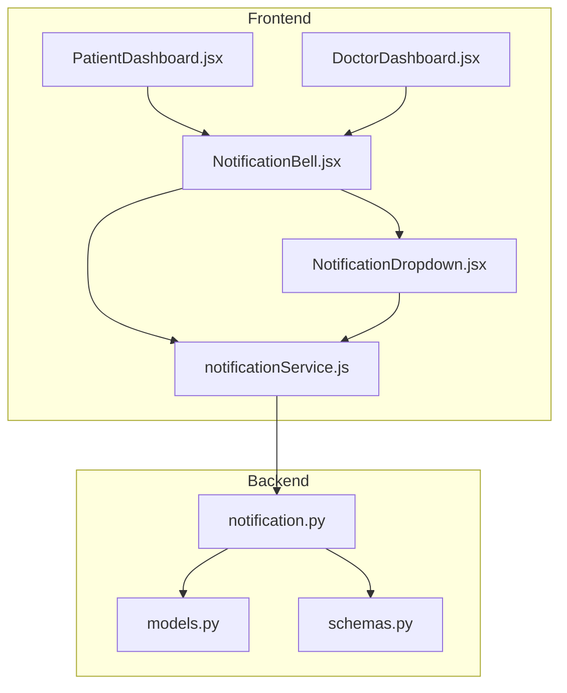
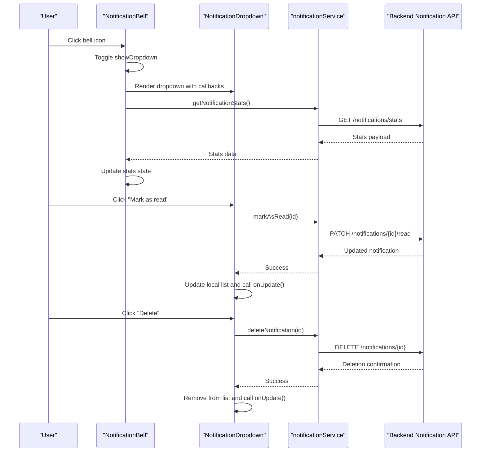
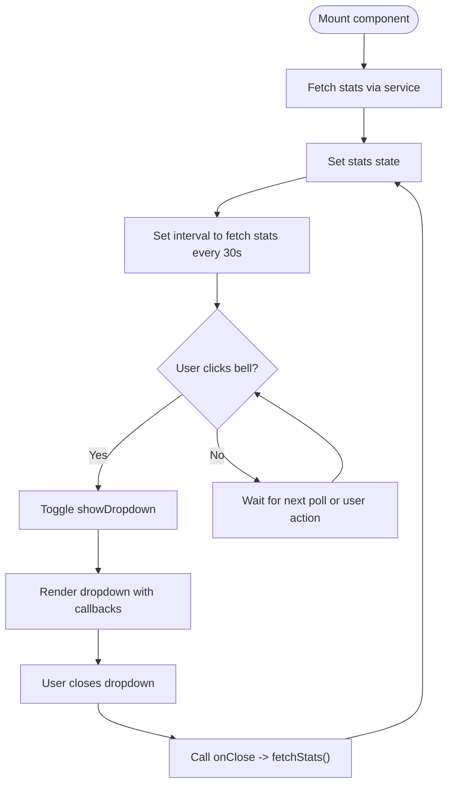
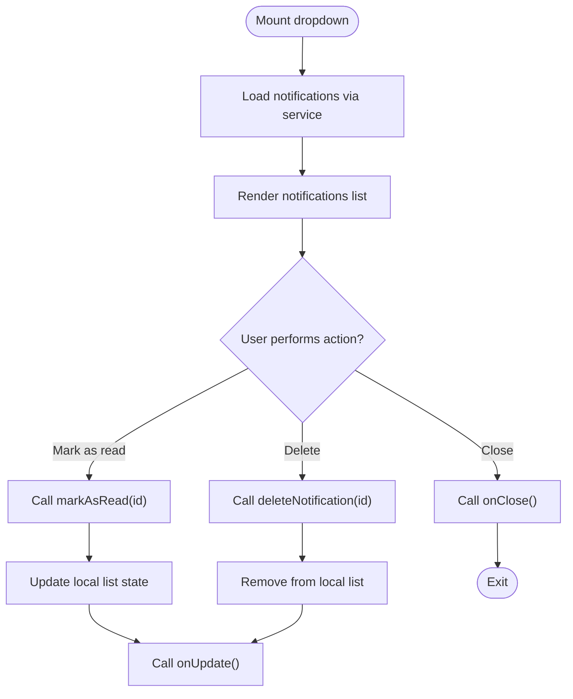
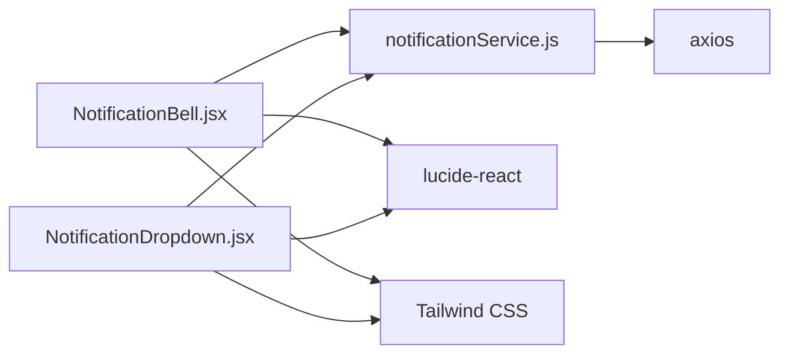

# UI Components

<cite>
**Referenced Files in This Document**
- [NotificationBell.jsx](file://frontend/src/components/NotificationBell.jsx)
- [NotificationDropdown.jsx](file://frontend/src/components/NotificationDropdown.jsx)
- [notificationService.js](file://frontend/src/services/notificationService.js)
- [PatientDashboard.jsx](file://frontend/src/pages/PatientDashboard.jsx)
- [DoctorDashboard.jsx](file://frontend/src/pages/DoctorDashboard.jsx)
- [notification.py](file://backend/routers/notification.py)
- [models.py](file://backend/models.py)
- [schemas.py](file://backend/schemas.py)
- [package.json](file://frontend/package.json)
</cite>

## Table of Contents
1. [Introduction](#introduction)
2. [Project Structure](#project-structure)
3. [Core Components](#core-components)
4. [Architecture Overview](#architecture-overview)
5. [Detailed Component Analysis](#detailed-component-analysis)
6. [Dependency Analysis](#dependency-analysis)
7. [Performance Considerations](#performance-considerations)
8. [Troubleshooting Guide](#troubleshooting-guide)
9. [Conclusion](#conclusion)
10. [Appendices](#appendices)

## Introduction
This document provides comprehensive documentation for the SmartHealthCare reusable UI components focused on notifications. It covers the NotificationBell and NotificationDropdown components, detailing their props, event handlers, styling approaches, accessibility features, and integration patterns. It also explains how these components interact with the backend notification service, how to extend them, and how to maintain design consistency across the application.

## Project Structure
The notification UI components reside in the frontend under the components directory and are integrated into the dashboard pages. They communicate with the backend via a dedicated notification service that encapsulates API calls.

**Diagram sources**
- [NotificationBell.jsx](file://frontend/src/components/NotificationBell.jsx#L1-L64)
- [NotificationDropdown.jsx](file://frontend/src/components/NotificationDropdown.jsx#L1-L182)
- [notificationService.js](file://frontend/src/services/notificationService.js#L1-L117)
- [PatientDashboard.jsx](file://frontend/src/pages/PatientDashboard.jsx#L1-L674)
- [DoctorDashboard.jsx](file://frontend/src/pages/DoctorDashboard.jsx#L1-L698)
- [notification.py](file://backend/routers/notification.py#L1-L177)
- [models.py](file://backend/models.py#L75-L90)
- [schemas.py](file://backend/schemas.py#L181-L200)

**Section sources**
- [NotificationBell.jsx](file://frontend/src/components/NotificationBell.jsx#L1-L64)
- [NotificationDropdown.jsx](file://frontend/src/components/NotificationDropdown.jsx#L1-L182)
- [notificationService.js](file://frontend/src/services/notificationService.js#L1-L117)
- [PatientDashboard.jsx](file://frontend/src/pages/PatientDashboard.jsx#L1-L674)
- [DoctorDashboard.jsx](file://frontend/src/pages/DoctorDashboard.jsx#L1-L698)
- [notification.py](file://backend/routers/notification.py#L1-L177)
- [models.py](file://backend/models.py#L75-L90)
- [schemas.py](file://backend/schemas.py#L181-L200)

## Core Components
This section documents the two primary notification components and their responsibilities.

- NotificationBell: Displays the bell icon, unread count badge, and toggles the dropdown visibility. It fetches notification statistics and polls for updates.
- NotificationDropdown: Renders the dropdown menu, lists notifications with icons and timestamps, and handles actions like marking as read and deleting notifications.

Key integration points:
- Both components rely on the notificationService for API interactions.
- NotificationBell composes NotificationDropdown and passes callbacks for closing and refreshing stats.
- Dashboard pages integrate NotificationBell into the header layout.

**Section sources**
- [NotificationBell.jsx](file://frontend/src/components/NotificationBell.jsx#L6-L64)
- [NotificationDropdown.jsx](file://frontend/src/components/NotificationDropdown.jsx#L5-L182)
- [notificationService.js](file://frontend/src/services/notificationService.js#L11-L117)
- [PatientDashboard.jsx](file://frontend/src/pages/PatientDashboard.jsx#L184-L202)

## Architecture Overview
The notification UI follows a parent-child composition pattern with service-layer abstraction:

**Diagram sources**
- [NotificationBell.jsx](file://frontend/src/components/NotificationBell.jsx#L11-L40)
- [NotificationDropdown.jsx](file://frontend/src/components/NotificationDropdown.jsx#L24-L56)
- [notificationService.js](file://frontend/src/services/notificationService.js#L32-L101)
- [notification.py](file://backend/routers/notification.py#L41-L67)
- [notification.py](file://backend/routers/notification.py#L88-L107)
- [notification.py](file://backend/routers/notification.py#L126-L144)

## Detailed Component Analysis

### NotificationBell Component
Responsibilities:
- Manage local state for stats, dropdown visibility, and loading state.
- Fetch notification statistics on mount and periodically.
- Toggle dropdown visibility and refresh stats when dropdown closes.
- Render the bell icon with an animated unread count badge.

Props and callbacks:
- No props required. Uses internal state and callbacks passed by parent (in this case, composed by dashboard pages).

Event handlers:
- handleBellClick: Toggles dropdown visibility.
- handleClose: Closes dropdown and triggers a stats refresh.

Styling and accessibility:
- Uses Tailwind classes for positioning, hover effects, and badge animation.
- Accessibility: Provides an aria-label for the bell button.

Integration:
- Imported by dashboard pages and rendered in the header alongside search controls.

**Diagram sources**
- [NotificationBell.jsx](file://frontend/src/components/NotificationBell.jsx#L23-L40)

**Section sources**
- [NotificationBell.jsx](file://frontend/src/components/NotificationBell.jsx#L6-L64)
- [notificationService.js](file://frontend/src/services/notificationService.js#L32-L43)

### NotificationDropdown Component
Responsibilities:
- Load and display recent notifications.
- Handle user interactions: mark as read, delete, close, and navigate to full notification list.
- Provide visual feedback for loading and empty states.
- Manage click-outside-to-close behavior.

Props and callbacks:
- onClose: Called when the user clicks the close button or clicks outside the dropdown.
- onUpdate: Called after successful mark-as-read or delete operations to signal parent to refresh stats.

Event handlers:
- loadNotifications: Fetches notifications with pagination-like limit.
- handleMarkAsRead: Updates local list and calls onUpdate.
- handleDelete: Removes notification locally and calls onUpdate.
- getNotificationIcon: Maps notification type to an icon.
- formatDateTime: Converts scheduled_datetime to human-friendly relative time.

Styling and accessibility:
- Uses Tailwind for layout, shadows, borders, and responsive sizing.
- Accessible: Close button and action buttons have titles and hover states.

**Diagram sources**
- [NotificationDropdown.jsx](file://frontend/src/components/NotificationDropdown.jsx#L10-L56)

**Section sources**
- [NotificationDropdown.jsx](file://frontend/src/components/NotificationDropdown.jsx#L5-L182)
- [notificationService.js](file://frontend/src/services/notificationService.js#L12-L101)

### Backend Integration
The frontend components communicate with backend endpoints defined in the notification router. The backend models and schemas define the data structure for notifications.

Endpoints used by the frontend:
- GET /notifications/stats: Returns notification statistics including total unread count.
- GET /notifications/me?limit=10: Returns paginated notifications for the current user.
- PATCH /notifications/{id}/read: Marks a notification as read.
- DELETE /notifications/{id}: Deletes a notification.

Data model and schema:
- Notification entity includes fields like user_id, notification_type, title, message, scheduled_datetime, is_read, and related_entity_id.
- Pydantic schemas define the shape of requests and responses.

**Section sources**
- [notificationService.js](file://frontend/src/services/notificationService.js#L12-L101)
- [notification.py](file://backend/routers/notification.py#L41-L85)
- [models.py](file://backend/models.py#L75-L90)
- [schemas.py](file://backend/schemas.py#L181-L200)

## Dependency Analysis
The components depend on:
- React hooks for state and lifecycle management.
- lucide-react for icons.
- Axios for HTTP requests.
- Tailwind CSS for styling.

**Diagram sources**
- [NotificationBell.jsx](file://frontend/src/components/NotificationBell.jsx#L1-L5)
- [NotificationDropdown.jsx](file://frontend/src/components/NotificationDropdown.jsx#L1-L4)
- [notificationService.js](file://frontend/src/services/notificationService.js#L1-L1)
- [package.json](file://frontend/package.json#L12-L17)

**Section sources**
- [package.json](file://frontend/package.json#L12-L17)
- [NotificationBell.jsx](file://frontend/src/components/NotificationBell.jsx#L1-L5)
- [NotificationDropdown.jsx](file://frontend/src/components/NotificationDropdown.jsx#L1-L4)
- [notificationService.js](file://frontend/src/services/notificationService.js#L1-L1)

## Performance Considerations
- Polling: NotificationBell polls stats every 30 seconds. Consider debouncing or adjusting intervals based on usage patterns.
- Local updates: NotificationDropdown optimistically updates the UI after mark-as-read and delete operations, reducing perceived latency.
- Lazy loading: The dropdown limits notifications fetched to a small number, improving initial render performance.
- Memoization: Consider memoizing icon selection and date formatting if performance becomes a concern.
- Event listeners: The dropdown cleans up the click-outside listener on unmount to prevent memory leaks.

[No sources needed since this section provides general guidance]

## Troubleshooting Guide
Common issues and resolutions:
- Unread count not updating: Verify that the stats polling interval is running and that the backend endpoint returns the expected data.
- Dropdown does not close on outside click: Ensure the click-outside handler is attached and the ref is correctly assigned.
- Mark-as-read/delete actions fail: Check network connectivity and backend authorization headers; confirm the user token is present in localStorage.
- Icons missing: Ensure lucide-react is installed and available.

**Section sources**
- [NotificationBell.jsx](file://frontend/src/components/NotificationBell.jsx#L23-L40)
- [NotificationDropdown.jsx](file://frontend/src/components/NotificationDropdown.jsx#L13-L22)
- [notificationService.js](file://frontend/src/services/notificationService.js#L5-L9)

## Conclusion
The NotificationBell and NotificationDropdown components provide a cohesive, accessible, and efficient notification experience. They are designed for composability, with clear separation of concerns between UI, state, and service layers. By following the guidelines in this document, developers can extend and maintain these components while preserving design consistency across the application.

[No sources needed since this section summarizes without analyzing specific files]

## Appendices

### Props and Events Reference
- NotificationBell
  - Props: None
  - Callbacks: None (manages internal state)
  - Events: None (renders button with click handler)
- NotificationDropdown
  - Props:
    - onClose: Function to close the dropdown
    - onUpdate: Function to refresh parent stats
  - Events:
    - Close button click
    - Mark-as-read button click
    - Delete button click

**Section sources**
- [NotificationBell.jsx](file://frontend/src/components/NotificationBell.jsx#L6-L64)
- [NotificationDropdown.jsx](file://frontend/src/components/NotificationDropdown.jsx#L5-L182)

### Usage Examples
- Integrating into a dashboard header:
  - Import NotificationBell into the dashboard page and render it alongside search controls.
  - The bell will automatically manage its own state and trigger the dropdown when clicked.

- Managing state externally:
  - If you need to control the dropdown visibility from a parent component, pass a controlled prop to NotificationBell and manage visibility via a parent state variable.

- Handling responsive behavior:
  - The dropdown uses Tailwind utilities for width and overflow. Adjust breakpoints as needed for different screen sizes.

**Section sources**
- [PatientDashboard.jsx](file://frontend/src/pages/PatientDashboard.jsx#L184-L202)
- [NotificationBell.jsx](file://frontend/src/components/NotificationBell.jsx#L41-L60)
- [NotificationDropdown.jsx](file://frontend/src/components/NotificationDropdown.jsx#L88-L178)

### Extending Components
- Adding new notification types:
  - Extend the icon mapping in NotificationDropdown to support new notification_type values.
  - Update backend schemas and router to include new notification types if needed.
- Customizing styling:
  - Override Tailwind classes for badges, dropdown container, and list items to match brand guidelines.
- Enhancing accessibility:
  - Add keyboard navigation support for dropdown items.
  - Provide ARIA attributes for loading states and empty states.

**Section sources**
- [NotificationDropdown.jsx](file://frontend/src/components/NotificationDropdown.jsx#L58-L71)
- [schemas.py](file://backend/schemas.py#L181-L200)
- [models.py](file://backend/models.py#L75-L90)

### Maintaining Design Consistency
- Use a centralized theme or design system for colors, spacing, and typography.
- Keep iconography consistent by reusing lucide-react icons across components.
- Standardize loading indicators and error messages for uniform UX.

[No sources needed since this section provides general guidance]