# Getting Started

<cite>
**Referenced Files in This Document**
- [.env.example](file://.env.example)
- [requirements.txt](file://requirements.txt)
- [backend/main.py](file://backend/main.py)
- [backend/database.py](file://backend/database.py)
- [backend/init_db.py](file://backend/init_db.py)
- [backend/models.py](file://backend/models.py)
- [backend/auth.py](file://backend/auth.py)
- [backend/routers/patient.py](file://backend/routers/patient.py)
- [backend/routers/appointment.py](file://backend/routers/appointment.py)
- [frontend/package.json](file://frontend/package.json)
- [frontend/src/services/api.js](file://frontend/src/services/api.js)
- [frontend/README.md](file://frontend/README.md)
- [test_registration.py](file://test_registration.py)
- [check_tables.py](file://check_tables.py)
- [create_test_doctor.py](file://create_test_doctor.py)
- [debug_doctor_api.py](file://debug_doctor_api.py)
- [update_db.py](file://update_db.py)
</cite>

## Table of Contents
1. [Introduction](#introduction)
2. [Project Structure](#project-structure)
3. [Prerequisites](#prerequisites)
4. [Installation](#installation)
5. [Environment Variables](#environment-variables)
6. [Database Initialization](#database-initialization)
7. [First-Time Setup](#first-time-setup)
8. [Verification](#verification)
9. [Quick Start Examples](#quick-start-examples)
10. [Architecture Overview](#architecture-overview)
11. [Detailed Component Analysis](#detailed-component-analysis)
12. [Dependency Analysis](#dependency-analysis)
13. [Performance Considerations](#performance-considerations)
14. [Troubleshooting Guide](#troubleshooting-guide)
15. [Conclusion](#conclusion)

## Introduction
SmartHealthCare is a healthcare management platform built with a modern web stack. The backend is a FastAPI application providing REST endpoints for user authentication, patient and doctor profiles, appointments, prescriptions, and notifications. The frontend is a React application using Vite for development and building. The system uses SQLite for local development and SQLAlchemy for ORM.

## Project Structure
The repository is organized into backend and frontend directories, each containing their respective configurations and source code. Shared configuration includes environment variables and database initialization scripts.

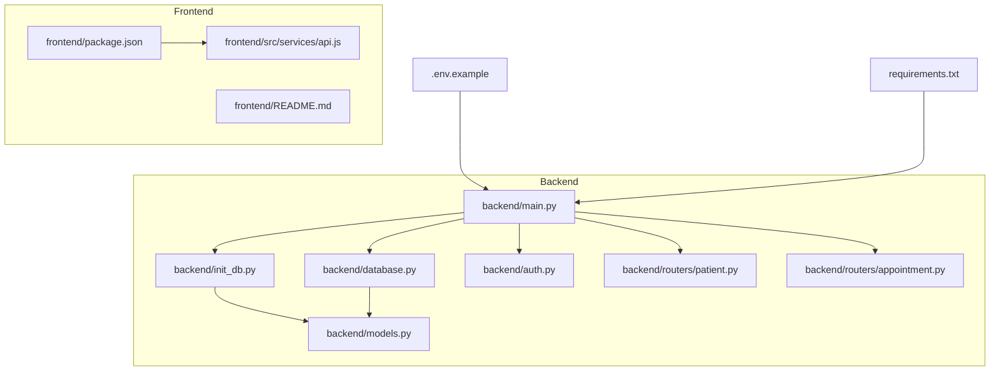

**Diagram sources**
- [backend/main.py](file://backend/main.py#L1-L61)
- [backend/database.py](file://backend/database.py#L1-L22)
- [backend/init_db.py](file://backend/init_db.py#L1-L11)
- [backend/models.py](file://backend/models.py#L1-L110)
- [backend/auth.py](file://backend/auth.py#L1-L120)
- [backend/routers/patient.py](file://backend/routers/patient.py#L1-L107)
- [backend/routers/appointment.py](file://backend/routers/appointment.py#L1-L129)
- [frontend/package.json](file://frontend/package.json#L1-L35)
- [frontend/src/services/api.js](file://frontend/src/services/api.js#L1-L25)
- [.env.example](file://.env.example#L1-L13)
- [requirements.txt](file://requirements.txt#L1-L14)

**Section sources**
- [backend/main.py](file://backend/main.py#L1-L61)
- [frontend/package.json](file://frontend/package.json#L1-L35)

## Prerequisites
- Python 3.8 or higher
- Node.js (tested with v18.x)
- pip (Python package manager)
- npm (Node package manager)
- SQLite (included with Python; no separate installation required)

Note: The backend uses SQLite by default for local development. Production deployments can switch to PostgreSQL by updating the database URL in the database configuration.

**Section sources**
- [requirements.txt](file://requirements.txt#L1-L14)
- [backend/database.py](file://backend/database.py#L5-L7)

## Installation
### Backend Setup
1. Navigate to the backend directory
2. Install Python dependencies
3. Initialize the database
4. Start the backend server

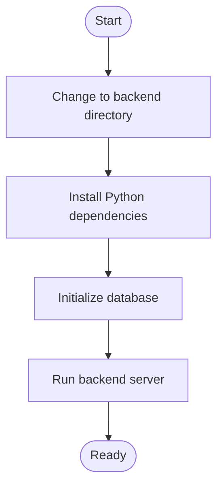

**Diagram sources**
- [backend/init_db.py](file://backend/init_db.py#L1-L11)
- [backend/main.py](file://backend/main.py#L46-L56)

### Frontend Setup
1. Navigate to the frontend directory
2. Install JavaScript dependencies
3. Start the development server

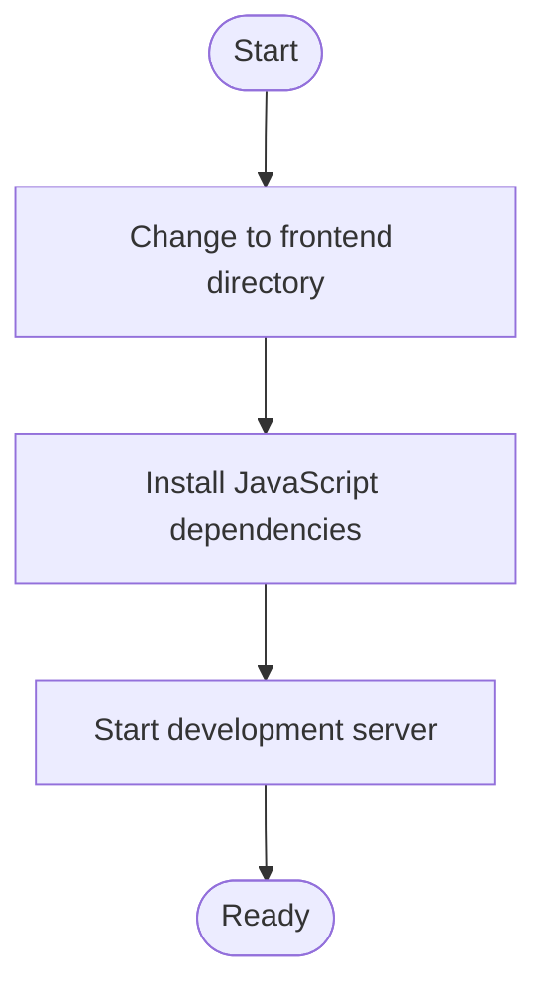

**Diagram sources**
- [frontend/package.json](file://frontend/package.json#L6-L11)
- [frontend/README.md](file://frontend/README.md#L1-L9)

**Section sources**
- [requirements.txt](file://requirements.txt#L1-L14)
- [backend/init_db.py](file://backend/init_db.py#L1-L11)
- [backend/main.py](file://backend/main.py#L46-L56)
- [frontend/package.json](file://frontend/package.json#L1-L35)

## Environment Variables
Copy the example environment file and configure optional email settings for notifications.

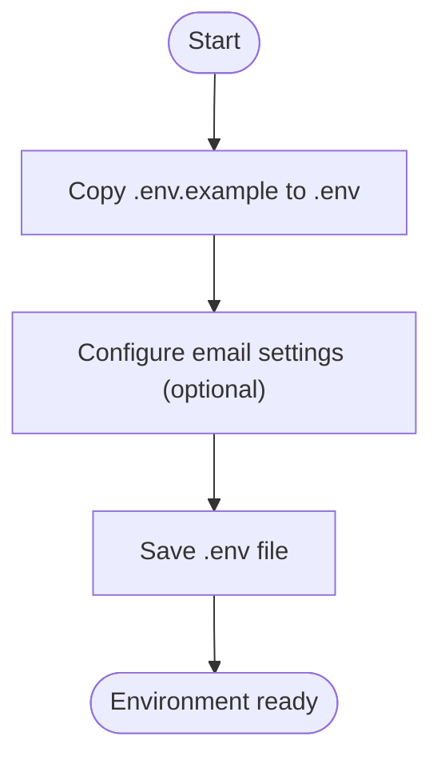

**Diagram sources**
- [.env.example](file://.env.example#L1-L13)

Key environment variables:
- EMAIL_HOST: SMTP server hostname
- EMAIL_PORT: SMTP server port
- EMAIL_USERNAME: Email account username
- EMAIL_PASSWORD: Email account password or app-specific password
- EMAIL_FROM: Sender display name and email address

Notes:
- For Gmail, enable 2-factor authentication and generate an app password
- If email settings are not configured, notifications will only appear in-app

**Section sources**
- [.env.example](file://.env.example#L1-L13)

## Database Initialization
The system uses SQLite by default. Database initialization creates all tables defined in the models.

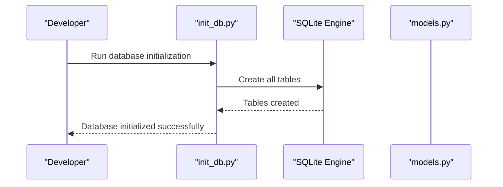

**Diagram sources**
- [backend/init_db.py](file://backend/init_db.py#L1-L11)
- [backend/database.py](file://backend/database.py#L1-L22)
- [backend/models.py](file://backend/models.py#L1-L110)

Initialization steps:
1. Verify database URL points to SQLite
2. Import all models before creation
3. Call create_all to generate tables
4. Confirm successful initialization

**Section sources**
- [backend/init_db.py](file://backend/init_db.py#L1-L11)
- [backend/database.py](file://backend/database.py#L5-L14)
- [backend/models.py](file://backend/models.py#L1-L110)

## First-Time Setup
Complete initial setup by running database initialization and starting both servers.

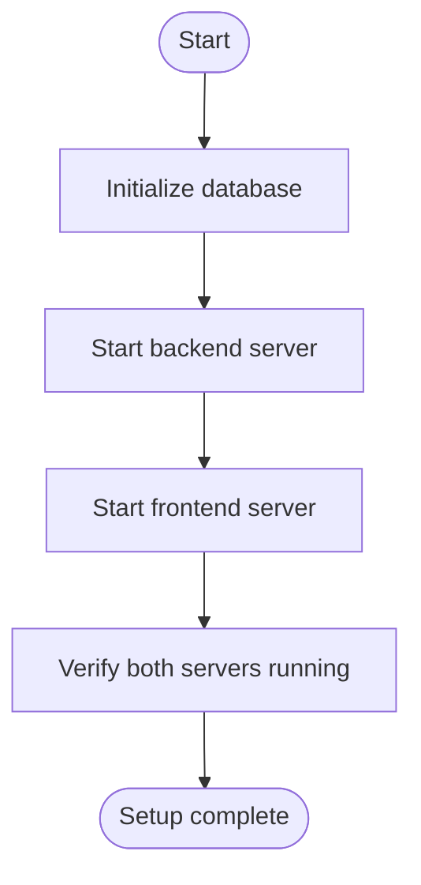

**Diagram sources**
- [backend/init_db.py](file://backend/init_db.py#L1-L11)
- [backend/main.py](file://backend/main.py#L46-L56)
- [frontend/package.json](file://frontend/package.json#L6-L11)

Required ports:
- Backend: http://localhost:8000
- Frontend: http://localhost:5173 (Vite default)

**Section sources**
- [backend/main.py](file://backend/main.py#L13-L32)
- [frontend/src/services/api.js](file://frontend/src/services/api.js#L3-L8)

## Verification
Verify the installation by checking server responses and database tables.

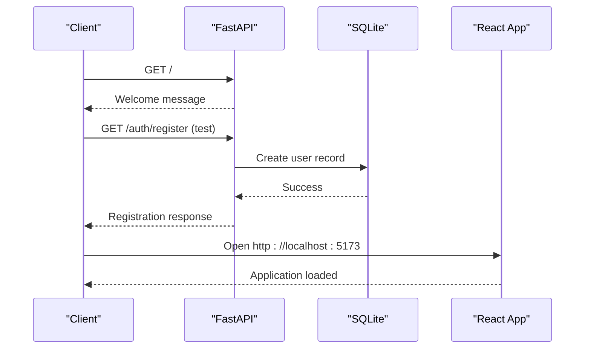

**Diagram sources**
- [backend/main.py](file://backend/main.py#L58-L61)
- [backend/auth.py](file://backend/auth.py#L60-L104)
- [frontend/src/services/api.js](file://frontend/src/services/api.js#L3-L8)

Verification steps:
1. Backend health check: curl http://localhost:8000/
2. Database tables check: python check_tables.py
3. Frontend load: Open http://localhost:5173 in browser
4. Registration test: python test_registration.py

**Section sources**
- [backend/main.py](file://backend/main.py#L58-L61)
- [check_tables.py](file://check_tables.py#L1-L7)
- [test_registration.py](file://test_registration.py#L1-L21)

## Quick Start Examples
Common scenarios for new users:

### User Registration
Register a new user through the authentication endpoint.

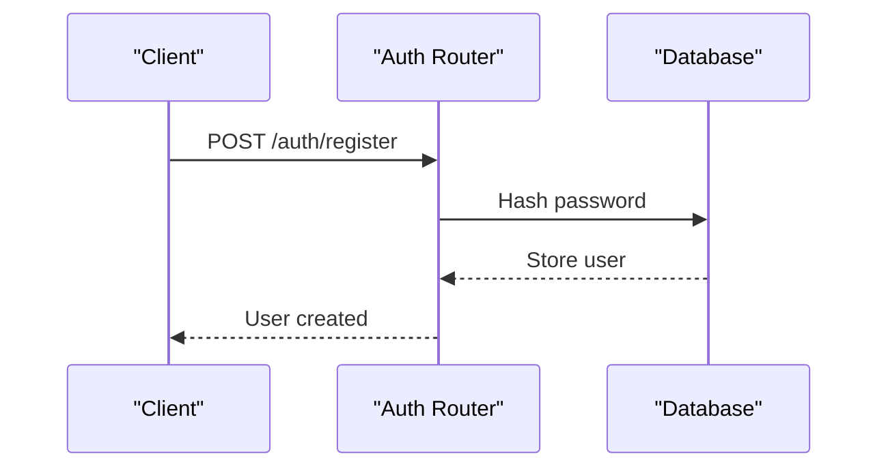

**Diagram sources**
- [backend/auth.py](file://backend/auth.py#L60-L104)

Registration payload fields:
- email: Unique user email
- password: Secure password
- full_name: User's full name
- role: patient or doctor

### Appointment Booking
Book an appointment as a patient.

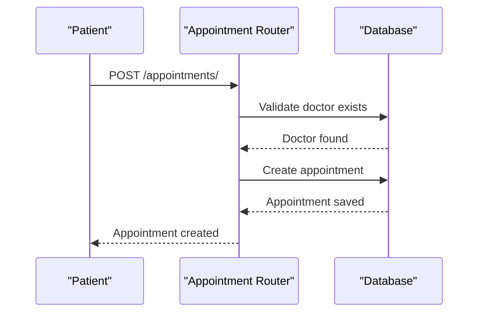

**Diagram sources**
- [backend/routers/appointment.py](file://backend/routers/appointment.py#L12-L37)

Appointment payload fields:
- doctor_id: Target doctor's ID
- appointment_date: ISO format datetime
- reason: Appointment purpose

**Section sources**
- [backend/auth.py](file://backend/auth.py#L60-L104)
- [backend/routers/appointment.py](file://backend/routers/appointment.py#L12-L37)

## Architecture Overview
SmartHealthCare follows a client-server architecture with clear separation between frontend and backend concerns.

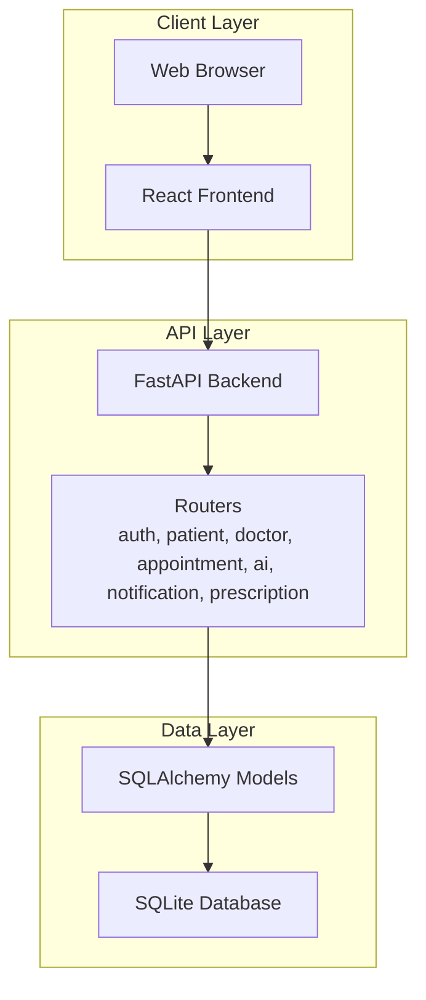

**Diagram sources**
- [backend/main.py](file://backend/main.py#L34-L44)
- [backend/models.py](file://backend/models.py#L1-L110)

Key architectural components:
- FastAPI for REST API endpoints
- SQLAlchemy ORM for database operations
- React for user interface
- SQLite for local development storage

**Section sources**
- [backend/main.py](file://backend/main.py#L1-L61)
- [backend/models.py](file://backend/models.py#L1-L110)

## Detailed Component Analysis

### Authentication System
The authentication system handles user registration, login, and token-based access control.

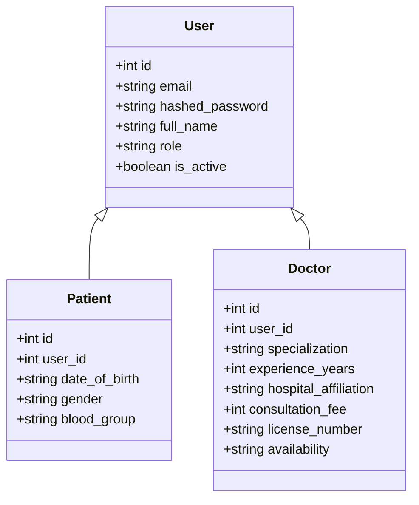

**Diagram sources**
- [backend/models.py](file://backend/models.py#L6-L48)

Authentication flow:
1. User registration with password hashing
2. JWT token generation for authenticated sessions
3. Role-based access control
4. Profile creation based on user role

**Section sources**
- [backend/auth.py](file://backend/auth.py#L1-L120)
- [backend/models.py](file://backend/models.py#L6-L48)

### Database Schema
The database schema supports users, patients, doctors, appointments, health records, notifications, and prescriptions.

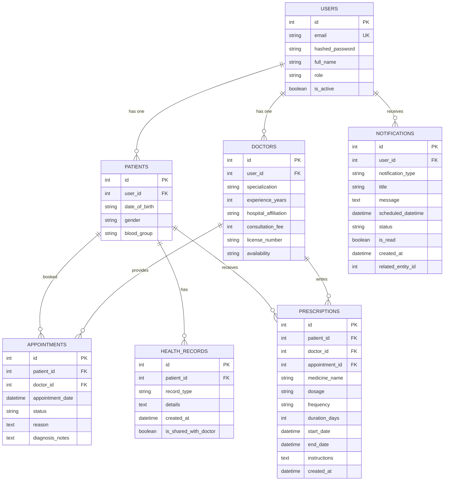

**Diagram sources**
- [backend/models.py](file://backend/models.py#L1-L110)

**Section sources**
- [backend/models.py](file://backend/models.py#L1-L110)

## Dependency Analysis
The project has clear separation between backend and frontend dependencies.

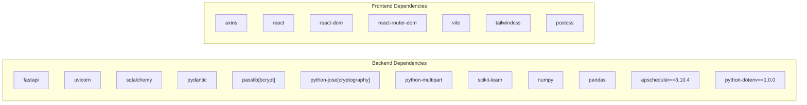

**Diagram sources**
- [requirements.txt](file://requirements.txt#L1-L14)
- [frontend/package.json](file://frontend/package.json#L12-L33)

**Section sources**
- [requirements.txt](file://requirements.txt#L1-L14)
- [frontend/package.json](file://frontend/package.json#L1-L35)

## Performance Considerations
- SQLite is suitable for development and small-scale deployments
- For production, consider PostgreSQL for better concurrency and scalability
- Use connection pooling and proper indexing for frequently accessed tables
- Implement pagination for large datasets (appointments, health records)
- Cache frequently accessed static data
- Monitor API response times and optimize slow queries

## Troubleshooting Guide

### Common Issues and Solutions

#### Backend Server Not Starting
- Verify Python 3.8+ is installed
- Ensure all dependencies are installed via pip
- Check port 8000 is available
- Review backend logs for errors

#### Frontend Development Server Issues
- Ensure Node.js and npm are installed
- Install JavaScript dependencies
- Check if port 5173 is available
- Verify Vite configuration

#### Database Connection Problems
- Confirm SQLite file permissions
- Verify database URL in configuration
- Check that tables were created successfully
- Review database initialization logs

#### Authentication Failures
- Verify user registration completed
- Check JWT secret configuration
- Ensure proper role assignment
- Validate password hashing

#### CORS Errors
- Verify allowed origins in backend configuration
- Check frontend base URL matches backend allowed origins
- Ensure proper header configuration

**Section sources**
- [backend/main.py](file://backend/main.py#L19-L32)
- [backend/database.py](file://backend/database.py#L5-L14)
- [frontend/src/services/api.js](file://frontend/src/services/api.js#L3-L8)

## Conclusion
SmartHealthCare provides a solid foundation for healthcare management applications. The modular architecture allows for easy extension and customization. By following the installation and setup procedures outlined above, you can quickly deploy a functional development environment. The system's clear separation of concerns makes it maintainable and scalable for future enhancements.