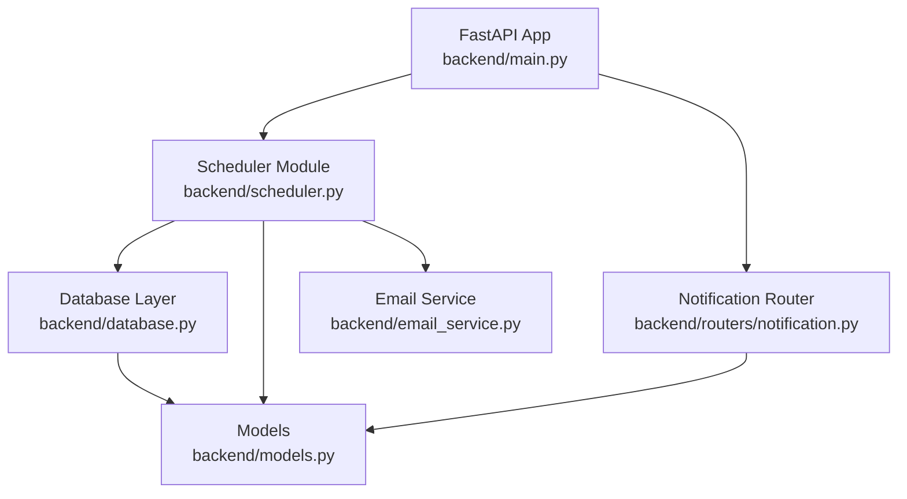
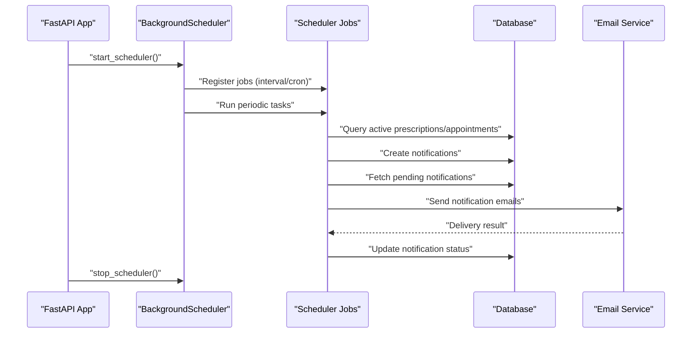
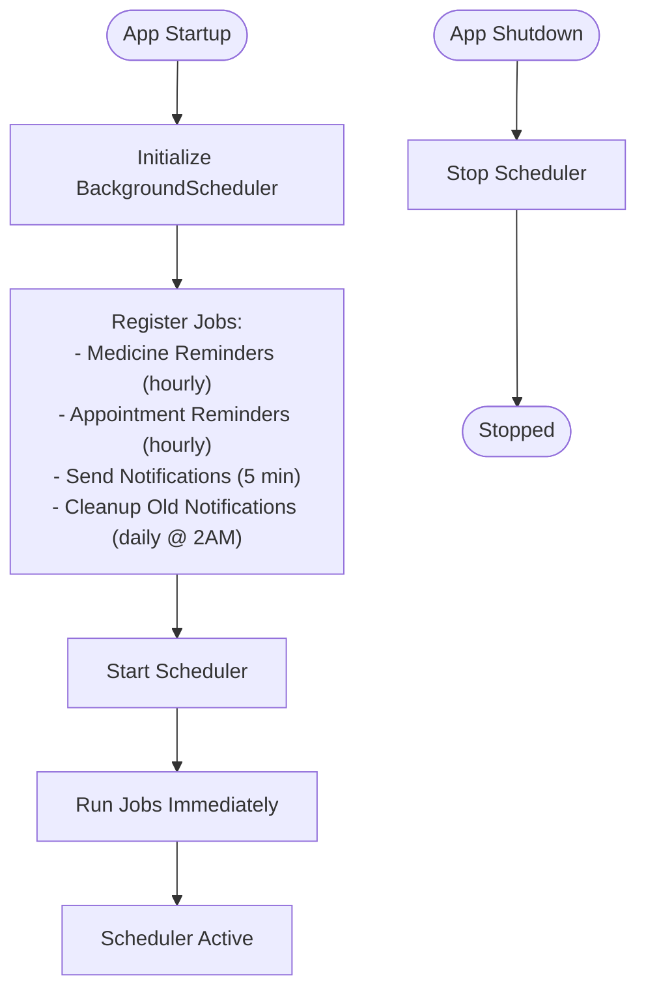
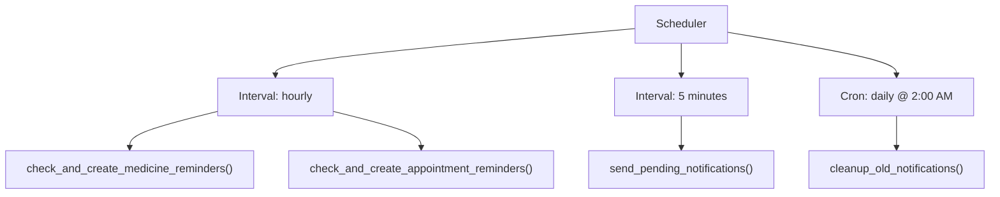
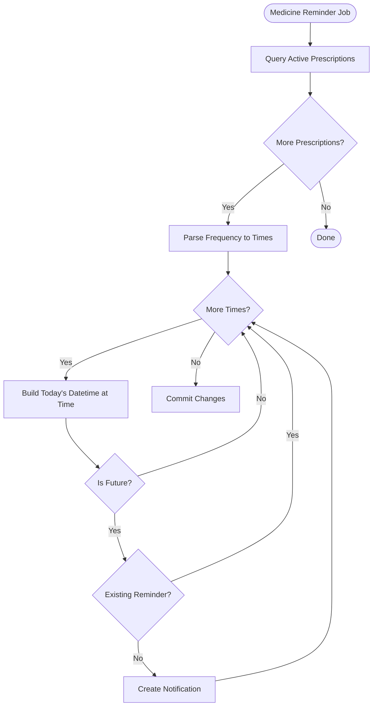
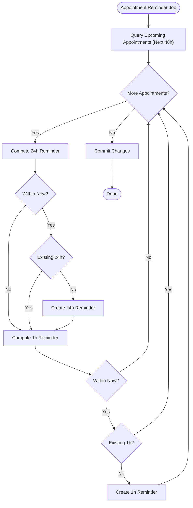
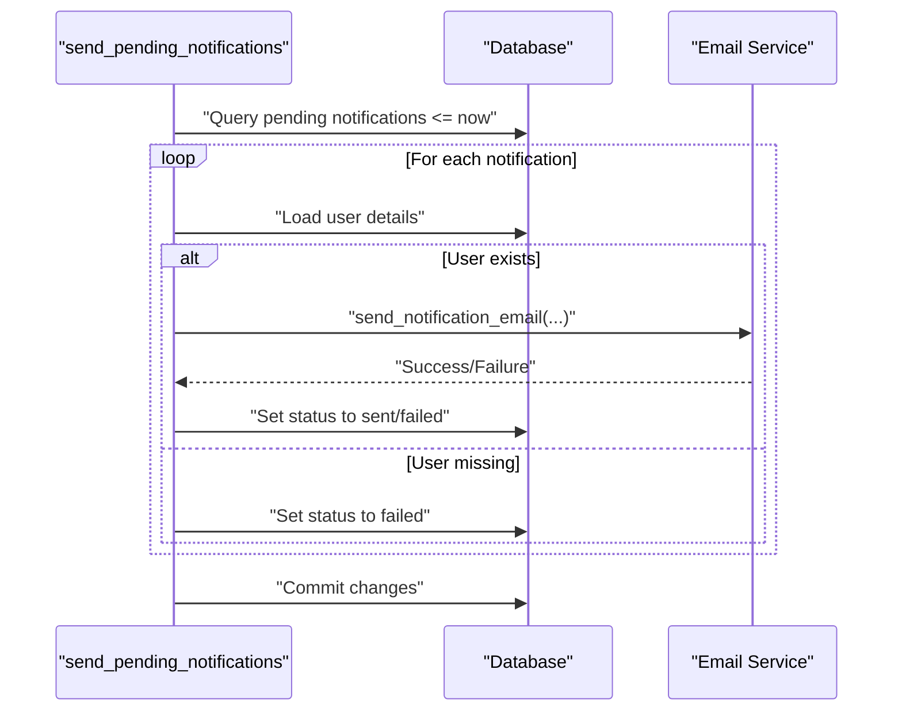
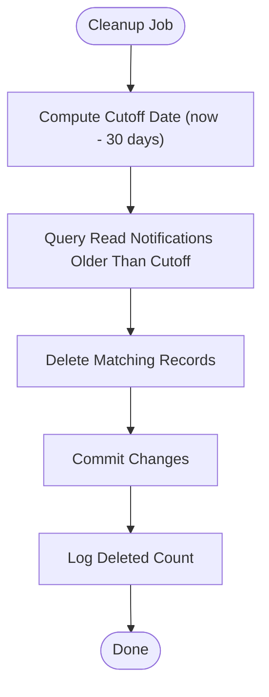
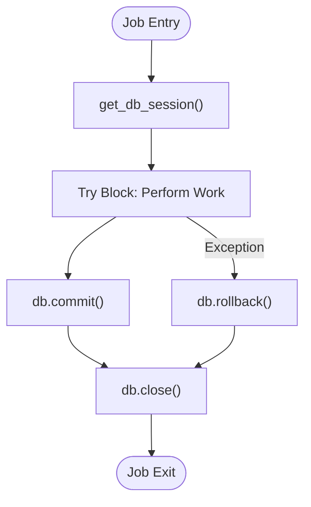
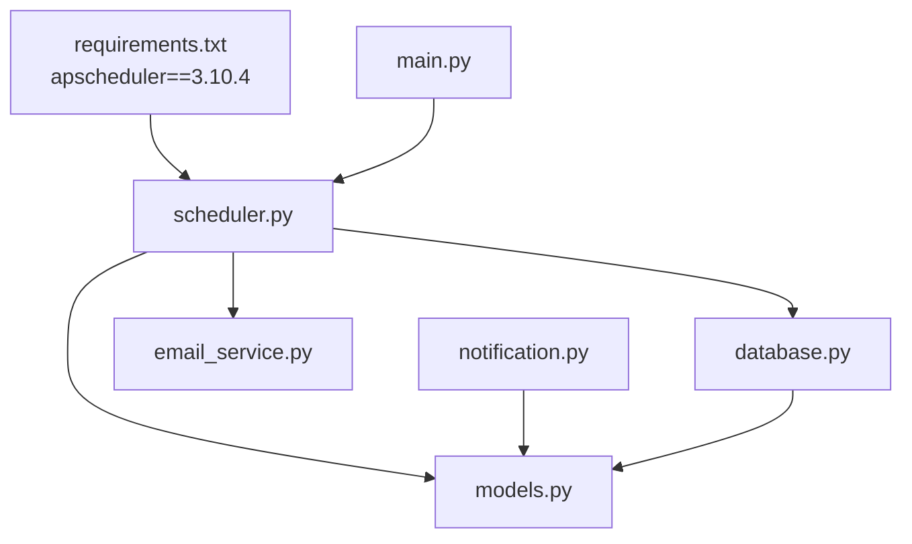

# Background Task Scheduling

<cite>
**Referenced Files in This Document**
- [scheduler.py](file://backend/scheduler.py)
- [main.py](file://backend/main.py)
- [models.py](file://backend/models.py)
- [database.py](file://backend/database.py)
- [email_service.py](file://backend/email_service.py)
- [notification.py](file://backend/routers/notification.py)
- [schemas.py](file://backend/schemas.py)
- [requirements.txt](file://requirements.txt)
</cite>

## Table of Contents
1. [Introduction](#introduction)
2. [Project Structure](#project-structure)
3. [Core Components](#core-components)
4. [Architecture Overview](#architecture-overview)
5. [Detailed Component Analysis](#detailed-component-analysis)
6. [Dependency Analysis](#dependency-analysis)
7. [Performance Considerations](#performance-considerations)
8. [Troubleshooting Guide](#troubleshooting-guide)
9. [Conclusion](#conclusion)
10. [Appendices](#appendices)

## Introduction
This document explains the SmartHealthCare background task scheduling system built on APScheduler. It covers scheduler initialization, job configuration, execution patterns, lifecycle management, error handling, logging integration, and database session management. It also documents the three main scheduler jobs (medicine reminder creation, appointment reminder creation, and notification sending) and the cleanup job that removes old notifications daily. Finally, it provides practical guidance for adding new scheduled jobs and customizing existing ones.

## Project Structure
The scheduling system is implemented in the backend module and integrates with the FastAPI application lifecycle. The scheduler orchestrates recurring tasks that manage reminders and notifications.

**Diagram sources**
- [main.py](file://backend/main.py#L46-L56)
- [scheduler.py](file://backend/scheduler.py#L1-L317)
- [database.py](file://backend/database.py#L1-L22)
- [models.py](file://backend/models.py#L75-L89)
- [email_service.py](file://backend/email_service.py#L1-L161)
- [notification.py](file://backend/routers/notification.py#L1-L177)

**Section sources**
- [main.py](file://backend/main.py#L46-L56)
- [scheduler.py](file://backend/scheduler.py#L1-L317)
- [database.py](file://backend/database.py#L1-L22)
- [models.py](file://backend/models.py#L75-L89)
- [email_service.py](file://backend/email_service.py#L1-L161)
- [notification.py](file://backend/routers/notification.py#L1-L177)

## Core Components
- BackgroundScheduler instance and job registry
- Database session provider for scheduler tasks
- Three primary recurring jobs:
  - Medicine reminder creation (hourly)
  - Appointment reminder creation (hourly)
  - Notification sending (every 5 minutes)
- Daily cleanup job for old notifications
- Scheduler lifecycle management (start_scheduler, stop_scheduler)
- Logging integration and error handling
- Email service integration for notification delivery

**Section sources**
- [scheduler.py](file://backend/scheduler.py#L9-L317)
- [main.py](file://backend/main.py#L46-L56)
- [email_service.py](file://backend/email_service.py#L141-L161)

## Architecture Overview
The scheduler runs as a background thread within the FastAPI application. It starts on application startup and stops on shutdown. Jobs are registered with APScheduler using interval-based and cron-based schedules. Each job manages database sessions, performs business logic, and logs outcomes.

**Diagram sources**
- [main.py](file://backend/main.py#L46-L56)
- [scheduler.py](file://backend/scheduler.py#L259-L317)
- [email_service.py](file://backend/email_service.py#L141-L161)

## Detailed Component Analysis

### Scheduler Initialization and Lifecycle Management
- Scheduler instance: A single BackgroundScheduler is created and reused across the application.
- start_scheduler():
  - Registers four jobs:
    - Medicine reminder creation (interval: hourly)
    - Appointment reminder creation (interval: hourly)
    - Notification sending (interval: every 5 minutes)
    - Cleanup old notifications (cron: daily at 2 AM)
  - Starts the scheduler and executes initial runs for all jobs.
- stop_scheduler():
  - Shuts down the scheduler gracefully.

**Diagram sources**
- [scheduler.py](file://backend/scheduler.py#L259-L317)
- [main.py](file://backend/main.py#L46-L56)

**Section sources**
- [scheduler.py](file://backend/scheduler.py#L259-L317)
- [main.py](file://backend/main.py#L46-L56)

### Job Configuration and Execution Patterns
- Interval-based schedules:
  - Medicine reminders: hourly
  - Appointment reminders: hourly
  - Send notifications: every 5 minutes
- Cron-based schedule:
  - Cleanup old notifications: daily at 2:00 AM
- Job IDs:
  - medicine_reminders
  - appointment_reminders
  - send_notifications
  - cleanup_notifications

**Diagram sources**
- [scheduler.py](file://backend/scheduler.py#L259-L317)

**Section sources**
- [scheduler.py](file://backend/scheduler.py#L259-L317)

### Medicine Reminder Creation Job
Purpose: Create medicine reminders for active prescriptions based on parsed frequency.

Key behaviors:
- Retrieves active prescriptions within the current date range.
- Parses frequency strings into specific reminder times.
- Creates reminders only if they do not already exist and are in the future.
- Persists notifications with appropriate metadata.

**Diagram sources**
- [scheduler.py](file://backend/scheduler.py#L51-L108)
- [models.py](file://backend/models.py#L91-L110)

**Section sources**
- [scheduler.py](file://backend/scheduler.py#L51-L108)
- [models.py](file://backend/models.py#L91-L110)

### Appointment Reminder Creation Job
Purpose: Create appointment reminders (24 hours and 1 hour before) for upcoming appointments.

Key behaviors:
- Finds appointments within the next 48 hours with scheduled status.
- Generates two reminder types:
  - 24 hours before appointment
  - 1 hour before appointment
- Ensures uniqueness by checking existing notifications for the same appointment and time.

**Diagram sources**
- [scheduler.py](file://backend/scheduler.py#L110-L183)
- [models.py](file://backend/models.py#L49-L62)

**Section sources**
- [scheduler.py](file://backend/scheduler.py#L110-L183)
- [models.py](file://backend/models.py#L49-L62)

### Notification Sending Job
Purpose: Send pending notifications that are due and update their status.

Key behaviors:
- Fetches pending notifications whose scheduled time has passed.
- Sends email notifications via the email service.
- Updates status to sent or failed accordingly.
- Logs successes and failures.

**Diagram sources**
- [scheduler.py](file://backend/scheduler.py#L185-L234)
- [email_service.py](file://backend/email_service.py#L141-L161)

**Section sources**
- [scheduler.py](file://backend/scheduler.py#L185-L234)
- [email_service.py](file://backend/email_service.py#L141-L161)

### Cleanup Old Notifications Job
Purpose: Remove read notifications older than 30 days.

Key behaviors:
- Computes cutoff date (now minus 30 days).
- Deletes read notifications older than the cutoff.
- Commits changes and logs the number of deleted records.

**Diagram sources**
- [scheduler.py](file://backend/scheduler.py#L236-L257)

**Section sources**
- [scheduler.py](file://backend/scheduler.py#L236-L257)

### Database Session Management for Scheduled Tasks
- get_db_session(): Provides a SQLAlchemy session scoped to the scheduler’s tasks.
- Each job opens a session at the start, performs operations, and closes the session in a finally block.
- Transactions are committed on success and rolled back on exceptions.

**Diagram sources**
- [scheduler.py](file://backend/scheduler.py#L12-L18)
- [database.py](file://backend/database.py#L16-L22)

**Section sources**
- [scheduler.py](file://backend/scheduler.py#L12-L18)
- [database.py](file://backend/database.py#L16-L22)

### Logging Integration
- Each job logs informational entries and errors encountered during execution.
- Errors are captured with try/except blocks and logged appropriately.
- The application sets up logging configuration for the main module.

**Section sources**
- [scheduler.py](file://backend/scheduler.py#L51-L108)
- [scheduler.py](file://backend/scheduler.py#L110-L183)
- [scheduler.py](file://backend/scheduler.py#L185-L234)
- [scheduler.py](file://backend/scheduler.py#L236-L257)
- [main.py](file://backend/main.py#L6-L11)

### Email Service Integration
- send_notification_email routes notification types to subject mappings.
- send_email handles SMTP transport and HTML email templating.
- Email sending is guarded by configuration checks; if disabled, the job proceeds without email delivery.

**Section sources**
- [email_service.py](file://backend/email_service.py#L141-L161)
- [email_service.py](file://backend/email_service.py#L98-L139)

### Notification Model and Router
- Notification model defines fields for type, title, message, scheduling, status, read flag, timestamps, and related entity linkage.
- Notification router exposes endpoints for retrieving, marking as read, deleting, and creating notifications.

**Section sources**
- [models.py](file://backend/models.py#L75-L89)
- [notification.py](file://backend/routers/notification.py#L13-L177)

## Dependency Analysis
- APScheduler dependency is declared in requirements.
- Scheduler depends on SQLAlchemy ORM for database operations.
- Scheduler depends on the email service for notification delivery.
- Scheduler depends on the models and database modules for persistence.

**Diagram sources**
- [requirements.txt](file://requirements.txt#L11-L11)
- [scheduler.py](file://backend/scheduler.py#L1-L9)
- [database.py](file://backend/database.py#L1-L22)
- [models.py](file://backend/models.py#L75-L89)
- [email_service.py](file://backend/email_service.py#L1-L161)
- [main.py](file://backend/main.py#L36-L44)
- [notification.py](file://backend/routers/notification.py#L1-L11)

**Section sources**
- [requirements.txt](file://requirements.txt#L11-L11)
- [scheduler.py](file://backend/scheduler.py#L1-L9)
- [main.py](file://backend/main.py#L36-L44)

## Performance Considerations
- Jobs are lightweight and operate on filtered queries to minimize database load.
- Sessions are closed promptly after each job to prevent connection leaks.
- Email sending is asynchronous at the transport level; consider queuing for high throughput.
- Consider batching updates and using indexes on frequently queried fields (e.g., scheduled_datetime, status).

## Troubleshooting Guide
Common issues and resolutions:
- Scheduler does not start:
  - Verify logging configuration and check for startup errors.
  - Ensure APScheduler is installed and compatible.
- Jobs not running:
  - Confirm job registration and IDs.
  - Check cron timing and interval configurations.
- Database errors:
  - Review transaction handling and rollback logs.
  - Ensure database connectivity and migrations are applied.
- Email failures:
  - Verify email configuration variables.
  - Check network connectivity and SMTP credentials.
- Notifications not appearing:
  - Confirm notification router endpoints are reachable.
  - Verify user permissions and filters.

**Section sources**
- [main.py](file://backend/main.py#L6-L11)
- [scheduler.py](file://backend/scheduler.py#L259-L317)
- [email_service.py](file://backend/email_service.py#L20-L22)

## Conclusion
The SmartHealthCare background task scheduling system provides robust automation for reminders and notifications. It uses APScheduler to orchestrate recurring tasks with clear separation of concerns, strong error handling, and logging. The system is designed for reliability and extensibility, enabling straightforward addition of new jobs and customization of existing ones.

## Appendices

### Adding a New Scheduled Job
Steps to add a new job:
1. Define the job function within the scheduler module.
2. Register the job in start_scheduler() with an appropriate schedule (interval or cron).
3. Ensure the function manages database sessions and handles exceptions.
4. Optionally add logging for visibility.
5. Test the job manually and verify it appears in the scheduler registry.

Example references:
- Job definition pattern: [scheduler.py](file://backend/scheduler.py#L51-L108)
- Registration pattern: [scheduler.py](file://backend/scheduler.py#L259-L317)
- Session management pattern: [scheduler.py](file://backend/scheduler.py#L12-L18)

### Customizing Existing Jobs
Customization options:
- Adjust intervals or cron schedules in start_scheduler().
- Modify business logic within job functions (e.g., change thresholds, add filters).
- Extend email templates or add additional notification channels.
- Add metrics or monitoring hooks alongside logging.

References:
- Schedule customization: [scheduler.py](file://backend/scheduler.py#L259-L317)
- Business logic customization: [scheduler.py](file://backend/scheduler.py#L51-L108), [scheduler.py](file://backend/scheduler.py#L110-L183), [scheduler.py](file://backend/scheduler.py#L185-L234), [scheduler.py](file://backend/scheduler.py#L236-L257)
- Email customization: [email_service.py](file://backend/email_service.py#L23-L95)