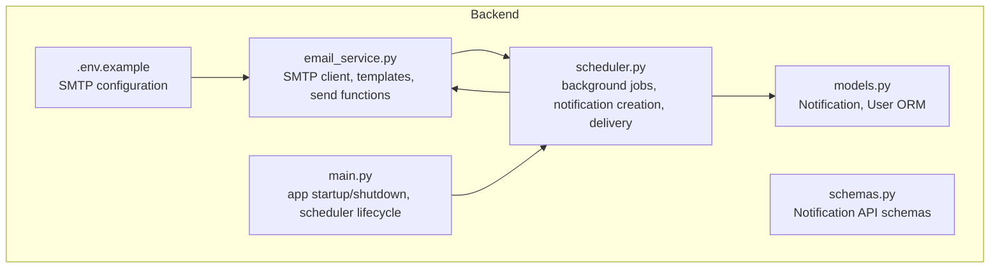
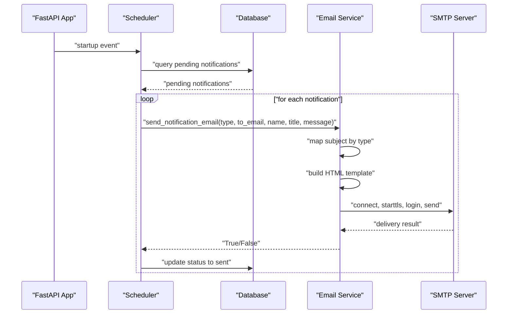
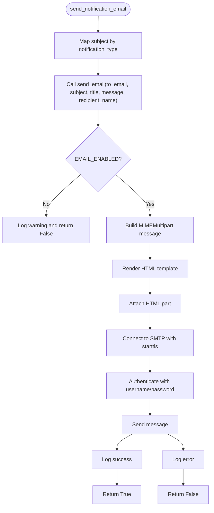
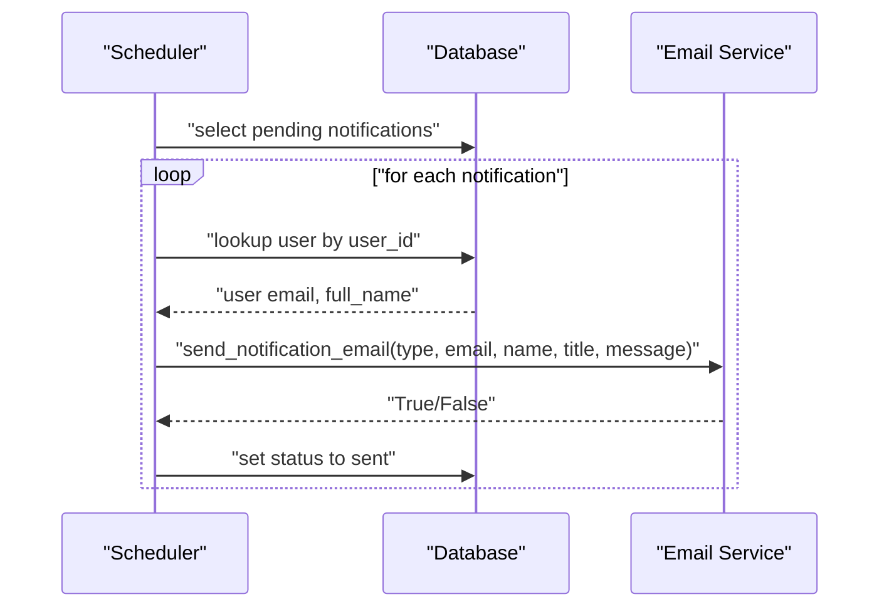
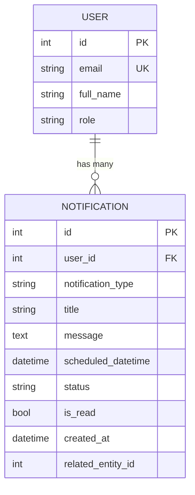
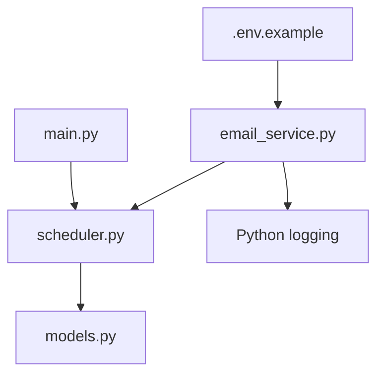

# Email Service Integration

<cite>
**Referenced Files in This Document**
- [email_service.py](file://backend/email_service.py)
- [scheduler.py](file://backend/scheduler.py)
- [models.py](file://backend/models.py)
- [schemas.py](file://backend/schemas.py)
- [.env.example](file://.env.example)
- [main.py](file://backend/main.py)
- [test_notifications.py](file://test_notifications.py)
</cite>

## Table of Contents
1. [Introduction](#introduction)
2. [Project Structure](#project-structure)
3. [Core Components](#core-components)
4. [Architecture Overview](#architecture-overview)
5. [Detailed Component Analysis](#detailed-component-analysis)
6. [Dependency Analysis](#dependency-analysis)
7. [Performance Considerations](#performance-considerations)
8. [Troubleshooting Guide](#troubleshooting-guide)
9. [Conclusion](#conclusion)
10. [Appendices](#appendices)

## Introduction
This document explains the email service integration within the SmartHealthCare notification system. It focuses on the email_service module, covering SMTP configuration, email template rendering, and delivery mechanisms. It documents the send_notification_email function parameters, email configuration requirements, SMTP server settings, authentication methods, and security considerations. It also details error handling for failed deliveries, retry mechanisms, and fallback notification strategies. Finally, it includes examples of email template customization, bulk email processing, integration with external email providers, deliverability best practices, spam prevention, and compliance considerations for healthcare communications.

## Project Structure
The email service is implemented in the backend module and integrated with the notification scheduling system. Key files include:
- Email service implementation and configuration
- Scheduler that creates and sends notifications
- Data models for notifications and users
- Pydantic schemas for API contracts
- Environment configuration for SMTP credentials
- Application entrypoint that starts the scheduler

**Diagram sources**
- [email_service.py](file://backend/email_service.py#L1-L161)
- [scheduler.py](file://backend/scheduler.py#L1-L317)
- [models.py](file://backend/models.py#L75-L89)
- [schemas.py](file://backend/schemas.py#L181-L211)
- [.env.example](file://.env.example#L1-L13)
- [main.py](file://backend/main.py#L46-L56)

**Section sources**
- [email_service.py](file://backend/email_service.py#L1-L161)
- [scheduler.py](file://backend/scheduler.py#L1-L317)
- [models.py](file://backend/models.py#L75-L89)
- [schemas.py](file://backend/schemas.py#L181-L211)
- [.env.example](file://.env.example#L1-L13)
- [main.py](file://backend/main.py#L46-L56)

## Core Components
- Email configuration and SMTP client
  - SMTP host, port, username, password, sender address
  - Conditional enablement flag based on credentials
- Email template rendering
  - HTML template builder with dynamic title, message, and recipient name
- Delivery functions
  - Generic send_email with subject, recipient, and HTML content
  - send_notification_email with predefined subjects mapped by notification type
- Scheduler integration
  - Background jobs create notifications and send them via email
  - Fallback behavior ensures in-app notifications even if email fails

Key responsibilities:
- email_service.py: SMTP configuration, HTML template creation, email sending, notification-type-specific subject mapping
- scheduler.py: background job orchestration, notification creation, and delivery loop
- models.py: Notification and User persistence
- schemas.py: API contracts for notifications
- .env.example: SMTP credential placeholders and provider notes

**Section sources**
- [email_service.py](file://backend/email_service.py#L13-L21)
- [email_service.py](file://backend/email_service.py#L23-L95)
- [email_service.py](file://backend/email_service.py#L98-L139)
- [email_service.py](file://backend/email_service.py#L141-L161)
- [scheduler.py](file://backend/scheduler.py#L185-L234)
- [models.py](file://backend/models.py#L75-L89)
- [schemas.py](file://backend/schemas.py#L181-L211)
- [.env.example](file://.env.example#L1-L13)

## Architecture Overview
The email service is invoked by the scheduler to deliver notifications. The scheduler periodically checks for pending notifications and attempts to send them via email. If email is disabled or fails, the system still marks the notification as sent for in-app visibility.

**Diagram sources**
- [main.py](file://backend/main.py#L46-L56)
- [scheduler.py](file://backend/scheduler.py#L185-L234)
- [email_service.py](file://backend/email_service.py#L141-L161)
- [email_service.py](file://backend/email_service.py#L98-L139)

## Detailed Component Analysis

### Email Service Module
The email_service module encapsulates SMTP configuration, HTML template rendering, and email delivery. It exposes two primary functions:
- send_notification_email(notification_type, to_email, recipient_name, title, message): maps notification types to subjects and delegates to send_email
- send_email(to_email, subject, title, message, recipient_name): constructs an HTML message and sends it via SMTP

Configuration and behavior:
- SMTP settings are loaded from environment variables with defaults suitable for common providers
- EMAIL_ENABLED determines whether email sending is attempted
- HTML template includes branding, message box, and a CTA link to the dashboard
- Logging captures successes and failures during delivery

**Diagram sources**
- [email_service.py](file://backend/email_service.py#L141-L161)
- [email_service.py](file://backend/email_service.py#L98-L139)
- [email_service.py](file://backend/email_service.py#L23-L95)

**Section sources**
- [email_service.py](file://backend/email_service.py#L13-L21)
- [email_service.py](file://backend/email_service.py#L23-L95)
- [email_service.py](file://backend/email_service.py#L98-L139)
- [email_service.py](file://backend/email_service.py#L141-L161)

### Scheduler Integration
The scheduler orchestrates notification creation and delivery:
- Periodic jobs create medicine and appointment reminders
- A recurring job sends pending notifications
- For each notification, the scheduler retrieves user details and invokes send_notification_email
- Status updates are persisted regardless of email outcome (fallback to in-app visibility)

**Diagram sources**
- [scheduler.py](file://backend/scheduler.py#L185-L234)
- [email_service.py](file://backend/email_service.py#L141-L161)
- [models.py](file://backend/models.py#L75-L89)

**Section sources**
- [scheduler.py](file://backend/scheduler.py#L185-L234)
- [models.py](file://backend/models.py#L75-L89)

### Data Models and Schemas
Notifications are stored with metadata including type, title, message, scheduled time, status, and read state. The scheduler uses these fields to determine when and how to deliver notifications.

**Diagram sources**
- [models.py](file://backend/models.py#L75-L89)

**Section sources**
- [models.py](file://backend/models.py#L75-L89)
- [schemas.py](file://backend/schemas.py#L181-L211)

## Dependency Analysis
The email service depends on environment configuration and logging. The scheduler depends on the email service and database models. The application startup triggers scheduler lifecycle management.

**Diagram sources**
- [.env.example](file://.env.example#L1-L13)
- [email_service.py](file://backend/email_service.py#L1-L161)
- [scheduler.py](file://backend/scheduler.py#L1-L317)
- [models.py](file://backend/models.py#L1-L110)
- [main.py](file://backend/main.py#L46-L56)

**Section sources**
- [email_service.py](file://backend/email_service.py#L1-L161)
- [scheduler.py](file://backend/scheduler.py#L1-L317)
- [models.py](file://backend/models.py#L1-L110)
- [main.py](file://backend/main.py#L46-L56)

## Performance Considerations
- Asynchronous delivery: The current implementation performs blocking SMTP operations within the scheduler loop. For high-volume scenarios, consider offloading email delivery to a dedicated worker queue (e.g., Celery) to prevent blocking the scheduler thread.
- Retry strategy: Implement exponential backoff and dead-letter queues for transient failures (network timeouts, rate limits).
- Connection pooling: Reuse SMTP connections across multiple sends to reduce overhead.
- Batch processing: Group notifications by user or type to minimize repeated lookups and improve throughput.
- Rate limiting: Respect provider limits (e.g., per-minute quotas) to avoid throttling.

[No sources needed since this section provides general guidance]

## Troubleshooting Guide
Common issues and resolutions:
- Email not sending
  - Verify EMAIL_USERNAME and EMAIL_PASSWORD are set; EMAIL_ENABLED requires both to be truthy
  - Confirm EMAIL_HOST and EMAIL_PORT match your provider’s SMTP settings
  - Ensure TLS handshake succeeds; some providers require STARTTLS
- Authentication failures
  - For Gmail, use an App Password after enabling 2FA; do not use the regular account password
  - Check that EMAIL_FROM matches the authenticated identity
- Delivery logs
  - Inspect application logs for warnings and errors emitted by the email service
- Scheduler behavior
  - Pending notifications are marked as sent even if email fails; confirm in-app notifications are visible
  - Adjust scheduler intervals if reminders are delayed or too frequent

Operational checks:
- Environment variables: Ensure .env contains EMAIL_HOST, EMAIL_PORT, EMAIL_USERNAME, EMAIL_PASSWORD, EMAIL_FROM
- Provider-specific notes: Refer to .env.example for Gmail configuration guidance

**Section sources**
- [email_service.py](file://backend/email_service.py#L109-L138)
- [.env.example](file://.env.example#L9-L12)
- [scheduler.py](file://backend/scheduler.py#L216-L225)

## Conclusion
The SmartHealthCare email service provides a straightforward SMTP-based delivery mechanism integrated with a background scheduler. It supports predefined notification types, HTML templating, and graceful fallback to in-app notifications. For production deployments, consider asynchronous delivery, retry policies, and provider-specific optimizations to enhance reliability and throughput.

[No sources needed since this section summarizes without analyzing specific files]

## Appendices

### Email Configuration Requirements
- SMTP server settings
  - Host: EMAIL_HOST (default: smtp.gmail.com)
  - Port: EMAIL_PORT (default: 587)
  - Username: EMAIL_USERNAME
  - Password: EMAIL_PASSWORD
  - Sender: EMAIL_FROM
- Conditional enablement
  - EMAIL_ENABLED is True only when both username and password are present
- Provider notes
  - Gmail: Requires 2FA and App Password; see .env.example for guidance

**Section sources**
- [email_service.py](file://backend/email_service.py#L13-L21)
- [.env.example](file://.env.example#L1-L13)

### send_notification_email Function Parameters
- notification_type: Determines the subject mapping
- to_email: Recipient email address
- recipient_name: Name used in the email template greeting
- title: Subject and header content
- message: Body content of the notification

Behavior:
- Maps notification_type to a subject; falls back to a default subject if unknown
- Delegates to send_email for delivery

**Section sources**
- [email_service.py](file://backend/email_service.py#L141-L161)

### Email Template Customization
- Template structure
  - Header with branding
  - Message box containing title and message
  - Footer with disclaimers and non-reply notice
  - CTA link to the dashboard
- Dynamic content
  - Recipient name substitution
  - Title and message injection
- Extensibility
  - Modify create_email_template to adjust styles, links, or content blocks
  - Consider localization and multi-language support by parameterizing text segments

**Section sources**
- [email_service.py](file://backend/email_service.py#L23-L95)

### Bulk Email Processing
- Current implementation
  - Scheduler iterates over pending notifications and sends emails sequentially
- Recommendations
  - Offload to a worker queue for concurrency and resilience
  - Group by user or type to batch and throttle
  - Implement deduplication to avoid duplicate sends

**Section sources**
- [scheduler.py](file://backend/scheduler.py#L185-L234)

### Integration with External Email Providers
- General SMTP
  - Configure EMAIL_HOST, EMAIL_PORT, EMAIL_USERNAME, EMAIL_PASSWORD, EMAIL_FROM
- Provider-specific guidance
  - Refer to provider documentation for authentication and TLS requirements
  - Use dedicated app passwords or OAuth tokens where supported
- Security considerations
  - Store secrets in environment variables or secure secret managers
  - Enforce TLS and certificate verification
  - Limit permissions and rotate credentials regularly

**Section sources**
- [.env.example](file://.env.example#L1-L13)
- [email_service.py](file://backend/email_service.py#L128-L131)

### Deliverability Best Practices and Compliance
- Deliverability
  - Use a reputable sender domain and DKIM/SPF records
  - Maintain clean lists and honor opt-out preferences
  - Monitor bounce and complaint rates
- Spam prevention
  - Avoid spam trigger words in subjects and content
  - Include clear unsubscribe or manage preferences links
  - Segment audiences and personalize content appropriately
- Healthcare compliance
  - HIPAA-compliant storage and transmission of protected health information
  - Secure APIs and encrypted channels
  - Audit logs for access and delivery events
  - Privacy policy and consent mechanisms

[No sources needed since this section provides general guidance]