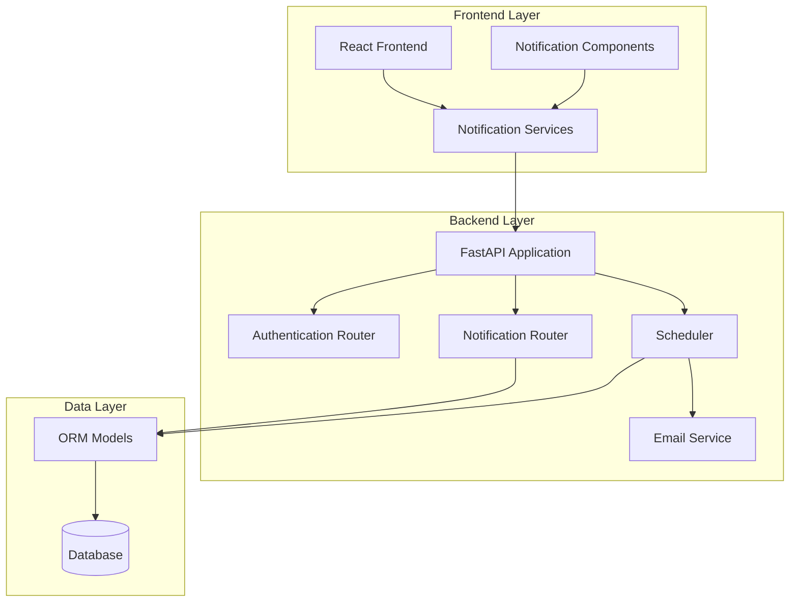
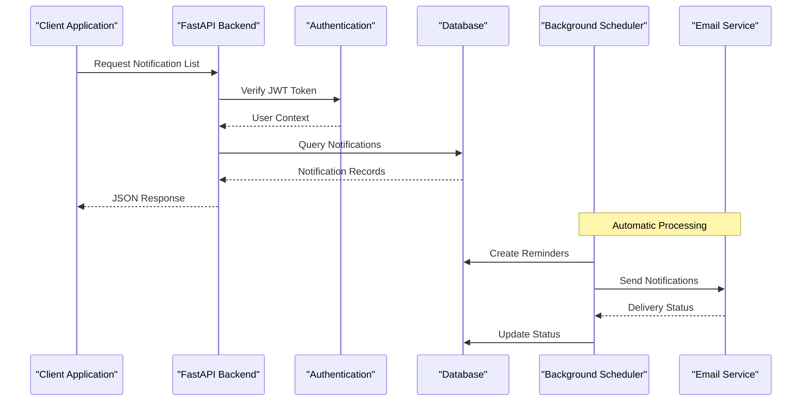
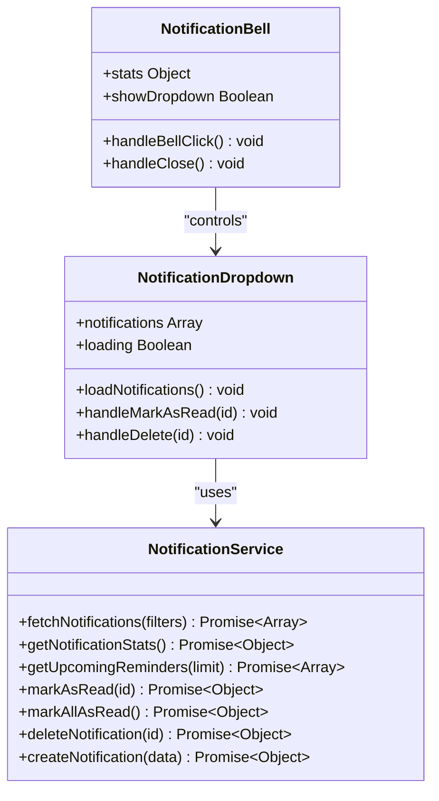
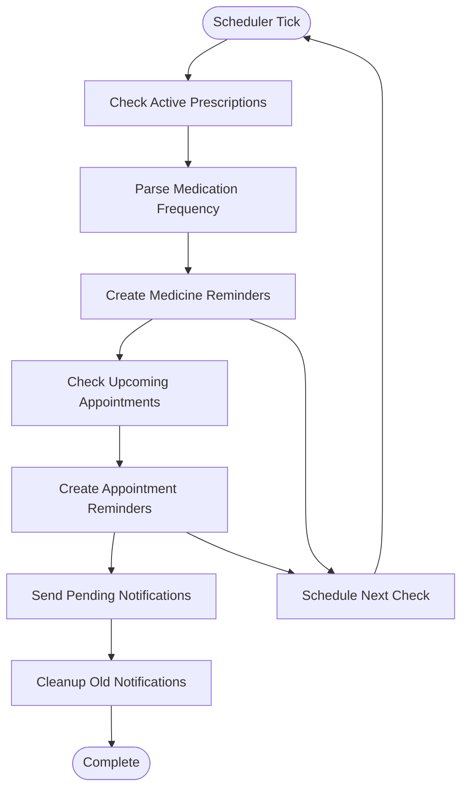
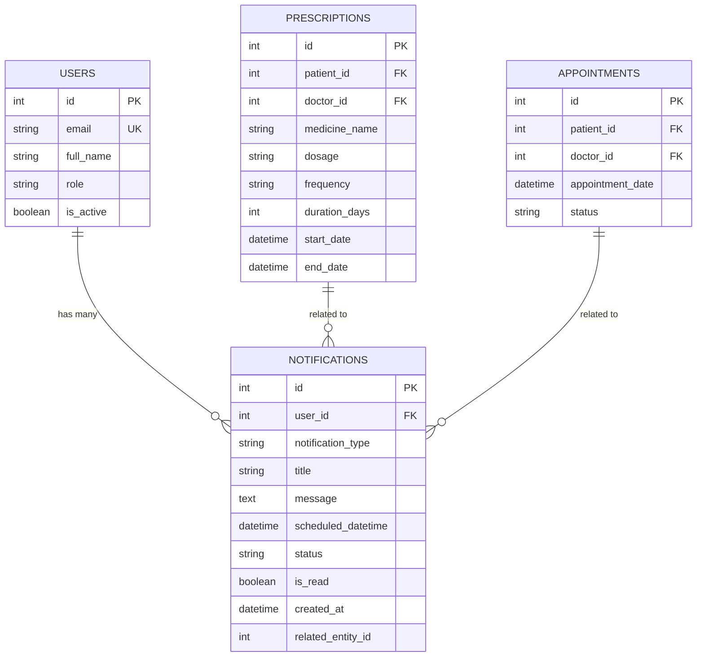
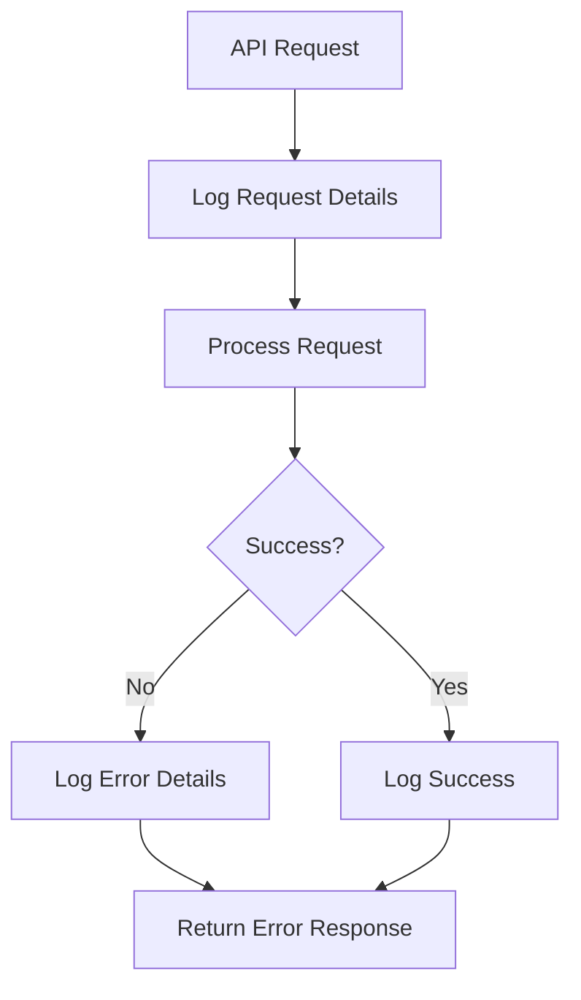

# Notification Management API

<cite>
**Referenced Files in This Document**
- [backend/routers/notification.py](file://backend/routers/notification.py)
- [backend/schemas.py](file://backend/schemas.py)
- [backend/models.py](file://backend/models.py)
- [backend/auth.py](file://backend/auth.py)
- [backend/main.py](file://backend/main.py)
- [backend/scheduler.py](file://backend/scheduler.py)
- [backend/email_service.py](file://backend/email_service.py)
- [frontend/src/services/notificationService.js](file://frontend/src/services/notificationService.js)
- [frontend/src/components/NotificationBell.jsx](file://frontend/src/components/NotificationBell.jsx)
- [frontend/src/components/NotificationDropdown.jsx](file://frontend/src/components/NotificationDropdown.jsx)
- [test_notifications.py](file://test_notifications.py)
</cite>

## Table of Contents
1. [Introduction](#introduction)
2. [Project Structure](#project-structure)
3. [Core Components](#core-components)
4. [Architecture Overview](#architecture-overview)
5. [Detailed Component Analysis](#detailed-component-analysis)
6. [Dependency Analysis](#dependency-analysis)
7. [Performance Considerations](#performance-considerations)
8. [Troubleshooting Guide](#troubleshooting-guide)
9. [Conclusion](#conclusion)
10. [Appendices](#appendices)

## Introduction
This document provides comprehensive API documentation for the SmartHealthCare notification management system. The system enables users to receive timely reminders and updates about their health care activities, including medicine schedules, appointment reminders, and follow-up notifications. The API supports both automatic notifications generated by the system and manual notifications created by authorized users.

The notification system integrates with the broader SmartHealthCare platform, providing real-time reminders, status tracking, and administrative capabilities for healthcare providers. Users can manage their notification preferences, mark notifications as read, and organize their health reminders efficiently.

## Project Structure
The notification management system is built using a modular FastAPI architecture with clear separation of concerns:



**Diagram sources**
- [backend/main.py](file://backend/main.py#L34-L44)
- [backend/routers/notification.py](file://backend/routers/notification.py#L8-L11)
- [backend/scheduler.py](file://backend/scheduler.py#L9-L19)

**Section sources**
- [backend/main.py](file://backend/main.py#L1-L61)
- [backend/routers/notification.py](file://backend/routers/notification.py#L1-L177)

## Core Components
The notification management system consists of several interconnected components that work together to provide comprehensive notification services:

### Authentication and Authorization
The system uses JWT-based authentication with role-based access control. Only authenticated users can access notification endpoints, with additional restrictions for administrative operations.

### Notification Types and Status
The system supports multiple notification types with predefined statuses:
- **Medicine reminders**: Scheduled medication intake reminders
- **Appointment reminders**: Upcoming appointment notifications (24h and 1h before)
- **Follow-up reminders**: Post-appointment care reminders
- **Health check reminders**: Periodic health monitoring reminders

### Background Scheduler
A robust background scheduler automatically generates and sends notifications based on user prescriptions and appointment schedules, ensuring timely delivery of health reminders.

**Section sources**
- [backend/auth.py](file://backend/auth.py#L39-L55)
- [backend/models.py](file://backend/models.py#L75-L90)
- [backend/scheduler.py](file://backend/scheduler.py#L51-L108)

## Architecture Overview
The notification system follows a layered architecture with clear separation between presentation, business logic, and data persistence:



**Diagram sources**
- [backend/main.py](file://backend/main.py#L34-L44)
- [backend/scheduler.py](file://backend/scheduler.py#L259-L308)
- [backend/email_service.py](file://backend/email_service.py#L141-L161)

The architecture ensures scalability, reliability, and efficient resource utilization through background job processing and database indexing.

## Detailed Component Analysis

### Notification Endpoints

#### GET /notifications/me - Retrieve User Notifications
Retrieves all notifications for the authenticated user with optional filtering capabilities.

**HTTP Method:** GET  
**URL Pattern:** `/notifications/me`  
**Authentication:** Required (Bearer Token)  
**Role Requirements:** Patient, Doctor, Admin  

**Query Parameters:**
- `notification_type` (string): Filter by notification type
- `is_read` (boolean): Filter by read/unread status
- `limit` (integer, default: 50, max: 100): Number of records to return
- `offset` (integer, default: 0): Pagination offset

**Response Schema:** Array of NotificationOut objects

**Example Response:**
```json
[
  {
    "id": 1,
    "user_id": 1,
    "notification_type": "medicine_reminder",
    "title": "💊 Time to take Paracetamol",
    "message": "Dosage: 500mg. Take after meals with water",
    "scheduled_datetime": "2024-01-15T08:00:00Z",
    "status": "pending",
    "is_read": false,
    "created_at": "2024-01-14T10:30:00Z",
    "related_entity_id": 1
  }
]
```

**Section sources**
- [backend/routers/notification.py](file://backend/routers/notification.py#L13-L38)
- [backend/schemas.py](file://backend/schemas.py#L196-L205)

#### GET /notifications/stats - Retrieve Notification Statistics
Provides aggregated statistics for the user's notification activity.

**HTTP Method:** GET  
**URL Pattern:** `/notifications/stats`  
**Authentication:** Required (Bearer Token)  
**Response Schema:** NotificationStats

**Response Fields:**
- `total_unread` (integer): Count of unread notifications
- `upcoming_reminders` (integer): Count of upcoming scheduled reminders
- `total_notifications` (integer): Total notification count

**Section sources**
- [backend/routers/notification.py](file://backend/routers/notification.py#L41-L67)
- [backend/schemas.py](file://backend/schemas.py#L207-L211)

#### GET /notifications/upcoming - Retrieve Upcoming Reminders
Fetches upcoming reminders scheduled for the near future.

**HTTP Method:** GET  
**URL Pattern:** `/notifications/upcoming`  
**Authentication:** Required (Bearer Token)  
**Query Parameters:**
- `limit` (integer, default: 5, max: 20): Maximum number of reminders to return

**Response Schema:** Array of NotificationOut objects

**Section sources**
- [backend/routers/notification.py](file://backend/routers/notification.py#L70-L85)

#### PATCH /notifications/{notification_id}/read - Mark Notification as Read
Updates a specific notification's read status to true.

**HTTP Method:** PATCH  
**URL Pattern:** `/notifications/{notification_id}/read`  
**Authentication:** Required (Bearer Token)  
**Path Parameters:**
- `notification_id` (integer): Unique identifier of the notification

**Response Schema:** NotificationOut object

**Validation Rules:**
- User must own the notification
- Notification must exist
- Returns 404 if notification not found

**Section sources**
- [backend/routers/notification.py](file://backend/routers/notification.py#L88-L107)

#### PATCH /notifications/mark-all-read - Mark All Notifications as Read
Bulk operation to mark all user notifications as read.

**HTTP Method:** PATCH  
**URL Pattern:** `/notifications/mark-all-read`  
**Authentication:** Required (Bearer Token)

**Response Schema:** Success message object

**Section sources**
- [backend/routers/notification.py](file://backend/routers/notification.py#L110-L123)

#### DELETE /notifications/{notification_id} - Delete Notification
Permanently removes a notification from the system.

**HTTP Method:** DELETE  
**URL Pattern:** `/notifications/{notification_id}`  
**Authentication:** Required (Bearer Token)  
**Path Parameters:**
- `notification_id` (integer): Unique identifier of the notification

**Response Schema:** Deletion confirmation object

**Validation Rules:**
- User must own the notification
- Notification must exist
- Returns 404 if notification not found

**Section sources**
- [backend/routers/notification.py](file://backend/routers/notification.py#L126-L144)

#### POST /notifications/create - Create Manual Notification
Creates a new notification (administrative functionality).

**HTTP Method:** POST  
**URL Pattern:** `/notifications/create`  
**Authentication:** Required (Bearer Token)  
**Role Requirements:** Doctor, Admin  

**Request Schema:** NotificationCreate

**Request Fields:**
- `user_id` (integer): Target user for the notification
- `notification_type` (string): Type of notification
- `title` (string): Notification title
- `message` (string): Notification content
- `scheduled_datetime` (datetime): When notification should appear
- `related_entity_id` (integer, optional): Related appointment/prescription ID

**Response Schema:** NotificationOut object

**Validation Rules:**
- Only doctors and admins can create notifications for other users
- Patients can only create notifications for themselves
- Returns 403 for unauthorized users

**Section sources**
- [backend/routers/notification.py](file://backend/routers/notification.py#L147-L177)
- [backend/schemas.py](file://backend/schemas.py#L188-L195)

### Frontend Integration Components

#### Notification Service Layer
The frontend provides a comprehensive service layer for notification management:



**Diagram sources**
- [frontend/src/services/notificationService.js](file://frontend/src/services/notificationService.js#L1-L117)
- [frontend/src/components/NotificationBell.jsx](file://frontend/src/components/NotificationBell.jsx#L6-L61)
- [frontend/src/components/NotificationDropdown.jsx](file://frontend/src/components/NotificationDropdown.jsx#L5-L182)

**Section sources**
- [frontend/src/services/notificationService.js](file://frontend/src/services/notificationService.js#L1-L117)
- [frontend/src/components/NotificationBell.jsx](file://frontend/src/components/NotificationBell.jsx#L1-L64)
- [frontend/src/components/NotificationDropdown.jsx](file://frontend/src/components/NotificationDropdown.jsx#L1-L182)

### Background Scheduler Operations

#### Automatic Notification Generation
The scheduler automatically creates notifications based on user activities:



**Diagram sources**
- [backend/scheduler.py](file://backend/scheduler.py#L259-L308)
- [backend/scheduler.py](file://backend/scheduler.py#L51-L108)
- [backend/scheduler.py](file://backend/scheduler.py#L110-L183)

**Section sources**
- [backend/scheduler.py](file://backend/scheduler.py#L51-L183)
- [backend/scheduler.py](file://backend/scheduler.py#L185-L234)
- [backend/scheduler.py](file://backend/scheduler.py#L236-L257)

## Dependency Analysis

### Database Model Relationships
The notification system relies on a well-designed relational model:



**Diagram sources**
- [backend/models.py](file://backend/models.py#L6-L89)
- [backend/models.py](file://backend/models.py#L91-L110)

### API Endpoint Dependencies
The notification endpoints depend on several core services:

```mermaid
graph LR
subgraph "API Endpoints"
ME[/notifications/me]
STATS[/notifications/stats]
UPCOMING[/notifications/upcoming]
READ[/notifications/{id}/read]
MARKALL[/notifications/mark-all-read]
DELETE[/notifications/{id}]
CREATE[/notifications/create]
end
subgraph "Core Services"
AUTH[Authentication]
DB[(Database)]
SCHEMA[Schemas]
MODEL[Models]
end
subgraph "Background Services"
SCHED[Scheduler]
EMAIL[Email Service]
end
ME --> AUTH
STATS --> AUTH
UPCOMING --> AUTH
READ --> AUTH
MARKALL --> AUTH
DELETE --> AUTH
CREATE --> AUTH
ME --> DB
STATS --> DB
UPCOMING --> DB
READ --> DB
MARKALL --> DB
DELETE --> DB
CREATE --> DB
CREATE --> SCHEMA
CREATE --> MODEL
SCHED --> DB
SCHED --> EMAIL
```

**Diagram sources**
- [backend/routers/notification.py](file://backend/routers/notification.py#L1-L177)
- [backend/auth.py](file://backend/auth.py#L39-L55)
- [backend/scheduler.py](file://backend/scheduler.py#L185-L234)

**Section sources**
- [backend/models.py](file://backend/models.py#L75-L90)
- [backend/schemas.py](file://backend/schemas.py#L181-L211)

## Performance Considerations

### Database Optimization
The notification system implements several performance optimizations:

- **Indexing Strategy**: Notifications table includes indexes on frequently queried columns (`user_id`, `notification_type`, `scheduled_datetime`, `status`)
- **Pagination Limits**: Default limit of 50 notifications per request with maximum 100
- **Query Optimization**: Efficient filtering and ordering by scheduled_datetime
- **Background Processing**: Heavy operations like email sending are handled asynchronously

### Caching and Polling
Frontend implements intelligent caching and polling strategies:

- **Polling Intervals**: 30-second intervals for notification statistics
- **Local State Management**: Client-side state updates for immediate UI feedback
- **Conditional Requests**: Only fetches new data when needed

### Scalability Features
- **Background Scheduler**: Offloads processing from request-response cycle
- **Batch Operations**: Bulk mark-as-read operations reduce API calls
- **Efficient Filtering**: Database-level filtering reduces payload sizes

## Troubleshooting Guide

### Common Error Scenarios

#### Authentication Issues
- **401 Unauthorized**: Invalid or expired JWT token
- **403 Forbidden**: Insufficient permissions for administrative operations
- **401 Credentials Validation Failed**: Malformed JWT or invalid user

#### Resource Access Issues
- **404 Not Found**: Notification doesn't exist or belongs to another user
- **400 Bad Request**: Invalid request parameters or malformed JSON

#### Database Constraints
- **Unique Constraint Violations**: Duplicate notification entries
- **Foreign Key Constraints**: Invalid user_id or related_entity_id references

### Debugging Strategies

#### Backend Logging
The system provides comprehensive logging for troubleshooting:



**Diagram sources**
- [backend/scheduler.py](file://backend/scheduler.py#L185-L234)
- [backend/email_service.py](file://backend/email_service.py#L141-L161)

#### Frontend Error Handling
Client-side error handling includes:
- Network error detection and retry logic
- User-friendly error messages
- Graceful degradation when API calls fail

**Section sources**
- [frontend/src/services/notificationService.js](file://frontend/src/services/notificationService.js#L25-L28)
- [frontend/src/components/NotificationDropdown.jsx](file://frontend/src/components/NotificationDropdown.jsx#L29-L33)

## Conclusion
The SmartHealthCare notification management system provides a comprehensive solution for healthcare reminders and communication. The system successfully balances real-time responsiveness with background processing, ensuring reliable notification delivery while maintaining excellent performance characteristics.

Key strengths of the system include:
- **Robust Authentication**: Role-based access control with JWT tokens
- **Flexible Filtering**: Comprehensive query parameters for notification retrieval
- **Automatic Generation**: Intelligent background scheduling for medication and appointment reminders
- **Scalable Architecture**: Modular design supporting future enhancements
- **User Experience**: Responsive frontend components with real-time updates

The system is well-suited for healthcare environments requiring reliable, timely communication with patients and healthcare providers.

## Appendices

### API Implementation Examples

#### Frontend Integration Patterns
The frontend demonstrates several integration patterns:

```javascript
// Example: Loading notifications with filters
const notifications = await fetchNotifications({
  notification_type: 'medicine_reminder',
  is_read: false,
  limit: 20,
  offset: 0
});

// Example: Real-time status updates
const stats = await getNotificationStats();
// Poll every 30 seconds for updates
setInterval(async () => {
  const newStats = await getNotificationStats();
  if (newStats.total_unread > stats.total_unread) {
    // Trigger notification sound or visual indicator
  }
}, 30000);
```

#### Testing Utilities
The test script provides comprehensive examples for manual testing:

```python
# Example: Creating a manual notification
response = requests.post(
    f"{BASE_URL}/notifications/create",
    headers={"Authorization": f"Bearer {doctor_token}"},
    json={
        "user_id": patient_id,
        "notification_type": "health_check_reminder",
        "title": "Monthly Health Checkup",
        "message": "Please schedule your appointment",
        "scheduled_datetime": (datetime.utcnow() + timedelta(hours=1)).isoformat()
    }
)
```

**Section sources**
- [test_notifications.py](file://test_notifications.py#L39-L59)
- [frontend/src/services/notificationService.js](file://frontend/src/services/notificationService.js#L104-L116)

### Security Considerations
- **Token Management**: Secure JWT token handling with expiration
- **Input Validation**: Comprehensive request validation using Pydantic models
- **Access Control**: Strict user ownership verification for all operations
- **Rate Limiting**: Built-in request limits prevent abuse

### Future Enhancements
Potential areas for future development:
- Push notification support for mobile devices
- Advanced filtering and search capabilities
- Notification preferences management
- Multi-language support
- Integration with external calendar systems