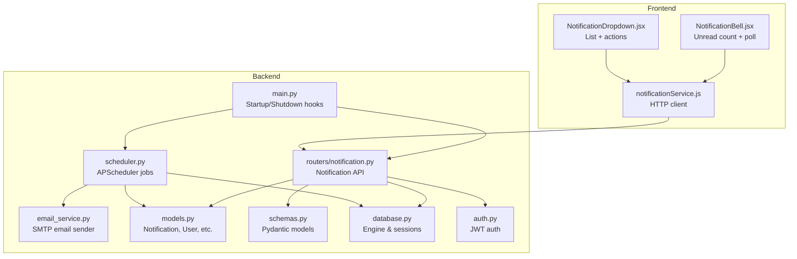
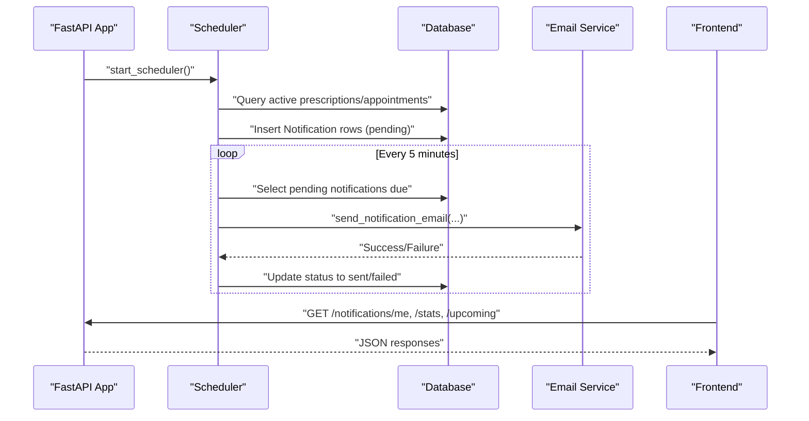
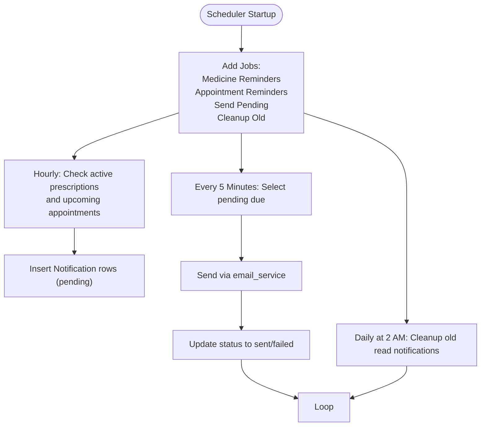
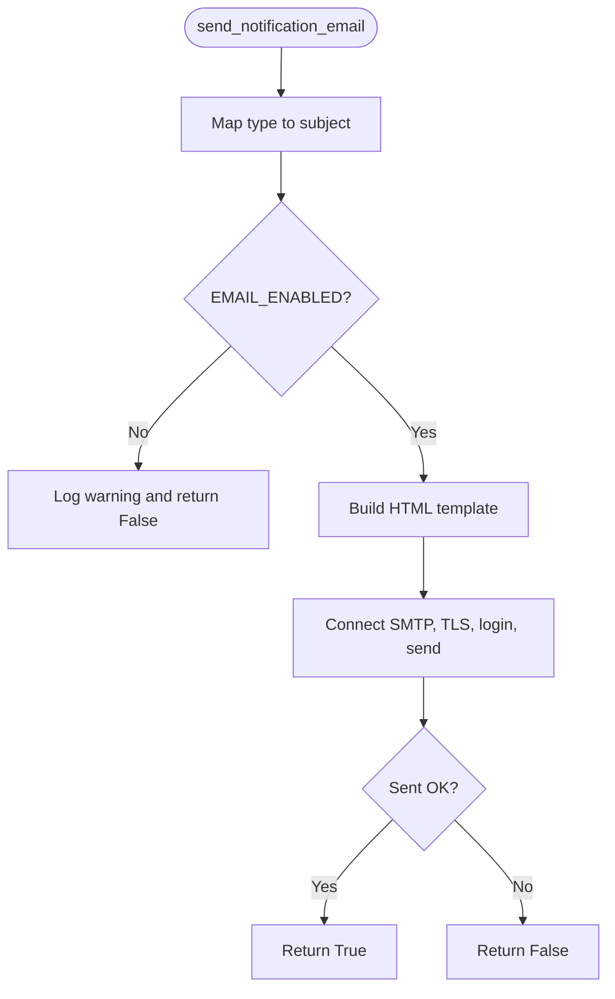
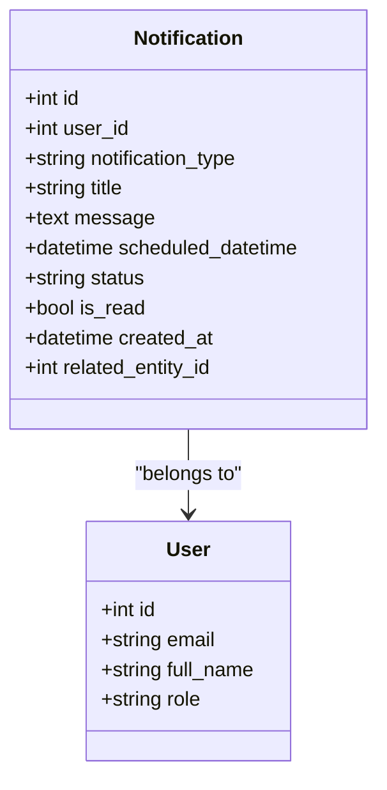
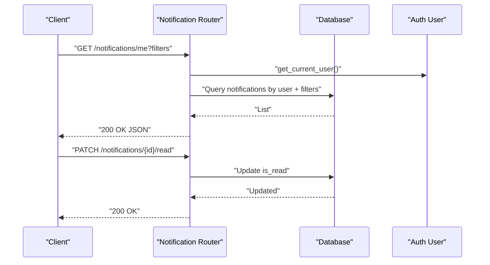
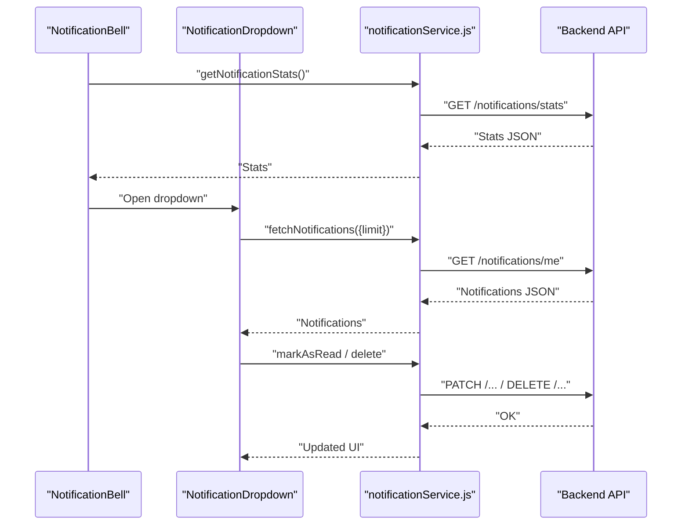
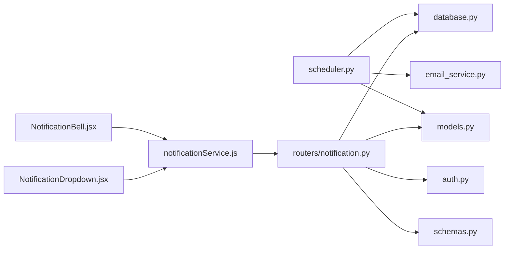
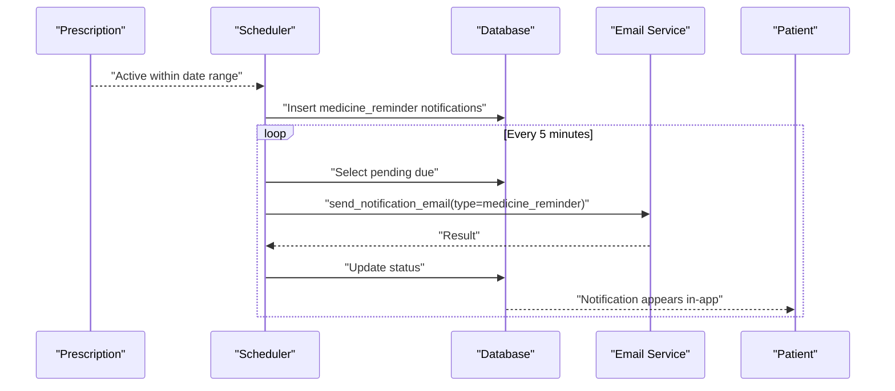

# Notification System

<cite>
**Referenced Files in This Document**
- [backend/scheduler.py](file://backend/scheduler.py)
- [backend/email_service.py](file://backend/email_service.py)
- [backend/routers/notification.py](file://backend/routers/notification.py)
- [backend/models.py](file://backend/models.py)
- [backend/schemas.py](file://backend/schemas.py)
- [backend/main.py](file://backend/main.py)
- [backend/database.py](file://backend/database.py)
- [backend/auth.py](file://backend/auth.py)
- [frontend/src/services/notificationService.js](file://frontend/src/services/notificationService.js)
- [frontend/src/components/NotificationBell.jsx](file://frontend/src/components/NotificationBell.jsx)
- [frontend/src/components/NotificationDropdown.jsx](file://frontend/src/components/NotificationDropdown.jsx)
- [test_notifications.py](file://test_notifications.py)
- [.env.example](file://.env.example)
</cite>

## Table of Contents
1. [Introduction](#introduction)
2. [Project Structure](#project-structure)
3. [Core Components](#core-components)
4. [Architecture Overview](#architecture-overview)
5. [Detailed Component Analysis](#detailed-component-analysis)
6. [Dependency Analysis](#dependency-analysis)
7. [Performance Considerations](#performance-considerations)
8. [Troubleshooting Guide](#troubleshooting-guide)
9. [Conclusion](#conclusion)
10. [Appendices](#appendices)

## Introduction
This document describes the SmartHealthCare notification system, focusing on automated background task scheduling with APScheduler, email service integration, notification types, and the manual notification API. It explains how notifications are created, scheduled, delivered, and tracked, and how users can manage their preferences and read status. It also covers configuration for email delivery, troubleshooting common issues, and illustrates typical workflows for different user actions.

## Project Structure
The notification system spans backend scheduling and APIs, email delivery, frontend UI integration, and supporting models and schemas.

**Diagram sources**
- [backend/main.py](file://backend/main.py#L46-L56)
- [backend/scheduler.py](file://backend/scheduler.py#L259-L317)
- [backend/email_service.py](file://backend/email_service.py#L1-L161)
- [backend/routers/notification.py](file://backend/routers/notification.py#L1-L177)
- [backend/models.py](file://backend/models.py#L75-L89)
- [backend/schemas.py](file://backend/schemas.py#L181-L211)
- [backend/database.py](file://backend/database.py#L1-L22)
- [backend/auth.py](file://backend/auth.py#L1-L120)
- [frontend/src/services/notificationService.js](file://frontend/src/services/notificationService.js#L1-L117)
- [frontend/src/components/NotificationBell.jsx](file://frontend/src/components/NotificationBell.jsx#L1-L64)
- [frontend/src/components/NotificationDropdown.jsx](file://frontend/src/components/NotificationDropdown.jsx#L1-L182)

**Section sources**
- [backend/main.py](file://backend/main.py#L1-L61)
- [backend/scheduler.py](file://backend/scheduler.py#L1-L317)
- [backend/email_service.py](file://backend/email_service.py#L1-L161)
- [backend/routers/notification.py](file://backend/routers/notification.py#L1-L177)
- [backend/models.py](file://backend/models.py#L1-L110)
- [backend/schemas.py](file://backend/schemas.py#L1-L236)
- [backend/database.py](file://backend/database.py#L1-L22)
- [backend/auth.py](file://backend/auth.py#L1-L120)
- [frontend/src/services/notificationService.js](file://frontend/src/services/notificationService.js#L1-L117)
- [frontend/src/components/NotificationBell.jsx](file://frontend/src/components/NotificationBell.jsx#L1-L64)
- [frontend/src/components/NotificationDropdown.jsx](file://frontend/src/components/NotificationDropdown.jsx#L1-L182)

## Core Components
- Background scheduler: Creates and sends notifications on schedules, cleans up old records.
- Email service: Sends HTML emails via SMTP with configurable host/port/credentials.
- Notification API: CRUD and read-status management for logged-in users; admin/doctor can create cross-user notifications.
- Frontend integration: Polls unread counts and displays notification lists with actions.
- Data model: Notification entity with type, status, read flag, scheduled time, and related entity linkage.

Key responsibilities:
- Automated reminders: Medicine reminders from prescriptions and appointment reminders.
- Delivery: Email via SMTP; in-app delivery is primary even if email fails.
- Management: Fetch, filter, mark read, mark all read, delete, and create notifications.

**Section sources**
- [backend/scheduler.py](file://backend/scheduler.py#L51-L108)
- [backend/scheduler.py](file://backend/scheduler.py#L110-L183)
- [backend/scheduler.py](file://backend/scheduler.py#L185-L234)
- [backend/scheduler.py](file://backend/scheduler.py#L236-L257)
- [backend/email_service.py](file://backend/email_service.py#L13-L22)
- [backend/email_service.py](file://backend/email_service.py#L141-L161)
- [backend/routers/notification.py](file://backend/routers/notification.py#L13-L38)
- [backend/routers/notification.py](file://backend/routers/notification.py#L41-L67)
- [backend/routers/notification.py](file://backend/routers/notification.py#L70-L85)
- [backend/routers/notification.py](file://backend/routers/notification.py#L88-L123)
- [backend/routers/notification.py](file://backend/routers/notification.py#L126-L144)
- [backend/routers/notification.py](file://backend/routers/notification.py#L147-L177)
- [backend/models.py](file://backend/models.py#L75-L89)
- [frontend/src/services/notificationService.js](file://frontend/src/services/notificationService.js#L11-L117)
- [frontend/src/components/NotificationBell.jsx](file://frontend/src/components/NotificationBell.jsx#L11-L30)
- [frontend/src/components/NotificationDropdown.jsx](file://frontend/src/components/NotificationDropdown.jsx#L24-L56)

## Architecture Overview
The system starts the scheduler on application startup, which periodically:
- Scans active prescriptions and creates medicine reminders.
- Scans upcoming appointments and creates 24-hour and 1-hour reminders.
- Sends pending notifications by email and marks them sent.
- Cleans up old read notifications.

Users interact with notifications via the API and the frontend notification bell/dropdown.

**Diagram sources**
- [backend/main.py](file://backend/main.py#L46-L56)
- [backend/scheduler.py](file://backend/scheduler.py#L259-L317)
- [backend/scheduler.py](file://backend/scheduler.py#L185-L234)
- [backend/email_service.py](file://backend/email_service.py#L141-L161)
- [backend/routers/notification.py](file://backend/routers/notification.py#L13-L85)

## Detailed Component Analysis

### Background Scheduler (APScheduler)
Responsibilities:
- Periodic creation of medicine reminders from active prescriptions.
- Periodic creation of appointment reminders (24 hours and 1 hour prior).
- Sending pending notifications and updating statuses.
- Daily cleanup of old read notifications.

Scheduling:
- Medicine reminders: hourly job.
- Appointment reminders: hourly job.
- Send pending notifications: every 5 minutes.
- Cleanup old notifications: daily at 2 AM.

**Diagram sources**
- [backend/scheduler.py](file://backend/scheduler.py#L259-L317)
- [backend/scheduler.py](file://backend/scheduler.py#L51-L108)
- [backend/scheduler.py](file://backend/scheduler.py#L110-L183)
- [backend/scheduler.py](file://backend/scheduler.py#L185-L234)
- [backend/scheduler.py](file://backend/scheduler.py#L236-L257)

**Section sources**
- [backend/scheduler.py](file://backend/scheduler.py#L259-L317)
- [backend/scheduler.py](file://backend/scheduler.py#L51-L108)
- [backend/scheduler.py](file://backend/scheduler.py#L110-L183)
- [backend/scheduler.py](file://backend/scheduler.py#L185-L234)
- [backend/scheduler.py](file://backend/scheduler.py#L236-L257)

### Email Service and Templates
Features:
- SMTP configuration loaded from environment variables.
- HTML email template with branded header, content box, and footer.
- Subject mapping per notification type.
- Graceful handling when email is disabled.

**Diagram sources**
- [backend/email_service.py](file://backend/email_service.py#L13-L22)
- [backend/email_service.py](file://backend/email_service.py#L141-L161)
- [backend/email_service.py](file://backend/email_service.py#L98-L139)

**Section sources**
- [backend/email_service.py](file://backend/email_service.py#L13-L22)
- [backend/email_service.py](file://backend/email_service.py#L23-L96)
- [backend/email_service.py](file://backend/email_service.py#L98-L139)
- [backend/email_service.py](file://backend/email_service.py#L141-L161)
- [.env.example](file://.env.example#L1-L13)

### Notification Types and Creation
Supported types:
- Medicine reminder
- Appointment reminder
- Follow-up reminder
- Health check reminder

Creation mechanisms:
- Automatic: Based on active prescriptions and upcoming appointments.
- Manual: Through the API endpoint for authorized roles.

**Diagram sources**
- [backend/models.py](file://backend/models.py#L75-L89)
- [backend/models.py](file://backend/models.py#L6-L19)

**Section sources**
- [backend/models.py](file://backend/models.py#L75-L89)
- [backend/schemas.py](file://backend/schemas.py#L181-L211)
- [backend/scheduler.py](file://backend/scheduler.py#L51-L108)
- [backend/scheduler.py](file://backend/scheduler.py#L110-L183)
- [backend/routers/notification.py](file://backend/routers/notification.py#L147-L177)

### Notification API Endpoints
Endpoints:
- GET /notifications/me: List user notifications with filters and pagination.
- GET /notifications/stats: Unread count, upcoming reminders, total.
- GET /notifications/upcoming: Upcoming unread reminders.
- PATCH /notifications/{id}/read: Mark a notification as read.
- PATCH /notifications/mark-all-read: Mark all as read.
- DELETE /notifications/{id}: Delete a notification.
- POST /notifications/create: Create a notification (authorized roles).

Authorization:
- Requires authenticated user.
- Doctors and admins can create notifications for other users; patients can only create for themselves.

**Diagram sources**
- [backend/routers/notification.py](file://backend/routers/notification.py#L13-L38)
- [backend/routers/notification.py](file://backend/routers/notification.py#L41-L67)
- [backend/routers/notification.py](file://backend/routers/notification.py#L70-L85)
- [backend/routers/notification.py](file://backend/routers/notification.py#L88-L123)
- [backend/routers/notification.py](file://backend/routers/notification.py#L126-L144)
- [backend/routers/notification.py](file://backend/routers/notification.py#L147-L177)
- [backend/auth.py](file://backend/auth.py#L39-L55)

**Section sources**
- [backend/routers/notification.py](file://backend/routers/notification.py#L13-L38)
- [backend/routers/notification.py](file://backend/routers/notification.py#L41-L67)
- [backend/routers/notification.py](file://backend/routers/notification.py#L70-L85)
- [backend/routers/notification.py](file://backend/routers/notification.py#L88-L123)
- [backend/routers/notification.py](file://backend/routers/notification.py#L126-L144)
- [backend/routers/notification.py](file://backend/routers/notification.py#L147-L177)
- [backend/auth.py](file://backend/auth.py#L39-L55)

### Frontend Integration
- NotificationBell polls unread counts and refreshes on dropdown close.
- NotificationDropdown fetches recent notifications, shows icons per type, and supports mark-as-read and delete actions.
- Services wrap HTTP calls to the backend notification endpoints.

**Diagram sources**
- [frontend/src/components/NotificationBell.jsx](file://frontend/src/components/NotificationBell.jsx#L11-L30)
- [frontend/src/components/NotificationDropdown.jsx](file://frontend/src/components/NotificationDropdown.jsx#L24-L56)
- [frontend/src/services/notificationService.js](file://frontend/src/services/notificationService.js#L11-L117)
- [backend/routers/notification.py](file://backend/routers/notification.py#L13-L85)

**Section sources**
- [frontend/src/components/NotificationBell.jsx](file://frontend/src/components/NotificationBell.jsx#L1-L64)
- [frontend/src/components/NotificationDropdown.jsx](file://frontend/src/components/NotificationDropdown.jsx#L1-L182)
- [frontend/src/services/notificationService.js](file://frontend/src/services/notificationService.js#L1-L117)

## Dependency Analysis
- Scheduler depends on database sessions, models, and email service.
- Notification router depends on models, schemas, database, auth, and Pydantic validation.
- Frontend services depend on the backend notification endpoints.
- Email service depends on environment variables and SMTP libraries.

**Diagram sources**
- [backend/scheduler.py](file://backend/scheduler.py#L1-L10)
- [backend/email_service.py](file://backend/email_service.py#L1-L11)
- [backend/routers/notification.py](file://backend/routers/notification.py#L1-L11)
- [backend/models.py](file://backend/models.py#L1-L4)
- [backend/schemas.py](file://backend/schemas.py#L1-L4)
- [backend/database.py](file://backend/database.py#L1-L4)
- [backend/auth.py](file://backend/auth.py#L1-L8)
- [frontend/src/services/notificationService.js](file://frontend/src/services/notificationService.js#L1-L9)
- [frontend/src/components/NotificationBell.jsx](file://frontend/src/components/NotificationBell.jsx#L1-L5)
- [frontend/src/components/NotificationDropdown.jsx](file://frontend/src/components/NotificationDropdown.jsx#L1-L4)

**Section sources**
- [backend/scheduler.py](file://backend/scheduler.py#L1-L10)
- [backend/email_service.py](file://backend/email_service.py#L1-L11)
- [backend/routers/notification.py](file://backend/routers/notification.py#L1-L11)
- [backend/models.py](file://backend/models.py#L1-L4)
- [backend/schemas.py](file://backend/schemas.py#L1-L4)
- [backend/database.py](file://backend/database.py#L1-L4)
- [backend/auth.py](file://backend/auth.py#L1-L8)
- [frontend/src/services/notificationService.js](file://frontend/src/services/notificationService.js#L1-L9)
- [frontend/src/components/NotificationBell.jsx](file://frontend/src/components/NotificationBell.jsx#L1-L5)
- [frontend/src/components/NotificationDropdown.jsx](file://frontend/src/components/NotificationDropdown.jsx#L1-L4)

## Performance Considerations
- Scheduler cadence: Hourly creation checks balance freshness and overhead; 5-minute send intervals ensure timely delivery.
- Database queries: Indexes on user_id, notification_type, scheduled_datetime, and status improve lookup performance.
- Cleanup job: Daily removal of old read notifications prevents table bloat.
- Email retries: The system marks notifications as sent even if email fails; clients rely on in-app delivery.

[No sources needed since this section provides general guidance]

## Troubleshooting Guide
Common issues and resolutions:
- Email not configured or failing:
  - Verify environment variables for host, port, username, password, and sender.
  - Confirm TLS and authentication settings; for Gmail, use an app password.
- Scheduler not starting/stopping:
  - Check application logs for startup/shutdown events and errors.
  - Ensure the scheduler is initialized on startup and shut down gracefully.
- Notifications not appearing:
  - Confirm pending notifications exist and are due.
  - Check that users have read/unread flags and filters applied.
- Frontend not showing notifications:
  - Ensure the bell polls and dropdown fetches data.
  - Verify authentication headers are present in requests.

**Section sources**
- [.env.example](file://.env.example#L1-L13)
- [backend/main.py](file://backend/main.py#L46-L56)
- [backend/scheduler.py](file://backend/scheduler.py#L259-L317)
- [backend/email_service.py](file://backend/email_service.py#L13-L22)
- [backend/email_service.py](file://backend/email_service.py#L136-L139)
- [frontend/src/components/NotificationBell.jsx](file://frontend/src/components/NotificationBell.jsx#L23-L30)
- [frontend/src/components/NotificationDropdown.jsx](file://frontend/src/components/NotificationDropdown.jsx#L24-L34)

## Conclusion
The SmartHealthCare notification system combines APScheduler for automated reminders, an SMTP-enabled email service for out-of-app delivery, and a robust API for manual management and user-driven actions. The frontend integrates seamlessly to surface notifications and enable user control. Proper configuration of email settings and scheduler jobs ensures reliable delivery and a good user experience.

[No sources needed since this section summarizes without analyzing specific files]

## Appendices

### Notification Workflows and Examples
- Medicine reminder workflow:
  - Active prescription detected → create medicine reminder entries → send email and update status → user sees in-app.
- Appointment reminder workflow:
  - Upcoming appointments within 48 hours → insert 24h and 1h reminders → send emails → mark sent.
- Manual notification workflow:
  - Authorized user posts a notification → stored pending → picked up by send job → delivered.

**Diagram sources**
- [backend/scheduler.py](file://backend/scheduler.py#L51-L108)
- [backend/scheduler.py](file://backend/scheduler.py#L185-L234)
- [backend/email_service.py](file://backend/email_service.py#L141-L161)
- [backend/models.py](file://backend/models.py#L75-L89)

**Section sources**
- [backend/scheduler.py](file://backend/scheduler.py#L51-L108)
- [backend/scheduler.py](file://backend/scheduler.py#L185-L234)
- [backend/email_service.py](file://backend/email_service.py#L141-L161)
- [backend/models.py](file://backend/models.py#L75-L89)

### API Endpoint Reference
- GET /notifications/me: List notifications with optional filters and pagination.
- GET /notifications/stats: Return unread, upcoming, and total counts.
- GET /notifications/upcoming: Return upcoming unread reminders.
- PATCH /notifications/{id}/read: Mark a notification as read.
- PATCH /notifications/mark-all-read: Mark all as read.
- DELETE /notifications/{id}: Delete a notification.
- POST /notifications/create: Create a notification (authorized roles).

**Section sources**
- [backend/routers/notification.py](file://backend/routers/notification.py#L13-L38)
- [backend/routers/notification.py](file://backend/routers/notification.py#L41-L67)
- [backend/routers/notification.py](file://backend/routers/notification.py#L70-L85)
- [backend/routers/notification.py](file://backend/routers/notification.py#L88-L123)
- [backend/routers/notification.py](file://backend/routers/notification.py#L126-L144)
- [backend/routers/notification.py](file://backend/routers/notification.py#L147-L177)

### Testing and Integration Patterns
- Use the test script to create prescriptions and manual notifications, then fetch and inspect results.
- Integrate frontend services to poll stats and render notification lists.

**Section sources**
- [test_notifications.py](file://test_notifications.py#L1-L131)
- [frontend/src/services/notificationService.js](file://frontend/src/services/notificationService.js#L1-L117)