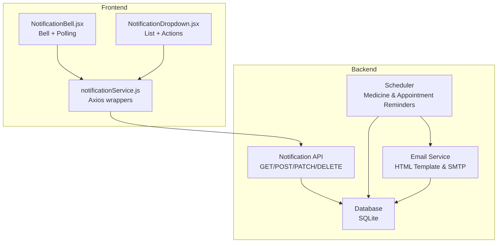
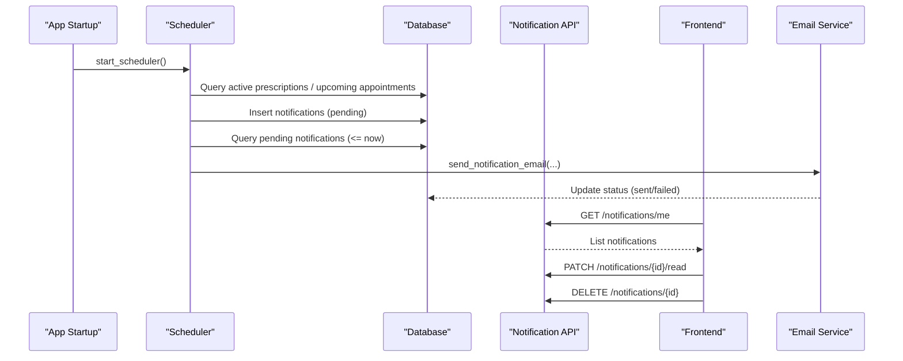
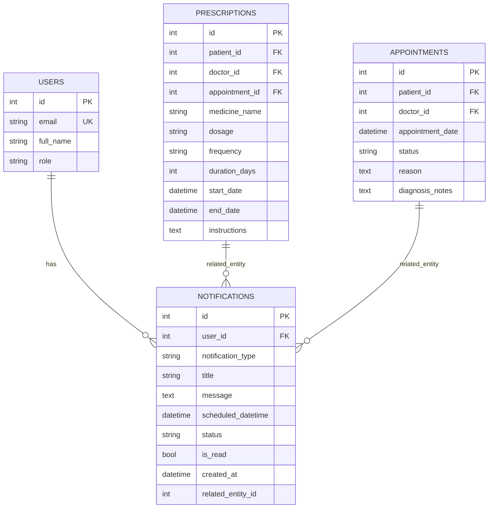
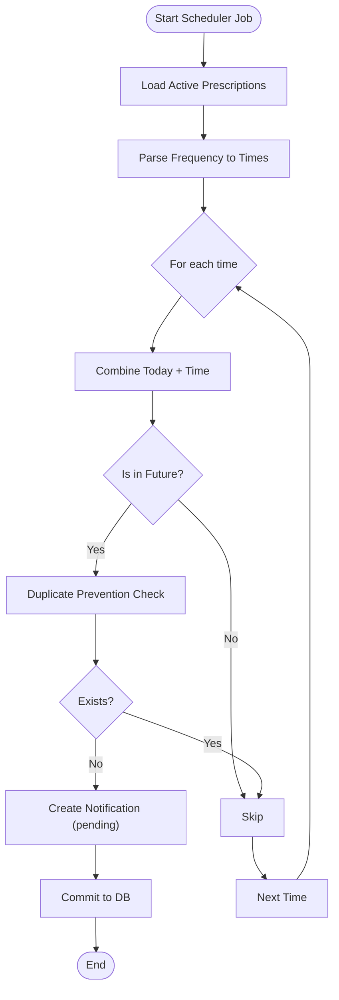
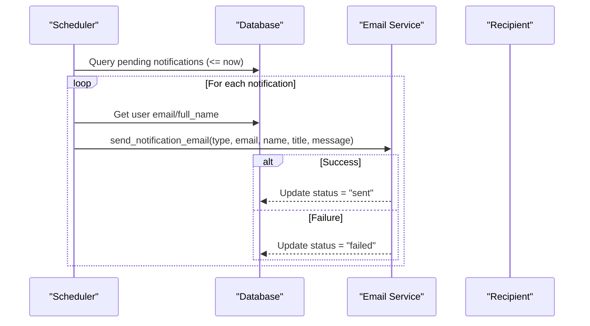
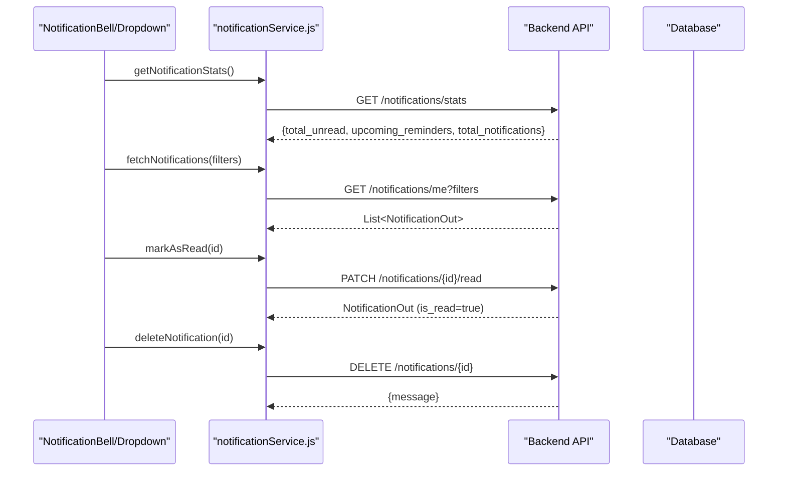
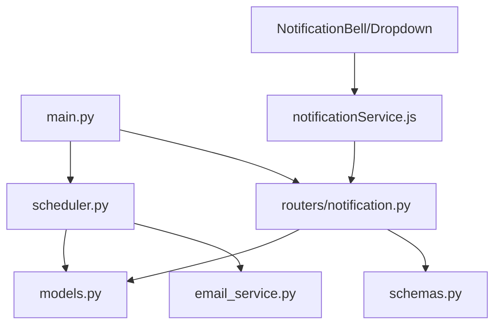
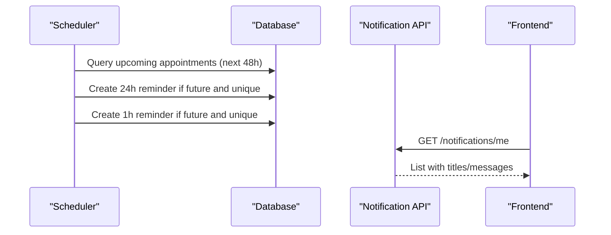
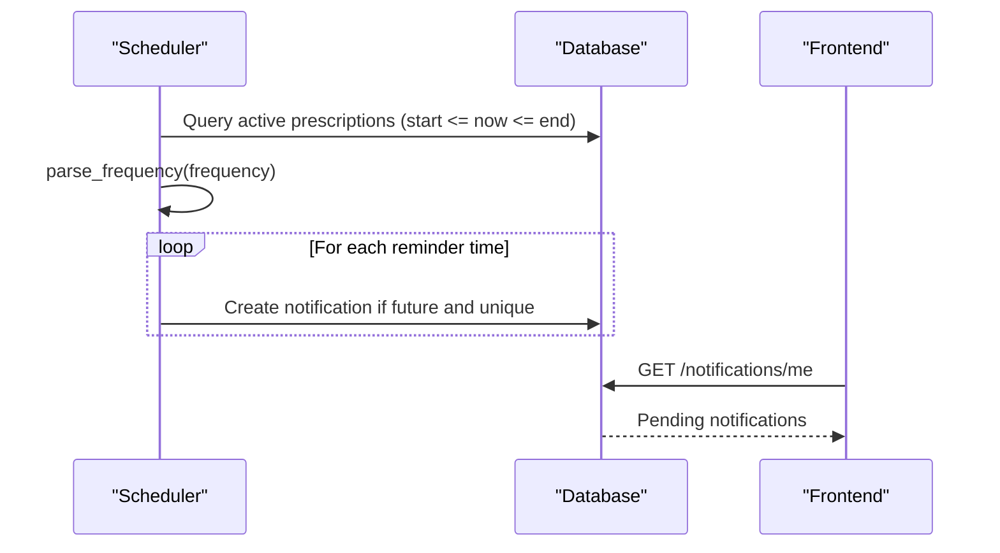

# Notification Types & Templates

<cite>
**Referenced Files in This Document**
- [backend/main.py](file://backend/main.py)
- [backend/scheduler.py](file://backend/scheduler.py)
- [backend/email_service.py](file://backend/email_service.py)
- [backend/routers/notification.py](file://backend/routers/notification.py)
- [backend/routers/prescription.py](file://backend/routers/prescription.py)
- [backend/routers/appointment.py](file://backend/routers/appointment.py)
- [backend/models.py](file://backend/models.py)
- [backend/schemas.py](file://backend/schemas.py)
- [backend/database.py](file://backend/database.py)
- [frontend/src/services/notificationService.js](file://frontend/src/services/notificationService.js)
- [frontend/src/components/NotificationBell.jsx](file://frontend/src/components/NotificationBell.jsx)
- [frontend/src/components/NotificationDropdown.jsx](file://frontend/src/components/NotificationDropdown.jsx)
- [test_notifications.py](file://test_notifications.py)
</cite>

## Table of Contents
1. [Introduction](#introduction)
2. [Project Structure](#project-structure)
3. [Core Components](#core-components)
4. [Architecture Overview](#architecture-overview)
5. [Detailed Component Analysis](#detailed-component-analysis)
6. [Dependency Analysis](#dependency-analysis)
7. [Performance Considerations](#performance-considerations)
8. [Troubleshooting Guide](#troubleshooting-guide)
9. [Conclusion](#conclusion)
10. [Appendices](#appendices)

## Introduction
This document explains the SmartHealthCare notification system, focusing on two primary notification categories:
- Appointment reminders: 24-hour and 1-hour before appointments
- Medicine reminders based on prescription frequency

It documents notification creation logic (frequency parsing, reminder time calculation, duplicate prevention), notification templates, metadata (user association, related entity linking, scheduling timestamps, status tracking), and the end-to-end lifecycle from creation to delivery. It also covers frontend integration for displaying and managing notifications.

## Project Structure
The notification system spans backend APIs, background scheduling, email delivery, and frontend UI components:
- Backend API routes for CRUD and stats of notifications
- Background scheduler that generates reminders and sends pending notifications
- Email service that formats and sends HTML emails
- Frontend services and components for fetching, displaying, and interacting with notifications

**Diagram sources**
- [backend/routers/notification.py](file://backend/routers/notification.py#L1-L177)
- [backend/scheduler.py](file://backend/scheduler.py#L1-L317)
- [backend/email_service.py](file://backend/email_service.py#L1-L161)
- [frontend/src/services/notificationService.js](file://frontend/src/services/notificationService.js#L1-L117)
- [frontend/src/components/NotificationBell.jsx](file://frontend/src/components/NotificationBell.jsx#L1-L64)
- [frontend/src/components/NotificationDropdown.jsx](file://frontend/src/components/NotificationDropdown.jsx#L1-L182)

**Section sources**
- [backend/main.py](file://backend/main.py#L1-L61)
- [backend/routers/notification.py](file://backend/routers/notification.py#L1-L177)
- [backend/scheduler.py](file://backend/scheduler.py#L1-L317)
- [backend/email_service.py](file://backend/email_service.py#L1-L161)
- [frontend/src/services/notificationService.js](file://frontend/src/services/notificationService.js#L1-L117)
- [frontend/src/components/NotificationBell.jsx](file://frontend/src/components/NotificationBell.jsx#L1-L64)
- [frontend/src/components/NotificationDropdown.jsx](file://frontend/src/components/NotificationDropdown.jsx#L1-L182)

## Core Components
- Notification model and schema define metadata and fields used across the system.
- Scheduler module parses prescription frequency, calculates reminder times, prevents duplicates, and creates notifications.
- Notification API exposes endpoints to list, filter, mark read, and delete notifications.
- Email service renders HTML templates and sends emails for pending notifications.
- Frontend services and components integrate with the backend to present notifications and allow user actions.

**Section sources**
- [backend/models.py](file://backend/models.py#L75-L89)
- [backend/schemas.py](file://backend/schemas.py#L181-L211)
- [backend/scheduler.py](file://backend/scheduler.py#L21-L108)
- [backend/routers/notification.py](file://backend/routers/notification.py#L13-L177)
- [backend/email_service.py](file://backend/email_service.py#L23-L161)
- [frontend/src/services/notificationService.js](file://frontend/src/services/notificationService.js#L11-L117)

## Architecture Overview
The notification lifecycle:
1. Creation triggers:
   - Appointment reminders: generated up to 48 hours before an appointment.
   - Medicine reminders: generated hourly based on active prescriptions and parsed frequency.
2. Duplicate prevention: checks existing notifications with matching user, type, related entity, and scheduled time.
3. Pending notifications are sent via email using an HTML template.
4. Frontend polls for unread counts and displays notifications with actions.

**Diagram sources**
- [backend/main.py](file://backend/main.py#L46-L56)
- [backend/scheduler.py](file://backend/scheduler.py#L259-L308)
- [backend/routers/notification.py](file://backend/routers/notification.py#L13-L177)
- [backend/email_service.py](file://backend/email_service.py#L141-L161)
- [frontend/src/services/notificationService.js](file://frontend/src/services/notificationService.js#L11-L117)

## Detailed Component Analysis

### Notification Model and Metadata
- Fields include user association, notification type, title, message, scheduled time, status, read flag, creation timestamp, and related entity linkage.
- Indexes optimize filtering and ordering by user, type, scheduled time, and status.

**Diagram sources**
- [backend/models.py](file://backend/models.py#L75-L89)
- [backend/models.py](file://backend/models.py#L91-L110)

**Section sources**
- [backend/models.py](file://backend/models.py#L75-L89)
- [backend/schemas.py](file://backend/schemas.py#L181-L211)

### Frequency Parsing and Reminder Calculation
- Frequency parsing converts textual frequency (e.g., “3 times daily”, “every 6 hours”) into specific times of day.
- Medicine reminders are created for each parsed time if it is in the future and no duplicate exists.
- Appointment reminders are created 24 hours and 1 hour before the appointment if still in the future and no duplicate exists.

**Diagram sources**
- [backend/scheduler.py](file://backend/scheduler.py#L51-L108)
- [backend/scheduler.py](file://backend/scheduler.py#L110-L183)

**Section sources**
- [backend/scheduler.py](file://backend/scheduler.py#L21-L49)
- [backend/scheduler.py](file://backend/scheduler.py#L51-L108)
- [backend/scheduler.py](file://backend/scheduler.py#L110-L183)

### Notification Templates and Email Delivery
- Email templates render a branded HTML layout with title and message, including a call-to-action link and footer.
- Subject mapping selects a subject based on notification type.
- Pending notifications are sent via SMTP; status is updated regardless of success to ensure in-app visibility.

**Diagram sources**
- [backend/scheduler.py](file://backend/scheduler.py#L185-L234)
- [backend/email_service.py](file://backend/email_service.py#L141-L161)

**Section sources**
- [backend/email_service.py](file://backend/email_service.py#L23-L96)
- [backend/email_service.py](file://backend/email_service.py#L141-L161)
- [backend/scheduler.py](file://backend/scheduler.py#L185-L234)

### Frontend Integration and Lifecycle Management
- Frontend services wrap API endpoints for fetching notifications, stats, upcoming reminders, marking read, marking all read, and deleting.
- The bell icon polls for unread counts and opens a dropdown with a list of notifications, allowing users to mark as read or delete.
- The dropdown maps notification types to icons and formats timestamps.

**Diagram sources**
- [frontend/src/components/NotificationBell.jsx](file://frontend/src/components/NotificationBell.jsx#L11-L30)
- [frontend/src/components/NotificationDropdown.jsx](file://frontend/src/components/NotificationDropdown.jsx#L24-L56)
- [frontend/src/services/notificationService.js](file://frontend/src/services/notificationService.js#L11-L117)
- [backend/routers/notification.py](file://backend/routers/notification.py#L13-L177)

**Section sources**
- [frontend/src/services/notificationService.js](file://frontend/src/services/notificationService.js#L11-L117)
- [frontend/src/components/NotificationBell.jsx](file://frontend/src/components/NotificationBell.jsx#L11-L30)
- [frontend/src/components/NotificationDropdown.jsx](file://frontend/src/components/NotificationDropdown.jsx#L24-L56)
- [backend/routers/notification.py](file://backend/routers/notification.py#L13-L177)

### Notification Categories and Content Generation
- Appointment reminders:
  - 24-hour reminder: title and message include doctor’s name and formatted time.
  - 1-hour reminder: similar content with a shorter countdown.
- Medicine reminders:
  - Title includes medicine name; message includes dosage and optional instructions.
  - Frequency parsing determines multiple daily times; duplicates are prevented.

Examples of content generation are implemented in the scheduler and validated by tests.

**Section sources**
- [backend/scheduler.py](file://backend/scheduler.py#L110-L183)
- [backend/scheduler.py](file://backend/scheduler.py#L51-L108)
- [test_notifications.py](file://test_notifications.py#L14-L59)

## Dependency Analysis
- The main application wires routers and starts the scheduler on startup.
- The notification router depends on models and schemas for ORM and Pydantic validation.
- The scheduler depends on models, database sessions, and the email service.
- Frontend services depend on the backend API endpoints.

**Diagram sources**
- [backend/main.py](file://backend/main.py#L34-L56)
- [backend/routers/notification.py](file://backend/routers/notification.py#L1-L11)
- [backend/scheduler.py](file://backend/scheduler.py#L1-L9)
- [backend/email_service.py](file://backend/email_service.py#L1-L11)
- [frontend/src/services/notificationService.js](file://frontend/src/services/notificationService.js#L1-L9)

**Section sources**
- [backend/main.py](file://backend/main.py#L34-L56)
- [backend/routers/notification.py](file://backend/routers/notification.py#L1-L11)
- [backend/scheduler.py](file://backend/scheduler.py#L1-L9)
- [backend/email_service.py](file://backend/email_service.py#L1-L11)
- [frontend/src/services/notificationService.js](file://frontend/src/services/notificationService.js#L1-L9)

## Performance Considerations
- Background jobs:
  - Medicine and appointment reminder checks run hourly.
  - Pending notifications are sent every 5 minutes.
  - Old notifications are cleaned up daily at 2 AM.
- Database indexing:
  - Notification fields (user_id, notification_type, scheduled_datetime, status) are indexed to speed up queries.
- Email delivery:
  - Email sending is attempted per notification; failures update status to failed for auditability.
- Frontend polling:
  - Unread stats are polled every 30 seconds to keep the UI responsive.

[No sources needed since this section provides general guidance]

## Troubleshooting Guide
- Email not configured:
  - If email credentials are missing, the system logs a warning and skips sending emails. Ensure environment variables are set for email configuration.
- Scheduler errors:
  - Exceptions during reminder creation or sending are caught, logged, and rolled back to prevent partial state.
- Duplicate prevention:
  - If a duplicate notification is detected (same user, type, related entity, and scheduled time), it is skipped to avoid redundant alerts.
- Frontend issues:
  - Ensure the frontend is using the correct base URL and bearer token. Verify that the bell icon polls and dropdown loads notifications.

**Section sources**
- [backend/email_service.py](file://backend/email_service.py#L20-L22)
- [backend/email_service.py](file://backend/email_service.py#L109-L112)
- [backend/scheduler.py](file://backend/scheduler.py#L103-L106)
- [backend/scheduler.py](file://backend/scheduler.py#L178-L181)
- [backend/scheduler.py](file://backend/scheduler.py#L229-L232)

## Conclusion
SmartHealthCare’s notification system provides robust, automated reminders for appointments and medications. It parses frequencies, prevents duplicates, persists metadata, and delivers timely notifications via email while offering a user-friendly interface for managing notifications. The modular design separates concerns across backend APIs, scheduler, email service, and frontend components, enabling maintainability and scalability.

[No sources needed since this section summarizes without analyzing specific files]

## Appendices

### API Endpoints for Notifications
- GET /notifications/me: List notifications with optional filters (type, read status), ordered by scheduled_datetime desc.
- GET /notifications/stats: Return unread count, upcoming reminders, and total notifications.
- GET /notifications/upcoming: Return upcoming reminders (not read, scheduled in the future).
- PATCH /notifications/{notification_id}/read: Mark a notification as read.
- PATCH /notifications/mark-all-read: Mark all notifications as read.
- DELETE /notifications/{notification_id}: Delete a notification.
- POST /notifications/create: Create a notification (authorized for doctors/admins or patients for themselves).

**Section sources**
- [backend/routers/notification.py](file://backend/routers/notification.py#L13-L177)

### Example Workflows

#### Appointment Reminder Creation

**Diagram sources**
- [backend/scheduler.py](file://backend/scheduler.py#L110-L183)
- [backend/routers/notification.py](file://backend/routers/notification.py#L13-L85)

#### Medicine Reminder Creation

**Diagram sources**
- [backend/scheduler.py](file://backend/scheduler.py#L51-L108)
- [backend/routers/notification.py](file://backend/routers/notification.py#L13-L85)

### Testing and Customization
- Use the test script to create prescriptions and manual notifications, then fetch notifications and stats to validate behavior.
- Customize templates by editing the HTML email template in the email service.
- Adjust scheduler intervals and frequency parsing rules to fit organizational policies.

**Section sources**
- [test_notifications.py](file://test_notifications.py#L14-L102)
- [backend/email_service.py](file://backend/email_service.py#L23-L96)
- [backend/scheduler.py](file://backend/scheduler.py#L21-L49)