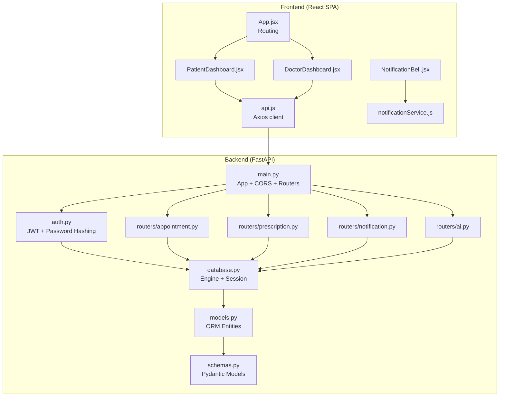
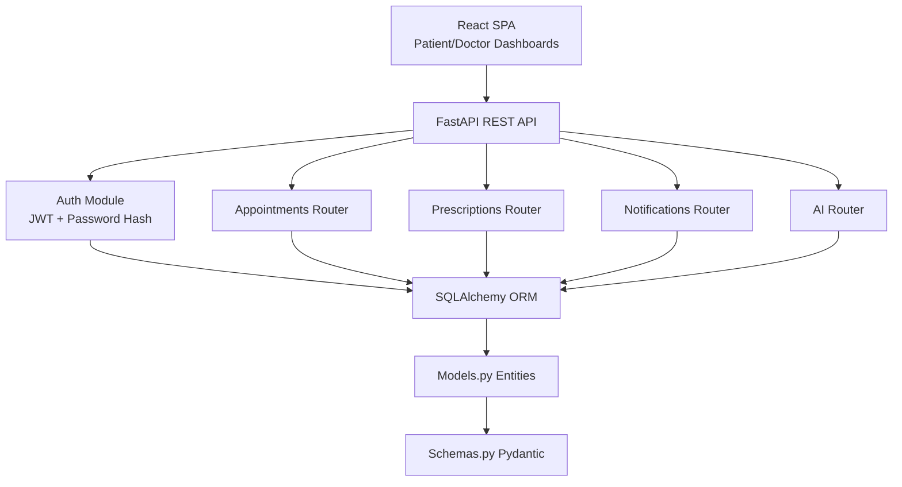
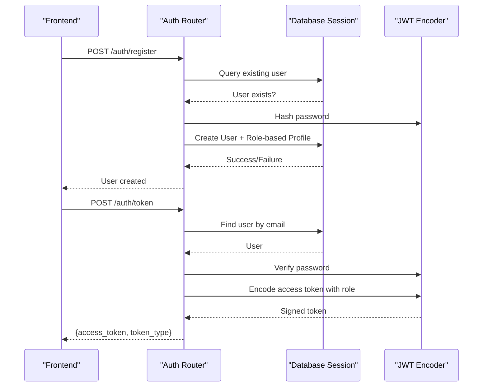
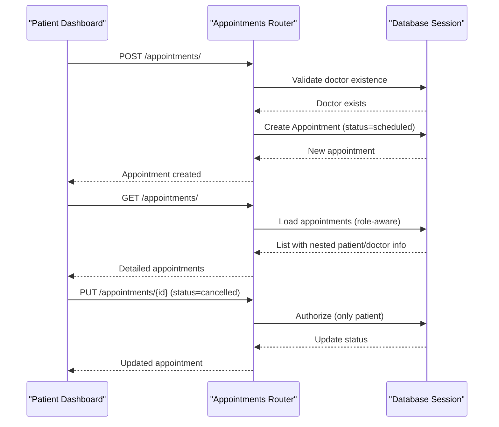
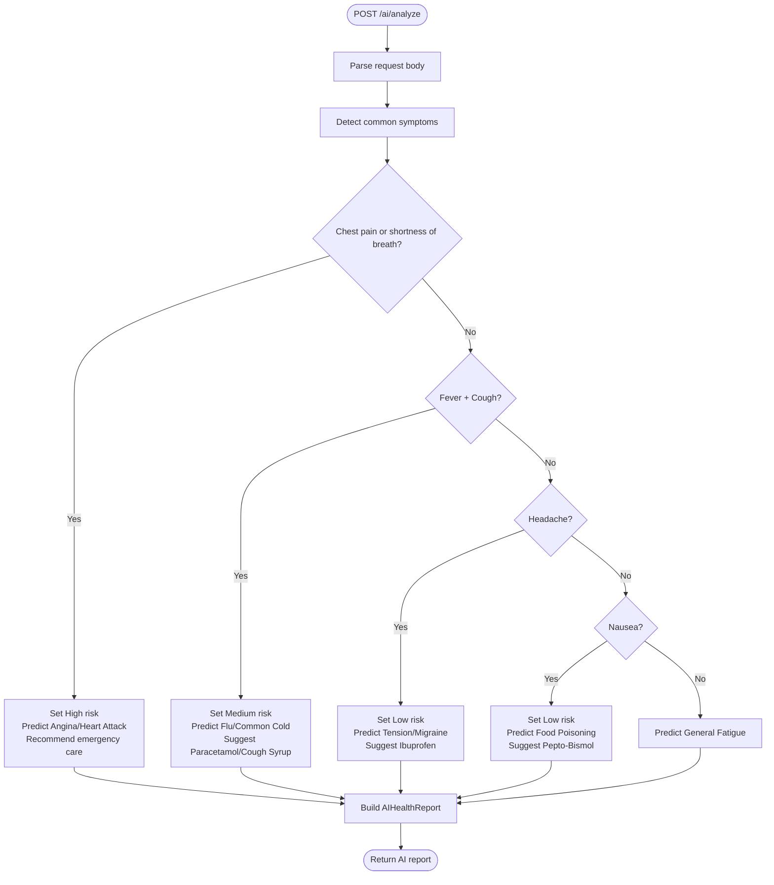
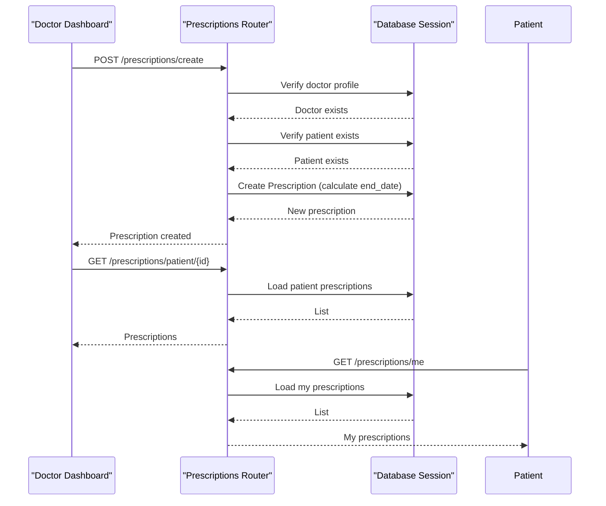
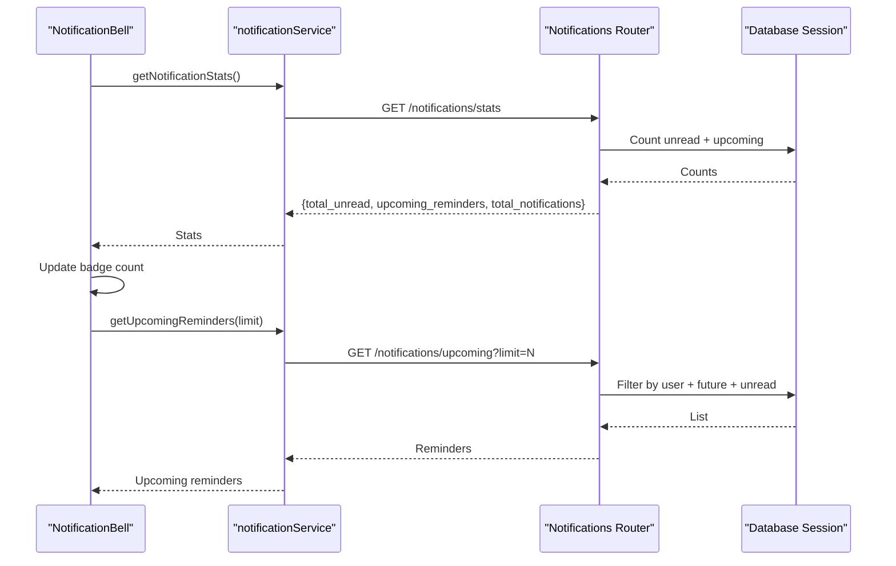
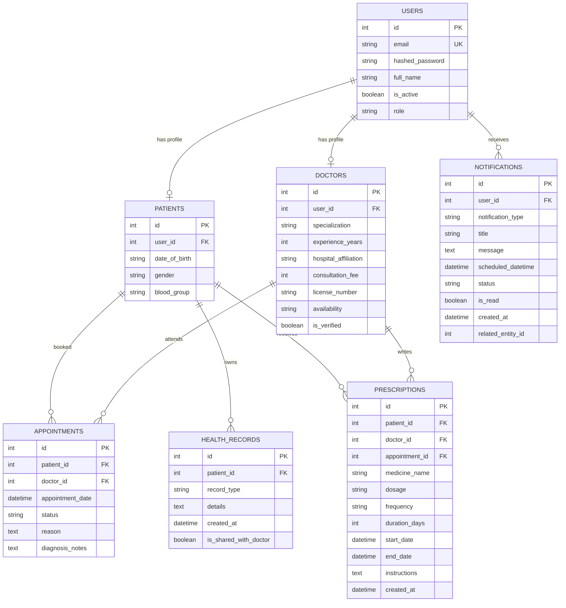
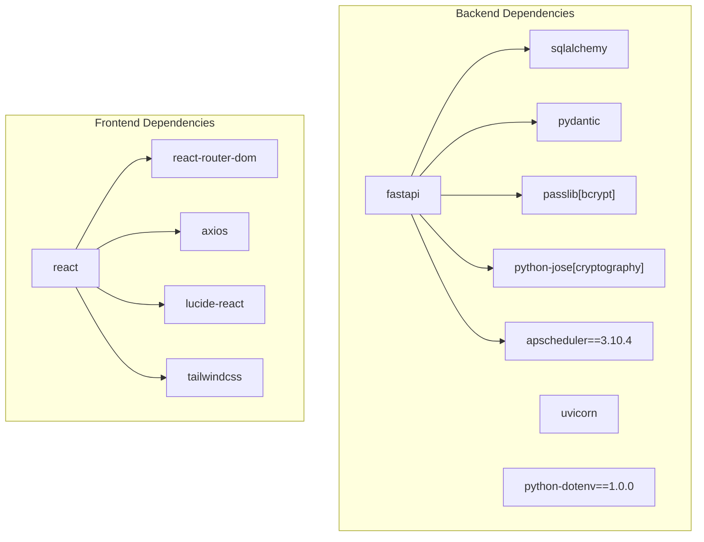

# Project Overview

<cite>
**Referenced Files in This Document**
- [backend/main.py](file://backend/main.py)
- [backend/auth.py](file://backend/auth.py)
- [backend/models.py](file://backend/models.py)
- [backend/schemas.py](file://backend/schemas.py)
- [backend/routers/appointment.py](file://backend/routers/appointment.py)
- [backend/routers/prescription.py](file://backend/routers/prescription.py)
- [backend/routers/notification.py](file://backend/routers/notification.py)
- [backend/routers/ai.py](file://backend/routers/ai.py)
- [backend/database.py](file://backend/database.py)
- [frontend/src/App.jsx](file://frontend/src/App.jsx)
- [frontend/src/pages/PatientDashboard.jsx](file://frontend/src/pages/PatientDashboard.jsx)
- [frontend/src/pages/DoctorDashboard.jsx](file://frontend/src/pages/DoctorDashboard.jsx)
- [frontend/src/services/api.js](file://frontend/src/services/api.js)
- [frontend/src/services/notificationService.js](file://frontend/src/services/notificationService.js)
- [frontend/src/components/NotificationBell.jsx](file://frontend/src/components/NotificationBell.jsx)
- [requirements.txt](file://requirements.txt)
</cite>

## Table of Contents
1. Introduction
2. Project Structure
3. Core Components
4. Architecture Overview
5. Detailed Component Analysis
6. Dependency Analysis
7. Performance Considerations
8. Troubleshooting Guide
9. Conclusion

## Introduction
SmartHealthCare is a healthcare management platform designed to streamline clinical workflows and improve patient-provider communication. The system enables secure multi-role authentication (patients, doctors, administrators), facilitates appointment scheduling, offers AI-powered symptom analysis, manages prescriptions, and provides a robust notification system to keep users informed about upcoming care tasks.

Core value proposition:
- Centralized digital health ecosystem reducing administrative overhead
- Real-time, role-aware dashboards for seamless care coordination
- AI-assisted preliminary health insights to support timely decisions
- Structured, auditable prescription lifecycle management
- Proactive reminders to enhance adherence and reduce no-shows

Target audience:
- Patients seeking convenient appointment booking, health insights, and medication tracking
- Doctors managing schedules, documenting consultations, and issuing prescriptions
- Administrators overseeing system operations and notifications

## Project Structure
The project follows a clear separation of concerns:
- Frontend: React Single Page Application (SPA) with route-based navigation and role-specific dashboards
- Backend: FastAPI REST service with modular routers for domain capabilities
- Database: SQLAlchemy ORM with SQLite for development and extensibility to PostgreSQL

**Diagram sources**
- [backend/main.py](file://backend/main.py#L13-L44)
- [backend/auth.py](file://backend/auth.py#L18-L21)
- [backend/database.py](file://backend/database.py#L5-L21)
- [backend/models.py](file://backend/models.py#L6-L110)
- [backend/schemas.py](file://backend/schemas.py#L6-L236)
- [backend/routers/appointment.py](file://backend/routers/appointment.py#L7-L10)
- [backend/routers/prescription.py](file://backend/routers/prescription.py#L7-L10)
- [backend/routers/notification.py](file://backend/routers/notification.py#L8-L11)
- [backend/routers/ai.py](file://backend/routers/ai.py#L5-L8)
- [frontend/src/App.jsx](file://frontend/src/App.jsx#L9-L25)
- [frontend/src/pages/PatientDashboard.jsx](file://frontend/src/pages/PatientDashboard.jsx#L11-L14)
- [frontend/src/pages/DoctorDashboard.jsx](file://frontend/src/pages/DoctorDashboard.jsx#L10-L12)
- [frontend/src/services/api.js](file://frontend/src/services/api.js#L3-L8)
- [frontend/src/services/notificationService.js](file://frontend/src/services/notificationService.js#L3-L9)
- [frontend/src/components/NotificationBell.jsx](file://frontend/src/components/NotificationBell.jsx#L6-L9)

**Section sources**
- [backend/main.py](file://backend/main.py#L13-L44)
- [frontend/src/App.jsx](file://frontend/src/App.jsx#L9-L25)

## Core Components
- Multi-role authentication and authorization via JWT tokens, password hashing, and role-based access control
- Appointment lifecycle management for scheduling, status updates, and detailed views
- AI health assistant providing risk-level insights, condition predictions, and OTC suggestions
- Prescription creation, retrieval, and active-prescription filtering
- Notification system supporting user-centric reminders, statistics, and CRUD operations

Key features and workflows:
- Patient portal: book appointments, review upcoming visits, receive reminders, and access AI health insights
- Doctor portal: manage daily schedule, update appointment status, add diagnosis notes, prescribe medications, and view patient records
- Notifications: real-time bell with unread counts, upcoming reminders, and centralized management

**Section sources**
- [backend/auth.py](file://backend/auth.py#L18-L21)
- [backend/routers/appointment.py](file://backend/routers/appointment.py#L12-L37)
- [backend/routers/ai.py](file://backend/routers/ai.py#L10-L88)
- [backend/routers/prescription.py](file://backend/routers/prescription.py#L12-L52)
- [backend/routers/notification.py](file://backend/routers/notification.py#L13-L85)
- [frontend/src/pages/PatientDashboard.jsx](file://frontend/src/pages/PatientDashboard.jsx#L56-L114)
- [frontend/src/pages/DoctorDashboard.jsx](file://frontend/src/pages/DoctorDashboard.jsx#L34-L137)
- [frontend/src/components/NotificationBell.jsx](file://frontend/src/components/NotificationBell.jsx#L11-L30)

## Architecture Overview
SmartHealthCare employs a layered architecture:
- Presentation Layer: React SPA with route-based rendering and role-aware UI
- API Layer: FastAPI application exposing REST endpoints with CORS and middleware
- Domain Layer: Modular routers encapsulating business logic per capability
- Persistence Layer: SQLAlchemy ORM models mapped to a relational database
- Security Layer: JWT-based authentication, password hashing, and role checks

**Diagram sources**
- [backend/main.py](file://backend/main.py#L34-L44)
- [backend/auth.py](file://backend/auth.py#L39-L55)
- [backend/routers/appointment.py](file://backend/routers/appointment.py#L12-L37)
- [backend/routers/prescription.py](file://backend/routers/prescription.py#L12-L52)
- [backend/routers/notification.py](file://backend/routers/notification.py#L13-L38)
- [backend/routers/ai.py](file://backend/routers/ai.py#L10-L88)
- [backend/models.py](file://backend/models.py#L6-L110)
- [backend/schemas.py](file://backend/schemas.py#L6-L236)
- [frontend/src/App.jsx](file://frontend/src/App.jsx#L9-L25)

## Detailed Component Analysis

### Authentication and Authorization
The authentication module handles user registration, login, and token issuance. It enforces role-based access control across routers and ensures only authorized users can access sensitive endpoints.

**Diagram sources**
- [backend/auth.py](file://backend/auth.py#L60-L104)
- [backend/auth.py](file://backend/auth.py#L106-L119)

**Section sources**
- [backend/auth.py](file://backend/auth.py#L18-L21)
- [backend/auth.py](file://backend/auth.py#L39-L55)
- [backend/auth.py](file://backend/auth.py#L60-L104)
- [backend/auth.py](file://backend/auth.py#L106-L119)

### Appointment Management
The appointment router supports booking, viewing, and updating appointment statuses. It enforces role-based authorization so patients can only cancel their own appointments, while doctors can update status and add diagnosis notes.

**Diagram sources**
- [backend/routers/appointment.py](file://backend/routers/appointment.py#L12-L37)
- [backend/routers/appointment.py](file://backend/routers/appointment.py#L39-L92)
- [backend/routers/appointment.py](file://backend/routers/appointment.py#L94-L128)

**Section sources**
- [backend/routers/appointment.py](file://backend/routers/appointment.py#L12-L37)
- [backend/routers/appointment.py](file://backend/routers/appointment.py#L39-L92)
- [backend/routers/appointment.py](file://backend/routers/appointment.py#L94-L128)
- [frontend/src/pages/PatientDashboard.jsx](file://frontend/src/pages/PatientDashboard.jsx#L85-L100)

### AI Health Analysis
The AI router provides a mock, rule-based analysis engine that evaluates symptom text and returns risk level, detected symptoms, predicted conditions, suggested medicines, and recommendations.

**Diagram sources**
- [backend/routers/ai.py](file://backend/routers/ai.py#L10-L88)

**Section sources**
- [backend/routers/ai.py](file://backend/routers/ai.py#L10-L88)
- [frontend/src/pages/PatientDashboard.jsx](file://frontend/src/pages/PatientDashboard.jsx#L102-L114)

### Prescription Management
The prescription router enables doctors to create prescriptions linked to appointments and patients, and allows patients to retrieve their own prescriptions and active ones.

**Diagram sources**
- [backend/routers/prescription.py](file://backend/routers/prescription.py#L12-L52)
- [backend/routers/prescription.py](file://backend/routers/prescription.py#L75-L94)
- [backend/routers/prescription.py](file://backend/routers/prescription.py#L55-L72)
- [backend/routers/prescription.py](file://backend/routers/prescription.py#L124-L144)

**Section sources**
- [backend/routers/prescription.py](file://backend/routers/prescription.py#L12-L52)
- [backend/routers/prescription.py](file://backend/routers/prescription.py#L55-L72)
- [backend/routers/prescription.py](file://backend/routers/prescription.py#L75-L94)
- [backend/routers/prescription.py](file://backend/routers/prescription.py#L124-L144)
- [frontend/src/pages/DoctorDashboard.jsx](file://frontend/src/pages/DoctorDashboard.jsx#L122-L137)

### Notification System
The notification router provides endpoints to fetch notifications, upcoming reminders, mark as read, and manage notifications. The frontend integrates a bell component that polls for unread counts and displays a dropdown with actionable items.

**Diagram sources**
- [frontend/src/components/NotificationBell.jsx](file://frontend/src/components/NotificationBell.jsx#L11-L30)
- [frontend/src/services/notificationService.js](file://frontend/src/services/notificationService.js#L32-L43)
- [frontend/src/services/notificationService.js](file://frontend/src/services/notificationService.js#L45-L57)
- [backend/routers/notification.py](file://backend/routers/notification.py#L41-L67)
- [backend/routers/notification.py](file://backend/routers/notification.py#L70-L85)

**Section sources**
- [backend/routers/notification.py](file://backend/routers/notification.py#L13-L38)
- [backend/routers/notification.py](file://backend/routers/notification.py#L41-L67)
- [backend/routers/notification.py](file://backend/routers/notification.py#L70-L85)
- [frontend/src/components/NotificationBell.jsx](file://frontend/src/components/NotificationBell.jsx#L11-L30)
- [frontend/src/services/notificationService.js](file://frontend/src/services/notificationService.js#L11-L29)

### Data Model Overview
The backend defines core entities representing users, roles, appointments, health records, notifications, and prescriptions. These models underpin the system’s data consistency and relationships.

**Diagram sources**
- [backend/models.py](file://backend/models.py#L6-L110)

**Section sources**
- [backend/models.py](file://backend/models.py#L6-L110)
- [backend/schemas.py](file://backend/schemas.py#L6-L236)

## Dependency Analysis
Technology stack summary:
- Backend: FastAPI, Uvicorn, SQLAlchemy, Pydantic, Passlib (bcrypt), python-jose, APScheduler, python-dotenv
- Frontend: React, React Router, Axios, Tailwind CSS, Lucide icons
- Database: SQLite (development), extensible to PostgreSQL

**Diagram sources**
- [requirements.txt](file://requirements.txt#L1-L14)

**Section sources**
- [requirements.txt](file://requirements.txt#L1-L14)

## Performance Considerations
- Token-based authentication avoids session storage overhead and scales horizontally
- Pagination and limits on notification queries prevent excessive payloads
- Frontend polling intervals should be tuned to balance freshness vs. network load
- Database queries use filtered and indexed fields (e.g., user_id, scheduled_datetime) to minimize scans
- Consider connection pooling and async workers for high-load scenarios

## Troubleshooting Guide
Common issues and resolutions:
- Authentication failures: Verify JWT token presence and validity; ensure correct role-based permissions
- CORS errors: Confirm frontend origins are whitelisted in backend CORS configuration
- Database connectivity: Check SQLite path or configure PostgreSQL connection string
- Notification polling: Ensure local storage token is present; verify backend endpoints availability

**Section sources**
- [backend/main.py](file://backend/main.py#L19-L32)
- [frontend/src/services/api.js](file://frontend/src/services/api.js#L10-L22)
- [backend/database.py](file://backend/database.py#L5-L7)

## Conclusion
SmartHealthCare delivers a cohesive healthcare management solution with a modern React frontend and a scalable FastAPI backend. Its multi-role authentication, streamlined appointment workflows, AI-driven insights, structured prescription management, and proactive notification system collectively address key operational challenges in healthcare delivery. The modular design and clear data models facilitate maintainability and future enhancements.