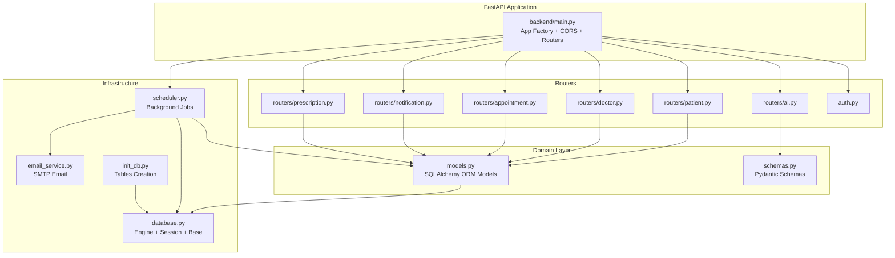
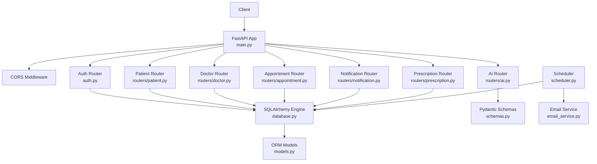
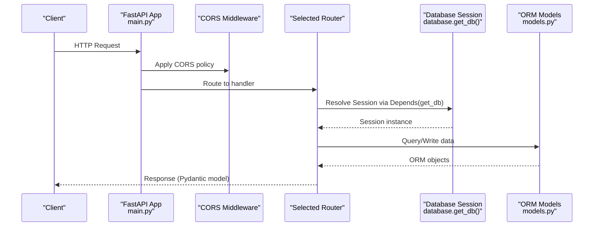
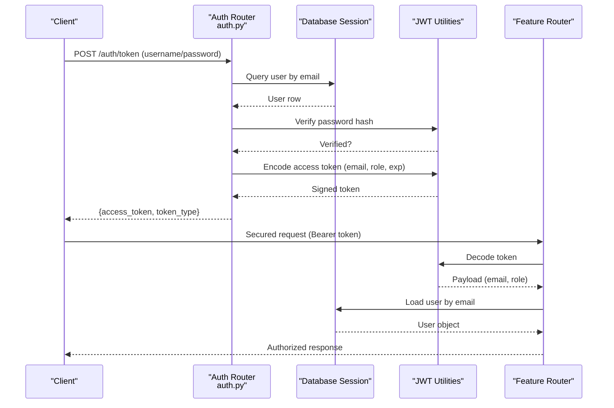
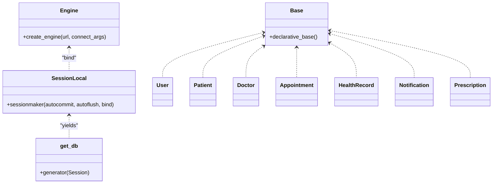
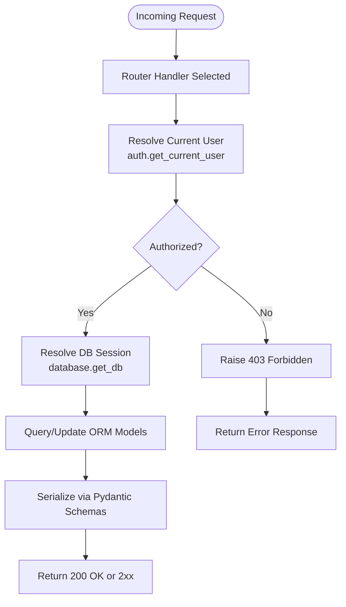
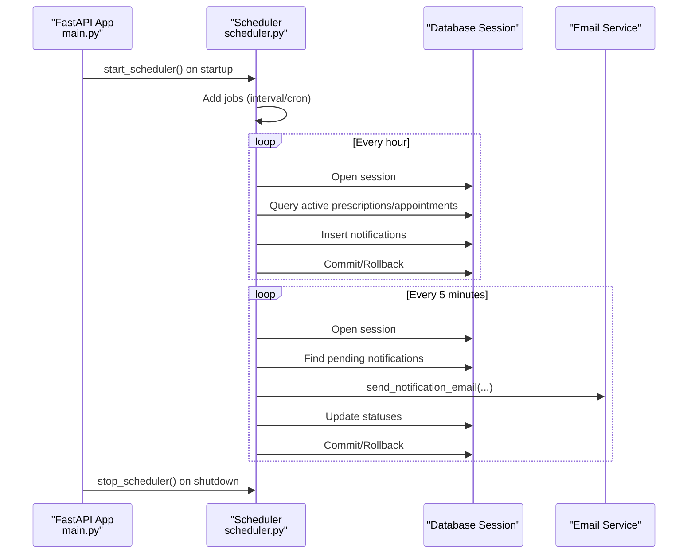
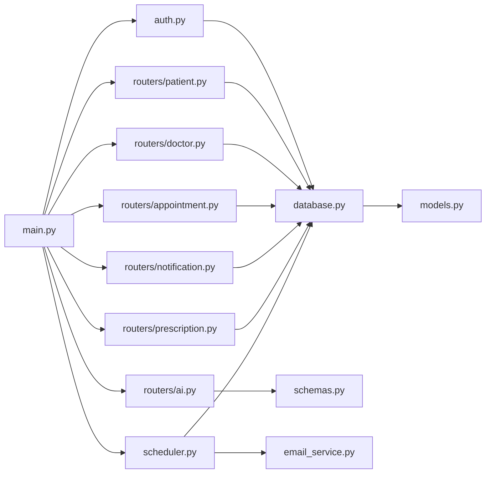

# Backend Architecture

<cite>
**Referenced Files in This Document**
- [main.py](file://backend/main.py)
- [auth.py](file://backend/auth.py)
- [database.py](file://backend/database.py)
- [models.py](file://backend/models.py)
- [schemas.py](file://backend/schemas.py)
- [scheduler.py](file://backend/scheduler.py)
- [email_service.py](file://backend/email_service.py)
- [init_db.py](file://backend/init_db.py)
- [routers/patient.py](file://backend/routers/patient.py)
- [routers/doctor.py](file://backend/routers/doctor.py)
- [routers/appointment.py](file://backend/routers/appointment.py)
- [routers/notification.py](file://backend/routers/notification.py)
- [routers/prescription.py](file://backend/routers/prescription.py)
- [routers/ai.py](file://backend/routers/ai.py)
</cite>

## Table of Contents
1. [Introduction](#introduction)
2. [Project Structure](#project-structure)
3. [Core Components](#core-components)
4. [Architecture Overview](#architecture-overview)
5. [Detailed Component Analysis](#detailed-component-analysis)
6. [Dependency Analysis](#dependency-analysis)
7. [Performance Considerations](#performance-considerations)
8. [Troubleshooting Guide](#troubleshooting-guide)
9. [Conclusion](#conclusion)
10. [Appendices](#appendices)

## Introduction
This document describes the backend architecture of SmartHealthCare, focusing on the FastAPI application structure, router-based modular design, middleware configuration (including CORS), the application factory pattern, dependency injection, clean architecture separation, authentication and authorization, database abstraction with SQLAlchemy, request-response flow, error handling, logging, and lifecycle management including startup/shutdown hooks and background task scheduling.

## Project Structure
The backend is organized around a FastAPI application factory in main.py, with modular routers under backend/routers/, shared domain models and schemas, a database abstraction layer, and supporting services for email and background scheduling.

**Diagram sources**
- [main.py](file://backend/main.py#L1-L61)
- [auth.py](file://backend/auth.py#L1-L120)
- [routers/patient.py](file://backend/routers/patient.py#L1-L107)
- [routers/doctor.py](file://backend/routers/doctor.py#L1-L120)
- [routers/appointment.py](file://backend/routers/appointment.py#L1-L129)
- [routers/notification.py](file://backend/routers/notification.py#L1-L177)
- [routers/prescription.py](file://backend/routers/prescription.py#L1-L145)
- [routers/ai.py](file://backend/routers/ai.py#L1-L90)
- [models.py](file://backend/models.py#L1-L110)
- [schemas.py](file://backend/schemas.py#L1-L236)
- [database.py](file://backend/database.py#L1-L22)
- [email_service.py](file://backend/email_service.py#L1-L161)
- [scheduler.py](file://backend/scheduler.py#L1-L317)
- [init_db.py](file://backend/init_db.py#L1-L11)

**Section sources**
- [main.py](file://backend/main.py#L1-L61)
- [database.py](file://backend/database.py#L1-L22)
- [models.py](file://backend/models.py#L1-L110)
- [schemas.py](file://backend/schemas.py#L1-L236)
- [scheduler.py](file://backend/scheduler.py#L1-L317)
- [email_service.py](file://backend/email_service.py#L1-L161)
- [init_db.py](file://backend/init_db.py#L1-L11)

## Core Components
- Application factory and middleware: FastAPI app creation, CORS configuration, router inclusion, and lifecycle events.
- Authentication and authorization: JWT-based authentication, password hashing, token issuance, and per-request user resolution.
- Database abstraction: SQLAlchemy engine, session management, declarative base, and dependency-driven session provider.
- Domain models and schemas: Pydantic models for request/response validation and ORM models for persistence.
- Background scheduling: APScheduler jobs for reminders and cleanup, integrated with database sessions and email service.
- Email service: SMTP-based notification delivery with environment-driven configuration.

**Section sources**
- [main.py](file://backend/main.py#L13-L61)
- [auth.py](file://backend/auth.py#L1-L120)
- [database.py](file://backend/database.py#L1-L22)
- [models.py](file://backend/models.py#L1-L110)
- [schemas.py](file://backend/schemas.py#L1-L236)
- [scheduler.py](file://backend/scheduler.py#L1-L317)
- [email_service.py](file://backend/email_service.py#L1-L161)

## Architecture Overview
SmartHealthCare follows a router-based modular design with clear separation between presentation (routers), domain (models/schemas), and infrastructure (database/email/scheduler). FastAPI’s dependency injection powers session management and authentication. Middleware configures cross-origin access. Startup/shutdown events initialize and tear down background tasks.

**Diagram sources**
- [main.py](file://backend/main.py#L13-L61)
- [auth.py](file://backend/auth.py#L1-L120)
- [routers/patient.py](file://backend/routers/patient.py#L1-L107)
- [routers/doctor.py](file://backend/routers/doctor.py#L1-L120)
- [routers/appointment.py](file://backend/routers/appointment.py#L1-L129)
- [routers/notification.py](file://backend/routers/notification.py#L1-L177)
- [routers/prescription.py](file://backend/routers/prescription.py#L1-L145)
- [routers/ai.py](file://backend/routers/ai.py#L1-L90)
- [database.py](file://backend/database.py#L1-L22)
- [models.py](file://backend/models.py#L1-L110)
- [schemas.py](file://backend/schemas.py#L1-L236)
- [scheduler.py](file://backend/scheduler.py#L1-L317)
- [email_service.py](file://backend/email_service.py#L1-L161)

## Detailed Component Analysis

### Application Factory Pattern and Middleware
- The FastAPI app is created with metadata (title, description, version) and configured with CORS allowing specific origins and credentials.
- Routers are included centrally to modularize endpoints by feature.
- Startup and shutdown event handlers manage background scheduler lifecycle.

**Diagram sources**
- [main.py](file://backend/main.py#L13-L61)
- [database.py](file://backend/database.py#L16-L22)
- [models.py](file://backend/models.py#L1-L110)

**Section sources**
- [main.py](file://backend/main.py#L13-L61)

### Authentication Architecture (JWT + RBAC)
- Password hashing and verification use a cryptographic context.
- OAuth2 password bearer scheme drives token acquisition.
- JWT encoding/decoding with a signing secret and expiration window.
- Per-request user resolution via dependency injection resolves the current authenticated user.
- Role-based access control is enforced in routers (e.g., patient-only endpoints, doctor-only endpoints).

**Diagram sources**
- [auth.py](file://backend/auth.py#L1-L120)
- [database.py](file://backend/database.py#L16-L22)
- [routers/patient.py](file://backend/routers/patient.py#L11-L25)
- [routers/doctor.py](file://backend/routers/doctor.py#L28-L42)
- [routers/appointment.py](file://backend/routers/appointment.py#L12-L37)

**Section sources**
- [auth.py](file://backend/auth.py#L1-L120)

### Database Abstraction Layer (SQLAlchemy)
- Engine configured for SQLite with thread-local safety for non-threaded contexts.
- Session factory provides scoped sessions with manual commit/rollback.
- Declarative base defines ORM models with relationships.
- Dependency injection supplies a fresh session per request.

**Diagram sources**
- [database.py](file://backend/database.py#L1-L22)
- [models.py](file://backend/models.py#L1-L110)

**Section sources**
- [database.py](file://backend/database.py#L1-L22)
- [models.py](file://backend/models.py#L1-L110)

### Request-Response Flow and Clean Architecture
- Routers define endpoints and orchestrate calls to services via SQLAlchemy sessions.
- Pydantic schemas validate incoming requests and serialize outgoing responses.
- Authorization checks occur at the router level using the current user resolved by the auth dependency.
- Error handling uses HTTP exceptions raised by routers and handled by FastAPI.

**Diagram sources**
- [routers/patient.py](file://backend/routers/patient.py#L11-L25)
- [routers/doctor.py](file://backend/routers/doctor.py#L28-L42)
- [routers/appointment.py](file://backend/routers/appointment.py#L12-L37)
- [schemas.py](file://backend/schemas.py#L1-L236)
- [models.py](file://backend/models.py#L1-L110)

**Section sources**
- [routers/patient.py](file://backend/routers/patient.py#L1-L107)
- [routers/doctor.py](file://backend/routers/doctor.py#L1-L120)
- [routers/appointment.py](file://backend/routers/appointment.py#L1-L129)
- [schemas.py](file://backend/schemas.py#L1-L236)

### Background Task Scheduling Integration
- APScheduler runs periodic jobs for:
  - Medicine reminders generation
  - Appointment reminders generation
  - Sending pending notifications
  - Cleanup of old notifications
- Scheduler lifecycle is managed by app startup/shutdown hooks.

**Diagram sources**
- [main.py](file://backend/main.py#L46-L56)
- [scheduler.py](file://backend/scheduler.py#L259-L317)
- [email_service.py](file://backend/email_service.py#L141-L161)
- [database.py](file://backend/database.py#L16-L22)

**Section sources**
- [scheduler.py](file://backend/scheduler.py#L1-L317)
- [email_service.py](file://backend/email_service.py#L1-L161)
- [main.py](file://backend/main.py#L46-L56)

### Logging Configuration
- Application-wide logging configured to write to a file with timestamped entries.
- Logging used across auth, routers, scheduler, and email service for operational visibility.

**Section sources**
- [main.py](file://backend/main.py#L6-L11)
- [auth.py](file://backend/auth.py#L57-L58)
- [scheduler.py](file://backend/scheduler.py#L7-L7)
- [email_service.py](file://backend/email_service.py#L11-L11)

## Dependency Analysis
The system exhibits low coupling and high cohesion:
- Routers depend on auth.get_current_user and database.get_db for DI.
- Domain models encapsulate persistence; schemas encapsulate validation.
- Scheduler depends on models, database, and email_service.
- Email configuration is externalized via environment variables.

**Diagram sources**
- [main.py](file://backend/main.py#L34-L44)
- [auth.py](file://backend/auth.py#L1-L120)
- [routers/patient.py](file://backend/routers/patient.py#L1-L107)
- [routers/doctor.py](file://backend/routers/doctor.py#L1-L120)
- [routers/appointment.py](file://backend/routers/appointment.py#L1-L129)
- [routers/notification.py](file://backend/routers/notification.py#L1-L177)
- [routers/prescription.py](file://backend/routers/prescription.py#L1-L145)
- [routers/ai.py](file://backend/routers/ai.py#L1-L90)
- [database.py](file://backend/database.py#L1-L22)
- [models.py](file://backend/models.py#L1-L110)
- [schemas.py](file://backend/schemas.py#L1-L236)
- [scheduler.py](file://backend/scheduler.py#L1-L317)
- [email_service.py](file://backend/email_service.py#L1-L161)

**Section sources**
- [main.py](file://backend/main.py#L34-L44)
- [database.py](file://backend/database.py#L1-L22)
- [models.py](file://backend/models.py#L1-L110)
- [schemas.py](file://backend/schemas.py#L1-L236)
- [scheduler.py](file://backend/scheduler.py#L1-L317)
- [email_service.py](file://backend/email_service.py#L1-L161)

## Performance Considerations
- Session lifecycle: Sessions are opened per request and closed in a finally block to prevent leaks.
- Query efficiency: Routers compose queries with filters and joins; consider indexing high-cardinality fields (e.g., user_id, email).
- Scheduler cadence: Jobs are tuned to balance freshness and overhead; adjust intervals based on load.
- Logging volume: Ensure log rotation in production to control disk usage.

[No sources needed since this section provides general guidance]

## Troubleshooting Guide
- CORS errors: Verify allowed origins match frontend ports and credentials are enabled when required.
- Authentication failures: Confirm JWT secret, algorithm, and expiration settings; ensure tokens are attached as Bearer.
- Database initialization: Run the initialization script to create tables if missing.
- Email delivery: Check environment variables for SMTP host/port/credentials; confirm EMAIL_ENABLED flag.
- Scheduler not starting: Review startup logs and ensure scheduler.start_scheduler() is invoked on app startup.

**Section sources**
- [main.py](file://backend/main.py#L19-L32)
- [auth.py](file://backend/auth.py#L10-L13)
- [init_db.py](file://backend/init_db.py#L1-L11)
- [email_service.py](file://backend/email_service.py#L14-L21)
- [scheduler.py](file://backend/scheduler.py#L259-L308)

## Conclusion
SmartHealthCare’s backend leverages FastAPI’s router modularity and dependency injection to cleanly separate concerns across presentation, domain, and infrastructure layers. Authentication is JWT-based with role checks at the router level. SQLAlchemy provides a robust ORM layer with dependency-driven sessions. Background tasks are orchestrated via APScheduler with lifecycle hooks for startup and shutdown. Logging and environment-driven configuration support operational reliability.

[No sources needed since this section summarizes without analyzing specific files]

## Appendices

### Endpoint Coverage by Router
- Auth: Registration, token issuance
- Patient: Profile, health records
- Doctor: Profiles, stats, listings
- Appointment: Booking, listing, status updates
- Notification: Listing, stats, read/mark-all-read, deletion, creation
- Prescription: Creation, retrieval by patient/doctor, active prescriptions
- AI: Symptom analysis

**Section sources**
- [auth.py](file://backend/auth.py#L60-L120)
- [routers/patient.py](file://backend/routers/patient.py#L11-L107)
- [routers/doctor.py](file://backend/routers/doctor.py#L11-L120)
- [routers/appointment.py](file://backend/routers/appointment.py#L12-L129)
- [routers/notification.py](file://backend/routers/notification.py#L13-L177)
- [routers/prescription.py](file://backend/routers/prescription.py#L12-L145)
- [routers/ai.py](file://backend/routers/ai.py#L10-L90)