# Data Flow Architecture

<cite>
**Referenced Files in This Document**
- [backend/main.py](file://backend/main.py)
- [backend/database.py](file://backend/database.py)
- [backend/models.py](file://backend/models.py)
- [backend/schemas.py](file://backend/schemas.py)
- [backend/auth.py](file://backend/auth.py)
- [backend/routers/patient.py](file://backend/routers/patient.py)
- [backend/routers/appointment.py](file://backend/routers/appointment.py)
- [backend/routers/ai.py](file://backend/routers/ai.py)
- [backend/routers/notification.py](file://backend/routers/notification.py)
- [backend/routers/prescription.py](file://backend/routers/prescription.py)
- [backend/scheduler.py](file://backend/scheduler.py)
- [backend/email_service.py](file://backend/email_service.py)
- [frontend/src/services/api.js](file://frontend/src/services/api.js)
- [frontend/src/services/notificationService.js](file://frontend/src/services/notificationService.js)
- [frontend/src/components/NotificationBell.jsx](file://frontend/src/components/NotificationBell.jsx)
</cite>

## Table of Contents
1. [Introduction](#introduction)
2. [Project Structure](#project-structure)
3. [Core Components](#core-components)
4. [Architecture Overview](#architecture-overview)
5. [Detailed Component Analysis](#detailed-component-analysis)
6. [Dependency Analysis](#dependency-analysis)
7. [Performance Considerations](#performance-considerations)
8. [Troubleshooting Guide](#troubleshooting-guide)
9. [Conclusion](#conclusion)
10. [Appendices](#appendices)

## Introduction
This document describes the end-to-end data flow architecture of the SmartHealthCare system. It covers the request-response cycle from the frontend through FastAPI routers to SQLAlchemy persistence, Pydantic-based data validation and transformation, database transactions and entity relationships, background task scheduling for notifications, email integration, and the AI analysis pipeline. It also documents error propagation, data consistency, audit trails, caching and polling strategies, and performance monitoring approaches.

## Project Structure
SmartHealthCare is organized into a Python FastAPI backend and a Vite/React frontend. The backend defines routers for authentication, patients, doctors, appointments, AI analysis, notifications, and prescriptions. Data models define the relational schema, while Pydantic schemas enforce request/response validation. A background scheduler orchestrates recurring tasks for reminders and email delivery.

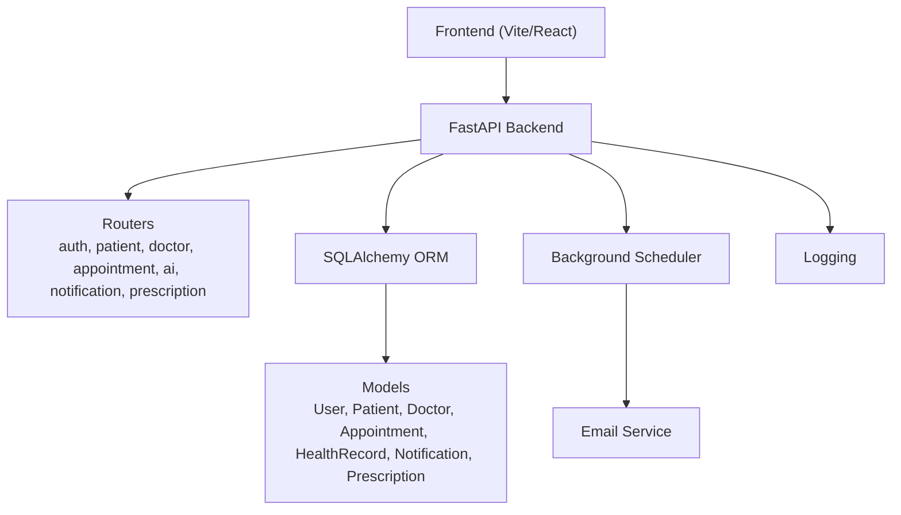

**Diagram sources**
- [backend/main.py](file://backend/main.py#L13-L44)
- [backend/database.py](file://backend/database.py#L1-L22)
- [backend/models.py](file://backend/models.py#L1-L110)
- [backend/scheduler.py](file://backend/scheduler.py#L1-L317)
- [backend/email_service.py](file://backend/email_service.py#L1-L161)

**Section sources**
- [backend/main.py](file://backend/main.py#L1-L61)
- [backend/database.py](file://backend/database.py#L1-L22)

## Core Components
- FastAPI Application: Central entrypoint with CORS, router registration, and lifecycle hooks for scheduler startup/shutdown.
- Authentication: JWT-based OAuth2 password flow with token creation and current user resolution.
- Data Models: SQLAlchemy declarative base with relationships among User, Patient, Doctor, Appointment, HealthRecord, Notification, and Prescription.
- Pydantic Schemas: Strongly typed request/response models for validation and serialization.
- Routers: Feature-based API endpoints implementing CRUD and orchestration logic.
- Database Layer: Engine, session factory, and dependency injection via a generator.
- Background Scheduler: APScheduler jobs for reminders, email dispatch, and cleanup.
- Email Service: SMTP-based templated emails with environment-driven configuration.

**Section sources**
- [backend/main.py](file://backend/main.py#L13-L61)
- [backend/auth.py](file://backend/auth.py#L1-L120)
- [backend/models.py](file://backend/models.py#L1-L110)
- [backend/schemas.py](file://backend/schemas.py#L1-L236)
- [backend/database.py](file://backend/database.py#L1-L22)
- [backend/scheduler.py](file://backend/scheduler.py#L259-L317)
- [backend/email_service.py](file://backend/email_service.py#L1-L161)

## Architecture Overview
The system follows a layered architecture:
- Presentation Layer: Frontend Axios client and React components.
- API Layer: FastAPI routers handling requests, authorization, and response modeling.
- Domain Layer: Business logic in routers (e.g., appointment booking, prescription creation).
- Persistence Layer: SQLAlchemy ORM mapped to SQLite (with PostgreSQL example comment).
- Background Layer: APScheduler jobs for recurring tasks and email delivery.

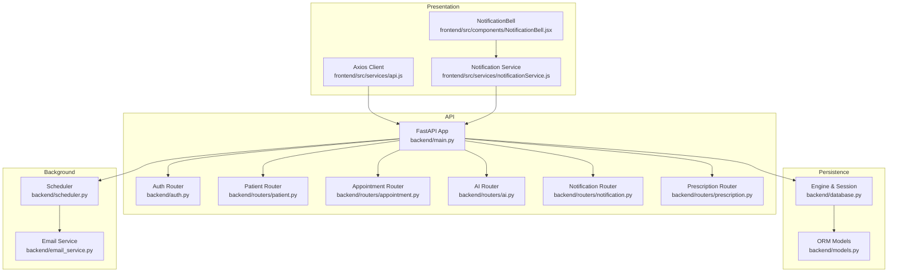

**Diagram sources**
- [backend/main.py](file://backend/main.py#L13-L44)
- [backend/auth.py](file://backend/auth.py#L1-L120)
- [backend/routers/patient.py](file://backend/routers/patient.py#L1-L107)
- [backend/routers/appointment.py](file://backend/routers/appointment.py#L1-L129)
- [backend/routers/ai.py](file://backend/routers/ai.py#L1-L90)
- [backend/routers/notification.py](file://backend/routers/notification.py#L1-L177)
- [backend/routers/prescription.py](file://backend/routers/prescription.py#L1-L150)
- [backend/database.py](file://backend/database.py#L1-L22)
- [backend/models.py](file://backend/models.py#L1-L110)
- [backend/scheduler.py](file://backend/scheduler.py#L259-L317)
- [backend/email_service.py](file://backend/email_service.py#L1-L161)
- [frontend/src/services/api.js](file://frontend/src/services/api.js#L1-L25)
- [frontend/src/services/notificationService.js](file://frontend/src/services/notificationService.js#L1-L117)
- [frontend/src/components/NotificationBell.jsx](file://frontend/src/components/NotificationBell.jsx#L1-L64)

## Detailed Component Analysis

### Request-Response Cycle and Data Validation
- Frontend Axios client injects Authorization header from localStorage and targets the backend API.
- FastAPI app registers routers and middleware (CORS).
- Routers depend on SQLAlchemy sessions and Pydantic schemas for validation and serialization.
- Authentication middleware resolves the current user from JWT tokens.

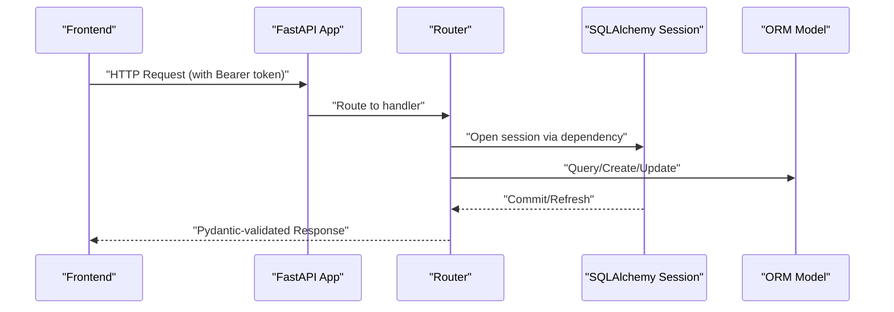

**Diagram sources**
- [frontend/src/services/api.js](file://frontend/src/services/api.js#L1-L25)
- [backend/main.py](file://backend/main.py#L13-L44)
- [backend/routers/patient.py](file://backend/routers/patient.py#L11-L25)
- [backend/database.py](file://backend/database.py#L16-L21)
- [backend/models.py](file://backend/models.py#L1-L110)

**Section sources**
- [frontend/src/services/api.js](file://frontend/src/services/api.js#L1-L25)
- [backend/main.py](file://backend/main.py#L13-L44)
- [backend/auth.py](file://backend/auth.py#L39-L55)

### Authentication and Authorization Flow
- Registration hashes passwords and creates user profiles based on role.
- Login generates a short-lived JWT token containing user identity and role.
- Protected routes resolve the current user via bearer token and enforce role-based access.

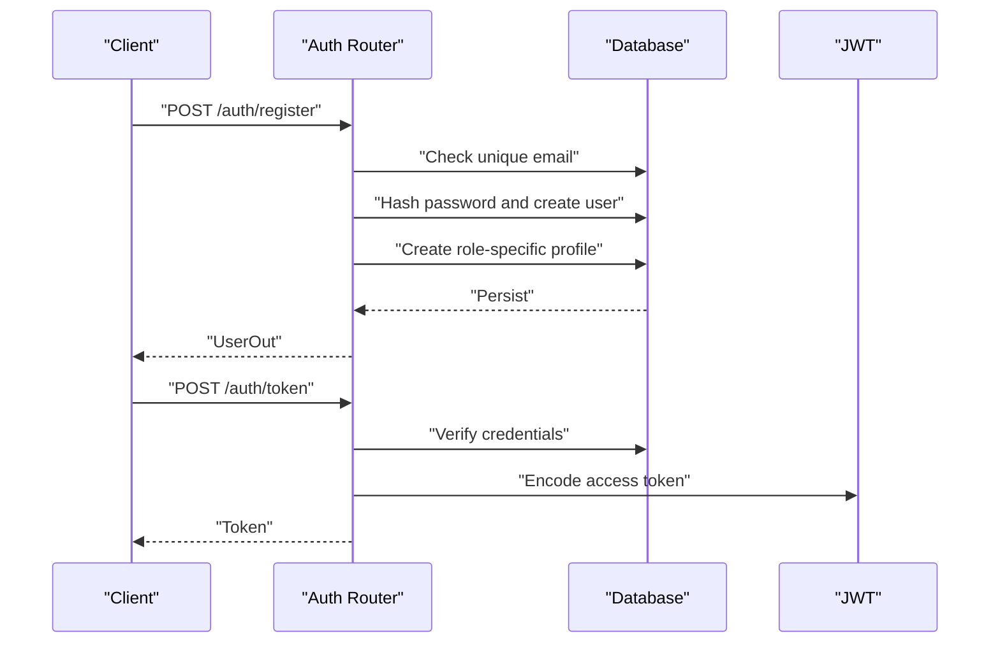

**Diagram sources**
- [backend/auth.py](file://backend/auth.py#L60-L120)
- [backend/models.py](file://backend/models.py#L6-L47)

**Section sources**
- [backend/auth.py](file://backend/auth.py#L60-L120)

### Patient Profile and Health Records
- Patients can retrieve/update their profile and view/create health records.
- Access control ensures only authorized roles can access endpoints.
- Health records support selective sharing with doctors.

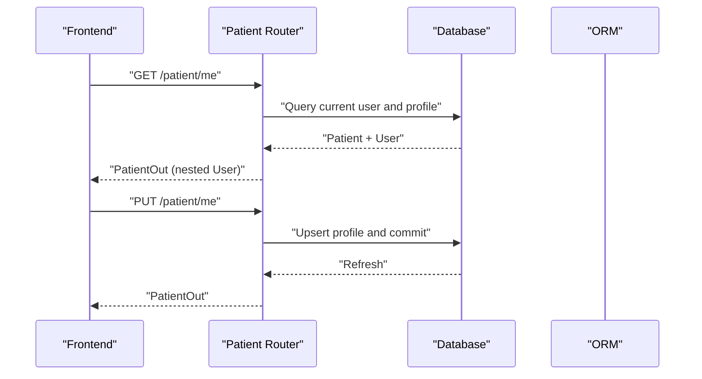

**Diagram sources**
- [backend/routers/patient.py](file://backend/routers/patient.py#L11-L52)
- [backend/models.py](file://backend/models.py#L20-L32)

**Section sources**
- [backend/routers/patient.py](file://backend/routers/patient.py#L11-L107)

### Appointment Management
- Patients book appointments with a doctor and date/time.
- Appointments are returned with nested patient/doctor details.
- Status updates are role-restricted (doctor updates status/diagnosis; patient cancels).

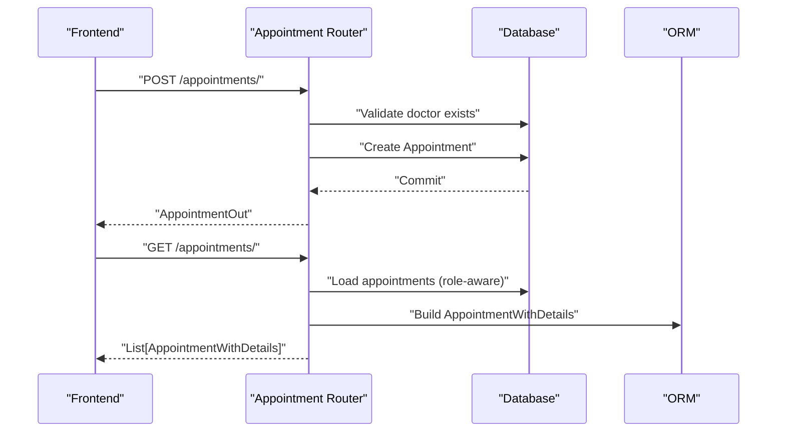

**Diagram sources**
- [backend/routers/appointment.py](file://backend/routers/appointment.py#L12-L92)
- [backend/models.py](file://backend/models.py#L49-L62)

**Section sources**
- [backend/routers/appointment.py](file://backend/routers/appointment.py#L12-L129)

### Prescription Workflow
- Doctors create prescriptions with parsed start/end dates and frequency.
- Patients can view their own prescriptions and active ones.
- Access control ensures only authorized users can view specific records.

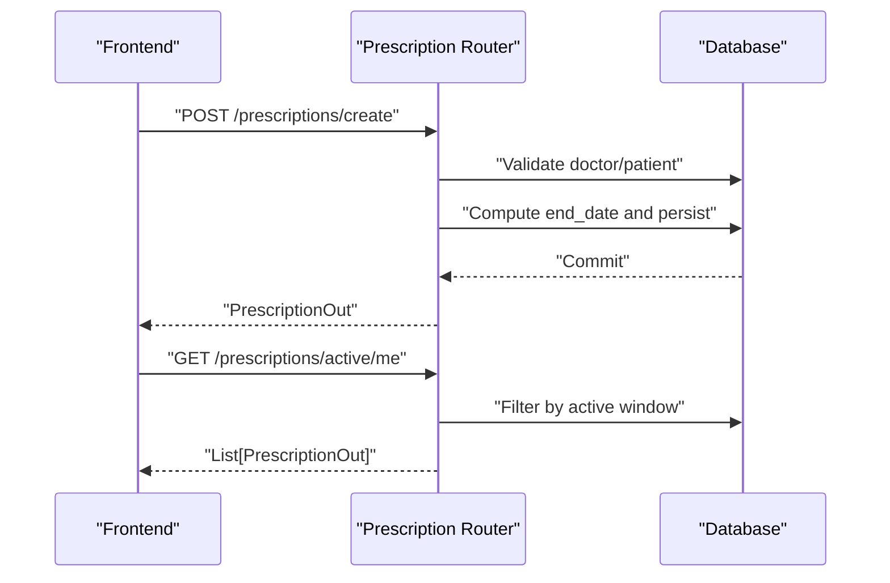

**Diagram sources**
- [backend/routers/prescription.py](file://backend/routers/prescription.py#L12-L150)
- [backend/models.py](file://backend/models.py#L91-L110)

**Section sources**
- [backend/routers/prescription.py](file://backend/routers/prescription.py#L12-L150)

### AI Symptom Analysis Pipeline
- The AI endpoint accepts a structured request and applies rule-based logic to detect symptoms, predict diseases, suggest medicines, and generate recommendations.
- Responses are strongly typed via Pydantic models.

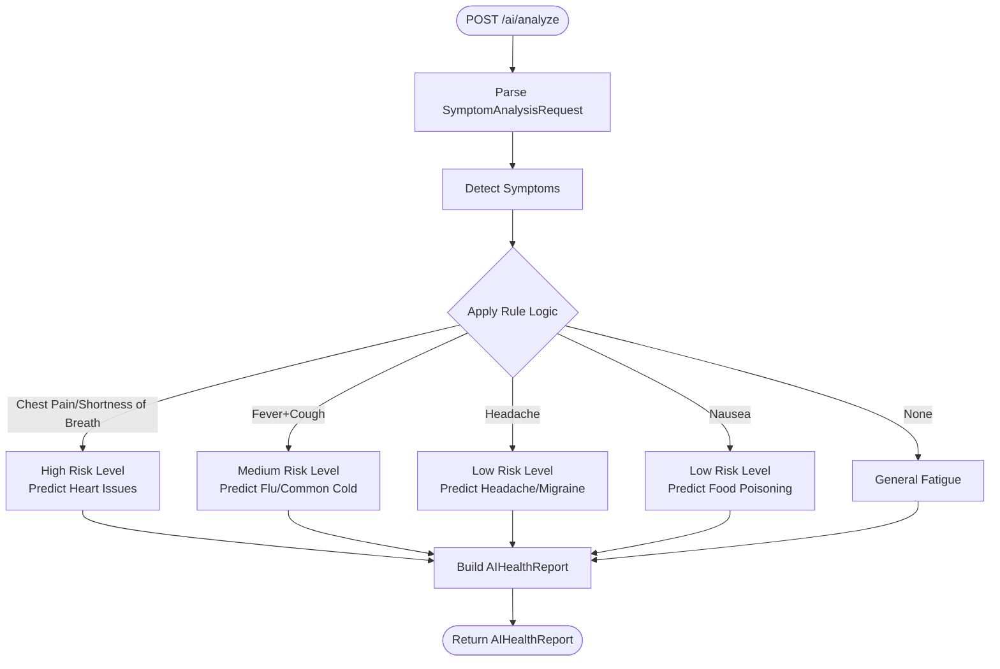

**Diagram sources**
- [backend/routers/ai.py](file://backend/routers/ai.py#L10-L90)
- [backend/schemas.py](file://backend/schemas.py#L140-L162)

**Section sources**
- [backend/routers/ai.py](file://backend/routers/ai.py#L10-L90)
- [backend/schemas.py](file://backend/schemas.py#L140-L162)

### Notification System Data Flow
- Users can list, filter, and manage notifications; stats expose unread counts and upcoming reminders.
- Background scheduler creates reminders for prescriptions and appointments at configured intervals.
- Pending notifications are sent via email service and statuses updated accordingly.
- Frontend polls notification stats and renders unread indicators.

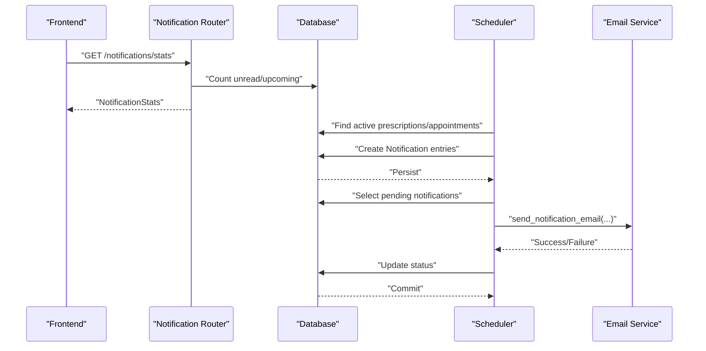

**Diagram sources**
- [backend/routers/notification.py](file://backend/routers/notification.py#L13-L123)
- [backend/scheduler.py](file://backend/scheduler.py#L51-L233)
- [backend/email_service.py](file://backend/email_service.py#L141-L161)
- [frontend/src/services/notificationService.js](file://frontend/src/services/notificationService.js#L31-L43)
- [frontend/src/components/NotificationBell.jsx](file://frontend/src/components/NotificationBell.jsx#L11-L30)

**Section sources**
- [backend/routers/notification.py](file://backend/routers/notification.py#L13-L177)
- [backend/scheduler.py](file://backend/scheduler.py#L51-L233)
- [backend/email_service.py](file://backend/email_service.py#L141-L161)
- [frontend/src/services/notificationService.js](file://frontend/src/services/notificationService.js#L1-L117)
- [frontend/src/components/NotificationBell.jsx](file://frontend/src/components/NotificationBell.jsx#L1-L64)

### Database Transactions, Relationships, and Consistency
- Sessions are opened per-request and closed in a finally block to ensure cleanup.
- Commit/refresh patterns ensure data visibility and consistency after mutations.
- Relationships enable eager loading of related entities (e.g., user, patient, doctor).
- Foreign keys maintain referential integrity across entities.

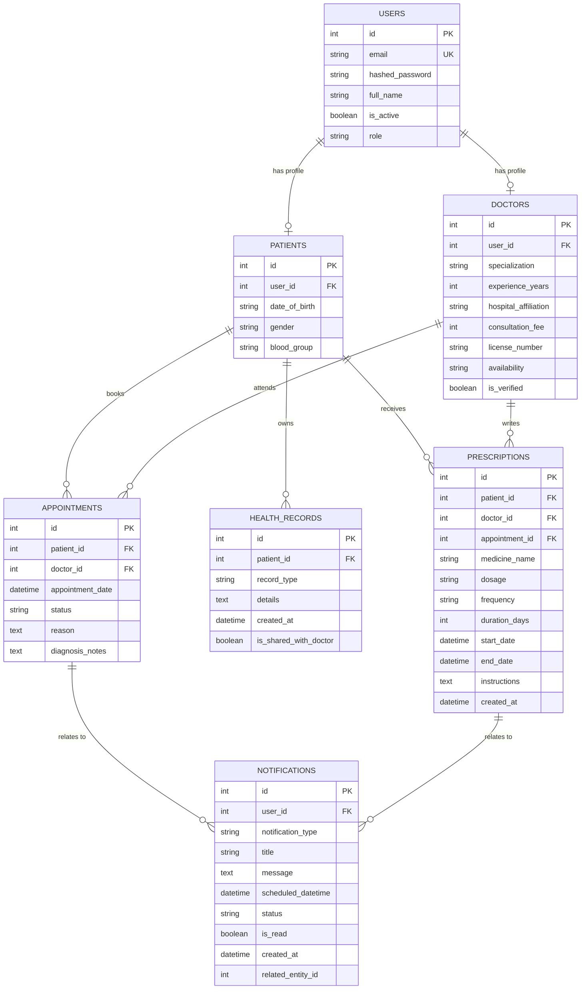

**Diagram sources**
- [backend/models.py](file://backend/models.py#L6-L110)

**Section sources**
- [backend/database.py](file://backend/database.py#L16-L21)
- [backend/models.py](file://backend/models.py#L6-L110)

### Data Transformation Patterns with Pydantic
- Request schemas (e.g., UserCreate, PatientUpdate, AppointmentCreate) validate incoming payloads.
- Response schemas (e.g., PatientOut, AppointmentOut, AIHealthReport) serialize domain objects.
- Nested schemas (e.g., AppointmentWithDetails, PatientInfo, DoctorInfo) flatten related entities for richer responses.

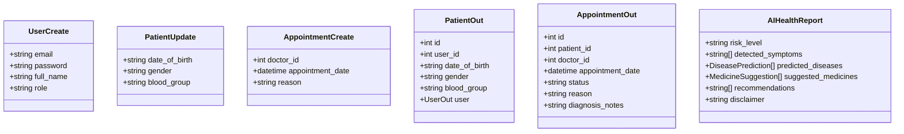

**Diagram sources**
- [backend/schemas.py](file://backend/schemas.py#L6-L236)

**Section sources**
- [backend/schemas.py](file://backend/schemas.py#L6-L236)

### Caching and Synchronization Strategies
- Frontend polls notification stats every 30 seconds to synchronize unread counts.
- Local storage stores the Bearer token for subsequent requests.
- No explicit in-memory cache is implemented in the backend; database queries are executed per request.

Recommendations:
- Introduce Redis or in-memory cache for frequently accessed stats and reduce DB load.
- Add ETags/Last-Modified headers for GET endpoints to enable client-side caching.
- Use server-sent events (SSE) or WebSockets for real-time updates instead of polling.

**Section sources**
- [frontend/src/components/NotificationBell.jsx](file://frontend/src/components/NotificationBell.jsx#L23-L30)
- [frontend/src/services/api.js](file://frontend/src/services/api.js#L10-L22)

### Performance Monitoring Approaches
- Application logs are written to a file with timestamps and levels.
- Scheduler logs indicate job execution and errors.
- Email service logs successes/failures.

Recommendations:
- Add structured logging with correlation IDs.
- Instrument routers with timing metrics (request duration, DB time).
- Monitor scheduler job latencies and failures.

**Section sources**
- [backend/main.py](file://backend/main.py#L6-L11)
- [backend/scheduler.py](file://backend/scheduler.py#L7-L8)
- [backend/email_service.py](file://backend/email_service.py#L11-L12)

## Dependency Analysis
The backend composes multiple modules with clear boundaries:
- FastAPI app depends on routers and scheduler lifecycle hooks.
- Routers depend on models, database sessions, schemas, and auth.
- Scheduler depends on database and email service.
- Frontend services depend on the backend API and local storage.

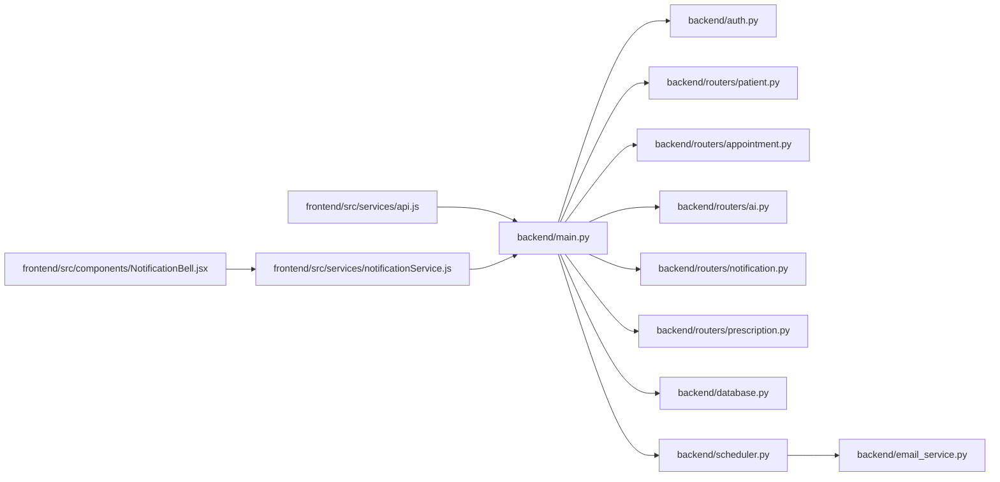

**Diagram sources**
- [backend/main.py](file://backend/main.py#L34-L44)
- [backend/routers/*.py](file://backend/routers/patient.py#L1-L107)
- [backend/database.py](file://backend/database.py#L1-L22)
- [backend/scheduler.py](file://backend/scheduler.py#L1-L317)
- [backend/email_service.py](file://backend/email_service.py#L1-L161)
- [frontend/src/services/*.js](file://frontend/src/services/api.js#L1-L25)

**Section sources**
- [backend/main.py](file://backend/main.py#L34-L44)

## Performance Considerations
- Database Queries: Use filtered queries with appropriate indexes (e.g., user_id, scheduled_datetime, status). Consider pagination and limits for lists.
- Background Jobs: Schedule intervals should balance freshness and overhead; adjust cron/interval frequencies based on traffic.
- Serialization: Prefer returning only required fields in response schemas to minimize payload sizes.
- Network: Frontend polling can be optimized with SSE/WebSockets for real-time updates.

[No sources needed since this section provides general guidance]

## Troubleshooting Guide
- Authentication Failures: Ensure the Authorization header is present and the token is unexpired; verify JWT decoding and user lookup.
- Permission Denied: Role-based endpoints enforce access control; confirm current user role and ownership checks.
- Database Errors: Session lifecycle and rollback patterns prevent inconsistent states; inspect logs for exceptions during commit/refresh.
- Scheduler Issues: Verify scheduler startup/shutdown hooks and job configurations; check logs for job execution errors.
- Email Delivery: Confirm environment variables for SMTP; review email service logs for failures.

**Section sources**
- [backend/auth.py](file://backend/auth.py#L39-L55)
- [backend/routers/patient.py](file://backend/routers/patient.py#L16-L21)
- [backend/routers/appointment.py](file://backend/routers/appointment.py#L108-L124)
- [backend/database.py](file://backend/database.py#L16-L21)
- [backend/scheduler.py](file://backend/scheduler.py#L259-L317)
- [backend/email_service.py](file://backend/email_service.py#L109-L138)

## Conclusion
SmartHealthCare implements a clean separation of concerns with FastAPI, SQLAlchemy, and Pydantic. The request-response cycle is validated and transformed using Pydantic models, while background tasks automate reminders and email delivery. Access control and relationships ensure data integrity. Enhancements in caching, real-time updates, and observability would further improve user experience and operational reliability.

[No sources needed since this section summarizes without analyzing specific files]

## Appendices

### Endpoint Catalog (Selected)
- Authentication
  - POST /auth/register → UserOut
  - POST /auth/token → Token
- Patient
  - GET /patient/me → PatientOut
  - PUT /patient/me → PatientOut
  - GET /patient/records → List[HealthRecordOut]
  - GET /patient/{patient_id}/records → List[HealthRecordOut]
  - POST /patient/records → HealthRecordOut
- Appointment
  - POST /appointments/ → AppointmentOut
  - GET /appointments/ → List[AppointmentWithDetails]
  - PUT /appointments/{id} → AppointmentOut
- AI
  - POST /ai/analyze → AIHealthReport
- Notification
  - GET /notifications/me → List[NotificationOut]
  - GET /notifications/stats → NotificationStats
  - GET /notifications/upcoming → List[NotificationOut]
  - PATCH /notifications/{id}/read → NotificationOut
  - PATCH /notifications/mark-all-read → { message }
  - DELETE /notifications/{id} → { message }
  - POST /notifications/create → NotificationOut
- Prescription
  - POST /prescriptions/create → PrescriptionOut
  - GET /prescriptions/me → List[PrescriptionOut]
  - GET /prescriptions/patient/{id} → List[PrescriptionOut]
  - GET /prescriptions/{id} → PrescriptionOut
  - GET /prescriptions/active/me → List[PrescriptionOut]

**Section sources**
- [backend/routers/auth.py](file://backend/routers/auth.py#L60-L120)
- [backend/routers/patient.py](file://backend/routers/patient.py#L11-L107)
- [backend/routers/appointment.py](file://backend/routers/appointment.py#L12-L129)
- [backend/routers/ai.py](file://backend/routers/ai.py#L10-L90)
- [backend/routers/notification.py](file://backend/routers/notification.py#L13-L177)
- [backend/routers/prescription.py](file://backend/routers/prescription.py#L12-L150)