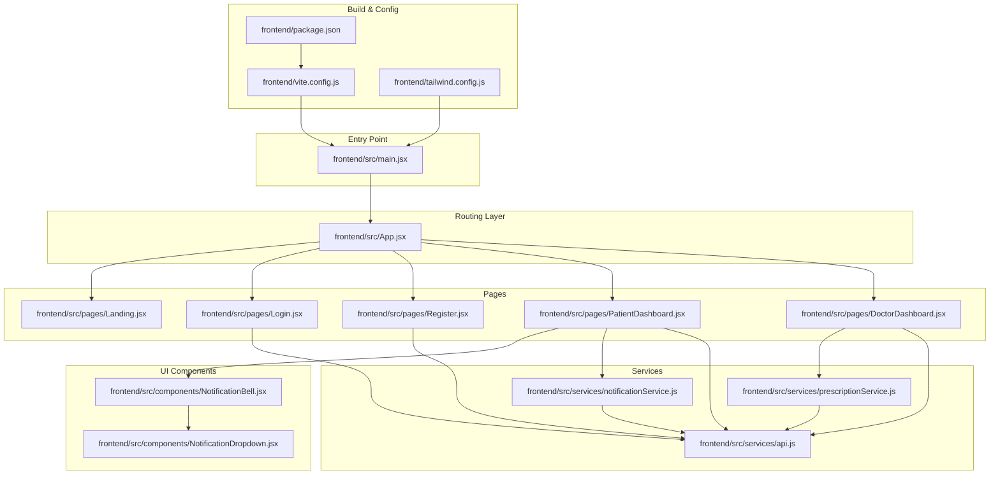
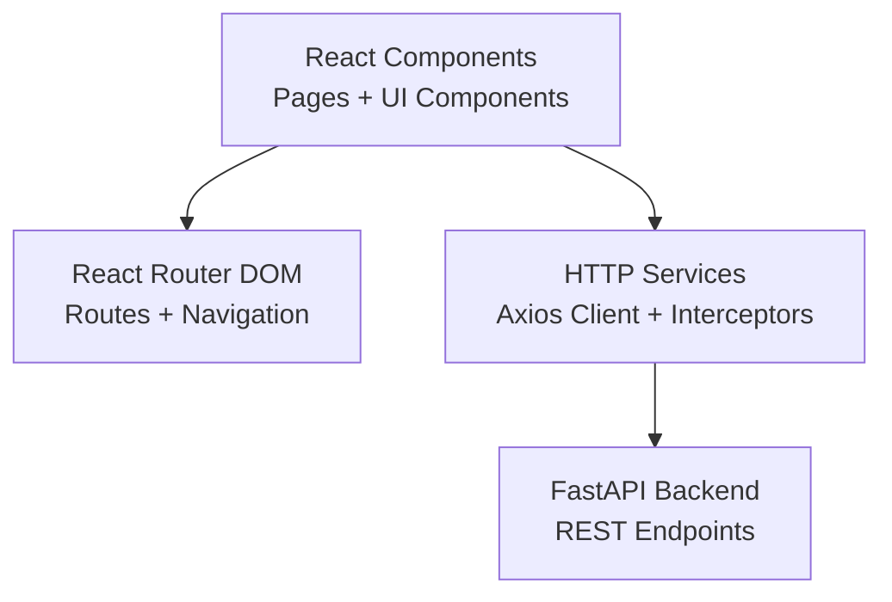
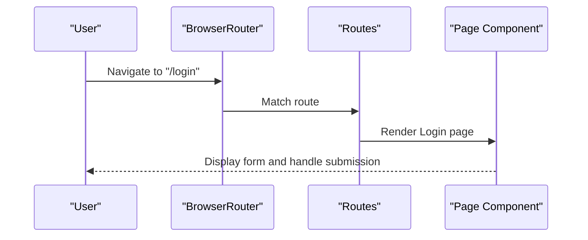
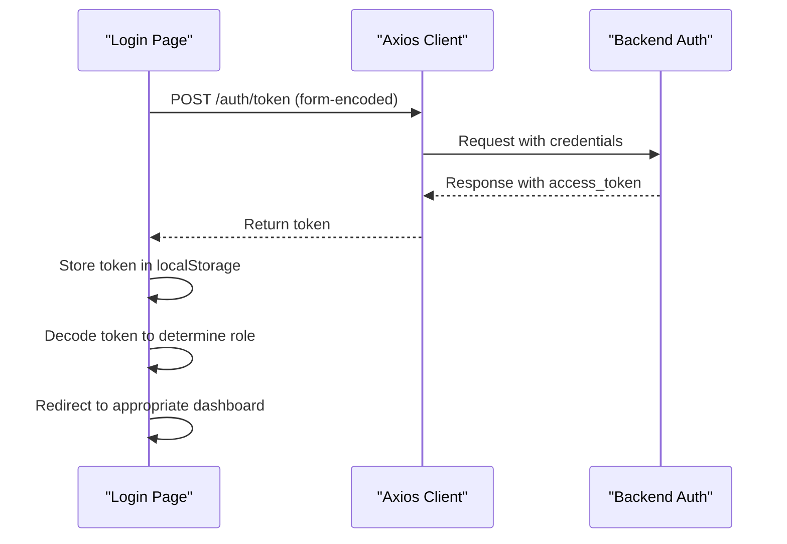
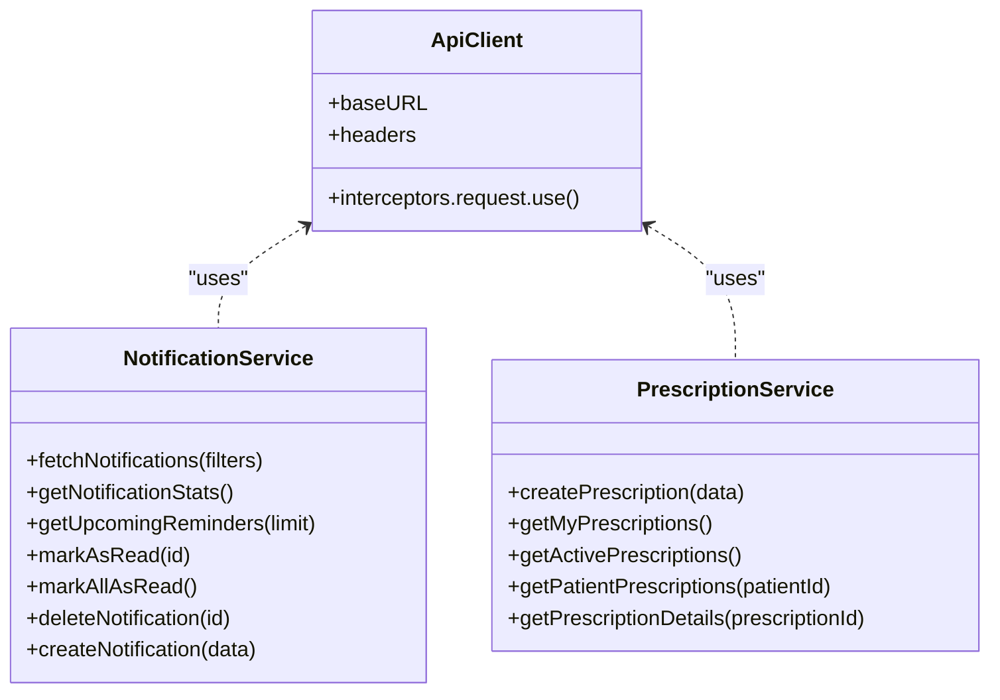
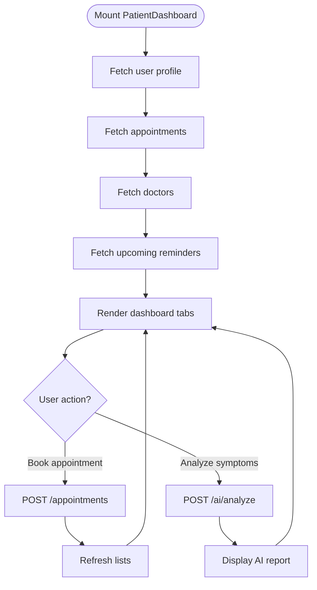
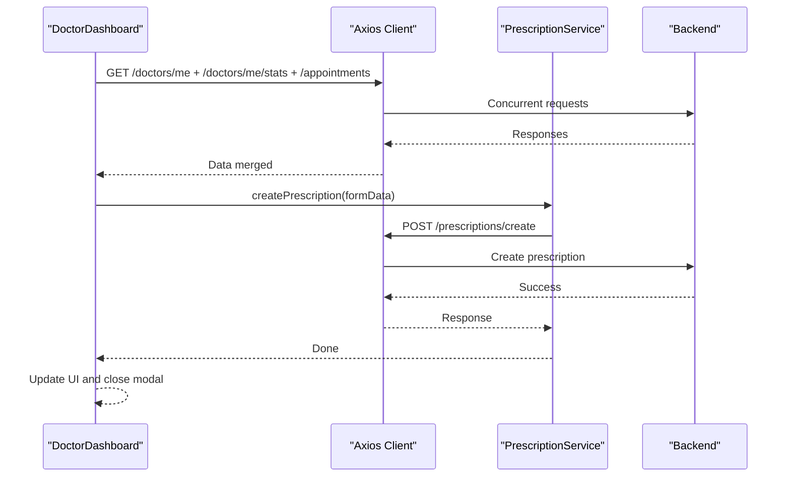
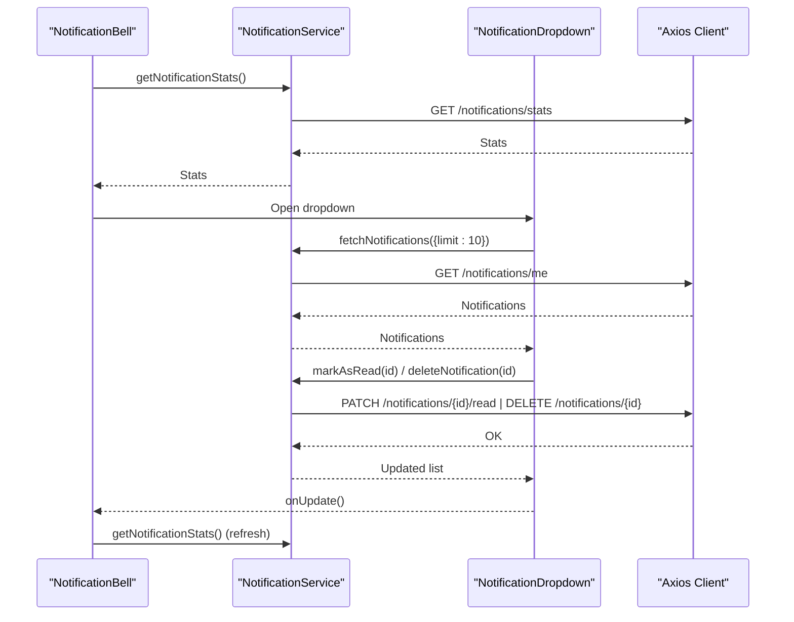
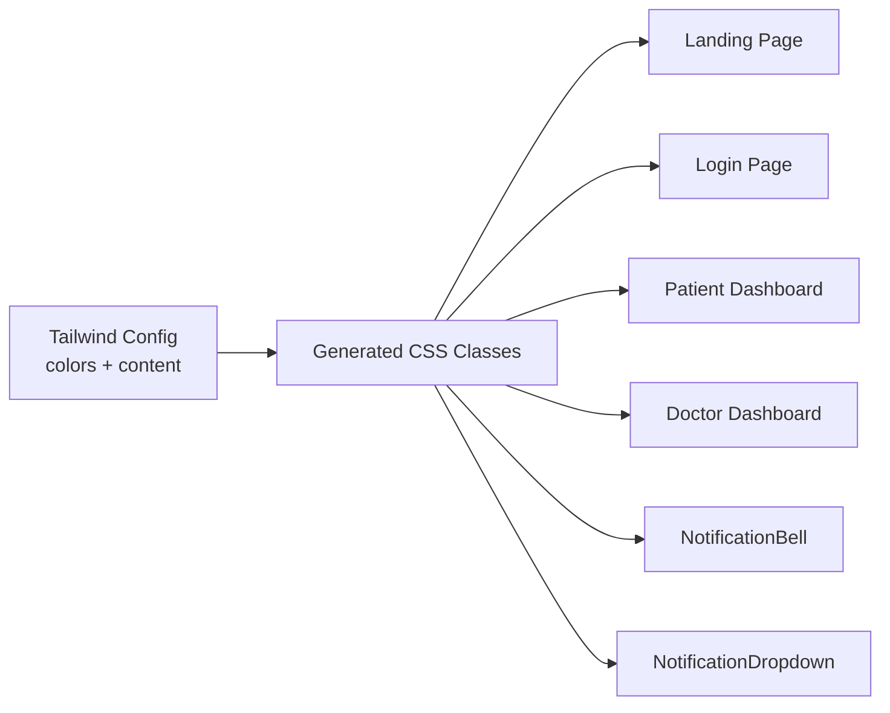
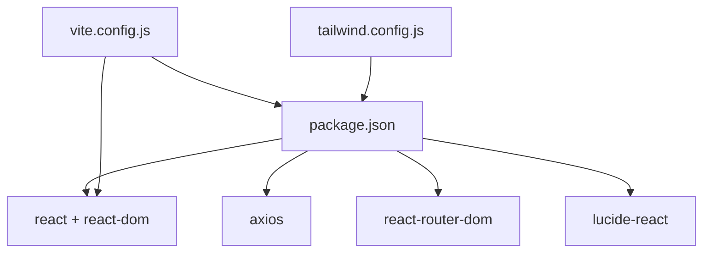

# Frontend Architecture

<cite>
**Referenced Files in This Document**
- [main.jsx](file://frontend/src/main.jsx)
- [App.jsx](file://frontend/src/App.jsx)
- [Landing.jsx](file://frontend/src/pages/Landing.jsx)
- [Login.jsx](file://frontend/src/pages/Login.jsx)
- [Register.jsx](file://frontend/src/pages/Register.jsx)
- [PatientDashboard.jsx](file://frontend/src/pages/PatientDashboard.jsx)
- [DoctorDashboard.jsx](file://frontend/src/pages/DoctorDashboard.jsx)
- [NotificationBell.jsx](file://frontend/src/components/NotificationBell.jsx)
- [NotificationDropdown.jsx](file://frontend/src/components/NotificationDropdown.jsx)
- [api.js](file://frontend/src/services/api.js)
- [notificationService.js](file://frontend/src/services/notificationService.js)
- [prescriptionService.js](file://frontend/src/services/prescriptionService.js)
- [vite.config.js](file://frontend/vite.config.js)
- [package.json](file://frontend/package.json)
- [tailwind.config.js](file://frontend/tailwind.config.js)
</cite>

## Table of Contents
1. [Introduction](#introduction)
2. [Project Structure](#project-structure)
3. [Core Components](#core-components)
4. [Architecture Overview](#architecture-overview)
5. [Detailed Component Analysis](#detailed-component-analysis)
6. [Dependency Analysis](#dependency-analysis)
7. [Performance Considerations](#performance-considerations)
8. [Troubleshooting Guide](#troubleshooting-guide)
9. [Conclusion](#conclusion)

## Introduction
This document describes the frontend architecture of the SmartHealthCare React application. It covers the Single Page Application (SPA) structure built with React Router DOM, component hierarchy, state management patterns, Vite build configuration, asset management, development workflow, routing architecture, navigation patterns, page transitions, component composition strategy, reusable UI components, styling approach using Tailwind CSS, API service layer architecture, HTTP client configuration with Axios, error handling patterns, application entry point, provider patterns for global state, integration with backend APIs, performance optimization techniques, lazy loading strategies, and responsive design implementation.

## Project Structure
The frontend is organized as a classic React SPA with feature-based grouping under src. Pages represent routeable screens, services encapsulate HTTP clients and domain-specific API logic, and components are reusable UI building blocks. Public assets are served statically, while Tailwind CSS drives styling.

**Diagram sources**
- [main.jsx](file://frontend/src/main.jsx#L1-L11)
- [App.jsx](file://frontend/src/App.jsx#L1-L28)
- [Landing.jsx](file://frontend/src/pages/Landing.jsx#L1-L104)
- [Login.jsx](file://frontend/src/pages/Login.jsx#L1-L104)
- [Register.jsx](file://frontend/src/pages/Register.jsx#L1-L124)
- [PatientDashboard.jsx](file://frontend/src/pages/PatientDashboard.jsx#L1-L674)
- [DoctorDashboard.jsx](file://frontend/src/pages/DoctorDashboard.jsx#L1-L698)
- [NotificationBell.jsx](file://frontend/src/components/NotificationBell.jsx#L1-L64)
- [NotificationDropdown.jsx](file://frontend/src/components/NotificationDropdown.jsx#L1-L182)
- [api.js](file://frontend/src/services/api.js#L1-L25)
- [notificationService.js](file://frontend/src/services/notificationService.js#L1-L117)
- [prescriptionService.js](file://frontend/src/services/prescriptionService.js#L1-L81)
- [vite.config.js](file://frontend/vite.config.js#L1-L8)
- [package.json](file://frontend/package.json#L1-L35)
- [tailwind.config.js](file://frontend/tailwind.config.js#L1-L20)

**Section sources**
- [main.jsx](file://frontend/src/main.jsx#L1-L11)
- [App.jsx](file://frontend/src/App.jsx#L1-L28)
- [vite.config.js](file://frontend/vite.config.js#L1-L8)
- [package.json](file://frontend/package.json#L1-L35)
- [tailwind.config.js](file://frontend/tailwind.config.js#L1-L20)

## Core Components
- Application entry point initializes React and mounts the root App component.
- Routing layer defines public and role-specific routes with fallback 404 handling.
- Pages implement role-specific dashboards and authentication flows.
- Services encapsulate HTTP client configuration and domain-specific API calls.
- Reusable UI components provide notification bell and dropdown with polling and CRUD-like actions.

Key implementation references:
- Entry point mounting: [main.jsx](file://frontend/src/main.jsx#L6-L10)
- Routing and layout: [App.jsx](file://frontend/src/App.jsx#L9-L25)
- Authentication forms: [Login.jsx](file://frontend/src/pages/Login.jsx#L6-L47), [Register.jsx](file://frontend/src/pages/Register.jsx#L6-L32)
- Patient dashboard: [PatientDashboard.jsx](file://frontend/src/pages/PatientDashboard.jsx#L11-L636)
- Doctor dashboard: [DoctorDashboard.jsx](file://frontend/src/pages/DoctorDashboard.jsx#L10-L418)
- Notification bell: [NotificationBell.jsx](file://frontend/src/components/NotificationBell.jsx#L6-L61)
- Notification dropdown: [NotificationDropdown.jsx](file://frontend/src/components/NotificationDropdown.jsx#L5-L179)
- HTTP client base: [api.js](file://frontend/src/services/api.js#L3-L8)
- Notification service: [notificationService.js](file://frontend/src/services/notificationService.js#L12-L116)
- Prescription service: [prescriptionService.js](file://frontend/src/services/prescriptionService.js#L12-L80)

**Section sources**
- [main.jsx](file://frontend/src/main.jsx#L1-L11)
- [App.jsx](file://frontend/src/App.jsx#L1-L28)
- [Login.jsx](file://frontend/src/pages/Login.jsx#L1-L104)
- [Register.jsx](file://frontend/src/pages/Register.jsx#L1-L124)
- [PatientDashboard.jsx](file://frontend/src/pages/PatientDashboard.jsx#L1-L674)
- [DoctorDashboard.jsx](file://frontend/src/pages/DoctorDashboard.jsx#L1-L698)
- [NotificationBell.jsx](file://frontend/src/components/NotificationBell.jsx#L1-L64)
- [NotificationDropdown.jsx](file://frontend/src/components/NotificationDropdown.jsx#L1-L182)
- [api.js](file://frontend/src/services/api.js#L1-L25)
- [notificationService.js](file://frontend/src/services/notificationService.js#L1-L117)
- [prescriptionService.js](file://frontend/src/services/prescriptionService.js#L1-L81)

## Architecture Overview
The frontend follows a layered architecture:
- Presentation layer: React components and pages.
- Routing layer: React Router DOM managing routes and navigation.
- Service layer: Axios-based HTTP client with interceptors and domain-specific service modules.
- State management: React hooks for local component state; no global state provider is present in the current codebase.
- Styling: Tailwind CSS configured for design tokens and responsive layouts.

**Diagram sources**
- [App.jsx](file://frontend/src/App.jsx#L1-L28)
- [api.js](file://frontend/src/services/api.js#L1-L25)
- [notificationService.js](file://frontend/src/services/notificationService.js#L1-L117)
- [prescriptionService.js](file://frontend/src/services/prescriptionService.js#L1-L81)

## Detailed Component Analysis

### Routing and Navigation
- BrowserRouter wraps the application and Routes define public and role-specific paths.
- Navigation patterns use Link for internal navigation and programmatic navigation via useNavigate.
- Page transitions are handled by React Router without explicit transition animations.

**Diagram sources**
- [App.jsx](file://frontend/src/App.jsx#L13-L21)
- [Login.jsx](file://frontend/src/pages/Login.jsx#L13-L47)

**Section sources**
- [App.jsx](file://frontend/src/App.jsx#L1-L28)
- [Login.jsx](file://frontend/src/pages/Login.jsx#L1-L104)
- [Register.jsx](file://frontend/src/pages/Register.jsx#L1-L124)

### Authentication Flow
- Login posts credentials to the backend and stores the JWT token in localStorage.
- Token is automatically attached to subsequent requests via an Axios request interceptor.
- Role decoding determines redirect to patient or doctor dashboard.

**Diagram sources**
- [Login.jsx](file://frontend/src/pages/Login.jsx#L13-L47)
- [api.js](file://frontend/src/services/api.js#L11-L22)

**Section sources**
- [Login.jsx](file://frontend/src/pages/Login.jsx#L1-L104)
- [api.js](file://frontend/src/services/api.js#L1-L25)

### API Service Layer Architecture
- Centralized Axios instance with baseURL and shared headers.
- Request interceptor injects Authorization header from localStorage.
- Domain-specific services encapsulate endpoint calls and expose typed functions.

**Diagram sources**
- [api.js](file://frontend/src/services/api.js#L3-L8)
- [notificationService.js](file://frontend/src/services/notificationService.js#L12-L116)
- [prescriptionService.js](file://frontend/src/services/prescriptionService.js#L12-L80)

**Section sources**
- [api.js](file://frontend/src/services/api.js#L1-L25)
- [notificationService.js](file://frontend/src/services/notificationService.js#L1-L117)
- [prescriptionService.js](file://frontend/src/services/prescriptionService.js#L1-L81)

### Patient Dashboard
- Implements a tabbed interface with overview, symptoms (AI analysis), appointments, and records.
- Integrates with notification service for upcoming reminders and with API for profile/appointments.
- Uses reusable UI components for cards, sidebar items, and modals.

**Diagram sources**
- [PatientDashboard.jsx](file://frontend/src/pages/PatientDashboard.jsx#L35-L114)
- [notificationService.js](file://frontend/src/services/notificationService.js#L46-L57)
- [api.js](file://frontend/src/services/api.js#L1-L25)

**Section sources**
- [PatientDashboard.jsx](file://frontend/src/pages/PatientDashboard.jsx#L1-L674)
- [NotificationBell.jsx](file://frontend/src/components/NotificationBell.jsx#L1-L64)
- [NotificationDropdown.jsx](file://frontend/src/components/NotificationDropdown.jsx#L1-L182)

### Doctor Dashboard
- Loads profile, stats, and appointments concurrently.
- Provides appointment status updates, diagnosis notes, and prescription creation.
- Includes a modal-driven workflow for writing prescriptions.

**Diagram sources**
- [DoctorDashboard.jsx](file://frontend/src/pages/DoctorDashboard.jsx#L34-L63)
- [prescriptionService.js](file://frontend/src/services/prescriptionService.js#L12-L24)
- [api.js](file://frontend/src/services/api.js#L1-L25)

**Section sources**
- [DoctorDashboard.jsx](file://frontend/src/pages/DoctorDashboard.jsx#L1-L698)
- [prescriptionService.js](file://frontend/src/services/prescriptionService.js#L1-L81)

### Notification System
- NotificationBell fetches unread counts and polls periodically.
- NotificationDropdown lists recent notifications, supports mark-as-read and delete, and auto-refreshes counts.

**Diagram sources**
- [NotificationBell.jsx](file://frontend/src/components/NotificationBell.jsx#L11-L39)
- [NotificationDropdown.jsx](file://frontend/src/components/NotificationDropdown.jsx#L24-L56)
- [notificationService.js](file://frontend/src/services/notificationService.js#L12-L101)
- [api.js](file://frontend/src/services/api.js#L1-L25)

**Section sources**
- [NotificationBell.jsx](file://frontend/src/components/NotificationBell.jsx#L1-L64)
- [NotificationDropdown.jsx](file://frontend/src/components/NotificationDropdown.jsx#L1-L182)
- [notificationService.js](file://frontend/src/services/notificationService.js#L1-L117)

### Styling and Responsive Design
- Tailwind CSS is configured with custom color tokens and content paths scanning.
- Components extensively use Tailwind utilities for responsive grids, spacing, shadows, and interactive states.
- Background images and gradients are applied via inline styles on hero and feature sections.

**Diagram sources**
- [tailwind.config.js](file://frontend/tailwind.config.js#L1-L20)
- [Landing.jsx](file://frontend/src/pages/Landing.jsx#L20-L91)
- [Login.jsx](file://frontend/src/pages/Login.jsx#L50-L101)
- [PatientDashboard.jsx](file://frontend/src/pages/PatientDashboard.jsx#L124-L569)
- [DoctorDashboard.jsx](file://frontend/src/pages/DoctorDashboard.jsx#L175-L418)
- [NotificationBell.jsx](file://frontend/src/components/NotificationBell.jsx#L42-L60)
- [NotificationDropdown.jsx](file://frontend/src/components/NotificationDropdown.jsx#L89-L177)

**Section sources**
- [tailwind.config.js](file://frontend/tailwind.config.js#L1-L20)
- [Landing.jsx](file://frontend/src/pages/Landing.jsx#L1-L104)
- [Login.jsx](file://frontend/src/pages/Login.jsx#L1-L104)
- [PatientDashboard.jsx](file://frontend/src/pages/PatientDashboard.jsx#L1-L674)
- [DoctorDashboard.jsx](file://frontend/src/pages/DoctorDashboard.jsx#L1-L698)
- [NotificationBell.jsx](file://frontend/src/components/NotificationBell.jsx#L1-L64)
- [NotificationDropdown.jsx](file://frontend/src/components/NotificationDropdown.jsx#L1-L182)

## Dependency Analysis
- Runtime dependencies include React, React DOM, React Router DOM, Axios, and Lucide icons.
- Build-time dependencies include Vite, React plugin, PostCSS, Autoprefixer, Tailwind, ESLint, and TypeScript types.
- The HTTP client depends on environment-provided backend URL and localStorage for tokens.

**Diagram sources**
- [package.json](file://frontend/package.json#L12-L32)
- [vite.config.js](file://frontend/vite.config.js#L1-L8)
- [tailwind.config.js](file://frontend/tailwind.config.js#L1-L20)

**Section sources**
- [package.json](file://frontend/package.json#L1-L35)
- [vite.config.js](file://frontend/vite.config.js#L1-L8)
- [tailwind.config.js](file://frontend/tailwind.config.js#L1-L20)

## Performance Considerations
- Current implementation does not include explicit code splitting or lazy loading. Consider dynamic imports for heavy pages to improve initial load performance.
- The notification polling interval is fixed at 30 seconds; consider adaptive intervals or debounced refresh to reduce unnecessary network calls.
- Image assets are referenced via static paths; ensure proper compression and consider responsive image strategies for optimal loading on mobile devices.
- Tailwind purge configuration targets JSX/TSX files; ensure all template paths are included to avoid unused CSS removal issues.

[No sources needed since this section provides general guidance]

## Troubleshooting Guide
- Authentication failures: Verify token presence in localStorage and ensure the request interceptor attaches Authorization headers. Check backend token endpoint and CORS configuration.
- Network errors: Inspect service functions for try/catch blocks and ensure error messages are surfaced to users. Validate baseURL and endpoint correctness.
- UI state inconsistencies: Confirm useEffect dependencies and ensure state updates are atomic. For concurrent fetches, consider abort controllers to prevent race conditions.
- Styling issues: Validate Tailwind content paths and ensure class names match generated variants. Check for conflicting styles and utility overrides.

**Section sources**
- [api.js](file://frontend/src/services/api.js#L11-L22)
- [Login.jsx](file://frontend/src/pages/Login.jsx#L41-L47)
- [DoctorDashboard.jsx](file://frontend/src/pages/DoctorDashboard.jsx#L55-L63)
- [NotificationBell.jsx](file://frontend/src/components/NotificationBell.jsx#L11-L30)
- [NotificationDropdown.jsx](file://frontend/src/components/NotificationDropdown.jsx#L24-L56)

## Conclusion
The SmartHealthCare frontend is a well-structured React SPA with clear separation of concerns. Routing, services, and UI components are modular and maintainable. The Axios-based service layer centralizes HTTP concerns and integrates seamlessly with React Router. Tailwind CSS enables rapid UI iteration with consistent design tokens. To further enhance the application, consider implementing lazy loading, optimizing polling strategies, and introducing a global state provider for cross-component coordination.