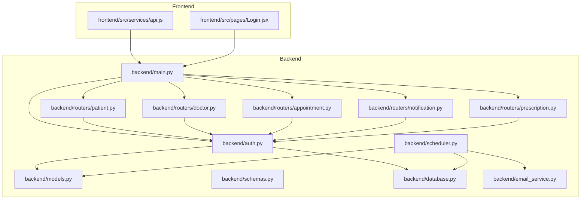
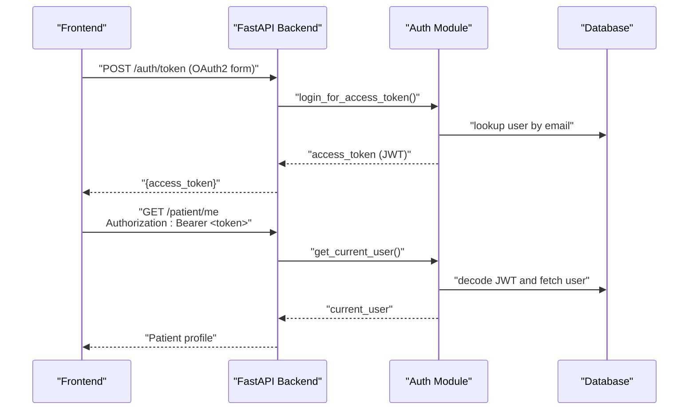
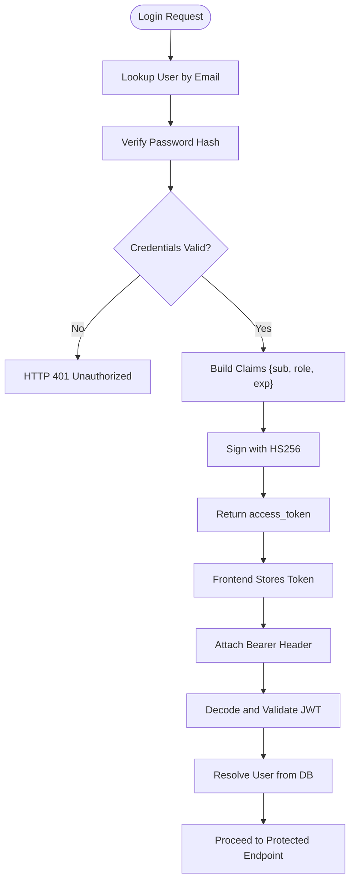
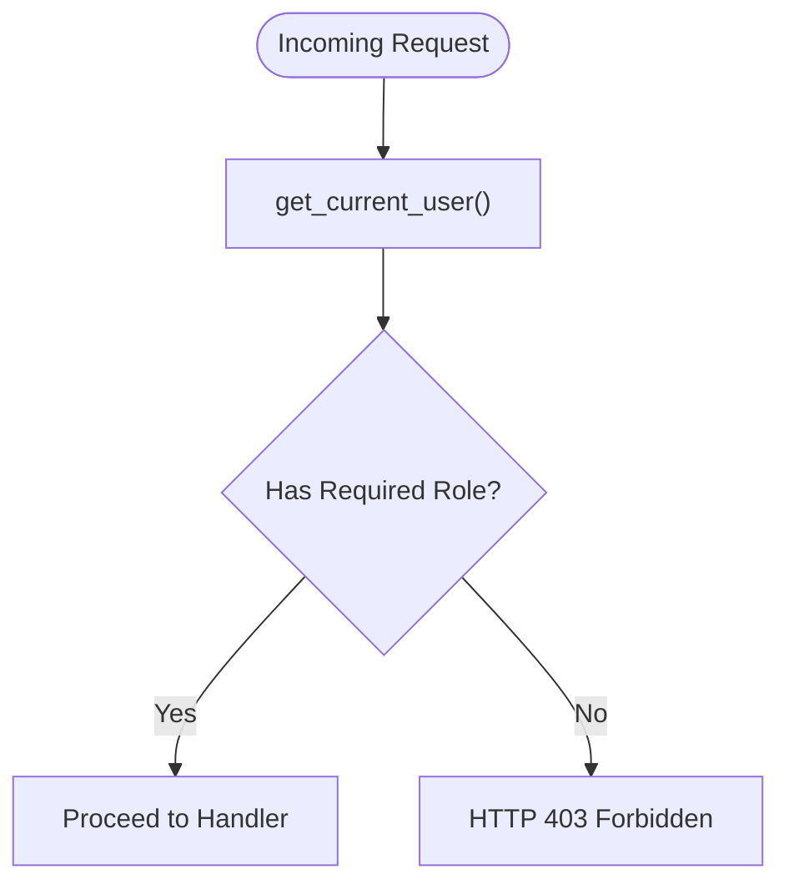
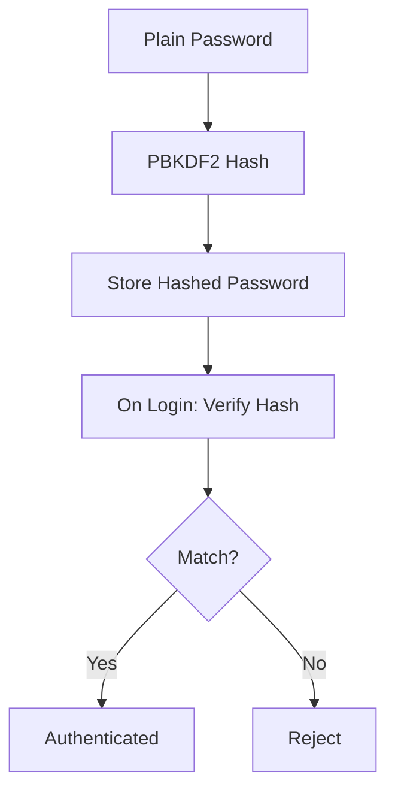
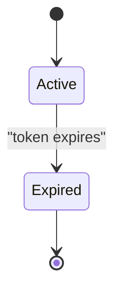
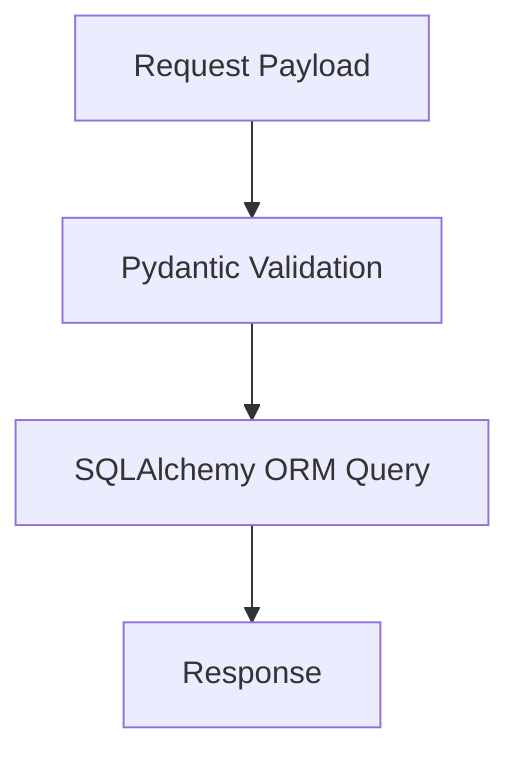
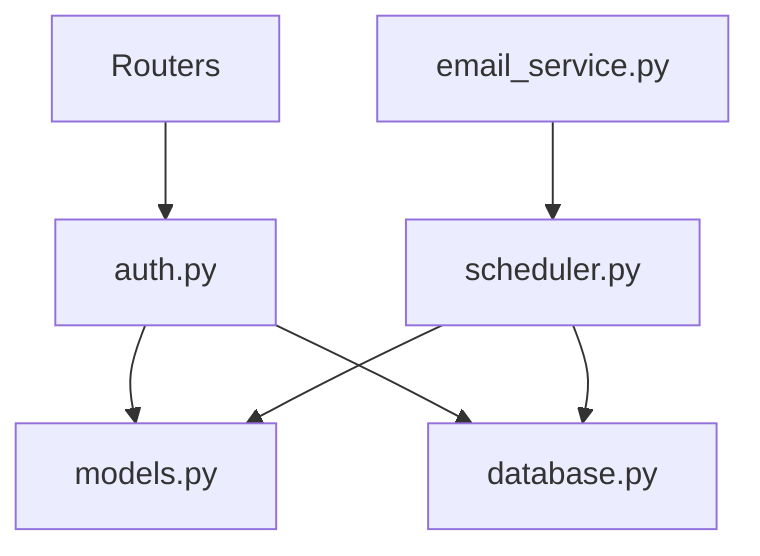

# Security Architecture

<cite>
**Referenced Files in This Document**
- [backend/main.py](file://backend/main.py)
- [backend/auth.py](file://backend/auth.py)
- [backend/models.py](file://backend/models.py)
- [backend/schemas.py](file://backend/schemas.py)
- [backend/database.py](file://backend/database.py)
- [backend/routers/patient.py](file://backend/routers/patient.py)
- [backend/routers/doctor.py](file://backend/routers/doctor.py)
- [backend/routers/appointment.py](file://backend/routers/appointment.py)
- [backend/routers/notification.py](file://backend/routers/notification.py)
- [backend/routers/prescription.py](file://backend/routers/prescription.py)
- [backend/scheduler.py](file://backend/scheduler.py)
- [backend/email_service.py](file://backend/email_service.py)
- [frontend/src/services/api.js](file://frontend/src/services/api.js)
- [frontend/src/pages/Login.jsx](file://frontend/src/pages/Login.jsx)
- [requirements.txt](file://requirements.txt)
- [.env.example](file://.env.example)
</cite>

## Table of Contents
1. [Introduction](#introduction)
2. [Project Structure](#project-structure)
3. [Core Components](#core-components)
4. [Architecture Overview](#architecture-overview)
5. [Detailed Component Analysis](#detailed-component-analysis)
6. [Dependency Analysis](#dependency-analysis)
7. [Performance Considerations](#performance-considerations)
8. [Troubleshooting Guide](#troubleshooting-guide)
9. [Conclusion](#conclusion)
10. [Appendices](#appendices)

## Introduction
This document describes the security architecture of the SmartHealthCare system. It focuses on authentication and authorization mechanisms, role-based access control (RBAC), CORS configuration, secure storage of credentials, session management, API security controls, encryption strategies for sensitive health data, secure communications, audit logging, threat modeling, security testing approaches, and compliance considerations for protecting healthcare data.

## Project Structure
The backend is a FastAPI application with modular routers for domain features (patient, doctor, appointment, notification, prescription). Authentication and authorization are centralized in the auth module and enforced via dependency injection across routers. The frontend communicates with the backend using bearer tokens stored locally and attached automatically to requests.

**Diagram sources**
- [backend/main.py](file://backend/main.py#L1-L61)
- [backend/auth.py](file://backend/auth.py#L1-L120)
- [backend/models.py](file://backend/models.py#L1-L110)
- [backend/schemas.py](file://backend/schemas.py#L1-L236)
- [backend/database.py](file://backend/database.py#L1-L22)
- [backend/routers/patient.py](file://backend/routers/patient.py#L1-L107)
- [backend/routers/doctor.py](file://backend/routers/doctor.py#L1-L120)
- [backend/routers/appointment.py](file://backend/routers/appointment.py#L1-L129)
- [backend/routers/notification.py](file://backend/routers/notification.py#L1-L177)
- [backend/routers/prescription.py](file://backend/routers/prescription.py#L1-L150)
- [backend/scheduler.py](file://backend/scheduler.py#L1-L317)
- [backend/email_service.py](file://backend/email_service.py#L1-L161)
- [frontend/src/services/api.js](file://frontend/src/services/api.js#L1-L24)
- [frontend/src/pages/Login.jsx](file://frontend/src/pages/Login.jsx#L1-L37)

**Section sources**
- [backend/main.py](file://backend/main.py#L1-L61)
- [frontend/src/services/api.js](file://frontend/src/services/api.js#L1-L24)

## Core Components
- Authentication and Authorization
  - JWT-based access tokens with HS256 signing.
  - OAuth2 password flow for token acquisition.
  - Centralized dependency to extract current user from bearer token.
- Role-Based Access Control (RBAC)
  - Users have roles: patient, doctor, admin.
  - Endpoint-level enforcement using role checks.
- Secure Storage
  - Passwords hashed with PBKDF2.
  - Tokens signed with a secret key.
- CORS and Request Filtering
  - Allowlisted origins for development.
  - Authorization header injection in frontend.
- Audit Logging
  - Application logs for startup/shutdown and operational events.
  - Scheduler logs for background tasks.
- Email Notifications
  - Optional SMTP transport for reminders.
- Data Protection
  - Sensitive health data stored in SQLite; encryption strategies are not implemented in the current codebase.

**Section sources**
- [backend/auth.py](file://backend/auth.py#L1-L120)
- [backend/models.py](file://backend/models.py#L1-L110)
- [backend/main.py](file://backend/main.py#L19-L32)
- [frontend/src/services/api.js](file://frontend/src/services/api.js#L10-L22)

## Architecture Overview
The system enforces authentication centrally and propagates user identity to all endpoints. RBAC is applied per endpoint to restrict access by role. Background jobs schedule and send notifications, with optional email delivery.

**Diagram sources**
- [backend/auth.py](file://backend/auth.py#L106-L119)
- [backend/routers/patient.py](file://backend/routers/patient.py#L11-L25)
- [frontend/src/services/api.js](file://frontend/src/services/api.js#L10-L22)

## Detailed Component Analysis

### JWT-Based Authentication Mechanism
- Token Generation
  - Access tokens are created with issuer claims and expiration.
  - Signing algorithm HS256 uses a shared secret.
- Token Validation
  - Endpoints depend on a function that decodes JWT and resolves the user.
  - Invalid or expired tokens cause 401 Unauthorized.
- Token Usage
  - Frontend stores the token and attaches it to all authenticated requests.

**Diagram sources**
- [backend/auth.py](file://backend/auth.py#L29-L55)
- [backend/auth.py](file://backend/auth.py#L106-L119)
- [frontend/src/services/api.js](file://frontend/src/services/api.js#L10-L22)

**Section sources**
- [backend/auth.py](file://backend/auth.py#L10-L13)
- [backend/auth.py](file://backend/auth.py#L29-L55)
- [backend/auth.py](file://backend/auth.py#L106-L119)
- [frontend/src/services/api.js](file://frontend/src/services/api.js#L10-L22)

### Role-Based Access Control (RBAC)
- Roles
  - Stored on the User entity; default is patient.
  - Additional roles include doctor and admin.
- Enforcement
  - Each protected route checks the current user’s role and raises 403 Forbidden if unauthorized.
  - Examples:
    - Patient endpoints enforce role "patient".
    - Doctor endpoints enforce role "doctor".
    - Prescription creation enforces role "doctor".
    - Notification creation enforces roles "doctor" or "admin".

**Diagram sources**
- [backend/routers/patient.py](file://backend/routers/patient.py#L16-L17)
- [backend/routers/doctor.py](file://backend/routers/doctor.py#L33-L34)
- [backend/routers/prescription.py](file://backend/routers/prescription.py#L18-L20)
- [backend/routers/notification.py](file://backend/routers/notification.py#L154-L161)

**Section sources**
- [backend/models.py](file://backend/models.py#L14)
- [backend/routers/patient.py](file://backend/routers/patient.py#L16-L17)
- [backend/routers/doctor.py](file://backend/routers/doctor.py#L33-L34)
- [backend/routers/prescription.py](file://backend/routers/prescription.py#L18-L20)
- [backend/routers/notification.py](file://backend/routers/notification.py#L154-L161)

### CORS Configuration and Request Filtering
- CORS
  - Origins allowlisted for local development (Vite and React ports).
  - Credentials allowed; wildcard methods and headers enabled.
- Request Filtering
  - Frontend automatically injects Authorization header for authenticated requests.
  - No explicit CSRF middleware is present; CSRF protection relies on token-based auth and same-origin policy.

**Diagram sources**
- [backend/main.py](file://backend/main.py#L19-L32)
- [frontend/src/services/api.js](file://frontend/src/services/api.js#L10-L22)

**Section sources**
- [backend/main.py](file://backend/main.py#L19-L32)
- [frontend/src/services/api.js](file://frontend/src/services/api.js#L10-L22)

### Password Hashing and Secure Storage
- Password Hashing
  - PBKDF2 is used for hashing; verified during login.
- Secure Storage
  - Hashed passwords stored in the database.
  - JWT secret is embedded in code; should be moved to environment variables in production.

**Diagram sources**
- [backend/auth.py](file://backend/auth.py#L15)
- [backend/auth.py](file://backend/auth.py#L23-L27)
- [backend/auth.py](file://backend/auth.py#L108-L109)
- [backend/models.py](file://backend/models.py#L10-L11)

**Section sources**
- [backend/auth.py](file://backend/auth.py#L15-L27)
- [backend/auth.py](file://backend/auth.py#L108-L109)
- [backend/models.py](file://backend/models.py#L10-L11)

### Session Management
- Stateless JWT Sessions
  - No server-side session store; authentication is stateless.
  - Token expiration enforced; refresh not implemented in code.
- Frontend Token Lifecycle
  - Token stored in local storage; included in all authenticated requests.

**Diagram sources**
- [backend/auth.py](file://backend/auth.py#L13)
- [frontend/src/services/api.js](file://frontend/src/services/api.js#L10-L22)

**Section sources**
- [backend/auth.py](file://backend/auth.py#L13)
- [frontend/src/services/api.js](file://frontend/src/services/api.js#L10-L22)

### API Security Measures
- Rate Limiting
  - Not implemented in the current codebase.
- Input Sanitization
  - Pydantic models define strict schemas; validated at boundaries.
- Protection Against Common Vulnerabilities
  - SQL injection: SQLAlchemy ORM queries prevent raw SQL injection.
  - XSS: No inline script execution observed; HTML templates are minimal.
  - CSRF: Absent dedicated CSRF protection; rely on token-based auth and same-origin policy.

**Diagram sources**
- [backend/schemas.py](file://backend/schemas.py#L1-L236)
- [backend/routers/patient.py](file://backend/routers/patient.py#L88-L106)
- [backend/routers/prescription.py](file://backend/routers/prescription.py#L12-L57)

**Section sources**
- [backend/schemas.py](file://backend/schemas.py#L1-L236)
- [backend/routers/patient.py](file://backend/routers/patient.py#L88-L106)
- [backend/routers/prescription.py](file://backend/routers/prescription.py#L12-L57)

### Encryption Strategies for Sensitive Health Data
- Current State
  - Health records are stored as text/JSON in the database without encryption.
- Recommendations
  - Encrypt at rest using a strong symmetric cipher with a key managed by a KMS.
  - Encrypt in transit using TLS 1.2+.
  - Implement key rotation and audit logging for cryptographic operations.

[No sources needed since this section provides general guidance]

### Secure Communication Protocols
- Transport Security
  - Use HTTPS/TLS in production; current CORS and API base URL are HTTP for development.
- Email Transport
  - SMTP with STARTTLS is used for notifications.

**Section sources**
- [backend/email_service.py](file://backend/email_service.py#L128-L131)
- [frontend/src/services/api.js](file://frontend/src/services/api.js#L3-L8)

### Audit Logging for Security Events
- Application Logs
  - Startup/shutdown events logged with timestamps and severity.
- Scheduler Logs
  - Background job execution, successes, failures, and cleanup actions are logged.
- Recommendations
  - Add structured audit logs for authentication events, authorization failures, and sensitive operations.

**Section sources**
- [backend/main.py](file://backend/main.py#L46-L56)
- [backend/scheduler.py](file://backend/scheduler.py#L51-L107)
- [backend/scheduler.py](file://backend/scheduler.py#L185-L233)
- [backend/scheduler.py](file://backend/scheduler.py#L236-L256)

### Threat Modeling and Security Testing Approaches
- Threat Modeling
  - Insufficient Privilege: Enforced via RBAC.
  - Token Theft: Mitigated by short-lived tokens and secure local storage.
  - Elevation of Privilege: Prevented by role checks in endpoints.
  - Data Exposure: Mitigate by encrypting sensitive data at rest and in transit.
- Security Testing
  - Static Analysis: Review JWT secret handling, password hashing, and CORS configuration.
  - Dynamic Analysis: Penetration testing for authentication bypasses, SQL injection, XSS, and CSRF.
  - Compliance Testing: Validate adherence to HIPAA/HITRUST controls for PHI protection.

[No sources needed since this section provides general guidance]

### Compliance Considerations for Healthcare Data Protection
- HIPAA/HITRUST
  - Implement encryption, access logging, audit trails, and secure transmission.
  - Conduct risk assessments and maintain policies for data handling.
- Data Minimization and Retention
  - Limit collection to necessary data and implement retention/cleanup policies.

[No sources needed since this section provides general guidance]

## Dependency Analysis
The authentication module is a central dependency for all routers. The database layer underpins user and health data persistence. The scheduler depends on models and database sessions to manage reminders and notifications.

**Diagram sources**
- [backend/auth.py](file://backend/auth.py#L1-L120)
- [backend/models.py](file://backend/models.py#L1-L110)
- [backend/database.py](file://backend/database.py#L1-L22)
- [backend/routers/patient.py](file://backend/routers/patient.py#L1-L107)
- [backend/routers/doctor.py](file://backend/routers/doctor.py#L1-L120)
- [backend/routers/appointment.py](file://backend/routers/appointment.py#L1-L129)
- [backend/routers/notification.py](file://backend/routers/notification.py#L1-L177)
- [backend/routers/prescription.py](file://backend/routers/prescription.py#L1-L150)
- [backend/scheduler.py](file://backend/scheduler.py#L1-L317)
- [backend/email_service.py](file://backend/email_service.py#L1-L161)

**Section sources**
- [backend/auth.py](file://backend/auth.py#L1-L120)
- [backend/routers/patient.py](file://backend/routers/patient.py#L1-L107)
- [backend/routers/doctor.py](file://backend/routers/doctor.py#L1-L120)
- [backend/routers/appointment.py](file://backend/routers/appointment.py#L1-L129)
- [backend/routers/notification.py](file://backend/routers/notification.py#L1-L177)
- [backend/routers/prescription.py](file://backend/routers/prescription.py#L1-L150)
- [backend/scheduler.py](file://backend/scheduler.py#L1-L317)
- [backend/email_service.py](file://backend/email_service.py#L1-L161)

## Performance Considerations
- Token Validation Overhead
  - Decode and DB lookup per request; optimize with caching if needed.
- Database Queries
  - Keep queries simple; avoid N+1 selects in handlers.
- Scheduler Frequency
  - Jobs run at fixed intervals; adjust cadence based on load.

[No sources needed since this section provides general guidance]

## Troubleshooting Guide
- Authentication Issues
  - 401 Unauthorized: Verify token validity and expiration; ensure Authorization header is set.
  - 403 Forbidden: Confirm user role matches endpoint requirements.
- CORS Errors
  - Ensure origin is allowlisted; credentials enabled for development.
- Email Notifications
  - If email does not send, verify environment variables and SMTP settings.

**Section sources**
- [backend/auth.py](file://backend/auth.py#L39-L55)
- [backend/routers/patient.py](file://backend/routers/patient.py#L16-L17)
- [backend/main.py](file://backend/main.py#L19-L32)
- [backend/email_service.py](file://backend/email_service.py#L20-L21)
- [backend/email_service.py](file://backend/email_service.py#L109-L138)

## Conclusion
The SmartHealthCare system implements a clear JWT-based authentication flow with centralized user resolution and role-based authorization across endpoints. While the current codebase provides a solid foundation, enhancements are recommended for production readiness: move secrets to environment variables, implement token refresh, add rate limiting, strengthen CORS and CSRF protections, encrypt sensitive health data, and establish comprehensive audit logging and compliance controls.

## Appendices

### Appendix A: Environment Variables
- Configure email transport for notifications.
- Move JWT secret to environment variables.

**Section sources**
- [.env.example](file://.env.example#L1-L13)
- [backend/email_service.py](file://backend/email_service.py#L14-L18)
- [backend/auth.py](file://backend/auth.py#L11)

### Appendix B: Dependencies Overview
- Core libraries include FastAPI, SQLAlchemy, Pydantic, passlib, python-jose, APScheduler, and python-dotenv.

**Section sources**
- [requirements.txt](file://requirements.txt#L1-L14)