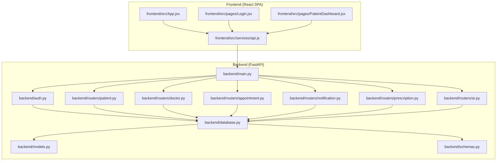
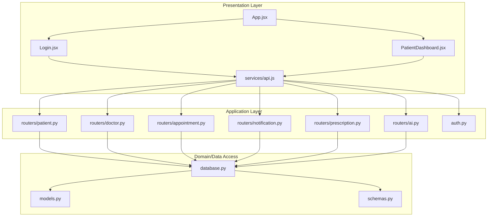
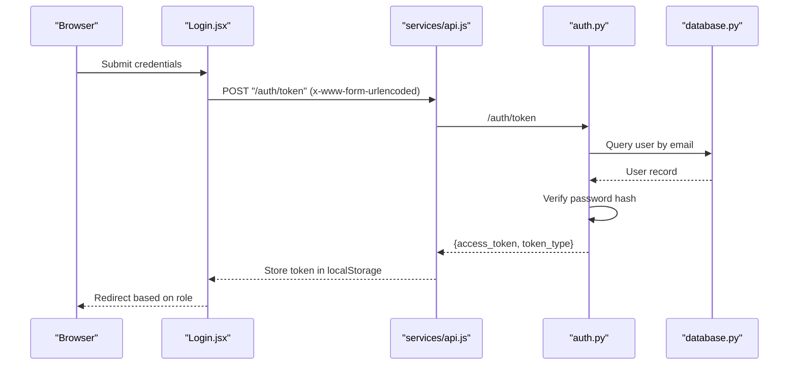
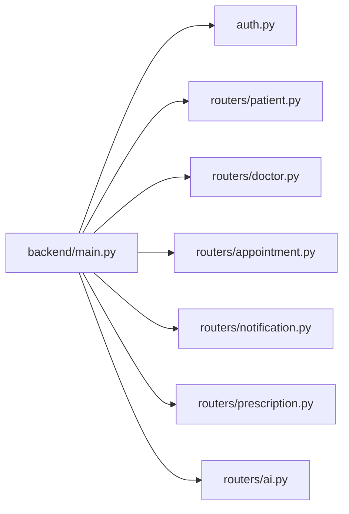
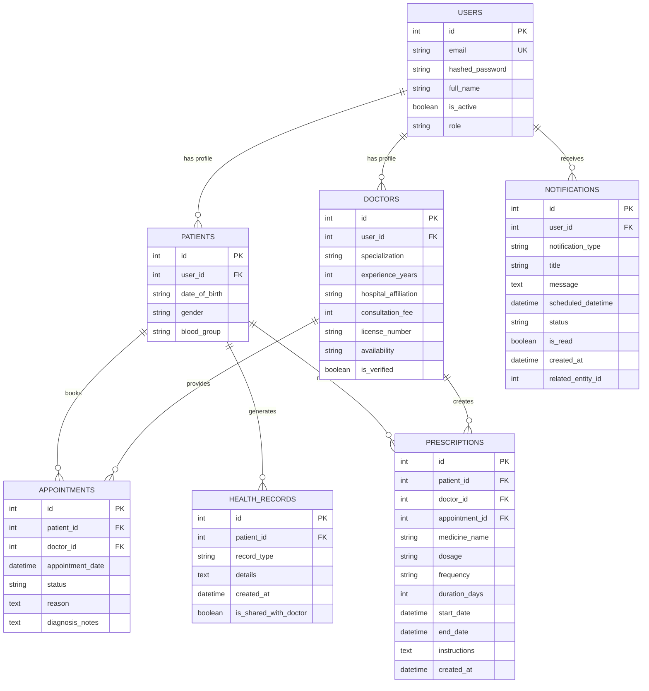
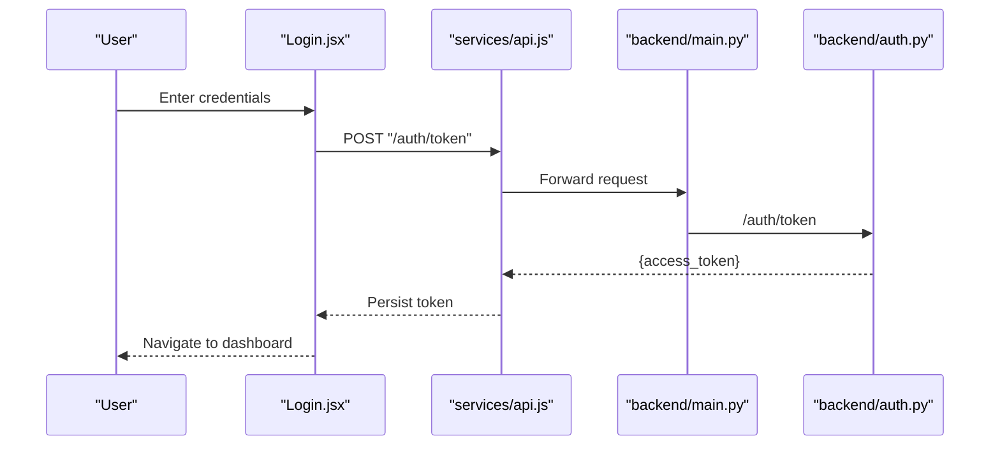
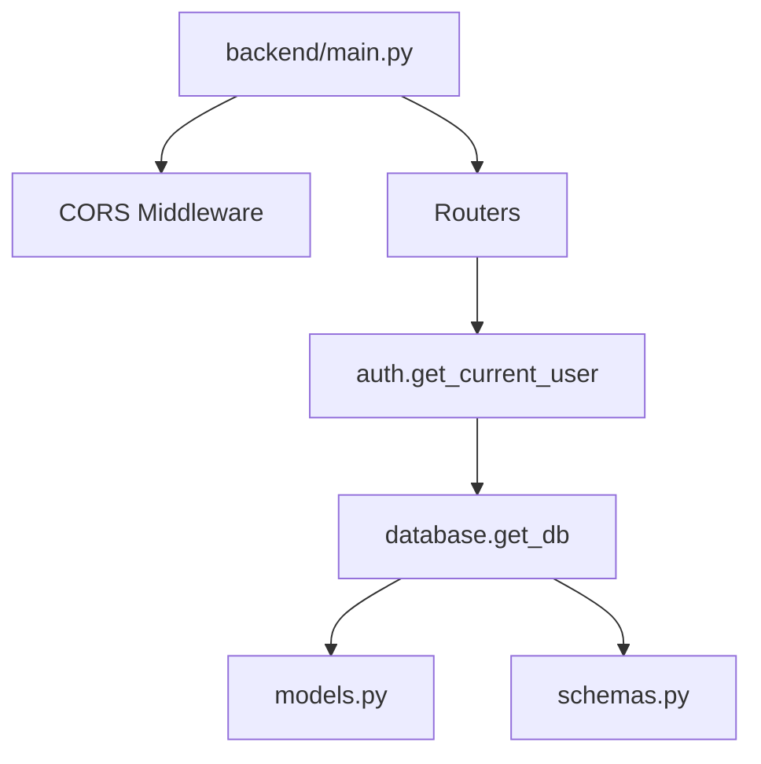
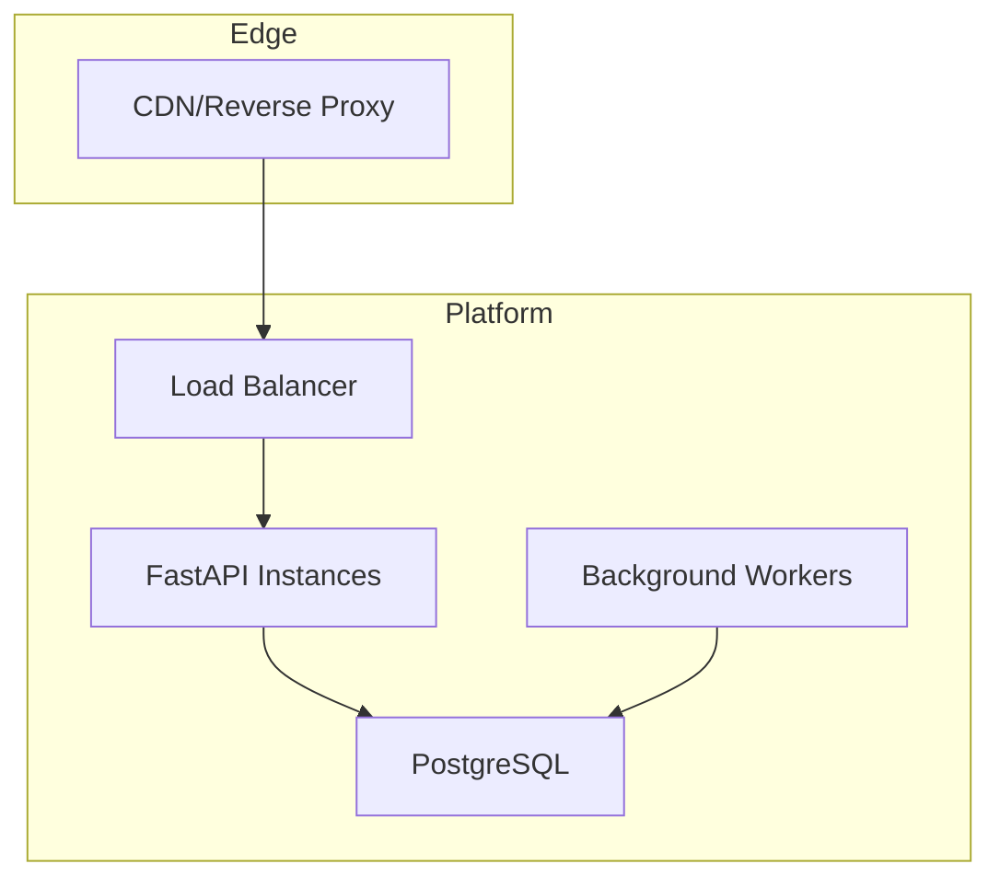

# System Architecture

<cite>
**Referenced Files in This Document**
- [backend/main.py](file://backend/main.py)
- [backend/auth.py](file://backend/auth.py)
- [backend/models.py](file://backend/models.py)
- [backend/schemas.py](file://backend/schemas.py)
- [backend/database.py](file://backend/database.py)
- [backend/routers/patient.py](file://backend/routers/patient.py)
- [backend/routers/doctor.py](file://backend/routers/doctor.py)
- [backend/routers/appointment.py](file://backend/routers/appointment.py)
- [backend/routers/notification.py](file://backend/routers/notification.py)
- [backend/routers/prescription.py](file://backend/routers/prescription.py)
- [backend/routers/ai.py](file://backend/routers/ai.py)
- [frontend/src/App.jsx](file://frontend/src/App.jsx)
- [frontend/src/services/api.js](file://frontend/src/services/api.js)
- [frontend/src/pages/Login.jsx](file://frontend/src/pages/Login.jsx)
- [frontend/src/pages/PatientDashboard.jsx](file://frontend/src/pages/PatientDashboard.jsx)
</cite>

## Table of Contents
1. [Introduction](#introduction)
2. [Project Structure](#project-structure)
3. [Core Components](#core-components)
4. [Architecture Overview](#architecture-overview)
5. [Detailed Component Analysis](#detailed-component-analysis)
6. [Dependency Analysis](#dependency-analysis)
7. [Performance Considerations](#performance-considerations)
8. [Security Architecture](#security-architecture)
9. [Scalability Considerations](#scalability-considerations)
10. [Deployment Topology](#deployment-topology)
11. [Troubleshooting Guide](#troubleshooting-guide)
12. [Conclusion](#conclusion)

## Introduction
This document describes the SmartHealthCare system architecture. It covers the frontend React Single Page Application (SPA), the backend FastAPI server, and the database layer. It explains the clean architecture approach with clear separation between presentation, business logic, and data access layers. It documents the authentication architecture using JWT tokens and role-based access control, the modular router-based API design, and component communication patterns. It also addresses scalability, security, and deployment topology.

## Project Structure
SmartHealthCare is organized into two main parts:
- Frontend: A React SPA with routing and service abstractions for API communication.
- Backend: A FastAPI application with modular routers grouped by domain resources, SQLAlchemy ORM models, Pydantic schemas, and a database configuration.

**Diagram sources**
- [backend/main.py](file://backend/main.py#L1-L61)
- [backend/auth.py](file://backend/auth.py#L1-L120)
- [backend/database.py](file://backend/database.py#L1-L22)
- [backend/models.py](file://backend/models.py#L1-L110)
- [backend/schemas.py](file://backend/schemas.py#L1-L236)
- [backend/routers/patient.py](file://backend/routers/patient.py#L1-L107)
- [backend/routers/doctor.py](file://backend/routers/doctor.py#L1-L120)
- [backend/routers/appointment.py](file://backend/routers/appointment.py#L1-L129)
- [backend/routers/notification.py](file://backend/routers/notification.py#L1-L177)
- [backend/routers/prescription.py](file://backend/routers/prescription.py#L1-L145)
- [backend/routers/ai.py](file://backend/routers/ai.py#L1-L90)
- [frontend/src/App.jsx](file://frontend/src/App.jsx#L1-L28)
- [frontend/src/services/api.js](file://frontend/src/services/api.js#L1-L25)
- [frontend/src/pages/Login.jsx](file://frontend/src/pages/Login.jsx#L1-L104)
- [frontend/src/pages/PatientDashboard.jsx](file://frontend/src/pages/PatientDashboard.jsx#L1-L674)

**Section sources**
- [backend/main.py](file://backend/main.py#L1-L61)
- [frontend/src/App.jsx](file://frontend/src/App.jsx#L1-L28)

## Core Components
- Frontend SPA
  - Routing via React Router DOM with protected routes and navigation.
  - API client built on Axios with automatic bearer token injection from local storage.
  - Pages for authentication and dashboards, integrating with backend APIs.
- Backend API
  - FastAPI application with CORS enabled for development.
  - Modular routers per resource domain (patient, doctor, appointment, notification, prescription, AI).
  - Authentication module implementing JWT-based login and user retrieval.
  - SQLAlchemy ORM models and Pydantic schemas for data representation.
  - Centralized database configuration supporting SQLite for development and PostgreSQL for production.

Key implementation references:
- Backend entrypoint and router registration: [backend/main.py](file://backend/main.py#L1-L61)
- Authentication and JWT utilities: [backend/auth.py](file://backend/auth.py#L1-L120)
- Data models: [backend/models.py](file://backend/models.py#L1-L110)
- Pydantic schemas: [backend/schemas.py](file://backend/schemas.py#L1-L236)
- Database configuration: [backend/database.py](file://backend/database.py#L1-L22)
- Router modules: [backend/routers/patient.py](file://backend/routers/patient.py#L1-L107), [backend/routers/doctor.py](file://backend/routers/doctor.py#L1-L120), [backend/routers/appointment.py](file://backend/routers/appointment.py#L1-L129), [backend/routers/notification.py](file://backend/routers/notification.py#L1-L177), [backend/routers/prescription.py](file://backend/routers/prescription.py#L1-L145), [backend/routers/ai.py](file://backend/routers/ai.py#L1-L90)
- Frontend routing and API client: [frontend/src/App.jsx](file://frontend/src/App.jsx#L1-L28), [frontend/src/services/api.js](file://frontend/src/services/api.js#L1-L25), [frontend/src/pages/Login.jsx](file://frontend/src/pages/Login.jsx#L1-L104), [frontend/src/pages/PatientDashboard.jsx](file://frontend/src/pages/PatientDashboard.jsx#L1-L674)

**Section sources**
- [backend/main.py](file://backend/main.py#L1-L61)
- [backend/auth.py](file://backend/auth.py#L1-L120)
- [backend/models.py](file://backend/models.py#L1-L110)
- [backend/schemas.py](file://backend/schemas.py#L1-L236)
- [backend/database.py](file://backend/database.py#L1-L22)
- [backend/routers/patient.py](file://backend/routers/patient.py#L1-L107)
- [backend/routers/doctor.py](file://backend/routers/doctor.py#L1-L120)
- [backend/routers/appointment.py](file://backend/routers/appointment.py#L1-L129)
- [backend/routers/notification.py](file://backend/routers/notification.py#L1-L177)
- [backend/routers/prescription.py](file://backend/routers/prescription.py#L1-L145)
- [backend/routers/ai.py](file://backend/routers/ai.py#L1-L90)
- [frontend/src/App.jsx](file://frontend/src/App.jsx#L1-L28)
- [frontend/src/services/api.js](file://frontend/src/services/api.js#L1-L25)
- [frontend/src/pages/Login.jsx](file://frontend/src/pages/Login.jsx#L1-L104)
- [frontend/src/pages/PatientDashboard.jsx](file://frontend/src/pages/PatientDashboard.jsx#L1-L674)

## Architecture Overview
SmartHealthCare follows a clean architecture approach:
- Presentation Layer (Frontend): React SPA handles UI, routing, and user interactions.
- Application Layer (Backend): FastAPI routers orchestrate requests, enforce authorization, and coordinate business actions.
- Domain and Data Access Layers (Backend): SQLAlchemy models define domain entities; Pydantic schemas define request/response contracts; database configuration abstracts persistence.

**Diagram sources**
- [frontend/src/App.jsx](file://frontend/src/App.jsx#L1-L28)
- [frontend/src/pages/Login.jsx](file://frontend/src/pages/Login.jsx#L1-L104)
- [frontend/src/pages/PatientDashboard.jsx](file://frontend/src/pages/PatientDashboard.jsx#L1-L674)
- [frontend/src/services/api.js](file://frontend/src/services/api.js#L1-L25)
- [backend/routers/patient.py](file://backend/routers/patient.py#L1-L107)
- [backend/routers/doctor.py](file://backend/routers/doctor.py#L1-L120)
- [backend/routers/appointment.py](file://backend/routers/appointment.py#L1-L129)
- [backend/routers/notification.py](file://backend/routers/notification.py#L1-L177)
- [backend/routers/prescription.py](file://backend/routers/prescription.py#L1-L145)
- [backend/routers/ai.py](file://backend/routers/ai.py#L1-L90)
- [backend/auth.py](file://backend/auth.py#L1-L120)
- [backend/models.py](file://backend/models.py#L1-L110)
- [backend/schemas.py](file://backend/schemas.py#L1-L236)
- [backend/database.py](file://backend/database.py#L1-L22)

## Detailed Component Analysis

### Authentication and Authorization
- JWT-based login generates access tokens with an expiration and includes the user role.
- The OAuth2 password flow is used for token acquisition.
- A dependency retrieves the current user from the JWT token and validates against the database.
- Role checks are enforced in routers to restrict access to endpoints.

**Diagram sources**
- [frontend/src/pages/Login.jsx](file://frontend/src/pages/Login.jsx#L1-L104)
- [frontend/src/services/api.js](file://frontend/src/services/api.js#L1-L25)
- [backend/auth.py](file://backend/auth.py#L1-L120)
- [backend/database.py](file://backend/database.py#L1-L22)

**Section sources**
- [backend/auth.py](file://backend/auth.py#L1-L120)
- [frontend/src/pages/Login.jsx](file://frontend/src/pages/Login.jsx#L1-L104)
- [frontend/src/services/api.js](file://frontend/src/services/api.js#L1-L25)

### Router-Based API Design
- The backend registers routers under distinct prefixes (/patient, /doctors, /appointments, /notifications, /prescriptions, /ai).
- Each router encapsulates CRUD and domain-specific operations, leveraging SQLAlchemy sessions and Pydantic schemas for validation and serialization.
- Authorization is applied via dependencies that extract the current user from the JWT token and enforce role-based checks.

**Diagram sources**
- [backend/main.py](file://backend/main.py#L1-L61)
- [backend/routers/patient.py](file://backend/routers/patient.py#L1-L107)
- [backend/routers/doctor.py](file://backend/routers/doctor.py#L1-L120)
- [backend/routers/appointment.py](file://backend/routers/appointment.py#L1-L129)
- [backend/routers/notification.py](file://backend/routers/notification.py#L1-L177)
- [backend/routers/prescription.py](file://backend/routers/prescription.py#L1-L145)
- [backend/routers/ai.py](file://backend/routers/ai.py#L1-L90)

**Section sources**
- [backend/main.py](file://backend/main.py#L1-L61)
- [backend/routers/patient.py](file://backend/routers/patient.py#L1-L107)
- [backend/routers/doctor.py](file://backend/routers/doctor.py#L1-L120)
- [backend/routers/appointment.py](file://backend/routers/appointment.py#L1-L129)
- [backend/routers/notification.py](file://backend/routers/notification.py#L1-L177)
- [backend/routers/prescription.py](file://backend/routers/prescription.py#L1-L145)
- [backend/routers/ai.py](file://backend/routers/ai.py#L1-L90)

### Data Models and Schemas
- SQLAlchemy models define entities (User, Patient, Doctor, Appointment, HealthRecord, Notification, Prescription) and relationships.
- Pydantic schemas define request/response contracts for endpoints, enabling validation and serialization.

**Diagram sources**
- [backend/models.py](file://backend/models.py#L1-L110)
- [backend/schemas.py](file://backend/schemas.py#L1-L236)

**Section sources**
- [backend/models.py](file://backend/models.py#L1-L110)
- [backend/schemas.py](file://backend/schemas.py#L1-L236)

### Frontend Component Communication
- The SPA uses React Router for navigation among pages.
- The API client injects the Bearer token from localStorage into outgoing requests.
- Pages consume backend endpoints for authentication, booking appointments, retrieving notifications, and accessing AI insights.

**Diagram sources**
- [frontend/src/pages/Login.jsx](file://frontend/src/pages/Login.jsx#L1-L104)
- [frontend/src/services/api.js](file://frontend/src/services/api.js#L1-L25)
- [backend/main.py](file://backend/main.py#L1-L61)
- [backend/auth.py](file://backend/auth.py#L1-L120)

**Section sources**
- [frontend/src/App.jsx](file://frontend/src/App.jsx#L1-L28)
- [frontend/src/pages/Login.jsx](file://frontend/src/pages/Login.jsx#L1-L104)
- [frontend/src/services/api.js](file://frontend/src/services/api.js#L1-L25)

## Dependency Analysis
- Backend entrypoint wires CORS, registers routers, and starts/stops a background scheduler.
- Routers depend on authentication for current user extraction and on the database session factory.
- Models and schemas are shared across routers for data validation and persistence.

**Diagram sources**
- [backend/main.py](file://backend/main.py#L1-L61)
- [backend/auth.py](file://backend/auth.py#L1-L120)
- [backend/database.py](file://backend/database.py#L1-L22)
- [backend/models.py](file://backend/models.py#L1-L110)
- [backend/schemas.py](file://backend/schemas.py#L1-L236)

**Section sources**
- [backend/main.py](file://backend/main.py#L1-L61)
- [backend/auth.py](file://backend/auth.py#L1-L120)
- [backend/database.py](file://backend/database.py#L1-L22)
- [backend/models.py](file://backend/models.py#L1-L110)
- [backend/schemas.py](file://backend/schemas.py#L1-L236)

## Performance Considerations
- Database queries should leverage indexes on frequently filtered columns (e.g., user_id, scheduled_datetime).
- Pagination and limits should be consistently applied in list endpoints to prevent large result sets.
- Caching strategies can be considered for read-heavy resources like doctor listings and static content.
- Asynchronous tasks (e.g., reminders) should be scheduled efficiently to avoid contention.

## Security Architecture
- Authentication: JWT tokens with HS256 algorithm; tokens carry user identity and role.
- Authorization: Role checks in routers (patient, doctor, admin) to restrict endpoint access.
- Transport: HTTPS should be used in production; CORS is configured for development origins.
- Secrets: The secret key is embedded in code; in production, it should be managed via environment variables and secure secret stores.

Recommendations:
- Rotate secrets regularly and store them outside the codebase.
- Enforce HTTPS and secure cookie attributes for token storage.
- Add rate limiting and input sanitization to mitigate abuse.
- Audit logs for sensitive operations and token issuance.

**Section sources**
- [backend/auth.py](file://backend/auth.py#L1-L120)
- [backend/main.py](file://backend/main.py#L1-L61)

## Scalability Considerations
- Horizontal scaling: Stateless backend allows load balancing across instances; persist sessions externally if needed.
- Database: Migrate to PostgreSQL for production; enable connection pooling and read replicas for read-heavy workloads.
- Background jobs: Offload long-running tasks (e.g., notifications) to a queue and worker processes.
- Caching: Introduce Redis for session storage and caching of frequently accessed data.
- CDN: Serve static assets via CDN to reduce origin load.

## Deployment Topology
Recommended deployment units:
- Frontend: Host static assets behind a CDN or reverse proxy.
- Backend: Run FastAPI behind a WSGI server (e.g., Uvicorn) behind a reverse proxy (e.g., Nginx).
- Database: PostgreSQL in a managed service or containerized with persistent volumes.
- Background tasks: Separate worker processes for scheduled jobs.

[No sources needed since this diagram shows conceptual deployment topology]

## Troubleshooting Guide
- Authentication failures:
  - Verify token presence and validity in localStorage.
  - Ensure the Authorization header is set by the API client.
  - Confirm the backend secret key and algorithm match expectations.
- Authorization errors:
  - Check role claims embedded in the token payload.
  - Validate router-level role checks align with user roles.
- Database connectivity:
  - Confirm the database URL and credentials.
  - Ensure migrations are applied and tables exist.
- CORS issues:
  - Verify allowed origins in the backend configuration.

**Section sources**
- [frontend/src/services/api.js](file://frontend/src/services/api.js#L1-L25)
- [frontend/src/pages/Login.jsx](file://frontend/src/pages/Login.jsx#L1-L104)
- [backend/auth.py](file://backend/auth.py#L1-L120)
- [backend/database.py](file://backend/database.py#L1-L22)
- [backend/main.py](file://backend/main.py#L1-L61)

## Conclusion
SmartHealthCare employs a clean architecture with clear separation between presentation, application, and data layers. The React SPA communicates with a modular FastAPI backend secured by JWT and role-based access control. The system’s design supports incremental enhancements for scalability, security, and operational robustness, with straightforward migration paths to production-grade infrastructure.